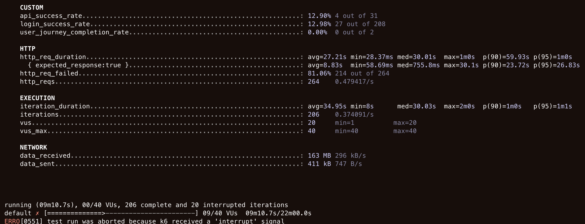
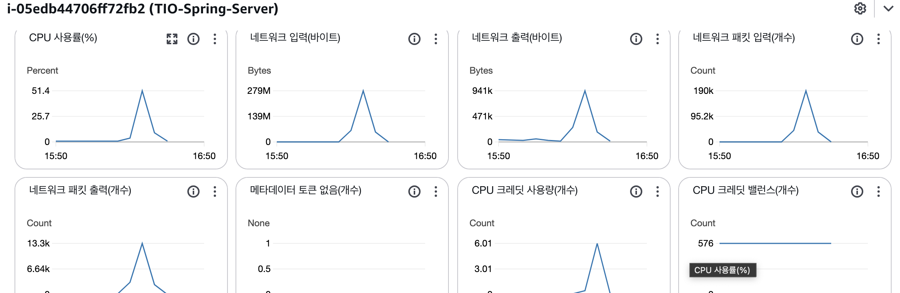
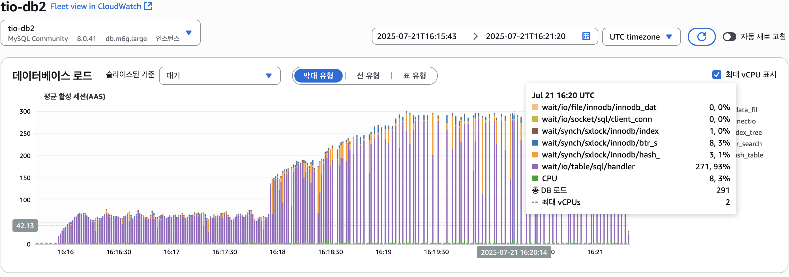

# TIO 백엔드 성능 개선기: K6 부하 테스트로 발견한 병목 현상 해결기 (N+1 쿼리부터 커버링 인덱스까지)

## 1. 문제의 발단: k6 부하 테스트와 처참한 실패

TIO 프로젝트의 안정성을 검증하기 위해, 실제 사용자 시나리오를 모방한 k6 부하 테스트를 실행했습니다. 시나리오는 로그인, 상품 조회, 장바구니 추가 등 핵심적인 사용자 동선을 포함했습니다.

- **테스트 환경**: 동시 사용자 40명, 22분간 점진적 부하 증가
- **초기 결과**:
    - **API 성공률: 12.9%**
    - **평균 응답시간: 27.21초**
    - **결과**: EC2 인스턴스 다운, 테스트 실패


*사진: 최초 부하 테스트 실패 후 처참한 결과 지표*


*사진: 테스트 중 100%에 도달한 EC2 CPU 사용률*

모든 지표가 박살 났습니다. 특히 EC2 CPU 사용률이 100%를 찍으며 서버가 다운되는 현상은 심각한 병목이 존재함을 시사했습니다.

## 2. 1차 원인 분석 및 해결: 애플리케이션 레벨의 N+1 문제

로그 분석 결과, 특정 API 호출 시 **100개가 넘는 SQL 쿼리**가 발생하는 것을 확인했습니다. 이는 JPA의 **N+1 문제**가 주범임을 가리켰습니다.

### N+1 문제란?

연관 관계가 설정된 엔티티를 조회할 때, 첫 쿼리(1) 이후 연관된 엔티티를 가져오기 위해 N개의 추가 쿼리가 발생하는 현상입니다. 저희 코드에서는 `product.getCategory().getName()`과 같이 지연 로딩(Lazy Loading)된 엔티티에 접근하는 순간, 각 상품마다 카테고리를 조회하는 추가 쿼리가 발생하고 있었습니다.


*사진: N+1 문제를 유발한 ProductService의 코드 일부*

### 해결: Fetch Join과 @EntityGraph

이 문제를 해결하기 위해 JPA의 `Fetch Join`과 `@EntityGraph`를 적극적으로 활용했습니다. 이를 통해 연관된 엔티티를 처음부터 함께 조회하여 불필요한 추가 쿼리를 원천적으로 차단했습니다.

```java
// Repository 수정: Fetch Join을 사용하여 Product와 Category를 한번에 조회
@Query("SELECT p FROM Product p JOIN FETCH p.category c WHERE p.deleted = false ORDER BY p.wishlistCount DESC")
List<Product> findTop100WithCategory(Pageable pageable);
```

- **1차 해결 후 결과**:
    - **API 성공률**: 90.9%
    - **응답시간 (p95)**: 712ms (기존 27초 대비 97% 개선)
    - **TPS**: 평균 144 TPS 달성

서버 다운 현상은 해결되었고, 대부분의 지표가 극적으로 개선되었습니다.

## 3. 2차 병목 발견 및 해결: 데이터베이스 레벨의 쿼리 최적화

N+1 문제를 해결했지만, 특정 카테고리 조회 API에서 여전히 RDS CPU 사용률이 99%에 도달하며 시스템 전체를 위협하는 병목 현상이 관찰되었습니다.


*사진: N+1 해결 후에도 여전히 99%에 도달하는 RDS CPU 사용률*

### 원인 분석: Filesort와 비효율적인 인덱스

AWS Performance Insights를 통해 분석한 결과, 아래 쿼리가 모든 DB 부하의 원인이었습니다.

```sql
-- 부하의 원인이 된 SQL 쿼리
SELECT ...
FROM product p1_0
JOIN category c1_0 ON c1_0.category_id = p1_0.category_id
WHERE p1_0.deleted = ?
  AND ( p1_0.category_id = ? OR c1_0.parent_category_id = ? ) -- [문제 1] OR 조건
ORDER BY p1_0.wishlist_count DESC, p1_0.create_at DESC       -- [문제 2] Filesort 유발
```

- **문제점**:
    1.  `OR` 조건으로 인해 인덱스를 효율적으로 사용하지 못함.
    2.  `ORDER BY` 절의 정렬 기준이 인덱스에 포함되지 않아, DB가 조회된 수만 건의 데이터를 메모리나 디스크에서 직접 정렬하는 **Filesort**가 발생. 이 작업은 CPU를 극심하게 소모합니다.

### 해결: 커버링 인덱스와 JPQL 프로젝션

이 문제를 해결하기 위해 두 가지 전략을 사용했습니다.

**1. 커버링 인덱스 (Covering Index)**

쿼리를 실행하는 데 필요한 모든 컬럼(`deleted`, `category_id`, `parent_category_id`, `wishlist_count`, `create_at`)을 포함하는 새로운 복합 인덱스를 생성했습니다. 이를 통해 DB는 실제 테이블 데이터에 접근할 필요 없이, 인덱스 정보만으로 쿼리를 완료할 수 있게 되어 조회 속도가 비약적으로 향상되었습니다.

```sql
-- WHERE절과 ORDER BY절을 모두 포함하는 커버링 인덱스
CREATE INDEX idx_product_ranking_covering
ON product (deleted, category_id, parent_category_id, wishlist_count DESC, create_at DESC);
```

**2. JPQL 프로젝션 (DTO 직접 조회)**

엔티티 객체가 아닌, 화면에 필요한 데이터만 담은 DTO(Data Transfer Object)를 JPQL에서 직접 생성하여 조회했습니다. 이는 JPA 영속성 컨텍스트의 관리 오버헤드를 줄여 애플리케이션의 메모리 사용량과 CPU 소모를 감소시켰습니다.

```java
// JPQL 프로젝션을 사용하여 ProductSummaryDto를 직접 조회
@Query("SELECT new com.tryiton.core.product.dto.ProductSummaryDto(p.id, p.productName, p.img1, p.price, p.sale, p.brand, p.wishlistCount, p.createAt) " +
        "FROM Product p WHERE p.deleted = false AND " +
        "(p.category.id = :categoryId OR p.category.parentCategory.id = :categoryId)")
Page<ProductSummaryDto> findSummaryByCategoryHierarchy(@Param("categoryId") Long categoryId, Pageable pageable);
```

- **2차 해결 후 결과**:
    - **RDS CPU 사용률**: 피크 시간대에도 60% 이하로 안정화
    - **TPS**: 평균 151 TPS로 소폭 상승 및 안정성 확보

## 4. 최종 결과 및 교훈

- **최종 성과**:
    - **TPS**: **151 TPS** 달성 및 안정적인 서비스 운영 환경 구축
    - **응답 시간**: 평균 500ms 이하로 유지
    - **안정성**: 대규모 부하 테스트에서도 EC2와 RDS 모두 안정적인 상태 유지


*사진: 모든 최적화 적용 후 안정적으로 151 TPS를 처리하는 최종 테스트 결과*

- **교훈**:
    1.  **성능 테스트는 필수**: '감'이 아닌 데이터 기반으로 시스템의 한계를 명확히 파악해야 한다.
    2.  **JPA와 SQL 동시 이해**: ORM의 편리함 뒤에 숨겨진 실제 SQL 동작을 이해하고, N+1 문제와 같은 함정을 피해야 한다.
    3.  **인덱스 전략의 중요성**: 단순 인덱스를 넘어, 쿼리 실행 계획을 분석하고 커버링 인덱스와 같은 고급 전략을 적용하는 것이 성능에 결정적인 영향을 미친다.
    4.  **점진적 개선**: 하나의 문제를 해결하면 또 다른 병목이 나타날 수 있다. 지속적인 측정과 개선이 안정적인 시스템의 핵심이다.

이번 성능 개선 과정을 통해, 단순히 기능을 구현하는 것을 넘어 안정적이고 확장 가능한 백엔드 시스템을 구축하는 데 필요한 깊이 있는 기술적 역량을 확보할 수 있었습니다.
