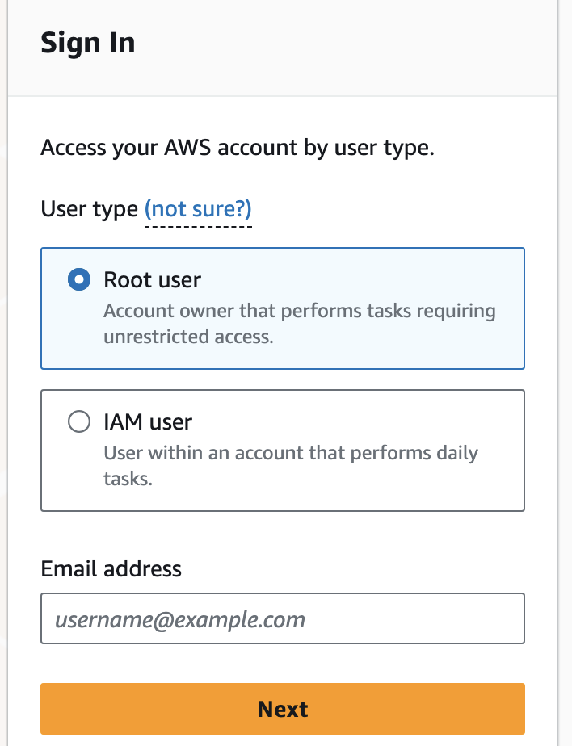
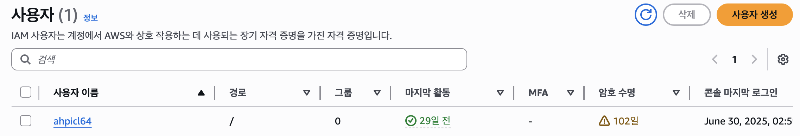
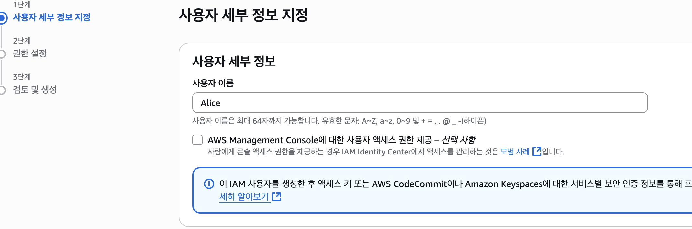
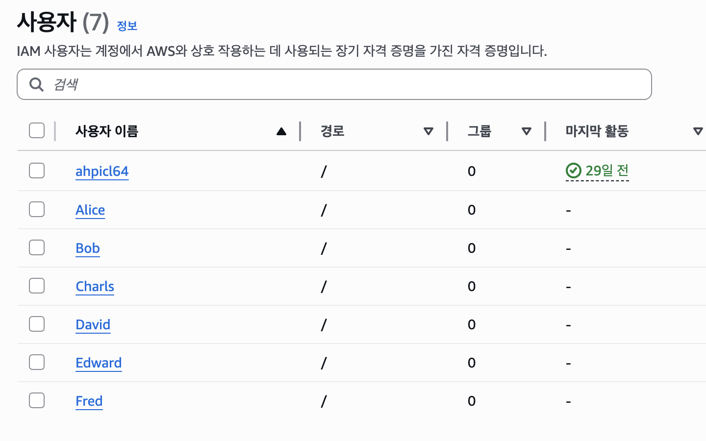
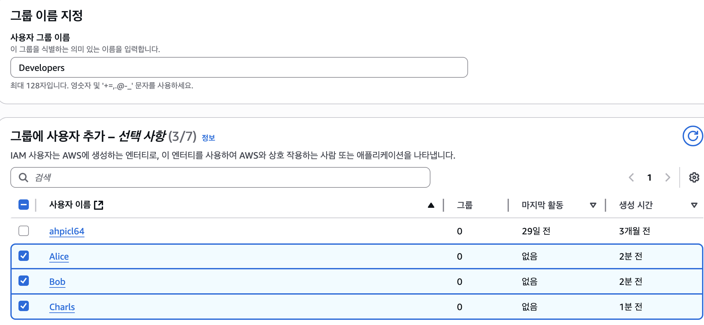
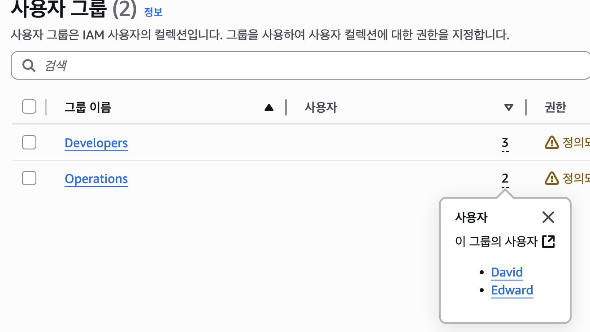
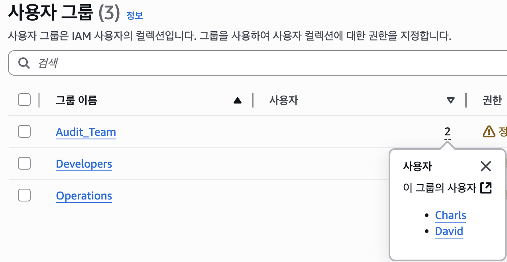
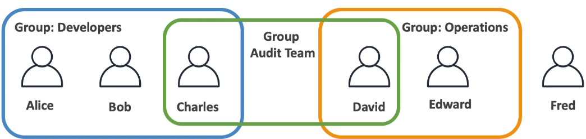
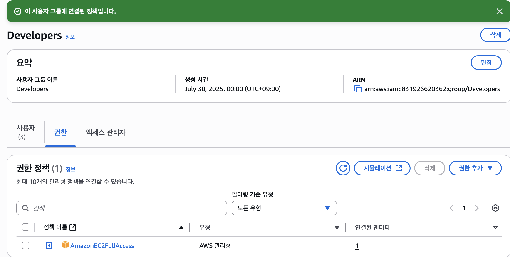
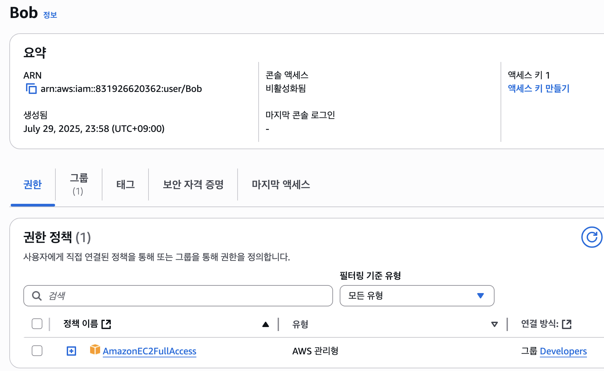

# IAM



AWS에는 총 두 가지 종류의 계정이 있다. `IAM`과 `root`다.

## root 계정

우리가 builder 콘솔에 접속하여 가입할 때 생성하고 접속에 사용했던 계정이다. 보통 이메일로 아이디가 생성되는 계정이다.

이 계정은 모든 AWS 서비스와 리소스에 대한 `완전한 액세스 권한`을 가진 하나의 로그인 ID다.

생성 이후 대부분의 작업에서는 사용하지 않는 것을 권장하며, 절대 타인과 공유해서는 안 된다.

### root 계정으로만 할 수 있는 일

모든 권한이 열려있는 계정이기 때문에, 필요한 만큼 최소권한 원칙으로 생성된 IAM 계정과 달리 root 계정으로만 할 수 있는 일들이 있다.

[출처: AWS docs '루트 사용자 자격 증명이 필요한 작업'](https://docs.aws.amazon.com/IAM/latest/UserGuide/id_root-user.html#root-user-tasks)

#### 1. 계정 관리 작업

- **AWS 계정 설정 변경**

- **AWS 계정 폐쇄**: AWS Organizations를 사용하여 집단을 관리할 때 멤버 계정을 폐쇄할 수 있다

- **IAM 사용자 권한 복원**: IAM 권한 편집 기능이 있는 관리자급 IAM 계정으로 권한을 실수로 취소한 경우, 루트 사용자로 정책 편집 및 권한 복원이 가능하다

#### 2. 청구 작업

- 청구 및 비용 관리 콘솔에 대한 IAM 권한 부여

- 일부 결제 작업: 세금 정보 설정과 같은 작업

- 특정 세금 계산서 열람: AISPL(Amazon Internet Services Private Limited)의 계산서는 IAM으로 볼 수 없다

#### 3. 기타

AWS GovCloud와 EC2 마켓플레이스 판매자 등록, KMS(Key Management Service) 키 분실 시 지원팀 지원 등이 있다.

### AWS에서 권장하는 모범 사례

root 사용자에 접근하는 대신 일상적인 작업을 위해 필요한 권한을 할당한 `관리자` 사용자를 생성하는 것이 좋다.

## 그럼 IAM은?

IAM은 Identity and Access Management의 약자로, 다양한 AWS 서비스에 `안전하게` `액세스를 제어`하기 위한 도구다.

### 사용자 생성

앞서 루트 계정을 되도록 사용하지 않는 것이 좋다고 했다.

그 대신 IAM에서 사용자를 생성해야 한다. 이 사용자는 어떤 집단이나 조직 내의 한 사람에 해당한다.


물론 콘솔로 들어가면 루트 계정 또한 사용자로 관리된다.




예를 들어 위와 같이 6명으로 구성된 회사가 있고, 각각 IAM에서 사용자를 만들어주었다.


이들은 각각 그룹으로도 묶어줄 수 있다.


개발팀, 운영팀으로 분리되어 있다면 각각 나눠서 사용자를 그룹화할 수 있다.


또한 한 사람이 두 개 이상의 그룹에도 들어갈 수 있다.

이렇게 이후에 그룹 탭에서 추가할 수도 있지만, 사용자를 생성할 때 그룹도 함께 생성하며 정책 적용을 선제적으로 할 수 있다.

이 그룹 구성을 도식화하면 아래와 같다.

[출처: Udemy lecture, © Stepahne Maarek](https://www.udemy.com/course/best-aws-certified-solutions-architect-associate/)

### 이렇게 각 사용자를 생성하고 그룹을 나누는 이유

사용자 또는 그룹에게 정책, 또는 IAM 정책(permissions)이라고 불리는 JSON을 통해 특정 사용자 혹은 특정 그룹이 어떤 작업에 대해 권한을 갖도록 선언할 수 있다.

예를 들어 Developer 그룹에게 EC2에 대한 권한, 예를 들어 `AmazonEC2FullAccess`를 적용해야 할 때 각각 개인에게 적용한다면 이후 권한을 빼거나 더해줄 때 관리가 불편하다.

> 편의상 FullAccess를 예시로 들었지만, 아래 설명할 최소 권한 적용 원칙에 따라 정말 필요한 권한만 넣어준다.
> 
> 이는 정말 많이 세분화되어 있고, 필요하다면 JSON으로 편집도 가능하다.


이렇게 `Developer` 그룹에 정책을 연결해주면


각 사용자는 그룹 권한을 상속받게 된다.

이러한 관리상의 이유로 그룹을 활용하는 것이다.

AWS는 모든 사용자에게 모든 정책을 주지 않는다. 그렇게 될 경우 허용되지 않은 서비스에 접근하여 비용 문제를 발생시키거나 보안 문제가 생길 수 있기 때문이다. 그래서 AWS에서는 `최소 권한 적용의 원칙`을 사용한다.

### 최소 권한 적용

AWS에서 강조하는 모범사례 중 하나다.

```
IAM 정책을 사용하여 권한을 설정할 때 `작업 수행에 필요한 권한`만 부여한다.

예를 들어, 사용자가 3개의 서비스를 사용해야 하면 그 서비스에 대한 권한만 생성해주는 식이다.
```

이는 관리자부터 각 기능을 사용하는 작업자에게 공통적인 내용으로, IAM 계정을 통해 필요한 만큼만 할당하고, 사용하지 않는 사용자, 역할, 권한, 정책 및 자격 증명을 정기적으로 검토해서 처리한다.

또한 정책을 세분화하여 조건문을 통해 액세스 요청이 특정 조건을 충족하는 경우에만 작업 및 리소스에 대한 액세스 권한을 부여할 수도 있다.

예를 들어 모든 요청이 TLS를 사용하여 전송되어야 하도록 조건을 적용할 수 있으며, 그 외에도 다양한 옵션이 있다.

[참고: aws docs 'IAM JSON policy elements: Condition'](https://docs.aws.amazon.com/IAM/latest/UserGuide/reference_policies_elements_condition.html)
