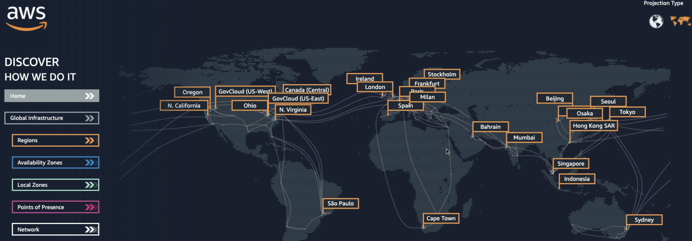
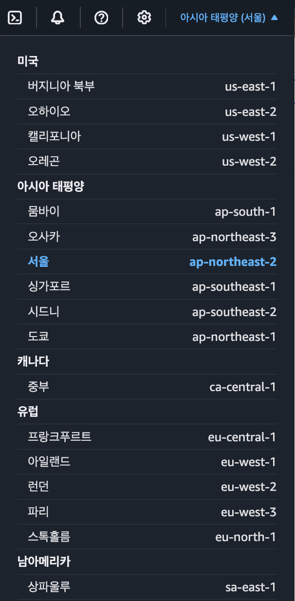
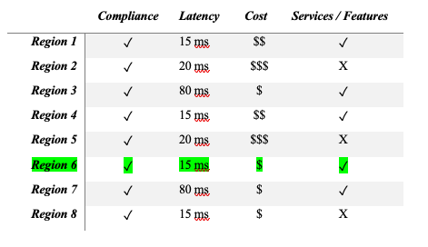
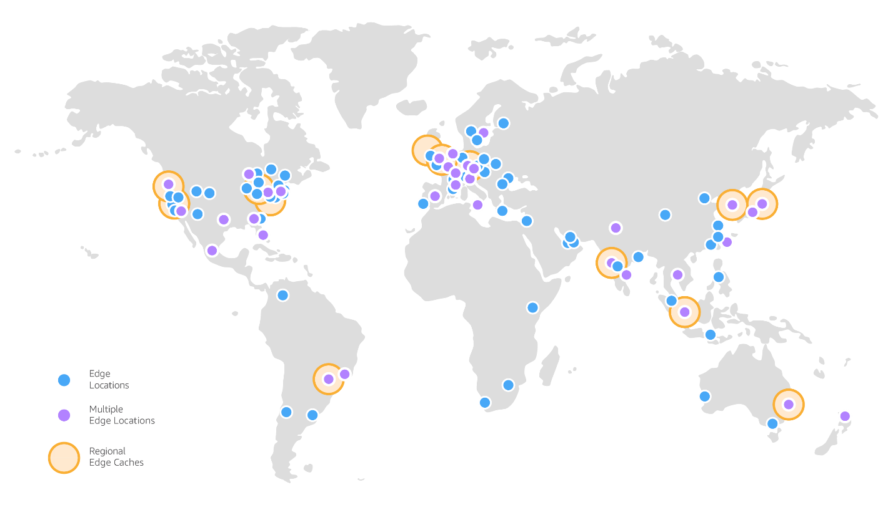

# AWS의 인프라 구조(Regions, AZ, LZ, PoP/ EdgeLocations)

지금은 없어진 지도이지만, AWS의 인프라 스트럭쳐를 가장 잘 보여주는 이미지이다.

## Regions

빌더 계정의 콘솔 상단을 눌러보면 리전의 리스트가 나온다.

(보이는게 전부가 아니다)

현재 (25년 8월) 기준, AWS는 37개의 리전을 운영중이다.

리전은 각각 고유한 이름을 가지고있는데, (ex. 서울: ap-northeast-2) 이러한 고유명칭은 코드에서 활용된다.

### 그럼 이 리전은 뭘까?

결론만 말하자면, **데이터센터를 클러스터링 한 지역**이다.

기본적으로 AWS는 리전 범위로 서비스가 제공된다.

한 리전에서 서비스를 구축하고 다른 리전에서 서비스를 구축하려고 시도한다면 새롭게 서비스를 시작하는 것과 같다.

### 리전의 선택 조건

만일 서비스를 새로 하려면 어떤 기준으로 어디의 리전을 선택할 것인가? 미국? 유럽? 아프리카?

### 고려요소

리전별 고려 요소를 보여주는 예시

1. **규정 준수**: 한 지역(국가) 내에 데이터가 해당 국가에서 관리되길 원하는 경우 혹은 법으로 규정된 경우.

   직관적인 예를 들면 우리나라도 `지도데이터 국외반출 제한법` 이 있어, 구글이나 애플에서도 꾸준히 한국의 정밀지도를(1:5000) 요구하고 있지만, 번번히 거절당하고있었으며. 최근에는 의회에서 `데이터 센터 설치 의무화` 를 법안으로 발의하기도 했다.

   

   (참고: [잇섭 영상](https://www.youtube.com/watch?v=m5f_FwHNcS8))

   또 다른 예로는 프랑스의 경우 프랑스에서 런칭중인 앱은 프랑스에서만 데이터가 있어야 한다고 한다.

2. 고객으로서의 **근접성**: latency를 줄이기 위해서 타겟 고객 계층으로부터의 물리적으로 가까워야 한다.

    극단적인 예로 한국 고객을 대상으로한 어플리케이션인데, 리전이 미국이라면 사용자가 우리 서비스를 이용하기 위해 `사용자 → 통신사 → 해저케이블 → 미국데이터센터 → 해저케이블 → 통신사 → 사용자` 와 같은 데이터 흐름이 나온다면 웃지못할 상황이 발생할 것이다.

    위와 같은경우 latency도 문제지만 통신 과정에서 발생하는 어마어마한 비용도 감당해야 할 것이다.

3. AWS의 **지원 서비스**: AWS의 모든 서비스가 모든 리전에서 사용 가능한 것은 아니다. 일부 리전에는 제공되지 않는 서비스도 있다. 그래서 특정 서비스를 사용할 때 배포하려는 region에서 사용 가능한 지 확인해야한다.

4. **가격**: 리전마다 가격이 다르다.

    결국 데이터 센터가 물리적으로 `위치` 해 있는 것이기 때문에, 현지 시장 사정에 따라(세금, 토지비용, 전기료, 광섬유 설치비용 등등) 제공되는 가격이 달라진다.

## AZ (Availablity Zones, 가용영역)

각 Region에 실제 포함되는 구성요소이다. 일반적으로 3개에서 많게는 6개 까지의 가용영역이 존재하고, 한국리전
(`ap-northeast-2`)의 경우 4개의 AZ를 포함하고있다.

`ap-northeast-2a`, `ap-northeast-2b`, `ap-northeast-2c`, `ap-northeast-2d` 이런식으로

앞의 Regions 설명에서 데이터센터를 `클러스터링` 했다고 설명한게 기억나는가? 이 AZ들은 각 독립적인 하나 또는 여러개의 데이터 센터를 의미한다.

각 가용영역의 데이터 센터의 개수는 정확히 알 수 없다

각 가용영역은 독립적인 이중화된 전원(redundent power), 네트워크 그리고 연결을 가진다. 즉 물리적으로 각 데이터센터(가용영역)은 분리되어있으며, 이는 `재해`로부터 덜 영향을 받도록 설계되어있다.

2A의 가용영역에 지진, 화재 등의 재난이 발생해도 2B 혹은 2C로는 연쇄적으로 문제가 생기지 않도록 되어있다.

가용영역 간 `높은 대역폭`과, `초-저지연 네트워킹`으로 연결되어있다. 이러한 연결로 하나의 `region`을 이루게 된다.

## PoP (Point of Presence, 접속지점) / Edge Locations

나중에 좀 더 자세히 다루겠지만, AZ에서보다 `더 빠른` 서빙을 위한 캐싱 컨텐츠들이 저장되는곳이 `엣지로케이션` 또는 `PoP`이다. 

출처: [접속지점-AWS Docs](https://docs.aws.amazon.com/ko_kr/whitepapers/latest/aws-fault-isolation-boundaries/points-of-presence.html)

AZ보다 더 작은 단위로 보면 되는데, 리전과 가용영역 외에도 추가적인 분산 네트워크를 구성하여 전 세계적인 사용자들에게 빠르게 서빙하기 위해 구성되어있다.

> 40+개 국가에 400+개의 PoP를 가지고있다

이는 캐싱 즉 CDN(Content Delivery Network) 서비스인 Amazon `CloudFront`, 퍼블릭 도메인 이름 시스템 (DNS) 확인 서비스인 Amazon `Route 53`, 엣지 네트워킹 최적화 서비스인 AWS 글로벌 액셀러레이터 (`AGA`)를 호스팅한다고 한다.

용어는 좀 찾아보니까 PoP과 엣지로케이션을 혼용해서 사용하는 것 같기도하고.. 아직 잘 몰라서 그런걸 수도있는데 일단 이정도로만 알아보겠다.

## 정리

### 리전에 국한되는 서비스는 다음과 같다

- EC2 (Infrastructure)
- Elastic Beanstalk (Platform)
- Lambda (Function)
- Rekognition (Software)

### 글로벌서비스는 다음과 같다
- IAM (Identity and Access Management)
- Route 53 (DNS)
- CloudFront (Content Delivery Network)
- WAF (Web Application Firewall)