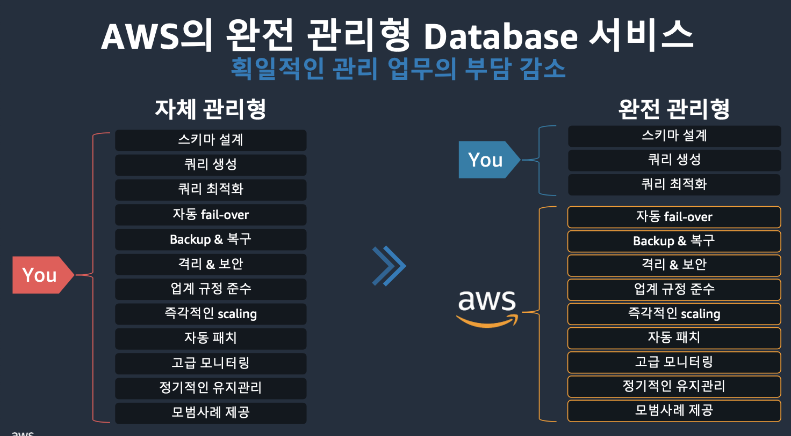
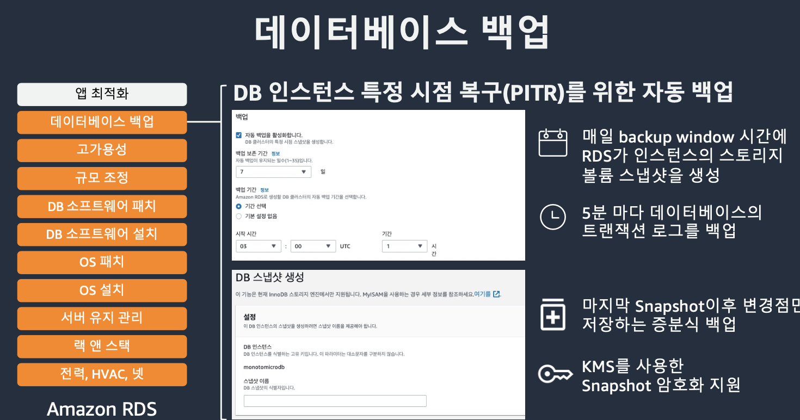

# AWS 서비스 팀 교육

# 10:00 AWS 인프라 / vpc 교육

가용영역 / 리전에 대한 개념을 잡고 있어야 나중에 사용이 용이

pop - 서버 자체는 서울에 있는데 접속하는 사람이 전세계에 있으면, 남미 -> 서울이 접속 어려울수 있기 때문에 남미에도 조그마한 서버에 만들음. 일반 사용자 지근에 조그마한 서버를 제공하는게 PoP(Points Of Presence)

리전은 고 가용성, 재난이 발생하더라도 영속적을 이루기위해 여러개의 가용영역으로 구성이 되어있음. 서울에도 리전이 있는데, 총 4개의 가용영역으로 구성. 서비스 구축시 가용영역에 걸쳐 서비스를 구축하더라도 문제가 생겼을때 지속적으로 운영이 가능.

가용영역은 최소 1개 이상의 데이터센터로 이뤄져있음

4개 리전 추가예정.

vpc / 퍼블릭서브넷(외부접속) 프라이빗 서브넷(격리)

리전서비스 영역 VPC 외부에 있는 서비스 영역 (EC2, 데이터 서비스)들을 만들게될 때 특정 리전에 종속되기 때문에. 리전에 맞게 작성해야함.
리전 종속 서비스 -> vpc , S3, DynamoDB

글로벌 서비스는 AWS Identity and Access Management, AmazonRoute 53

## VPC 구성

- 네트워크 대역 정의
  - 어떤 IP를 쓸 것인지
  - 기본적으로 내부에서 사용하는 IP **RFC1918** 대역을 사용하는것을 권장.
  - `/16`은 어떤 부분을 고정적으로, 유동적으로 사용할 수 있는 부분인데. 기본값으로 사용하는것을 권장
ipv4, ipv6에따라서 표기법이 다름.

- 가용 영역 별 서브넷 지정
  - 어떤 `서브넷`을 만들지
  - 용도와 종료에 따라 쪼개줄 수 있음

- `라우팅 테이블` 생성 및 연결
  - 서브넷 간 연결 또는 VPC 밖으로 나가야한다. 라는 트래픽을 설정
  - 그림은 10.0.0.0/16에 해당되는 ip는 내부에서 처리한다. 그 외의 것은 gateway를 통해서 외부로 보낸다~라는 내용
  - **서브넷 단위로 구성 가능**
- 트래픽 접근 제어
  - 퍼블릭은 외부 접근 가능하나. 인가되지 않은 사용자가 접근 시 보안문제가 있기 때문에 , 그러한 부분을 설정
  - 라우팅 테이블을 통해서 퍼블릭 / 프라이빗 구분
  - ex) 퍼블릭 서브넷이 --? `녹취 확인`
    - 라우팅 테이블 내에 `NAT 게이트웨이`를 설정해서 외부로 나갈 수 있게 설정
  - 
  
## DNS와 DHCP

dhcp 역할 :
dns : 리소스별로 고유한
-> 실습

## Public IP

발급 : AWS자동 발급 또는, 서버 교체하더라도 고유한 고정 IP가 필요시 EIP 사용

## 액세스 제어

VPC 접근 제어방식

## NACL(Network ACL) and 보안그룹

두 방법을 이용해서 접근제어
차이가 있음

**`NACL`**은 서브넷 단위, Inboud / Outbound 별도 설정.
**`보안그룹`**은 인스턴스 단위로(1번 서버는 A라는 사용자, 2번 서버는 B라는 사용자 등..)을 구분해서 사용자 단위 등 조건을 설정해서 보안그룹을 지정.

## 운영환경을 위한 VPC 디자인

## VPC Endpoint

S3같은 서비스는 EC2와 종종 통신하는 경우가 잇는데, VPC 외부에 있기때문에 Public 통신을 하게됨 . S3에있는 도메인에 대해서 ip를 요청.

인스턴스 내에서 라우팅 테이블에서는 해당 ip를 확인하고 Internet Gatewat(IGW)를 통해서 나가게됨.

프라이빗에서 나가는것도 동일함. NAT GW 통해서 Routing table을 보고 IGW를 통해 나감.

민감한 데이터일때는 VPC Endpoint를 사용.

### 게이트웨이 타입

S3는 GateWay VPC Endpoint를 가짐. 도메인을 요청할때 ip를 돌려주는건 동일함. 라우팅테이블을 조작하는게 다름. S3 서비스를 사용하는 모든 서비스에 대해서는 VPC 엔드포인트를 통해서 서비스에 접근할 수 있도록 구성할 수 있음.

Public을 통해 나가지 않기 때문에 보안에서 장점을 가짐.

### 인터페이스 타입

인터페이스 타입의 경우에는 외부 서비스의 접근을 요청했을 경우 Public ip를 제공하는게 아닌, dns를 저장해서 VPC를 통해 특정 IP를 제공.

# 10:30 위욱량 EC2 교육 및 실습

서버 구성 후 서비스를 하기위해서는 컴포넌트가 필요한것?
우선적으로 데이터센터가 필요함. cooling 등 조치를 위해서 큰 규모의 부지 등의 장소가 필요.
HW, Network(라우터, 스위치 등 연결), OS, Security

만든 서비스를 배포할때 글로벌 런칭을하거나 온프레미스(로컬 환경)에서와 클라우드 환경에서 배포를 비교햇을 때 실제 손익분기점은 7년정도의 차이가 난다. 불확실하고, 장기 투자를 위해서 실제 서버를 구축하는것보다는, 클라우드 환경에 인스턴스를 제공해서 해결하게됨.

## EC2

물리적인 서버에서 호스팅되는 가상 머신임. 서울 / 싱가폴 / 버지니아 / 프랑크푸르트 ... 같은 장소에 있는 장비를 자유롭게 사용할수있음.
백엔드에서 실제 API를 통해 요청하기 때문에 짧은 시간에 유기적으로 활용할 수 있음.
사용 완료시 종료 후에 사용한 만큼만 비용을 지불.

## 구성요소

다양한 OS, 아키텍쳐, 용도별 최적화(AI, GPU 메인으로 할당 등)
온디맨드 인스턴스 (기본 옵션, 사용한 만큼 비용 지출)
스팟 인스턴스(유휴 인스턴스를 활용해서 빠르게 열고 닫고, 저렴하게)
예약 인스턴스(RI, 사용 계획한 만큼 / 일정 기간 etc.. 계약을 통해서 할인 가능)

## 가상화

온프레미스(물리 서버) 위에 HV를 올리고 각 게스트머신이 올라가서 EC2 인스턴스를 제공

## OS

`amazon linux` -> 아마존에서 클라우드로 제공하기 위해서 개조한 OS / 리눅스 라이센싱 비용 불필요
나머지는 라이센싱 비용 내야함. 만일 구매한 라이센스가 있다면 Amazon에 연동해놓으면 활용 가능

## AMI (amazon machine image)

인스턴스 시작을 위한 이미지.
인스턴스에 필요한 OS, 데이터 볼륨, 어플리케이션 정보 포함됨
하나의 AMI로 여러 인스턴스를 병렬로 배포 가능

## 실행과정

필수 선택 - AMI, VPC, 서브넷, 인스턴스 타입
각 리전 배치되어있는 S3 이미지를 불러와서 EC2를 구동.

## 커스텀 생성

기본 AMI를 이용 생성.

 VPC에서 설정 추가 또는 웹서버 배포를 위한 패키지를 설치 -> 커스텀 AMI를 생성. 그럼 S3버킷에 저장되고, 이후 해당 커스텀 AMI를 불러와서 EC2를 생성할 수 있음

AMI 찾기를 통해 가져올 수 있고 my ami에서 커스텀을 보거나. 명령줄을 알고있으면 입력하면 불러올 수 잇음

## 인스턴스 스토어와 EBS

`인스턴스 스토어`는 수명주기에 맞게 임시저장소로만 사용하는걸 권장(장기적인 DB/서버로는 무리).
장기 라이브 서비스는 `EBS`를 사용. 암호화제공, SSD기반, 라이브중에 볼륨 확장 등의 변경도 가능. `스냅샷` 기능도 지원해서. `S3`버킷에 백업 가능.

## 수명주기

pending -> running : 가동 시작
on running : 실제 가동 (요금 부과)

running -> stopping : 잠시 정지, 다시 시작 가능
running -> hibernated : 절전모드. 메모리 상태가 보존됨. EBS 볼륨에 저장해서 부팅이나 어플리케이션 복구할 때 빠르게 불러올수있도록 지원.
Stop이랑 차이는 빠르게 불러올 수 있지만 EBS를 사용하기 때문에 요금이 좀 더 부과 가능.

Terminated : 인스턴스 완전 제거.

## 유형

환경 맞춰서 알잘딱

## 인스턴스 선택

## 명명 규칙

- 인스턴스 패밀리 : 범용 최적화, 컴퓨팅최적화, 메모리 최적화 등,...

- 세대 : 최신 세대일 수록 비용이 저렴.

- 추가기능

- 크기
  - 크기가 커질수록 비용이 배로 증가
  - 워크로드의 크기에 맞는 인스턴스의 크기를 적절히 설정하는게 중요

## 컴퓨팅 서비스

### ELB 로드밸런싱

수신 트래픽 자동 분산. 등록 대상의 헬스체크를 진행하며 BE 상태가 좋은쪽으로 유도.

대상은 인스턴스, 컨테이너, IP 등

다 양 함

### 오토스케일링

- `Fleet management` : 자동교체
- `Dynamic scaling` : 특정 threashold 도달시, 설정에 맞춰 Ec2를 자동 구동, 생성한 Ec2를 ELB에 포함해서 로드밸런싱을 가능

### User Data

인스턴스 구동과 함께 명령어를 실행할 수 있는 기능

### 자격증명

키페어, 관리자 암호

### 접근

ssh 등

### 모니터링 - CloudWatch

자동화 - 이슈처리, 헬스체크 등.

모든 정보를 처리해주는 것은 아니기때문에 필요에따라 구성이 별도 필요.

# 14:20 스토리지

## 스토리지 타입

오브젝트 스토리지 나오기 전까진 특정 파일들을 다 `파일 스토리지`로 넣음. 상품정보 / 사진을 파일로부터 읽어오는 구조를 가져옴.

**`오브젝트 스토리지`**가 최근 웹 급격히 발달하면서 새롭게 등장한 개념. 블록 / 파일 스토리지는 확장성 제약이 잇음. 전문적인 장비 또는 소프트웨어 기반. 증설을 위해서는 한계가 있고, 고유의 프로토콜이 있음(통신을 위한 규약 등)  
http 기반으로 데이터를 저장하기 때문에 범용성이 높고, 확장성에 제약이 없음. Icloud, 구글 드라이브 뒷단에는 오브젝트 스토리지로 구현이 되어있음. 무한정 저장할 수 있는 `확장성`. UseCase가 가장 많은 스토리지.

## 스토리지 종류

오늘은 S3 bucket이랑 EBS

EC2에는 일반적으로 EBS에 붙어서 나옴.

S3는 Simple Storage Service 약자.
EBS는 Elastic Block Storage Service

## S3

모든 종류의 데이터가 저장 가능.  
가장 싼 단가와 저장용량  

종류에 따라 많은 클래스를 제공.
주요 목적은 `비용 절감`. 사용자가 사용하는 클라우드 서비스데이터가 많아지면서 기업들은 유저데이터를 한번에 지우지 못하기 때문에. 제공하는 서비스의 데이터를 어느정도 유지해야 한다는 법적 규제가 있기 때문에, 비용을 절감하고 서비스 요건을 충족시키기 위해 다양한 종류를 제공

일반 프로젝트 사용자는 가장 왼쪽에 있는 S3 Standard면 충분

### 기능

그냥 알고만 가기

**`데이터 복제`**

예시) 여러 리전(world wide)에서 서비스 할경우, 글로벌하게 데이터를 복제해서 유저 접근성을 높이기 위해 기업측면에서 고민해보는 것.

API 통신이 기본적으로 HTTP에서 동작하기 때문에, S3는 클라우드에 데이터 올리는것과 똑같음. 프로그램적으로 코드레벨에서도 유저들이 제공하는 데이터를 볼 수 있다 라는게 렌즈.

- 스탠다드
- 오브젝트 스토리지 용어

## 블록 스토리지

시간 관계상 건너 뜁니다 :)

EBS EFS S3가 있고, ....

# 14:30 ~ 14:53 데이터베이스

스토리지랑 다른 성격을 띔.
스토리지는 시나리오에 따라 다양한 DB를 제공하며, 일반적으로 app 구성할때 DB는 다 들어가야함.  
 RDS(관계형), aurora(AWS 특화), DynamoDB(noSQL), ElastiCache (캐싱 서비스)

## 데이터베이스 관리의 어려움

 

 엔진에 대한 이해. 유지보수에 대한 이해가 필요.

그로 인해 제공하는 AWS 서비스는 아래와 같음

인프라 레벨에서의 관리는 어느정도 해줌.
개발자는 스키마 설계등의 데이터에만 집중하도록.

DB에는 다양한 엔진이 있는데, AWS에서 mySQL, noSQL 기반 다양한 엔진을 제공하고. 제품에 맞는 적절한 테이블을 만들고 서비스를 통해 유연하게 관리.

`아마존`이 DB 활용해서 비즈니스 간 효과를 보고있음

## 목적에 맞는 DB

`관계형 데이터베이스` : Aurora, RDS

`Key-Value` : DynamoDB

`ElasticCache`의 경우 어플리케이션의 서버가 좀 느리다 싶을때 최적화목적으로 사용함.

오른쪽으로 갈 수록 특화된 DB 관리지원.

## RDS

온프로미스로 하게되면 모든걸 다 관리해줘야하지만, aws의 서비스를 사용하면 많은 노력이 줄어듬.

`데이터 복제` -> 무결성이 중요. main - sub read write 별도로 운영시, write가 이뤄졌을때 정확히 동기화가 이루어져야하는데, 서비스 활용시 정확히 이뤄짐.

읽기 엔드포인트를 따로 두고 부하를 분산할 수 있음. (접속 트래픽이 많을 경우.)

**`백업`** role-back

## Aurora

## DynamoDB

RDS - DynamoDB

SQL - NoSQL 차이
**`SQL`** :

- 관계형 데이터베이스 관리 시스템(관계 정립 필요)
- key-value 쌍 설계 필요
- 수직확장

**`NoSQL`** :

- KEY만 있으면, value가 어떤게 들어가도 무관함(관계 무관)
- 성능적 안정적, 확장성 용이
- 정확히 어떤 데이터를 빼야하는지 알고 사용해야함. (자유도가 높지만, 대규모 구현 난이도가 생길 수 있음)

nosql은 지속 샤딩되서 저장되기때문에, 확장성이 용이.

### DynamoDB

유연하게 데이터를 저장 가능. but 조회에는 정확한 값을 알고 있어야함.

`Attribute D`를 기준으로 조회한다고 했을때 일부 조회가 안될 수 있기 때문에 Access Pattern을 명확히 설정해야함.

## Elastic Cache

다양한 페이지를 구성할 때, 같은 정보임에도 비슷하게 여러 사용자가 DB에 진입을 하게되면 로드가 많이 발생하기 때문에, 고정되는 잦은 페이지는 이를 Elastic Cache에 올려놓고 사용자에게 고정적으로 노출되게.

### 주요 컨셉

많은 읽고 쓰기가 반복되서 발생했을땐, 읽기 n - 쓰기 n 발생
캐싱을 하게되면 읽기 n - 쓰기 1 발생
이로 응답이 개선되고, 부하가 감소됨
`자주 접근되는 데이터를 올려놓는다` -> 캐시

세션은 여기까지 :)

# 15:00 ~ 16:00 실습 (데이터베이스) 테크니컬매니저 이재경

# 16:13 amazon Q Dev 소개

## ai assistant product 형태

- ide plugin
  - Amazon Q Developer in IDE
  - 기존 ide와 완벽한 연동. 기존 개발 습관 그대로 유지하며 빠른 적응
  - 별도 학습없이 바로 사용
- ai ide
  - KIRO (이달 내 출시 예정)
- terminal tools
  - **`Amazon Q Developer in CLI`**, claud code
  - 가장 각광받는 도구

## amazon q dev

IDE, CLI 모드 둘 다 지원
IDE모드(기존)
터미널, 쉘 환경(조금 더 최신으로 지원)
MCP 연동도 지원

## amazon q dev cli

**사용 시나리오**

- 문서 최적화 / 프로토타입 작성
- 프로젝트 관리 개발
  - 요약 분석
  - 문서 자동생성
  - 코드리뷰
  - feature 구현
- 도구 연동 운영
  - AWS CLI, Kubernetes CLI, MCP 외부 도구 연동
  - 라이브 문제 해결, 운영지원

## 수명주기 역할

- 데브옵스
  - 테라폼 스크립트 생성 이해 업데이트
  - 문제해결
  - CLI 사용속도 향상
  - IaC 코딩 가속화
  - 배포 시간 단축
  - 리소스 관련 문제 해결
- QA
  - 테스트
- 보안
  - 코드 보안 이슈 평가
  - CI/CD 파이프라인 보안 스캔
  - 통합
  - 프롬프트 관리를 통한 보안 검토 커스터마이징

## CLI를 사용한 인프라 운영 관리

## mcp /w q cli
