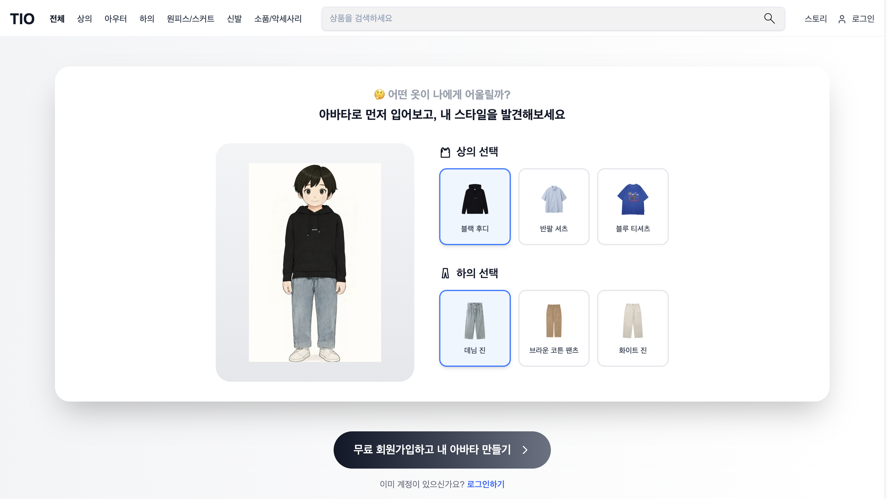
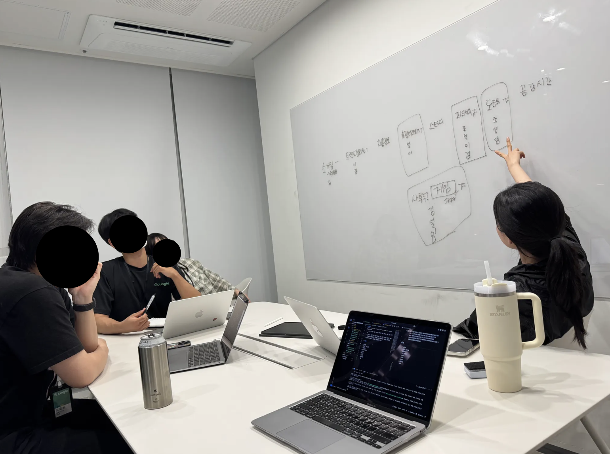

# 가상피팅으로 쇼핑에 확신을 더하다 TIO(Try-it-on)
아직 우리의 프로젝트는 끝나지 않았지만, 기억이 채 휘발되기 전에 기록합니다.



## 프로젝트 소개에 앞서
저희가 프로젝트를 시작한 배경은, 

## 시작
팀 매칭이 완료된 직후 저희 팀은 다 같이 모여 아이디어를 브레인스토밍하고 방향성을 논의했습니다.


#### **도입부 (Introduction) 구성:**

1.  **왜 이 프로젝트를 시작했나요? (Motivation):**
      * 어떤 불편함이나 문제를 해결하고 싶었나요?
      * 특정 기술을 깊게 학습하고 싶었나요? (e.g., "React의 상태 관리에 대해 깊이 파고들고 싶어 시작하게 되었습니다.")
      * 개인적인 필요 혹은 팀의 목표는 무엇이었나요?
2.  **그래서 무엇을 만들었나요? (Project Overview):**
      * 프로젝트를 한두 문장으로 명확하게 소개합니다.
      * 핵심 기능과 최종 결과물을 간략하게 보여줍니다. (완성된 서비스 스크린샷이나 GIF를 첫 부분에 넣으면 효과가 매우 좋습니다.)
3.  **이 글에서 다룰 내용:**
      * 독자들이 어떤 정보를 얻어갈 수 있는지 간략하게 안내합니다.
      * *(예시) "이 글에서는 아이디어 구상부터 기술 스택 선정 이유, 개발 과정에서 만난 난관과 해결 방법, 그리고 배포와 성능 개선 경험까지 모든 과정을 공유하고자 합니다."*

-----

### 🛠️ 2. 기획 및 설계: 탄탄한 기초 공사 과정 보여주기

코딩만 잘하는 개발자가 아니라, 생각하고 설계할 줄 아는 개발자라는 인상을 주는 중요한 파트입니다.

  * **문제 정의 (Problem Definition):** 도입부에서 언급한 문제를 좀 더 구체적으로 정의합니다. 어떤 고객/사용자의 어떤 문제를 해결하고자 했는지 명확히 합니다.
  * **목표 설정 (Goal Setting):**
      * **MVP (Minimum Viable Product, 최소 기능 제품)는 무엇이었나요?** 가장 핵심적인 기능들을 정의합니다.
      * 최종적으로 구현하고 싶었던 목표는 무엇이었나요?
  * **기술 스택 선정 이유 (Tech Stack):** **가장 중요합니다.** 왜 그 기술을 선택했는지 이유를 명확히 밝히세요.
      * *(Bad ❌) "프론트엔드는 React, 백엔드는 NestJS를 사용했습니다."*
      * *(Good ✅) "React의 컴포넌트 기반 아키텍처는 UI 재사용성을 높여줄 것이라 판단했고, 백엔드는 TypeScript를 네이티브로 지원하며 모듈식 구성이 용이한 NestJS를 선택해 유지보수성을 높이고자 했습니다."*
  * **설계 (Architecture & Design):**
      * **시스템 아키텍처 다이어그램:** 전체 시스템이 어떻게 구성되고 상호작용하는지 보여주는 간단한 그림은 천 마디 말보다 효과적입니다. (e.g., Client - Nginx - WAS - DB)
      * **DB 스키마 (ERD):** 주요 테이블과 관계를 보여주면 데이터 구조 설계 능력을 어필할 수 있습니다.
      * **API 명세:** 어떤 API 엔드포인트를 설계했는지 간략하게 보여줍니다.
      * **UI/UX 와이어프레임:** 간단한 손그림이나 Figma/Oven 링크도 좋습니다. 사용 흐름을 고민했다는 것을 보여줍니다.

-----

### 💻 3. 본격적인 개발 과정: 문제 해결 능력의 증명

가장 많은 분량을 차지하는 부분입니다. 모든 과정을 나열하기보다, **의미 있는 문제와 해결 과정을 중심으로 스토리텔링**하는 것이 중요합니다.

  * **핵심 기능 구현 (Key Features):**

      * 가장 중요하거나 복잡했던 기능 2\~3개를 선택하여 집중적으로 설명합니다.
      * **어떤 어려움이 있었나요? (Challenge):** 예상치 못한 버그, 기술적인 난관, 처음 써보는 기술의 러닝 커브 등
      * **어떻게 해결했나요? (Solution):** 공식 문서를 참고했는지, 특정 블로그 글에서 힌트를 얻었는지, 어떤 논리적 과정을 통해 해결책을 도출했는지 구체적으로 작성합니다.
      * **코드 첨부:** 전체 코드가 아닌, **핵심 로직을 담은 짧은 코드 스니펫**을 첨부하고, 각 라인이 어떤 역할을 하는지 주석이나 설명을 덧붙입니다.

    <!-- end list -->

    ```javascript
    // 사용자 검색 시, 불필요한 API 요청을 막기 위해 디바운스를 적용했습니다.
    const useDebounce = (value, delay) => {
      const [debouncedValue, setDebouncedValue] = useState(value);

      useEffect(() => {
        // delay 이후에 value를 업데이트하는 타이머 설정
        const handler = setTimeout(() => {
          setDebouncedValue(value);
        }, delay);

        // cleanup 함수: 이전 타이머를 제거하여 마지막 입력만 처리되도록 함
        return () => {
          clearTimeout(handler);
        };
      }, [value, delay]); // value나 delay가 변경될 때만 재실행

      return debouncedValue;
    };
    ```

  * **"삽질"의 기록:** 실패했던 시도나 잘못된 접근 방식도 솔직하게 공유하세요. 왜 실패했고, 그 경험을 통해 무엇을 배웠는지 작성하면 더 인간적이고 진솔한 글로 느껴집니다.

-----

### ✨ 4. 폴리싱(Polishing) 및 개선: 완성도를 높이는 디테일

'만들고 끝'이 아니라, 더 나은 결과물을 위해 노력했다는 것을 보여주는 파트입니다.

  * **테스트 (Testing):**
      * 어떤 테스트를 진행했나요? (e.g., Jest를 이용한 유닛 테스트, Cypress를 이용한 E2E 테스트)
      * 테스트 과정에서 발견한 인상 깊은 버그가 있다면 공유하는 것도 좋습니다.
  * **배포 (Deployment):**
      * 어떤 플랫폼(AWS, Vercel, Netlify 등)을 통해 배포했나요?
      * CI/CD (Github Actions 등) 파이프라인을 구축했다면 그 과정을 공유하세요. 배포 자동화 경험은 큰 강점입니다.
  * **리팩토링 (Refactoring):**
      * 성능, 가독성, 유지보수를 위해 코드를 개선한 경험을 공유합니다.
      * **Before/After 코드**를 비교해서 보여주면 효과가 극대화됩니다. 왜 바꾼 코드가 더 나은지 명확히 설명해야 합니다.
  * **성능 최적화 (Performance Optimization):**
      * Lighthouse 점수 개선, 이미지 최적화, 쿼리 튜닝, 번들 사이즈 축소 등 성능을 개선하기 위해 노력한 부분을 구체적인 수치와 함께 보여주세요.

-----

### 🚀 5. 결론 및 회고: 배움과 성장의 기록

프로젝트를 통해 얻은 것을 정리하며 글을 마무리합니다.

  * **프로젝트 요약:** 프로젝트의 목표와 최종 결과물을 다시 한번 간략하게 요약합니다.
  * **무엇을 배웠나 (Lesson Learned):**
      * **기술적 성장:** 특정 기술/프레임워크에 대한 이해도가 얼마나 깊어졌나요?
      * **비기술적 성장:** 협업 능력, 문제 해결 능력, 프로젝트 관리 능력 등 소프트 스킬 측면에서 배운 점을 언급합니다.
  * **아쉬웠던 점 및 향후 계획 (Future Plans):**
      * 시간이나 리소스 부족으로 구현하지 못한 기능은 무엇인가요?
      * 앞으로 어떤 기능을 추가하거나 개선하고 싶나요? (이는 프로젝트에 대한 애정과 책임감을 보여줍니다.)
  * **마무리 및 Call to Action:**
      * 긴 글을 읽어준 독자에게 감사 인사를 전합니다.
      * **프로젝트 GitHub 레포지토리 링크와 배포된 서비스 링크**를 반드시 첨부하세요\!
      * 피드백이나 질문을 유도하며 댓글 창을 열어둡니다.

-----

### ✍️ 추가 팁 (Pro-Tips)

  * **시각 자료 활용:** 스크린샷, GIF(화면 녹화), 다이어그램을 적극적으로 활용하여 글의 가독성을 높이세요.
  * **가독성:** 긴 문장보다는 짧은 문장, 긴 줄글보다는 글머리 기호(`-`, `*`)를 활용하세요.
  * **스토리텔링:** '나는 이런 문제를 만났고, 이렇게 고민해서, 이렇게 해결했다'는 영웅의 여정처럼 서사를 만들어보세요.
  * **맞춤법 검사:** 발행 전 반드시 맞춤법과 오탈자 검사를 진행하여 글의 신뢰도를 높이세요.

이 템플릿을 바탕으로 본인의 프로젝트 경험을 녹여내시면, 기술적 깊이와 성장 가능성을 모두 보여주는 훌륭한 개발 블로그 글을 완성하실 수 있을 겁니다. 화이팅입니다\!

