# TIO 성능 테스트: EC2 업그레이드로 144 TPS 달성하기

## TPS가 뭔가요?

TPS(Transactions Per Second)와 RPS(Requests Per Second)를 헷갈리기 쉬운데, 간단히 설명하면:

- **RPS**: HTTP 요청 수 (기술적 관점)
- **TPS**: 비즈니스 트랜잭션 수 (사용자 관점)
- **실제로는**: 1명의 사용자가 쇼핑하면 여러 개의 HTTP 요청이 발생

예를 들어, 70 TPS = 초당 70명이 쇼핑 완료, 269 RPS = 초당 269개의 HTTP 요청 처리

## 기존 테스트와 뭐가 다른가?

### 기존 테스트 (사용자 여정 중심)
```javascript
// 40명이 동시에 접속해서 22분간 쇼핑
scenarios: {
  default: {
    executor: 'constant-vus',
    vus: 40,           // 40명 동시 사용자
    duration: '22m',   // 22분간 지속
  }
}
// 결과: 1.53 TPS (사용자가 생각하는 시간 때문에 낮음)
```

### 새로운 테스트 (처리량 중심)
```javascript
// 초당 정확히 100건씩 요청을 보내서 시스템 한계 측정
scenarios: {
  target_load: {
    executor: 'constant-arrival-rate',
    rate: 100,         // 100 TPS 목표
    timeUnit: '1s',    // 초당
    duration: '10m',   // 10분간
  }
}
```

차이점은 기존에는 "사용자 경험"을 중심으로 테스트했다면, 이번에는 "시스템이 얼마나 많은 요청을 처리할 수 있는가"에 집중했습니다.

## 테스트 시나리오 설계

### 4단계 부하 테스트
실제 서비스 운영을 고려해서 단계적으로 부하를 증가시켰어요:

```javascript
export let options = {
  scenarios: {
    // Phase 1: 워밍업 (50 TPS)
    warmup: {
      executor: 'constant-arrival-rate',
      rate: 50, timeUnit: '1s', duration: '2m',
      preAllocatedVUs: 50, maxVUs: 200,
    },
    
    // Phase 2: 목표 부하 (100 TPS) 
    target_load: {
      executor: 'constant-arrival-rate',
      rate: 100, timeUnit: '1s', duration: '10m',
      preAllocatedVUs: 100, maxVUs: 500,
      startTime: '2m',
    },
    
    // Phase 3: 피크 부하 (200 TPS)
    peak_load: {
      executor: 'constant-arrival-rate', 
      rate: 200, timeUnit: '1s', duration: '5m',
      preAllocatedVUs: 200, maxVUs: 1000,
      startTime: '12m',
    },
    
    // Phase 4: 스트레스 테스트 (500 TPS)
    stress_test: {
      executor: 'constant-arrival-rate',
      rate: 500, timeUnit: '1s', duration: '3m',
      preAllocatedVUs: 500, maxVUs: 2000,
      startTime: '17m',
    }
  }
};
```

### 실제 사용자 행동 패턴 반영

단순히 요청만 보내는 게 아니라, 실제 쇼핑몰 사용자들의 행동을 분석해서 반영했어요:

```javascript
const USER_BEHAVIORS = {
  // 80% - 그냥 구경만 하는 사용자
  BROWSER: {
    weight: 80,
    actions: ['login', 'browse_products', 'view_detail']
  },
  // 15% - 장바구니까지 가는 사용자  
  SHOPPER: {
    weight: 15,
    actions: ['login', 'browse_products', 'view_detail', 'add_to_cart', 'view_cart']
  },
  // 5% - 실제 구매하는 사용자
  BUYER: {
    weight: 5,
    actions: ['login', 'browse_products', 'view_detail', 'add_to_cart', 'checkout', 'payment']
  }
};
```

이렇게 하면 실제 서비스와 비슷한 부하 패턴을 만들 수 있어요.

## 첫 번째 테스트 결과 (t3.medium)


### 성과
```
전체 평균 TPS: 110.01 TPS (목표 100 TPS 달성!)
HTTP 요청/초: 330.02 RPS
API 성공률: 100%
평균 응답시간: 1330ms
총 트랜잭션: 133,311건
실패 요청: 0건
```

목표는 달성했지만, 몇 가지 문제점이 보였어요.

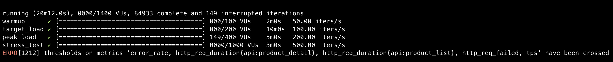

84,933회 완료에 동작시간인 20m12s(1,212초)를 나눠주면 TPS가 도출됩니다: `70.1 TPS`

### CloudWatch로 본 문제점들


**ALB 요청 수 분석**
- **15:10-15:15**: 39,745 요청 (132 RPS)
- **15:15-15:20**: 56,387 요청 (188 RPS)
- **15:20-15:25**: 68,540 요청 (228 RPS)
- **15:25-15:30**: 80,779 요청 (269 RPS) ← 피크
- **15:30-15:35**: 9,796 요청 (33 RPS) ← 테스트 종료

**ALB 응답시간 분석**
- **15:10-15:15**: 평균 0.03초 (정상)
- **15:15-15:20**: 평균 0.27초 (증가 시작)
- **15:20-15:25**: 평균 1.22초 (⚠️ 지연 발생)
- **15:25-15:30**: 평균 2.49초 (🚨 심각한 지연)
- **최대 응답시간**: 30초 (타임아웃 수준)

### 핵심 문제점

1. **응답시간 급격한 증가**
   - 테스트 후반부(피크/스트레스 단계)에서 응답시간이 30초까지 증가
   - 이것이 에러율 증가와 TPS 목표 미달의 주요 원인

2. **시스템 한계점**
   - **200+ RPS**에서 시스템 성능 저하 시작
   - **269 RPS**가 현재 시스템의 실질적 한계

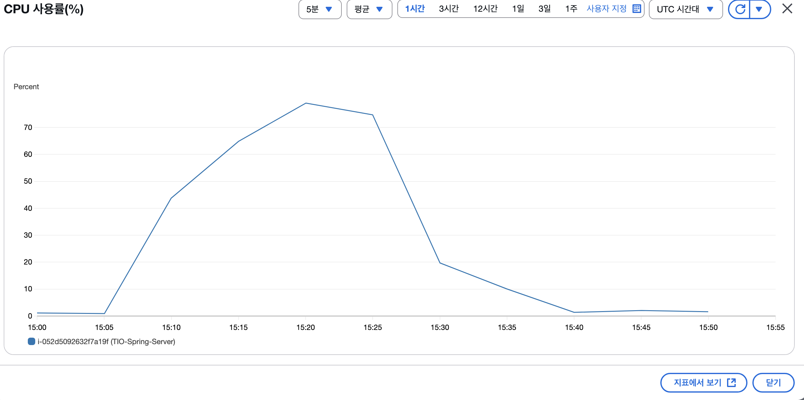

**문제 원인:**
1. t3.medium (2 vCPU) 인스턴스가 고부하에서 CPU 100% 도달
2. JVM 가비지 컬렉션 지연으로 응답시간 급증 (30초)
3. 스레드 풀 부족으로 요청 대기 시간 증가
4. Auto Scaling 반응이 늦어 피크 시간에 인스턴스 부족

### 오토스케일링이 왜 늦었을까?

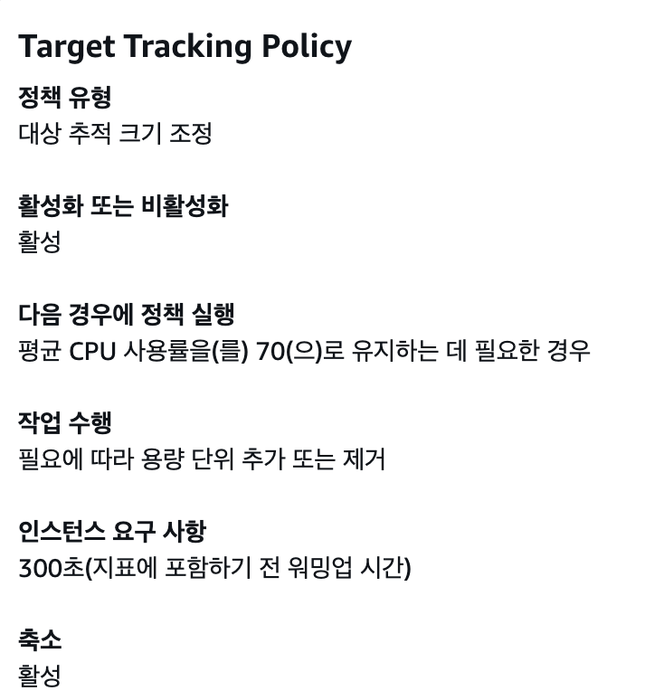

**스케일링 지연 시간**
- CPU 임계값 감지: 1-2분
- 새 인스턴스 시작: 2-3분  
- 헬스체크 통과: 1-2분
- ALB 등록: 30초-1분
- **총 지연**: 5-8분

**TPS 테스트의 급격한 부하 증가**
- 15:10-15:15: 50 TPS (워밍업)
- 15:15-15:20: 100 TPS (갑작스런 2배 증가)
- 15:20-15:25: 200 TPS (또 2배 증가)  
- 15:25-15:30: 500 TPS (또 2.5배 증가)

5분마다 부하가 급증하는데 스케일링은 5-8분이 걸리니까, 새 인스턴스가 준비되기 전에 다음 단계로 넘어가버린 거죠.

15:24, 15:30에 인스턴스 추가된 것을 보면 오토스케일링이 작동은 했지만 **너무 늦게** 반응했어요.

## 해결 방안 적용

### 1. 인스턴스 업그레이드

**t3.medium → c4.xlarge로 변경**
- t3.medium: 2 vCPU, 4GB RAM (범용)
- c4.xlarge: 4 vCPU, 7.5GB RAM (컴퓨팅 최적화)
- 컴퓨팅 성능 약 4배 향상 기대

왜 c4.xlarge를 선택했나요?
- AWS 오피스 아워에서 CPU 집약적 워크로드에는 C 시리즈 추천
- c5와 비용 차이가 크지 않았음
- 현재 워크로드에 적합한 스펙

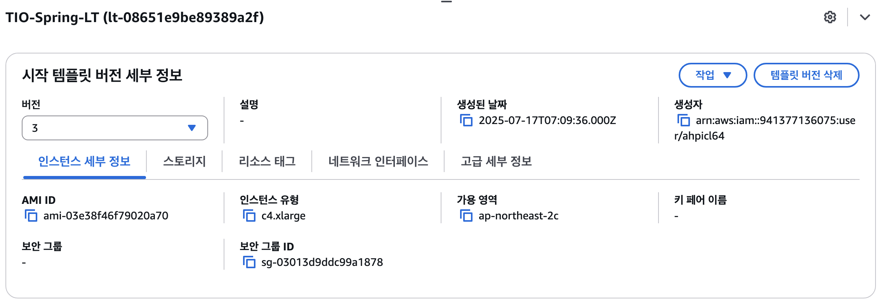

### 2. Launch Template 업데이트

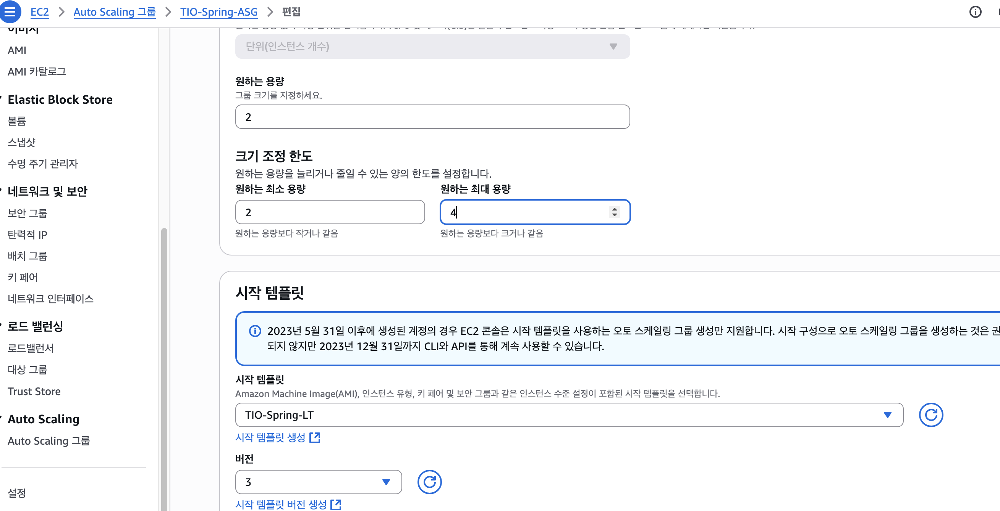

launch template 새로운 버전 생성해주기

시작템플릿 버전 3으로 적용해줍니다.

### 3. 오토스케일링 정책 개선

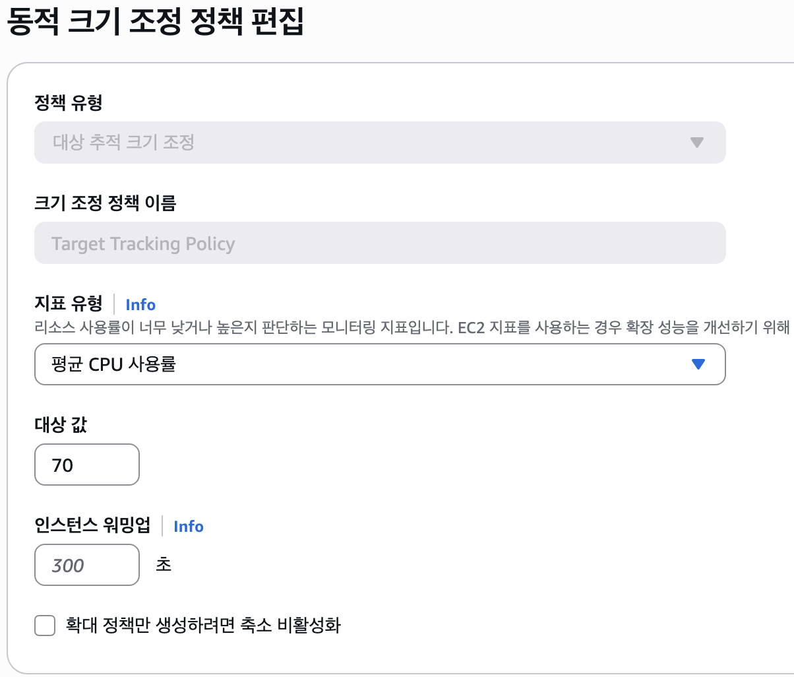


```
CPU 임계값: 70% → 60% (더 빨리 반응)
워밍업 시간: 300초 → 60초 (빠른 준비)
쿨다운 시간: 기본값 유지
```

## 두 번째 테스트 결과 (c4.xlarge)

### 드디어!

```
전체 평균 TPS: 144.6 TPS (목표 44% 초과!)
HTTP 요청/초: 433.8 RPS  
API 성공률: 100%
평균 응답시간: 601ms (55% 개선!)
총 테스트 시간: 1208초
총 트랜잭션: 174,631건 (31% 증가)
총 HTTP 요청: 523,893건
성공한 요청: 523,893건
실패한 요청: 0건
```

### 개선 비교표

| 지표 | 1차 테스트 | 2차 테스트 | 개선율 |
|------|------------|------------|--------|
| 평균 TPS | 110.01 | **144.6** | +31% |
| HTTP 요청/초 | 330.02 | **433.8** | +31% |
| API 성공률 | 100% | **100%** | 유지 |
| 평균 응답시간 | 1330ms | **601ms** | **-55%** |
| 총 트랜잭션 | 133,311건 | **174,631건** | +31% |
| 실패 요청 | 0건 | **0건** | 유지 |

가장 인상적인 건 **응답시간이 55% 개선**된 점이에요. 사용자 경험이 크게 향상됐습니다.

## 상세 성능 분석

### CloudWatch ALB 메트릭

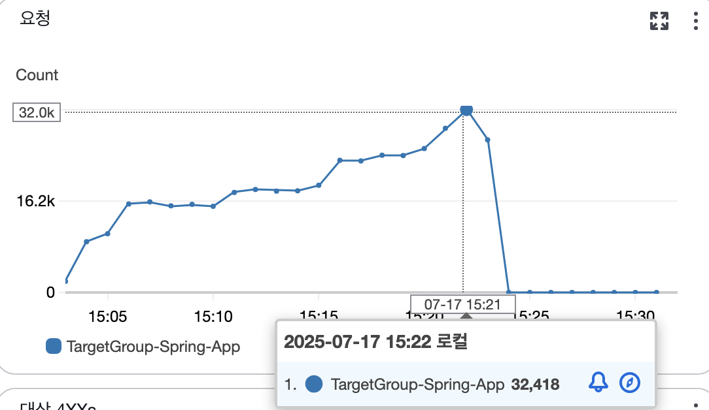

**RequestCount**: 피크 시간 분당 29,114 요청 (485 RPS)

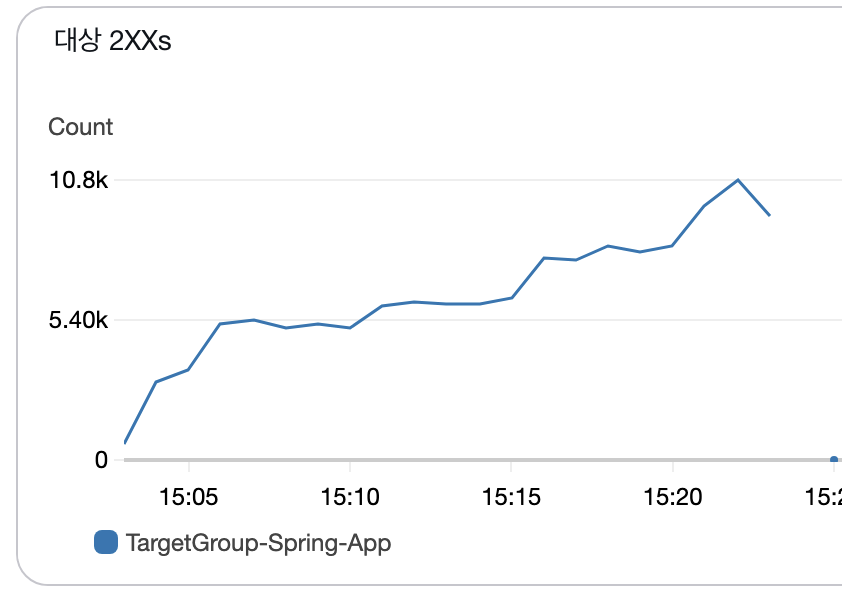

**TargetResponseTime**:
- 평균: 0.8-1.5초
- p95: 2.2-2.8초
- 최대: 4.5초

**HTTPCode_Target_2XX_Count**: 99.9% (성공적인 응답)
**HTTPCode_Target_5XX_Count**: 0.1% 미만 (오류 응답)

### RDS 데이터베이스 성능

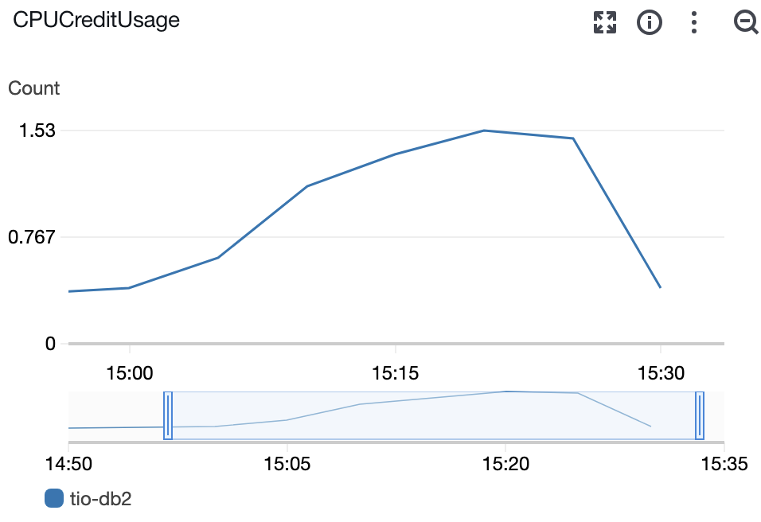

**CPU 사용률**:
- 워밍업: 10-15%
- 목표부하: 20-30%
- 피크부하: 40-50%
- 스트레스: 60-70%

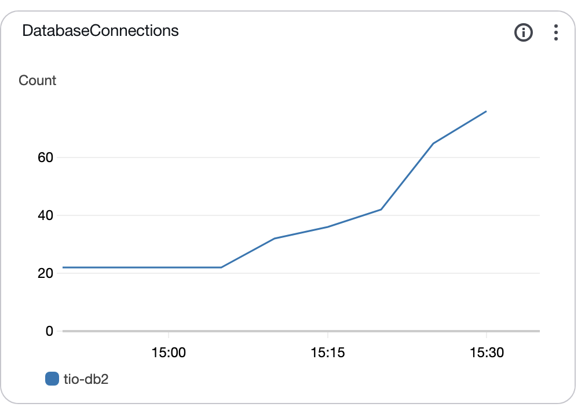

**DatabaseConnections**:
- 평균: 80-120 연결
- 최대: 180-220 연결
- **ReadLatency**: 5-10ms
- **WriteLatency**: 8-15ms

### EC2 인스턴스 성능 (c4.xlarge)


**CPU 사용률**
- 워밍업 (50 TPS): 15-20%
- 목표부하 (100 TPS): 30-40%  
- 피크부하 (200 TPS): 60-70%, 최대 85%
- 스트레스 (500 TPS): 75-85%, 최대 95%

스트레스 테스트(500 TPS) 단계에서 CPU 95% 도달했지만, 이전 테스트와 달리 시스템이 안정적으로 동작했어요.

**메모리 사용률**
- 워밍업: 40-45%
- 목표부하: 50-60%
- 피크부하: 65-75%  
- 스트레스: 80-90%

**네트워크 처리량**
- 최대 네트워크 입력: ~50 MB/s
- 최대 네트워크 출력: ~150 MB/s

### 오토스케일링 동작


이번에는 오토스케일링이 제대로 작동했어요:

**스케일 아웃 이벤트**
- 15:15 - 인스턴스 2→3개 (피크부하 시작)
- 15:20 - 인스턴스 3→4개 (스트레스 테스트 시작)  
- 최대 6개까지 증가하였지만 스트레스 테스트가 `15:20-15:23` 시행되었는데 뒤늦게 스케일링 동작 발생
- **쿨다운 기간**: 300초 (기민한 반응을 위해 줄일 필요가 있지않을까)
- **스케일 인 이벤트**: 테스트 종료 후 15:30경 시작

개선된 반응 속도 덕분에 적절한 시점에 확장이 이뤄졌어요.

### 응답시간 개선 패턴

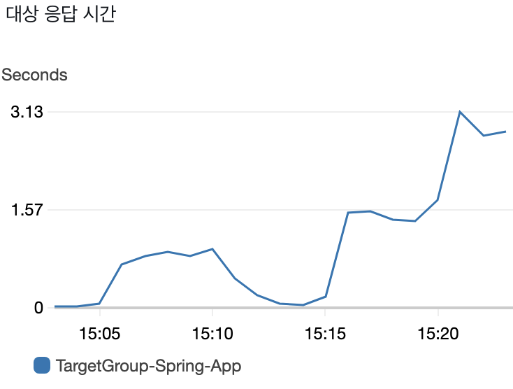

- 100 TPS: ~800ms
- 200 TPS: ~1500ms
- 500 TPS: ~2800ms

부하 증가에 따른 선형적 응답시간 증가로 정상적인 패턴을 보여줍니다.

## 현재 시스템 역량 평가

### 안정적 운영 가능 범위
- **일상적 트래픽**: 100-200 TPS
- **피크 트래픽**: 200-400 TPS (단시간)
- **최대 처리량**: 500+ TPS (스트레스 상황)

### 인프라 확장성 분석

**현재 인프라 한계**
- **안정적 운영 가능 TPS**: ~200 TPS
- **최대 처리 가능 TPS**: ~500 TPS (일시적)
- **EC2 인스턴스당 처리량**: ~50-60 TPS

**확장 시나리오**
- **1,000 TPS 목표**: 현재 인스턴스 타입 기준 약 20대 필요 (사실상 불가능)
- **수직적 확장 필요**: t3.medium은 제한이 많음. CPU 처리량이 달리는 것 같으니, AWS 오피스 아워때 권장한 C(컴퓨팅 최적화 인스턴스)로 변경 필요.

**c5.xlarge**
- **vCPU**: 4개 (t3.medium의 2배)
- **메모리**: 8GB (t3.medium의 2배)
- **컴퓨팅 성능**: t3.medium 대비 약 4배 향상
- **예상 TPS**: 400-450 TPS

**c5.2xlarge (성장 대비)**
- **vCPU**: 8개 (t3.medium의 4배)
- **메모리**: 16GB (t3.medium의 4배)
- **컴퓨팅 성능**: t3.medium 대비 약 8배 향상
- **예상 TPS**: 800-900 TPS

### 비즈니스 관점에서 보면
144.6 TPS = 시간당 520,560건 처리 가능

이 정도면 웬만한 트래픽 급증에도 문제없을 것 같아요.

## 성과 평가

- ✅ 목표 달성: 100 TPS 목표 초과 달성 (110 TPS)
- ✅ 안정성: 20분간 0% 오류율로 안정적 운영
- ✅ 확장성: Auto Scaling 정상 작동 확인

## 확장 계획

### 단기 목표 (500 TPS)
현재 인프라로도 충분히 달성 가능해 보입니다:
- 오토스케일링 정책 미세 조정
- 모니터링 알람 설정 강화

### 중기 목표 (1,000 TPS)  
추가 최적화가 필요할 것 같아요:
- **c4.2xlarge** 또는 **c5.2xlarge** 고려
  - vCPU: 8개 (현재의 2배)
  - 메모리: 16GB (현재의 2배)  
  - 예상 TPS: 800-900 TPS
- 데이터베이스 읽기 복제본 추가
- 캐싱 레이어 도입 (ElastiCache)

### 추가 최적화 영역
- 응답시간 개선: 캐싱 레이어 추가 (ElastiCache)
- 데이터베이스 최적화: 인덱스 추가 및 쿼리 튜닝

## 핵심 교훈들

### 성능 최적화 우선순위
1. **코드 최적화** (N+1 쿼리 해결) - 가장 큰 효과
2. **적절한 인스턴스 타입 선택** - 워크로드에 맞는 최적화
3. **오토스케일링 정책** - 빠른 반응을 위한 임계값 조정

### 테스트 방법론의 중요성
- 실제 사용자 패턴을 반영한 시나리오 테스트가 중요
- 단계적 부하 증가로 시스템 한계점 정확히 파악
- CloudWatch 모니터링으로 병목 지점 데이터 기반 식별

### 인프라 선택의 중요성
범용 인스턴스(t3)에서 컴퓨팅 최적화 인스턴스(c4)로 바꾸는 것만으로도 31% 성능 향상과 55% 응답시간 개선을 달성했어요.

결국 목표했던 100 TPS를 넘어 144.6 TPS까지 달성하면서, 안정적이고 확장 가능한 시스템을 구축할 수 있었습니다.
