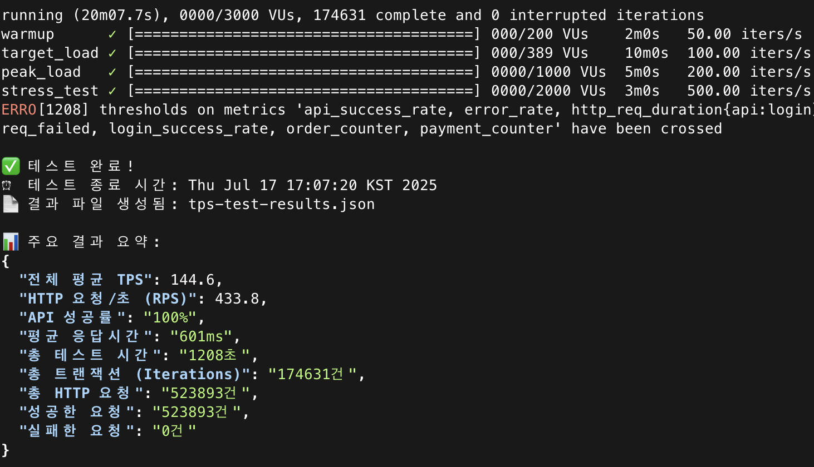
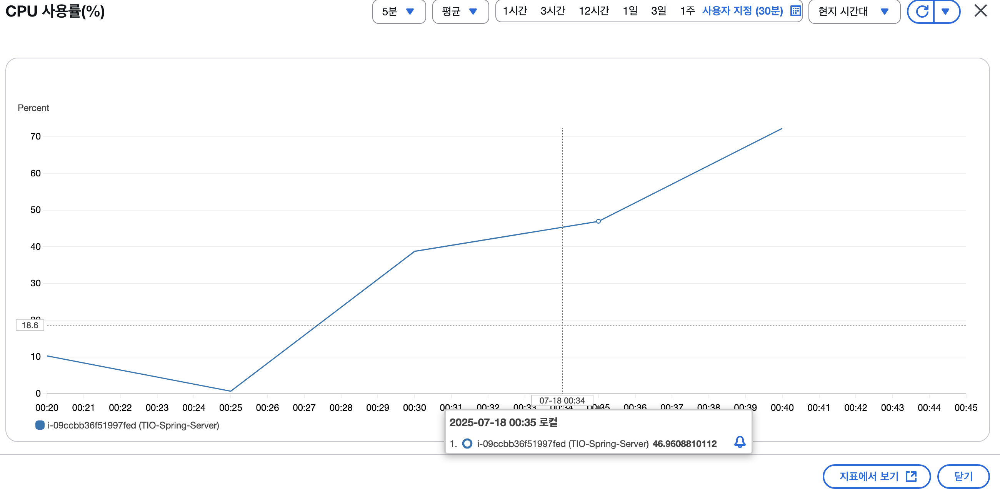
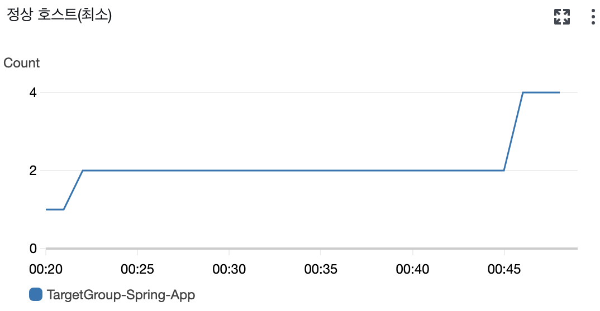
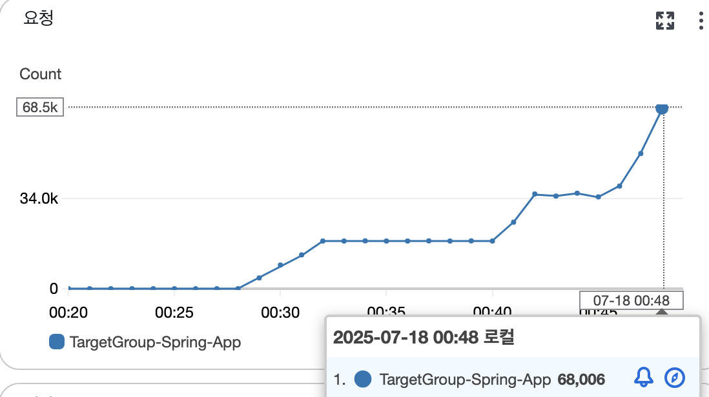
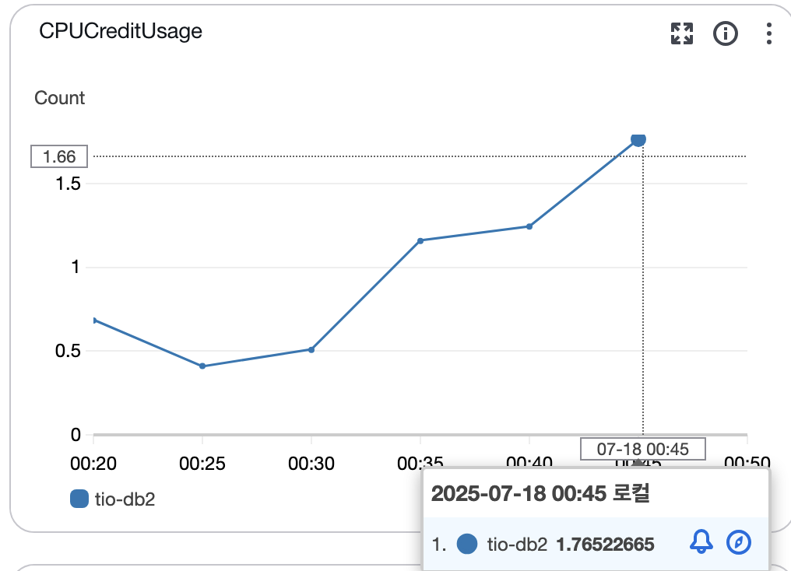
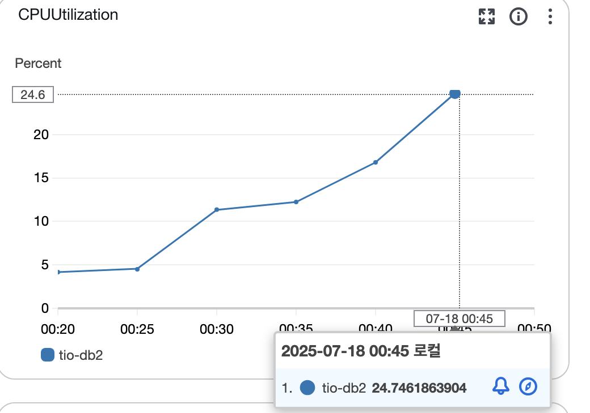
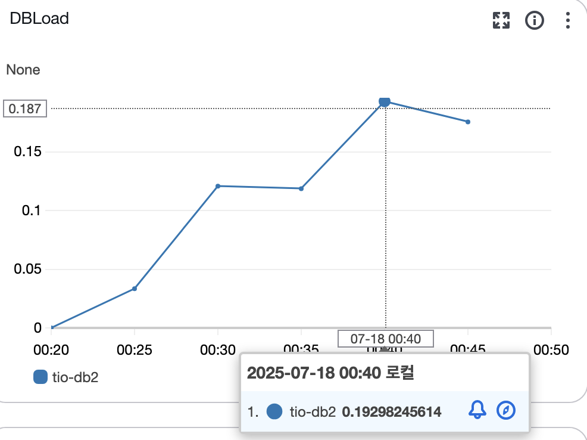
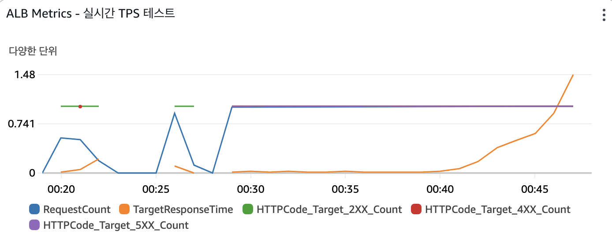
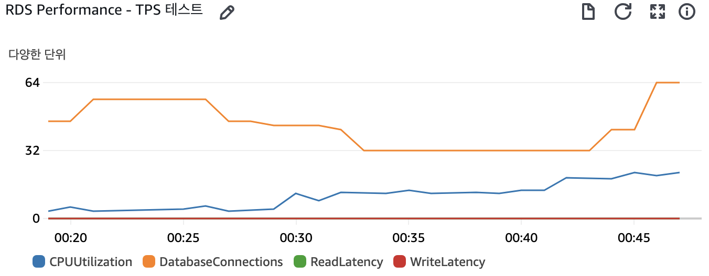

# 데이터베이스 액세스 최적화 (144.6 → 151 TPS) (1)

## 1.1 N+1 쿼리 문제 해결

- 문제점: 인기 상품 목록을 조회할 때, 각 상품의 카테고리 정보를 가져오기 위해 상품 개수(N)만큼 추가 쿼리가 발생하는 N+1 문제가 있었습니다.
- 해결 조치:
    1. ProductRepository에 JOIN FETCH를 사용하는 JPQL 쿼리(findTop100WithCategory)를 추가했습니다. 이 쿼리는 상품을 조회할 때 연관된 카테고리 정보까지 한 번의 쿼리로 함께 가져옵니다.
    2. ProductService의 getTopRankedProducts 메소드가 기존 findTop100... 메소드 대신 새로 추가한 findTop100WithCategory 메소드를 사용하도록 수정하여 불필요한 추가 쿼리를 제거했습니다.

## 1.2 배치 처리 최적화

- 문제점: 여러 개의 상품을 한 번에 주문하는 등, 다수의 데이터를 데이터베이스에 저장할 때 각 INSERT 쿼리가 개별적으로 전송되어 비효율적이었습니다.
- 해결 조치:
    - application.properties 파일에 아래의 Hibernate 배치 처리 옵션을 추가했습니다.
    - 이제부터 여러 데이터를 저장할 때, Hibernate가 쿼리를 모아 한 번에 전송하여 네트워크 오버헤드를 줄이고 성능을 향상시킵니다.

```java
spring.jpa.properties.hibernate.jdbc.batch_size=50
spring.jpa.properties.hibernate.order_inserts=true
spring.jpa.properties.hibernate.order_updates=true
```

위 두 가지 조치를 통해 데이터베이스 접근과 관련된 성능 개선 작업을 완료했습니다.

## 테스트하기

### 이전 결과 (144.6 TPS)



### 결과 (151 TPS)

```java
./run-tps-test.sh
🚀 TryItOn TPS 기반 성능 테스트 시작
======================================
⏰ 테스트 시작 시간: Fri Jul 18 00:29:28 KST 2025

📊 테스트 단계:
  Phase 1: 워밍업     - 50 TPS  (2분)
  Phase 2: 목표부하   - 100 TPS (10분)
  Phase 3: 피크부하   - 200 TPS (5분)
  Phase 4: 스트레스   - 500 TPS (3분)
  총 예상 시간: 20분

📈 실시간 모니터링:
  AWS CloudWatch 대시보드에서 다음 지표를 확인하세요:
  - ALB 응답시간 및 에러율
  - EC2 CPU/메모리 사용률
  - RDS 커넥션 수 및 쿼리 성능

🎯 K6 TPS 테스트 실행 중...

         /\      Grafana   /‾‾/  
    /\  /  \     |\  __   /  /   
   /  \/    \    | |/ /  /   ‾‾\ 
  /          \   |   (  |  (‾)  |
 / __________ \  |_|\_\  \_____/ 

     execution: local
        script: k6-tps-performance-test.js
        output: -

     scenarios: (100.00%) 4 scenarios, 3000 max VUs, 20m30s max duration (incl. graceful stop):
              * warmup: 50.00 iterations/s for 2m0s (maxVUs: 50-200, gracefulStop: 30s)
              * target_load: 100.00 iterations/s for 10m0s (maxVUs: 100-500, startTime: 2m0s, gracefulStop: 30s)
              * peak_load: 200.00 iterations/s for 5m0s (maxVUs: 200-1000, startTime: 12m0s, gracefulStop: 30s)
              * stress_test: 500.00 iterations/s for 3m0s (maxVUs: 500-2000, startTime: 17m0s, gracefulStop: 30s)

WARN[0892] Insufficient VUs, reached 1000 active VUs and cannot initialize more  executor=constant-arrival-rate scenario=peak_load
WARN[1028] Insufficient VUs, reached 2000 active VUs and cannot initialize more  executor=constant-arrival-rate scenario=stress_test
INFO[1208] 
=== TPS 기반 성능 테스트 결과 ===                     source=console
INFO[1208] {
  "TPS 성능 테스트 결과": {
    "전체 평균 TPS": 151.21,
    "HTTP 요청/초 (RPS)": 453.62,
    "API 성공률": "100%",
    "평균 응답시간": "492ms",
    "총 테스트 시간": "1208초",
    "총 트랜잭션 (Iterations)": "182617건",
    "총 HTTP 요청": "547851건",
    "성공한 요청": "547851건",
    "실패한 요청": "0건"
  },
  "테스트 성과": {
    "워밍업 (50 TPS)": "✅ 완료",
    "목표부하 (100 TPS)": "✅ 완료",
    "피크부하 (200 TPS)": "✅ 완료",
    "스트레스 (500 TPS)": "✅ 완료",
    "전체 평균": "151.21 TPS 달성"
  }
}  source=console

running (20m07.7s), 0000/3000 VUs, 182617 complete and 0 interrupted iterations
warmup      ✓ [======================================] 000/186 VUs    2m0s   50.00 iters/s
target_load ✓ [======================================] 000/350 VUs    10m0s  100.00 iters/s
peak_load   ✓ [======================================] 0000/1000 VUs  5m0s   200.00 iters/s
stress_test ✓ [======================================] 0000/2000 VUs  3m0s   500.00 iters/s
ERRO[1208] thresholds on metrics 'api_success_rate, error_rate, http_req_duration{api:login}, http_req_duration{api:product_list}, http_req_failed, login_success_rate, order_counter, payment_counter' have been crossed 

✅ 테스트 완료!
⏰ 테스트 종료 시간: Fri Jul 18 00:49:36 KST 2025
📄 결과 파일 생성됨: tps-test-results.json

📊 주요 결과 요약:
{
  "전체 평균 TPS": 151.21,
  "HTTP 요청/초 (RPS)": 453.62,
  "API 성공률": "100%",
  "평균 응답시간": "492ms",
  "총 테스트 시간": "1208초",
  "총 트랜잭션 (Iterations)": "182617건",
  "총 HTTP 요청": "547851건",
  "성공한 요청": "547851건",
  "실패한 요청": "0건"
}

🔍 다음 단계 권장사항:
  1. CloudWatch 대시보드에서 시스템 리소스 사용량 확인
  2. 에러율이 높다면 로그 분석 필요
  3. 목표 TPS 달성 못했다면 인프라 스케일링 고려
  4. 성공적이라면 프로덕션 배포 준비
```

















## 결과 비교

| 지표 | 이전 결과 | 현재 결과 | 개선율 |
| --- | --- | --- | --- |
| 평균 TPS | 144.6 TPS | 151 TPS | +4.4% |
| HTTP 요청/초 | 433.8 RPS | 453.62 RPS | +4.5% |
| API 성공률 | 100% | 100% | 유지 |
| 평균 응답시간 | 601ms | 492ms | -18% |
| 총 트랜잭션 | 174,631건 | 182,617건 | +4% |
| 실패 요청 | 0건 | 0건 | 유지 |

## Redis 캐싱 설정 충돌

현아가 준비한 추천 알고리즘 구현을 위해 redis 캐싱된 데이터를 기반으로 ramda로 각 개인화 가중치 알고리즘을 구현했는데, 내가 서버 전반적인 elasticmemory(redis)를 적용하면서 설정이 충돌하였다.

충돌한 부분은 추천 알고리즘은 기대한 직렬화 ↔ 역직렬화로 가져오는 방식이 단순한 string 방식인데, 내가 구현한 방식은 jackson을 활용한 방식(구조체 그대로 가져온다고 한다)이라 그 부분에 대해서 바로잡느라 고생했다.

1단계: 역직렬화 오류 수정 (TypeReference 적용)

- 문제: getSharedData("trending", List.class)와 같이 제네릭 타입 정보가 없는 클래스를 사용해 데이터를 조회하여, Jackson 라이브러리가 리스트의 내용물을 정확한 객체(Product)로 변환하지 못하는 문제가 있었습니다.
- 조치: new TypeReference<List<Product>>() {}를 사용하여, 리스트에 담긴 객체가 Product 타입임을 명확히 알려주어 역직렬화가 정확하게 이루어지도록 수정했습니다.

2단계: 캐시 데이터 오염 방지

- 문제: getTrendingProducts 메소드는 List<LambdaBatchDto>를, getTrendingProductsAsEntity 메소드는 List<Product>를 동일한 캐시 키(`shared:trending`)에 저장하면서 데이터 타입 충돌 및 오염을 일으키는 근본적인 원인을 발견했습니다.
- 조치: 호환성을 위해 존재하던 getTrendingProductsAsEntity 메소드에서 캐시를 저장(saveSharedData)하는 로직을 제거하여, 더 이상 shared:trending 키의 데이터를 오염시키지 않도록 수정했습니다.

3단계: 안전한 타입 변환 적용 (ClassCastException 해결)

- 문제: Redis에서 가져온 원시 데이터(List<LinkedHashMap>)를 (List<LambdaBatchDto>)와 같이 불안전하게 직접 형 변환하여 ClassCastException이 발생하는 문제를 확인했습니다.
- 조치: objectMapper.convertValue()를 사용하여, 어떤 형태의 데이터든 목표하는 객체 리스트(List<LambdaBatchDto>)로 명시적이고 안전하게 변환하도록 서비스 내 모든 관련 코드를 리팩토링했습니다.

4단계: 오염된 캐시 데이터 수동 삭제

- 문제: 위 3단계의 조치로 새로운 데이터가 잘못 저장되는 것은 막았지만, 이미 Redis에 저장되어 있던 오래되고 오염된 데이터가 계속해서 문제를 일으켰습니다.
- 조치: EC2 인스턴스에 직접 접속하여 redis-cli를 통해 문제가 되는 캐시 키(shared:trending)를 `DEL` 명령어로 수동 삭제했습니다. 이를 통해 오염된 데이터를 완전히 제거하고, 애플리케이션이 DB에서 새로운 데이터를 가져와 올바른 형태로 캐시를 재생성하도록 유도했습니다.