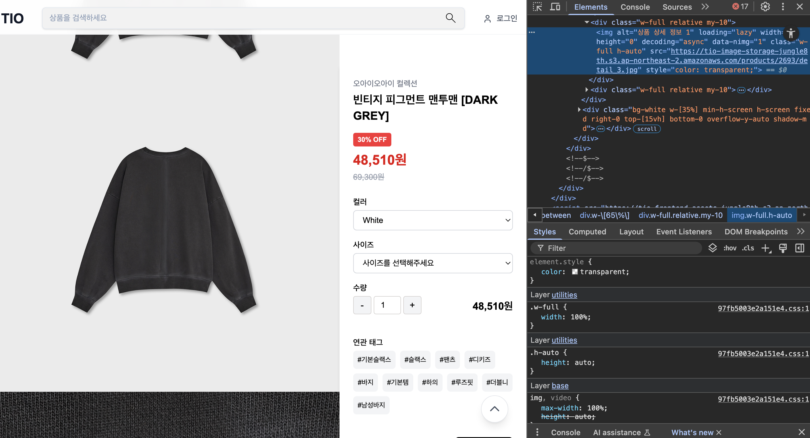
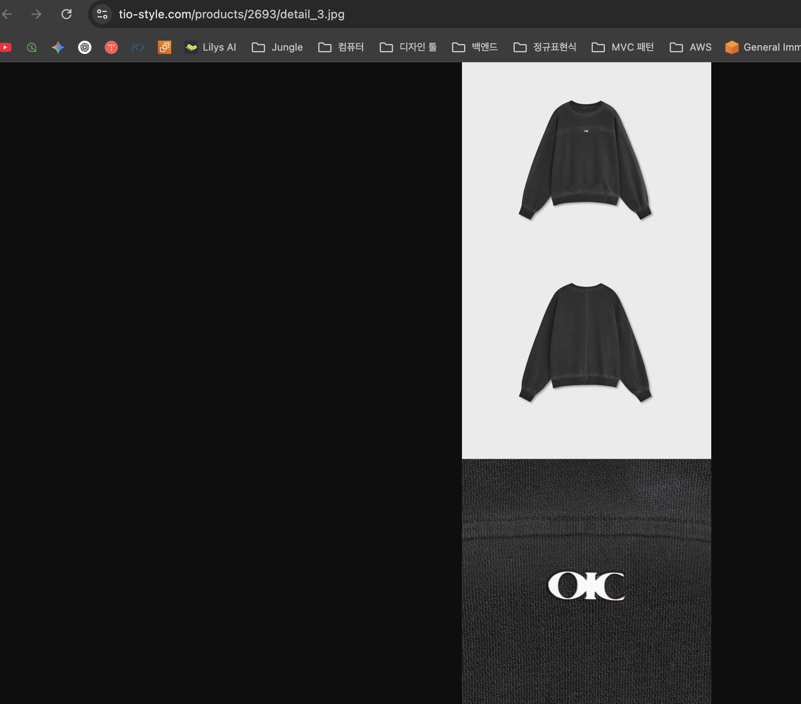

# 상세이미지 버킷 링크 노출 (1)



이미지 정보를 확인해보면, 이미지가 저장되는 S3버킷 링크(`tio-image-storage-jungle8th.s3~~`)가 그대로 노출이된다.

CloudFront 설정이 되어있어서 도메인으로 감춰져야할텐데 왜그럴까?

## 현재 CloudFront 설정

배포 정보:

- **도메인:** [tio-style.com](http://tio-style.com/), [www.tio-style.com](http://www.tio-style.com/)
- **CloudFront URL:** [d1vke19yqieoiy.cloudfront.net](http://d1vke19yqieoiy.cloudfront.net/)
- **상태:** Deployed

Origin 설정:

1. [tio-image-storage-jungle8th.s3.ap-northeast-2.amazonaws.com](http://tio-image-storage-jungle8th.s3.ap-northeast-2.amazonaws.com/) (이미지 버킷)
2. [tio-frontend-assets-jungle8th.s3.ap-northeast-2.amazonaws.com](http://tio-frontend-assets-jungle8th.s3.ap-northeast-2.amazonaws.com/) (프론트엔드 자산)
3. [tio-alb-173623777.ap-northeast-2.elb.amazonaws.com](http://tio-alb-173623777.ap-northeast-2.elb.amazonaws.com/) (ALB)

Cache Behavior:

- /results/* → 이미지 버킷으로 라우팅 ✅
- /images/* → 프론트엔드 자산 버킷으로 라우팅
- /api/* → ALB로 라우팅
- 기본 → ALB로 라우팅

## 🤔 문제점 발견

현재 문제:

- 상품 이미지 경로가 `/products/*`인데
- CloudFront에서는 `/results/*만 이미지 버킷으로 라우팅`됨*
- *따라서 `/products/* 경로는 ALB로 가서` 직접 S3 URL이 노출됨

## 🛠️ 해결 방법

Cache Behavior 추가 필요:

```java
{
"PathPattern": "/products/*",
"TargetOriginId": "[tio-image-storage-jungle8th.s3.ap-northeast-2.amazonaws.com](http://tio-image-storage-jungle8th.s3.ap-northeast-2.amazonaws.com/)"
}
```

이렇게 하면 [https://tio-style.com/products/2693/detail_3.jpg로](https://tio-style.com/products/2693/detail_3.jpg%EB%A1%9C) 접근 가능하고 S3 URL이 숨겨지게된다.

