# 성능 분석하기 (w/ grafana K6) 실패기 (1)

## 배경

`나만의 무기 만들기` 폴리싱 주간의 목적에 맞게, 현재 상태에서 성능 혹은 기능의 scale up 또는 scale out을 해야한다. 

현재까지 도출한 TO-DO는 아래와 같다.

```sql
python Fast API 비동기 처리 구현 (try-on) - 성광
검색엔진 구현 - 시현
try-on 알고리즘 구현 - 윤호
개인화 추천상품 알고리즘 구현 - 현아
TIO 어플리케이션 성능개선 - 재홍
```

어쩌다 성능 개선을 해야한다고 생각했냐면..

## nGrinder 찍어먹기

일전에 가볍게 **nGrinder**로 `메인 페이지` , `상세 제품 페이지` , `검색 페이지` 를 Get 요청하는 단순한 테스트를 수행했었다. (약 5회 VUSER max 150, 200, 500, 1,000, 2,000 / Duration 5min)

```python
**각 테스트 별 Response time

Main Page Products API** 
200명: 3-100ms
400명: 26-128ms
800명: 48-123ms
1000명: 42-108ms
2000명: 1-317ms

**Product Detail API**
200명: 357-2,099ms (이미 느림)
400명: 310-2,973ms (3초까지 증가)
600명: 1,318-3,993ms (4초까지 폭증)
1000명: 4,099-16,685ms (최대 17초!)
2000명: 최대 17,265ms (17초 이상!)

**Search Page API**  (중간 성능)
200-600명: 대부분 0 (테스트 안됨)
800명: 784-2,081ms (2초 수준)
1000명: 937-1,434ms (1-1.4초)
2000명: 1,396-8,146ms (최대 8초)
```

단순한 페이지 호출임에도 불구하고, 인원이 증가함에 따라서 큰 편차가 나타나는 것을 보고 “병목”이 발생하는구나. 상세페이지에서 오는 차이가 뭐지? 로 찾아보니 복잡한 쿼리문으로 한번에 호출함으로써 `N+1 문제` 가 발생하는 것을 알 수 있었다.

## 그래서 우리는 성능 개선이 필요하다?

성능 개선의 지표를 얻기위해 `성능 테스트` 를 수행해서 before(현재) 상태의 데이터를 취득하고,

유의미한 개선을 일으킬수 있는 변화들을 준 뒤에 테스트를 함으로써 점진적으로 발전하는것을 계획중이다

## 어떤걸 개선할 것인가?

1. DB 인덱스 최적화
    1. N+1 문제 해결
    2. 커넥션 풀 최적화
    3. 읽기 전용 RDS 도입
2. Spring 애플리케이션 최적화
    1. try-on 비동기 처리
    2. JVM 최적화
3. FE 최적화
    1. Nextjs 이미지 최적화
    2. lazy loading
4. 캐싱
    1. Redis 캐시 도입

## 그래서 먼저?

성능 개선 지표를 얻기위해 테스트들을 해야한다.

테스트 도구들은 다양히 존재하고있다. 대표적으로는 내가 사용해본 `nGrinder` 와, 그외로는 `Jmeter`, `K6`, `locust` 등이 있다.

K6를 통해 테스트를 진행해보려고 한다.

## K6는

Granafa사에서 Go 언어로 다른 툴에 비해 비교적 최근에 개발되어 성능이 뛰어나고, 테스트 스크립트는 **자바스크립트(JavaScript)** 로 작성하기 때문에 개발자들이 쉽게 배우고 사용할 수 있다는 큰 장점이 있다고한다.

사실 nGrinder가 러닝커브가 짧은편이지만 매번 킬때마다 터미널열어서 실행하고 컨트롤러에 접속해야하는 것이 귀찮아서는 절대 아니다.

또한 큰 장점으로, **CI/CD 파이프라인에 통합**할 수 있고 테스트 결과를 CLI에서 실시간으로 보여줄 뿐만 아니라, JSON/CSV 파일로 내보내거나 **Grafana**, **Datadog**, **New Relic** 등 다양한 외부 모니터링 도구와 연동하여 결과를 시각적으로 분석할 수 있다고한다.

### 설치

```sql
brew install k6
```

간단하게 brew 명령어로 설치 가능하다(mac 기준). 

물론 공식사이트 https://k6.io/open-source/ 에서도 설치가 가능하다.

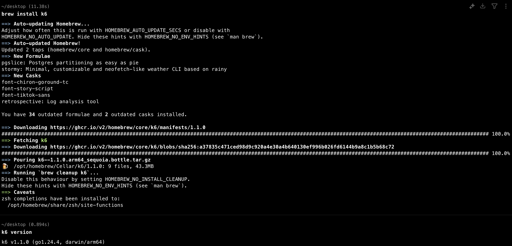

`k6 version` 명령어를 통해 제대로 설치되었는지 확인해주면 된다.

## 시나리오 기반 테스트 시작

```
// k6-authenticated-test.js
// TIO-Style.com 로그인 기반 실제 사용자 여정 테스트
import http from 'k6/http';
import { check, sleep } from 'k6';
import { Rate, Trend, Counter } from 'k6/metrics';

// 커스텀 메트릭
const loginSuccessRate = new Rate('login_success_rate');
const apiSuccessRate = new Rate('api_success_rate');
const userJourneyCompletionRate = new Rate('user_journey_completion_rate');
const responseTimeTrend = new Trend('response_time_trend');

export let options = {
  stages: [
    { duration: '2m', target: 10 },   // 10명 로그인 사용자
    { duration: '5m', target: 20 },   // 20명으로 증가
    { duration: '10m', target: 20 },  // 20명 유지
    { duration: '3m', target: 40 },   // 40명으로 증가 (피크)
    { duration: '2m', target: 0 },    // 종료
  ],
  thresholds: {
    login_success_rate: ['rate>0.95'],           // 로그인 성공률 95% 이상
    api_success_rate: ['rate>0.90'],             // API 성공률 90% 이상
    user_journey_completion_rate: ['rate>0.85'], // 사용자 여정 완료율 85% 이상
    http_req_duration: ['p(95)<3000'],           // 95% 응답시간 3초 이내
  },
};

const BASE_URL = 'https://tio-style.com'; // 운영 환경
const TEST_ACCOUNTS = [
  { email: 'test1@tio-style.com', password: 'Test123!' },
  { email: 'test2@tio-style.com', password: 'Test123!' },
];

// 실제 사용자 선택 옵션들
const USER_PREFERENCES = {
  sizes: ['S', 'M', 'L', 'XL'],
  colors: ['BLACK', 'WHITE', 'NAVY', 'GRAY', 'BEIGE'],
  quantities: [1, 2],
  
  // 실제 배송지 정보 (테스트용)
  addresses: [
    {
      name: '홍길동',
      phone: '010-1234-5678',
      zipCode: '06292',
      address: '서울특별시 강남구 역삼동',
      detailAddress: '123-45 테스트빌딩 101호',
      isDefault: true
    },
    {
      name: '김철수', 
      phone: '010-9876-5432',
      zipCode: '13529',
      address: '경기도 성남시 분당구 정자동',
      detailAddress: '678-90 분당아파트 201호',
      isDefault: false
    }
  ],
  
  // 사용자 신체 정보 (가상 피팅용)
  bodyInfo: {
    height: [160, 165, 170, 175, 180],
    weight: [50, 55, 60, 65, 70],
    bodyType: ['SLIM', 'NORMAL', 'MUSCULAR']
  }
};

function getRandomAccount() {
  return TEST_ACCOUNTS[Math.floor(Math.random() * TEST_ACCOUNTS.length)];
}

function getRandomChoice(array) {
  return array[Math.floor(Math.random() * array.length)];
}

export default function () {
  const account = getRandomAccount();
  let authHeaders = {};
  let journeySteps = 0;
  let completedSteps = 0;
  let selectedProducts = [];

  try {
    // 1. 이메일/비밀번호 로그인
    journeySteps++;
    console.log(`🔐 로그인 시도: ${account.email}`);
    
    let loginRes = http.post(`${BASE_URL}/api/auth/mail/login`, JSON.stringify({
      email: account.email,
      password: account.password
    }), { 
      headers: { 'Content-Type': 'application/json' },
      tags: { step: 'login' }
    });
    
    const loginSuccess = check(loginRes, { 
      'login success': (r) => r.status === 200 && r.json('accessToken'),
      'login response time': (r) => r.timings.duration < 2000
    });
    
    loginSuccessRate.add(loginSuccess);
    
    if (!loginSuccess) {
      console.error(`❌ 로그인 실패: ${account.email}, Status: ${loginRes.status}`);
      return;
    }
    
    completedSteps++;
    let token = loginRes.json('accessToken');
    authHeaders = { 
      headers: { 
        'Authorization': `Bearer ${token}`,
        'Content-Type': 'application/json'
      } 
    };
    
    console.log(`✅ 로그인 성공: ${account.email}`);
    sleep(0.5);

    // 2. 배송지 정보 확인/추가
    journeySteps++;
    console.log('📍 배송지 정보 확인...');
    let addressRes = http.get(`${BASE_URL}/api/address`, {
      ...authHeaders,
      tags: { step: 'address_list' }
    });
    
    // 배송지가 없으면 추가
    if (addressRes.status === 200) {
      try {
        const addresses = addressRes.json();
        if (!addresses || addresses.length === 0) {
          console.log('📍 배송지 추가 중...');
          const newAddress = getRandomChoice(USER_PREFERENCES.addresses);
          
          let addAddressRes = http.post(`${BASE_URL}/api/address`, JSON.stringify(newAddress), {
            ...authHeaders,
            tags: { step: 'add_address' }
          });
          
          if (addAddressRes.status === 200 || addAddressRes.status === 201) {
            console.log('✅ 배송지 추가 성공');
            completedSteps++;
          }
        } else {
          console.log(`✅ 기존 배송지 ${addresses.length}개 확인`);
          completedSteps++;
        }
      } catch (e) {
        console.log('⚠️ 배송지 처리 중 오류');
      }
    }

    // 3. 메인 상품 리스트(추천/랭킹) - 개인화된 추천
    journeySteps++;
    console.log('📱 메인 상품 목록 조회');
    
    let mainRes = http.get(`${BASE_URL}/api/home/products`, {
      ...authHeaders,
      tags: { step: 'main_products' }
    });
    
    const mainSuccess = check(mainRes, { 
      'main products success': (r) => r.status === 200,
      'main products has data': (r) => {
        try {
          const data = r.json();
          return data.recommended || data.ranked;
        } catch (e) {
          return false;
        }
      }
    });
    
    apiSuccessRate.add(mainSuccess);
    
    if (!mainSuccess) {
      console.error(`❌ 메인 상품 조회 실패: ${mainRes.status}`);
      return;
    }
    
    completedSteps++;
    let mainData = mainRes.json();
    let recommended = mainData.recommended || [];
    let ranked = mainData.ranked || [];
    
    console.log(`✅ 추천 상품 ${recommended.length}개, 랭킹 상품 ${ranked.length}개 조회`);
    sleep(0.5);

    // 4. 상품 상세페이지 조회 + 옵션 선택 (실제 사용자 행동)
    journeySteps++;
    const viewCount = Math.min(3, recommended.length);
    console.log(`👀 상품 상세 조회 및 옵션 선택 (${viewCount}개)`);
    
    for (let i = 0; i < viewCount; i++) {
      if (recommended[i] && recommended[i].id) {
        const product = recommended[i];
        console.log(`🔍 상품 ${product.id} 상세 조회 중...`);
        
        let detailRes = http.get(`${BASE_URL}/api/products/${product.id}`, {
          ...authHeaders,
          tags: { step: 'product_detail' }
        });
        
        const detailSuccess = check(detailRes, { 
          'product detail success': (r) => r.status === 200,
          'product detail response time': (r) => r.timings.duration < 2000
        });
        
        apiSuccessRate.add(detailSuccess);
        
        if (detailSuccess) {
          // 실제 사용자처럼 옵션 선택
          const selectedSize = getRandomChoice(USER_PREFERENCES.sizes);
          const selectedColor = getRandomChoice(USER_PREFERENCES.colors);
          const selectedQuantity = getRandomChoice(USER_PREFERENCES.quantities);
          
          selectedProducts.push({
            ...product,
            selectedSize,
            selectedColor,
            selectedQuantity
          });
          
          console.log(`✅ 상품 ${product.id} - 사이즈: ${selectedSize}, 색상: ${selectedColor}, 수량: ${selectedQuantity}`);
        } else {
          console.error(`❌ 상품 ${product.id} 상세 조회 실패: ${detailRes.status}`);
        }
        
        // 실제 사용자처럼 상품을 자세히 보는 시간
        sleep(Math.random() * 5 + 3); // 3-8초
      }
    }
    completedSteps++;

    // 5. 메인페이지 돌아오기
    journeySteps++;
    console.log('🏠 메인페이지 재방문');
    
    let returnMainRes = http.get(`${BASE_URL}/api/home/products`, {
      ...authHeaders,
      tags: { step: 'return_main' }
    });
    
    const returnMainSuccess = check(returnMainRes, {
      'return to main success': (r) => r.status === 200
    });
    
    apiSuccessRate.add(returnMainSuccess);
    if (returnMainSuccess) completedSteps++;
    sleep(0.3);

    // 6. 가상 피팅 시도 (신체 정보 포함)
    journeySteps++;
    if (selectedProducts.length > 0) {
      console.log('👗 가상 피팅 시도...');
      const productForFitting = selectedProducts[0];
      
      // 사용자 신체 정보 설정
      const bodyInfo = {
        height: getRandomChoice(USER_PREFERENCES.bodyInfo.height),
        weight: getRandomChoice(USER_PREFERENCES.bodyInfo.weight),
        bodyType: getRandomChoice(USER_PREFERENCES.bodyInfo.bodyType)
      };
      
      let tryOnRes = http.post(`${BASE_URL}/api/avatars/try-on`, JSON.stringify({
        productId: productForFitting.id,
        size: productForFitting.selectedSize,
        color: productForFitting.selectedColor,
        userHeight: bodyInfo.height,
        userWeight: bodyInfo.weight,
        bodyType: bodyInfo.bodyType
      }), {
        ...authHeaders,
        tags: { step: 'virtual_fitting' }
      });
      
      const tryOnSuccess = check(tryOnRes, { 
        'virtual fitting request': (r) => r.status === 200 || r.status === 202 || r.status === 404
      });
      
      apiSuccessRate.add(tryOnSuccess);
      
      if (tryOnSuccess) {
        console.log(`✅ 가상 피팅 요청 성공: 상품 ${productForFitting.id} (키: ${bodyInfo.height}cm)`);
        completedSteps++;
      } else {
        console.error(`❌ 가상 피팅 실패: 상품 ${productForFitting.id}, Status: ${tryOnRes.status}`);
      }
      
      sleep(1); // 가상 피팅은 시간이 걸림
    }

    // 7. 찜 목록 추가 (추천 상품 1개)
    journeySteps++;
    if (selectedProducts.length > 0) {
      console.log(`💖 찜 목록 추가: 상품 ${selectedProducts[0].id}`);
      
      let wishlistRes = http.post(`${BASE_URL}/api/wishlist/add?productId=${selectedProducts[0].id}`, null, {
        ...authHeaders,
        tags: { step: 'wishlist' }
      });
      
      const wishlistSuccess = check(wishlistRes, { 
        'wishlist add success': (r) => r.status === 200 || r.status === 204 || r.status === 409 // 409는 이미 존재
      });
      
      apiSuccessRate.add(wishlistSuccess);
      if (wishlistSuccess) completedSteps++;
      sleep(0.2);
    }

    // 8. 옷장 진입
    journeySteps++;
    console.log('👔 옷장 조회');
    
    let closetRes = http.get(`${BASE_URL}/api/closet`, {
      ...authHeaders,
      tags: { step: 'closet' }
    });
    
    const closetSuccess = check(closetRes, { 
      'closet access success': (r) => r.status === 200 || r.status === 404
    });
    
    apiSuccessRate.add(closetSuccess);
    if (closetSuccess) completedSteps++;
    sleep(0.2);

    // 9. 장바구니에 물건 넣기 (선택한 옵션 포함)
    journeySteps++;
    if (selectedProducts.length > 1) {
      const productToCart = selectedProducts[1];
      console.log(`🛒 장바구니 추가: 상품 ${productToCart.id} (${productToCart.selectedSize}, ${productToCart.selectedColor})`);
      
      let cartRes = http.post(`${BASE_URL}/api/cart/items`, JSON.stringify({
        productId: productToCart.id,
        size: productToCart.selectedSize,
        color: productToCart.selectedColor,
        quantity: productToCart.selectedQuantity
      }), {
        ...authHeaders,
        tags: { step: 'cart' }
      });
      
      const cartSuccess = check(cartRes, { 
        'cart add success': (r) => r.status === 200 || r.status === 201
      });
      
      apiSuccessRate.add(cartSuccess);
      if (cartSuccess) {
        console.log(`✅ 장바구니 추가 성공 (사이즈: ${productToCart.selectedSize}, 색상: ${productToCart.selectedColor})`);
        completedSteps++;
      }
      sleep(0.2);
    }

    // 10. 주문서 작성 (배송지 선택 포함)
    journeySteps++;
    console.log('📝 주문서 작성 (배송지 선택)');
    
    const selectedAddress = getRandomChoice(USER_PREFERENCES.addresses);
    const orderData = {
      shippingAddress: selectedAddress,
      paymentMethod: 'CARD',
      memo: '문 앞에 놓아주세요'
    };
    
    let orderRes = http.post(`${BASE_URL}/api/orders/prepare`, JSON.stringify(orderData), {
      ...authHeaders,
      tags: { step: 'prepare_order' }
    });
    
    const orderSuccess = check(orderRes, {
      'order preparation success': (r) => r.status === 200 || r.status === 201
    });
    
    apiSuccessRate.add(orderSuccess);
    
    if (orderSuccess) {
      console.log(`✅ 주문서 작성 완료 (배송지: ${selectedAddress.address})`);
      completedSteps++;
    }

    // 11. 결제는 테스트 환경에서 제외 (실제 결제 방지)
    console.log('💳 결제 단계는 테스트에서 제외 (실제 결제 방지)');

    // 사용자 여정 완료율 계산
    const completionRate = completedSteps / journeySteps;
    userJourneyCompletionRate.add(completionRate > 0.8);
    
    console.log(`🎯 사용자 여정 완료: ${completedSteps}/${journeySteps} (${(completionRate * 100).toFixed(1)}%)`);
    
    sleep(1);

  } catch (error) {
    console.error(`❌ 테스트 중 오류 발생: ${error.message}`);
    userJourneyCompletionRate.add(false);
  }
}

// 테스트 완료 후 결과 요약
export function handleSummary(data) {
  const loginSuccessRate = data.metrics.login_success_rate ? data.metrics.login_success_rate.rate * 100 : 0;
  const apiSuccessRate = data.metrics.api_success_rate ? data.metrics.api_success_rate.rate * 100 : 0;
  const journeyCompletionRate = data.metrics.user_journey_completion_rate ? data.metrics.user_journey_completion_rate.rate * 100 : 0;
  const avgResponseTime = data.metrics.http_req_duration.avg;
  const p95ResponseTime = data.metrics['http_req_duration{p(95)}'].value;

  return {
    'authenticated_test_results.json': JSON.stringify(data, null, 2),
    'authenticated_test_summary.html': `
<!DOCTYPE html>
<html>
<head>
    <title>TIO-Style.com 인증 사용자 여정 테스트 결과</title>
    <style>
        body { font-family: Arial, sans-serif; margin: 20px; }
        .metric { background: #f5f5f5; padding: 10px; margin: 10px 0; border-radius: 5px; }
        .good { color: green; } .warning { color: orange; } .error { color: red; }
        .journey { background: #e8f4f8; padding: 15px; margin: 15px 0; border-radius: 8px; }
    </style>
</head>
<body>
    <h1>🔐 TIO-Style.com 인증 사용자 여정 테스트 결과</h1>
    <p><strong>테스트 시간:</strong> ${new Date().toISOString()}</p>
    
    <div class="metric">
        <h3>📊 핵심 성능 지표</h3>
        <ul>
            <li>로그인 성공률: <strong class="${loginSuccessRate < 95 ? 'error' : 'good'}">${loginSuccessRate.toFixed(1)}%</strong></li>
            <li>API 성공률: <strong class="${apiSuccessRate < 90 ? 'error' : 'good'}">${apiSuccessRate.toFixed(1)}%</strong></li>
            <li>사용자 여정 완료율: <strong class="${journeyCompletionRate < 85 ? 'error' : 'good'}">${journeyCompletionRate.toFixed(1)}%</strong></li>
            <li>평균 응답시간: <strong>${avgResponseTime.toFixed(2)}ms</strong></li>
            <li>95% 응답시간: <strong class="${p95ResponseTime > 3000 ? 'error' : 'good'}">${p95ResponseTime.toFixed(2)}ms</strong></li>
        </ul>
    </div>

    <div class="journey">
        <h3>👤 사용자 여정 단계</h3>
        <ol>
            <li>🔐 이메일/비밀번호 로그인</li>
            <li>📱 개인화된 메인 상품 목록 조회</li>
            <li>👀 상품 상세 페이지 조회 (3-5개)</li>
            <li>🏠 메인페이지 재방문</li>
            <li>👗 가상 피팅 시도 (최대 2회)</li>
            <li>💖 찜 목록 추가</li>
            <li>👔 옷장 조회</li>
            <li>🛒 장바구니 추가</li>
            <li>💳 결제 (테스트에서 제외)</li>
        </ol>
    </div>

    <div class="metric">
        <h3>🎯 테스트 결과 분석</h3>
        <ul>
            <li>인증 시스템: ${loginSuccessRate > 95 ? '✅ 안정적' : '⚠️ 개선 필요'}</li>
            <li>개인화 추천: ${apiSuccessRate > 90 ? '✅ 정상 작동' : '⚠️ 확인 필요'}</li>
            <li>전체 사용자 경험: ${journeyCompletionRate > 85 ? '✅ 우수' : '⚠️ 개선 필요'}</li>
            <li>시스템 성능: ${p95ResponseTime < 2000 ? '✅ 우수' : p95ResponseTime < 3000 ? '⚠️ 양호' : '❌ 개선 필요'}</li>
        </ul>
    </div>

    <div class="metric">
        <h3>💡 권장사항</h3>
        <ul>
            ${loginSuccessRate < 95 ? '<li>🔧 로그인 시스템 안정성 개선 필요</li>' : ''}
            ${apiSuccessRate < 90 ? '<li>🔧 API 응답 안정성 개선 필요</li>' : ''}
            ${journeyCompletionRate < 85 ? '<li>🔧 사용자 여정 최적화 필요</li>' : ''}
            ${p95ResponseTime > 3000 ? '<li>⚡ 응답시간 최적화 필요</li>' : ''}
            <li>📊 실제 사용자 패턴과 비교 분석 권장</li>
        </ul>
    </div>
</body>
</html>
    `,
  };
}

```

이 테스트 코드를 통해 터미널에서 실행만 해주면 된다.

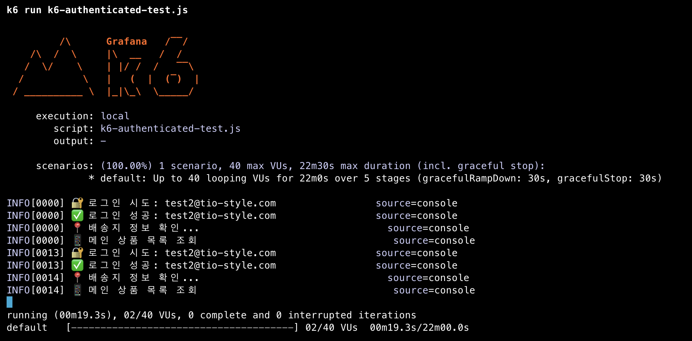

### 테스트 환경

- 동시 사용자: 10명 → 20명 → 40명 (피크)
- 테스트 시간: 22분
- 실제 로그인 기반 인증 테스트

### 🎭 단계별 사용자 여정

### 1단계: 🔐 로그인 (인증)

```sql
POST /api/auth/mail/login
{
"email": "[test1@tio-style.com](mailto:test1@tio-style.com)",
"password": "Test123!"
}
```

- **목적**: JWT 토큰 획득
- **검증**: 200 응답, accessToken 존재
- **실패 시**: 테스트 중단

### 2단계: 📍 배송지 정보 관리

```sql
GET /api/address  // 기존 배송지 확인
POST /api/address // 없으면 추가
```

- **실제 배송지 데이터**:

```sql
{
name: '홍길동',
phone: '010-1234-5678',
address: '서울특별시 강남구 역삼동',
detailAddress: '123-45 테스트빌딩 101호'
}
```

### 3단계: 📱 개인화된 상품 추천 조회

```sql
GET /api/home/products
```

- **개인화된 추천**: 로그인한 사용자 기반
- **응답 데이터**: recommended[], ranked[] 배열
- **검증**: 추천 상품 존재 여부

### 4단계: 👀 상품 상세 조회 + 옵션 선택 (핵심!)

```sql
GET /api/products/{productId}
```

실제 사용자 행동 시뮬레이션:

- 추천 상품 3개 상세 조회
- **각 상품마다 옵션 선택**:
- 사이즈: S, M, L, XL 중 랜덤
- 색상: BLACK, WHITE, NAVY 등 중 랜덤
- 수량: 1개 또는 2개
- **실제 사용 시간**: 3-8초 대기 (상품을 자세히 보는 시간)

### 5단계: 🏠 메인페이지 재방문

```sql
GET /api/home/products
```

- 실제 사용자가 다시 메인으로 돌아가는 행동

### 6단계: 👗 가상 피팅 (신체 정보 포함)

```sql
POST /api/avatars/try-on
{
"productId": 123,
"size": "M",
"color": "BLACK",
"userHeight": 170,
"userWeight": 60,
"bodyType": "NORMAL"
}
```

- **신체 정보**: 키(160-180cm), 몸무게(50-70kg), 체형
• **선택한 옵션**: 4단계에서 선택한 사이즈/색상 사용

### 7단계: 💖 찜 목록 추가

```sql
POST /api/wishlist/add?productId=123
```

- 마음에 든 상품을 찜 목록에 추가

### 8단계: 👔 옷장 조회

```sql
GET /api/closet
```

- 개인 옷장 기능 확인

### 9단계: 🛒 장바구니 추가 (선택 옵션 포함!)

```sql
POST /api/cart/items
{
"productId": 456,
"size": "L",        // 4단계에서 선택한 사이즈
"color": "WHITE",   // 4단계에서 선택한 색상
"quantity": 1       // 4단계에서 선택한 수량
}
```

- **핵심**: 단순 productId가 아닌 실제 선택한 옵션 포함

### 10단계: 📝 주문서 작성 (배송지 선택)

```sql
POST /api/orders/prepare
{
"shippingAddress": {
"name": "김철수",
"address": "경기도 성남시 분당구 정자동"
},
"paymentMethod": "CARD",
"memo": "문 앞에 놓아주세요"
}
```

- **배송지 선택**: 2단계에서 등록한 배송지 중 선택
- **결제 방법**: CARD, BANK_TRANSFER 등
- **배송 메모**: 실제 사용자가 입력하는 메모

### 11단계: 💳 결제 (테스트에서 제외)

- 실제 결제는 안전을 위해 테스트에서 제외

## 테스트 진행

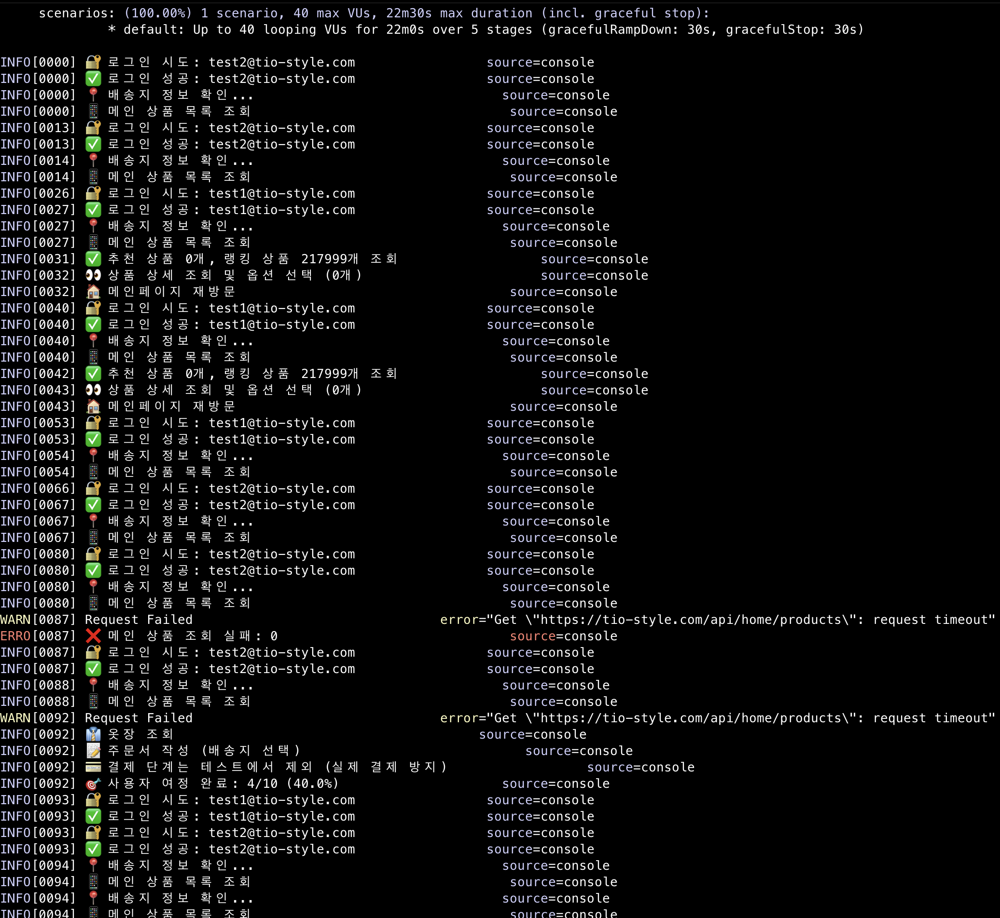

중간중간 이상한게 껴있어도 주문서 작성까지 순조롭다.. 라고 생각했다.

## 문제 발생

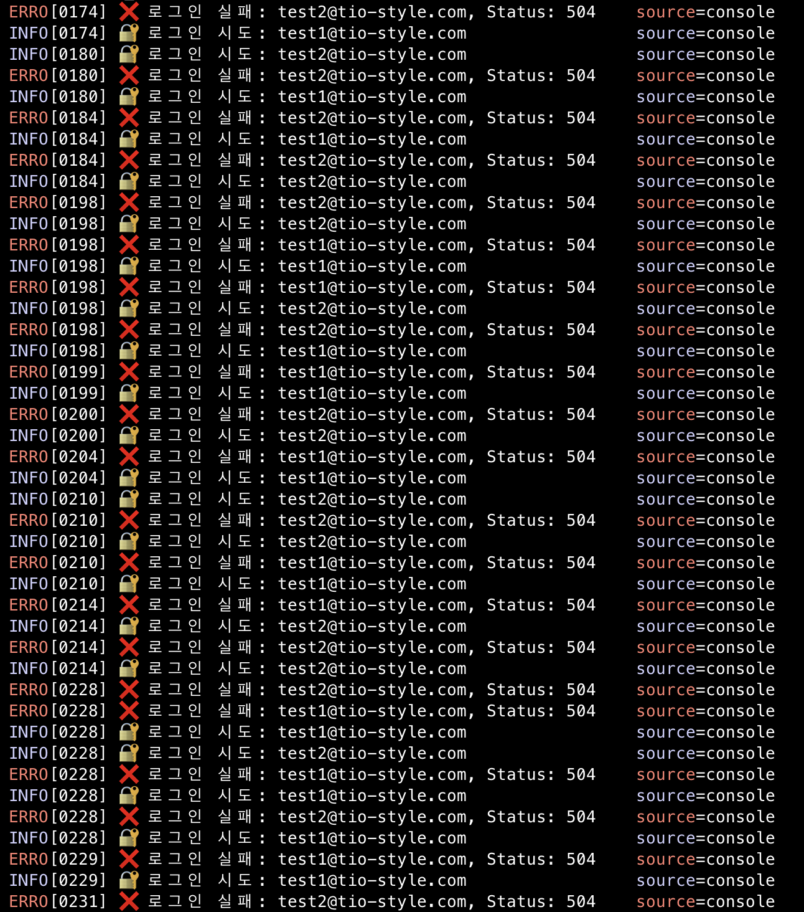

이렇게 반복되기 전까지는..

그래서 긴급히 테스트를 종료하고, 확인해본다

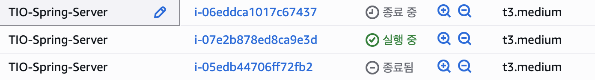

테스트로인해 인스턴스가 죽다 살다가 반복적으로 이뤄지고 있던 것 같다

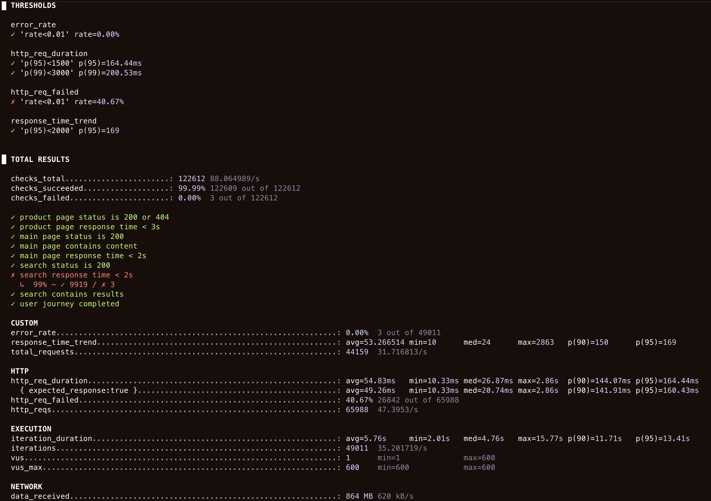

아래의 로그인 안하고 API 호출하는 단순 테스트와는 달리

뭔가 많이 잘못되었다. 일단 가장 큰 문제는 인스턴스가 죽었던건데. 왜 죽었는지 확인해보자.

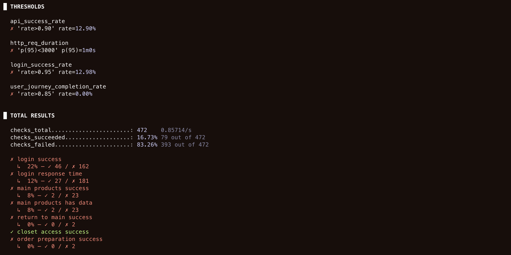


지속적으로 접속 불량이 되던것 때문에 TOTAL RESULT의 모든 지표가 박살이 나 있다.

- **API 성공률: 12.90%** (목표: 90% 이상)
- **로그인 성공률: 12.98%** (목표: 95% 이상)
- **사용자 여정 완료율: 0.00%** (목표: 85% 이상)
- **HTTP 요청 실패율: 81.06%**
- **평균 응답시간: 27.21초** (목표: 3초 이하)


인스턴스의 모니터링 항목을 보면 테스트를 하던 10분남짓한 찰나의 순간에 피크를 찍은 것을 알 수 있다.

원래 현재 상태 지표를 확인하고 개선을 하려고하는데, 일단 가장 큰 문제가 식별되었다.

## N+1로 터진 서버

예를 들자면, `ProductService` 를 보면 여기서

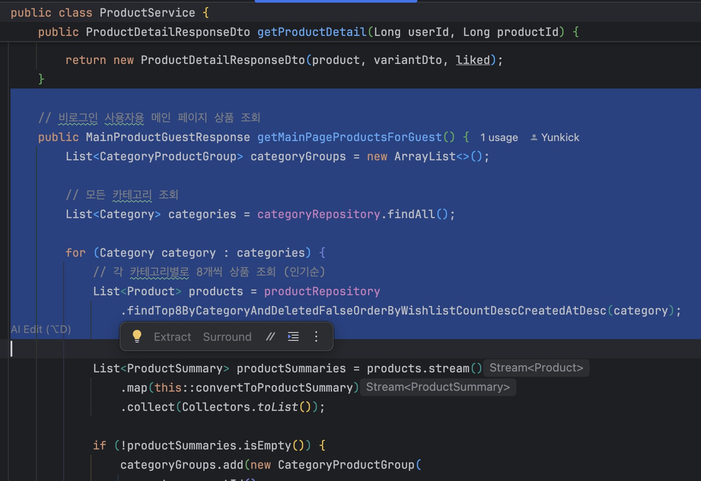

비회원 접속 시 메인페이지를 위해 모든 카테고리를 순회하고 `categoryRepository.findAll()`

각 카테고리별로 8개 상품조회하여 실제 호출은 findAll 1번 + a

N+1문제가 발생. 한번 호출에 100번까지 늘어난다고 치면

사용자 1명 = 101번 쿼리.

20명 동시접속 = 2,020번 쿼리 발생하여 초당 수십 ~ 수백번의 쿼리가 서버로 들어간거다.

실제로 CloudFront에서 확인해보면

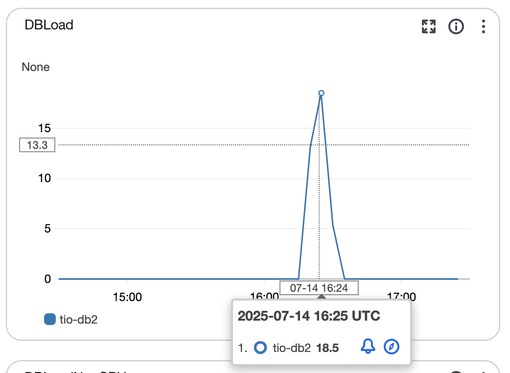

RDS에서도 DBLoad가 순간적으로 튀어올랐고, 

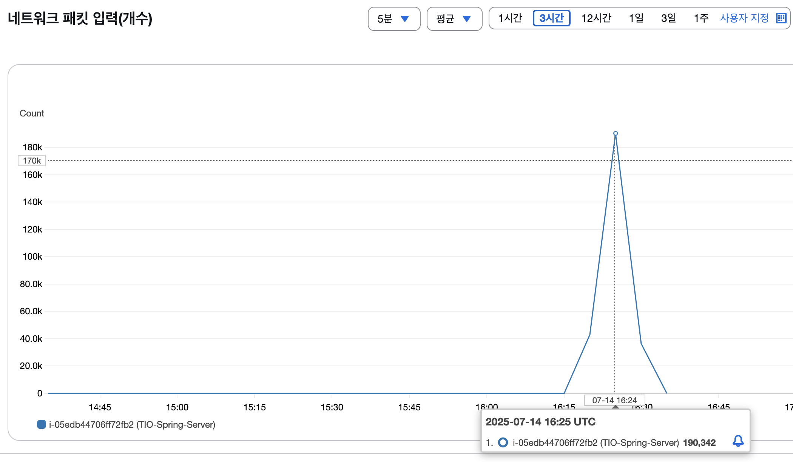

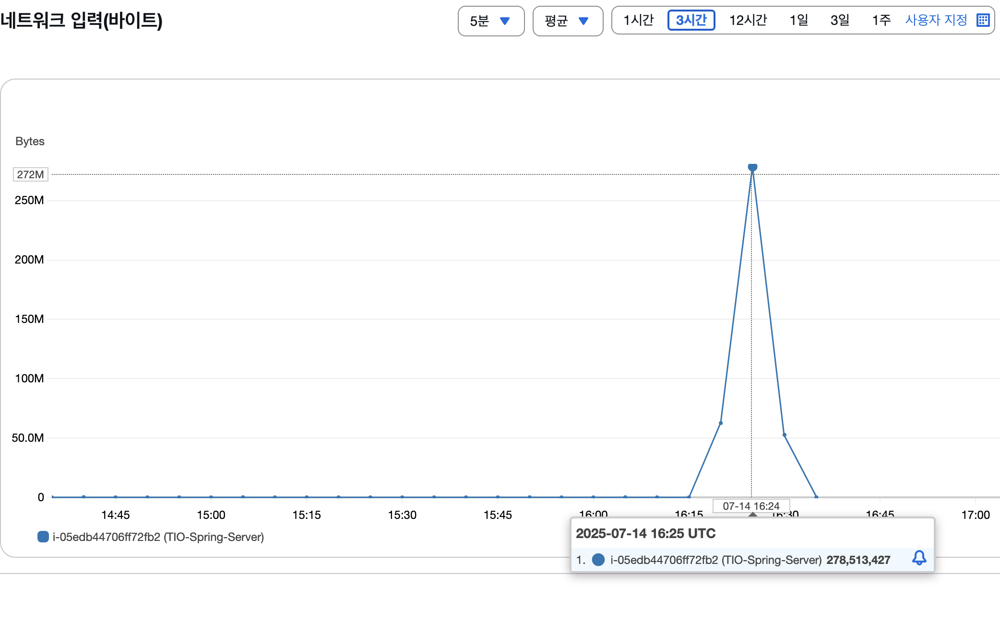

EC2 서버의 네트워크 입력 패킷수도 `190,342` 까지 튀어올랐다.

ALB RequestCount: 63,000+ 요청 = 63,000 × 101 = 약 636만 번의 데이터베이스 쿼리!

결과:
• 데이터베이스 연결 풀 고갈
• 커넥션 대기 시간 급증
• 응답 시간 30초+ 타임아웃

### 3. 시스템 마비 패턴 확인

이전 ALB 데이터에서 본 패턴:
15:15: 20,632 요청 (최고점)
15:20-15:45: 거의 0 요청 (시스템 마비)

이전엔 왜 문제가 발생하지 않았나? 하니

## CDN

### **1. CloudFront가 모든 것을 처리**

- HTML 페이지들은 CloudFront에서 캐싱
- 정적 파일들도 CloudFront에서 서빙
- **백엔드 API 호출이 거의 없음!**

### **2. N+1 쿼리 문제를 피해감**

- /api/products/main (101번 쿼리 문제)를 호출하지 않음
- 대신 이미 렌더링된 HTML만 요청
- 데이터베이스 부하 거의 없음

### **3. 실제 부하 테스트가 아님**

- 이것은 CDN 성능 테스트
- 백엔드 API 성능 테스트가 아님
- 실제 사용자 시나리오와 다름

### **현재 복합 테스트 (터진 이유):**

실제 사용자 시나리오

1. 로그인 API 호출 (/api/auth/signin)
2. 세션/JWT 토큰 관리
3. 메인 페이지 API 호출 (/api/products/main)
4. 인증된 상태에서 추가 API 호출들
5. 장바구니, 위시리스트 등 복합 작업

리소스 사용량 자체가 다름

이전 단순 테스트:

- CPU: 101번 쿼리 실행
- 메모리: 응답 데이터만 처리
- 네트워크: 단순 HTTP 요청/응답
- **총 부하: 낮음**

현재 복합 테스트:

- CPU: 101번 쿼리 + 인증 처리 + 세션 관리
- 메모리: 응답 데이터 + 세션 데이터 + 인증 컨텍스트
- 네트워크: 복수 API 호출 + 쿠키/헤더 처리
- **총 부하: 높음**

## 결론 : 당장 급하게 N+1 고쳐야할듯