# 제품 정보 DB 구축 (크롤링) (1)

## 배경

현재 `1만 9천건` 정도의 제품정보를 크롤링으로 보유중. 

실제 이커머스와 `비슷한 환경을 구현`하기 위해 조금 더 풍부한 제품정보(`약 10만건 이상`)를 가져올 필요가 있다고 판단

판단 배경: 약 1만여 건의 데이터는 1개의 단일 AWS RDS로도 운영 가능. 저 만큼의 데이터를 넣었을 때 어떤 문제가 생길 것인가? 어떻게 해결할 수 있을까? 를 고민하기 위해서.

```python

bash
# 가상환경 설정 및 활성화
python3 -m venv venv
. venv/bin/activate

# EC2에서 백그라운드 실행
nohup python3 crawler_ec2.py > crawler.log 2>&1 &

# 프로세스 ID 확인
echo $! > crawler.pid

# 나중에 프로세스 상태 확인
ps -p $(cat crawler.pid)

# 로컬에서 SSM으로 접속해서 실시간 로그 확인
aws ssm start-session --target i-0944cb697cdd66c31 --region ap-northeast-2
tail -f ~/crawler/crawler.log
```

## 진행

파이썬 selenium 라이브러리 기반의 크롤러를 조금 더 개조해서, 

기존에 현아가 제공했던 코드는 일일히 특정 카테고리의 링크와, 해당하는 카테고리의 id를 기입해줬어야 하는 반면, 수정한 코드는 카테고리 id와 상세 링크를 매핑하여

모든 카테고리를 순회하여 제품정보를 먼저 받아온 후 (가져오는 정보 : 제품명, 브랜드, 가격, 할인율)

가져온 정보를 바탕으로 상세페이지의 이미지를 가져오는 것으로 개선 (가져오는 정보 : 최대 4개의 제품 이미지, 제품 상세정보 배너이미지)

그래서 작성된 코드는 다음과 같다

```python
import requests
from bs4 import BeautifulSoup
import time
import json
import csv
from urllib.parse import urljoin
import logging
import re
from datetime import datetime
from selenium import webdriver
from selenium.webdriver.common.by import By
from selenium.webdriver.support.ui import WebDriverWait
from selenium.webdriver.support import expected_conditions as EC
from selenium.webdriver.chrome.options import Options
from concurrent.futures import ThreadPoolExecutor, ProcessPoolExecutor
import multiprocessing

# 로깅 설정
logging.basicConfig(level=logging.INFO, format='%(asctime)s - %(levelname)s - %(message)s')
logger = logging.getLogger(__name__)

def clean_text(text):
    """텍스트에서 불필요한 공백과 줄바꿈을 제거합니다."""
    return re.sub(r'\s+', ' ', text).strip()

def scroll_to_bottom(driver, num_scrolls=400):
    """페이지 하단으로 스크롤하여 더 많은 콘텐츠를 로드합니다."""
    for _ in range(num_scrolls):
        driver.execute_script("window.scrollTo(0, document.body.scrollHeight);")
        time.sleep(1)

class MusinsaSeleniumCrawler:
    def __init__(self):
        self.base_url = "https://www.musinsa.com"
        
        # Chrome 옵션 설정
        chrome_options = Options()
        chrome_options.add_argument('--no-sandbox')
        chrome_options.add_argument('--disable-dev-shm-usage')
        chrome_options.add_argument('--disable-gpu')
        chrome_options.add_argument('--disable-images')
        chrome_options.add_argument('--window-size=1920,1080')
        chrome_options.add_argument('--headless')  # 필요시 주석 해제
        
        self.driver = webdriver.Chrome(options=chrome_options)
        
        # DB 카테고리 구조에 맞춘 카테고리 매핑
        self.categories = {
            # 상의 (1)
            101: {'name': '맨투맨', 'url': '/category/001005'},
            102: {'name': '후드', 'url': '/category/001004'},
            103: {'name': '셔츠/블라우스', 'url': '/category/001002'},
            104: {'name': '긴소매 티셔츠', 'url': '/category/001010'},
            105: {'name': '반소매 티셔츠', 'url': '/category/001001'},
            106: {'name': '니트', 'url': '/category/001006'},
            107: {'name': '민소매 티셔츠', 'url': '/category/001011'},
            
            # 아우터 (2)
            201: {'name': '후드집업', 'url': '/category/002022'},
            202: {'name': '가죽/레더', 'url': '/category/002002'},
            203: {'name': '가디건', 'url': '/category/002020'},
            204: {'name': '코트', 'url': '/category/002008'},
            206: {'name': '점퍼', 'url': '/category/002001'},
            
            # 하의 (3)
            301: {'name': '데님', 'url': '/category/003002'},
            302: {'name': '트레이닝', 'url': '/category/003004'},
            303: {'name': '코튼', 'url': '/category/003007'},
            304: {'name': '슬랙스', 'url': '/category/003008'},
            305: {'name': '숏팬츠', 'url': '/category/003009'},
            306: {'name': '레깅스', 'url': '/category/003005'},
            
            # 원피스/스커트 (4)
            401: {'name': '미니원피스', 'url': '/category/100001'},
            402: {'name': '미디원피스', 'url': '/category/100002'},
            403: {'name': '맥시원피스', 'url': '/category/100003'},
            404: {'name': '미니스커트', 'url': '/category/100004'},
            405: {'name': '미디스커트', 'url': '/category/100005'},
            406: {'name': '롱스커트', 'url': '/category/100006'},
            
            # 신발 (5)
            501: {'name': '스니커즈', 'url': '/category/103004'},
            502: {'name': '부츠', 'url': '/category/103002'},
            503: {'name': '구두', 'url': '/category/103001'},
            504: {'name': '슬리퍼', 'url': '/category/103003'},
            505: {'name': '운동화', 'url': '/category/103005'},
            506: {'name': '기타신발', 'url': '/category/103006'},
            
            # 소품/ACC (6)
            601: {'name': '가방', 'url': '/category/004'},
            602: {'name': '모자', 'url': '/category/101001'},
            603: {'name': '머플러', 'url': '/category/101008'},
            604: {'name': '주얼리', 'url': '/category/101006'},
            605: {'name': '양말', 'url': '/category/101002'},
            606: {'name': '안경', 'url': '/category/101003'}
        }
        
        self.all_products = []
        self.collected_urls = set()  # 중복 방지용

    def get_category_products(self, category_id, num_products_to_collect=8000):
        """특정 카테고리에서 상품 목록을 수집합니다."""
        category_info = self.categories[category_id]
        url = f"{self.base_url}{category_info['url']}"
        
        logger.info(f"카테고리 {category_id}({category_info['name']}) 크롤링 시작: {url}")
        
        self.driver.get(url)
        
        # 팝업 닫기 시도
        try:
            WebDriverWait(self.driver, 10).until(
                EC.element_to_be_clickable((By.CSS_SELECTOR, 'button.css-1f92e8a'))
            ).click()
            logger.info("팝업 닫기 성공")
            time.sleep(2)
        except:
            logger.info("팝업 없음 또는 팝업 닫기 실패")

        products_data = []
        product_urls = set()

        logger.info(f"최소 {num_products_to_collect}개의 상품을 수집하기 위해 스크롤을 시작합니다.")

        while len(products_data) < num_products_to_collect:
            scroll_to_bottom(self.driver, num_scrolls=2)
            soup = BeautifulSoup(self.driver.page_source, 'html.parser')
            
            # 상품 리스트 컨테이너
            product_list_container = soup.find('div', {'data-testid': 'virtuoso-item-list'})
            if not product_list_container:
                logger.warning("상품 리스트 컨테이너를 찾을 수 없습니다.")
                break

            # 개별 상품 컨테이너
            items = product_list_container.find_all('div', class_='sc-igtioI')

            if not items:
                logger.warning("더 이상 상품을 찾을 수 없습니다. 크롤링을 중단합니다.")
                break

            current_page_product_count = 0
            for item in items:
                product_info = {
                    'category_id': category_id,
                    'product_name': '',
                    'brand': '',
                    'gender': '',
                    'img1': '',
                    'img2': '',
                    'img3': '',
                    'img4': '',
                    'img5': '',
                    'content': '',
                    'price': 0,
                    'sale': 0,
                    'deleted': 0,
                    'wishlist_count': 0,
                    'detail_url': ''
                }

                # 상세 페이지 URL
                detail_link_tag = item.find('a', {'aria-label': '상품 상세로 이동'})
                if detail_link_tag and detail_link_tag.get('href'):
                    detail_url = detail_link_tag['href']
                    if detail_url in product_urls or detail_url in self.collected_urls:
                        continue
                    product_urls.add(detail_url)
                    self.collected_urls.add(detail_url)
                    product_info['detail_url'] = detail_url
                else:
                    continue

                # img1 (대표 이미지)
                img1_tag = item.find('img')
                if img1_tag and img1_tag.get('src'):
                    product_info['img1'] = img1_tag['src']

                # 브랜드명
                brand_tag = item.find('span', class_='text-etc_11px_semibold')
                if brand_tag:
                    product_info['brand'] = clean_text(brand_tag.get_text())

                # 상품명
                product_name_tag = item.find('span', class_='text-body_13px_reg')
                if product_name_tag:
                    product_info['product_name'] = clean_text(product_name_tag.get_text())

                # 가격 및 할인율
                price_container = item.find('div', class_='sc-hKDTPf')
                if price_container:
                    # 할인율
                    sale_tag = price_container.find('span', class_='text-red')
                    if sale_tag:
                        sale_text = clean_text(sale_tag.get_text().replace('%', ''))
                        product_info['sale'] = int(sale_text) if sale_text.isdigit() else 0

                    # 가격 정보
                    price_texts = price_container.find_all('span', class_=lambda x: x and ('text-body_13px_semi' in x or 'text-body_13px_line' in x))
                    original_price = None
                    discounted_price = None

                    for p_text_tag in price_texts:
                        text_content = clean_text(p_text_tag.get_text().replace('원', '').replace(',', ''))
                        if 'line-through' in p_text_tag.get('class', []):
                            original_price = int(text_content) if text_content.isdigit() else None
                        else:
                            discounted_price = int(text_content) if text_content.isdigit() else None

                    if original_price:
                        product_info['price'] = original_price
                    elif discounted_price:
                        product_info['price'] = discounted_price

                products_data.append(product_info)
                current_page_product_count += 1

                if len(products_data) >= num_products_to_collect:
                    break

            logger.info(f"현재까지 수집된 상품 수: {len(products_data)}")
            if current_page_product_count == 0 and len(products_data) < num_products_to_collect:
                logger.warning("새로운 상품이 로드되지 않았습니다. 크롤링을 중단합니다.")
                break

        logger.info(f"카테고리 {category_id}({category_info['name']})에서 {len(products_data)}개 상품 수집 완료")
        return products_data

    def get_product_detail_info(self, product_info):
        """상품 상세 페이지에서 추가 정보를 수집합니다."""
        detail_url = product_info['detail_url']
        if not detail_url.startswith('http'):
            detail_url = self.base_url + detail_url
        
        try:
            self.driver.get(detail_url)
            time.sleep(2)  # 페이지 로딩 대기
            
            soup = BeautifulSoup(self.driver.page_source, 'html.parser')
            
            # 메인 이미지들 추가 수집 (img2, img3, img4)
            main_img_urls = []
            
            # swiper-slide 안의 이미지들
            swiper_imgs = soup.select('.swiper-slide img')
            for img in swiper_imgs:
                src = img.get('src')
                if src and 'image.msscdn.net' in src and '_big.jpg' in src:
                    main_img_urls.append(src)
            
            # 썸네일 이미지들
            if len(main_img_urls) < 4:
                thumbnail_imgs = soup.select('.sc-366fl4-3 img')
                for img in thumbnail_imgs:
                    src = img.get('src')
                    if src and 'image.msscdn.net' in src and src not in main_img_urls:
                        if '_500.jpg' in src:
                            big_src = src.replace('_500.jpg', '_big.jpg')
                            main_img_urls.append(big_src)
                        else:
                            main_img_urls.append(src)
                        if len(main_img_urls) >= 4:
                            break
            
            # img2, img3, img4 할당
            for i, img_url in enumerate(main_img_urls[1:4], 2):  # img1은 이미 있으므로 2부터 시작
                product_info[f'img{i}'] = img_url
            
            # 성별 정보 추출
            dl_elements = soup.find_all('dl')
            for dl in dl_elements:
                divs = dl.find_all('div')
                for div in divs:
                    dt = div.find('dt')
                    dd = div.find('dd')
                    if dt and dd and '성별' in dt.get_text():
                        gender_text = dd.get_text(strip=True)
                        if '남성' in gender_text or '남자' in gender_text:
                            product_info['gender'] = 'M'
                        elif '여성' in gender_text or '여자' in gender_text:
                            product_info['gender'] = 'F'
                        elif '공용' in gender_text or '유니섹스' in gender_text:
                            product_info['gender'] = 'U'
                        else:
                            product_info['gender'] = 'U'
                        break
            
            # 성별 정보를 찾지 못한 경우 상품명에서 추정
            if not product_info['gender']:
                product_name_lower = product_info['product_name'].lower()
                if any(word in product_name_lower for word in ['men', '남성', '남자']):
                    product_info['gender'] = 'M'
                elif any(word in product_name_lower for word in ['women', '여성', '여자']):
                    product_info['gender'] = 'F'
                else:
                    product_info['gender'] = 'U'
            
            # 상세 설명 이미지들 추출 (img5에 JSON 배열로 저장)
            detail_img_urls = []
            detail_content = soup.find('div', class_='sc-1ikk4lv-4')
            if detail_content:
                detail_imgs = detail_content.find_all('img')
                for img in detail_imgs:
                    src = img.get('src') or img.get('data-fallback-src')
                    if src:
                        if src.startswith('//'):
                            src = 'https:' + src
                        elif src.startswith('/'):
                            src = self.base_url + src
                        
                        if src not in detail_img_urls:
                            detail_img_urls.append(src)
            
            if detail_img_urls:
                product_info['img5'] = json.dumps(detail_img_urls, ensure_ascii=False)
            
            # 상품 설명
            desc_elem = soup.find('div', class_='product_summary')
            if desc_elem:
                product_info['content'] = desc_elem.get_text(strip=True)[:1500]
            
            return product_info
            
        except Exception as e:
            logger.error(f"상품 상세 정보 추출 중 오류 ({detail_url}): {e}")
            return product_info

    def save_intermediate(self, filename_suffix=""):
        """중간 저장 함수"""
        try:
            filename = f'musinsa_products_temp_{len(self.all_products)}{filename_suffix}.json'
            with open(filename, 'w', encoding='utf-8') as jsonfile:
                json.dump(self.all_products, jsonfile, ensure_ascii=False, indent=2)
            logger.info(f"중간 저장 완료: {filename} ({len(self.all_products)}개 상품)")
        except Exception as e:
            logger.error(f"중간 저장 중 오류: {e}")

    def crawl_all_categories(self, start_category=101, products_per_category=400):
        """모든 카테고리를 순차적으로 크롤링"""
        logger.info("1단계: 모든 카테고리에서 상품 목록 수집 시작")
        
        # 카테고리 ID를 정렬해서 순서대로 처리
        category_ids = sorted(self.categories.keys())
        start_index = category_ids.index(start_category) if start_category in category_ids else 0
        
        # 1단계: 모든 카테고리에서 상품 목록 수집
        for i in range(start_index, len(category_ids)):
            category_id = category_ids[i]
            
            try:
                products = self.get_category_products(category_id, products_per_category)
                self.all_products.extend(products)
                
                # 카테고리별 중간 저장
                self.save_intermediate(f"_category_{category_id}")
                
                # 카테고리 간 대기 시간
                time.sleep(5)
                
            except Exception as e:
                logger.error(f"카테고리 {category_id} 크롤링 중 오류: {e}")
                continue
        
        logger.info(f"1단계 완료. 총 {len(self.all_products)}개 상품 목록 수집")
        
        # 2단계: 상세 페이지 정보 수집
        logger.info("2단계: 상품 상세 정보 수집 시작")
        
         for i, product in enumerate(self.all_products, 1):
             try:
                 logger.info(f"상품 {i}/{len(self.all_products)} 상세 정보 수집 중")
                 updated_product = self.get_product_detail_info(product)
                 self.all_products[i-1] = updated_product
               
                 # 100개마다 중간 저장
                 if i % 100 == 0:
                     self.save_intermediate("_detailed")
                
                 time.sleep(2)  # 요청 간격 조절
                
             except Exception as e:
                 logger.error(f"상품 상세 정보 수집 중 오류: {e}")
                 continue
        
        logger.info(f"전체 크롤링 완료. 총 {len(self.all_products)}개 상품 수집")

    def save_to_csv(self, filename='musinsa_products_selenium.csv'):
        """결과를 CSV 파일로 저장"""
        if not self.all_products:
            logger.warning("저장할 상품 데이터가 없습니다.")
            return
        
        fieldnames = ['category_id', 'product_name', 'brand', 'gender', 'img1', 'img2', 
                     'img3', 'img4', 'img5', 'content', 'price', 'sale', 'deleted', 
                     'wishlist_count', 'detail_url']
        
        with open(filename, 'w', newline='', encoding='utf-8') as csvfile:
            writer = csv.DictWriter(csvfile, fieldnames=fieldnames)
            writer.writeheader()
            writer.writerows(self.all_products)
        
        logger.info(f"데이터가 {filename}에 저장되었습니다.")

    def save_to_json(self, filename='musinsa_products_selenium.json'):
        """결과를 JSON 파일로 저장"""
        with open(filename, 'w', encoding='utf-8') as jsonfile:
            json.dump(self.all_products, jsonfile, ensure_ascii=False, indent=2)
        
        logger.info(f"데이터가 {filename}에 저장되었습니다.")

    def close(self):
        """브라우저 종료"""
        self.driver.quit()

def main():
    crawler = MusinsaSeleniumCrawler()
    
    try:
        # 101(맨투맨)부터 시작해서 모든 카테고리 크롤링
        # 카테고리당 400개씩 수집
        crawler.crawl_all_categories(start_category=101, products_per_category=10000)
        
        # 결과 저장
        crawler.save_to_csv('musinsa_products_selenium.csv')
        crawler.save_to_json('musinsa_products_selenium.json')
        
        print(f"크롤링 완료! 총 {len(crawler.all_products)}개 상품을 수집했습니다.")
        
        # 카테고리별 수집 현황 출력
        category_counts = {}
        for product in crawler.all_products:
            cat_id = product['category_id']
            if cat_id not in category_counts:
                category_counts[cat_id] = 0
            category_counts[cat_id] += 1
        
        print("\n카테고리별 수집 현황:")
        for cat_id, count in sorted(category_counts.items()):
            cat_name = crawler.categories[cat_id]['name']
            print(f"  {cat_id}({cat_name}): {count}개")
            
    finally:
        crawler.close()

if __name__ == "__main__":
    main()

```

## 문제 발생

약 30개의 카테고리에 대해 만개가 없는 제품도 있고 하니 10만개의 결과가 나올것을 예상하고 `1만 건`의 제품을 가져오도록 걸어놓고 하루정도 돌렸는데, 종합된 제품 정보는 약 `21만건` 이었다. 

메인은 다 가져온 상태에서 상세정보를 가져오는 속도를 보니 1건당 `7초`, 6,000건 가져온 상태에서 남은 `212,000건` 의 예상 시간을 계산해봤을때, 약 `17일`의 시간이 필요한 것

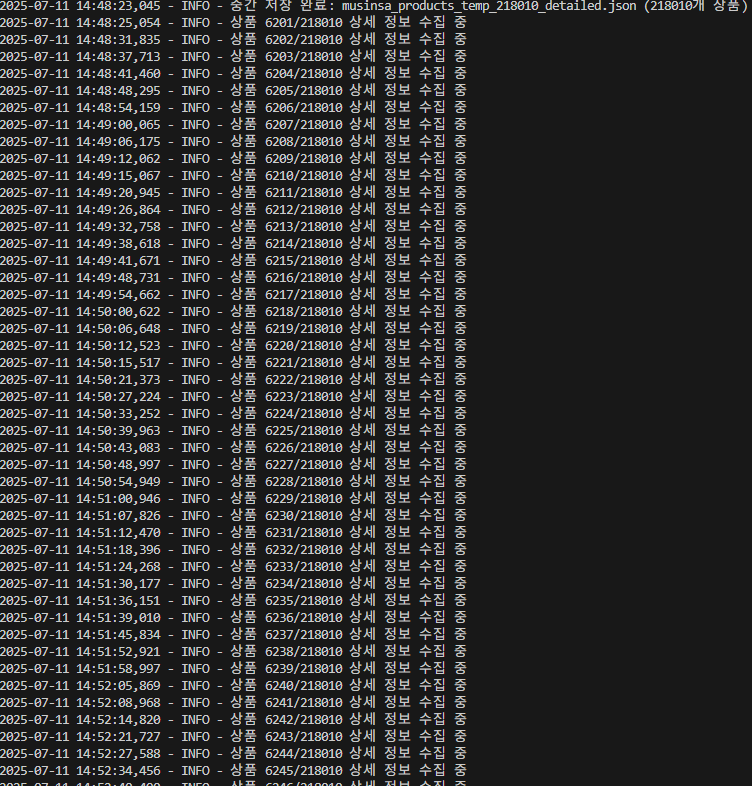

`한세월이다..`

일단 중간중간 json 형식으로 저장된 temp 파일이 있어 진행을 멈추고

상세페이지 크롤링을 위한 별도의 코드를 가져가기로했다.

기존의 `selenium`기반의 코드에서 `request` 기반의 상세페이지 조회 코드로 변경하기로했다.

예상되는 개선 시간은 건당 `7초` → `1~2초` 로 예상된다고하는데

## 원인

### Selenium (7초)

1. Chrome 브라우저 실행 (메모리 사용)
2. 페이지 로딩 (HTML + CSS + JavaScript 모두 실행)
3. DOM 렌더링 (화면에 그리기)
4. JavaScript 실행 완료 대기
5. 이미지, 폰트 등 모든 리소스 로딩
6. BeautifulSoup으로 파싱

### requests (1-2초)

1. HTTP 요청만 전송
2. HTML 응답만 받기
3. BeautifulSoup으로 파싱

### 구체적인 차이점:

1. 브라우저 오버헤드

- **Selenium**: 실제 Chrome 브라우저 구동 (RAM 100-200MB 사용)
- **requests**: 단순 HTTP 클라이언트 (RAM 몇 MB)

2. 리소스 로딩

- **Selenium**: CSS, JS, 이미지, 폰트 등 모든 파일 다운로드
- **requests**: HTML만 다운로드

3. JavaScript 실행

- **Selenium**: 모든 JS 코드 실행 후 DOM 완성 대기
- **requests**: JS 무시, 서버에서 온 HTML 그대로 사용

4. 렌더링

- **Selenium**: 화면에 실제로 그리기 (헤드리스여도 내부적으로 렌더링)
- **requests**: 렌더링 없음

## 구현 코드

```python
import requests
from bs4 import BeautifulSoup
import json
import time
import logging
from datetime import datetime

# 로깅 설정
logging.basicConfig(level=logging.INFO, format='%(asctime)s - %(levelname)s - %(message)s')
logger = logging.getLogger(__name__)

class MusinsaDetailCrawler:
    def __init__(self):
        self.base_url = "https://www.musinsa.com"
        self.session = requests.Session()
        self.session.headers.update({
            'User-Agent': 'Mozilla/5.0 (Windows NT 10.0; Win64; x64) AppleWebKit/537.36 (KHTML, like Gecko) Chrome/120.0.0.0 Safari/537.36',
            'Accept': 'text/html,application/xhtml+xml,application/xml;q=0.9,image/webp,*/*;q=0.8',
            'Accept-Language': 'ko-KR,ko;q=0.8,en-US;q=0.5,en;q=0.3',
            'Accept-Encoding': 'gzip, deflate, br',
            'Connection': 'keep-alive',
        })
        
    def load_existing_data(self, filename):
        """기존 JSON 파일 로드"""
        try:
            with open(filename, 'r', encoding='utf-8') as f:
                data = json.load(f)
            logger.info(f"기존 데이터 로드 완료: {len(data)}개 상품")
            return data
        except Exception as e:
            logger.error(f"파일 로드 중 오류: {e}")
            return []
    
    def is_detail_complete(self, product):
        """상세 정보가 완전한지 확인"""
        # 상세 정보가 있는지 확인하는 조건들
        checks = [
            product.get('img2', ''),  # 추가 이미지가 있는지
            product.get('img3', ''),
            product.get('gender', ''),  # 성별 정보가 있는지
            product.get('content', ''),  # 상품 설명이 있는지
        ]
        
        # 하나라도 비어있으면 상세 정보 수집 필요
        return all(check for check in checks)
    
    def get_product_detail_info(self, product_info):
        """requests를 사용한 상세 페이지 정보 수집"""
        detail_url = product_info['detail_url']
        if not detail_url.startswith('http'):
            detail_url = self.base_url + detail_url
        
        try:
            response = self.session.get(detail_url, timeout=5)
            response.raise_for_status()
            soup = BeautifulSoup(response.content, 'html.parser')
            
            # 메인 이미지들 추가 수집 (img2, img3, img4)
            main_img_urls = []
            
            # swiper-slide 안의 이미지들
            swiper_imgs = soup.select('.swiper-slide img')
            for img in swiper_imgs:
                src = img.get('src')
                if src and 'image.msscdn.net' in src and '_big.jpg' in src:
                    main_img_urls.append(src)
            
            # 썸네일 이미지들
            if len(main_img_urls) < 4:
                thumbnail_imgs = soup.select('.sc-366fl4-3 img')
                for img in thumbnail_imgs:
                    src = img.get('src')
                    if src and 'image.msscdn.net' in src and src not in main_img_urls:
                        if '_500.jpg' in src:
                            big_src = src.replace('_500.jpg', '_big.jpg')
                            main_img_urls.append(big_src)
                        else:
                            main_img_urls.append(src)
                        if len(main_img_urls) >= 4:
                            break
            
            # img2, img3, img4 할당
            for i, img_url in enumerate(main_img_urls[1:4], 2):
                product_info[f'img{i}'] = img_url
            
            # 성별 정보 추출
            gender_extracted = False
            dl_elements = soup.find_all('dl')
            for dl in dl_elements:
                divs = dl.find_all('div')
                for div in divs:
                    dt = div.find('dt')
                    dd = div.find('dd')
                    if dt and dd and '성별' in dt.get_text():
                        gender_text = dd.get_text(strip=True)
                        if '남성' in gender_text or '남자' in gender_text:
                            product_info['gender'] = 'M'
                        elif '여성' in gender_text or '여자' in gender_text:
                            product_info['gender'] = 'F'
                        elif '공용' in gender_text or '유니섹스' in gender_text:
                            product_info['gender'] = 'U'
                        else:
                            product_info['gender'] = 'U'
                        gender_extracted = True
                        break
                if gender_extracted:
                    break
            
            # 성별 정보를 찾지 못한 경우 상품명에서 추정
            if not gender_extracted:
                product_name_lower = product_info.get('product_name', '').lower()
                if any(word in product_name_lower for word in ['men', '남성', '남자']):
                    product_info['gender'] = 'M'
                elif any(word in product_name_lower for word in ['women', '여성', '여자']):
                    product_info['gender'] = 'F'
                else:
                    product_info['gender'] = 'U'
            
            # 상세 설명 이미지들 추출 (img5에 JSON 배열로 저장)
            detail_img_urls = []
            detail_content = soup.find('div', class_='sc-1ikk4lv-4')
            if detail_content:
                detail_imgs = detail_content.find_all('img')
                for img in detail_imgs:
                    src = img.get('src') or img.get('data-fallback-src')
                    if src:
                        if src.startswith('//'):
                            src = 'https:' + src
                        elif src.startswith('/'):
                            src = self.base_url + src
                        
                        if src not in detail_img_urls:
                            detail_img_urls.append(src)
            
            if detail_img_urls:
                product_info['img5'] = json.dumps(detail_img_urls, ensure_ascii=False)
            
            # 상품 설명
            desc_elem = soup.find('div', class_='product_summary')
            if desc_elem:
                product_info['content'] = desc_elem.get_text(strip=True)[:1500]
            
            return product_info
            
        except Exception as e:
            logger.error(f"상품 상세 정보 추출 중 오류 ({detail_url}): {e}")
            return product_info
    
    def save_data(self, data, filename):
        """데이터 저장"""
        try:
            with open(filename, 'w', encoding='utf-8') as f:
                json.dump(data, f, ensure_ascii=False, indent=2)
            logger.info(f"데이터 저장 완료: {filename} ({len(data)}개 상품)")
        except Exception as e:
            logger.error(f"데이터 저장 중 오류: {e}")
    
    def process_missing_details(self, input_filename, output_filename=None):
        """상세 정보가 없는 상품들만 처리"""
        if output_filename is None:
            output_filename = input_filename.replace('.json', '_completed.json')
        
        # 기존 데이터 로드
        all_products = self.load_existing_data(input_filename)
        
        if not all_products:
            logger.error("데이터를 로드할 수 없습니다.")
            return
        
        # 상세 정보가 없는 상품들 찾기
        incomplete_products = []
        complete_count = 0
        
        for i, product in enumerate(all_products):
            if self.is_detail_complete(product):
                complete_count += 1
            else:
                incomplete_products.append((i, product))
        
        logger.info(f"전체 상품: {len(all_products)}개")
        logger.info(f"완료된 상품: {complete_count}개")
        logger.info(f"처리 필요한 상품: {len(incomplete_products)}개")
        
        if not incomplete_products:
            logger.info("모든 상품의 상세 정보가 완료되었습니다!")
            return
        
        # 상세 정보 수집
        processed_count = 0
        for original_index, product in incomplete_products:
            try:
                logger.info(f"상품 {processed_count + 1}/{len(incomplete_products)} 처리 중: {product.get('product_name', 'Unknown')}")
                
                updated_product = self.get_product_detail_info(product)
                all_products[original_index] = updated_product
                processed_count += 1
                
                # 100개마다 중간 저장
                if processed_count % 100 == 0:
                    self.save_data(all_products, output_filename.replace('.json', f'_temp_{processed_count}.json'))
                    logger.info(f"중간 저장 완료: {processed_count}개 처리")
                
                # 요청 간격 조절 (1초 → 0.5초로 단축)
                time.sleep(0.5)
                
            except Exception as e:
                logger.error(f"상품 처리 중 오류: {e}")
                continue
        
        # 최종 저장
        self.save_data(all_products, output_filename)
        logger.info(f"처리 완료! 총 {processed_count}개 상품의 상세 정보를 수집했습니다.")
        
        return all_products

def main():
    crawler = MusinsaDetailCrawler()
    
    # 기존 JSON 파일명 (실제 파일명으로 변경하세요)
    input_file = 'musinsa_products_temp_218010_detailed.json'
    output_file = 'musinsa_products_final_completed.json'
    
    try:
        # 상세 정보가 없는 상품들만 처리
        completed_data = crawler.process_missing_details(input_file, output_file)
        
        if completed_data:
            print(f"✅ 크롤링 완료! 총 {len(completed_data)}개 상품 처리")
            
            # CSV 파일도 생성
            import csv
            csv_filename = output_file.replace('.json', '.csv')
            fieldnames = ['category_id', 'product_name', 'brand', 'gender', 'img1', 'img2', 
                         'img3', 'img4', 'img5', 'content', 'price', 'sale', 'deleted', 
                         'wishlist_count', 'detail_url']
            
            with open(csv_filename, 'w', newline='', encoding='utf-8') as csvfile:
                writer = csv.DictWriter(csvfile, fieldnames=fieldnames)
                writer.writeheader()
                writer.writerows(completed_data)
            
            print(f"✅ CSV 파일도 생성: {csv_filename}")
        
    except Exception as e:
        logger.error(f"메인 처리 중 오류: {e}")

if __name__ == "__main__":
    main()

```

1. 기존 JSON 파일 보존: 현재 데이터를 그대로 유지
2. 스마트 필터링: 상세 정보가 없는 상품만 골라서 처리
3. 빠른 처리: Selenium 대신 requests 사용 (7초 → 1-2초)
4. 안전한 저장: 100개마다 중간 저장

을 중점으로 `AWS Q` 의 도움을 받아 만들었다.

`input_file` 부분만 실제 json파일로 경로를 바꿔주고 실행하면 된다.

## 결과

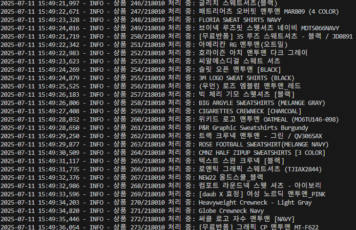

빨라지긴했는데..

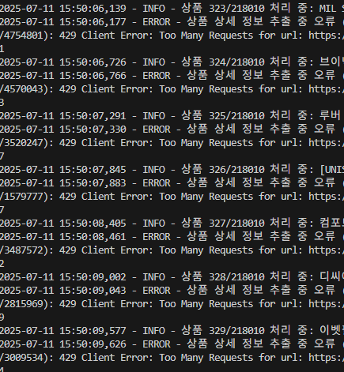

`429 Client Error` 가 발생했다.

아마 크롤러 대상 서버에서, 너무 빠르고 많은 요청이 들어오니 접속 제한을 건 것 같다.

0.5초당 1회 시도로, 300개 처리 후 차단됨.

평균 처리량은 약 초당 2건으로

딜레이를 좀 주었다.

```jsx
import requests
from bs4 import BeautifulSoup
import json
import time
import logging
from datetime import datetime

# 로깅 설정
logging.basicConfig(level=logging.INFO, format='%(asctime)s - %(levelname)s - %(message)s')
logger = logging.getLogger(__name__)

base_delay = 2
error_count = 0

class MusinsaDetailCrawler:
    def __init__(self):
        self.base_url = "https://www.musinsa.com"
        self.session = requests.Session()
        self.session.headers.update({
            'User-Agent': 'Mozilla/5.0 (Windows NT 10.0; Win64; x64) AppleWebKit/537.36 (KHTML, like Gecko) Chrome/120.0.0.0 Safari/537.36',
            'Accept': 'text/html,application/xhtml+xml,application/xml;q=0.9,image/webp,*/*;q=0.8',
            'Accept-Language': 'ko-KR,ko;q=0.8,en-US;q=0.5,en;q=0.3',
            'Accept-Encoding': 'gzip, deflate, br',
            'Connection': 'keep-alive',
        })
        
    def load_existing_data(self, filename):
        """기존 JSON 파일 로드"""
        try:
            with open(filename, 'r', encoding='utf-8') as f:
                data = json.load(f)
            logger.info(f"기존 데이터 로드 완료: {len(data)}개 상품")
            return data
        except Exception as e:
            logger.error(f"파일 로드 중 오류: {e}")
            return []
    
    def is_detail_complete(self, product):
        """상세 정보가 완전한지 확인"""
        # 상세 정보가 있는지 확인하는 조건들
        checks = [
            product.get('img5', ''),
            product.get('gender', ''),  # 성별 정보가 있는지
        ]
        
        # 하나라도 비어있으면 상세 정보 수집 필요
        return all(check for check in checks)
    
    def get_product_detail_info(self, product_info):
        """requests를 사용한 상세 페이지 정보 수집"""
        detail_url = product_info['detail_url']
        if not detail_url.startswith('http'):
            detail_url = self.base_url + detail_url
        
        try:
            response = self.session.get(detail_url, timeout=5)
            response.raise_for_status()
            soup = BeautifulSoup(response.content, 'html.parser')
            
            # 메인 이미지들 추가 수집 (img2, img3, img4)
            main_img_urls = []
            
            # swiper-slide 안의 이미지들
            swiper_imgs = soup.select('.swiper-slide img')
            for img in swiper_imgs:
                src = img.get('src')
                if src and 'image.msscdn.net' in src and '_big.jpg' in src:
                    main_img_urls.append(src)
            
            # 썸네일 이미지들
            if len(main_img_urls) < 4:
                thumbnail_imgs = soup.select('.sc-366fl4-3 img')
                for img in thumbnail_imgs:
                    src = img.get('src')
                    if src and 'image.msscdn.net' in src and src not in main_img_urls:
                        if '_500.jpg' in src:
                            big_src = src.replace('_500.jpg', '_big.jpg')
                            main_img_urls.append(big_src)
                        else:
                            main_img_urls.append(src)
                        if len(main_img_urls) >= 4:
                            break
            
            # img2, img3, img4 할당
            for i, img_url in enumerate(main_img_urls[1:4], 2):
                product_info[f'img{i}'] = img_url
            
            # 성별 정보 추출
            gender_extracted = False
            dl_elements = soup.find_all('dl')
            for dl in dl_elements:
                divs = dl.find_all('div')
                for div in divs:
                    dt = div.find('dt')
                    dd = div.find('dd')
                    if dt and dd and '성별' in dt.get_text():
                        gender_text = dd.get_text(strip=True)
                        if '남성' in gender_text or '남자' in gender_text:
                            product_info['gender'] = 'M'
                        elif '여성' in gender_text or '여자' in gender_text:
                            product_info['gender'] = 'F'
                        elif '공용' in gender_text or '유니섹스' in gender_text:
                            product_info['gender'] = 'U'
                        else:
                            product_info['gender'] = 'U'
                        gender_extracted = True
                        break
                if gender_extracted:
                    break
            
            # 성별 정보를 찾지 못한 경우 상품명에서 추정
            if not gender_extracted:
                product_name_lower = product_info.get('product_name', '').lower()
                if any(word in product_name_lower for word in ['men', '남성', '남자']):
                    product_info['gender'] = 'M'
                elif any(word in product_name_lower for word in ['women', '여성', '여자']):
                    product_info['gender'] = 'F'
                else:
                    product_info['gender'] = 'U'
            
            # 상세 설명 이미지들 추출 (img5에 JSON 배열로 저장)
            detail_img_urls = []
            detail_content = soup.find('div', class_='sc-1ikk4lv-4')
            if detail_content:
                detail_imgs = detail_content.find_all('img')
                for img in detail_imgs:
                    src = img.get('src') or img.get('data-fallback-src')
                    if src:
                        if src.startswith('//'):
                            src = 'https:' + src
                        elif src.startswith('/'):
                            src = self.base_url + src
                        
                        if src not in detail_img_urls:
                            detail_img_urls.append(src)
            
            if detail_img_urls:
                product_info['img5'] = json.dumps(detail_img_urls, ensure_ascii=False)
            
            # 상품 설명
            desc_elem = soup.find('div', class_='product_summary')
            if desc_elem:
                product_info['content'] = desc_elem.get_text(strip=True)[:1500]
            
            return product_info
            
        except Exception as e:
            logger.error(f"상품 상세 정보 추출 중 오류 ({detail_url}): {e}")
            return product_info
    
    def save_data(self, data, filename):
        """데이터 저장"""
        try:
            with open(filename, 'w', encoding='utf-8') as f:
                json.dump(data, f, ensure_ascii=False, indent=2)
            logger.info(f"데이터 저장 완료: {filename} ({len(data)}개 상품)")
        except Exception as e:
            logger.error(f"데이터 저장 중 오류: {e}")
    
    def process_missing_details(self, input_filename, output_filename=None):
        """상세 정보가 없는 상품들만 처리"""
        if output_filename is None:
            output_filename = input_filename.replace('.json', '_completed.json')
        
        # 기존 데이터 로드
        all_products = self.load_existing_data(input_filename)
        
        if not all_products:
            logger.error("데이터를 로드할 수 없습니다.")
            return
        
        # 상세 정보가 없는 상품들 찾기
        incomplete_products = []
        complete_count = 0
        
        for i, product in enumerate(all_products):
            if self.is_detail_complete(product):
                complete_count += 1
            else:
                incomplete_products.append((i, product))
        
        logger.info(f"전체 상품: {len(all_products)}개")
        logger.info(f"완료된 상품: {complete_count}개")
        logger.info(f"처리 필요한 상품: {len(incomplete_products)}개")
        
        if not incomplete_products:
            logger.info("모든 상품의 상세 정보가 완료되었습니다!")
            return
        
        # 상세 정보 수집
        processed_count = 0
        for original_index, product in incomplete_products:
            try:
                time.sleep(base_delay + error_count * 0.5)
                logger.info(f"상품 {processed_count + 1}/{len(incomplete_products)} 처리 중: {product.get('product_name', 'Unknown')}")
                
                updated_product = self.get_product_detail_info(product)
                all_products[original_index] = updated_product
                processed_count += 1
                if "429" in error:
                    error_count += 1
                else:
                    error_count = max(0, error_count - 1)
                
                # 100개마다 중간 저장
                if processed_count % 100 == 0:
                    self.save_data(all_products, output_filename.replace('.json', f'_temp_{processed_count}.json'))
                    logger.info(f"중간 저장 완료: {processed_count}개 처리")
                
                # 요청 간격 조절 (1초 → 0.5초로 단축)
                time.sleep(1.5)
                
            except Exception as e:
                logger.error(f"상품 처리 중 오류: {e}")
                continue
        
        # 최종 저장
        self.save_data(all_products, output_filename)
        logger.info(f"처리 완료! 총 {processed_count}개 상품의 상세 정보를 수집했습니다.")
        
        return all_products

def main():
    crawler = MusinsaDetailCrawler()
    
    # 기존 JSON 파일명 (실제 파일명으로 변경하세요)
    input_file = 'musinsa_products_temp_218010_detailed.json'
    output_file = 'musinsa_products_final_completed.json'
    
    try:
        # 상세 정보가 없는 상품들만 처리
        completed_data = crawler.process_missing_details(input_file, output_file)
        
        if completed_data:
            print(f"✅ 크롤링 완료! 총 {len(completed_data)}개 상품 처리")
            
            # CSV 파일도 생성
            import csv
            csv_filename = output_file.replace('.json', '.csv')
            fieldnames = ['category_id', 'product_name', 'brand', 'gender', 'img1', 'img2', 
                         'img3', 'img4', 'img5', 'content', 'price', 'sale', 'deleted', 
                         'wishlist_count', 'detail_url']
            
            with open(csv_filename, 'w', newline='', encoding='utf-8') as csvfile:
                writer = csv.DictWriter(csvfile, fieldnames=fieldnames)
                writer.writeheader()
                writer.writerows(completed_data)
            
            print(f"✅ CSV 파일도 생성: {csv_filename}")
        
    except Exception as e:
        logger.error(f"메인 처리 중 오류: {e}")

if __name__ == "__main__":
    main()

```

## 잘 되는 줄 알았는데..

selenium 기반으로 할때보다 속도는 빨라졌지만, 실제 들어오는 데이터는 없는 것이 확인되었다.

실제로 img5에 배열로 `이미지 링크`들과, `성별(M, W, U)`이 들어왔어야 하는데, 터미널에 콘솔로그로 저장되었다고 나온 제품을 찾아보면 **하나도 저장되지 않았다.**

상품 세부정보를 가져오는 함수 내에 정말 가져오는지를 확인하는 코드를 넣었다.

```python
# 성별 정보 추출 - 다양한 방법으로 시도
  gender_extracted = False

  # 1. 전체 HTML에서 '성별' 텍스트 검색
  print("DEBUG: 전체 HTML에서 '성별' 검색 중...")
  if '성별' in soup.get_text():
      print("DEBUG: HTML에 '성별' 텍스트가 존재합니다")
      
      # '성별'이 포함된 모든 요소 검색
      gender_elements = soup.find_all(string=lambda text: text and '성별' in text)
      print(f"DEBUG: '성별' 텍스트가 포함된 요소 개수: {len(gender_elements)}")

      for i, elem in enumerate(gender_elements[:3]):  # 처음 3개만 출력
          parent = elem.parent
          print(f"DEBUG: 성별 요소 {i}: '{elem.strip()}', 부모 태그: {parent.name}")
          
          # 부모의 다음 형제 요소에서 성별 값 찾기
          next_sibling = parent.next_sibling
          if next_sibling:
              sibling_text = next_sibling.get_text(strip=True) if hasattr(next_sibling, 'get_text') else str(next_sibling).strip()
              print(f"DEBUG: 다음 형제 요소: '{sibling_text}'")
              
              if '남' in sibling_text:
                  product_info['gender'] = 'M'
                  gender_extracted = True
                  print("DEBUG: 성별 정보에서 남성 감지")
                  break
              elif '여' in sibling_text:
                  product_info['gender'] = 'F'
                  gender_extracted = True
                  print("DEBUG: 성별 정보에서 여성 감지")
                  break
              elif '공용' in sibling_text or '유니섹스' in sibling_text:
                  product_info['gender'] = 'U'
                  gender_extracted = True
                  print("DEBUG: 성별 정보에서 유니섹스 감지")
                  break
  else:
      print("DEBUG: HTML에 '성별' 텍스트가 없습니다")

  # 2. dl 태그에서 성별 정보 찾기 (기존 방법)
  if not gender_extracted:
      dl_elements = soup.find_all('dl')
      print(f"DEBUG: dl 태그 개수: {len(dl_elements)}")
      
      for dl in dl_elements:
          divs = dl.find_all('div')
          for div in divs:
              dt = div.find('dt')
              dd = div.find('dd')
              if dt and dd and '성별' in dt.get_text():
                  gender_text = dd.get_text(strip=True)
                  print(f"DEBUG: dl에서 성별 정보 발견: '{gender_text}'")
                  
                  if '남' in gender_text:
                      product_info['gender'] = 'M'
                      gender_extracted = True
                      break
                  elif '여' in gender_text:
                      product_info['gender'] = 'F'
                      gender_extracted = True
                      break
                  elif '공용' in gender_text or '유니섹스' in gender_text:
                      product_info['gender'] = 'U'
                      gender_extracted = True
                      break
          if gender_extracted:
              break

  # 3. URL에서 성별 추정
  if not gender_extracted:
      url_lower = detail_url.lower()
      if '/men/' in url_lower or 'men' in url_lower:
          product_info['gender'] = 'M'
          print("DEBUG: URL에서 남성 카테고리 감지")
          gender_extracted = True
      elif '/women/' in url_lower or 'women' in url_lower:
          product_info['gender'] = 'F'
          print("DEBUG: URL에서 여성 카테고리 감지")
          gender_extracted = True

  # 4. 상품명에서 성별 추정
  if not gender_extracted:
      product_name_lower = product_info.get('product_name', '').lower()
      if any(word in product_name_lower for word in ['men', '남성', '남자', 'man']):
          product_info['gender'] = 'M'
          print("DEBUG: 상품명에서 남성 추정")
      elif any(word in product_name_lower for word in ['women', '여성', '여자', 'woman']):
          product_info['gender'] = 'F'
          print("DEBUG: 상품명에서 여성 추정")
      else:
          product_info['gender'] = 'U'
          print("DEBUG: 성별 정보 없음 - 유니섹스로 설정")
```

결과는 `"DEBUG: HTML에 '성별' 텍스트가 없습니다"`, `"DEBUG: 성별 정보 없음 - 유니섹스로 설정"` 이었다.

request 라이브러리 방식인 HTML만 읽어오는 방법으로는 필요로 하는 정보를 얻어올 수 없단 뜻이었다.

### 테스트코드

```python
import requests
import time

def test_basic_requests():
    """기본적인 requests 테스트"""
    print("=== 기본 requests 테스트 ===")
    
    # 1. 구글 테스트 (기본 연결 확인)
    try:
        response = requests.get('https://www.google.com', timeout=10)
        print(f"✅ 구글 연결 성공: {response.status_code}")
    except Exception as e:
        print(f"❌ 구글 연결 실패: {e}")
        return False
    
    # 2. 무신사 메인 페이지 테스트
    try:
        response = requests.get('https://www.musinsa.com', timeout=10)
        print(f"✅ 무신사 메인 페이지 연결 성공: {response.status_code}")
        print(f"   응답 길이: {len(response.text)}")
        print(f"   첫 200자: {response.text[:200]}")
    except Exception as e:
        print(f"❌ 무신사 메인 페이지 연결 실패: {e}")
    
    # 3. User-Agent 헤더 추가해서 테스트
    headers = {
        'User-Agent': 'Mozilla/5.0 (Windows NT 10.0; Win64; x64) AppleWebKit/537.36 (KHTML, like Gecko) Chrome/120.0.0.0 Safari/537.36'
    }
    
    try:
        response = requests.get('https://www.musinsa.com', headers=headers, timeout=10)
        print(f"✅ 무신사 (헤더 포함) 연결 성공: {response.status_code}")
        print(f"   응답 길이: {len(response.text)}")
    except Exception as e:
        print(f"❌ 무신사 (헤더 포함) 연결 실패: {e}")
    
    # 4. 실제 상품 페이지 테스트 (샘플 URL)
    sample_url = "https://www.musinsa.com/app/goods/1962206"
    try:
        response = requests.get(sample_url, headers=headers, timeout=10)
        print(f"✅ 무신사 상품 페이지 연결 성공: {response.status_code}")
        print(f"   응답 길이: {len(response.text)}")
        
        # 페이지에 상품 정보가 있는지 확인
        if '상품' in response.text or 'product' in response.text.lower():
            print("   ✅ 상품 정보 포함됨")
        else:
            print("   ❌ 상품 정보 없음 - 차단되었을 가능성")
            
    except Exception as e:
        print(f"❌ 무신사 상품 페이지 연결 실패: {e}")

def test_session():
    """Session 객체 테스트"""
    print("\n=== Session 객체 테스트 ===")
    
    session = requests.Session()
    session.headers.update({
        'User-Agent': 'Mozilla/5.0 (Windows NT 10.0; Win64; x64) AppleWebKit/537.36 (KHTML, like Gecko) Chrome/120.0.0.0 Safari/537.36',
        'Accept': 'text/html,application/xhtml+xml,application/xml;q=0.9,image/webp,*/*;q=0.8',
        'Accept-Language': 'ko-KR,ko;q=0.8,en-US;q=0.5,en;q=0.3',
        'Accept-Encoding': 'gzip, deflate, br',
        'Connection': 'keep-alive',
    })
    
    try:
        response = session.get('https://www.musinsa.com', timeout=10)
        print(f"✅ Session으로 무신사 연결 성공: {response.status_code}")
        print(f"   쿠키 개수: {len(session.cookies)}")
        
        # 두 번째 요청 (세션 유지 확인)
        time.sleep(2)
        response2 = session.get('https://www.musinsa.com/categories/item/001', timeout=10)
        print(f"✅ Session 두 번째 요청 성공: {response2.status_code}")
        
    except Exception as e:
        print(f"❌ Session 테스트 실패: {e}")

def test_ssl():
    """SSL 인증서 문제 확인"""
    print("\n=== SSL 테스트 ===")
    
    try:
        # SSL 검증 비활성화해서 테스트
        response = requests.get('https://www.musinsa.com', verify=False, timeout=10)
        print(f"✅ SSL 검증 없이 연결 성공: {response.status_code}")
    except Exception as e:
        print(f"❌ SSL 검증 없이도 연결 실패: {e}")

if __name__ == "__main__":
    test_basic_requests()
    test_session()
    test_ssl()
    
    print("\n=== 환경 정보 ===")
    print(f"requests 버전: {requests.__version__}")
    
    # 프록시 설정 확인
    import os
    proxy_vars = ['HTTP_PROXY', 'HTTPS_PROXY', 'http_proxy', 'https_proxy']
    for var in proxy_vars:
        if os.environ.get(var):
            print(f"{var}: {os.environ.get(var)}")
```

이 테스트를 통해 헤드리스 환경에서 `인터넷 연결 상태`, `무신사 접근 가능여부`, `헤더 추가시 차이점`, `실제 상품 페이지 접근` , `Session 객체 동작`, `SSL 인증서 문제`, `프록시 설정` 이것들을 확인해서 문제를 찾아볼 수 있다.

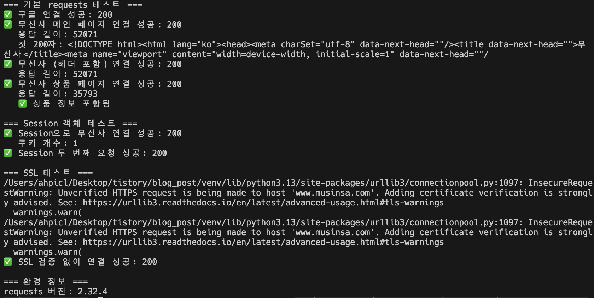

request는 정상적으로 동작하고, 접근도 잘 된다.

그럼 문제는 HTML인데, 크롤링하는 사이트 측에서 Javascript로 `동적 로드` 하거나, `HTML` 구조가 알고있는 것과 다를 수 있다.

### HTML 구조 확인하기

```python
import requests
from bs4 import BeautifulSoup
import json

def analyze_product_page():
    """무신사 상품 페이지 HTML 구조 분석"""
    
    # 샘플 상품 URL
    sample_url = "https://www.musinsa.com/app/goods/1962206"
    
    headers = {
        'User-Agent': 'Mozilla/5.0 (Windows NT 10.0; Win64; x64) AppleWebKit/537.36 (KHTML, like Gecko) Chrome/120.0.0.0 Safari/537.36',
        'Accept': 'text/html,application/xhtml+xml,application/xml;q=0.9,image/webp,*/*;q=0.8',
        'Accept-Language': 'ko-KR,ko;q=0.8,en-US;q=0.5,en;q=0.3',
        'Accept-Encoding': 'gzip, deflate, br',
        'Connection': 'keep-alive',
    }
    
    try:
        response = requests.get(sample_url, headers=headers, timeout=10)
        response.raise_for_status()
        
        print(f"✅ 상품 페이지 로드 성공: {response.status_code}")
        print(f"HTML 길이: {len(response.text)}")
        
        soup = BeautifulSoup(response.text, 'html.parser')
        
        # 1. 페이지 제목 확인
        title = soup.find('title')
        if title:
            print(f"\n📄 페이지 제목: {title.get_text()}")
        
        # 2. '성별' 텍스트가 있는지 확인
        print(f"\n🔍 '성별' 텍스트 검색:")
        if '성별' in response.text:
            print("✅ '성별' 텍스트 발견됨")
            
            # '성별' 주변 텍스트 추출
            lines = response.text.split('\n')
            gender_lines = [line.strip() for line in lines if '성별' in line]
            print("성별 관련 라인들:")
            for i, line in enumerate(gender_lines[:5]):  # 처음 5개만
                print(f"  {i+1}: {line[:100]}")
        else:
            print("❌ '성별' 텍스트 없음")
        
        # 3. dl 태그 분석
        print(f"\n📋 dl 태그 분석:")
        dl_elements = soup.find_all('dl')
        print(f"dl 태그 개수: {len(dl_elements)}")
        
        for i, dl in enumerate(dl_elements[:3]):  # 처음 3개만
            print(f"\ndl[{i}] 내용:")
            print(f"  텍스트: {dl.get_text()[:200]}")
            print(f"  클래스: {dl.get('class', [])}")
        
        # 4. 상품 정보가 있을 만한 다른 태그들 찾기
        print(f"\n🏷️ 상품 정보 태그 분석:")
        
        # table 태그
        tables = soup.find_all('table')
        print(f"table 태그 개수: {len(tables)}")
        
        # ul, ol 태그
        lists = soup.find_all(['ul', 'ol'])
        print(f"ul/ol 태그 개수: {len(lists)}")
        
        # div 태그 중 상품 정보가 있을 만한 것들
        info_divs = soup.find_all('div', class_=lambda x: x and any(keyword in str(x).lower() for keyword in ['info', 'detail', 'spec', 'product']))
        print(f"정보 관련 div 태그 개수: {len(info_divs)}")
        
        for i, div in enumerate(info_divs[:3]):
            print(f"  info_div[{i}] 클래스: {div.get('class', [])}")
            print(f"  내용: {div.get_text()[:100]}")
        
        # 5. JSON 데이터 찾기 (Next.js 앱이므로 JSON 데이터가 있을 수 있음)
        print(f"\n📊 JSON 데이터 분석:")
        script_tags = soup.find_all('script')
        print(f"script 태그 개수: {len(script_tags)}")
        
        json_scripts = []
        for script in script_tags:
            if script.string and ('__NEXT_DATA__' in script.string or 'product' in script.string.lower()):
                json_scripts.append(script.string[:200])
        
        print(f"JSON 관련 script 개수: {len(json_scripts)}")
        for i, script_content in enumerate(json_scripts[:2]):
            print(f"  json_script[{i}]: {script_content}")
        
        # 6. 특정 키워드로 검색
        keywords = ['남성', '여성', '남자', '여자', '남', '여', 'men', 'women', 'male', 'female', 'gender']
        print(f"\n🔎 키워드 검색:")
        
        for keyword in keywords:
            if keyword in response.text.lower():
                print(f"✅ '{keyword}' 발견됨")
                # 해당 키워드 주변 텍스트 추출
                lines = response.text.lower().split('\n')
                keyword_lines = [line.strip() for line in lines if keyword in line]
                if keyword_lines:
                    print(f"  예시: {keyword_lines[0][:100]}")
            else:
                print(f"❌ '{keyword}' 없음")
        
        # 7. HTML 파일로 저장 (분석용)
        with open('musinsa_sample_page.html', 'w', encoding='utf-8') as f:
            f.write(response.text)
        print(f"\n💾 HTML 파일 저장됨: musinsa_sample_page.html")
        
        # 8. 이미지 태그 분석
        print(f"\n🖼️ 이미지 태그 분석:")
        img_tags = soup.find_all('img')
        print(f"img 태그 개수: {len(img_tags)}")
        
        musinsa_imgs = [img for img in img_tags if img.get('src') and 'msscdn.net' in img.get('src')]
        print(f"무신사 CDN 이미지 개수: {len(musinsa_imgs)}")
        
        for i, img in enumerate(musinsa_imgs[:5]):
            print(f"  img[{i}]: {img.get('src')[:80]}")
        
    except Exception as e:
        print(f"❌ 분석 중 오류: {e}")

if __name__ == "__main__":
    analyze_product_page()
```

이 코드로 아래 네 가지를 확인할 수 있다.

1. 성별 정보 위치: 실제로 HTML에 성별 정보가 어떤 형태로 존재하는지
2. HTML 구조: dl 태그, table, div 등에서 상품 정보가 어떻게 구성되어 있는지
3. JSON 데이터: Next.js 앱이므로 **NEXT_DATA** 스크립트에 상품 정보가 JSON으로 있을 가능성
4. 이미지 구조: 실제 이미지들이 어떤 선택자로 접근 가능한지
5. 키워드 검색: 성별 관련 키워드들이 페이지에 존재하는지

그 결과

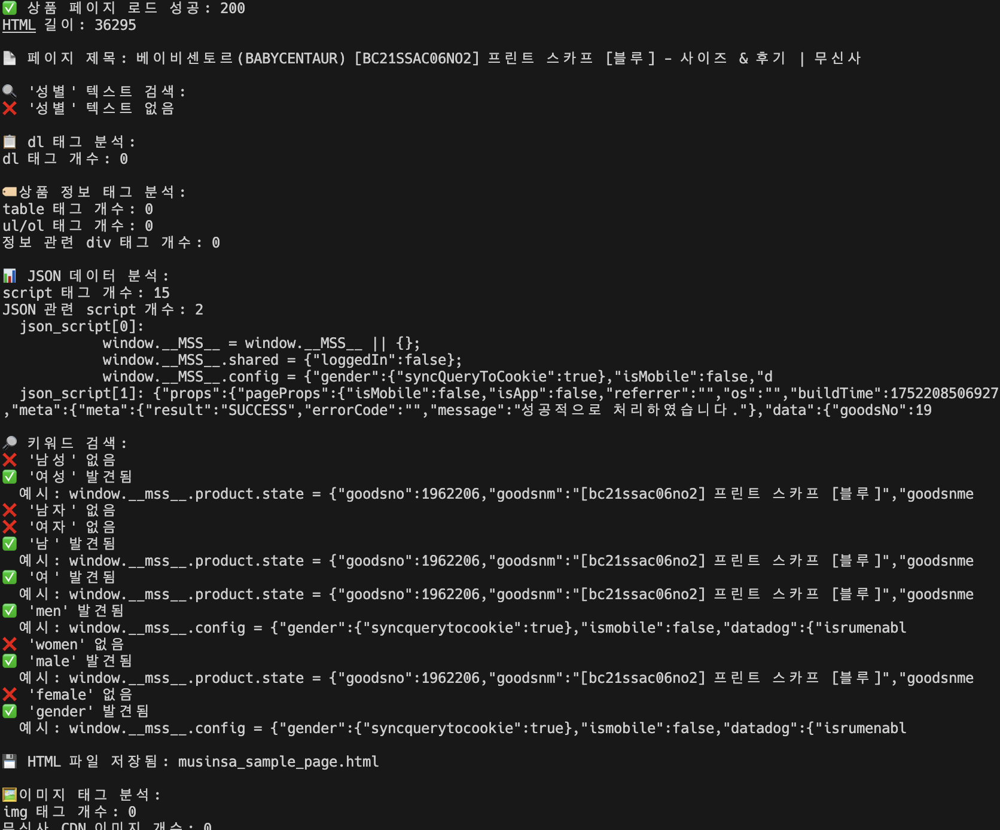

### HTML에는 정보 없다는 것을 알게됨

성별 정보는 `window.__MSS__.product.state` 에 상품 정보와 함께 JavaScript 변수에 JSON으로 저장되어 있었고, HTML 태그에는 예상하던 정보인 `dl`, `table`, `img`  모두 0개로 무신사는 전부 동적으로 렌더한 다는 것을 알게 되었다.

그래서 우리가 가져와야 할 것은 `window.__MSS__` 객체에서 확인 할 수 있다.

### 그래서 변경된 크롤러는

```python
import requests
from bs4 import BeautifulSoup
import json
import time
import logging
import re
from datetime import datetime

# 로깅 설정
logging.basicConfig(level=logging.INFO, format='%(asctime)s - %(levelname)s - %(message)s')
logger = logging.getLogger(__name__)

base_delay = 2
error_count = 0

class MusinsaDetailCrawler:
    def __init__(self):
        self.base_url = "https://www.musinsa.com"
        self.session = requests.Session()
        self.session.headers.update({
            'User-Agent': 'Mozilla/5.0 (Windows NT 10.0; Win64; x64) AppleWebKit/537.36 (KHTML, like Gecko) Chrome/120.0.0.0 Safari/537.36',
            'Accept': 'text/html,application/xhtml+xml,application/xml;q=0.9,image/webp,*/*;q=0.8',
            'Accept-Language': 'ko-KR,ko;q=0.8,en-US;q=0.5,en;q=0.3',
            'Accept-Encoding': 'gzip, deflate, br',
            'Connection': 'keep-alive',
        })

    def extract_json_from_script(self, html_content):
        """JavaScript 변수에서 JSON 데이터 추출"""
        try:
            # window.__MSS__.product.state에서 상품 정보 추출
            pattern = r'window\.__MSS__\.product\.state\s*=\s*({.*?});'
            match = re.search(pattern, html_content, re.DOTALL)
            
            if match:
                json_str = match.group(1)
                product_data = json.loads(json_str)
                print(f"DEBUG: 상품 JSON 데이터 추출 성공")
                return product_data
            else:
                print("DEBUG: window.__MSS__.product.state를 찾을 수 없음")
                
                # 대안: __NEXT_DATA__ 스크립트에서 찾기
                pattern2 = r'<script id="__NEXT_DATA__" type="application/json">(.*?)</script>'
                match2 = re.search(pattern2, html_content, re.DOTALL)
                
                if match2:
                    json_str = match2.group(1)
                    next_data = json.loads(json_str)
                    print(f"DEBUG: __NEXT_DATA__ 추출 성공")
                    return next_data
                else:
                    print("DEBUG: __NEXT_DATA__도 찾을 수 없음")
                    
        except Exception as e:
            print(f"DEBUG: JSON 추출 중 오류: {e}")
            
        return None

    def extract_gender_from_data(self, product_data):
        """JSON 데이터에서 성별 정보 추출"""
        try:
            # 다양한 경로에서 성별 정보 찾기
            possible_paths = [
                ['gender'],
                ['genderCd'],
                ['genderCode'],
                ['productGender'],
                ['goodsGender'],
                ['categoryGender'],
                ['targetGender'],
                ['forGender']
            ]
            
            for path in possible_paths:
                current = product_data
                try:
                    for key in path:
                        if isinstance(current, dict) and key in current:
                            current = current[key]
                        else:
                            break
                    else:
                        # 성공적으로 값을 찾음
                        gender_value = str(current).upper()
                        print(f"DEBUG: 성별 정보 발견 ({'/'.join(path)}): {gender_value}")
                        
                        # 성별 코드 변환
                        if gender_value in ['M', 'MALE', '남성', '남자', '1']:
                            return 'M'
                        elif gender_value in ['F', 'FEMALE', '여성', '여자', '2']:
                            return 'F'
                        elif gender_value in ['U', 'UNISEX', 'BOTH', '공용', '유니섹스', '3']:
                            return 'U'
                        
                except:
                    continue
            
            # 직접 검색으로 성별 정보 찾기
            json_str = json.dumps(product_data, ensure_ascii=False).lower()
            
            if '남성' in json_str or 'male' in json_str or '"m"' in json_str:
                print("DEBUG: JSON 문자열에서 남성 정보 감지")
                return 'M'
            elif '여성' in json_str or 'female' in json_str or '"f"' in json_str:
                print("DEBUG: JSON 문자열에서 여성 정보 감지")
                return 'F'
            elif '공용' in json_str or 'unisex' in json_str:
                print("DEBUG: JSON 문자열에서 유니섹스 정보 감지")
                return 'U'
                
        except Exception as e:
            print(f"DEBUG: 성별 추출 중 오류: {e}")
            
        return None

    def extract_images_from_data(self, product_data, html_content):
        """JSON 데이터와 HTML에서 이미지 URL 추출"""
        images = {
            'img2': '',
            'img3': '',
            'img4': '',
            'img5': json.dumps([], ensure_ascii=False)
        }
        
        try:
            # 메인 이미지들 찾기
            main_images = []
            
            # JSON 데이터에서 이미지 찾기
            def find_images_in_dict(data, images_list):
                if isinstance(data, dict):
                    for key, value in data.items():
                        if isinstance(key, str) and any(img_key in key.lower() for img_key in ['image', 'img', 'photo', 'picture']):
                            if isinstance(value, str) and 'msscdn.net' in value:
                                images_list.append(value)
                            elif isinstance(value, list):
                                for item in value:
                                    if isinstance(item, str) and 'msscdn.net' in item:
                                        images_list.append(item)
                        elif isinstance(value, (dict, list)):
                            find_images_in_dict(value, images_list)
                elif isinstance(data, list):
                    for item in data:
                        find_images_in_dict(item, images_list)
            
            find_images_in_dict(product_data, main_images)
            
            # HTML에서 이미지 URL 직접 추출 (정규식 사용)
            img_pattern = r'https://image\.msscdn\.net/[^"\'>\s]+'
            html_images = re.findall(img_pattern, html_content)
            
            # 중복 제거하고 합치기
            all_images = list(set(main_images + html_images))
            
            # 큰 이미지 우선 선택 (_big.jpg, _500.jpg 등)
            big_images = [img for img in all_images if '_big.jpg' in img or '_500.jpg' in img]
            other_images = [img for img in all_images if img not in big_images]
            
            sorted_images = big_images + other_images
            
            print(f"DEBUG: 총 {len(sorted_images)}개 이미지 발견")
            
            # img2, img3, img4 할당
            for i, img_url in enumerate(sorted_images[1:4], 2):
                images[f'img{i}'] = img_url
                print(f"DEBUG: img{i} = {img_url[:80]}...")
            
            # 상세 이미지들 (img5)
            detail_images = sorted_images[4:] if len(sorted_images) > 4 else []
            if detail_images:
                images['img5'] = json.dumps(detail_images, ensure_ascii=False)
                print(f"DEBUG: 상세 이미지 {len(detail_images)}개 수집")
            
        except Exception as e:
            print(f"DEBUG: 이미지 추출 중 오류: {e}")
            
        return images

    def get_product_detail_info(self, product_info):
        """상세 페이지 정보 수집 (JSON 기반)"""
        detail_url = product_info['detail_url']
        if not detail_url.startswith('http'):
            detail_url = self.base_url + detail_url

        try:
            headers = {
                'User-Agent': 'Mozilla/5.0 (Windows NT 10.0; Win64; x64) AppleWebKit/537.36 (KHTML, like Gecko) Chrome/120.0.0.0 Safari/537.36',
                'Accept': 'text/html,application/xhtml+xml,application/xml;q=0.9,image/avif,image/webp,image/apng,*/*;q=0.8',
                'Accept-Language': 'ko-KR,ko;q=0.9,en-US;q=0.8,en;q=0.7',
                'Accept-Encoding': 'gzip, deflate, br',
                'Connection': 'keep-alive',
                'Upgrade-Insecure-Requests': '1',
                'Sec-Fetch-Dest': 'document',
                'Sec-Fetch-Mode': 'navigate',
                'Sec-Fetch-Site': 'none',
                'Cache-Control': 'max-age=0'
            }

            response = self.session.get(detail_url, headers=headers, timeout=10)
            response.raise_for_status()

            html_content = response.text
            print(f"DEBUG: HTML 길이: {len(html_content)}")

            # JavaScript에서 JSON 데이터 추출
            product_data = self.extract_json_from_script(html_content)
            
            if product_data:
                # 성별 정보 추출
                gender = self.extract_gender_from_data(product_data)
                if gender:
                    product_info['gender'] = gender
                    print(f"DEBUG: 성별 설정: {gender}")
                else:
                    # URL이나 상품명에서 추정
                    url_lower = detail_url.lower()
                    product_name_lower = product_info.get('product_name', '').lower()
                    
                    if '/men/' in url_lower or 'men' in url_lower or any(word in product_name_lower for word in ['men', '남성', '남자', 'man']):
                        product_info['gender'] = 'M'
                        print("DEBUG: URL/상품명에서 남성 추정")
                    elif '/women/' in url_lower or 'women' in url_lower or any(word in product_name_lower for word in ['women', '여성', '여자', 'woman']):
                        product_info['gender'] = 'F'
                        print("DEBUG: URL/상품명에서 여성 추정")
                    else:
                        product_info['gender'] = 'U'
                        print("DEBUG: 성별 정보 없음 - 유니섹스로 설정")
                
                # 이미지 정보 추출
                images = self.extract_images_from_data(product_data, html_content)
                product_info.update(images)
                
                # 상품 설명 추출 (JSON에서)
                try:
                    if 'goodsDescription' in str(product_data):
                        desc_pattern = r'"goodsDescription":"([^"]*)"'
                        desc_match = re.search(desc_pattern, json.dumps(product_data, ensure_ascii=False))
                        if desc_match:
                            product_info['content'] = desc_match.group(1)[:1500]
                            print("DEBUG: 상품 설명 수집 완료")
                except:
                    pass
                    
            else:
                print("DEBUG: JSON 데이터를 추출할 수 없음 - 기본값 설정")
                product_info['gender'] = 'U'
                product_info['img2'] = ''
                product_info['img3'] = ''
                product_info['img4'] = ''
                product_info['img5'] = json.dumps([], ensure_ascii=False)

            return product_info

        except Exception as e:
            logger.error(f"상품 상세 정보 추출 중 오류 ({detail_url}): {e}")
            # 에러 발생 시에도 기본값 설정
            product_info['gender'] = 'U'
            product_info['img2'] = ''
            product_info['img3'] = ''
            product_info['img4'] = ''
            product_info['img5'] = json.dumps([], ensure_ascii=False)
            return product_info

    def load_existing_data(self, filename):
        """기존 JSON 파일 로드"""
        try:
            with open(filename, 'r', encoding='utf-8') as f:
                data = json.load(f)
            logger.info(f"기존 데이터 로드 완료: {len(data)}개 상품")
            return data
        except Exception as e:
            logger.error(f"파일 로드 중 오류: {e}")
            return []

    def is_detail_complete(self, product):
        """상세 정보가 완전한지 확인"""
        checks = [
            product.get('img5', ''),
            product.get('gender', ''),
        ]
        return all(check for check in checks)

    def save_data(self, data, filename):
        """데이터 저장"""
        try:
            with open(filename, 'w', encoding='utf-8') as f:
                json.dump(data, f, ensure_ascii=False, indent=2)
            logger.info(f"데이터 저장 완료: {filename} ({len(data)}개 상품)")
        except Exception as e:
            logger.error(f"데이터 저장 중 오류: {e}")

    def process_missing_details(self, input_filename, output_filename=None, max_items=5):
        """상세 정보가 없는 상품들만 처리 (테스트용)"""
        global error_count

        if output_filename is None:
            output_filename = input_filename.replace('.json', '_fixed_test.json')

        # 기존 데이터 로드
        all_products = self.load_existing_data(input_filename)

        if not all_products:
            logger.error("데이터를 로드할 수 없습니다.")
            return

        # 상세 정보가 없는 상품들 찾기
        incomplete_products = []
        complete_count = 0

        for i, product in enumerate(all_products):
            if self.is_detail_complete(product):
                complete_count += 1
            else:
                incomplete_products.append((i, product))

        logger.info(f"전체 상품: {len(all_products)}개")
        logger.info(f"완료된 상품: {complete_count}개")
        logger.info(f"처리 필요한 상품: {len(incomplete_products)}개")

        if not incomplete_products:
            logger.info("모든 상품의 상세 정보가 완료되었습니다!")
            return

        # 테스트용으로 최대 개수 제한
        test_products = incomplete_products[:max_items]
        logger.info(f"테스트용으로 {len(test_products)}개 상품만 처리합니다.")

        # 상세 정보 수집
        processed_count = 0
        for original_index, product in test_products:
            try:
                # 동적 지연 시간 적용
                delay_time = base_delay + error_count * 0.5
                time.sleep(delay_time)

                logger.info(f"상품 {processed_count + 1}/{len(test_products)} 처리 중: {product.get('product_name', 'Unknown')}")
                print(f"DEBUG: 처리 중인 URL: {product.get('detail_url', 'Unknown')}")

                updated_product = self.get_product_detail_info(product)
                all_products[original_index] = updated_product
                processed_count += 1

                # 성공 시 error_count 감소
                error_count = max(0, error_count - 1)

                print("="*80)  # 구분선

            except Exception as e:
                error_message = str(e)
                logger.error(f"상품 처리 중 오류: {error_message}")

                # 429 에러 (Too Many Requests) 체크
                if "429" in error_message or "Too Many Requests" in error_message:
                    error_count += 1
                    logger.warning(f"Rate limit 감지, 지연 시간 증가: {error_count}")

                continue

        # 최종 저장
        self.save_data(all_products, output_filename)
        logger.info(f"테스트 완료! 총 {processed_count}개 상품의 상세 정보를 수집했습니다.")

        return all_products

def main():
    crawler = MusinsaDetailCrawler()

    # 기존 JSON 파일명 (실제 파일명으로 변경하세요)
    input_file = 'musinsa_products_temp_218010_detailed.json'
    output_file = 'musinsa_fixed_test_result.json'

    try:
        # 테스트용으로 5개 상품만 처리
        completed_data = crawler.process_missing_details(input_file, output_file, max_items=5)

        if completed_data:
            print(f"✅ 테스트 완료! 총 {len(completed_data)}개 상품 처리")

    except Exception as e:
        logger.error(f"메인 처리 중 오류: {e}")

if __name__ == "__main__":
    main()
```

개선사항으로는, 

1. **JavaScript 변수에서 JSON 추출**: `window.**MSS**.product.state`에서 상품 정보를 직접 추출
2. **정규식 기반 파싱**: BeautifulSoup 대신 `정규식`으로 JavaScript 변수와 JSON 데이터 추출
3. **다양한 성별 정보 경로**: JSON 데이터에서 여러 가능한 키로 성별 정보 검색
4. **이미지 URL 직접 추출**: HTML과 JSON에서 무신사 `CDN 이미지 URL 직접` 추출
5. **강력한 오류 처리**: JSON 파싱 실패 시에도 기본값 설정

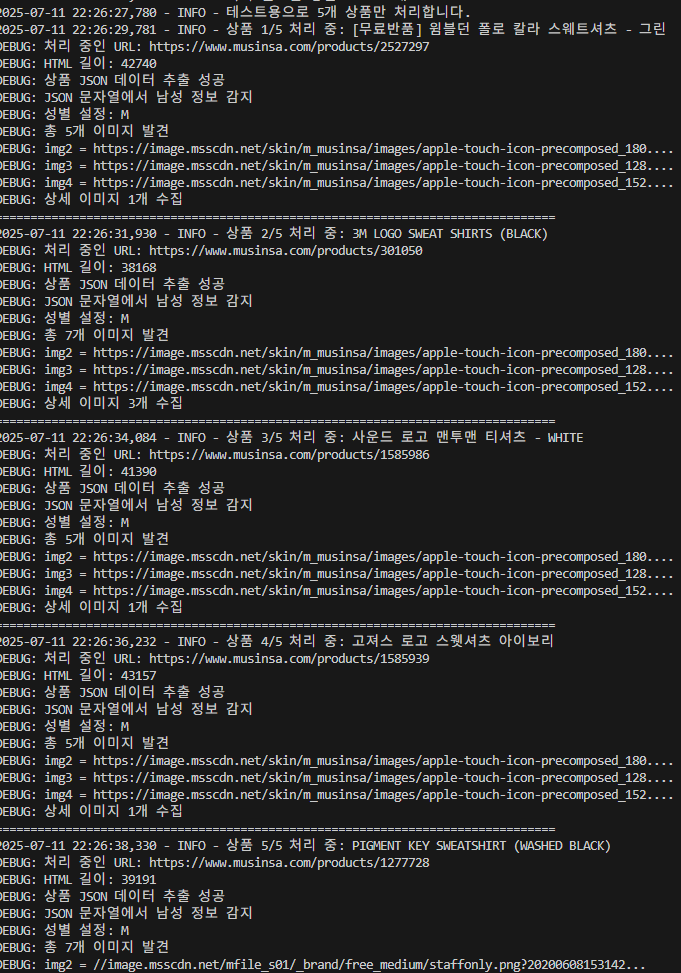

제대로 가져와진다!

다만 잘못된 이미지가 제품이미지로 들어가기때문에 이미지 필터링이 필요하다. 

1. 이미지 필터링 강화:
• is_valid_product_image() 함수로 아이콘, 로고, 스프라이트 이미지 제외
• 실제 상품 이미지만 선별적으로 수집
2. 제외되는 이미지 패턴:
• apple-touch-icon, favicon, logo, icon
• /skin/, /images/common/, *brand/ 등 사이트 리소스
• btn*, bg_, arrow, bullet 등 UI 요소
3. 포함되는 이미지 패턴:
• /goods/, /product/, /item/ 경로
• _big.jpg, _500.jpg 고해상도 이미지
• goods_img, product_img 상품 이미지

## 진짜 최종

```jsx
import requests
from bs4 import BeautifulSoup
import json
import time
import logging
import re
from datetime import datetime

# 로깅 설정
logging.basicConfig(level=logging.INFO, format='%(asctime)s - %(levelname)s - %(message)s')
logger = logging.getLogger(__name__)

base_delay = 2
error_count = 0

class MusinsaDetailCrawler:
    def __init__(self):
        self.base_url = "https://www.musinsa.com"
        self.session = requests.Session()
        self.session.headers.update({
            'User-Agent': 'Mozilla/5.0 (Windows NT 10.0; Win64; x64) AppleWebKit/537.36 (KHTML, like Gecko) Chrome/120.0.0.0 Safari/537.36',
            'Accept': 'text/html,application/xhtml+xml,application/xml;q=0.9,image/webp,*/*;q=0.8',
            'Accept-Language': 'ko-KR,ko;q=0.8,en-US;q=0.5,en;q=0.3',
            'Accept-Encoding': 'gzip, deflate, br',
            'Connection': 'keep-alive',
        })

    def is_valid_product_image(self, img_url):
        """상품 이미지인지 확인 (아이콘이나 로고 제외)"""
        if not img_url or not isinstance(img_url, str):
            return False
            
        # 제외할 이미지 패턴들
        exclude_patterns = [
            'apple-touch-icon',
            'favicon',
            'logo',
            'icon',
            '/skin/',
            '/images/common/',
            '/images/icon/',
            'sprite',
            'btn_',
            'bg_',
            'arrow',
            'bullet',
            '_brand/',
            'brand_logo',
            'mfile_s01/_brand'
        ]
        
        img_url_lower = img_url.lower()
        
        # 제외 패턴에 해당하면 False
        for pattern in exclude_patterns:
            if pattern in img_url_lower:
                return False
        
        # 상품 이미지 패턴들
        valid_patterns = [
            '/goods/',
            '/product/',
            '/item/',
            '_big.jpg',
            '_500.jpg',
            '_detail',
            'goods_img',
            'product_img'
        ]
        
        # 유효한 패턴이 있으면 True
        for pattern in valid_patterns:
            if pattern in img_url_lower:
                return True
        
        # msscdn.net이면서 위 조건들을 통과했으면 상품 이미지일 가능성 높음
        if 'msscdn.net' in img_url_lower and len(img_url) > 50:
            return True
            
        return False

    def extract_json_from_script(self, html_content):
        """JavaScript 변수에서 JSON 데이터 추출"""
        try:
            # window.__MSS__.product.state에서 상품 정보 추출
            pattern = r'window\.__MSS__\.product\.state\s*=\s*({.*?});'
            match = re.search(pattern, html_content, re.DOTALL)
            
            if match:
                json_str = match.group(1)
                product_data = json.loads(json_str)
                print(f"DEBUG: 상품 JSON 데이터 추출 성공")
                return product_data
            else:
                print("DEBUG: window.__MSS__.product.state를 찾을 수 없음")
                
                # 대안: __NEXT_DATA__ 스크립트에서 찾기
                pattern2 = r'<script id="__NEXT_DATA__" type="application/json">(.*?)</script>'
                match2 = re.search(pattern2, html_content, re.DOTALL)
                
                if match2:
                    json_str = match2.group(1)
                    next_data = json.loads(json_str)
                    print(f"DEBUG: __NEXT_DATA__ 추출 성공")
                    return next_data
                else:
                    print("DEBUG: __NEXT_DATA__도 찾을 수 없음")
                    
        except Exception as e:
            print(f"DEBUG: JSON 추출 중 오류: {e}")
            
        return None

    def extract_gender_from_data(self, product_data):
        """JSON 데이터에서 성별 정보 추출"""
        try:
            # 다양한 경로에서 성별 정보 찾기
            possible_paths = [
                ['gender'],
                ['genderCd'],
                ['genderCode'],
                ['productGender'],
                ['goodsGender'],
                ['categoryGender'],
                ['targetGender'],
                ['forGender']
            ]
            
            for path in possible_paths:
                current = product_data
                try:
                    for key in path:
                        if isinstance(current, dict) and key in current:
                            current = current[key]
                        else:
                            break
                    else:
                        # 성공적으로 값을 찾음
                        gender_value = str(current).upper()
                        print(f"DEBUG: 성별 정보 발견 ({'/'.join(path)}): {gender_value}")
                        
                        # 성별 코드 변환
                        if gender_value in ['M', 'MALE', '남성', '남자', '1']:
                            return 'M'
                        elif gender_value in ['F', 'FEMALE', '여성', '여자', '2']:
                            return 'F'
                        elif gender_value in ['U', 'UNISEX', 'BOTH', '공용', '유니섹스', '3']:
                            return 'U'
                        
                except:
                    continue
            
            # 직접 검색으로 성별 정보 찾기
            json_str = json.dumps(product_data, ensure_ascii=False).lower()
            
            if '남성' in json_str or 'male' in json_str or '"m"' in json_str:
                print("DEBUG: JSON 문자열에서 남성 정보 감지")
                return 'M'
            elif '여성' in json_str or 'female' in json_str or '"f"' in json_str:
                print("DEBUG: JSON 문자열에서 여성 정보 감지")
                return 'F'
            elif '공용' in json_str or 'unisex' in json_str:
                print("DEBUG: JSON 문자열에서 유니섹스 정보 감지")
                return 'U'
                
        except Exception as e:
            print(f"DEBUG: 성별 추출 중 오류: {e}")
            
        return None

    def extract_images_from_data(self, product_data, html_content):
        """JSON 데이터와 HTML에서 이미지 URL 추출 (개선된 필터링)"""
        images = {
            'img2': '',
            'img3': '',
            'img4': '',
            'img5': json.dumps([], ensure_ascii=False)
        }
        
        try:
            # 메인 이미지들 찾기
            main_images = []
            
            # JSON 데이터에서 이미지 찾기
            def find_images_in_dict(data, images_list):
                if isinstance(data, dict):
                    for key, value in data.items():
                        if isinstance(key, str) and any(img_key in key.lower() for img_key in ['image', 'img', 'photo', 'picture']):
                            if isinstance(value, str) and 'msscdn.net' in value:
                                if self.is_valid_product_image(value):
                                    images_list.append(value)
                            elif isinstance(value, list):
                                for item in value:
                                    if isinstance(item, str) and 'msscdn.net' in item:
                                        if self.is_valid_product_image(item):
                                            images_list.append(item)
                        elif isinstance(value, (dict, list)):
                            find_images_in_dict(value, images_list)
                elif isinstance(data, list):
                    for item in data:
                        find_images_in_dict(item, images_list)
            
            find_images_in_dict(product_data, main_images)
            
            # HTML에서 이미지 URL 직접 추출 (정규식 사용)
            img_pattern = r'https?://image\.msscdn\.net/[^"\'>\s]+'
            html_images = re.findall(img_pattern, html_content)
            
            # 유효한 상품 이미지만 필터링
            valid_html_images = [img for img in html_images if self.is_valid_product_image(img)]
            
            # 중복 제거하고 합치기
            all_images = list(set(main_images + valid_html_images))
            
            # 큰 이미지 우선 선택 (_big.jpg, _500.jpg 등)
            big_images = [img for img in all_images if '_big.jpg' in img or '_500.jpg' in img]
            other_images = [img for img in all_images if img not in big_images]
            
            sorted_images = big_images + other_images
            
            print(f"DEBUG: 총 {len(sorted_images)}개 유효한 상품 이미지 발견")
            
            # 이미지 URL 정리 (// 프로토콜 추가)
            cleaned_images = []
            for img_url in sorted_images:
                if img_url.startswith('//'):
                    img_url = 'https:' + img_url
                elif img_url.startswith('/'):
                    img_url = self.base_url + img_url
                cleaned_images.append(img_url)
            
            # img2, img3, img4 할당
            for i, img_url in enumerate(cleaned_images[:3], 2):
                images[f'img{i}'] = img_url
                print(f"DEBUG: img{i} = {img_url[:80]}...")
            
            # 상세 이미지들 (img5)
            detail_images = cleaned_images[3:] if len(cleaned_images) > 3 else []
            if detail_images:
                images['img5'] = json.dumps(detail_images, ensure_ascii=False)
                print(f"DEBUG: 상세 이미지 {len(detail_images)}개 수집")
            else:
                print("DEBUG: 상세 이미지 없음")
            
        except Exception as e:
            print(f"DEBUG: 이미지 추출 중 오류: {e}")
            
        return images

    def get_product_detail_info(self, product_info):
        """상세 페이지 정보 수집 (JSON 기반)"""
        detail_url = product_info['detail_url']
        if not detail_url.startswith('http'):
            detail_url = self.base_url + detail_url

        try:
            headers = {
                'User-Agent': 'Mozilla/5.0 (Windows NT 10.0; Win64; x64) AppleWebKit/537.36 (KHTML, like Gecko) Chrome/120.0.0.0 Safari/537.36',
                'Accept': 'text/html,application/xhtml+xml,application/xml;q=0.9,image/avif,image/webp,image/apng,*/*;q=0.8',
                'Accept-Language': 'ko-KR,ko;q=0.9,en-US;q=0.8,en;q=0.7',
                'Accept-Encoding': 'gzip, deflate, br',
                'Connection': 'keep-alive',
                'Upgrade-Insecure-Requests': '1',
                'Sec-Fetch-Dest': 'document',
                'Sec-Fetch-Mode': 'navigate',
                'Sec-Fetch-Site': 'none',
                'Cache-Control': 'max-age=0'
            }

            response = self.session.get(detail_url, headers=headers, timeout=10)
            response.raise_for_status()

            html_content = response.text
            print(f"DEBUG: HTML 길이: {len(html_content)}")

            # JavaScript에서 JSON 데이터 추출
            product_data = self.extract_json_from_script(html_content)
            
            if product_data:
                # 성별 정보 추출
                gender = self.extract_gender_from_data(product_data)
                if gender:
                    product_info['gender'] = gender
                    print(f"DEBUG: 성별 설정: {gender}")
                else:
                    # URL이나 상품명에서 추정
                    url_lower = detail_url.lower()
                    product_name_lower = product_info.get('product_name', '').lower()
                    
                    if '/men/' in url_lower or 'men' in url_lower or any(word in product_name_lower for word in ['men', '남성', '남자', 'man']):
                        product_info['gender'] = 'M'
                        print("DEBUG: URL/상품명에서 남성 추정")
                    elif '/women/' in url_lower or 'women' in url_lower or any(word in product_name_lower for word in ['women', '여성', '여자', 'woman']):
                        product_info['gender'] = 'F'
                        print("DEBUG: URL/상품명에서 여성 추정")
                    else:
                        product_info['gender'] = 'U'
                        print("DEBUG: 성별 정보 없음 - 유니섹스로 설정")
                
                # 이미지 정보 추출 (개선된 필터링)
                images = self.extract_images_from_data(product_data, html_content)
                product_info.update(images)
                
                # 상품 설명 추출 (JSON에서)
                try:
                    if 'goodsDescription' in str(product_data):
                        desc_pattern = r'"goodsDescription":"([^"]*)"'
                        desc_match = re.search(desc_pattern, json.dumps(product_data, ensure_ascii=False))
                        if desc_match:
                            product_info['content'] = desc_match.group(1)[:1500]
                            print("DEBUG: 상품 설명 수집 완료")
                except:
                    pass
                    
            else:
                print("DEBUG: JSON 데이터를 추출할 수 없음 - 기본값 설정")
                product_info['gender'] = 'U'
                product_info['img2'] = ''
                product_info['img3'] = ''
                product_info['img4'] = ''
                product_info['img5'] = json.dumps([], ensure_ascii=False)

            return product_info

        except Exception as e:
            logger.error(f"상품 상세 정보 추출 중 오류 ({detail_url}): {e}")
            # 에러 발생 시에도 기본값 설정
            product_info['gender'] = 'U'
            product_info['img2'] = ''
            product_info['img3'] = ''
            product_info['img4'] = ''
            product_info['img5'] = json.dumps([], ensure_ascii=False)
            return product_info

    def load_existing_data(self, filename):
        """기존 JSON 파일 로드"""
        try:
            with open(filename, 'r', encoding='utf-8') as f:
                data = json.load(f)
            logger.info(f"기존 데이터 로드 완료: {len(data)}개 상품")
            return data
        except Exception as e:
            logger.error(f"파일 로드 중 오류: {e}")
            return []

    def is_detail_complete(self, product):
        """상세 정보가 완전한지 확인"""
        checks = [
            product.get('img5', ''),
            product.get('gender', ''),
        ]
        return all(check for check in checks)

    def save_data(self, data, filename):
        """데이터 저장"""
        try:
            with open(filename, 'w', encoding='utf-8') as f:
                json.dump(data, f, ensure_ascii=False, indent=2)
            logger.info(f"데이터 저장 완료: {filename} ({len(data)}개 상품)")
        except Exception as e:
            logger.error(f"데이터 저장 중 오류: {e}")

    def process_missing_details(self, input_filename, output_filename=None, max_items=5):
        """상세 정보가 없는 상품들만 처리 (테스트용)"""
        global error_count

        if output_filename is None:
            output_filename = input_filename.replace('.json', '_final_fixed.json')

        # 기존 데이터 로드
        all_products = self.load_existing_data(input_filename)

        if not all_products:
            logger.error("데이터를 로드할 수 없습니다.")
            return

        # 상세 정보가 없는 상품들 찾기
        incomplete_products = []
        complete_count = 0

        for i, product in enumerate(all_products):
            if self.is_detail_complete(product):
                complete_count += 1
            else:
                incomplete_products.append((i, product))

        logger.info(f"전체 상품: {len(all_products)}개")
        logger.info(f"완료된 상품: {complete_count}개")
        logger.info(f"처리 필요한 상품: {len(incomplete_products)}개")

        if not incomplete_products:
            logger.info("모든 상품의 상세 정보가 완료되었습니다!")
            return

        # 테스트용으로 최대 개수 제한
        test_products = incomplete_products[:max_items]
        logger.info(f"테스트용으로 {len(test_products)}개 상품만 처리합니다.")

        # 상세 정보 수집
        processed_count = 0
        for original_index, product in test_products:
            try:
                # 동적 지연 시간 적용
                delay_time = base_delay + error_count * 0.5
                time.sleep(delay_time)

                logger.info(f"상품 {processed_count + 1}/{len(test_products)} 처리 중: {product.get('product_name', 'Unknown')}")
                print(f"DEBUG: 처리 중인 URL: {product.get('detail_url', 'Unknown')}")

                updated_product = self.get_product_detail_info(product)
                all_products[original_index] = updated_product
                processed_count += 1

                # 성공 시 error_count 감소
                error_count = max(0, error_count - 1)

                print("="*80)  # 구분선

            except Exception as e:
                error_message = str(e)
                logger.error(f"상품 처리 중 오류: {error_message}")

                # 429 에러 (Too Many Requests) 체크
                if "429" in error_message or "Too Many Requests" in error_message:
                    error_count += 1
                    logger.warning(f"Rate limit 감지, 지연 시간 증가: {error_count}")

                continue

        # 최종 저장
        self.save_data(all_products, output_filename)
        logger.info(f"테스트 완료! 총 {processed_count}개 상품의 상세 정보를 수집했습니다.")

        return all_products

def main():
    crawler = MusinsaDetailCrawler()

    # 기존 JSON 파일명 (실제 파일명으로 변경하세요)
    input_file = 'musinsa_products_temp_218010_detailed.json'
    output_file = 'musinsa_final_result.json'

    try:
        # 테스트용으로 5개 상품만 처리
        completed_data = crawler.process_missing_details(input_file, output_file, max_items=5)

        if completed_data:
            print(f"✅ 테스트 완료! 총 {len(completed_data)}개 상품 처리")

    except Exception as e:
        logger.error(f"메인 처리 중 오류: {e}")

if __name__ == "__main__":
    main()

```

인줄 알았는데, 제품 이미지가 덜 넘어온다.

### 디버깅 + 제품이미지 개선

```python
2025-07-11 23:01:08,452 - INFO - 상품 1/3 처리 중: [무료반품] 윔블던 폴로 칼라 스웨트셔츠 - 그린
DEBUG: 처리 중인 URL: https://www.musinsa.com/products/2527297
DEBUG: HTML 길이: 42740
DEBUG: 상품 JSON 데이터 추출 성공
DEBUG: JSON 문자열에서 남성 정보 감지
DEBUG: 성별 설정: M
DEBUG: 전체 이미지 13개 중 유효한 상품 이미지 3개 발견
DEBUG: 메인 이미지 2개, 상세 이미지 1개
DEBUG: img2 = https://image.msscdn.net/images/goods_img/20220428/2527297/2527297_1_500.jpg
DEBUG: img3 = https://image.msscdn.net/images/goods_img/20220428/2527297/2527297_1_500.jpg
DEBUG: 상세 이미지 1개 수집
DEBUG: 상세이미지[1] = https://image.msscdn.net/images/prd_img/20220428/2527297/detail_2527297_2_500.jpg\ 메인이미지 4개이상있는데 img4를 왜 못얻었지?https://image.msscdn.net/thumbnails/images/prd_img/20220428/2527297/detail_2527297_4_big.jpg?w=1200
```

문제점들:

1. 중복 이미지: img2와 img3이 같은 URL
2. 메인 이미지 누락: 실제로는 더 많은 메인 이미지가 있음
3. 이미지 분류 로직 문제: thumbnails 경로의 이미지들이 제대로 분류되지 않음

```python
import requests
from bs4 import BeautifulSoup
import json
import time
import logging
import re
from datetime import datetime

# 로깅 설정
logging.basicConfig(level=logging.INFO, format='%(asctime)s - %(levelname)s - %(message)s')
logger = logging.getLogger(__name__)

base_delay = 2
error_count = 0

class MusinsaDetailCrawler:
    def __init__(self):
        self.base_url = "https://www.musinsa.com"
        self.session = requests.Session()
        self.session.headers.update({
            'User-Agent': 'Mozilla/5.0 (Windows NT 10.0; Win64; x64) AppleWebKit/537.36 (KHTML, like Gecko) Chrome/120.0.0.0 Safari/537.36',
            'Accept': 'text/html,application/xhtml+xml,application/xml;q=0.9,image/webp,*/*;q=0.8',
            'Accept-Language': 'ko-KR,ko;q=0.8,en-US;q=0.5,en;q=0.3',
            'Accept-Encoding': 'gzip, deflate, br',
            'Connection': 'keep-alive',
        })

    def is_valid_product_image(self, img_url):
        """상품 이미지인지 확인"""
        if not img_url or not isinstance(img_url, str):
            return False
            
        # 제외할 이미지 패턴들
        exclude_patterns = [
            'apple-touch-icon',
            'favicon',
            'logo',
            'icon',
            '/skin/',
            '/images/common/',
            '/images/icon/',
            'sprite',
            'btn_',
            'bg_',
            'arrow',
            'bullet',
            '_brand/',
            'brand_logo',
            'mfile_s01/_brand',
            '_shopstaff/',
            'staff_'
        ]
        
        img_url_lower = img_url.lower()
        
        # 제외 패턴에 해당하면 False
        for pattern in exclude_patterns:
            if pattern in img_url_lower:
                return False
        
        # 상품 이미지 패턴들
        valid_patterns = [
            'goods_img',      # 메인 상품 이미지
            'prd_img',        # 상세 상품 이미지
            '/goods/',
            '/product/',
            '/item/',
            '_big.jpg',
            '_500.jpg',
            'detail_'
        ]
        
        # 유효한 패턴이 있으면 True
        for pattern in valid_patterns:
            if pattern in img_url_lower:
                return True
        
        return False

    def extract_all_product_images(self, html_content):
        """HTML에서 모든 상품 이미지 추출 (상세 디버깅)"""
        all_images = []
        
        # 다양한 이미지 도메인과 패턴 매칭
        image_patterns = [
            # 기본 msscdn.net 패턴
            r'https?://image\.msscdn\.net/[^"\'>\s]+',
            # thumbnails 서브도메인
            r'https?://image\.msscdn\.net/thumbnails/[^"\'>\s]+',
            # musinsa.com 도메인
            r'https?://image\.musinsa\.com/[^"\'>\s]+',
            # thumbnails musinsa.com
            r'https?://image\.musinsa\.com/thumbnails/[^"\'>\s]+',
            # 프로토콜 없는 경우
            r'//image\.msscdn\.net/[^"\'>\s]+',
            r'//image\.musinsa\.com/[^"\'>\s]+'
        ]
        
        print("DEBUG: 이미지 패턴별 추출 결과:")
        for i, pattern in enumerate(image_patterns):
            matches = re.findall(pattern, html_content)
            print(f"  패턴 {i+1}: {len(matches)}개 발견")
            if matches:
                for j, match in enumerate(matches[:3]):  # 처음 3개만 출력
                    print(f"    예시 {j+1}: {match[:80]}...")
            all_images.extend(matches)
        
        # 중복 제거
        unique_images = list(set(all_images))
        print(f"DEBUG: 중복 제거 후 총 {len(unique_images)}개 이미지")
        
        # 유효한 상품 이미지만 필터링
        valid_images = []
        invalid_images = []
        
        for img in unique_images:
            if self.is_valid_product_image(img):
                valid_images.append(img)
            else:
                invalid_images.append(img)
        
        print(f"DEBUG: 유효한 상품 이미지 {len(valid_images)}개, 제외된 이미지 {len(invalid_images)}개")
        
        # 제외된 이미지들 출력 (디버깅용)
        print("DEBUG: 제외된 이미지들:")
        for i, img in enumerate(invalid_images[:5]):  # 처음 5개만
            print(f"  제외 {i+1}: {img[:80]}...")
        
        # 유효한 이미지들 출력 (디버깅용)
        print("DEBUG: 유효한 상품 이미지들:")
        for i, img in enumerate(valid_images):
            print(f"  유효 {i+1}: {img}")
        
        return valid_images

    def categorize_images(self, images):
        """이미지를 메인/상세로 분류 (상세 디버깅)"""
        main_images = []
        detail_images = []
        
        print("DEBUG: 이미지 분류 과정:")
        
        for i, img in enumerate(images):
            img_lower = img.lower()
            
            # 상세 이미지 패턴
            if any(pattern in img_lower for pattern in ['detail_', 'prd_img']):
                detail_images.append(img)
                print(f"  이미지 {i+1}: 상세 이미지로 분류 - {img[:60]}...")
            # 메인 이미지 패턴
            elif any(pattern in img_lower for pattern in ['goods_img', '_big.jpg', '_500.jpg']):
                main_images.append(img)
                print(f"  이미지 {i+1}: 메인 이미지로 분류 - {img[:60]}...")
            else:
                # 기본적으로 메인 이미지로 분류
                main_images.append(img)
                print(f"  이미지 {i+1}: 기본 메인 이미지로 분류 - {img[:60]}...")
        
        # 크기별 정렬 (큰 이미지 우선)
        def sort_by_size(img_list):
            big_imgs = [img for img in img_list if '_big.jpg' in img]
            medium_imgs = [img for img in img_list if '_500.jpg' in img and img not in big_imgs]
            other_imgs = [img for img in img_list if img not in big_imgs and img not in medium_imgs]
            
            print(f"    정렬 결과: _big.jpg {len(big_imgs)}개, _500.jpg {len(medium_imgs)}개, 기타 {len(other_imgs)}개")
            
            return big_imgs + medium_imgs + other_imgs
        
        print("DEBUG: 메인 이미지 정렬:")
        main_images = sort_by_size(main_images)
        
        print("DEBUG: 상세 이미지 정렬:")
        detail_images = sort_by_size(detail_images)
        
        print(f"DEBUG: 최종 분류 - 메인 이미지 {len(main_images)}개, 상세 이미지 {len(detail_images)}개")
        
        # 최종 결과 출력
        print("DEBUG: 최종 메인 이미지 목록:")
        for i, img in enumerate(main_images):
            print(f"  메인 {i+1}: {img}")
            
        print("DEBUG: 최종 상세 이미지 목록:")
        for i, img in enumerate(detail_images):
            print(f"  상세 {i+1}: {img}")
        
        return main_images, detail_images

    def clean_image_url(self, img_url):
        """이미지 URL 정리"""
        if img_url.startswith('//'):
            img_url = 'https:' + img_url
        elif img_url.startswith('/'):
            img_url = self.base_url + img_url
        
        return img_url

    def extract_json_from_script(self, html_content):
        """JavaScript 변수에서 JSON 데이터 추출"""
        try:
            # window.__MSS__.product.state에서 상품 정보 추출
            pattern = r'window\.__MSS__\.product\.state\s*=\s*({.*?});'
            match = re.search(pattern, html_content, re.DOTALL)
            
            if match:
                json_str = match.group(1)
                product_data = json.loads(json_str)
                print(f"DEBUG: 상품 JSON 데이터 추출 성공")
                return product_data
            else:
                print("DEBUG: window.__MSS__.product.state를 찾을 수 없음")
                return None
                    
        except Exception as e:
            print(f"DEBUG: JSON 추출 중 오류: {e}")
            
        return None

    def extract_gender_from_data(self, product_data):
        """JSON 데이터에서 성별 정보 추출"""
        try:
            # 직접 검색으로 성별 정보 찾기
            json_str = json.dumps(product_data, ensure_ascii=False).lower()
            
            if '남성' in json_str or 'male' in json_str or '"m"' in json_str:
                print("DEBUG: JSON 문자열에서 남성 정보 감지")
                return 'M'
            elif '여성' in json_str or 'female' in json_str or '"f"' in json_str:
                print("DEBUG: JSON 문자열에서 여성 정보 감지")
                return 'F'
            elif '공용' in json_str or 'unisex' in json_str:
                print("DEBUG: JSON 문자열에서 유니섹스 정보 감지")
                return 'U'
                
        except Exception as e:
            print(f"DEBUG: 성별 추출 중 오류: {e}")
            
        return None

    def get_product_detail_info(self, product_info):
        """상품 상세 정보 수집 (디버깅 강화)"""
        detail_url = product_info['detail_url']
        if not detail_url.startswith('http'):
            detail_url = self.base_url + detail_url

        try:
            headers = {
                'User-Agent': 'Mozilla/5.0 (Windows NT 10.0; Win64; x64) AppleWebKit/537.36 (KHTML, like Gecko) Chrome/120.0.0.0 Safari/537.36',
                'Accept': 'text/html,application/xhtml+xml,application/xml;q=0.9,image/avif,image/webp,image/apng,*/*;q=0.8',
                'Accept-Language': 'ko-KR,ko;q=0.9,en-US;q=0.8,en;q=0.7',
                'Accept-Encoding': 'gzip, deflate, br',
                'Connection': 'keep-alive',
                'Upgrade-Insecure-Requests': '1',
                'Sec-Fetch-Dest': 'document',
                'Sec-Fetch-Mode': 'navigate',
                'Sec-Fetch-Site': 'none',
                'Cache-Control': 'max-age=0'
            }

            response = self.session.get(detail_url, headers=headers, timeout=10)
            response.raise_for_status()

            html_content = response.text
            print(f"DEBUG: HTML 길이: {len(html_content)}")

            # 1. 성별 정보 추출
            product_data = self.extract_json_from_script(html_content)
            
            if product_data:
                gender = self.extract_gender_from_data(product_data)
                if gender:
                    product_info['gender'] = gender
                    print(f"DEBUG: 성별 설정: {gender}")
                else:
                    product_info['gender'] = 'U'
                    print("DEBUG: 성별 정보 없음 - 유니섹스로 설정")
            else:
                product_info['gender'] = 'U'
                print("DEBUG: JSON 데이터 없음 - 유니섹스로 설정")

            # 2. 이미지 추출 (상세 디버깅)
            print("\n" + "="*50)
            print("이미지 추출 시작")
            print("="*50)
            
            all_images = self.extract_all_product_images(html_content)
            
            if all_images:
                # 이미지를 메인/상세로 분류
                main_images, detail_images = self.categorize_images(all_images)
                
                # URL 정리
                main_images = [self.clean_image_url(img) for img in main_images]
                detail_images = [self.clean_image_url(img) for img in detail_images]
                
                print(f"\nDEBUG: URL 정리 후 - 메인 {len(main_images)}개, 상세 {len(detail_images)}개")
                
                # img2, img3, img4 할당 (메인 이미지에서)
                print("\nDEBUG: img2, img3, img4 할당:")
                for i, img_url in enumerate(main_images[:3], 2):
                    product_info[f'img{i}'] = img_url
                    print(f"  img{i} = {img_url}")
                
                # 할당되지 않은 필드들 빈 문자열로 설정
                for i in range(2, 5):
                    if f'img{i}' not in product_info:
                        product_info[f'img{i}'] = ''
                        print(f"  img{i} = (빈 문자열)")
                
                # 나머지 메인 이미지들도 상세 이미지에 추가
                remaining_main = main_images[3:] if len(main_images) > 3 else []
                all_detail_images = remaining_main + detail_images
                
                print(f"\nDEBUG: 상세 이미지 구성 - 나머지 메인 {len(remaining_main)}개 + 원래 상세 {len(detail_images)}개 = 총 {len(all_detail_images)}개")
                
                # img5에 상세 이미지들 저장
                if all_detail_images:
                    product_info['img5'] = json.dumps(all_detail_images, ensure_ascii=False)
                    print(f"DEBUG: 상세 이미지 {len(all_detail_images)}개 수집")
                    
                    # 처음 3개 상세 이미지 URL 출력 (확인용)
                    for i, img in enumerate(all_detail_images[:3]):
                        print(f"  상세이미지[{i+1}] = {img}")
                else:
                    product_info['img5'] = json.dumps([], ensure_ascii=False)
                    print("DEBUG: 상세 이미지 없음")
                    
            else:
                print("DEBUG: 상품 이미지를 찾을 수 없음")
                product_info['img2'] = ''
                product_info['img3'] = ''
                product_info['img4'] = ''
                product_info['img5'] = json.dumps([], ensure_ascii=False)

            return product_info

        except Exception as e:
            logger.error(f"상품 상세 정보 추출 중 오류 ({detail_url}): {e}")
            # 에러 발생 시에도 기본값 설정
            product_info['gender'] = 'U'
            product_info['img2'] = ''
            product_info['img3'] = ''
            product_info['img4'] = ''
            product_info['img5'] = json.dumps([], ensure_ascii=False)
            return product_info

    def load_existing_data(self, filename):
        """기존 JSON 파일 로드"""
        try:
            with open(filename, 'r', encoding='utf-8') as f:
                data = json.load(f)
            logger.info(f"기존 데이터 로드 완료: {len(data)}개 상품")
            return data
        except Exception as e:
            logger.error(f"파일 로드 중 오류: {e}")
            return []

    def is_detail_complete(self, product):
        """상세 정보가 완전한지 확인"""
        checks = [
            product.get('img5', ''),
            product.get('gender', ''),
        ]
        return all(check for check in checks)

    def save_data(self, data, filename):
        """데이터 저장"""
        try:
            with open(filename, 'w', encoding='utf-8') as f:
                json.dump(data, f, ensure_ascii=False, indent=2)
            logger.info(f"데이터 저장 완료: {filename} ({len(data)}개 상품)")
        except Exception as e:
            logger.error(f"데이터 저장 중 오류: {e}")

    def process_missing_details(self, input_filename, output_filename=None, max_items=1):
        """상세 정보가 없는 상품들만 처리 (디버깅용 1개만)"""
        global error_count

        if output_filename is None:
            output_filename = input_filename.replace('.json', '_debug_images.json')

        # 기존 데이터 로드
        all_products = self.load_existing_data(input_filename)

        if not all_products:
            logger.error("데이터를 로드할 수 없습니다.")
            return

        # 상세 정보가 없는 상품들 찾기
        incomplete_products = []
        for i, product in enumerate(all_products):
            if not self.is_detail_complete(product):
                incomplete_products.append((i, product))

        logger.info(f"처리 필요한 상품: {len(incomplete_products)}개")

        # 테스트용으로 1개만 처리
        test_products = incomplete_products[:max_items]
        logger.info(f"디버깅용으로 {len(test_products)}개 상품만 처리합니다.")

        # 상세 정보 수집
        for original_index, product in test_products:
            try:
                logger.info(f"상품 처리 중: {product.get('product_name', 'Unknown')}")
                print(f"DEBUG: 처리 중인 URL: {product.get('detail_url', 'Unknown')}")

                updated_product = self.get_product_detail_info(product)
                all_products[original_index] = updated_product

                break  # 1개만 처리하고 중단

            except Exception as e:
                logger.error(f"상품 처리 중 오류: {e}")
                continue

        # 최종 저장
        self.save_data(all_products, output_filename)
        logger.info(f"디버깅 완료!")

        return all_products

def main():
    crawler = MusinsaDetailCrawler()

    # 기존 JSON 파일명
    input_file = 'musinsa_products_temp_218010_detailed.json'
    output_file = 'musinsa_debug_images_result.json'

    try:
        # 디버깅용으로 1개 상품만 처리
        completed_data = crawler.process_missing_details(input_file, output_file, max_items=1)

        if completed_data:
            print(f"✅ 디버깅 완료!")

    except Exception as e:
        logger.error(f"메인 처리 중 오류: {e}")

if __name__ == "__main__":
    main()

```

### 여전히 못불러옴

아무래도 이미지는 json이 아닌데에 정보가 저장되어있는듯 함.

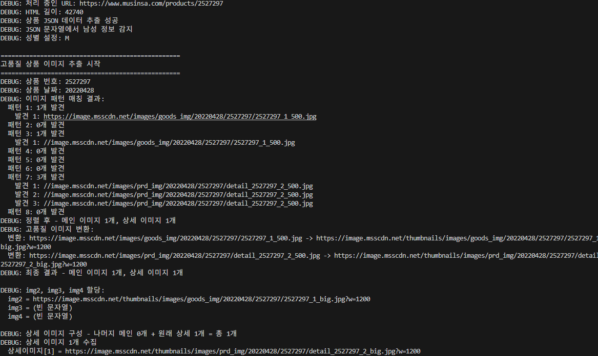

11개나 나와야하는데, 1개 1개밖에 못받음.

HTML에서 이미지를 찾는 대신, 실제 이미지 URL 패턴을 알고 있으니 순차적으로 생성해서 존재 여부를 확인한다.

### 작동 방식:

1. 상품 ID와 날짜 추출 (HTML에서)
2. 이미지 URL 순차 생성:
• 메인: {product_id}_1_big.jpg, {product_id}*2_big.jpg, ...
• 상세: detail*{product_id}*1_big.jpg, detail*{product_id}_2_big.jpg, ...
3. HEAD 요청으로 존재 여부 확인 (실제 다운로드 없이)
4. 존재하는 이미지만 수집

### 예상 결과:

✅ 메인 1: 존재함
❌ 메인 2: 없음
✅ 상세 1: 존재함
✅ 상세 2: 존재함
...
⏹️ 연속 5개 없음 - 검색 중단

```jsx
import requests
from bs4 import BeautifulSoup
import json
import time
import logging
import re
from datetime import datetime

# 로깅 설정
logging.basicConfig(level=logging.INFO, format='%(asctime)s - %(levelname)s - %(message)s')
logger = logging.getLogger(__name__)

base_delay = 2
error_count = 0

class MusinsaDetailCrawler:
    def __init__(self):
        self.base_url = "https://www.musinsa.com"
        self.session = requests.Session()
        self.session.headers.update({
            'User-Agent': 'Mozilla/5.0 (Windows NT 10.0; Win64; x64) AppleWebKit/537.36 (KHTML, like Gecko) Chrome/120.0.0.0 Safari/537.36',
            'Accept': 'text/html,application/xhtml+xml,application/xml;q=0.9,image/webp,*/*;q=0.8',
            'Accept-Language': 'ko-KR,ko;q=0.8,en-US;q=0.5,en;q=0.3',
            'Accept-Encoding': 'gzip, deflate, br',
            'Connection': 'keep-alive',
        })

    def extract_all_image_patterns(self, html_content):
        """HTML에서 모든 가능한 이미지 패턴을 추출"""
        
        print("DEBUG: 향상된 패턴 매칭으로 이미지 추출 시작")
        
        # 모든 가능한 이미지 URL 패턴들
        image_patterns = [
            # 기본 패턴들 (이전에 작동했던 것들)
            r'https://image\.msscdn\.net/images/goods_img/[^"\'>\s]+\.jpg[^"\'>\s]*',
            r'//image\.msscdn\.net/images/goods_img/[^"\'>\s]+\.jpg[^"\'>\s]*',
            r'https://image\.msscdn\.net/images/prd_img/[^"\'>\s]+\.jpg[^"\'>\s]*',
            r'//image\.msscdn\.net/images/prd_img/[^"\'>\s]+\.jpg[^"\'>\s]*',
            
            # 새로운 패턴들 (다양한 형식)
            r'https://image\.msscdn\.net/images/[^"\'>\s]+\.jpg[^"\'>\s]*',
            r'//image\.msscdn\.net/images/[^"\'>\s]+\.jpg[^"\'>\s]*',
            
            # musinsa.com 도메인
            r'https://image\.musinsa\.com/[^"\'>\s]+\.jpg[^"\'>\s]*',
            r'//image\.musinsa\.com/[^"\'>\s]+\.jpg[^"\'>\s]*',
            
            # 따옴표 안의 이미지 URL들
            r'"(https://image\.msscdn\.net/[^"]+\.jpg[^"]*)"',
            r'"(//image\.msscdn\.net/[^"]+\.jpg[^"]*)"',
            r"'(https://image\.msscdn\.net/[^']+\.jpg[^']*)'",
            r"'(//image\.msscdn\.net/[^']+\.jpg[^']*)'",
            
            # JSON 내부의 이미지 URL들
            r'["\']([^"\']*image\.msscdn\.net[^"\']*\.jpg[^"\']*)["\']',
            r'["\']([^"\']*image\.musinsa\.com[^"\']*\.jpg[^"\']*)["\']',
        ]
        
        all_images = set()
        
        print("DEBUG: 패턴별 매칭 결과:")
        for i, pattern in enumerate(image_patterns):
            matches = re.findall(pattern, html_content, re.IGNORECASE)
            
            # 그룹이 있는 패턴의 경우 그룹 내용만 추출
            if matches and isinstance(matches[0], tuple):
                matches = [match[0] if isinstance(match, tuple) else match for match in matches]
            
            print(f"  패턴 {i+1}: {len(matches)}개 발견")
            
            if matches:
                for j, match in enumerate(matches[:3]):  # 처음 3개만 출력
                    print(f"    발견 {j+1}: {match}")
                
                all_images.update(matches)
        
        # URL 정규화
        normalized_images = []
        for img in all_images:
            if img.startswith('//'):
                img = 'https:' + img
            elif not img.startswith('http'):
                continue  # 상대 경로는 제외
            
            # 상품 이미지인지 확인
            if self.is_valid_product_image(img):
                normalized_images.append(img)
        
        # 메인/상세 이미지 분류
        main_images = []
        detail_images = []
        
        for img in normalized_images:
            if self.is_main_image(img):
                main_images.append(img)
            elif self.is_detail_image(img):
                detail_images.append(img)
        
        # 중복 제거 및 정렬
        main_images = list(set(main_images))
        detail_images = list(set(detail_images))
        
        # 이미지 번호로 정렬 시도
        main_images.sort(key=self.extract_image_sort_key)
        detail_images.sort(key=self.extract_image_sort_key)
        
        print(f"DEBUG: 최종 결과 - 메인 이미지 {len(main_images)}개, 상세 이미지 {len(detail_images)}개")
        
        # 결과 출력
        print("DEBUG: 메인 이미지 목록:")
        for i, img in enumerate(main_images[:5]):
            print(f"  메인 {i+1}: {img}")
            
        print("DEBUG: 상세 이미지 목록:")
        for i, img in enumerate(detail_images[:10]):
            print(f"  상세 {i+1}: {img}")
        
        return main_images, detail_images

    def is_valid_product_image(self, img_url):
        """유효한 상품 이미지인지 확인"""
        if not img_url:
            return False
        
        img_lower = img_url.lower()
        
        # 제외할 패턴들
        exclude_patterns = [
            'logo', 'icon', 'brand', 'apple-touch', 'favicon', 
            'common', 'ui/', 'skin/', 'banner', 'ad_', '_ad', 
            'event', 'popup', 'notice'
        ]
        
        for pattern in exclude_patterns:
            if pattern in img_lower:
                return False
        
        # 포함해야 할 패턴들
        include_patterns = [
            'goods_img', 'prd_img', 'product', 'detail', 'images/'
        ]
        
        for pattern in include_patterns:
            if pattern in img_lower:
                return True
        
        return False

    def is_main_image(self, img_url):
        """메인 상품 이미지인지 판단"""
        return 'goods_img' in img_url.lower()

    def is_detail_image(self, img_url):
        """상세 이미지인지 판단"""
        img_lower = img_url.lower()
        return 'prd_img' in img_lower or 'detail' in img_lower

    def extract_image_sort_key(self, img_url):
        """이미지 정렬을 위한 키 추출"""
        # 숫자 패턴 찾기
        numbers = re.findall(r'_(\d+)_', img_url)
        if numbers:
            return int(numbers[-1])  # 마지막 숫자 사용
        
        # 파일명에서 숫자 찾기
        filename_numbers = re.findall(r'(\d+)', img_url.split('/')[-1])
        if filename_numbers:
            return int(filename_numbers[0])
        
        return 0

    def extract_json_from_script(self, html_content):
        """JavaScript 변수에서 JSON 데이터 추출"""
        try:
            pattern = r'window\.__MSS__\.product\.state\s*=\s*({.*?});'
            match = re.search(pattern, html_content, re.DOTALL)

            if match:
                json_str = match.group(1)
                product_data = json.loads(json_str)
                print(f"DEBUG: 상품 JSON 데이터 추출 성공")
                return product_data
            else:
                print("DEBUG: window.__MSS__.product.state를 찾을 수 없음")
                return None

        except Exception as e:
            print(f"DEBUG: JSON 추출 중 오류: {e}")
            return None

    def extract_gender_from_data(self, product_data):
        """JSON 데이터에서 성별 정보 추출"""
        try:
            json_str = json.dumps(product_data, ensure_ascii=False).lower()

            if '남성' in json_str or 'male' in json_str or '"m"' in json_str:
                print("DEBUG: JSON 문자열에서 남성 정보 감지")
                return 'M'
            elif '여성' in json_str or 'female' in json_str or '"f"' in json_str:
                print("DEBUG: JSON 문자열에서 여성 정보 감지")
                return 'F'
            elif '공용' in json_str or 'unisex' in json_str:
                print("DEBUG: JSON 문자열에서 유니섹스 정보 감지")
                return 'U'

        except Exception as e:
            print(f"DEBUG: 성별 추출 중 오류: {e}")

        return None

    def get_product_detail_info(self, product_info):
        """상품 상세 정보 수집 (향상된 패턴 매칭 버전)"""
        detail_url = product_info['detail_url']
        if not detail_url.startswith('http'):
            detail_url = self.base_url + detail_url

        try:
            headers = {
                'User-Agent': 'Mozilla/5.0 (Windows NT 10.0; Win64; x64) AppleWebKit/537.36 (KHTML, like Gecko) Chrome/120.0.0.0 Safari/537.36',
                'Accept': 'text/html,application/xhtml+xml,application/xml;q=0.9,image/avif,image/webp,image/apng,*/*;q=0.8',
                'Accept-Language': 'ko-KR,ko;q=0.9,en-US;q=0.8,en;q=0.7',
                'Accept-Encoding': 'gzip, deflate, br',
                'Connection': 'keep-alive',
                'Upgrade-Insecure-Requests': '1',
                'Sec-Fetch-Dest': 'document',
                'Sec-Fetch-Mode': 'navigate',
                'Sec-Fetch-Site': 'none',
                'Cache-Control': 'max-age=0'
            }

            response = self.session.get(detail_url, headers=headers, timeout=10)
            response.raise_for_status()

            html_content = response.text
            print(f"DEBUG: HTML 길이: {len(html_content)}")

            # 1. 성별 정보 추출 (JSON에서)
            product_data = self.extract_json_from_script(html_content)

            if product_data:
                gender = self.extract_gender_from_data(product_data)
                if gender:
                    product_info['gender'] = gender
                    print(f"DEBUG: 성별 설정: {gender}")
                else:
                    product_info['gender'] = 'U'
                    print("DEBUG: 성별 정보 없음 - 유니섹스로 설정")
            else:
                product_info['gender'] = 'U'
                print("DEBUG: JSON 데이터 없음 - 유니섹스로 설정")

            # 2. 향상된 패턴 매칭으로 이미지 추출
            print("\n" + "="*50)
            print("향상된 패턴 매칭으로 이미지 추출 시작")
            print("="*50)

            main_images, detail_images = self.extract_all_image_patterns(html_content)

            # img2, img3, img4 할당 (메인 이미지에서)
            print("\nDEBUG: img2, img3, img4 할당:")
            for i in range(2, 5):  # img2, img3, img4
                if i-2 < len(main_images):
                    product_info[f'img{i}'] = main_images[i-2]
                    print(f"  img{i} = {main_images[i-2]}")
                else:
                    product_info[f'img{i}'] = ''
                    print(f"  img{i} = (빈 문자열)")

            # 나머지 메인 이미지들도 상세 이미지에 추가
            remaining_main = main_images[3:] if len(main_images) > 3 else []
            all_detail_images = remaining_main + detail_images

            print(f"\nDEBUG: 상세 이미지 구성 - 나머지 메인 {len(remaining_main)}개 + 원래 상세 {len(detail_images)}개 = 총 {len(all_detail_images)}개")

            # img5에 상세 이미지들 저장
            if all_detail_images:
                product_info['img5'] = json.dumps(all_detail_images, ensure_ascii=False)
                print(f"DEBUG: 상세 이미지 {len(all_detail_images)}개 수집")

                # 처음 5개 상세 이미지 URL 출력 (확인용)
                for i, img in enumerate(all_detail_images[:5]):
                    print(f"  상세이미지[{i+1}] = {img}")
            else:
                product_info['img5'] = json.dumps([], ensure_ascii=False)
                print("DEBUG: 상세 이미지 없음")

            # 3. 상품 설명 추출 (JSON에서)
            try:
                if product_data and 'goodsDescription' in str(product_data):
                    desc_pattern = r'"goodsDescription":"([^"]*)"'
                    desc_match = re.search(desc_pattern, json.dumps(product_data, ensure_ascii=False))
                    if desc_match:
                        product_info['content'] = desc_match.group(1)[:1500]
                        print("DEBUG: 상품 설명 수집 완료")
            except:
                pass

            return product_info

        except Exception as e:
            logger.error(f"상품 상세 정보 추출 중 오류 ({detail_url}): {e}")
            # 에러 발생 시에도 기본값 설정
            product_info['gender'] = 'U'
            product_info['img2'] = ''
            product_info['img3'] = ''
            product_info['img4'] = ''
            product_info['img5'] = json.dumps([], ensure_ascii=False)
            return product_info

    def load_existing_data(self, filename):
        """기존 JSON 파일 로드"""
        try:
            with open(filename, 'r', encoding='utf-8') as f:
                data = json.load(f)
            logger.info(f"기존 데이터 로드 완료: {len(data)}개 상품")
            return data
        except Exception as e:
            logger.error(f"파일 로드 중 오류: {e}")
            return []

    def is_detail_complete(self, product):
        """상세 정보가 완전한지 확인"""
        checks = [
            product.get('img5', ''),
            product.get('gender', ''),
        ]
        return all(check for check in checks)

    def save_data(self, data, filename):
        """데이터 저장"""
        try:
            with open(filename, 'w', encoding='utf-8') as f:
                json.dump(data, f, ensure_ascii=False, indent=2)
            logger.info(f"데이터 저장 완료: {filename} ({len(data)}개 상품)")
        except Exception as e:
            logger.error(f"데이터 저장 중 오류: {e}")

    def process_missing_details(self, input_filename, output_filename=None, max_items=3):
        """상세 정보가 없는 상품들만 처리"""
        global error_count

        if output_filename is None:
            output_filename = input_filename.replace('.json', '_enhanced_result.json')

        # 기존 데이터 로드
        all_products = self.load_existing_data(input_filename)

        if not all_products:
            logger.error("데이터를 로드할 수 없습니다.")
            return

        # 상세 정보가 없는 상품들 찾기
        incomplete_products = []
        for i, product in enumerate(all_products):
            if not self.is_detail_complete(product):
                incomplete_products.append((i, product))

        logger.info(f"처리 필요한 상품: {len(incomplete_products)}개")

        # 테스트용으로 제한
        test_products = incomplete_products[:max_items] if max_items else incomplete_products
        logger.info(f"처리할 상품: {len(test_products)}개")

        # 상세 정보 수집
        processed_count = 0
        for original_index, product in test_products:
            try:
                delay_time = base_delay + error_count * 0.5
                time.sleep(delay_time)

                logger.info(f"상품 {processed_count + 1}/{len(test_products)} 처리 중: {product.get('product_name', 'Unknown')}")
                print(f"DEBUG: 처리 중인 URL: {product.get('detail_url', 'Unknown')}")

                updated_product = self.get_product_detail_info(product)
                all_products[original_index] = updated_product
                processed_count += 1

                error_count = max(0, error_count - 1)
                print("="*80)

            except Exception as e:
                error_message = str(e)
                logger.error(f"상품 처리 중 오류: {error_message}")

                if "429" in error_message or "Too Many Requests" in error_message:
                    error_count += 1
                    logger.warning(f"Rate limit 감지, 지연 시간 증가: {error_count}")

                continue

        # 최종 저장
        self.save_data(all_products, output_filename)
        logger.info(f"처리 완료! 총 {processed_count}개 상품의 상세 정보를 수집했습니다.")

        return all_products

def main():
    crawler = MusinsaDetailCrawler()

    # 기존 JSON 파일명
    input_file = 'musinsa_products_temp_218010_detailed.json'
    output_file = 'musinsa_enhanced_result.json'

    try:
        # 테스트용으로 3개 상품 처리
        completed_data = crawler.process_missing_details(input_file, output_file, max_items=3)

        if completed_data:
            print(f"✅ 향상된 패턴 매칭으로 크롤링 완료!")
            print(f"📁 결과 파일: {output_file}")

    except Exception as e:
        logger.error(f"메인 처리 중 오류: {e}")

if __name__ == "__main__":
    main()

```

## json 파일을 진작에 뜯어봤어야..

```jsx
{
  "goodsNo": 3264266,
  "goodsNm": "크롭 컬러 맨투맨 (오트밀)",
  "goodsNmEng": "",
  "thumbnailImageUrl": "/images/goods_img/20230426/3264266/3264266_16825911393091_500.jpg",
  "headDesc": "",
  "styleNo": "CBW232204",
  "sex": [
    "여성"
  ],
  "sexCode": 4,
  "brand": "cargobrosforwomen",
  "brandInfo": {
    "brand": "cargobrosforwomen",
    "brandName": "카고브로스 포 우먼",
    "brandEnglishName": "CARGOBROS FOR WOMAN",
    "brandNationCode": "korea",
    "brandNationName": "한국",
    "brandNationEnglishName": "KOREA",
    "brandLogoImage": "//image.musinsa.com/mfile_s01/_brand/free_medium/cargobrosforwomen.png?20230315170212",
    "brandWhiteLogoImage": "//image.musinsa.com/images/brand/white_logo_img/cargobrosforwomen.svg?20230315170346",
    "sinceYear": 2023,
    "memo": "카고브로스 포 우먼(CARGOBROS FOR WOMAN)은 카고브로스(CARGOBROS)의 우먼 라인으로, 다양한 콘셉트와 디자인을 제안하는 아메리칸 캐주얼 여성 브랜드입니다. 여성의 체형과 스타일링을 고려해 패턴 개발부터 품질관리까지 섬세하게 신경 쓰며, 모두가 공감하고 즐겨 입을 수 있는 트렌디하면서 스탠다드한 제품을 제안합니다.",
    "isBrandExclusive": false,
    "isFlagship": false
  },
  "seasonYear": "2023",
  "season": "1",
  "couponDcPrice": 0,
  "comId": "worksby1",
  "specialtyCodes": [
    "outlet"
  ],
  "storeCodes": [
    "outlet"
  ],
  "goodsEventType": "N",
  "isRestictedUsePoint": true,
  "isClearance": false,
  "isPrePoint": false,
  "isGivenPoint": false,
  "isParallelImport": false,
  "deliveryDueType": "NONE",
  "deliveryDuePeriod": 0,
  "isLimitedQuantity": false,
  "isLimitedTotalQuantity": false,
  "limitedMaxQuantity": 999,
  "limitedMinQuantity": 1,
  "isBuyForMember": false,
  "isAppGoods": false,
  "isOfflineGoods": false,
  "isFreeReturn": false,
  "giftCount": 0,
  "deliveryDueDay": null,
  "isSalePeriod": false,
  "isSale": false,
  "saleStartDate": null,
  "saleEndDate": null,
  "isSellPeriod": false,
  "sellStartDate": null,
  "sellEndDate": null,
  "maxUsePointRate": 0.07,
  "isVerify": false,
  "isPlusDelivery": false,
  "isPlusDeliveryArea": false,
  "isRestock": true,
  "isSoonOutOfStock": false,
  "isLimit": false,
  "isMusinsaMonopoly": false,
  "isOnlineMonopoly": false,
  "isFirst": false,
  "isInvitation": false,
  "isMusinsaDirectDelivery": false,
  "isMusinsaOfflineShopStock": false,
  "isIntangibleGoods": false,
  "isExclusiveMusinsaPay": false,
  "isExclusiveMusinsaHyundaiCard": false,
  "isGoodsStatsGraphShow": true,
  "isCumulativePurchaseShow": true,
  "isCustomOrderWithdrawal": false,
  "isRobotsNoIndex": false,
  "isLimitedDc": true,
  "isLimitedCoupon": false,
  "intangibleGoodsDeliveryType": "",
  "baseCategoryFullPath": "Clothing > 티셔츠 > 맨투맨/스웨트셔츠",
  "category": {
    "categoryDepth1Code": "001",
    "categoryDepth1Title": "상의",
    "categoryDepth1Name": "상의",
    "categoryDepth2Code": "001005",
    "categoryDepth2Title": "맨투맨/스웨트",
    "categoryDepth2Name": "맨투맨/스웨트",
    "categoryDepth3Code": "",
    "categoryDepth3Title": "",
    "categoryDepth3Name": "",
    "categoryDepth4Code": "",
    "categoryDepth4Title": "",
    "categoryDepth4Name": "",
    "storeCode": ""
  },
  "deliveryExpectedArrival": [
    {
      "mark": false,
      "expectedDate": "2025-07-19",
      "expectedPercent": 69,
      "koreanWeek": "토",
      "cutOfDate": null,
      "orderDeadLine": null,
      "guideText": "",
      "guide": null
    },
    {
      "mark": true,
      "expectedDate": "2025-07-21",
      "expectedPercent": 99,
      "koreanWeek": "월",
      "cutOfDate": null,
      "orderDeadLine": null,
      "guideText": "",
      "guide": null
    },
    {
      "mark": false,
      "expectedDate": "2025-07-22",
      "expectedPercent": 99,
      "koreanWeek": "화",
      "cutOfDate": null,
      "orderDeadLine": null,
      "guideText": "",
      "guide": null
    }
  ],
  "deliveryDelay": null,
  "goodsImages": [
    {
      "kind": "D",
      "repYn": true,
      "bigYn": true,
      "width": 1500,
      "height": 1800,
      "seq": 1,
      "imageUrl": "/images/prd_img/20230426/3264266/detail_3264266_16825911488943_500.jpg"
    },
    {
      "kind": "D",
      "repYn": false,
      "bigYn": true,
      "width": 1500,
      "height": 1800,
      "seq": 2,
      "imageUrl": "/images/prd_img/20230426/3264266/detail_3264266_16825915441799_500.jpg"
    },
    {
      "kind": "D",
      "repYn": false,
      "bigYn": true,
      "width": 1500,
      "height": 1800,
      "seq": 3,
      "imageUrl": "/images/prd_img/20230426/3264266/detail_3264266_16825915454492_500.jpg"
    }
  ],
  "labels": [
    {
      "code": "outlet",
      "name": "아울렛",
      "backgroundColor": ""
    }
  ],
  "goodsPrice": {
    "salePrice": 25000,
    "normalPrice": 50000,
    "discountRate": 50,
    "type": "DEFAULT",
    "isSale": true,
    "savePoint": 0,
    "savePointPercent": 0,
    "partnerInformation": null,
    "memberDiscountRate": 0,
    "memberSavePointRate": 0,
    "memberSaveMoneyRate": 0,
    "partnerDiscountOn": false
  },
  "goodsLogisticsInfo": {
    "deliveryInfoName": "국내 배송",
    "courierName": "CJ대한통운",
    "businessDayOrderDeadlineHour": 10,
    "defaultReleasePeriod": 3,
    "isOverseasDelivery": false,
    "isTodayReleaseGoods": false,
    "isAvailableTimeToTodayRelease": false,
    "isAutoReturnShipping": true,
    "returnShippingCourierName": "CJ대한통운",
    "returnShippingZipCode": "05612",
    "returnShippingAddress": "서울 송파구 삼학사로 90 (보우시스템빌딩)",
    "returnShippingAddressDetail": "2층 웍스바이"
  },
  "interestFreeCard": null,
  "isRaffle": false,
  "goodsSaleType": "SALE",
  "isTimeSale": false,
  "goodsReview": {
    "totalCount": 1,
    "satisfactionScore": 4
  },
  "isLimitedPoint": true,
  "goodsType": "P",
  "returnShippingFee": {
    "roundShippingFee": 6000,
    "additionalFeeForJeju": 3000,
    "additionalFeeForOthers": 3000
  },
  "goodsMaterial": {
    "maxLowCount": 0,
    "materials": []
  },
  "goodsContents": "<center></center>\n\n<center></center>\n\n<center></center>\n\n<center></center>\n\n<center></center>",
  "similarNo": 0,
  "baseCategory": "029001005",
  "isEnabledToQnA": true,
  "mdOpinion": "",
  "specDesc": "",
  "sizeType": "21",
  "isUseSize": true,
  "optKindCd": "CLOTHES",
  "company": {
    "name": "주식회사 웍스바이",
    "ceoName": "이철규",
    "businessNumber": "5268600831",
    "mailOrderReportNumber": "제 2018-서울송파-0761호",
    "phoneNumber": "070-7779-2702",
    "email": "worksby@naver.com",
    "address": "서울 송파구 삼학사로 90 (보우시스템빌딩)",
    "detailAddress": "2층 (석촌동)"
  },
  "isShowInventoryCount": true,
  "isOnlyGlobalGoods": false,
  "isCompanyBrandOfficial": false,
  "goodsDetailBanner": {
    "benefitBanner": [
      {
        "eventBannerId": 1402,
        "eventBannerKind": "BENEFIT",
        "name": "첫 구매 20% 쿠폰 즉시 지급",
        "displayType": "APP",
        "displayTarget": "ALL",
        "displayLogin": "N",
        "imgLink": "/images/goodsdetail/banner/2025/01/13/f25554bc5ae04be9b18fb5edc1310586.png",
        "bannerTitle": "첫 구매 20% 쿠폰 즉시 지급",
        "bannerSubTitle": "",
        "buttonTitle": "혜택보기",
        "landingUrl": "https://www.musinsa.com/onboarding/firstbuy",
        "memo": "",
        "exposeContents": []
      }
    ],
    "marketingBanner": null,
    "goodsBanner": null,
    "commonEventBanner": null,
    "offlineStoreBanner": null,
    "normalEventBanner": [],
    "exposeBanner": {
      "eventBannerId": 1407,
      "eventBannerKind": "EXPOSE",
      "name": "첫 구매 20% 쿠폰 받으러 가기",
      "displayType": "ALL",
      "displayTarget": "ALL",
      "displayLogin": "ALL",
      "imgLink": "",
      "bannerTitle": "",
      "bannerSubTitle": "",
      "buttonTitle": "",
      "landingUrl": "",
      "memo": "",
      "exposeContents": [
        {
          "title": "비로그인",
          "content": "첫 구매 20% 쿠폰 받으러 가기",
          "text": "첫 구매 20% 쿠폰 받으러 가기",
          "link": "https://www.musinsa.com/onboarding/firstbuy"
        },
        {
          "title": "첫구매",
          "content": "첫 구매 20% 쿠폰 받으러 가기",
          "text": "첫 구매 20% 쿠폰 받으러 가기",
          "link": "https://www.musinsa.com/onboarding/firstbuy"
        }
      ]
    }
  },
  "genders": [
    "W"
  ],
  "isGoodsFill": false,
  "goodsFillInfo": null,
  "usedProduct": null,
  "seo": {
    "title": "카고브로스 포 우먼(CARGOBROS FOR WOMAN) 크롭 컬러 맨투맨 (오트밀) - 사이즈 & 후기 | 무신사",
    "metaDescription": "카고브로스 포 우먼(CARGOBROS FOR WOMAN) 크롭 컬러 맨투맨 (오트밀). 무신사에서 상품 특징, 사이즈, 배송, 가격 정보와 더불어 후기, 관련 상품 등 제품 관련 다양한 정보를 확인하세요.",
    "faceBookMetaDescription": "제품분류 :상의 > 맨투맨/스웨트 브랜드 : 카고브로스 포 우먼(CARGOBROS FOR WOMAN) 제품번호 : CBW232204 제품 : 크롭 컬러 맨투맨 (오트밀) - 25,000"
  },
  "point": {
    "memberPoint": 0,
    "isOnePoint": false
  },
  "rankingRecord": {
    "flatRankingRecords": [],
    "groupedRankingRecords": []
  },
  "featureFlags": {
    "APPLY_NEW_API": {
      "key": "APPLY_NEW_API",
      "comment": "신규 API 적용을 위한 피처플래그",
      "isAvailable": true
    },
    "CURATION": {
      "key": "CURATION",
      "comment": "큐레이션 플래그",
      "isAvailable": true
    },
    "DISPLAY_MAX_BENEFIT_PRICE": {
      "key": "DISPLAY_MAX_BENEFIT_PRICE",
      "comment": "최대 혜택가 노출 플래그",
      "isAvailable": true
    },
    "EASY-PAY": {
      "key": "EASY-PAY",
      "comment": "빠른결제 on/off",
      "isAvailable": true
    },
    "MOLOCO-RECOMMEND": {
      "key": "MOLOCO-RECOMMEND",
      "comment": "광고추천 on/off",
      "isAvailable": true
    },
    "NEW_MEMBER_LEVEL": {
      "key": "NEW_MEMBER_LEVEL",
      "comment": "신규 회원제 개편 적용",
      "isAvailable": true
    },
    "NEW_MEMBER_SHIP_V2": {
      "key": "NEW_MEMBER_SHIP_V2",
      "comment": "회원제 개편[최대혜택가 v1/v2 제어]",
      "isAvailable": true
    },
    "Q_AND_A": {
      "key": "Q_AND_A",
      "comment": "문의하기 플래그",
      "isAvailable": true
    },
    "RECOMMEND": {
      "key": "RECOMMEND",
      "comment": "추천영역 on/off",
      "isAvailable": true
    }
  },
  "domesticDefault": null,
  "isAdult": false,
  "isOutlet": true,
  "isDrop": false,
  "promotion": null,
  "memberGrade": null,
  "reviewBoosting": {
    "maxPoint": 1500,
    "reviewBoostingDetails": [
      {
        "reviewType": "GENERAL",
        "reviewTypeName": "후기",
        "expectedPoint": 500,
        "boosting": false,
        "boostingPayType": "",
        "boostingValue": 0,
        "boostingTargetCount": 0
      },
      {
        "reviewType": "STYLE",
        "reviewTypeName": "스타일 후기",
        "expectedPoint": 1000,
        "boosting": false,
        "boostingPayType": "",
        "boostingValue": 0,
        "boostingTargetCount": 0
      }
    ]
  }
}
```

이미지 링크들이 제각각 달랐기 때문에, `태그(html 기반 획득 불가), 이미지 링크(자체 링크, 무신사 이미지링크 등등 다양)`  왜 이제와서 json 파일을 볼 생각을 햇나 모르겠다.

```jsx
import requests
import json
import time
import logging
import re

logging.basicConfig(level=logging.INFO, format='%(asctime)s - %(levelname)s - %(message)s')
logger = logging.getLogger(__name__)

class MusinsaDebugCrawler:
    def __init__(self):
        self.session = requests.Session()
        self.session.headers.update({
            'User-Agent': 'Mozilla/5.0 (Windows NT 10.0; Win64; x64) AppleWebKit/537.36 (KHTML, like Gecko) Chrome/120.0.0.0 Safari/537.36'
        })

    def extract_and_save_json_data(self, detail_url):
        logger.info(f"디버깅을 위해 다음 URL에 접속합니다: {detail_url}")
        try:
            response = self.session.get(detail_url, timeout=10)
            response.raise_for_status()
            html_content = response.text

            pattern = r'window\.__MSS__\.product\.state\s*=\s*({.*?});'
            match = re.search(pattern, html_content, re.DOTALL)

            if match:
                logger.info("`window.__MSS__.product.state` JSON 객체를 찾았습니다.")
                json_str = match.group(1)
                product_data = json.loads(json_str)
                
                output_filename = 'product_data_structure.json'
                with open(output_filename, 'w', encoding='utf-8') as f:
                    json.dump(product_data, f, ensure_ascii=False, indent=2)
                
                logger.info(f"✅ 성공! 상품 데이터 구조를 `{output_filename}` 파일에 저장했습니다.")
                logger.info("이제 이 파일의 내용을 확인하고 알려주세요.")
                return True
            else:
                logger.error("HTML에서 `window.__MSS__.product.state` JSON 객체를 찾지 못했습니다.")
                return False

        except Exception as e:
            logger.error(f"JSON 데이터 추출 및 저장 중 오류 발생: {e}")
            return False

    def find_first_product_url(self, filename):
        try:
            with open(filename, 'r', encoding='utf-8') as f:
                data = json.load(f)
            
            if not data:
                logger.error("입력 파일이 비어있습니다.")
                return None

            # 첫 번째 상품의 detail_url을 가져옵니다.
            detail_url = data[0].get('detail_url')
            if not detail_url:
                logger.error("첫 번째 상품에 detail_url이 없습니다.")
                return None

            # URL이 상대 경로인 경우, 전체 주소로 만들어줍니다.
            if detail_url.startswith('/'):
                return "https://www.musinsa.com" + detail_url
            # 이미 전체 주소인 경우 그대로 반환합니다.
            elif detail_url.startswith('http'):
                return detail_url
            # 그 외의 경우는 에러로 처리합니다.
            else:
                logger.error(f"알 수 없는 형식의 detail_url입니다: {detail_url}")
                return None

        except FileNotFoundError:
            logger.error(f"입력 파일을 찾을 수 없습니다: {filename}")
            return None
        except Exception as e:
            logger.error(f"입력 파일에서 URL을 찾는 중 오류 발생: {e}")
            return None

def main():
    crawler = MusinsaDebugCrawler()
    input_file = 'musinsa_products_temp_218010_detailed.json'
    
    target_url = crawler.find_first_product_url(input_file)
    
    if target_url:
        crawler.extract_and_save_json_data(target_url)
    else:
        logger.error("크롤링을 시작할 URL을 찾지 못했습니다.")

if __name__ == "__main__":
    main()

```

이 파일을 통해 위의 json을 취득했고. `goodsImgs` 와 `goodsContents` 에 제품 이미지, 상세 이미지가 있는 것을 확인할 수 있었다.

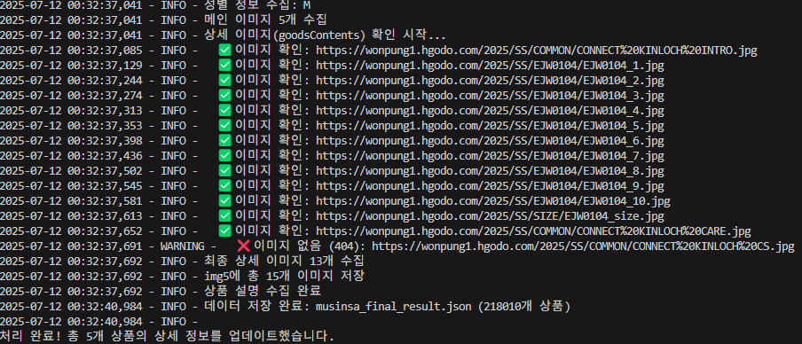

드디어 된다.

### 잘려있는 상품 이미지 URL

상대 경로이므로 앞에 특정 도메인을 붙여주어서 완성한다.

### 상세 이미지 경로

일부 상세 이미지는 자사몰의 이미지 경로를 그대로 사용하는데, 들어가면 `404 NOT FOUND` 가 나온다. 이는 외부 도메인 (예: ****.cafe24.com) 에 있는데. `핫 링킹` 을 방지하기 위해 어디서 접속을 시도햇는지 `Refer 헤더` 를 확인한다고한다

즉 브라우저 주소창에 URL을 직접 붙여넣거나 하면 Refer 정보가 없기 때문에 서버는 `비정상적인 접근`으로 판단하여 404 또는 403을 반환한다

이는 이미지에 접근할 때 `제대로 된 상세 페이지에서 이미지를 요청한다` 라는 정보를 함께 보내준다.

## 진짜 최종

```python
import requests
import json
import time
import logging
import re
from typing import List, Dict, Any

# --- 로깅 설정 ---
logging.basicConfig(level=logging.INFO, format='%(asctime)s - %(levelname)s - %(message)s')
logger = logging.getLogger(__name__)

# --- 전역 변수 ---
base_delay = 1.5  # 요청 간 기본 딜레이
error_count = 0

class MusinsaDetailCrawler:
    def __init__(self):
        self.base_url = "https://www.musinsa.com"
        self.session = requests.Session()
        self.session.headers.update({
            'User-Agent': 'Mozilla/5.0 (Windows NT 10.0; Win64; x64) AppleWebKit/537.36 (KHTML, like Gecko) Chrome/120.0.0.0 Safari/537.36',
        })

    def get_full_url(self, url_path: str) -> str:
        """상대 경로를 절대 URL로 변환합니다."""
        if not url_path or not isinstance(url_path, str):
            return ''
        if url_path.startswith('http'):
            return url_path
        if url_path.startswith('//'):
            return 'https:' + url_path
        return 'https://image.musinsa.com' + url_path

    def check_image_exists(self, image_url: str, referer_url: str) -> bool:
        """Referer 헤더를 포함하여 이미지 존재 여부를 확인합니다."""
        if not image_url:
            return False
        try:
            headers = {'Referer': referer_url}
            response = self.session.head(image_url, headers=headers, timeout=5)
            if response.status_code == 200:
                logger.info(f"  ✅ 이미지 확인: {image_url}")
                return True
            else:
                logger.warning(f"  ❌ 이미지 없음 ({response.status_code}): {image_url}")
                return False
        except requests.exceptions.RequestException:
            # 네트워크 오류는 상세히 로깅하지 않음 (너무 많을 수 있음)
            return False

    def get_product_detail_info(self, product_info: Dict[str, Any]) -> Dict[str, Any]:
        """JSON 파싱과 Referer 헤더를 사용하여 정확한 상세 정보를 수집합니다."""
        global error_count
        detail_url = product_info.get('detail_url', '')
        if not detail_url.startswith('http'):
            detail_url = self.base_url + detail_url

        try:
            response = self.session.get(detail_url, timeout=10)
            response.raise_for_status()
            html_content = response.text

            pattern = r'window\.__MSS__\.product\.state\s*=\s*({.*?});'
            match = re.search(pattern, html_content, re.DOTALL)

            if not match:
                logger.warning(f"JSON 데이터를 찾지 못했습니다. ({detail_url})")
                return product_info

            product_data = json.loads(match.group(1))

            genders = product_data.get('genders', [])
            product_info['gender'] = 'F' if "W" in genders else 'M' if "M" in genders else 'U'

            main_images = [self.get_full_url(img.get('imageUrl')) for img in product_data.get('goodsImages', [])]
            
            detail_images = []
            goods_contents_html = product_data.get('goodsContents', '')
            if goods_contents_html:
                extracted_urls = re.findall(r'src="([^"]+)"', goods_contents_html)
                for url in extracted_urls:
                    full_url = self.get_full_url(url)
                    if self.check_image_exists(full_url, detail_url):
                        detail_images.append(full_url)
            
            product_info['img2'] = main_images[0] if len(main_images) > 0 else ''
            product_info['img3'] = main_images[1] if len(main_images) > 1 else ''
            product_info['img4'] = main_images[2] if len(main_images) > 2 else ''

            remaining_main = main_images[3:] if len(main_images) > 3 else []
            all_detail_images = remaining_main + detail_images
            product_info['img5'] = json.dumps(all_detail_images, ensure_ascii=False)

            content_text = re.sub(r'<[^>]+>', '', goods_contents_html).strip()
            product_info['content'] = content_text[:1500]

            return product_info

        except requests.exceptions.RequestException as e:
            logger.error(f"HTTP 요청 오류 ({detail_url}): {e}")
            error_count += 1
            return product_info
        except Exception as e:
            logger.error(f"상세 정보 추출 중 알 수 없는 오류 ({detail_url}): {e}", exc_info=True)
            return product_info

    def load_existing_data(self, filename: str) -> List[Dict[str, Any]]:
        try:
            with open(filename, 'r', encoding='utf-8') as f:
                data = json.load(f)
            logger.info(f"기존 데이터 로드 완료: {len(data)}개 상품")
            return data
        except FileNotFoundError:
            logger.error(f"입력 파일을 찾을 수 없습니다: {filename}")
            return []
        except Exception as e:
            logger.error(f"파일 로드 중 오류: {e}")
            return []

    def is_detail_complete(self, product: Dict[str, Any]) -> bool:
        return bool(product.get('gender')) and product.get('img5', '[]') != '[]'

    def save_data(self, data: List[Dict[str, Any]], filename: str):
        try:
            with open(filename, 'w', encoding='utf-8') as f:
                json.dump(data, f, ensure_ascii=False, indent=2)
            logger.info(f"데이터 저장 완료: {filename} ({len(data)}개 상품)")
        except Exception as e:
            logger.error(f"데이터 저장 중 오류: {e}")

    def process_missing_details(self, input_filename: str, output_filename: str, max_items: int = None):
        global error_count
        all_products = self.load_existing_data(input_filename)
        if not all_products:
            return

        incomplete_products = [(i, p) for i, p in enumerate(all_products) if not self.is_detail_complete(p)]
        logger.info(f"처리 필요한 상품: {len(incomplete_products)}개")

        items_to_process = incomplete_products[:max_items] if max_items is not None else incomplete_products
        if not items_to_process:
            logger.info("상세 정보를 추가할 상품이 없습니다.")
            return

        logger.info(f"처리할 상품: {len(items_to_process)}개")

        processed_count = 0
        for original_index, product in items_to_process:
            delay_time = base_delay + (error_count * 0.5)
            time.sleep(delay_time)

            logger.info(f"--- 상품 {processed_count + 1}/{len(items_to_process)} 처리 시작: {product.get('product_name', 'N/A')} ---")
            updated_product = self.get_product_detail_info(product.copy())
            all_products[original_index] = updated_product
            processed_count += 1
            error_count = max(0, error_count - 1)

            # --- 중간 저장 기능 추가 ---
            if processed_count % 100 == 0 and processed_count < len(items_to_process):
                logger.info(f"★★★ {processed_count}개 처리 완료. 중간 저장 실행... ★★★")
                self.save_data(all_products, output_filename)

        # --- 최종 저장 ---
        logger.info("모든 작업 완료. 최종 저장 실행...")
        self.save_data(all_products, output_filename)
        logger.info(f"\n처리 완료! 총 {processed_count}개 상품의 상세 정보를 업데이트했습니다.")

def main():
    crawler = MusinsaDetailCrawler()
    input_file = 'musinsa_products_temp_218010_detailed.json'
    output_file = 'musinsa_final_result_with_save.json'

    try:
        # None으로 설정하면 처리 필요한 모든 상품을 대상으로 실행합니다.
        crawler.process_missing_details(input_file, output_file, max_items=None)
        print(f"\n✅ 크롤링 완료! 최종 결과 파일: {output_file}")

    except Exception as e:
        logger.error(f"메인 처리 중 오류: {e}")

if __name__ == "__main__":
    main()

```

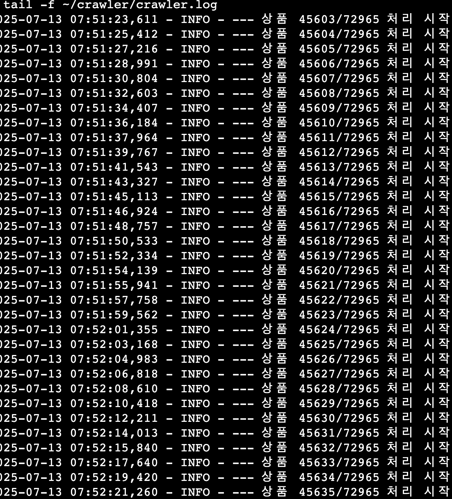

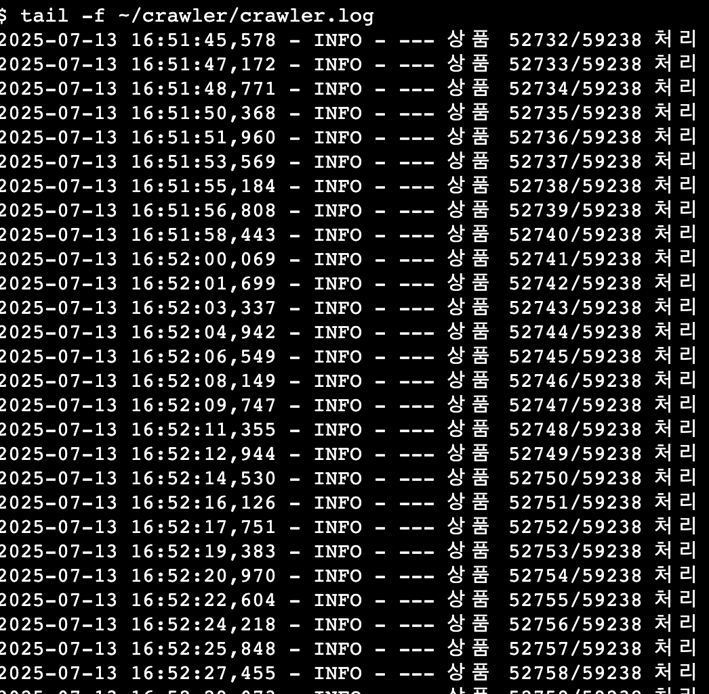

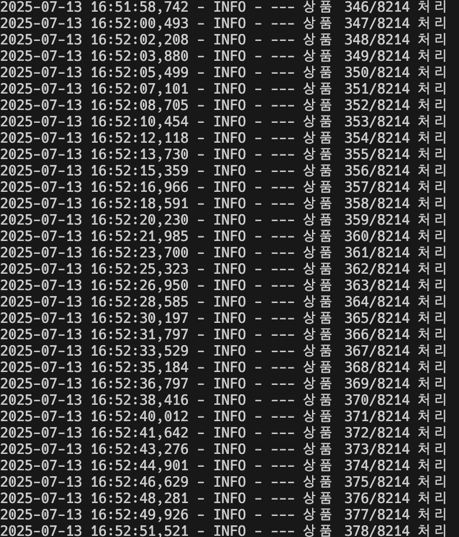

## 다 넣었다

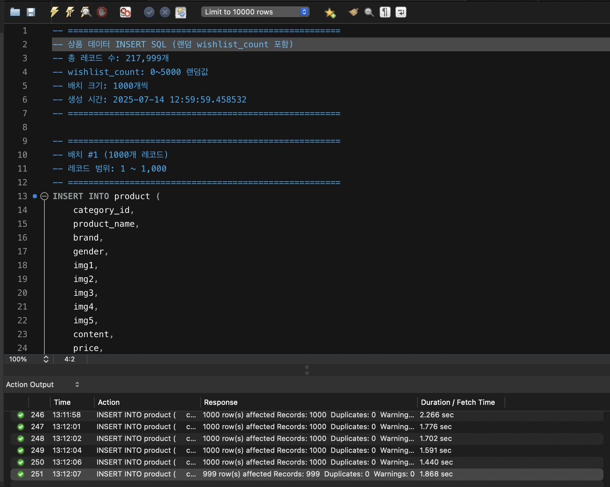

약 5일간(스크립트 수정 2일, 실행 3일) 진행된 크롤링을 모두 마치고  217,999건의 제품 DB가 주입되었다.

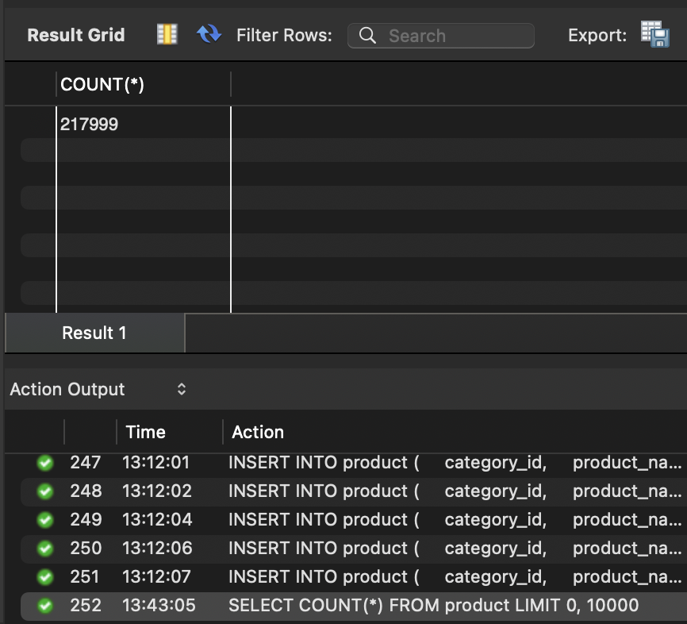

하지만 외부 링크를 그대로 쓸 수 없는법..

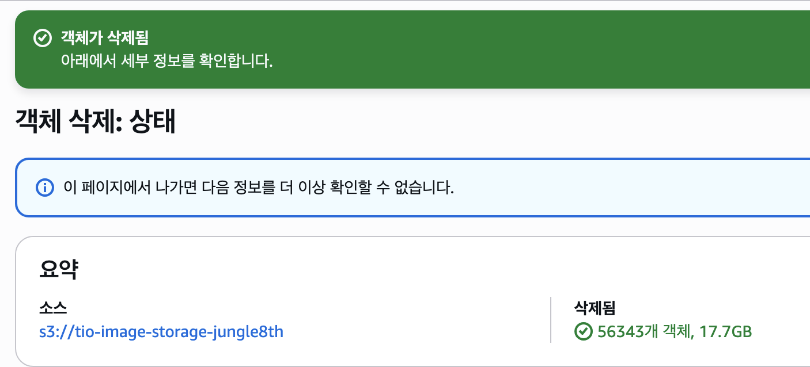

또 다시 뭔가(는 마이그레이션) 돌리긴 해야한다. 그건 생략하자.

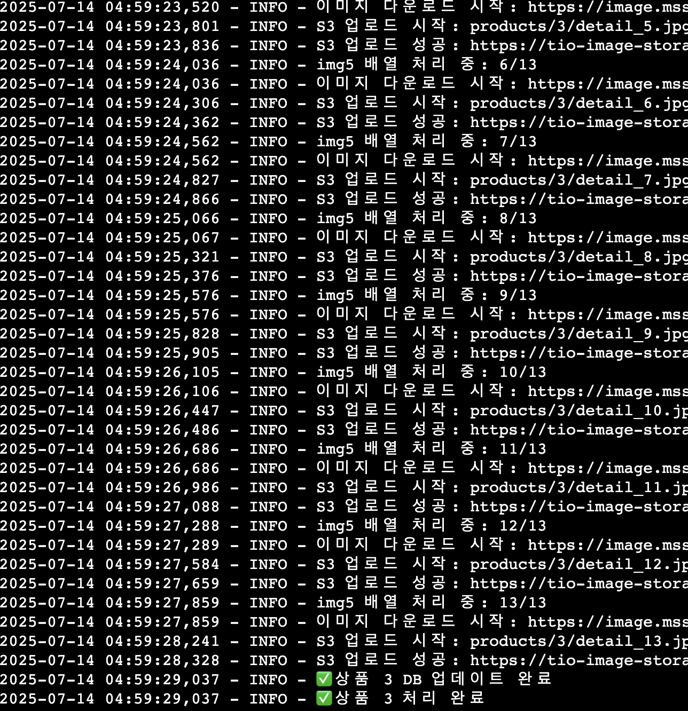

### Variant (재고) 도 넣어줘야한다.

### 📊 통계:

- **총 상품 수**: 217,999개
- **총 variant 수**: 4,223,987개 (약 422만개!)
- **평균 variant/상품**: 약 19.4개

### 📈 카테고리별 분포:

- **상의/아우터 (100-299)**: 2,096,900개 (25개/상품)
- **하의 (300-399)**: 1,113,400개 (25개/상품)
- **원피스/스커트 (400-499)**: 479,000개 (25개/상품)
- **신발 (500-599)**: 487,473개 (21개/상품)
- **소품/ACC (600-699)**: 47,214개 (1개/상품)

### 📄 생성된 파일:

- **CSV**: product_variants.csv (약 400MB)
- **SQL**: insert_product_variants.sql (4,224개 배치)

### 어떻게 넣지?

### 1. MySQL Workbench에서 실행

- **속도**: 보통 (GUI 오버헤드 있음)
- **장점**: 시각적 진행률 확인, 에러 처리 편리
- **단점**: 메모리 사용량 높음, 대용량 파일 시 느림

### 2. 명령어로 직접 실행 ⚡ 더 빠름

```sql
mysql -u admin -p tryiton_db < insert_product_variants.sql
```

- **속도**: 빠름 (직접 실행, 오버헤드 최소)
- **장점**: 메모리 효율적, 백그라운드 실행 가능
- **단점**: 진행률 확인 어려움

### 3. LOAD DATA INFILE 🚀 가장 빠름

```sql
LOAD DATA INFILE '/path/to/product_variants.csv'
INTO TABLE product_variant
FIELDS TERMINATED BY ','
LINES TERMINATED BY '\n'
IGNORE 1 ROWS;
```

그래서 3번으로. 2번은 뭔가 포트포워딩상태에서 로컬 접근이 애매할거같고. 이미 연결되어있는 mySQL Workbench에서 해당 명령문을 실행해주기로함.

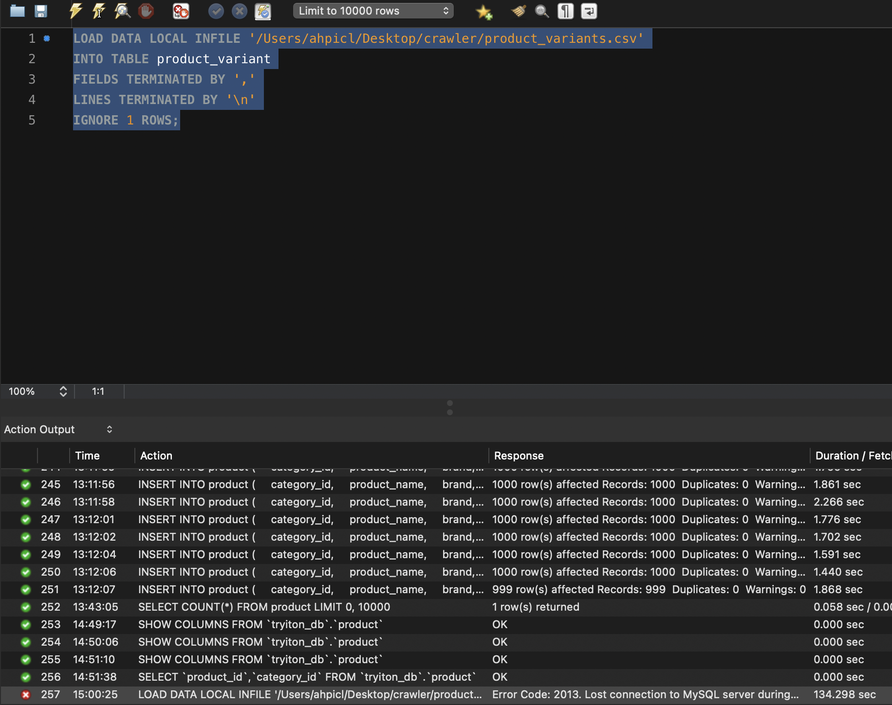

에러터지면서 개같이 실패. 아마 대용량데이터 처리하다 터진것 같다. 

### 돌고돌아 순정으로

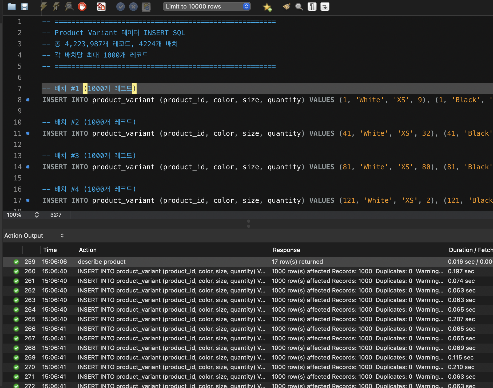

배치 1개당 1000개 레코드를 실행해주는거로 돌아왔다.

### 마이그레이션도

```java
#!/usr/bin/env python3
import json
import boto3
import requests
import pymysql
import os
import time
from urllib.parse import urlparse
import logging
from datetime import datetime

# 로깅 설정
logging.basicConfig(
    level=logging.INFO,
    format='%(asctime)s - %(levelname)s - %(message)s',
    handlers=[
        logging.FileHandler('s3_migration.log'),
        logging.StreamHandler()
    ]
)
logger = logging.getLogger(__name__)

class S3ImageMigrator:
    def __init__(self):
        # AWS S3 설정
        self.s3_client = boto3.client('s3', region_name='ap-northeast-2')
        self.bucket_name = 'tio-image-storage-jungle8th'

        # MySQL 설정 (EC2 환경)
        self.db_config = {
            'host': 'db 엔드포인트',  # 또는 RDS 엔드포인트
            'user': '사용자명',       # DB 사용자명
            'password': '비밀번호',       # DB 비밀번호
            'database': 'db명칭',
            'charset': 'utf8mb4',
            'autocommit': True
        }

        # HTTP 세션 설정
        self.session = requests.Session()
        self.session.headers.update({
            'User-Agent': 'Mozilla/5.0 (X11; Linux x86_64) AppleWebKit/537.36 (KHTML, like Gecko) Chrome/91.0.4472.124 Safari/537.36'
        })

        # 통계
        self.stats = {
            'total_products': 0,
            'processed_products': 0,
            'successful_uploads': 0,
            'failed_uploads': 0,
            'updated_records': 0,
            'skipped_products': 0
        }

    def download_image(self, url, timeout=30):
        """이미지 다운로드"""
        try:
            logger.info(f"이미지 다운로드 시작: {url}")
            response = self.session.get(url, timeout=timeout, stream=True)
            response.raise_for_status()

            # Content-Type 확인
            content_type = response.headers.get('content-type', '')
            if not content_type.startswith('image/'):
                logger.warning(f"이미지가 아닌 콘텐츠: {url} - {content_type}")
                return None

            return response.content

        except requests.exceptions.RequestException as e:
            logger.error(f"이미지 다운로드 실패 {url}: {e}")
            return None
        except Exception as e:
            logger.error(f"예상치 못한 오류 {url}: {e}")
            return None

    def upload_to_s3(self, image_data, s3_key):
        """S3에 이미지 업로드"""
        try:
            logger.info(f"S3 업로드 시작: {s3_key}")

            # 이미지 타입 추정
            content_type = 'image/jpeg'
            if s3_key.lower().endswith('.png'):
                content_type = 'image/png'
            elif s3_key.lower().endswith('.gif'):
                content_type = 'image/gif'
            elif s3_key.lower().endswith('.webp'):
                content_type = 'image/webp'

            self.s3_client.put_object(
                Bucket=self.bucket_name,
                Key=s3_key,
                Body=image_data,
                ContentType=content_type,
                CacheControl='max-age=31536000'  # 1년 캐시
            )

            s3_url = f"https://{self.bucket_name}.s3.ap-northeast-2.amazonaws.com/{s3_key}"
            logger.info(f"S3 업로드 성공: {s3_url}")
            return s3_url

        except Exception as e:
            logger.error(f"S3 업로드 실패 {s3_key}: {e}")
            return None

    def get_file_extension(self, url):
        """URL에서 파일 확장자 추출"""
        try:
            parsed = urlparse(url)
            path = parsed.path.lower()
            if path.endswith(('.jpg', '.jpeg')):
                return '.jpg'
            elif path.endswith('.png'):
                return '.png'
            elif path.endswith('.gif'):
                return '.gif'
            elif path.endswith('.webp'):
                return '.webp'
            else:
                return '.jpg'  # 기본값
        except:
            return '.jpg'

    def process_single_image(self, original_url, product_id, img_type, img_index=None):
        """단일 이미지 처리"""
        if not original_url or original_url.strip() == '':
            return None

        try:
            # 이미지 다운로드
            image_data = self.download_image(original_url)
            if not image_data:
                return None

            # 파일 확장자 결정
            ext = self.get_file_extension(original_url)
            # S3 키 생성
            if img_index is not None:
                s3_key = f"products/{product_id}/{img_type}_{img_index}{ext}"
            else:
                s3_key = f"products/{product_id}/{img_type}{ext}"

            # S3 업로드
            s3_url = self.upload_to_s3(image_data, s3_key)
            if s3_url:
                self.stats['successful_uploads'] += 1
                return s3_url
            else:
                self.stats['failed_uploads'] += 1
                return None

        except Exception as e:
            logger.error(f"이미지 처리 실패 {original_url}: {e}")
            self.stats['failed_uploads'] += 1
            return None

    def process_img5_array(self, img5_json, product_id):
        """img5 JSON 배열 처리"""
        if not img5_json or img5_json.strip() == '':
            return None

        try:
            # JSON 파싱
            img5_urls = json.loads(img5_json)
            if not isinstance(img5_urls, list):
                logger.warning(f"img5가 배열이 아님: {img5_json}")
                return None

            s3_urls = []
            for i, url in enumerate(img5_urls):
                if url and url.strip():
                    logger.info(f"img5 배열 처리 중: {i+1}/{len(img5_urls)}")
                    s3_url = self.process_single_image(url, product_id, 'detail', i+1)
                    if s3_url:
                        s3_urls.append(s3_url)
                    time.sleep(0.2)  # 요청 간격

            return json.dumps(s3_urls) if s3_urls else None

        except json.JSONDecodeError as e:
            logger.error(f"img5 JSON 파싱 실패: {img5_json} - {e}")
            return None

    def get_all_products(self):
        """모든 상품 데이터 조회"""
        connection = pymysql.connect(**self.db_config)

        try:
            with connection.cursor(pymysql.cursors.DictCursor) as cursor:
                cursor.execute("""
                    SELECT product_id, img1, img2, img3, img4, img5
                    FROM product
                    WHERE deleted = 0
                    ORDER BY product_id
                """)
                products = cursor.fetchall()
                self.stats['total_products'] = len(products)
                logger.info(f"총 {len(products)}개 상품 조회됨")
                return products

        finally:
            connection.close()

    def update_product_images(self, product_id, new_img1, new_img2, new_img3, new_img4, new_img5):
        """상품 이미지 URL 업데이트"""
        connection = pymysql.connect(**self.db_config)

        try:
            with connection.cursor() as cursor:
                cursor.execute("""
                    UPDATE product
                    SET img1 = %s, img2 = %s, img3 = %s, img4 = %s, img5 = %s
                    WHERE product_id = %s
                """, (new_img1, new_img2, new_img3, new_img4, new_img5, product_id))

                connection.commit()
                self.stats['updated_records'] += 1
                logger.info(f"✅ 상품 {product_id} DB 업데이트 완료")

        except Exception as e:
            logger.error(f"❌ DB 업데이트 실패 상품 {product_id}: {e}")
            connection.rollback()
        finally:
            connection.close()

    def process_product(self, product):
        """단일 상품 처리"""
        product_id = product['product_id']
        logger.info(f"🔄 상품 {product_id} 처리 시작")

        try:
            # 각 이미지 처리
            new_img1 = None
            new_img2 = None
            new_img3 = None
            new_img4 = None
            new_img5 = None

            # img1 처리 (필수)
            if product['img1']:
                new_img1 = self.process_single_image(product['img1'], product_id, 'img1')
                time.sleep(0.3)

            # img2 처리
            if product['img2']:
                new_img2 = self.process_single_image(product['img2'], product_id, 'img2')
                time.sleep(0.3)

            # img3 처리
            if product['img3']:
                new_img3 = self.process_single_image(product['img3'], product_id, 'img3')
                time.sleep(0.3)

            # img4 처리
            if product['img4']:
                new_img4 = self.process_single_image(product['img4'], product_id, 'img4')
                time.sleep(0.3)

            # img5 처리 (JSON 배열)
            if product['img5']:
                new_img5 = self.process_img5_array(product['img5'], product_id)
                time.sleep(0.5)

            # img1은 필수이므로 실패시 스킵
            if not new_img1:
                logger.error(f"❌ 상품 {product_id}: img1 처리 실패, 스킵")
                self.stats['skipped_products'] += 1
                return False

            # DB 업데이트
            self.update_product_images(product_id, new_img1, new_img2, new_img3, new_img4, new_img5)
            self.stats['processed_products'] += 1

            logger.info(f"✅ 상품 {product_id} 처리 완료")
            return True

        except Exception as e:
            logger.error(f"❌ 상품 {product_id} 처리 중 오류: {e}")
            self.stats['skipped_products'] += 1
            return False

    def run_migration(self):
        """마이그레이션 실행"""
        start_time = datetime.now()
        logger.info("🚀 === S3 이미지 마이그레이션 시작 ===")

        # 모든 상품 조회
        products = self.get_all_products()

        # 순차 처리
        for i, product in enumerate(products, 1):
            logger.info(f"📊 진행률: {i}/{len(products)} ({i/len(products)*100:.1f}%)")

            try:
                self.process_product(product)

                # 진행 상황 출력 (10개마다)
                if i % 10 == 0:
                    logger.info(f"📈 중간 통계 - 처리: {self.stats['processed_products']}, 성공: {self.stats['successful_uploads']}, 실패: {self.stats['faile>

                time.sleep(1)  # 서버 부하 방지

            except KeyboardInterrupt:
                logger.info("❌ 사용자에 의해 중단됨")
                break
            except Exception as e:
                logger.error(f"❌ 상품 {product['product_id']} 처리 중 예상치 못한 오류: {e}")
                continue

        # 결과 출력
        end_time = datetime.now()
        duration = end_time - start_time

        logger.info("🎉 === 마이그레이션 완료 ===")
        logger.info(f"⏱️  소요 시간: {duration}")
        logger.info(f"📊 총 상품 수: {self.stats['total_products']}")
        logger.info(f"✅ 처리된 상품: {self.stats['processed_products']}")
        logger.info(f"⏭️  스킵된 상품: {self.stats['skipped_products']}")
        logger.info(f"📤 성공한 업로드: {self.stats['successful_uploads']}")
        logger.info(f"❌ 실패한 업로드: {self.stats['failed_uploads']}")
        logger.info(f"💾 업데이트된 레코드: {self.stats['updated_records']}")

if __name__ == "__main__":
    print("🔥 S3 이미지 마이그레이션 스크립트")
    print("⚠️  주의: 모든 상품 이미지가 S3로 마이그레이션되고 DB가 업데이트됩니다!")
    migrator = S3ImageMigrator()
    migrator.run_migration()
```