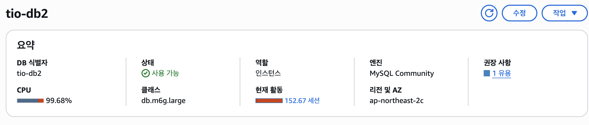
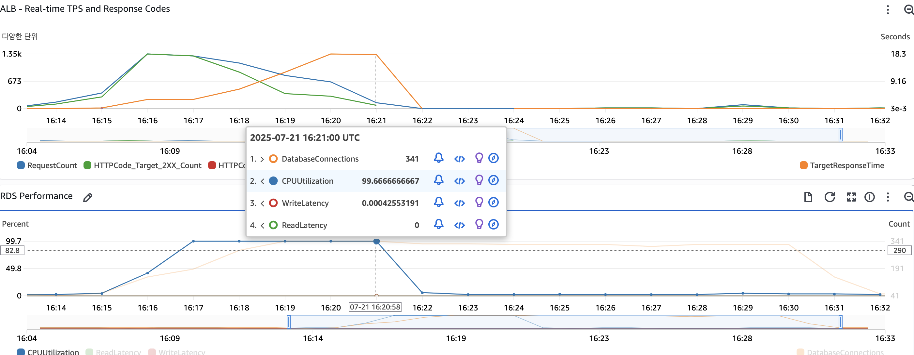
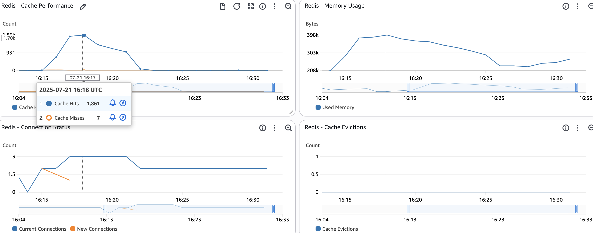
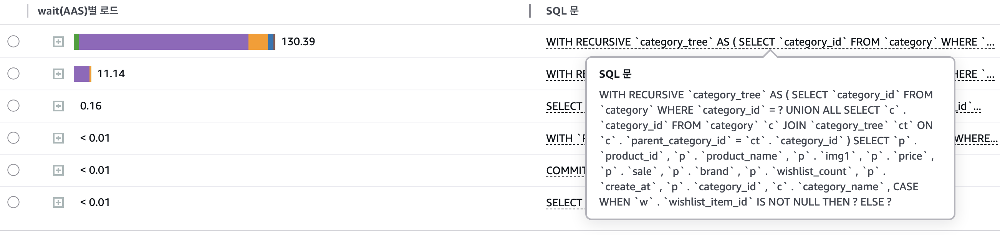
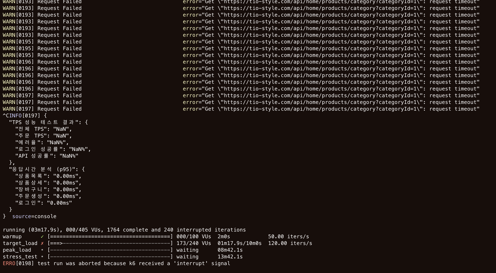
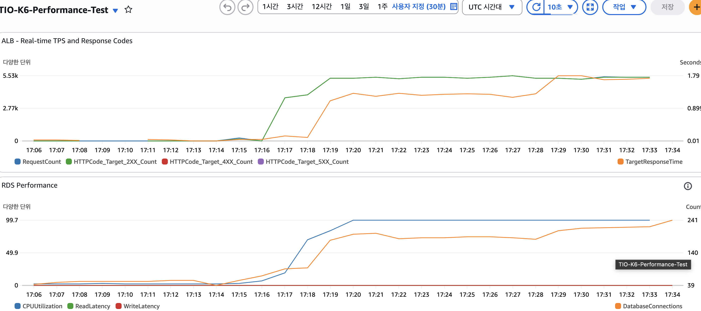
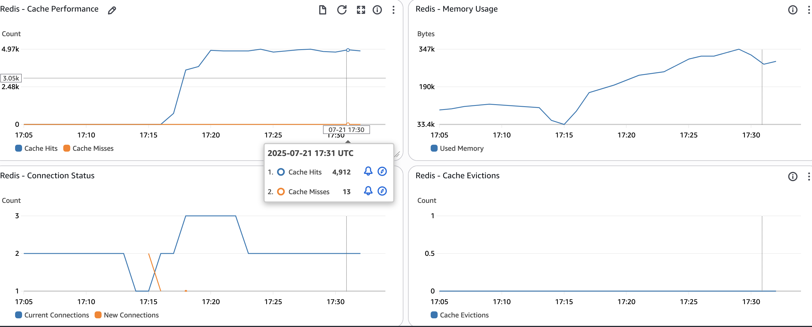
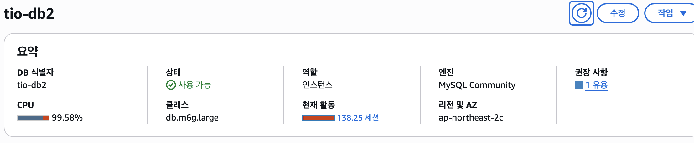
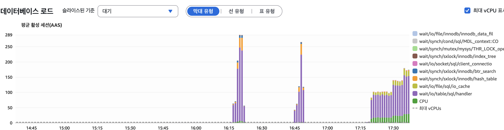

# 제품 카테고리 API 성능 병목 현상 및 해결 과정 (1)










## 1. Executive Summary (TL;DR)

- **현상**: 제품 카테고리 조회 API(`GET /products/category`)가 부하 테스트 시 RDS CPU 사용량을 99%까지 폭증시키며 대규모 `Request Timeout`을 유발, 사실상 서버 다운으로 이어짐.
- **1차 원인**: JPA 엔티티의 **지연 로딩(Lazy Loading)** 특성으로 인해 **캐시 직렬화(Serialization)가 실패**, 모든 요청이 DB로 직접 전달됨.
- **2차 원인**: 설령 캐시가 동작했더라도, **`userId`와 `page`를 포함한 비효율적인 캐시 키 전략**으로 인해 캐시 재사용률(Hit Rate)이 0에 수렴하여 성능 개선이 불가능한 구조였음.
- **해결**: **전체 상품 ID 목록을 우선 캐싱**한 후, **메모리에서 페이지네이션**을 수행하고 가벼운 **`IN` 쿼리**로 상세 정보만 조회하는 **2단계 캐시 전략**을 적용하여 문제를 근본적으로 해결.

---

## 2. 문제 상황 재구성: 완벽해 보였던 쿼리가 서버를 멈추기까지

### 가. 비즈니스 요구사항과 기술적 선택: `WITH RECURSIVE`

쇼핑몰의 계층형 카테고리 구조(예: 상의 > 티셔츠 > 반팔 티셔츠)의 모든 상품을 한 번에 조회하기 위해, N+1 문제를 회피할 수 있는 `WITH RECURSIVE` CTE 쿼리를 채택했다. 이는 자기 참조 관계를 가진 테이블을 탐색하는 가장 효율적인 SQL 기반 솔루션이었다.

```sql
-- 문제의 핵심 쿼리: 특정 카테고리 ID 하위의 모든 상품을 조회
WITH RECURSIVE category_tree AS (
  -- 1. 재귀의 시작점 (Anchor)
  SELECT category_id FROM category WHERE category_id = ?
  UNION ALL
  -- 2. 재귀 탐색 (Recursive)
  SELECT c.category_id FROM category c JOIN category_tree ct ON c.parent_category_id = ct.category_id
)
-- 3. 재귀 CTE 결과를 이용해 최종 상품 조회
SELECT p.*, c.category_name,
       -- 사용자별 '찜' 여부 확인을 위한 서브쿼리
       CASE WHEN w.wishlist_item_id IS NOT NULL THEN 1 ELSE 0 END AS isLiked
FROM product p
JOIN category_tree ct ON p.category_id = ct.category_id
JOIN category c ON p.category_id = c.category_id
LEFT JOIN wishlist_item w ON w.product_id = p.product_id AND w.wishlist_id =
    (SELECT ww.wishlist_id FROM wishlist ww WHERE ww.user_id = ?)

```

이 쿼리 자체는 문제가 없었다. 문제는 이 쿼리가 **어떻게 호출되었는가**에 있었다.

### 나. 장애 발생: 부하 테스트 시 드러난 진실

k6를 이용한 부하 테스트에서, 가상 사용자(VU) 수가 임계점을 넘어서자 RDS CPU 사용량이 99%에 도달하며 시스템 전체가 응답 불능 상태에 빠졌다. RDS Performance Insights는 위 `WITH RECURSIVE` 쿼리가 모든 DB 부하의 원인이라고 지목했다.

---

## 3. 근본 원인 심층 분석: 실패는 어떻게 연쇄적으로 일어났나

### 가. Root Cause #1: 캐시의 배신 - `LazyInitializationException`

가장 먼저 확인한 것은 캐시였다. 이처럼 비용이 높은 읽기 전용 쿼리는 반드시 캐싱되어야 했다. 하지만 로그는 캐시가 제 역할을 못 하고 있음을 명백히 보여주었다.

- **로그**: `Redis PUT Error: ... LazyInitializationException: could not initialize proxy - no Session`
- **원인**: `@Cacheable` 어노테이션이 JPA 엔티티 객체 자체를 캐싱하도록 설정되어 있었다. DB 세션이 종료된 후, Redis가 이 엔티티를 직렬화(JSON 변환)하기 위해 지연 로딩(`FetchType.LAZY`)으로 설정된 `children` 컬렉션에 접근하려 하자, 프록시 객체를 초기화할 수 없어 예외가 발생한 것이다.
- **결론**: **캐시 저장이 매번 실패했다.** 모든 요청은 캐시를 무시하고 DB로 향할 수밖에 없었다.

### 나. Root Cause #2: 잘못된 열쇠 - 비효율적인 캐시 키 전략

1차 문제 해결 후에도 성능 개선이 미미했다. 부하 테스트 로그에서 캐시 히트가 발생함에도 불구하고 DB 부하는 여전했다.

- **기존 캐시 키**: `@Cacheable(key = "{#categoryId, #userId, #page, #size}")`
- **문제점**: 캐시 키에 `userId`와 **`page`*가 포함되어 있었다.
    1. **`userId` 포함**: '찜' 여부 때문에 사용자별로 캐시가 파편화되어 캐시 재사용률이 0에 수렴했다.
    2. **`page` 포함**: 더 근본적으로, 페이지 번호가 키에 포함되어 있어 **모든 페이지가 개별적으로 캐싱**되었다. 이는 사용자들이 각기 다른 페이지를 동시에 요청할 때, **페이지 수만큼 `WITH RECURSIVE` 쿼리가 동시에 실행**되는 'Thundering Herd' 문제를 유발했다.
- **결론**: 캐시가 동작했더라도, 구조적으로 DB 부하를 막을 수 없는 잘못된 캐싱 전략이었다.

---

## 4. 최종 해결 과정: 캐시 대상을 바꿔라

'페이지 데이터'를 캐싱하는 전략을 폐기하고, **"카테고리별 정렬된 전체 상품 ID 목록"**을 캐싱하는 새로운 2단계 캐시 전략을 도입했다.

### 가. 1단계: Repository 수정 - 필요한 쿼리 준비

1. **`findSortedProductIdsByHierarchicalCategory` (ID 목록 조회)**:
    - 비싼 `WITH RECURSIVE` 쿼리를 사용하여, 특정 카테고리에 속한 **모든 상품의 ID**를 `wishlist_count` 순으로 정렬하여 `List<Long>` 형태로 반환하는 네이티브 쿼리를 추가했다. 이 쿼리는 이제 **카테고리당 단 한 번만 호출**된다.
    
    ```java
    @Query(value = "WITH RECURSIVE category_tree AS ( ... ) " +
                   "SELECT p.product_id FROM product p ... ORDER BY p.wishlist_count DESC, p.create_at DESC",
           nativeQuery = true)
    List<Long> findSortedProductIdsByHierarchicalCategory(@Param("categoryId") Long categoryId);
    
    ```
    
2. **`findProductDetailsByProductIds` (상세 정보 조회)**:
    - 상품 ID 목록(`List<Long>`)을 받아, 가볍고 빠른 `IN` 절을 사용하여 제품 상세 정보를 조회하는 JPQL 쿼리를 추가했다. 이 쿼리는 DTO 생성자를 직접 호출하여 타입 안정성을 확보한다.
    
    ```java
    @Query("SELECT new com.tryiton.core.product.dto.ProductHierarchyDto(" +
           "p.id, ..., CASE WHEN w.id IS NOT NULL THEN 1 ELSE 0 END) " +
           "FROM Product p ... WHERE p.id IN :productIds")
    List<ProductHierarchyDto> findProductDetailsByProductIds(@Param("userId") Long userId, @Param("productIds") List<Long> productIds);
    
    ```
    

### 나. 2단계: Service 로직 재구성 - 2단계 캐시 전략 적용

1. **`getSortedProductIdsForCategory` (캐싱 담당)**:
    - 위에서 만든 ID 조회 메소드를 호출하고, 그 결과를 캐싱하는 새로운 내부 메소드를 생성했다. 캐시 키는 오직 `categoryId`만 사용한다.
    
    ```java
    @Cacheable(value = "sortedCategoryProductIds", key = "#categoryId")
    public List<Long> getSortedProductIdsForCategory(Long categoryId) {
        return productRepository.findSortedProductIdsByHierarchicalCategory(categoryId);
    }
    
    ```
    
2. **`getProductsByCategory` (메인 로직)**:
    - 이제 이 메소드는 DB를 직접 호출하는 대신, 캐시된 데이터를 조합하는 역할만 수행한다.
        1. `getSortedProductIdsForCategory`를 호출하여 캐시된 **전체 상품 ID 목록**을 가져온다.
        2. 애플리케이션 **메모리에서 직접 페이지네이션**을 수행하여 현재 페이지에 해당하는 ID 목록만 잘라낸다. (`idList.subList(...)`)
        3. 잘라낸 ID 목록을 사용하여 `findProductDetailsByProductIds`를 호출, **현재 페이지의 상세 정보만 DB에서 조회**한다.
        4. DB에서 조회된 결과는 정렬 순서를 보장하지 않으므로, 원래 ID 목록의 순서대로 다시 정렬한다.
        5. 최종적으로 `Page` 객체를 만들어 반환한다.
    
    ```java
    public Page<ProductHierarchyDto> getProductsByCategory(Long userId, Long categoryId, int page, int size) {
        // 1. 캐시된 전체 상품 ID 목록 조회
        List<Long> allProductIds = getSortedProductIdsForCategory(categoryId);
    
        // 2. 메모리에서 페이지네이션
        Pageable pageable = PageRequest.of(page, size);
        int start = (int) pageable.getOffset();
        int end = Math.min((start + pageable.getPageSize()), allProductIds.size());
        List<Long> pagedProductIds = allProductIds.subList(start, end);
    
        // 3. 현재 페이지의 상세 정보만 DB에서 조회
        List<ProductHierarchyDto> products = productRepository.findProductDetailsByProductIds(userId, pagedProductIds);
    
        // 4. 원래 순서대로 재정렬
        Map<Long, ProductHierarchyDto> productMap = products.stream()
                .collect(Collectors.toMap(ProductHierarchyDto::getProductId, p -> p));
        List<ProductHierarchyDto> sortedProducts = pagedProductIds.stream()
                .map(productMap::get)
                .collect(Collectors.toList());
    
        return new PageImpl<>(sortedProducts, pageable, allProductIds.size());
    }
    
    ```
    

## 5. 결론

- **최종 결과**: 무거운 재귀 쿼리는 카테고리당 단 한 번만 실행되어 그 결과(ID 목록)가 캐시되고, 이후 모든 페이지 요청은 캐시된 ID 목록과 가벼운 `IN` 쿼리의 조합으로 처리되도록 아키텍처를 개선했다.
- **교훈**: 이번 장애는 캐시 시스템을 설계할 때 **무엇을 캐싱할 것인가(What to Cache)**가 **어떻게 캐싱할 것인가(How to Cache)**만큼 중요하다는 것을 보여준다. 페이지별로 분할된 데이터를 캐싱하는 것은 동시성이 높은 환경에서 'Thundering Herd' 문제를 유발할 수 있으며, 때로는 **정규화되지 않은 전체 데이터셋(ID 목록)을 캐싱**하고 애플리케이션 레벨에서 가공하는 것이 훨씬 더 효과적인 전략이 될 수 있다.



## 안정적인 테스트 수행





모든 지표가 안정적으로 보인다.

### DB에서는



여전히 VUs 200 도달하면 허덕거리기는하는데 데이터베이스 로드 (평균 활성 세션 AAS)에서의 wait 중인 쿼리가 확연히 다르다



앞에 순간적으로 피크를 확찍고 적체중인 그래프들이 매번 실패하던 앞선 테스트들이고, 뒤에 지속적으로 쌓이고 잇는게 단계별로 부하를 가해지고있는 중인 이번 개선 후의 테스트 진행 그래프이다.

## 캐시를 제대로 쓰고있다

(드디어)

이전에는 캐싱해야하는 자료에 사용자의 liked여부를 같이 포함시키다보니 결국 `같은 상품이지만` 캐시에 `따로 저장` 함으로서 상당히 무거운 쿼리를 매 사용자 호출시마다 DB에서 불러와야하는 것이 문제였지만. 지금은 더이상 한번 캐싱된 데이터는 다시 db에 호출요청하지 않아 부하가 매우 줄어든 것이다.