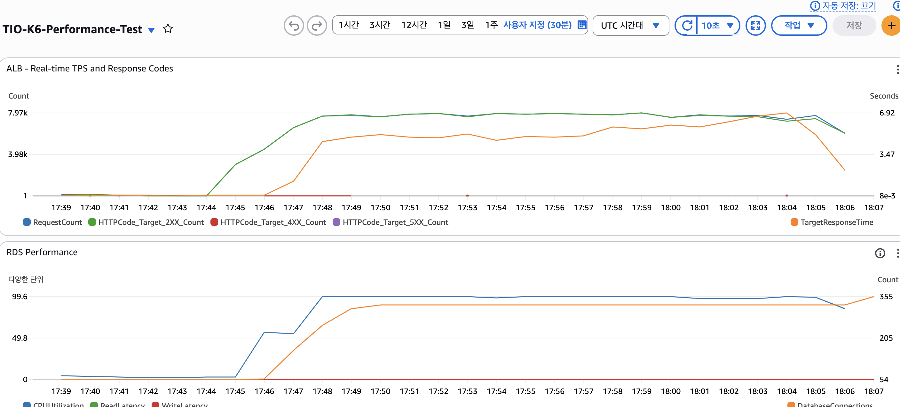
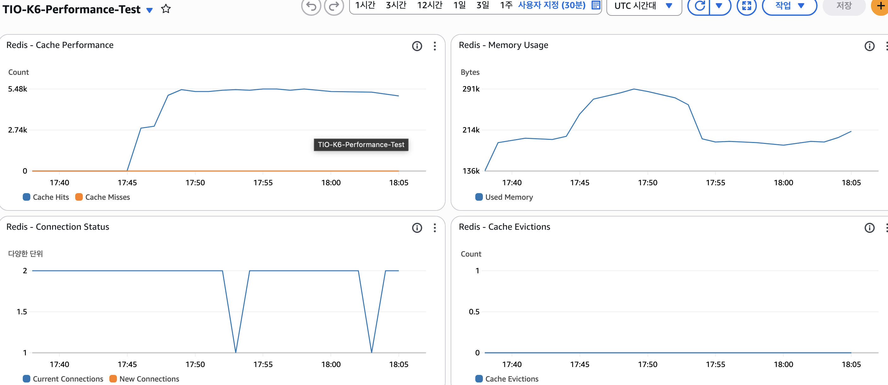
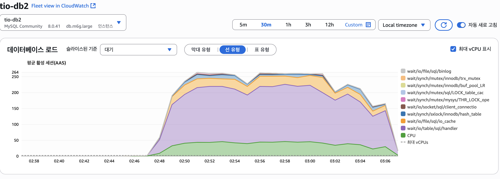
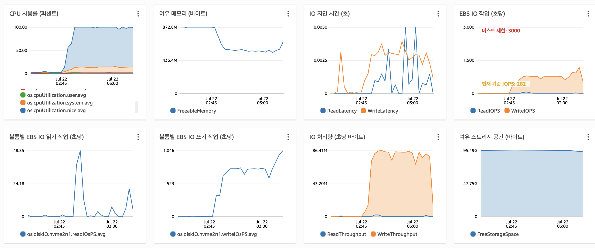
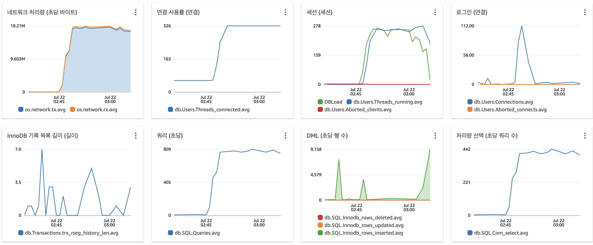
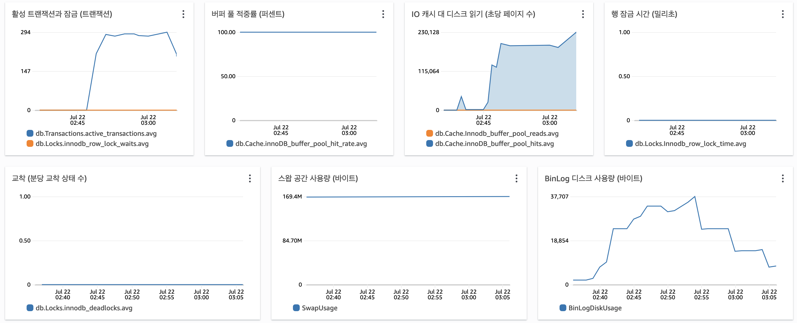
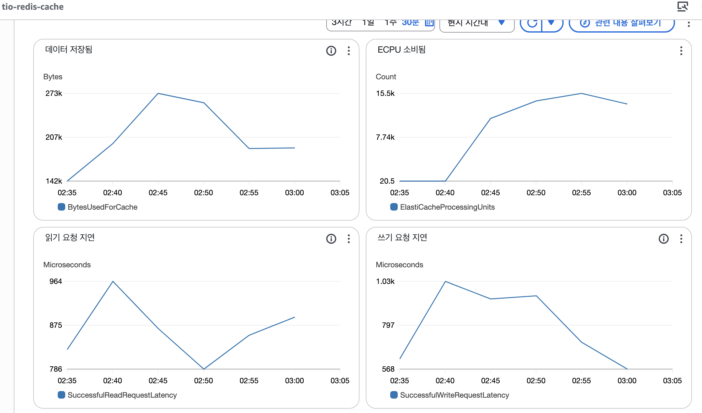
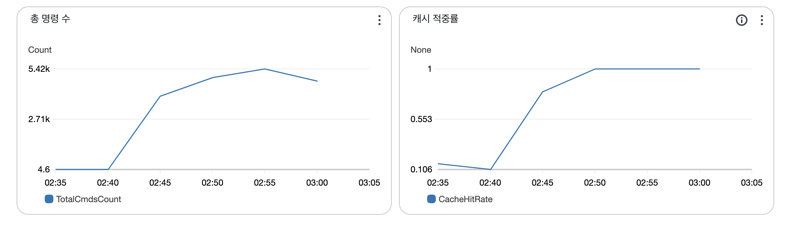
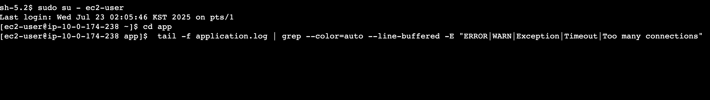

# 최종 테스트 결과 (1)

```jsx
// TIO-Style.com의 실제 운영 환경을 시뮬레이션하는 GET 요청 중심의 종합 성능 테스트 스크립트

import http from 'k6/http';
import { check, sleep } from 'k6';
import { Rate, Counter } from 'k6/metrics';

// --- 커스텀 메트릭 정의 ---
const tpsCounter       = new Counter('tps_counter');
const errorRate        = new Rate('error_rate');
const loginSuccessRate = new Rate('login_success_rate');
const apiSuccessRate   = new Rate('api_success_rate');

// --- 테스트 옵션 ---
export let options = {
  scenarios: {
    warmup: {
      executor: 'constant-arrival-rate',
      rate:            25,
      timeUnit:      '1s',
      duration:      '2m',
      preAllocatedVUs: 150,
      maxVUs:          350,
      tags: { phase: 'warmup' },
    },
    target_load: {
      executor: 'constant-arrival-rate',
      rate:            60,
      timeUnit:      '1s',
      duration:      '10m',
      startTime:     '2m',
      preAllocatedVUs: 200,
      maxVUs:          800,
      tags: { phase: 'target' },
    },
    peak_load: {
      executor: 'constant-arrival-rate',
      rate:            70,
      timeUnit:      '1s',
      duration:      '5m',
      startTime:     '12m',
      preAllocatedVUs: 220,
      maxVUs:          900,
      tags: { phase: 'peak' },
    },
    stress_test: {
      executor: 'constant-arrival-rate',
      rate:            80,
      timeUnit:      '1s',
      duration:      '3m',
      startTime:     '17m',
      preAllocatedVUs: 250,
      maxVUs:         1000,
      tags: { phase: 'stress' },
    },
    cooldown: {
      executor: 'constant-arrival-rate',
      rate:            50,
      timeUnit:      '1s',
      duration:      '2m',
      startTime:     '20m',
      preAllocatedVUs: 180,
      maxVUs:          350,
      tags: { phase: 'cooldown' },
    }
  },
  thresholds: {
    'http_req_duration{api:product_list}':   ['p(95)<1000'],
    'http_req_duration{api:product_detail}': ['p(95)<1500'],
    // 'http_req_duration{api:product_search}': ['p(95)<1500'],
    'http_req_duration{api:cart_view}':      ['p(95)<800'],
    // 'http_req_duration{api:story}':          ['p(95)<1000'],  // stories 응답시간 기준
    'http_req_duration{api:my_info}':        ['p(95)<500'],
    'http_req_duration{api:login}':          ['p(95)<2000'],
    'error_rate':                            ['rate<0.05'],
    'http_req_failed':                       ['rate<0.10'],
    'login_success_rate':                    ['rate>0.90'],
    'api_success_rate':                      ['rate>0.80'],
  }
};

const BASE_URL = 'https://tio-style.com';
const TEST_USERS = [
  { email: 'mame616@gmail.com', password: 'Test123!' },
  { email: 'ahpicl64@gmail.com', password: 'Test123!' }
];

// 사용자 행동 시나리오 (stories 조회 포함)
const USER_BEHAVIORS = {
  GUEST:    { weight: 40, actions: ['browse_products', 'view_detail'] },
  SEARCHER: { weight: 30, actions: ['browse_products', 'view_detail'] },
  MEMBER:   { weight: 30, actions: ['login', 'view_my_info', 'browse_products', 'view_detail', 'view_cart'] }
};

function selectUserBehavior() {
  const rand = Math.random() * 100;
  if (rand < 40) return USER_BEHAVIORS.GUEST;
  if (rand < 70) return USER_BEHAVIORS.SEARCHER;
  return USER_BEHAVIORS.MEMBER;
}

export default function() {
  const behavior = selectUserBehavior();
  const user     = TEST_USERS[Math.floor(Math.random() * TEST_USERS.length)];
  let authToken  = null;

  tpsCounter.add(1);

  try {
    // 로그인
    if (behavior.actions.includes('login')) {
      const loginRes = http.post(
        `${BASE_URL}/api/auth/mail/login`,
        JSON.stringify({ email: user.email, password: user.password }),
        { headers: { 'Content-Type': 'application/json' }, tags: { api: 'login' } }
      );
      const ok = check(loginRes, { 'login success': r => r.status === 200 });
      loginSuccessRate.add(ok);
      apiSuccessRate.add(ok);
      errorRate.add(!ok);

      if (ok && loginRes.json('accessToken')) {
        authToken = loginRes.json('accessToken');
      } else {
        return;
      }
    }

    const headers = authToken
      ? { headers: { 'Authorization': `Bearer ${authToken}` } }
      : {};

    // 마이페이지 프로필 조회
    if (behavior.actions.includes('view_my_info')) {
      const r = http.get(`${BASE_URL}/api/mypage/profile`, { ...headers, tags: { api: 'my_info' } });
      apiSuccessRate.add(check(r, { 'my info success': r => r.status === 200 }));
      sleep(0.5);
    }

    // 상품 목록 조회 (카테고리별 페이징)
    if (behavior.actions.includes('browse_products')) {
      const categoryIds = [1,2,3,4,5,6];
      const id = categoryIds[Math.floor(Math.random() * categoryIds.length)];
      const r  = http.get(
        `${BASE_URL}/api/home/products/category?categoryId=${id}&page=0&size=10`,
        { ...headers, tags: { api: 'product_list' } }
      );
      apiSuccessRate.add(check(r, { 'products list success': r => r.status === 200 }));
      sleep(0.5);
    }

    // // 상품 검색
    // if (behavior.actions.includes('search_products')) {
    //   const kw = ['shirt','pants','dress','jacket','skirt','blue','black','white'];
    //   const r  = http.get(
    //     `${BASE_URL}/api/home/products/search?query=${kw[Math.floor(Math.random()*kw.length)]}&page=0&size=10`,
    //     { ...headers, tags: { api: 'product_search' } }
    //   );
    //   apiSuccessRate.add(check(r, { 'product search success': r => r.status === 200 }));
    //   sleep(1);
    // }

    // 상품 상세 조회
    if (behavior.actions.includes('view_detail')) {
      const ids = [520,1000,60000,30000];
      const r   = http.get(
        `${BASE_URL}/api/products/${ids[Math.floor(Math.random()*ids.length)]}`,
        { ...headers, tags: { api: 'product_detail' } }
      );
      apiSuccessRate.add(check(r, { 'product detail success': r => r.status === 200 }));
      sleep(1);
    }

    // 장바구니 조회
    if (behavior.actions.includes('view_cart')) {
      const r = http.get(`${BASE_URL}/api/cart`, { ...headers, tags: { api: 'cart_view' } });
      apiSuccessRate.add(check(r, { 'cart view success': r => r.status === 200 }));
      sleep(0.5);
    }

    // stories 조회 (order_history 대신)
    // if (behavior.actions.includes('view_story')) {
    //   const r = http.get(`${BASE_URL}/api/stories`, { ...headers, tags: { api: 'story' } });
    //   apiSuccessRate.add(check(r, { 'story view success': r => r.status === 200 }));
    //   sleep(1);
    // }

  } catch (e) {
    errorRate.add(1);
  }

  sleep(Math.random() * 2 + 0.5);
}

export function handleSummary(data) {
  const it       = data.metrics.iterations || {};
  const duration = (it.count && it.rate) ? it.count / it.rate : 0;

  const tpsRate        = data.metrics.tps_counter?.rate      || 0;
  const errorRateValue = data.metrics.error_rate?.value     || 0;
  const loginRateValue = data.metrics.login_success_rate?.value || 0;
  const apiRateValue   = data.metrics.api_success_rate?.value   || 0;

  // 요약에 포함할 엔드포인트 목록에 'story' 추가
  const endpoints = [
    'product_list', 'product_detail',
    'cart_view', 'my_info', 'login'
  ];
  const p95s = endpoints.reduce((acc, name) => {
    const key = `http_req_duration{api:${name}}`;
    const m   = data.metrics[key] || {};
    acc[name] = m['p(95)'] || 0;
    return acc;
  }, {});

  const summary = {
    'GET 요청 중심 성능 테스트 결과': {
      '테스트 시간':       `${duration.toFixed(2)}s`,
      '전체 TPS':         tpsRate.toFixed(2),
      '에러율':            `${(errorRateValue * 100).toFixed(2)}%`,
      '로그인 성공률':     `${(loginRateValue * 100).toFixed(2)}%`,
      'API 성공률':        `${(apiRateValue * 100).toFixed(2)}%`
    },
    '응답시간 분석 (p95)': Object.fromEntries(
      endpoints.map(name => [name, `${p95s[name].toFixed(2)}ms`])
    )
  };

  console.log(JSON.stringify(summary, null, 2));
  return { 'final-test-results.json': JSON.stringify(summary, null, 2) };
}
```



















```jsx
./run_k6.sh
TryItOn TPS 기반 성능 테스트 시작
======================================
⏰ 테스트 시작 시간: Wed Jul 23 02:45:18 KST 2025

📊 테스트 단계:
  Phase 1: 워밍업     - 50 TPS  (2분)
  Phase 2: 목표부하   - 100 TPS (10분)
  Phase 3: 피크부하   - 200 TPS (5분)
  Phase 4: 스트레스   - 500 TPS (3분)
  총 예상 시간: 20분

🎯 K6 TPS 테스트 실행 중...

         /\      Grafana   /‾‾/  
    /\  /  \     |\  __   /  /   
   /  \/    \    | |/ /  /   ‾‾\ 
  /          \   |   (  |  (‾)  |
 / __________ \  |_|\_\  \_____/ 

     execution: local
        script: test_final.js
        output: -

     scenarios: (100.00%) 5 scenarios, 1900 max VUs, 22m30s max duration (incl. graceful stop):
              * warmup: 25.00 iterations/s for 2m0s (maxVUs: 150-350, gracefulStop: 30s)
              * target_load: 60.00 iterations/s for 10m0s (maxVUs: 200-800, startTime: 2m0s, gracefulStop: 30s)
              * peak_load: 70.00 iterations/s for 5m0s (maxVUs: 220-900, startTime: 12m0s, gracefulStop: 30s)
              * stress_test: 80.00 iterations/s for 3m0s (maxVUs: 250-1000, startTime: 17m0s, gracefulStop: 30s)
              * cooldown: 50.00 iterations/s for 2m0s (maxVUs: 180-350, startTime: 20m0s, gracefulStop: 30s)

WARN[0187] Insufficient VUs, reached 800 active VUs and cannot initialize more  executor=constant-arrival-rate scenario=target_load
WARN[0751] Insufficient VUs, reached 900 active VUs and cannot initialize more  executor=constant-arrival-rate scenario=peak_load
WARN[1045] Insufficient VUs, reached 1000 active VUs and cannot initialize more  executor=constant-arrival-rate scenario=stress_test
WARN[1210] Insufficient VUs, reached 350 active VUs and cannot initialize more  executor=constant-arrival-rate scenario=cooldown
INFO[1326] {
  "GET 요청 중심 성능 테스트 결과": {
    "테스트 시간": "0.00s",
    "전체 TPS": "0.00",
    "에러율": "0.00%",
    "로그인 성공률": "0.00%",
    "API 성공률": "0.00%"
  },
  "응답시간 분석 (p95)": {
    "product_list": "0.00ms",
    "product_detail": "0.00ms",
    "cart_view": "0.00ms",
    "my_info": "0.00ms",
    "login": "0.00ms"
  }
}  source=console

running (22m05.8s), 0000/1900 VUs, 55815 complete and 63 interrupted iterations
warmup      ✓ [======================================] 000/150 VUs    2m0s   25.00 iters/s
target_load ✓ [======================================] 005/800 VUs    10m0s  60.00 iters/s
peak_load   ✓ [======================================] 058/900 VUs    5m0s   70.00 iters/s
stress_test ✓ [======================================] 0000/1000 VUs  3m0s   80.00 iters/s
cooldown    ✓ [======================================] 000/350 VUs    2m0s   50.00 iters/s
ERRO[1326] thresholds on metrics 'http_req_duration{api:cart_view}, http_req_duration{api:login}, http_req_duration{api:my_info}, http_req_duration{api:product_detail}, http_req_duration{api:product_list}' have been crossed 

✅ 테스트 완료!
⏰ 테스트 종료 시간: Wed Jul 23 03:07:24 KST 2025
📄 결과 파일 생성됨: raw-data.json

📊 주요 결과 요약:
{
  "전체 평균 TPS": 42.1,
  "HTTP 요청/초 (RPS)": 121.8,
  "API 성공률": "100%",
  "평균 응답시간": "4837ms",
  "총 테스트 시간": "1326초",
  "총 트랜잭션 (Iterations)": "55815건",
  "총 HTTP 요청": "161501건",
  "성공한 요청": "683건",
  "실패한 요청": "160818건"
}
```

```json
// 결과값 raw-data.json

{
    "metrics": {
        "tps_counter": {
            "count": 55878,
            "rate": 42.14749810450909
        },
        "vus": {
            "value": 20,
            "min": 20,
            "max": 1099
        },
        "http_req_failed": {
            "passes": 683,
            "fails": 160818,
            "thresholds": {
                "rate<0.10": false
            },
            "value": 0.004229075980953678
        },
        "http_reqs": {
            "count": 161501,
            "rate": 121.81651260561084
        },
        "http_req_blocked": {
            "med": 0.001,
            "max": 347.45,
            "p(90)": 0.002,
            "p(95)": 0.002,
            "avg": 0.9219920310071652,
            "min": 0
        },
        "http_req_connecting": {
            "avg": 0.5658252828155869,
            "min": 0,
            "med": 0,
            "max": 334.637,
            "p(90)": 0,
            "p(95)": 0
        },
        "http_req_duration{api:cart_view}": {
            "avg": 3075.245702262461,
            "min": 13.241,
            "med": 2873.825,
            "max": 11331.07,
            "p(90)": 5913.194,
            "p(95)": 6743.785799999997,
            "thresholds": {
                "p(95)<800": true
            }
        },
        "checks": {
            "passes": 160818,
            "fails": 683,
            "value": 0.9957709240190463
        },
        "http_req_duration": {
            "med": 4007.802,
            "max": 22569.192,
            "p(90)": 10673.564,
            "p(95)": 12842.484,
            "avg": 4837.1986263491135,
            "min": 8.67
        },
        "data_sent": {
            "count": 14406651,
            "rate": 10866.60753274677
        },
        "iteration_duration": {
            "avg": 17261.148094221444,
            "min": 87.773792,
            "med": 16324.426958,
            "max": 55928.602375,
            "p(90)": 28463.757533199998,
            "p(95)": 32185.284358299978
        },
        "http_req_duration{api:login}": {
            "max": 10893.019,
            "p(90)": 6163.2717,
            "p(95)": 7665.796249999999,
            "avg": 3269.1325290976606,
            "min": 81.466,
            "med": 3026.4145,
            "thresholds": {
                "p(95)<2000": true
            }
        },
        "http_req_duration{api:product_detail}": {
            "p(95)": 6925.637499999999,
            "avg": 2978.244916983155,
            "min": 8.67,
            "med": 2766.557,
            "max": 10807.343,
            "p(90)": 5904.1945000000005,
            "thresholds": {
                "p(95)<1500": true
            }
        },
        "http_req_sending": {
            "avg": 0.18485005046408387,
            "min": 0.01,
            "med": 0.13,
            "max": 124.465,
            "p(90)": 0.258,
            "p(95)": 0.335
        },
        "api_success_rate": {
            "passes": 160818,
            "fails": 683,
            "thresholds": {
                "rate>0.80": false
            },
            "value": 0.9957709240190463
        },
        "login_success_rate": {
            "passes": 16614,
            "fails": 54,
            "thresholds": {
                "rate>0.90": false
            },
            "value": 0.9967602591792657
        },
        "http_req_receiving": {
            "p(90)": 1.049,
            "p(95)": 1.89,
            "avg": 0.789932489582114,
            "min": 0.007,
            "med": 0.1,
            "max": 719.935
        },
        "http_req_duration{expected_response:true}": {
            "med": 4020.011,
            "max": 22569.192,
            "p(90)": 10691.436200000002,
            "p(95)": 12851.8656,
            "avg": 4848.201544167987,
            "min": 8.67
        },
        "http_req_duration{api:product_list}": {
            "p(90)": 13756.096099999999,
            "p(95)": 15332.295799999996,
            "avg": 8185.674150687878,
            "min": 22.351,
            "med": 8014.224,
            "max": 22569.192,
            "thresholds": {
                "p(95)<1000": true
            }
        },
        "http_req_duration{api:my_info}": {
            "p(95)": 7112.081449999998,
            "avg": 3162.8513175635144,
            "min": 14.758,
            "med": 2935.545,
            "max": 11389.944,
            "p(90)": 6086.1771,
            "thresholds": {
                "p(95)<500": true
            }
        },
        "http_req_tls_handshaking": {
            "avg": 0.3519854985418043,
            "min": 0,
            "med": 0,
            "max": 244.694,
            "p(90)": 0,
            "p(95)": 0
        },
        "iterations": {
            "rate": 42.099978644603866,
            "count": 55815
        },
        "http_req_waiting": {
            "p(90)": 10673.32,
            "p(95)": 12841.722,
            "avg": 4836.223843809062,
            "min": 0.051,
            "med": 4006.866,
            "max": 22568.234
        },
        "dropped_iterations": {
            "count": 24526,
            "rate": 18.499401168817602
        },
        "vus_max": {
            "min": 470,
            "max": 1900,
            "value": 1900
        },
        "data_received": {
            "count": 502061265,
            "rate": 378693.3357481466
        },
        "error_rate": {
            "passes": 54,
            "fails": 16614,
            "thresholds": {
                "rate<0.05": false
            },
            "value": 0.0032397408207343412
        }
    },
    "root_group": {
        "name": "",
        "path": "",
        "id": "d41d8cd98f00b204e9800998ecf8427e",
        "groups": {},
        "checks": {
                "login success": {
                    "passes": 16614,
                    "fails": 54,
                    "name": "login success",
                    "path": "::login success",
                    "id": "5e9145e3435397cfb51ed9c3151ba755"
                },
                "my info success": {
                    "path": "::my info success",
                    "id": "d9a72fad8f40e83c087ec113a78c8371",
                    "passes": 16550,
                    "fails": 64,
                    "name": "my info success"
                },
                "products list success": {
                    "id": "c1895acb1fc9f3369da039af30c91fe8",
                    "passes": 55619,
                    "fails": 205,
                    "name": "products list success",
                    "path": "::products list success"
                },
                "product detail success": {
                    "name": "product detail success",
                    "path": "::product detail success",
                    "id": "122fcfc968a8bbedd255af4f2d7192d0",
                    "passes": 55539,
                    "fails": 281
                },
                "cart view success": {
                    "path": "::cart view success",
                    "id": "2a0d5d18b82fa77cd8fe0ff9f919aa89",
                    "passes": 16496,
                    "fails": 79,
                    "name": "cart view success"
                }
            }
    }
}
```