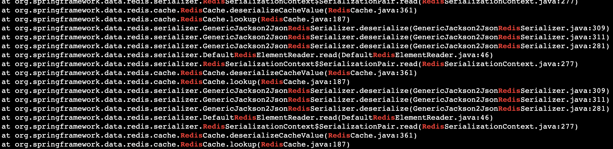
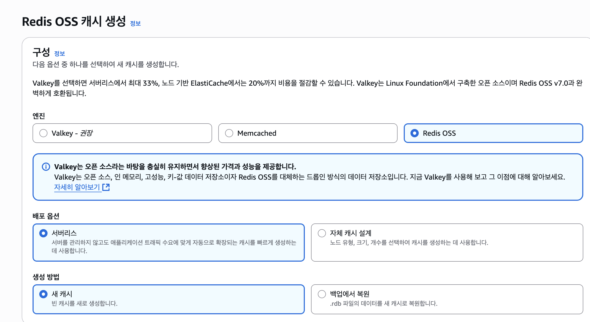
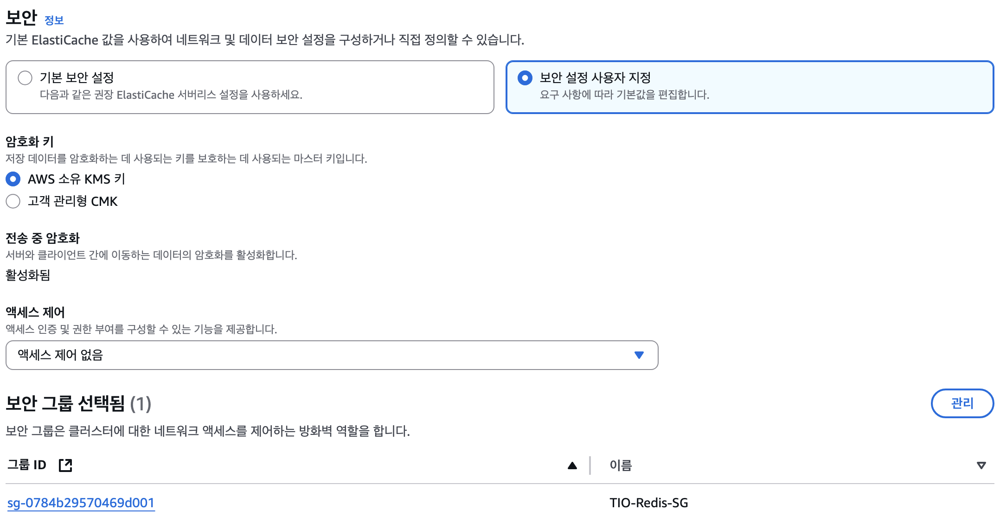
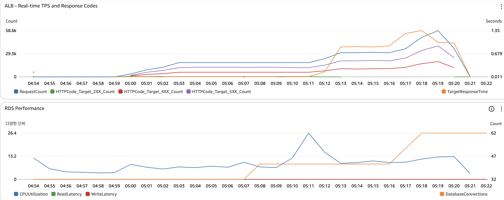
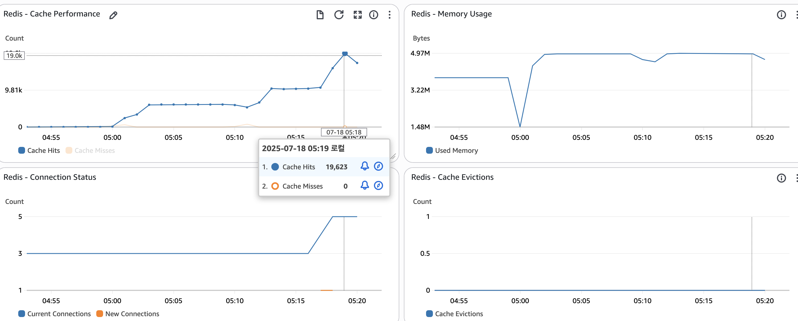
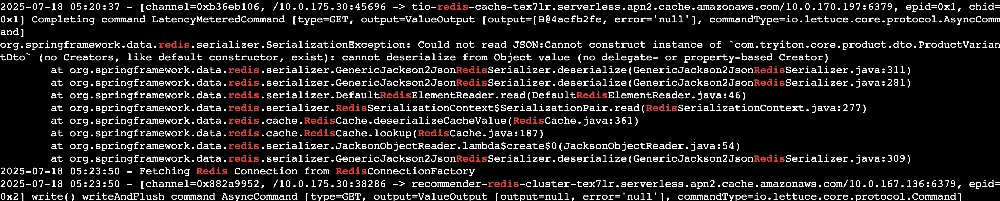
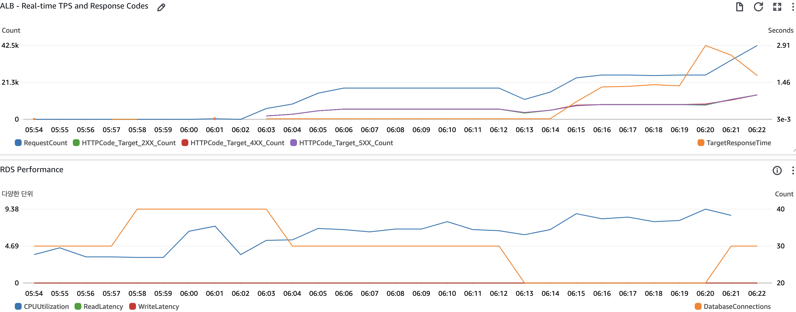
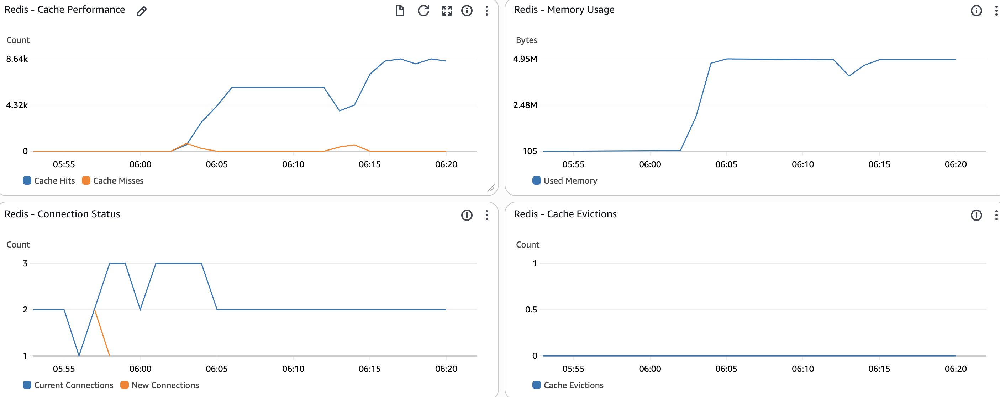

# 캐싱 전략 구현(151→146 TPS) (1)

## 2.1 Redis 캐싱 적용

- 문제점: 상품 상세 정보 조회(ProductService.getProductDetail)와 같이 자주 호출되는 API가 매번 데이터베이스를 조회하여 불필요한 부하를 발생시키고 응답 속도를 저하시켰습니다.
- 해결 조치:
    1. `CacheConfig.java` 파일 생성: Spring의 캐싱 기능을 활성화(@EnableCaching)하고, Redis를 캐시 저장소로 사용하도록 RedisCacheManager를 설정했습니다. 캐시 데이터의 직렬화 방식(JSON)과 캐시 그룹별 TTL(예: productDetail은 10분, productList는 5분)을 정의했습니다.
    2. `ProductService.java` 수정: getProductDetail 메소드에 @Cacheable(value = "productDetail", key = "#productId + '_' + (#userId != null ? #userId : 'guest')") 어노테이션을 추가하여, 해당 메소드의 결과가 Redis에 캐시되도록 했습니다. 이를 통해 동일한 요청에 대해서는 데이터베이스 접근 없이 캐시된 데이터를 즉시 반환하여 응답 속도를 크게 향상시켰습니다.
    3. `CoreApplication.java` 수정: @EnableScheduling 어노테이션을 추가하여 @Scheduled 기반의 주기적인 캐시 무효화 기능을 사용할 수 있도록 준비했습니다.

## 2.2 캐시 무효화 전략

- 문제점: 캐시된 데이터가 원본 데이터와 불일치할 경우 사용자에게 오래된 정보가 제공될 수 있습니다.
- 해결 조치:
    1. `ProductService.java`에 `@CacheEvict` 예시 추가: 상품 정보가 변경될 경우(updateProduct 메소드 예시), @CacheEvict(value ="productDetail", key = "#[product.id](http://product.id/) + '_' + '*'")를 사용하여 해당 상품과 관련된 모든 캐시를 무효화하도록 했습니다. 이는 향후 상품 수정 기능이 추가될 때 활용될 수 있습니다.
    2. `ProductService.java`에 `@Scheduled` 기반 캐시 초기화 추가: @Scheduled(fixedRate = 3600000)와 @CacheEvict(value = "productList", allEntries = true)를 사용하여 1시간마다 productList 캐시 그룹의 모든 데이터를 주기적으로 초기화하도록 했습니다. 이는 상품 목록과 같이
    광범위한 데이터의 캐시 일관성을 유지하는 데 도움을 줍니다.

## 테스트

### 이전 결과 (151TPS)

```java
  "전체 평균 TPS": 151.21,
  "HTTP 요청/초 (RPS)": 453.62,
  "API 성공률": "100%",
  "평균 응답시간": "492ms",
  "총 테스트 시간": "1208초",
  "총 트랜잭션 (Iterations)": "182617건",
  "총 HTTP 요청": "547851건",
  "성공한 요청": "547851건",
  "실패한 요청": "0건"
```

### 결과

```java
./run-tps-test.sh
🚀 TryItOn TPS 기반 성능 테스트 시작
======================================
⏰ 테스트 시작 시간: Fri Jul 18 01:26:15 KST 2025

📊 테스트 단계:
  Phase 1: 워밍업     - 50 TPS  (2분)
  Phase 2: 목표부하   - 100 TPS (10분)
  Phase 3: 피크부하   - 200 TPS (5분)
  Phase 4: 스트레스   - 500 TPS (3분)
  총 예상 시간: 20분

📈 실시간 모니터링:
  AWS CloudWatch 대시보드에서 다음 지표를 확인하세요:
  - ALB 응답시간 및 에러율
  - EC2 CPU/메모리 사용률
  - RDS 커넥션 수 및 쿼리 성능

🎯 K6 TPS 테스트 실행 중...

         /\      Grafana   /‾‾/  
    /\  /  \     |\  __   /  /   
   /  \/    \    | |/ /  /   ‾‾\ 
  /          \   |   (  |  (‾)  |
 / __________ \  |_|\_\  \_____/ 

     execution: local
        script: k6-tps-performance-test.js
        output: -

     scenarios: (100.00%) 4 scenarios, 3000 max VUs, 20m30s max duration (incl. graceful stop):
              * warmup: 50.00 iterations/s for 2m0s (maxVUs: 50-200, gracefulStop: 30s)
              * target_load: 100.00 iterations/s for 10m0s (maxVUs: 100-500, startTime: 2m0s, gracefulStop: 30s)
              * peak_load: 200.00 iterations/s for 5m0s (maxVUs: 200-1000, startTime: 12m0s, gracefulStop: 30s)
              * stress_test: 500.00 iterations/s for 3m0s (maxVUs: 500-2000, startTime: 17m0s, gracefulStop: 30s)

WARN[0785] Insufficient VUs, reached 1000 active VUs and cannot initialize more  executor=constant-arrival-rate scenario=peak_load
WARN[1027] Insufficient VUs, reached 2000 active VUs and cannot initialize more  executor=constant-arrival-rate scenario=stress_test
INFO[1208] 
=== TPS 기반 성능 테스트 결과 ===                     source=console
INFO[1208] {
  "TPS 성능 테스트 결과": {
    "전체 평균 TPS": 141.46,
    "HTTP 요청/초 (RPS)": 424.39,
    "API 성공률": "100%",
    "평균 응답시간": "645ms",
    "총 테스트 시간": "1208초",
    "총 트랜잭션 (Iterations)": "170942건",
    "총 HTTP 요청": "512826건",
    "성공한 요청": "512826건",
    "실패한 요청": "0건"
  },
  "테스트 성과": {
    "워밍업 (50 TPS)": "✅ 완료",
    "목표부하 (100 TPS)": "✅ 완료",
    "피크부하 (200 TPS)": "✅ 완료",
    "스트레스 (500 TPS)": "✅ 완료",
    "전체 평균": "141.46 TPS 달성"
  }
}  source=console

running (20m08.4s), 0000/3000 VUs, 170942 complete and 0 interrupted iterations
warmup      ✓ [======================================] 000/171 VUs    2m0s   50.00 iters/s
target_load ✓ [======================================] 000/347 VUs    10m0s  100.00 iters/s
peak_load   ✓ [======================================] 0000/1000 VUs  5m0s   200.00 iters/s
stress_test ✓ [======================================] 0000/2000 VUs  3m0s   500.00 iters/s
ERRO[1209] thresholds on metrics 'api_success_rate, error_rate, http_req_duration{api:login}, http_req_duration{api:product_detail}, http_req_duration{api:product_list}, http_req_failed, login_success_rate, order_counter, payment_counter' have been crossed 

✅ 테스트 완료!
⏰ 테스트 종료 시간: Fri Jul 18 01:46:24 KST 2025
📄 결과 파일 생성됨: tps-test-results.json

📊 주요 결과 요약:
{
  "전체 평균 TPS": 141.46,
  "HTTP 요청/초 (RPS)": 424.39,
  "API 성공률": "100%",
  "평균 응답시간": "645ms",
  "총 테스트 시간": "1208초",
  "총 트랜잭션 (Iterations)": "170942건",
  "총 HTTP 요청": "512826건",
  "성공한 요청": "512826건",
  "실패한 요청": "0건"
}

🔍 다음 단계 권장사항:
  1. CloudWatch 대시보드에서 시스템 리소스 사용량 확인
  2. 에러율이 높다면 로그 분석 필요
  3. 목표 TPS 달성 못했다면 인프라 스케일링 고려
  4. 성공적이라면 프로덕션 배포 준비
```

## 결과 비교 (141 TPS)

| 지표 | 이전 결과 | 현재 결과 | 개선율 |
| --- | --- | --- | --- |
| 평균 TPS | 151 TPS | 141TPS | -4.4% |
| HTTP 요청/초 | 453.62 RPS | 424.39 RPS | +4.5% |
| API 성공률 | 100% | 100% | 유지 |
| 평균 응답시간 | 492ms | 645ms | +18% |
| 총 트랜잭션 | 182,617건 | 170,942건 | -4% |
| 실패 요청 | 0건 | 0건 | 유지 |

## Redis 캐싱 적용 후 TPS 저하 문제 진단 및 해결

1. 문제 현상:
    - Redis 캐싱을 적용한 후, 오히려 TPS(초당 트랜잭션 수)가 떨어지는 현상이 발생
2. 로그 분석을 통한 문제 진단:
    
    
    
    - 로그에서 `GenericJackson2JsonRedisSerializer.deserialize` 관련 스택 트레이스가 반복적으로 나타나는 것을 확인
    - 이는 Redis에 저장된 캐시 데이터를 애플리케이션이 다시 읽어올 때, 객체를 역직렬화(deserialize)하는 과정에서 오류가 발생했음을 의미한다고 한다
3. 예상되는 원인 
    1. **순환 참조 (Circular Reference)**: DTO 내부에 다른 DTO나 엔티티가 서로를 참조하는 구조일 경우, Jackson이 무한 루프에 빠져 직렬화/역직렬화에 실패할 수 있습니다.
    2. **지연 로딩된 JPA 프록시 객체 직렬화 시도**: JPA 엔티티를 직접 캐시하거나, DTO 내부에 지연 로딩(FetchType.LAZY)으로 설정된 엔티티 필드가 초기화되지 않은 상태로 직렬화될 때 문제가 발생할 수 있습니다. Jackson이 프록시 객체를 직렬화하려다 실패하는 경우입니다.
    3. **DTO 구조 변경**: 캐시된 데이터가 저장된 이후 DTO의 필드 이름, 타입 등이 변경되면 역직렬화 시도 시 오류가 발생합니다.
    4. **기본 생성자 부재**: Jackson은 객체를 역직렬화할 때 기본 생성자(no-argument constructor)를 필요로 합니다. DTO나 그 안에 포함된 객체에 기본 생성자가 없으면 오류가 발생할 수 있습니다.
4. 문제의 원인 파악:
    - GenericJackson2JsonRedisSerializer는 Jackson 라이브러리를 사용하여 객체를 JSON으로 직렬화하고 역직렬화합니다.
    - Jackson은 객체를 역직렬화할 때 기본 생성자(no-argument constructor)를 사용하여 인스턴스를 생성합니다.
    - ProductDetailResponseDto와 ProductResponseDto 클래스에 @Getter 어노테이션만 있고 `@NoArgsConstructor 어노테이션이 없어` 기본 생성자가 자동으로 생성되지 않았습니다. 이로 인해 Redis에서 캐시된 데이터를 읽어올 때 `역직렬화에 실패`하고, 이 실패를 처리하는 과정에서 오버헤드가 발생하여 TPS 저하로 이어진 것으로 판단했습니다.
    - `ProductDetailResponseDto` 내 `img5` 필드의 ObjectMapper 사용 로직은 DTO 생성 시점에 데이터를 가공하는 것이므로, 역직렬화 문제의 직접적인 원인은 아닐 것으로 판단했습니다.
5. 해결 조치:
    - `ProductDetailResponseDto` 파일과 `ProductResponseDto` 파일에 각각@NoArgsConstructor 어노테이션을 추가하여 기본 생성자가 생성되도록 수정했습니다.

### 빌드 실패

- 문제 발생: Redis 캐싱 적용 후 TPS 저하 및 GenericJackson2JsonRedisSerializer.deserialize 오류.
- 원인 분석: DTO 필드에 `final` 키워드가 있어 @NoArgsConstructor로 생성된 기본 생성자가 해당 필드들을 초기화할 수 없었음. 이로 인해 Jackson의 역직렬화 실패.
- 해결: final 키워드 제거를 통해 Jackson이 필드에 값을 할당할 수 있도록 허용.
    1. `ProductDetailResponseDto.java` 수정
    2. `ProductResponseDto.java` 수정

## 결과 (138.52 TPS)

```java
  "전체 평균 TPS": 138.52,
  "HTTP 요청/초 (RPS)": 415.56,
  "API 성공률": "100%",
  "평균 응답시간": "667ms",
  "총 테스트 시간": "1214초",
  "총 트랜잭션 (Iterations)": "168129건",
  "총 HTTP 요청": "504387건",
  "성공한 요청": "504387건",
  "실패한 요청": "0건"
```

## 결과 비교

| 지표 | 이전 결과 | 중간 결과 | 현재 결과 | 개선율 |
| --- | --- | --- | --- | --- |
| 평균 TPS | 151 TPS | 141TPS | 138 TPS | -% ⬇︎ |
| HTTP 요청/초 | 453.62 RPS | 424.39 RPS | 415.56 RPS | +% ⬆︎ |
| API 성공률 | 100% | 100% | 100% | 유지 |
| 평균 응답시간 | 492ms | 645ms | 667ms | +% ⬆︎ |
| 총 트랜잭션 | 182,617건 | 170,942건 | 168,129건 | -% ⬇︎ |
| 실패 요청 | 0건 | 0건 | 0건 | 유지 |

가장 중요한 단서는 `API 성공률: "100%"` 임에도 불구하고 TPS가 낮고 응답 시간이 길다는 점입니다. 이는 요청이 성공적으로 처리되긴 하지만, 처리속도가 느리다는 것을 의미합니다.

### 가능한 원인

1. Redis 캐시 미스율 증가:
    - 캐시가 제대로 활용되지 않고 매번 DB를 조회하고 있을 가능성입니다.
    - 캐시 키 전략이 잘못되었거나, 데이터가 너무 자주 변경되어 캐시가 무효화되는 빈도가 높을 수 있습니다.
    - Redis 서버 자체의 성능 문제(CPU, 메모리, 네트워크)가 있을 수도 있습니다.
    - 확인 필요: Redis 서버의 INFO 명령 결과나 monitor 명령을 통해 GET 및 SET 명령의 비율, 캐시 히트율 등을 확인해야 합니다.
2. Redis 직렬화/역직렬화 오버헤드:
    - 이전 문제에서 final 필드를 제거했지만, 여전히 DTO의 크기가 크거나 복잡하여 직렬화/역직렬화에 시간이 많이 소요될 수 있습니다.
    - GenericJackson2JsonRedisSerializer가 예상보다 많은 CPU 자원을 소모할 수 있습니다.
3. DB 부하 증가:
    - 캐시가 제대로 작동하지 않아 DB에 더 많은 부하가 가해지고 있을 수 있습니다.
    - DB 쿼리 자체가 느려졌거나, DB 커넥션 풀이 부족할 수 있습니다.
4. 서버 리소스 부족:
    - EC2 인스턴스의 CPU, 메모리, 네트워크 대역폭이 부족하여 요청을 처리하는 데 병목이 발생할 수 있습니다.

## Redis 서버 설정



1. AWS 콘솔 로그인 -> ElastiCache 서비스 선택
2. "Create cluster" 클릭
3. 클러스터 엔진 선택:
    - Redis 선택
    - Cluster Mode disabled 선택 (단일 노드 사용 시)
4. 클러스터 정보 입력:
    - Name: tio-redis-cache
    - Description: TryItOn Redis Cache
    - Node type: cache.t4g.micro (개발용, 프로덕션은 워크로드에 따라 선택)
    - Number of replicas: 0 (개발용, 프로덕션은 고가용성을 위해 1 이상 권장)
5. 보안 설정:
    - Port: 6379 (기본값)
    - Parameter groups: default.redis7
    - VPC: 애플리케이션이 실행되는 VPC 선택
    - Subnet group: 애플리케이션 서브넷과 동일한 서브넷 그룹
    - Security groups: 애플리케이션 서버의 보안그룹에서 접근 가능하도록 설정
        1. Redis 보안 그룹 (TIO-Redis-SG, sg-0784b29570469d001):
            - 인바운드 규칙:
                - TCP 6379 포트 허용
                - 다음 보안 그룹으로부터의 접근 허용:
                    - Spring EC2 (sg-03013d9ddc99a1878)
                    - Lambda Redis (sg-09e2b5de1b71ae2bb)
                    - Recommender EC2 (sg-05cb815d57ce1c811)
                - 아웃바운드 규칙:
                    - 모든 트래픽 허용 (0.0.0.0/0)
        2. Spring EC2 보안 그룹 (TIO-Spring-EC2-SG, sg-03013d9ddc99a1878)에서:
            
            Redis 포트(6379)에 대한 아웃바운드 규칙이 이미 설정되어 있음
            
        
        따라서 ElastiCache Redis를 설정할 때:
        
        
        
        1. ElastiCache Redis 클러스터 생성 시 보안 그룹:
            - 기존 TIO-Redis-SG (sg-0784b29570469d001) 사용
            - 또는 새로운 보안 그룹 생성 시:
                - 인바운드 규칙:
                    - TCP 6379 포트
                    - 소스: Spring EC2 보안 그룹 (sg-03013d9ddc99a1878)
                - 아웃바운드 규칙:
                    - 0.0.0.0/0
        2. VPC 설정:
            1. 기존 VPC (vpc-0bda85e24bfc289b4) 사용
            2. Spring EC2와 동일한 VPC에 위치해야 함
6. Backup 설정:
    - Enable automatic backups 체크
    - Backup retention period: 1 day (필요에 따라 조정)
    - Backup window: 트래픽이 적은 시간대 선택

## 결과 (141.6 TPS)





```java
📊 주요 결과 요약:
{
  "전체 평균 TPS": 141.6,
  "HTTP 요청/초 (RPS)": 424.81,
  "API 성공률": "100%",
  "평균 응답시간": "664ms",
  "총 테스트 시간": "1207초",
  "총 트랜잭션 (Iterations)": "170983건",
  "총 HTTP 요청": "512949건",
  "성공한 요청": "512949건",
  "실패한 요청": "0건"
}
```

### 결과 비교

| 지표 | 이전 결과 | 중간 결과 | 중간 결과 | 현재 결과 | 개선율 |
| --- | --- | --- | --- | --- | --- |
| 평균 TPS | 151 TPS | 141TPS | 138 TPS | 141.6TPS | -% ⬇︎ |
| HTTP 요청/초 | 453.62 RPS | 424.39 RPS | 415.56 RPS | 424.81RPS | +% ⬆︎ |
| API 성공률 | 100% | 100% | 100% | 100% | 유지 |
| 평균 응답시간 | 492ms | 645ms | 667ms | 664ms | +% ⬆︎ |
| 총 트랜잭션 | 182,617건 | 170,942건 | 168,129건 | 170,983건 | -% ⬇︎ |
| 실패 요청 | 0건 | 0건 | 0건 | 0건 | 유지 |

### 왜 캐싱 도입시가 도입 전 보다 성능이 떨어지는지?

```bash
# ec2 내부 / application 로그에서 redis가 들어간 로그를 1000줄 출력
tail -n 1000 application.log | grep -i redis
```



```bash

SerializationException: Could not read JSON: Cannot construct instance of 
`com.tryiton.core.product.dto.ProductVariantDto` (no Creators, like default 
constructor, exist): cannot deserialize from Object value (no delegate- or 
property-based Creator)
```

아까랑 같은 케이스인데, `ProductVariantDto` 클래스에 기본 생성자가 없어서 Redis에서 데이터를 역직렬화하지 못하고 있다.

기본 생성자인 `@NoArgsConstructor` 와, DTO에서 final 키워드를 제거한다.

### final을 지워야 하는 이유

1. Redis/Jackson의 동작 방식:
    
    ```java
    // 1. 기본 생성자로 빈 객체 생성
    ProductVariantDto dto = new ProductVariantDto();
    // 2. 리플렉션을 사용해 각 필드에 값을 설정
    dto.variantId = deserializedValue.variantId;
    dto.size = deserializedValue.size;
    dto.color = deserializedValue.color;
    dto.quantity = deserializedValue.quantity;
    ```
    
2. final 필드의 제약사항:
    
    ```java
    
    public class ProductVariantDto {
        private final Long variantId;  // final은 반드시 선언 시점이나
        private final String size;     // 생성자에서 초기화되어야 함
        
        // 기본 생성자에서는 final 필드를 초기화할 수 없음
        public ProductVariantDto() {
            // variantId = null;  // 컴파일 에러!
            // size = null;       // 컴파일 에러!
        }
    }
    
    ```
    
3. 문제 상황:
• Redis는 데이터를 저장할 때 객체를 JSON으로 직렬화
• 데이터를 읽을 때는 JSON을 다시 객체로 역직렬화
• 이 과정에서 기본 생성자로 객체를 만든 후 필드값을 설정
• final 필드는 생성 후 수정이 불가능하므로 역직렬화 실패

## 결과 (116.48TPS?)





```java
./run-tps-test.sh
🚀 TryItOn TPS 기반 성능 테스트 시작
======================================
⏰ 테스트 시작 시간: Fri Jul 18 06:03:13 KST 2025

📊 테스트 단계:
  Phase 1: 워밍업     - 50 TPS  (2분)
  Phase 2: 목표부하   - 100 TPS (10분)
  Phase 3: 피크부하   - 200 TPS (5분)
  Phase 4: 스트레스   - 500 TPS (3분)
  총 예상 시간: 20분

📈 실시간 모니터링:
  AWS CloudWatch 대시보드에서 다음 지표를 확인하세요:
  - ALB 응답시간 및 에러율
  - EC2 CPU/메모리 사용률
  - RDS 커넥션 수 및 쿼리 성능

🎯 K6 TPS 테스트 실행 중...

         /\      Grafana   /‾‾/  
    /\  /  \     |\  __   /  /   
   /  \/    \    | |/ /  /   ‾‾\ 
  /          \   |   (  |  (‾)  |
 / __________ \  |_|\_\  \_____/ 

     execution: local
        script: k6-tps-performance-test.js
        output: -

     scenarios: (100.00%) 4 scenarios, 3000 max VUs, 20m30s max duration (incl. graceful stop):
              * warmup: 50.00 iterations/s for 2m0s (maxVUs: 50-200, gracefulStop: 30s)
              * target_load: 100.00 iterations/s for 10m0s (maxVUs: 100-500, startTime: 2m0s, gracefulStop: 30s)
              * peak_load: 200.00 iterations/s for 5m0s (maxVUs: 200-1000, startTime: 12m0s, gracefulStop: 30s)
              * stress_test: 500.00 iterations/s for 3m0s (maxVUs: 500-2000, startTime: 17m0s, gracefulStop: 30s)

WARN[0603] Insufficient VUs, reached 500 active VUs and cannot initialize more  executor=constant-arrival-rate scenario=target_load
WARN[0637] Request Failed                                error="Post \"https://tio-style.com/api/auth/mail/login\": unexpected EOF"
WARN[0659] Request Failed                                error="Post \"https://tio-style.com/api/auth/mail/login\": request timeout"
WARN[0659] Request Failed                                error="Post \"https://tio-style.com/api/auth/mail/login\": request timeout"
WARN[0660] Request Failed                                error="Post \"https://tio-style.com/api/auth/mail/login\": request timeout"
WARN[0660] Request Failed                                error="Post \"https://tio-style.com/api/auth/mail/login\": request timeout"
WARN[0661] Request Failed                                error="Post \"https://tio-style.com/api/auth/mail/login\": request timeout"
WARN[0661] Request Failed                                error="Post \"https://tio-style.com/api/auth/mail/login\": request timeout"
WARN[0661] Request Failed                                error="Get \"https://tio-style.com/api/products/431\": request timeout"
WARN[0661] Request Failed                                error="Get \"https://tio-style.com/api/products/579\": request timeout"
WARN[0661] Request Failed                                error="Get \"https://tio-style.com/api/products/299\": request timeout"
WARN[0661] Request Failed                                error="Get \"https://tio-style.com/api/products/726\": request timeout"
WARN[0661] Request Failed                                error="Get \"https://tio-style.com/api/products/422\": request timeout"
WARN[0661] Request Failed                                error="Get \"https://tio-style.com/api/products/53\": request timeout"
WARN[0661] Request Failed                                error="Get \"https://tio-style.com/api/products/905\": request timeout"
WARN[0661] Request Failed                                error="Get \"https://tio-style.com/api/products/411\": request timeout"
WARN[0661] Request Failed                                error="Get \"https://tio-style.com/api/products/327\": request timeout"
WARN[0661] Request Failed                                error="Get \"https://tio-style.com/api/products/189\": request timeout"
WARN[0661] Request Failed                                error="Get \"https://tio-style.com/api/products/479\": request timeout"
WARN[0661] Request Failed                                error="Get \"https://tio-style.com/api/products/497\": request timeout"
WARN[0661] Request Failed                                error="Get \"https://tio-style.com/api/products/336\": request timeout"
WARN[0661] Request Failed                                error="request timeout"
WARN[0661] Request Failed                                error="Get \"https://tio-style.com/api/home/products\": request timeout"
WARN[0661] Request Failed                                error="Get \"https://tio-style.com/api/home/products\": request timeout"
WARN[0661] Request Failed                                error="Get \"https://tio-style.com/api/products/436\": request timeout"
WARN[0661] Request Failed                                error="Get \"https://tio-style.com/api/products/910\": request timeout"
WARN[0661] Request Failed                                error="Get \"https://tio-style.com/api/products/693\": request timeout"
WARN[0661] Request Failed                                error="Get \"https://tio-style.com/api/products/849\": request timeout"
WARN[0661] Request Failed                                error="Get \"https://tio-style.com/api/products/365\": request timeout"
WARN[0661] Request Failed                                error="Get \"https://tio-style.com/api/products/260\": request timeout"
WARN[0661] Request Failed                                error="Get \"https://tio-style.com/api/products/765\": request timeout"
WARN[0661] Request Failed                                error="Get \"https://tio-style.com/api/products/142\": request timeout"
WARN[0661] Request Failed                                error="Get \"https://tio-style.com/api/products/824\": request timeout"
WARN[0661] Request Failed                                error="Get \"https://tio-style.com/api/products/783\": request timeout"
WARN[0661] Request Failed                                error="Get \"https://tio-style.com/api/products/868\": request timeout"
WARN[0661] Request Failed                                error="Get \"https://tio-style.com/api/products/990\": request timeout"
WARN[0661] Request Failed                                error="Post \"https://tio-style.com/api/auth/mail/login\": request timeout"
WARN[0662] Request Failed                                error="Post \"https://tio-style.com/api/auth/mail/login\": request timeout"
WARN[0666] Request Failed                                error="Get \"https://tio-style.com/api/products/124\": request timeout"
WARN[0676] Request Failed                                error="Post \"https://tio-style.com/api/auth/mail/login\": request timeout"
WARN[0677] Request Failed                                error="Post \"https://tio-style.com/api/auth/mail/login\": request timeout"
WARN[0683] Request Failed                                error="Get \"https://tio-style.com/api/products/167\": request timeout"
WARN[0689] Request Failed                                error="Get \"https://tio-style.com/api/home/products\": request timeout"
WARN[0693] Request Failed                                error="Post \"https://tio-style.com/api/auth/mail/login\": request timeout"
WARN[0696] Request Failed                                error="Get \"https://tio-style.com/api/products/838\": request timeout"
WARN[0698] Request Failed                                error="Get \"https://tio-style.com/api/products/869\": request timeout"
WARN[0719] Request Failed                                error="Get \"https://tio-style.com/api/home/products\": request timeout"
WARN[0721] Request Failed                                error="Get \"https://tio-style.com/api/products/335\": request timeout"
WARN[0721] Request Failed                                error="Get \"https://tio-style.com/api/products/830\": request timeout"
WARN[0723] Request Failed                                error="Post \"https://tio-style.com/api/auth/mail/login\": request timeout"
WARN[0724] Request Failed                                error="Post \"https://tio-style.com/api/auth/mail/login\": request timeout"
WARN[0725] Request Failed                                error="Post \"https://tio-style.com/api/auth/mail/login\": request timeout"
WARN[0743] Insufficient VUs, reached 1000 active VUs and cannot initialize more  executor=constant-arrival-rate scenario=peak_load
WARN[1027] Insufficient VUs, reached 2000 active VUs and cannot initialize more  executor=constant-arrival-rate scenario=stress_test
INFO[1212] 
=== TPS 기반 성능 테스트 결과 ===                     source=console
INFO[1212] {
  "TPS 성능 테스트 결과": {
    "전체 평균 TPS": 116.48,
    "HTTP 요청/초 (RPS)": 349.44,
    "API 성공률": "100%",
    "평균 응답시간": "1081ms",
    "총 테스트 시간": "1214초",
    "총 트랜잭션 (Iterations)": "141413건",
    "총 HTTP 요청": "424239건",
    "성공한 요청": "424239건",
    "실패한 요청": "0건"
  },
  "테스트 성과": {
    "워밍업 (50 TPS)": "✅ 완료",
    "목표부하 (100 TPS)": "✅ 완료",
    "피크부하 (200 TPS)": "✅ 완료",
    "스트레스 (500 TPS)": "✅ 완료",
    "전체 평균": "116.48 TPS 달성"
  }
}  source=console

running (20m14.1s), 0000/3000 VUs, 141413 complete and 0 interrupted iterations
warmup      ✓ [======================================] 000/170 VUs    2m0s   50.00 iters/s
target_load ✓ [======================================] 000/500 VUs    10m0s  100.00 iters/s
peak_load   ✓ [======================================] 0000/1000 VUs  5m0s   200.00 iters/s
stress_test ✓ [======================================] 0000/2000 VUs  3m0s   500.00 iters/s
ERRO[1212] thresholds on metrics 'api_success_rate, error_rate, http_req_duration{api:login}, http_req_duration{api:product_detail}, http_req_duration{api:product_list}, http_req_failed, login_success_rate, order_counter, payment_counter' have been crossed 

✅ 테스트 완료!
⏰ 테스트 종료 시간: Fri Jul 18 06:23:27 KST 2025
📄 결과 파일 생성됨: tps-test-results.json

📊 주요 결과 요약:
{
  "전체 평균 TPS": 116.48,
  "HTTP 요청/초 (RPS)": 349.44,
  "API 성공률": "100%",
  "평균 응답시간": "1081ms",
  "총 테스트 시간": "1214초",
  "총 트랜잭션 (Iterations)": "141413건",
  "총 HTTP 요청": "424239건",
  "성공한 요청": "424239건",
  "실패한 요청": "0건"
}

🔍 다음 단계 권장사항:
  1. CloudWatch 대시보드에서 시스템 리소스 사용량 확인
  2. 에러율이 높다면 로그 분석 필요
  3. 목표 TPS 달성 못했다면 인프라 스케일링 고려
  4. 성공적이라면 프로덕션 배포 준비
```

테스트 중간에 무슨 문제가 생긴듯 하다. 

다시 돌려보자.

## 결과 (145.19 TPS)

```java
./run-tps-test.sh
🚀 TryItOn TPS 기반 성능 테스트 시작
======================================
⏰ 테스트 시작 시간: Fri Jul 18 07:22:24 KST 2025

📊 테스트 단계:
  Phase 1: 워밍업     - 50 TPS  (2분)
  Phase 2: 목표부하   - 100 TPS (10분)
  Phase 3: 피크부하   - 200 TPS (5분)
  Phase 4: 스트레스   - 500 TPS (3분)
  총 예상 시간: 20분

📈 실시간 모니터링:
  AWS CloudWatch 대시보드에서 다음 지표를 확인하세요:
  - ALB 응답시간 및 에러율
  - EC2 CPU/메모리 사용률
  - RDS 커넥션 수 및 쿼리 성능

🎯 K6 TPS 테스트 실행 중...

         /\      Grafana   /‾‾/  
    /\  /  \     |\  __   /  /   
   /  \/    \    | |/ /  /   ‾‾\ 
  /          \   |   (  |  (‾)  |
 / __________ \  |_|\_\  \_____/ 

     execution: local
        script: k6-tps-performance-test.js
        output: -

     scenarios: (100.00%) 4 scenarios, 3000 max VUs, 20m30s max duration (incl. graceful stop):
              * warmup: 50.00 iterations/s for 2m0s (maxVUs: 50-200, gracefulStop: 30s)
              * target_load: 100.00 iterations/s for 10m0s (maxVUs: 100-500, startTime: 2m0s, gracefulStop: 30s)
              * peak_load: 200.00 iterations/s for 5m0s (maxVUs: 200-1000, startTime: 12m0s, gracefulStop: 30s)
              * stress_test: 500.00 iterations/s for 3m0s (maxVUs: 500-2000, startTime: 17m0s, gracefulStop: 30s)

WARN[0843] Insufficient VUs, reached 1000 active VUs and cannot initialize more  executor=constant-arrival-rate scenario=peak_load
WARN[1028] Insufficient VUs, reached 2000 active VUs and cannot initialize more  executor=constant-arrival-rate scenario=stress_test
INFO[1207] 
=== TPS 기반 성능 테스트 결과 ===                     source=console
INFO[1207] {
  "TPS 성능 테스트 결과": {
    "전체 평균 TPS": 145.19,
    "HTTP 요청/초 (RPS)": 435.57,
    "API 성공률": "100%",
    "평균 응답시간": "571ms",
    "총 테스트 시간": "1207초",
    "총 트랜잭션 (Iterations)": "175172건",
    "총 HTTP 요청": "525516건",
    "성공한 요청": "525516건",
    "실패한 요청": "0건"
  },
  "테스트 성과": {
    "워밍업 (50 TPS)": "✅ 완료",
    "목표부하 (100 TPS)": "✅ 완료",
    "피크부하 (200 TPS)": "✅ 완료",
    "스트레스 (500 TPS)": "✅ 완료",
    "전체 평균": "145.19 TPS 달성"
  }
}  source=console

running (20m06.5s), 0000/3000 VUs, 175172 complete and 0 interrupted iterations
warmup      ✓ [======================================] 000/171 VUs    2m0s   50.00 iters/s
target_load ✓ [======================================] 000/338 VUs    10m0s  100.00 iters/s
peak_load   ✓ [======================================] 0000/1000 VUs  5m0s   200.00 iters/s
stress_test ✓ [======================================] 0000/2000 VUs  3m0s   500.00 iters/s
ERRO[1207] thresholds on metrics 'api_success_rate, error_rate, http_req_duration{api:login}, http_req_duration{api:product_detail}, http_req_duration{api:product_list}, http_req_failed, login_success_rate, order_counter, payment_counter' have been crossed 

✅ 테스트 완료!
⏰ 테스트 종료 시간: Fri Jul 18 07:42:31 KST 2025
📄 결과 파일 생성됨: tps-test-results.json

📊 주요 결과 요약:
{
  "전체 평균 TPS": 145.19,
  "HTTP 요청/초 (RPS)": 435.57,
  "API 성공률": "100%",
  "평균 응답시간": "571ms",
  "총 테스트 시간": "1207초",
  "총 트랜잭션 (Iterations)": "175172건",
  "총 HTTP 요청": "525516건",
  "성공한 요청": "525516건",
  "실패한 요청": "0건"
}

🔍 다음 단계 권장사항:
  1. CloudWatch 대시보드에서 시스템 리소스 사용량 확인
  2. 에러율이 높다면 로그 분석 필요
  3. 목표 TPS 달성 못했다면 인프라 스케일링 고려
  4. 성공적이라면 프로덕션 배포 준비
```

### 결과 비교

| 지표 | 이전 결과 | 중간 결과 | 중간 결과 | 중간 결과 | 현재 결과 |
| --- | --- | --- | --- | --- | --- |
| 평균 TPS | 151 TPS | 141TPS | 138 TPS | 141.6TPS | 145.19TPS |
| HTTP 요청/초 | 453.62 RPS | 424.39 RPS | 415.56 RPS | 424.81RPS | 435.57RPS |
| API 성공률 | 100% | 100% | 100% | 100% | 100% |
| 평균 응답시간 | 492ms | 645ms | 667ms | 664ms | 571ms |
| 총 트랜잭션 | 182,617건 | 170,942건 | 168,129건 | 170,983건 | 175,172건 |
| 실패 요청 | 0건 | 0건 | 0건 | 0건 | 0건 |

## 진차 최종(146.88TPS)

다른 최적화를 해줘야겠다.

```java
./run-tps-test.sh
🚀 TryItOn TPS 기반 성능 테스트 시작
======================================
⏰ 테스트 시작 시간: Fri Jul 18 19:57:54 KST 2025

📊 테스트 단계:
  Phase 1: 워밍업     - 50 TPS  (2분)
  Phase 2: 목표부하   - 100 TPS (10분)
  Phase 3: 피크부하   - 200 TPS (5분)
  Phase 4: 스트레스   - 500 TPS (3분)
  총 예상 시간: 20분

📈 실시간 모니터링:
  AWS CloudWatch 대시보드에서 다음 지표를 확인하세요:
  - ALB 응답시간 및 에러율
  - EC2 CPU/메모리 사용률
  - RDS 커넥션 수 및 쿼리 성능

🎯 K6 TPS 테스트 실행 중...

         /\      Grafana   /‾‾/  
    /\  /  \     |\  __   /  /   
   /  \/    \    | |/ /  /   ‾‾\ 
  /          \   |   (  |  (‾)  |
 / __________ \  |_|\_\  \_____/ 

     execution: local
        script: k6-tps-performance-test.js
        output: -

     scenarios: (100.00%) 4 scenarios, 3000 max VUs, 20m30s max duration (incl. graceful stop):
              * warmup: 50.00 iterations/s for 2m0s (maxVUs: 50-200, gracefulStop: 30s)
              * target_load: 100.00 iterations/s for 10m0s (maxVUs: 100-500, startTime: 2m0s, gracefulStop: 30s)
              * peak_load: 200.00 iterations/s for 5m0s (maxVUs: 200-1000, startTime: 12m0s, gracefulStop: 30s)
              * stress_test: 500.00 iterations/s for 3m0s (maxVUs: 500-2000, startTime: 17m0s, gracefulStop: 30s)

WARN[0773] Insufficient VUs, reached 1000 active VUs and cannot initialize more  executor=constant-arrival-rate scenario=peak_load
WARN[1029] Insufficient VUs, reached 2000 active VUs and cannot initialize more  executor=constant-arrival-rate scenario=stress_test
INFO[1206] 
=== TPS 기반 성능 테스트 결과 ===                     source=console
INFO[1206] {
  "TPS 성능 테스트 결과": {
    "전체 평균 TPS": 146.88,
    "HTTP 요청/초 (RPS)": 440.64,
    "API 성공률": "100%",
    "평균 응답시간": "595ms",
    "총 테스트 시간": "1206초",
    "총 트랜잭션 (Iterations)": "177145건",
    "총 HTTP 요청": "531435건",
    "성공한 요청": "531435건",
    "실패한 요청": "0건"
  },
  "테스트 성과": {
    "워밍업 (50 TPS)": "✅ 완료",
    "목표부하 (100 TPS)": "✅ 완료",
    "피크부하 (200 TPS)": "✅ 완료",
    "스트레스 (500 TPS)": "✅ 완료",
    "전체 평균": "146.88 TPS 달성"
  }
}  source=console

running (20m06.0s), 0000/3000 VUs, 177145 complete and 0 interrupted iterations
warmup      ✓ [======================================] 000/173 VUs    2m0s   50.00 iters/s
target_load ✓ [======================================] 000/381 VUs    10m0s  100.00 iters/s
peak_load   ✓ [======================================] 0000/1000 VUs  5m0s   200.00 iters/s
stress_test ✓ [======================================] 0000/2000 VUs  3m0s   500.00 iters/s
ERRO[1206] thresholds on metrics 'api_success_rate, error_rate, http_req_duration{api:login}, http_req_duration{api:product_detail}, http_req_duration{api:product_list}, http_req_failed, login_success_rate, order_counter, payment_counter' have been crossed 

✅ 테스트 완료!
⏰ 테스트 종료 시간: Fri Jul 18 20:18:01 KST 2025
📄 결과 파일 생성됨: tps-test-results.json

📊 주요 결과 요약:
{
  "전체 평균 TPS": 146.88,
  "HTTP 요청/초 (RPS)": 440.64,
  "API 성공률": "100%",
  "평균 응답시간": "595ms",
  "총 테스트 시간": "1206초",
  "총 트랜잭션 (Iterations)": "177145건",
  "총 HTTP 요청": "531435건",
  "성공한 요청": "531435건",
  "실패한 요청": "0건"
}

🔍 다음 단계 권장사항:
  1. CloudWatch 대시보드에서 시스템 리소스 사용량 확인
  2. 에러율이 높다면 로그 분석 필요
  3. 목표 TPS 달성 못했다면 인프라 스케일링 고려
  4. 성공적이라면 프로덕션 배포 준비
```