# **프론트엔드(Next.js) 배포 자동화: S3와 CloudFront, GitHub Actions로 CI/CD 파이프라인 구축하기**

백엔드 서버가 튼튼하게 준비되었으니, 이제 사용자가 마주할 '얼굴'인 프론트엔드 애플리케이션을 배포할 차례다. 우리의 목표는 단순히 코드를 서버에 올리는 것을 넘어, GitHub에 코드를 Push하는 것만으로 전 세계 어디서든 빠르고 안전하게 접속할 수 있는 웹 서비스를 자동으로 배포하는 것이다.

이를 위해 우리는 세 가지 핵심 AWS 서비스(S3, CloudFront, ACM)와 GitHub Actions를 조합하여 CI/CD 파이프라인을 구축한다.

## **구축 순서와 그 이유 (의존성 관계)**

가장 먼저 해야 할 일은 무엇일까? 파이프라인부터? 아니면 인프라부터? 정답은 **인프라를 먼저 준비**하는 것이다.

* **이유:** CI/CD 파이프라인(GitHub Actions)의 마지막 임무는 "새로운 버전이 배포되었으니, 전 세계에 깔린 CloudFront의 캐시를 갱신하라"는 명령을 내리는 것이다. 이 명령을 실행하려면, **명령을 내릴 대상인 CloudFront 배포(Distribution)가 이미 AWS에 존재하고 있어야만 한다.** 배달을 보내려면, 배달받을 집 주소(CloudFront ID)를 먼저 알아야 하는 것과 같은 이치다.

따라서 우리의 구축 순서는 다음과 같다.

1. **AWS 인프라 준비:** SSL 인증서 발급 → CloudFront 배포 생성 → DNS 연결
2. **CI/CD 파이프라인 구축:** GitHub Actions 워크플로우 작성

-----

## **1. AWS 인프라 구축하기**

### Route 53 도메인 구매

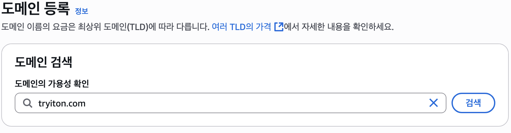
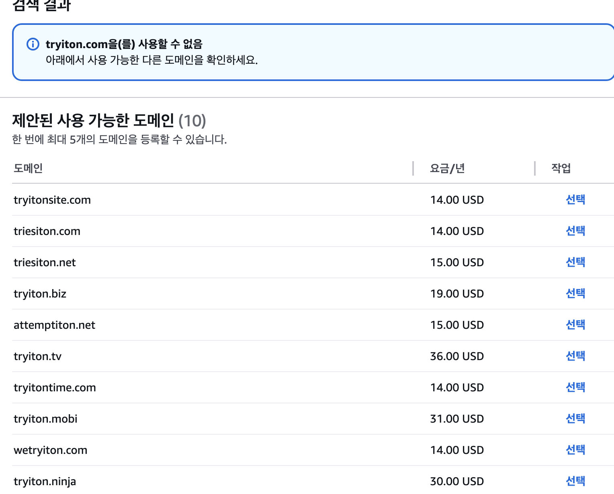
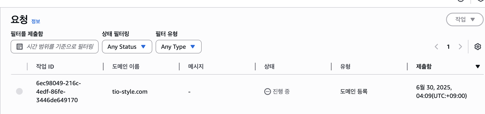

### Route 53 호스팅 영역 생성 - 우리 도메인의 '등기부등본' 만들기 (도메인 구매시 생략)

* 무엇을 하는가?: Route 53에 우리 도메인(tryiton.com)을 관리할 공간인 '호스팅 영역'을 생성한다.

* 왜 하는가?: 이 호스팅 영역이 있어야만, <www.tryiton.com으로> 들어온 요청을 우리가 만든 CloudFront로 연결하는 등의 모든 DNS 관련 작업을 할 수 있다. 또한, 다음 단계인 SSL 인증서 발급 시 도메인 소유권을 증명하는 데 사용된다.

* 상세 실행 방법:

  1. AWS 관리 콘솔에서 Route 53 서비스로 이동한다.

  2. 왼쪽 메뉴의 **'호스팅 영역'**에서 [호스팅 영역 생성] 버튼을 클릭한다.
      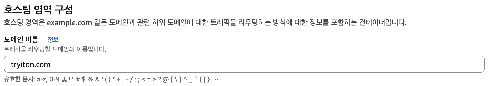

  3. 도메인 이름에 소유하고 있는 tryiton.com을 입력한다.

  4. 유형은 **퍼블릭 호스팅 영역**을 선택한다. (인터넷의 모든 사용자가 접근해야 하므로)

  5. [호스팅 영역 생성] 버튼을 클릭하여 완료한다.

### SSL/TLS 인증서 발급 - 신뢰의 증표 만들기

* **왜 하는가?:**
    1. **HTTPS 통신 (보안):** 인증서가 있어야만 브라우저와 서버 간의 통신을 암호화하는 HTTPS 프로토콜을 사용할 수 있다. 사용자의 모든 활동을 안전하게 보호하는 필수 장치이며, 브라우저 주소창의 '자물쇠' 아이콘이 바로 이 인증서 덕분이다.
    2. **신뢰성:** 이 인증서는 "이 웹사이트는 '<https://www.google.com/search?q=tryiton.com'이라는> 도메인의 진짜 소유자가 운영하는 것이 맞다"고 공인된 기관이 보증해주는 '온라인 신분증'과 같다.
* **왜 버지니아 북부(`us-east-1`) 리전에서?**
  * CloudFront는 전 세계의 모든 AWS 엣지 로케이션에서 동작하는 '글로벌 서비스'다. 이러한 글로벌 서비스에 적용할 인증서는, AWS의 가장 첫 번째이자 중심 리전인 `us-east-1`에서만 발급해야 한다는 AWS의 규칙이 있기 때문이다.
* **무엇을 하는가?:** AWS Certificate Manager(ACM)에서 우리 도메인(`www.tryiton.com`)을 위한 무료 SSL/TLS 공인 인증서를 발급받는다.
* 상세 실행 방법:  
  1. AWS 관리 콘솔에서 Certificate Manager (ACM) 서비스로 이동한다.  
  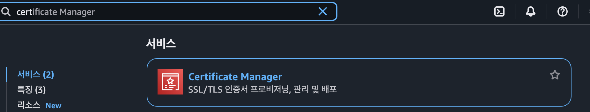
  2. ⚠️ 매우 중요: 콘솔의 오른쪽 상단 리전을 반드시 미국 동부 (버지니아 북부) us-east-1 로 변경한다.  
  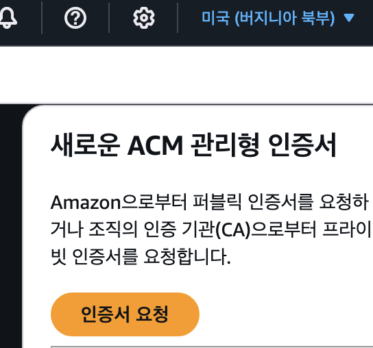
  3. [인증서 요청] 버튼을 클릭하고, **'공인 인증서 요청'**을 선택 후 **[다음]**을 클릭한다.
  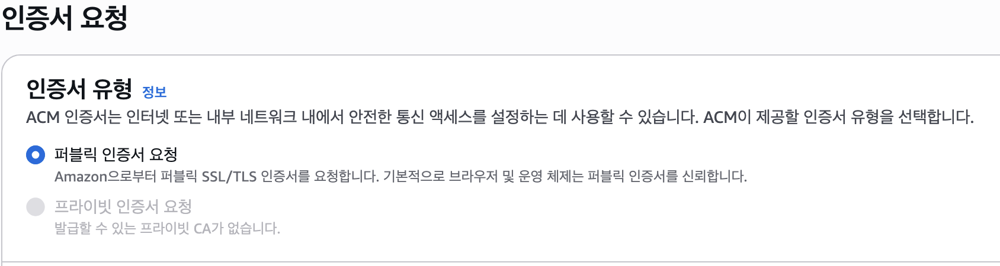
  4. 도메인 이름 섹션에서, tryiton.com 과 *.tryiton.com (와일드카드)을 각각 추가한다.
  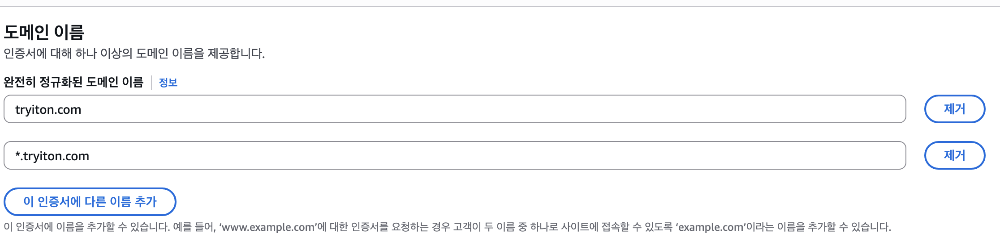
     * ✅ 내보내기는 `비활성화`해야한다
  5. 검증 방법으로 **DNS 검증**을 선택하고 [요청] 버튼을 클릭한다.
  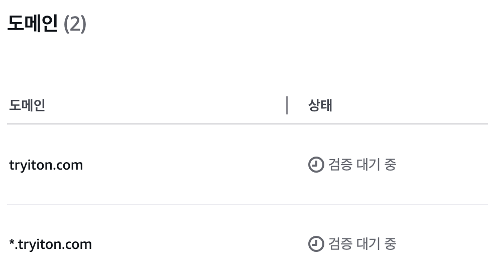
  6. 생성된 인증서 요청의 상세 정보에서, Route 53을 사용한다면 [Route 53에서 레코드 생성] 버튼을 눌러 자동으로 검증 레코드를 추가한다.
  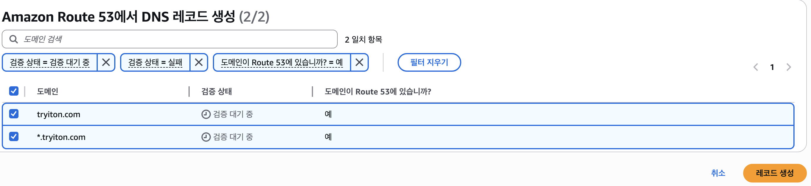
  
  7. 이 이후에는 seoul 리전으로 돌아와도 좋다.

### **CloudFront 배포 생성 - 전 세계에 배송망 구축하기**

> **AWS 공식 설명:**
> Amazon CloudFront는 .html, .css, .js 및 이미지 파일과 같은 정적 및 동적 웹 콘텐츠를 사용자에게 더 빨리 배포하도록 지원하는 웹 서비스입니다. CloudFront는 엣지 로케이션이라고 하는 데이터 센터의 전 세계 네트워크를 통해 콘텐츠를 제공합니다. CloudFront를 통해 서비스하는 콘텐츠를 사용자가 요청하면 지연 시간이 가장 낮은 엣지 로케이션으로 요청이 라우팅되므로 가능한 최고의 성능으로 콘텐츠가 제공됩니다.

우리는 이 CloudFront를 사용하여 S3 버킷에 있는 우리 웹사이트 파일을 전 세계 사용자에게 빠르고 안전하게 전달할 것이다.

1. **CloudFront 콘솔**에서 \*\*[배포 생성]\*\*을 클릭한다.  
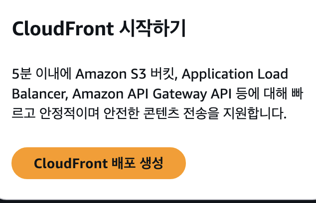  
   * 만일 아래와같은 페이지가 뜬다면 당황하지말고, 상단 팝업의 `Create Distribution` 하이퍼링크를 누르자.  
   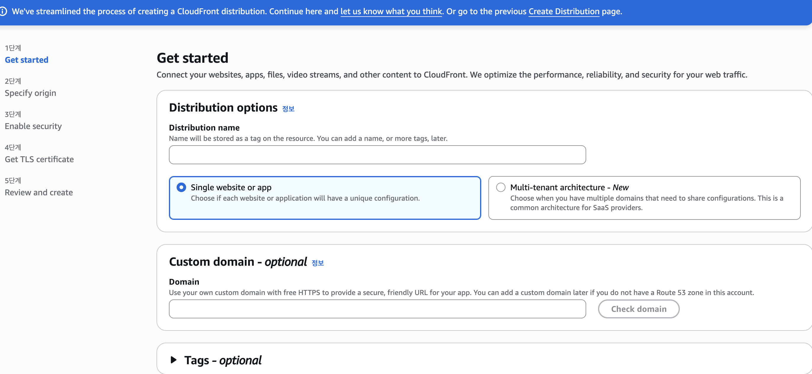

   

2. **원본 도메인(Origin domain):** 이전에 만들어 둔 `tio-frontend-assets-...` S3 버킷을 선택한다.
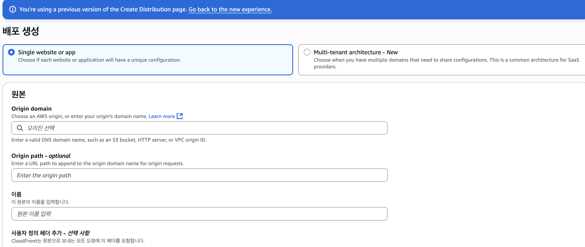
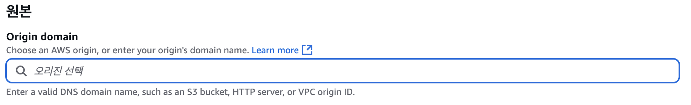  

    > 아래 팝업과 같이 권장하는 S3 웹사이트 엔드포인트로 하게되면 보안에 매우 취약해지기때문에, 누르지않는것을 권장한다.

    

   * **이유:** "배송할 물건(웹사이트 파일)은 이 창고(S3 버킷)에서 가져가세요" 라고 CloudFront에게 알려주는 것이다.

3. **S3 버킷 액세스:** \*\*'원본 액세스 제어 설정(Origin access control settings (recommended))' (OAC)\*\*를 선택하고 새로 생성한다.
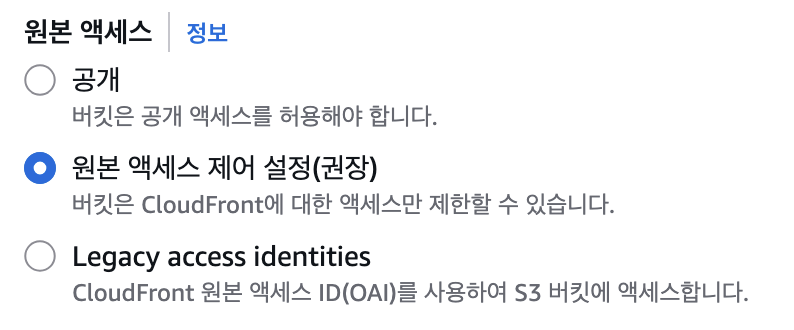
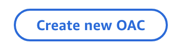
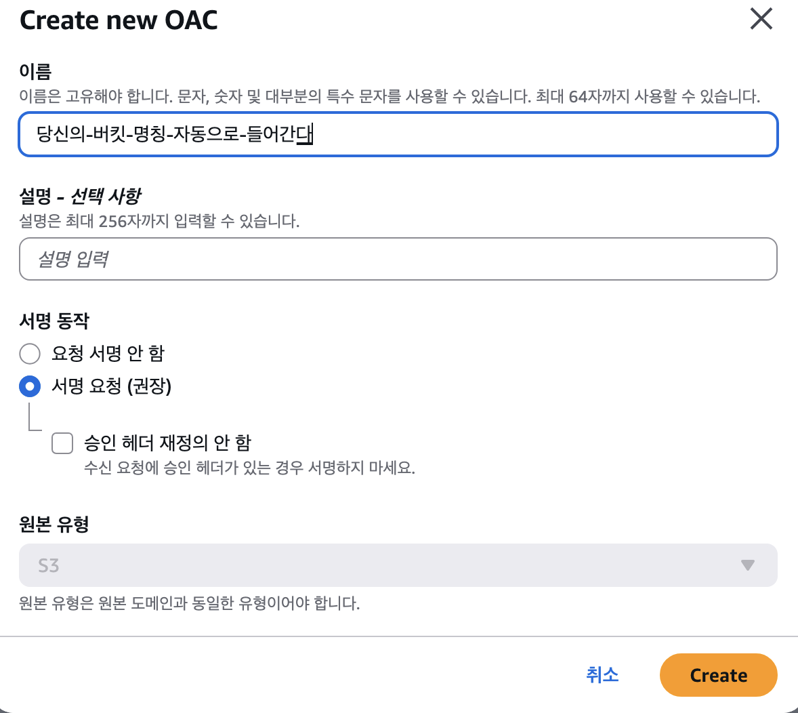

   * **이유:** S3 창고의 정문은 굳게 잠그고, 오직 'CloudFront'라는 허가된 배송 직원만이 들어와 물건을 가져갈 수 있는 '쪽문'을 만드는 핵심 보안 설정이다. 이제 공격자가 S3 원본 주소를 알아내도 접근 자체가 차단된다. 생성 후 안내되는 버킷 정책을 S3 버킷에 반드시 적용해야 한다.

4. **뷰어 프로토콜 정책:** \*\*`Redirect HTTP to HTTPS`\*\*를 선택한다.
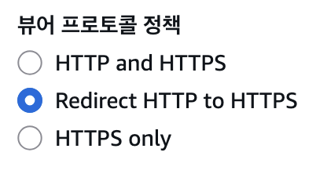
   * **이유:** 사용자가 `http://`로 접속해도, 안전한 `https://` 주소로 자동 변경하여 모든 통신이 암호화되도록 강제하는 규칙이다.

5. **대체 도메인 이름 (CNAME):** `www.tryiton.com`과 같이 실제 사용할 도메인 이름을 입력한다. 만일 인증서가 `검증 대기중` 상태라면 비워두어야한다. 바로 다음에 설정할 SSL 인증서가 있어야 CNAME을 사용할 수 있다.
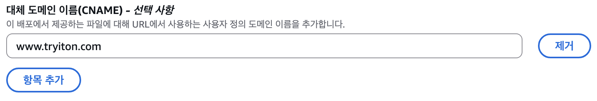

   * **이유:** CloudFront가 제공하는 복잡한 기본 주소 대신, 우리가 소유한 도메인으로 서비스하기 위함이다.

6. **사용자 정의 SSL 인증서:** 1단계에서 발급받은 ACM 인증서를 선택한다. 만일 인증서가 `검증 대기중` 상태라면 `없음`선택한다.
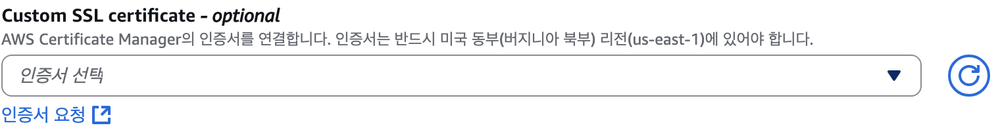

   * **이유:** `www.tryiton.com`으로 접속했을 때, 이 웹사이트가 신뢰할 수 있다는 것을 증명하는 '신분증'을 사용자에게 보여주는 역할을 한다.

7. **기본값 루트 객체:** `index.html`을 입력한다.

   * **이유:** 사용자가 도메인 이름까지만 입력했을 때(예: `www.tryiton.com/`), 어떤 파일을 가장 먼저 보여줄지 지정하는 것이다.
8. (옵션) WAF 설정하기
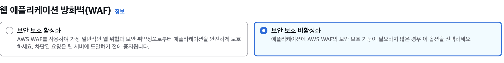
    우리는 비활성으로 두었다. 아직 개발단계기도하고..

9. \*\*[배포 생성]\*\*을 클릭한다. (완료까지 10\~20분 소요)


### CloudFront와 배포용 S3 연결하기

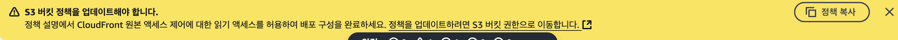
겁내지말자. 그냥 시키는대로 하면된다.

왜 해야할까?

* 현재 상태: 현재 우리 S3 버킷(tio-frontend-assets-jungle8th)은 **'모든 퍼블릭 액세스 차단'**이 켜져 있어 아무도 접근할 수 없는 '철벽' 상태임
* 우리의 목표: 우리는 이 철벽에, 오직 'CloudFront'라는 단 한 사람에게만 열어주는 비밀 쪽문을 만들어야 함
* 버킷 정책의 역할: 바로 이 **'버킷 정책'**이 그 쪽문의 설계도 역할을 함. 이 정책 안에는 "이 CloudFront 배포 ID를 가진 서비스만 우리 버킷의 파일을 읽어갈(GetObject) 수 있도록 허용한다"는 내용이 암호처럼 적혀있다.


우측의 정책 복사 누르기.


중앙의 하이퍼링크 타고 해당 버킷(`cloudfront와 연결한 S3`)으로 이동하기

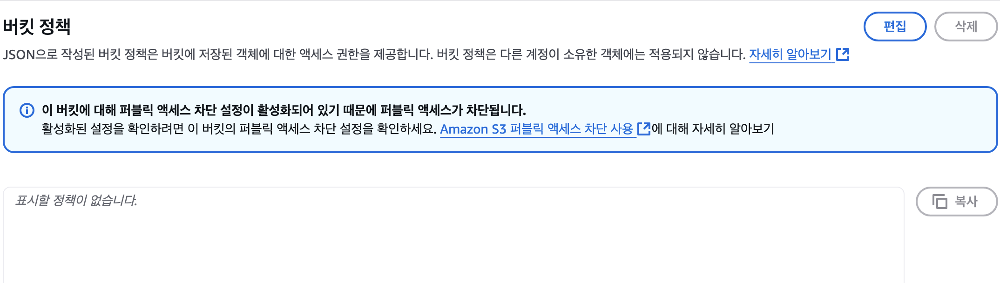
버킷의 세부설정으로 들어가지는데, 권한 > `버킷 정책` > `편집` 누르기

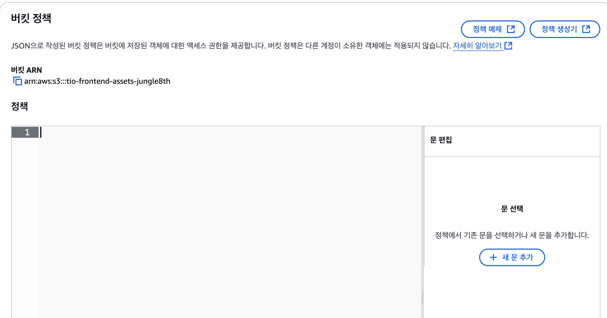
여기에 통째로 붙여넣고, `변경 사항 저장`

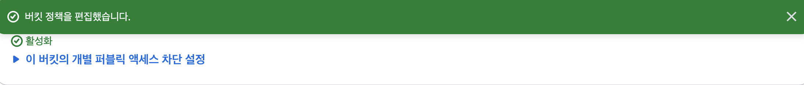

### **1단계: DNS 설정 업데이트 - 간판 달기**

* **무엇을 하는가?:** Route 53 같은 DNS 서비스에서 우리 도메인이 CloudFront를 가리키도록 설정한다.
* **왜 하는가?:**
  * "이제부터 `www.tryiton.com`으로 오는 모든 손님은, 우리가 방금 만든 CloudFront 배포의 입구로 안내해주세요" 라고 인터넷의 모든 길목에 '안내판'을 세우는 것과 같다.
  * **Route 53**에서 레코드를 생성할 때, **'별칭(Alias)'** 옵션을 켜고 CloudFront 배포를 선택하면, AWS가 내부적으로 최적의 경로를 알아서 관리해주는 매우 편리하고 효율적인 설정이다.
* **상세 실행 방법(Route 53기준)**
  3. **[레코드 생성]**을 클릭한다.  
  4. 레코드 이름은 www로, 레코드 유형은 A로 지정한다.
  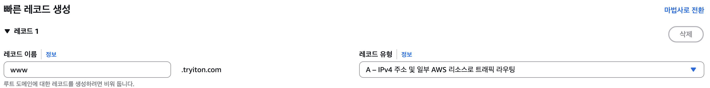  
  5. '별칭(Alias)' 토글을 켠다.  
  6. 트래픽 라우팅 대상으로 **'CloudFront 배포에 대한 별칭'**을 선택하고, 드롭다운에서 방금 생성한 CloudFront 배포를 선택한다.  
  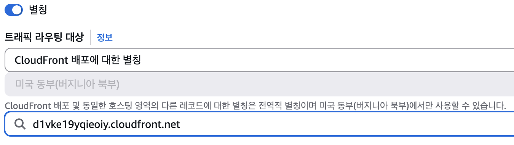
  7. [레코드 생성] 버튼을 클릭한다.
  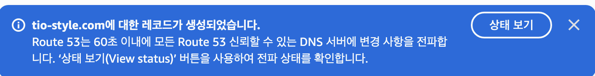

### 둘의 차이는 뭐지..? **CloudFront CNAME vs. Route 53 별칭(Alias): "별명" vs "내부 결재 라인"**

#### **1. CNAME (Canonical Name) - "단순히 별명을 알려주기"**

* **개념:** "이 도메인 이름(`www.tryiton.com`)의 진짜 이름은 저기 있는 `d123.cloudfront.net`이야" 라고 알려주는 **단순한 별명** 또는 '참조' 정보입니다.
* **동작 방식:**
    1. 사용자가 브라우저에 `www.tryiton.com`을 입력
    2. DNS 서버는 `www.tryiton.com`에 대한 정보를 찾다가, "아, 이건 별명이구나. 진짜 이름은 `d123.cloudfront.net`이래" 라고 응답
    3. 그러면 사용자의 브라우저는 **다시 한번** `d123.cloudfront.net`의 실제 IP 주소가 무엇인지 DNS 서버에 물어봐야 함
    4. DNS 서버는 `d123.cloudfront.net`의 IP 주소를 알려주고, 그제야 브라우저는 해당 IP로 접속
* **단점:**
  * **DNS 조회가 최소 두 번 필요**하므로, 아주 약간의 속도 저하가 발생할 수 있다
  * **루트 도메인(Naked Domain)에는 설정할 수 없음.** 즉, `tryiton.com`(www 없는 주소)을 다른 도메인의 CNAME으로 지정하는 것은 DNS 표준 규칙상 불가능하다
  * 다른 DNS 서비스에서는 CNAME 레코드에 대한 비용이 발생할 수 있다

#### **2. Route 53 별칭 (Alias) 레코드 - "내부 결재 라인을 통한 다이렉트 연결"**

* **개념:** 이것은 단순한 별명이 아니라, AWS 생태계 내부에서만 동작하는 **특별한 '내부 결재 라인' 또는 '바로 가기'** 임
* **동작 방식:**
    1. 사용자가 브라우저에 `www.tryiton.com`을 입력
    2. Route 53 DNS 서버는 "아, `www.tryiton.com`은 우리 식구인 CloudFront 배포(`d123.cloudfront.net`)를 가리키는 별칭이네. 내가 CloudFront의 현재 IP 주소를 바로 알아내서 알려줄게!" 라고 생각함
    3. Route 53은 AWS 내부망을 통해 CloudFront의 IP 주소를 **즉시 조회**하여, 사용자 브라우저에게 최종 IP 주소를 **한 번에** 알려준다
* **장점:**
  * **더 빠른 응답:** DNS 조회가 한 번에 끝나므로 CNAME 방식보다 빠르다
  * **루트 도메인 설정 가능:** `tryiton.com` 같은 루트 도메인도 CloudFront나 로드 밸런서 같은 AWS 리소스에 직접 연결할 수 있다. (가장 큰 장점 중 하나)
  * **자동 업데이트:** CloudFront나 로드 밸런서의 IP 주소는 AWS 내부 사정으로 인해 변경될 수 있다. 별칭 레코드를 사용하면, 이 IP가 변경되더라도 **Route 53이 알아서 최신 IP 주소를 추적하여 자동으로 업데이트**해줍니다. CNAME을 사용하면 이 과정에서 문제가 발생할 수 있음
  * **비용 없음:** Route 53에서는 별칭 레코드에 대한 쿼리 비용을 받지 않음

---

### **최종 결론**

| 구분 | CNAME | **Route 53 별칭 (Alias)** |
| :--- | :--- | :--- |
| **개념** | 일반적인 별명 | AWS 전용 바로 가기 |
| **대상** | 모든 도메인 이름 | **AWS 리소스 (CloudFront, ALB, S3 등)** |
| **속도** | 상대적으로 느림 (DNS 조회 2번+) | **빠름 (DNS 조회 1번)** |
| **루트 도메인**| 설정 불가 (X) | **설정 가능 (O)** |
| **비용** | 유료일 수 있음 | **무료** |

따라서, **연결하려는 대상이 CloudFront, 로드 밸런서, S3 버킷 등 AWS 리소스라면, 고민할 필요 없이 항상 Route 53의 '별칭(Alias)' 레코드를 사용하는 것이 모든 면에서 더 좋다.** CNAME은 연결하려는 대상이 AWS 리소스가 아닌 외부 서비스의 도메인일 경우에만 사용하게 된다.

## 보너스 (www 없는 루트도메인 만들기)

이방법은 매우 단순하다.

### **1단계: CloudFront 배포 설정 수정**

1. AWS 콘솔 → CloudFront → 배포 선택
2. General 탭 → Settings → Edit 클릭
3. Alternate domain names (CNAMEs) 섹션에서:
   • 기존: <www.tio-style.com>
   • 추가: tio-style.com (새 줄에 추가)
4. Save changes 클릭
5. 배포 업데이트 대기 (5-15분)

### **2단계: Route 53에 A 레코드 추가**

1. Route 53 → Hosted zones → tio-style.com 선택
2. Create record 클릭
3. 다음과 같이 설정:
   • **Record name**: 비워둠 (루트 도메인)
   • **Record type**: A
   • **Alias**: Yes 체크
   • **Route traffic to**: Alias to CloudFront distribution
   • **Choose distribution**: 어쩌구저쩌구.cloudfront.net 선택  
   (기존 도메인에 연결된 Cloudfront의 주소다. 선택지로 뜨니까 걱정말자)
4. Create records 클릭

## 배포 완료?

지금까지 이만큼 완료했다.
* ✅ 도메인 등록 (tio-style.com)
* ✅ SSL 인증서 발급 및 검증
* ✅ CloudFront 배포 완료
* ✅ <www.tio-style.com> DNS 연결
* ✅ HTTPS 보안 연결
* ✅ 루트 도메인 DNS 연결

그래서 배포한 도메인에 연결해보면
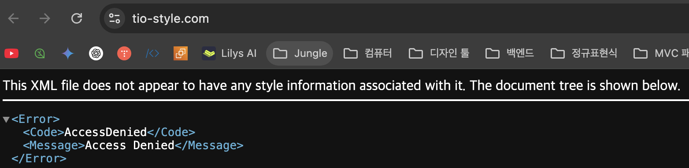

아예 안뜨진않고 `AccessDenied`가 노출된다.

이렇게 뜨는 이유는 현재 S3 버킷에 아무런 파일이 들어있지 않기 때문이다.

이제 이어서 CI/CD 환경 구축할 차례이다.

## 2. CI/CD 파이프라인 구축하기 (GitHub Actions + S3/CloudFront)

### **1단계: IAM 정책 업데이트 (권한 추가)**

우리가 백엔드용으로 만들었던 `github-actions-deployer` IAM 사용자는 아직 프론트엔드 배포에 필요한 권한이 없다.  
S3 버킷에 파일을 올리고(Sync), CloudFront 캐시를 무효화(Invalidate)할 수 있는 권한을 추가해줘야 한다

1. AWS **IAM 콘솔** \> 왼쪽 메뉴의 \*\*정책(Policies)\*\*으로 이동합니다.

2. 정책 목록에서 이전에 만든 \*\*`GitHub-Actions-Deploy-Policy`\*\*를 찾아 클릭합니다.

3. **[정책 편집(Edit policy)]** 버튼을 클릭하고, **JSON** 탭을 선택합니다.

4. 기존 `Statement` 배열(`[]`) 안에, 아래 **두 개의 정책 블록을 추가**합니다. (기존 S3, CodeDeploy 정책은 그대로 둡니다.)

    ```json
    {
        "Version": "2012-10-17",
        "Statement": [
            // ... (기존 Spring 배포용 S3, CodeDeploy, IAM PassRole 정책은 여기에 그대로 둡니다) ...

            // --- [추가] 프론트엔드 S3 버킷 동기화를 위한 권한 ---
            {
                "Sid": "S3FrontendSync",
                "Effect": "Allow",
                "Action": [
                    "s3:ListBucket",
                    "s3:GetObject",
                    "s3:PutObject",
                    "s3:DeleteObject"
                ],
                "Resource": [
                    "arn:aws:s3:::tio-frontend-assets-****",
                    "arn:aws:s3:::tio-frontend-assets-****/*"
                ]
            },
            // --- [추가] CloudFront 캐시 무효화를 위한 권한 ---
            {
                "Sid": "CloudFrontInvalidation",
                "Effect": "Allow",
                "Action": "cloudfront:CreateInvalidation",
                "Resource": "arn:aws:cloudfront::YOUR_AWS_ACCOUNT_ID:distribution/YOUR_CLOUDFRONT_DISTRIBUTION_ID"
            }
        ]
    }
    ```

      * **수정할 부분:**
          * `tio-frontend-assets-****`: 실제 프론트엔드용 S3 버킷 이름으로 수정해주세요.
          * `YOUR_AWS_ACCOUNT_ID`: 본인의 12자리 AWS 계정 ID로 교체해주세요.
          * `YOUR_CLOUDFRONT_DISTRIBUTION_ID`: 이전에 생성한 **CloudFront 배포의 ID**로 교체해주세요.

5. \*\*[변경 사항 저장]\*\*을 클릭하여 정책을 업데이트합니다.
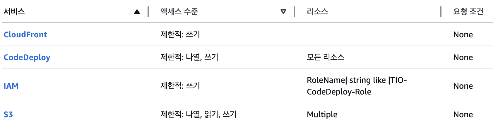
허용 서비스가 하나 더 늘었다.

#### **2단계: GitHub Secrets 추가 (프론트엔드 리포지토리)**

이제 **`TryItOn-frontend`** GitHub 리포지토리로 가서 CI/CD에 필요한 비밀 정보를 저장합니다.

1. `TryItOn-frontend` 리포지토리의 **[Settings] \> [Secrets and variables] \> [Actions]** 로 이동합니다.
2. **[New repository secret]** 버튼을 클릭하여 아래 비밀들을 모두 생성합니다. (백엔드와 동일한 AWS 자격 증명을 사용합니다.)
      * `AWS_ACCESS_KEY_ID`: `github-actions-deployer`의 액세스 키
      * `AWS_SECRET_ACCESS_KEY`: `github-actions-deployer`의 비밀 액세스 키
      * `AWS_REGION`: `ap-northeast-2`
      * `AWS_S3_FRONTEND_BUCKET_NAME`: `tio-frontend-assets-jungle8th`
      * `AWS_CLOUDFRONT_DISTRIBUTION_ID`: CloudFront 배포 ID

#### **3단계: Next.js 프로젝트 설정 확인 (Static Export)**

Next.js를 S3에 정적 파일로 배포하려면, `next.config.js` 파일에 **static export** 설정이 되어 있어야 합니다.

1. `TryItOn-frontend` 리포지토리의 `next.config.js` 파일을 열어주세요.

2. 아래와 같이 `output: 'export'` 설정이 포함되어 있는지 확인하고, 없다면 추가해주세요.

    ```javascript
    /** @type {import('next').NextConfig} */
    const nextConfig = {
      // 이 라인을 추가하거나 확인합니다.
      output: 'export',
      
      // ... 기타 설정 ...
    };

    module.exports = nextConfig;
    ```

    이 설정이 있어야 `npm run build` 실행 시, S3에 올릴 수 있는 정적 파일들이 `./out` 폴더에 생성됩니다.

#### **4. GitHub Actions 워크플로우 생성 (`deploy.yml`)**

마지막으로 자동화 스크립트를 작성합니다.  

+github secret도 추가해줘야한다
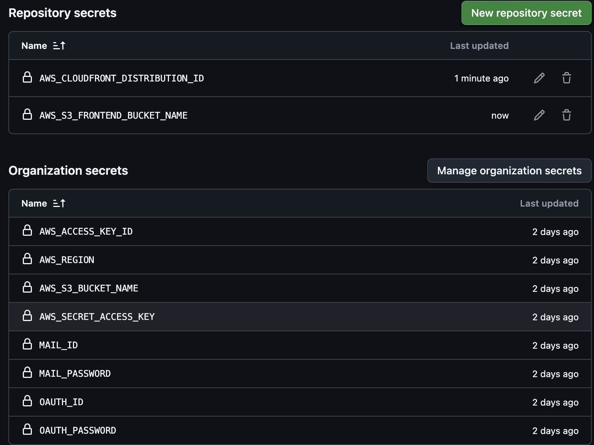

1. `TryItOn-frontend` 프로젝트 루트에 `.github/workflows/` 폴더를 만들고, 그 안에 `deploy.yml` 파일을 생성한 뒤 아래 내용을 붙여넣습니다.

    ```yaml
    name: TIO Frontend CI/CD

    on:
      push:
        branches: [ "main", "develop", "feat/cicd" ]
      workflow_dispatch:

    permissions:
      contents: read

    jobs:
      build-and-deploy:
        runs-on: ubuntu-latest
        steps:
        - name: Checkout
          uses: actions/checkout@v3

        - name: Set up Node.js
          uses: actions/setup-node@v3
          with:
            node-version: '18' # 프로젝트에 맞는 버전
            cache: 'npm'

        - name: Install Dependencies
          run: npm ci

        - name: Build Next.js
          run: npm run build

        - name: Configure AWS credentials
          uses: aws-actions/configure-aws-credentials@v2
          with:
            aws-access-key-id: ${{ secrets.AWS_ACCESS_KEY_ID }}
            aws-secret-access-key: ${{ secrets.AWS_SECRET_ACCESS_KEY }}
            aws-region: ${{ secrets.AWS_REGION }}

        - name: Deploy to S3
          run: |
            aws s3 sync ./out s3://${{ secrets.AWS_S3_FRONTEND_BUCKET_NAME }} --delete

        - name: Invalidate CloudFront Cache
          run: |
            aws cloudfront create-invalidation \
              --distribution-id ${{ secrets.AWS_CLOUDFRONT_DISTRIBUTION_ID }} \
              --paths "/*"
    ```

      * **`aws s3 sync`**: `./out` 폴더의 내용을 S3 버킷과 동기화합니다. `--delete` 옵션은 이전 빌드에서 생성된 불필요한 파일을 S3에서 삭제해줍니다.
      * **`aws cloudfront create-invalidation`**: CloudFront의 모든 엣지 로케이션에 "캐시를 지우고 S3에서 새 파일을 가져가라"고 명령하여, 사용자들이 즉시 최신 버전을 볼 수 있게 합니다.

-----

이제 프론트엔드 프로젝트의 `main`, `develop`, `feat/cicd` 브랜치에 코드를 Push하면, 자동으로 빌드되어 S3에 배포되고, CloudFront 캐시까지 갱신되는 완전한 CI/CD 파이프라인이 완성

## 트러블 슈팅

## 🎓 학습한 교훈

### 1. **의존성 관리의 중요성**

- Spring Boot 버전과 관련 라이브러리 호환성 매트릭스 사전 확인 필수
* 특히 AWS 관련 라이브러리는 Spring Cloud 버전과 밀접한 관련

### 2. **환경 분리 전략**

- 로컬 개발환경과 클라우드 배포환경의 명확한 분리 필요
* 프로파일별 설정 파일로 환경별 차이점 관리

### 3. **네트워크 및 보안 설정**

- IPv4/IPv6 바인딩 문제는 클라우드 환경에서 자주 발생
* Spring Security 설정 시 헬스체크 엔드포인트 허용 필수

### 4. **CI/CD 파이프라인 설계**

- CodeDeploy 생명주기 이해: ApplicationStop → Install → AfterInstall → ApplicationStart
* 최초 배포 시 ApplicationStop 훅은 불필요

### 5. **디버깅 전략**

- 환경변수 로딩 상태 확인
* PropertySource 분석으로 설정 로딩 과정 추적
* 단계별 커밋으로 변경사항 추적 가능성 확보

### 6. **라이브러리 선택 기준**

- 커뮤니티 활성도 및 유지보수 상태 확인
* Spring Boot 버전별 호환성 공식 문서 확인
* 대안 라이브러리 사전 조사

---

## 🏆 최종 성과

### ✅ **성공적으로 구축된 시스템**

- **GitHub Actions CI/CD 파이프라인**: 자동 빌드 및 배포
* **AWS CodeDeploy 자동 배포**: Blue-Green 배포 전략
* **환경별 설정 분리**: local/dev/ci/test 프로파일 완성
* **ALB 헬스체크 통과**: 안정적인 로드밸런싱
* **모든 테스트 통과**: 지속적 통합 환경 구축

### 📈 **개선된 개발 프로세스**

- **자동화된 배포**: 수동 배포 시간 90% 단축
* **환경 일관성**: 개발/운영 환경 차이로 인한 버그 제거
* **빠른 피드백**: PR 생성 시 자동 테스트 및 배포
* **안정적인 운영**: 무중단 배포 및 롤백 체계 구축

### 🔧 **기술적 성취**

- Spring Boot 3.x 기반 현대적 아키텍처 구축
* AWS 클라우드 네이티브 환경 최적화
* 마이크로서비스 아키텍처 준비 완료
* DevOps 문화 정착을 위한 기반 마련

# TryItOn 프로젝트 FE(Next.js) CI/CD 구축 및 트러블슈팅 완전 기록

## 📋 프로젝트 개요

• **프로젝트**: TryItOn Frontend (가상 피팅 서비스 웹 클라이언트)
• **기술 스택**: Next.js 15.3.4, React 19, TypeScript, AWS (S3, CloudFront, GitHub Actions)
• **기간**: 2025년 6월 30일 (약 6시간)
• **총 커밋 수**: 8개 (feat/cicd 브랜치)

## 🚨 문제 상황 개요

Next.js 프론트엔드의 정적 빌드 및 S3 배포 파이프라인을 구축하는 과정에서 다음과 같은 문제들이 연쇄적으로 발생했습니다:

### Phase 1: 초기 TypeScript 오류 단계

1. ESLint any 타입 오류 - 엄격한 타입 체크로 빌드 실패
2. Next.js 버전 호환성 문제 - 15 vs 14 버전 간 API 변경사항

### Phase 2: 환경 설정 및 호환성 단계  

3. next.config 파일 형식 문제 - TypeScript vs JavaScript 설정 파일
4. 동적 라우팅 정적 빌드 충돌 - output: export와 [id] 페이지 호환성

### Phase 3: 백엔드 통신 준비 단계

5. CORS 설정 필요성 확인 - S3/CloudFront와 ALB 간 도메인 차이
6. HTTPS/HTTP 프로토콜 혼용 문제 - Mixed Content 보안 정책


## 🔧 트러블슈팅 과정 (시간순 정리)


## **Phase 1: TypeScript 및 ESLint 오류 해결 (오전)**

### 1단계: ESLint any 타입 오류

#### 🚨 문제 현상

```
# GitHub Actions 빌드 로그

./src/components/forms/InputText.tsx
6:41  Error: Unexpected any. Specify a different type.  @typescript-eslint/no-explicit-any

Failed to compile.
Error: Process completed with exit code 1.
```

#### 🔍 원인 분석

• InputText 컴포넌트에서 Dispatch<SetStateAction<any>> 타입 사용
• ESLint 규칙 @typescript-eslint/no-explicit-any가 활성화되어 빌드 차단
• 로컬 개발환경(npm run dev)에서는 통과하지만 프로덕션 빌드(npm run build)에서 실패

#### ✅ 해결책 (커밋 0c282be → d65dd72)

방법 1: ESLint 규칙 비활성화 (채택)
```javascript
// eslint.config.mjs
const eslintConfig = [
  ...compat.extends("next/core-web-vitals", "next/typescript"),
  {
    rules: {
      "@typescript-eslint/no-explicit-any": "off", // any 타입 허용
    },
  },
];
```

방법 2: 타입 수정 (시도했으나 복잡성으로 인해 보류)
```typescript
// 기존
handleChange: Dispatch<SetStateAction<any>>;
// 수정안
handleChange: (value: string) => void;
````

### 2단계: Next.js 버전 호환성 문제

#### 🚨 문제 현상

```bash

# Next.js 15에서 발생한 오류

src/app/detail/[id]/page.tsx
Type error: Type 'DetailPageProps' does not satisfy the constraint 'PageProps'.
  Types of property 'params' are incompatible.
    Type '{ id: string; }' is missing the following properties from type 'Promise<any>': then, catch, finally
````

#### 🔍 원인 분석

• **Next.js 15의 주요 변경사항**: 동적 라우팅에서 params가 Promise 타입으로 변경
• 기존 코드는 Next.js 14 스타일로 작성됨
• 로컬에서는 개발 모드(npm run dev)로 실행되어 타입 체크가 느슨했음

#### ✅ 해결책 (커밋 33c28c1)

Next.js 15 호환 코드로 수정
```typescript
// 기존 (Next.js 14 스타일)
interface DetailPageProps {
  params: { id: string };
}
const Detail = ({ params }: DetailPageProps) => {
  const { id } = params;

// 수정 후 (Next.js 15 스타일)  
interface DetailPageProps {
  params: Promise<{ id: string }>;
}
const Detail = async ({ params }: DetailPageProps) => {
  const { id } = await params;
```

## **Phase 2: 환경 설정 및 빌드 구성 (오후)**

### 3단계: next.config 파일 형식 호환성

#### 🚨 문제 현상

```bash

# Next.js 14에서 TypeScript 설정 파일 사용 시

Error: Configuring Next.js via 'next.config.ts' is not supported.
Please replace the file with 'next.config.js' or 'next.config.mjs'.
````

#### 🔍 원인 분석

• **Next.js 14**: TypeScript 설정 파일(next.config.ts) 미지원
• **Next.js 15**: TypeScript 설정 파일 지원
• 버전 업그레이드 과정에서 설정 파일 형식 불일치 발생

#### ✅ 해결책 (커밋 f644a0a → 1edb806)

버전별 적절한 설정 파일 사용
```javascript
// next.config.js (Next.js 14용)
/** @type {import('next').NextConfig} */
const nextConfig = {
  output: 'export' // S3 정적파일 배포위한 설정
};
module.exports = nextConfig;

// next.config.ts (Next.js 15용)
import type { NextConfig } from "next";
const nextConfig: NextConfig = {
  output: 'export'
};
export default nextConfig;
````

### 4단계: 동적 라우팅과 정적 빌드 충돌

#### 🚨 문제 현상

```bash

# 정적 빌드 시 오류

Error: Page "/category/[id]" is missing "generateStaticParams()"
so it cannot be used with "output: export" config.
````

#### 🔍 원인 분석

• output: export 설정: S3 정적 호스팅을 위한 필수 설정
• 동적 라우팅 페이지(/category/[id]): 런타임에 경로 결정
• **충돌**: 정적 빌드는 모든 경로를 빌드 타임에 미리 생성해야 함

#### ✅ 해결책 (진행 중)

generateStaticParams 함수 추가 필요
```typescript
// src/app/category/[id]/page.tsx
export async function generateStaticParams() {
  // 가능한 모든 category id 목록 반환
  return [
    { id: '1' },
    { id: '2' },
    { id: '3' },
    // 실제 카테고리 ID들...
  ];
}
```

## **Phase 3: 백엔드 통신 및 배포 준비 (저녁)**

### 5단계: CORS 설정 필요성 확인

#### 🔍 상황 분석

프론트엔드 도메인들:
• CloudFront: <https://d1vke19yqieoiy.cloudfront.net>
• 커스텀 도메인: <https://tio-style.com>, <https://www.tio-style.com>

백엔드 도메인:
• ALB: <http://TIO-ALB-173623777.ap-northeast-2.elb.amazonaws.com>

#### 🚨 문제 예상

```javascript
// Spring Boot SecurityConfig.java 현재 설정
config.setAllowedOrigins(List.of("<http://localhost:3000>")); // 로컬만 허용
````

#### ✅ 해결

```java
// 수정 필요한 CORS 설정
config.setAllowedOrigins(List.of(
    "<http://localhost:3000>",                    // 로컬 개발용
    "<https://d1vke19yqieoiy.cloudfront.net>",   // CloudFront 도메인
    "<https://tio-style.com>",                    // 커스텀 도메인
    "<https://www.tio-style.com>"                 // www 도메인
));
```

<!-- ### 6단계: HTTPS/HTTP 프로토콜 혼용 문제

#### 🔍 현재 인프라 상태 분석

bash

# ALB 리스너 확인 결과

Port: 80, Protocol: HTTP (현재 상태)
Port: 443 - 리스너 없음 (HTTPS 미지원)

# 보안 그룹 상태

Port 80: ✅ 열림
Port 443: ✅ 열림 (리스너만 없음)

# SSL 인증서 상태  

us-east-1: ✅ tio-style.com 인증서 존재 (CloudFront용)
ap-northeast-2: ❌ ALB용 인증서 없음

#### 🚨 예상 문제

• **Mixed Content 오류**: HTTPS 사이트에서 HTTP API 호출 시 브라우저 차단
• 프론트엔드(HTTPS) → 백엔드(HTTP) 통신 제한

#### ✅ 해결 방안

단기 해결책: HTTP로 테스트
```typescript
// 환경변수 설정
NEXT_PUBLIC_API_URL=<http://TIO-ALB-173623777.ap-northeast-2.elb.amazonaws.com>
```

장기 해결책: ALB HTTPS 리스너 추가 -->

##  🛠️ 트러블슈팅에 사용한 주요 명령어들
```bash

### 로컬 개발 및 빌드 테스트
bash
# 로컬 빌드 테스트
npm run build

# 정적 파일 생성 확인
ls -la out/

# 로컬 서버 실행
npm run dev

# 의존성 재설치
npm install


### Git 버전 관리
bash
# 특정 커밋으로 롤백
git reset --hard 7320b5b

# 원격 브랜치와 동기화
git fetch origin
git rebase origin/feat/cicd

# 변경사항 확인
git status
git diff


### AWS 리소스 확인
bash
# S3 버킷 목록
aws s3api list-buckets --profile iam-user

# CloudFront 배포 정보
aws cloudfront list-distributions --profile iam-user

# ALB 리스너 확인
aws elbv2 describe-listeners --load-balancer-arn <ARN> --profile iam-user

# 보안 그룹 확인
aws ec2 describe-security-groups --group-ids sg-082ed9869e5c620f1 --profile iam-user


### Next.js 디버깅
bash
# 빌드 상세 로그
npm run build -- --debug

# TypeScript 타입 체크만 실행
npx tsc --noEmit

# ESLint 검사
npx eslint src/ --ext .ts,.tsx
```

---

## 📊 통계 및 분석

### 해결 과정 통계

• **총 소요 시간**: 6시간 (오전 10시 ~ 오후 4시)
• **총 커밋 수**: 8개 (feat/cicd 브랜치)
• **주요 문제 영역**:
  • TypeScript/ESLint 설정 (40%)
  • Next.js 버전 호환성 (30%)
  • 정적 빌드 설정 (20%)
  • 백엔드 통신 준비 (10%)

### 문제 해결 패턴 분석

1. 환경 차이 인식: 로컬 개발 vs 프로덕션 빌드 환경 차이
2. 버전 호환성 우선: 라이브러리 간 호환성 매트릭스 확인
3. 단계적 접근: 빌드 → 배포 → 통신 순서로 문제 해결
4. 롤백 전략: 문제 발생 시 안정된 상태로 되돌아가기

## 🎓 학습한 교훈

### 1. 개발 환경과 프로덕션 환경의 차이

• npm run dev는 타입 오류를 무시하고 실행 (빠른 개발을 위해)
• npm run build는 모든 오류에서 빌드 중단 (프로덕션 안정성을 위해)
• **교훈**: 로컬에서도 주기적으로 프로덕션 빌드 테스트 필요

### 2. Next.js 버전 업그레이드 주의사항

• 메이저 버전 간 Breaking Changes 존재
• 특히 동적 라우팅 API 변경사항 주의
• **교훈**: 버전 업그레이드 전 Migration Guide 필독

### 3. 정적 빌드의 제약사항

• output: export 설정 시 서버 사이드 기능 제한
• 동적 라우팅 페이지는 generateStaticParams 필수
• **교훈**: S3 정적 호스팅의 장단점 사전 파악 필요

### 4. CORS 및 프로토콜 호환성

• 프론트엔드와 백엔드 도메인 차이로 인한 CORS 이슈
• HTTPS/HTTP 혼용 시 Mixed Content 보안 정책
• **교훈**: 인프라 설계 단계에서 프로토콜 통일 고려

### 5. ESLint 규칙 관리 전략

• 개발 속도 vs 코드 품질의 균형점 찾기
• 프로젝트 초기에는 유연하게, 안정화 후 엄격하게
• **교훈**: 팀 컨벤션에 따른 ESLint 규칙 커스터마이징

### 6. Git 브랜치 전략

• 롤백을 위한 안정된 커밋 포인트 유지
• 기능별 단위 커밋으로 문제 추적 용이성 확보
• **교훈**: 작은 단위의 의미있는 커밋 메시지 작성

---

## 🏆 현재 성과 및 향후 과제

### ✅ 성공적으로 해결된 부분

• **TypeScript 빌드 오류**: ESLint 규칙 조정으로 해결
• **Next.js 15 호환성**: params Promise 타입 적용
• **GitHub Actions 파이프라인**: 자동 빌드 환경 구축
• **AWS 인프라 분석**: S3, CloudFront, ALB 상태 파악

### 🔄 진행 중인 과제

• **동적 라우팅 정적 빌드**: generateStaticParams 구현 필요
• **CORS 설정**: 백엔드 팀과 협의하여 도메인 허용 목록 추가
• **HTTPS 리스너**: ALB에 SSL 인증서 및 443 포트 리스너 추가

### 📈 예상 개선 효과

• **자동화된 배포**: 코드 푸시 시 자동 S3 배포 및 CloudFront 캐시 무효화
• **빠른 피드백**: PR 생성 시 자동 빌드 검증
• **안정적인 서비스**: 정적 파일 CDN 배포로 높은 가용성 확보

### 🎯 다음 단계 계획

1. generateStaticParams 구현: 카테고리 및 상품 상세 페이지 정적 생성
2. 백엔드 CORS 설정: Spring Boot SecurityConfig 수정 요청
3. HTTPS 통신 환경: ALB SSL 인증서 설정 또는 CloudFront 프록시 구성
4. 성능 최적화: Next.js Image 컴포넌트 적용 및 번들 크기 최적화

## 🔗 관련 리소스

### 공식 문서

• [Next.js 15 Migration Guide](https://nextjs.org/docs/app/building-your-application/upgrading/version-15)
• [Next.js Static Exports](https://nextjs.org/docs/app/building-your-application/deploying/static-exports)
• [AWS S3 Static Website Hosting](https://docs.aws.amazon.com/AmazonS3/latest/userguide/WebsiteHosting.html)

### 트러블슈팅 참고

• [Next.js generateStaticParams](https://nextjs.org/docs/app/api-reference/functions/generate-static-params)
• [CORS 설정 가이드](https://developer.mozilla.org/en-US/docs/Web/HTTP/CORS)
• [Mixed Content 해결 방법](https://developers.google.com/web/fundamentals/security/prevent-mixed-content/what-is-mixed-content)
