# 환경설정 (AWS 서버편 - VPC, EC2, RDS, S3)

우리 팀은 FE : Next.js, : Spring과 마이크로 서비스를 위한 Node.js, 그리고 FitDit 활용을 위한 Python FAST API를 계획했다.  
먼저 회의를 통해일정이 빠듯한 점을 감안하여, 이번주 금요일 까지 백엔드까지 완성하기로 했다.

## VPC 생성

### VPC는 Virtual Private Cloud로

사용자가 정의한 가상 네트워크를 설정해 주는 것이다. 일종의 클라우드(AWS 전체 시스템) 내의 클라우드(VPC) 정도로 이해하는게 정신건강에 좋다.

가용영역(AZ)과 퍼블릭 서브넷 / 프라이빗 서브넷은 각각 2로 설정한다.
> 고가용성과 장애 내구성을 위해 여러 가용영역에 걸쳐 리소스를 배포하는 것이 모범사례라고 한다.

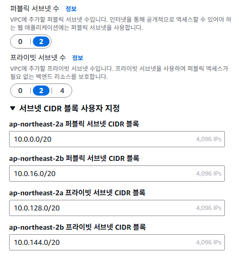
이 결과 4개의 서브넷이 생성됨.  
`public : ap-northeast-2a, ap-northeast-2b`  
`private : ap-northeast-2a, ap-northeast-2b`

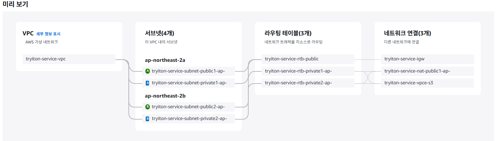

**외부로 연결해주는 사진 넣기**

### NAT 게이트웨이는

Private Subnet의 컨테이너가 외부 인터넷으로 패치를 다운로드하거나 API를 호출(Outbound)할 수는 있지만, 외부에서 Private Subnet으로 직접 들어올(Inbound) 수는 없게 만드는 "일방향" 출구 역할을 한다.  
일반적으로 내부의 EC2가 외부의 S3 bucket으로 접근할 때 사용된다.

다른 반대되는 개념으로는 **인터넷 게이트웨이**가 있다

### 인터넷 게이트웨이


VPC와 인터넷을 연결하는 관문. 마법사가 생성하여 VPC에 연결해줌


우리의 서비스 규모 등을 생각했을 때 1개만 생성해주는게 좋다.

### 엔드포인트
>
> AWS TIP: VPC 엔드포인트는 AWS 네트워크 내부의 통신이며 엔드포인트를 통해 트래픽을 제어할 수 있는 보안 및 규정 준수 이점이 있습니다.  
> 또한 NAT 게이트웨이가 아닌 VPC 엔드포인트를 통해 데이터를 전송하면 데이터 처리 비용을 최적화할 수 있습니다.  

엔드포인트를 S3게이트웨이로 선택한다.  
엔드포인트는 프라이빗 서브넷의 컨테이너가 S3 저장 이미지 읽고 쓰기를 할때 필요한 경로로

**없음**일 때
`PRIVATE SUBNET EC2` -> `NAT 게이트웨이` -> `인터넷` -> `S3`

이렇게되면 모든 트래픽 경로가 길어질 경우 NAT 게이트웨이 데이터 `처리비용`이 발생하고,  
암호화되어있지만 `공용 인터넷`을 통해 `보안`문제가 발생 할 수 있음  
또한 인터넷을 경유하므로 `성능 저하`도 발생할 수 있다.

**엔드포인트를 설정할 경우**
`Private Subnet의 ECS 컨테이너` → `라우팅 테이블의 S3 엔드포인트 경로` → `S3 서비스 (AWS 내부망)`

장점은 엔드포인트가 없는 상태의 모든 반대이다.

#### Q. 그렇다면 연결할 S3는 먼저 만들어줘야하나?

A. 독립적인 서비스이므로 순서는 중요치 않고, 이후 라우팅 테이블 구성때 경로를 설정해 주면된다.

#### Q. VPC 설정할때 만들지 못했으면 어떻게하지?

<https://catalog.us-east-1.prod.workshops.aws/workshops/869a0a06-1f98-4e19-b5ac-cbb1abdfc041/ko-KR/advanced-modules/network/20-index>

VPC 콘솔의 PrivateLink 및 Lattice에서 `엔드포인트`에서 직접 생성해도된다.

## VPC 생성완료


이 페이지로 넘어와서 기다리다보면.. VPC가 생성된다. 생각보다 꽤 시간이 걸린다. 한 3분정도 기다리면 모든 항목이 녹색으로 표시된다.
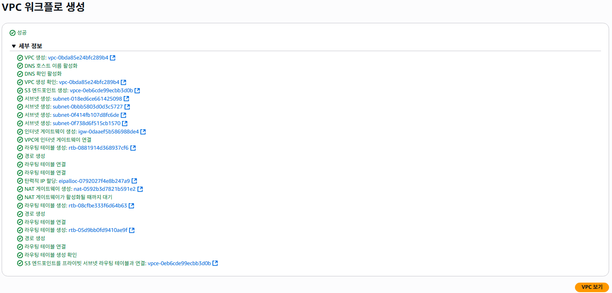

현재까지 구성된 상태는 아래와 같다.  

> 출처 : AWS workshop studio  

## 보안그룹(sg, security group) 생성

이제 우리의 공간(VPC 등), 을 지키기위해 방화벽을 설정하는 과정으로, 총 3개의 보안 그룹을 생성해야한다. `로드 밸런서(ALB)용 보안 그룹`, `EC2 서비스용 보안 그룹`, `DB용`

EC2 콘솔의 > 보안 그룹 > 보안 그룹 생성으로 이동한다

### Q1. AWS 워크샵에서는 EC2 생성후 보안그룹생성, ALB 생성후 보안그룹생성했는데 지금은 왜 각 그룹먼저 설정 후 인스턴스 / ALB 만들어 주면서 연결해주는지?

```
보안 그룹을 먼저 만드는 것이 더 좋은 이유
1. 상호 참조 (의존성) 문제 해결
이것이 가장 핵심적인 이유입니다. 우리의 아키텍처 목표를 다시 생각해보겠습니다.

"EC2 인스턴스는 오직 ALB로부터 오는 트래픽만 받아야 한다."

이 규칙을 구현하려면, EC2 보안 그룹의 인바운드 규칙에 "소스(Source)"로 ALB 보안 그룹을 지정해야 합니다.

만약 사용자님 말씀처럼, ALB를 만드는 과정에서 ALB 보안 그룹을 만들고, EC2 인스턴스를 만드는 과정에서 EC2 보안 그룹을 만든다고 가정해봅시다.
EC2 보안 그룹을 만드는 시점에는, 아직 세상에 존재하지 않는 ALB 보안 그룹을 "소스"로 지정할 수가 없습니다. 닭이 먼저냐, 달걀이 먼저냐 하는 문제가 생기는 것이죠.
결국 두 리소스를 다 만든 뒤, 다시 EC2 보안 그룹 설정으로 돌아가서 인바운드 규칙을 ALB 보안 그룹으로 수정하는 번거로운 추가 작업을 해야만 합니다. 이 과정에서 실수가 발생할 확률이 높아집니다.
2. 역할의 분리와 명확성
인프라를 구성하는 것을 "건축"에 비유할 수 있습니다.

보안 그룹, VPC, 서브넷 설정: 건물의 기초 공사와 방화벽, 출입문을 설계하고 만드는 **"설계/보안팀"**의 역할입니다.
EC2 인스턴스, ALB 생성: 설계도에 따라 실제 서버와 장비를 들여놓는 **"설비/운영팀"**의 역할입니다.
보안과 관련된 설정을 먼저 명확하게 끝내놓고, 그 위에 필요한 리소스들을 안전하게 얹는 방식이 훨씬 체계적이고 실수를 줄일 수 있습니다.

3. 관리의 용이성과 재사용성
보안 그룹은 일종의 "템플릿"입니다. 예를 들어, 쇼핑몰의 웹 서버가 10대가 필요하다면, 10개의 EC2 인스턴스 모두 동일한 my-shop-ec2-sg 보안 그룹을 사용하게 됩니다.

보안 정책 변경이 필요할 때 (예: 새 관리자 IP 추가) 이 보안 그룹 하나만 수정하면 10대의 서버에 모두 적용됩니다.
"리소스 생성 시 함께 만들기" 방식으로 하면 launch-wizard-1-sg, launch-wizard-2-sg 처럼 용도를 알 수 없는 보안 그룹들이 많아져 관리가 매우 어려워집니다.
```

### 로드 밸런서용 보안그룹 생성

> 이 보안 그룹은 인터넷으로부터의 웹 트래픽(HTTP/HTTPS)을 받아들이는 역할

이름 `TIO-ALB-SG`와 설명을 기입하고, 사용할 VPC 영역을 선택해준다.

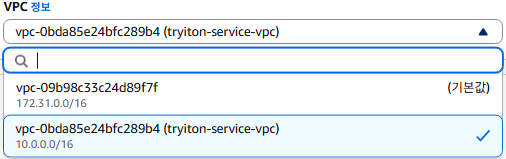

꼭 기본 vpc가 아닌, 새로 생성한 VPC를 선택해야한다.

**`인바운드 규칙`** 을 모든 웹 트래픽을 받아들일 수 있도록 HTTP와 HTTPS(비필수, but 권장)을 열어준다.
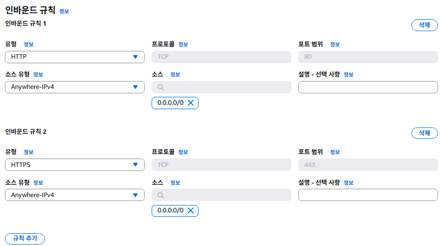
여기서 `0.0.0.0/0`은 위치와 무관하게 접속을 허용한다는 의미이다.

### EC2 인스턴스용 보안그룹 생성

> 실제 애플리케이션이 설치 될 EC2 서버를 보호

여기선 총 `두 종류의 트래픽`을 허용해야함.

1. 로드 밸런서로부터 오는 애플리케이션 트래픽
2. 서버 관리를 위한 관리자의 SSH 접속 트래픽 (22번 포트)

생성 절차는 `인바운드 규칙`만 달리하고 모든 절차는 위와 같다.

인바운드 규칙에서 먼저. `애플리케이션의 포트`를 열어준다.


우리 프로젝트에서는 FastAPI, Node.js, Spring 이 세개를 비즈니스 로직처리에 사용하기 때문에. 세개에 대해서 인바운드 규칙을 설정해줘야한다.

> ❗우리의 서비스는 Spring에서 Node.js의 마이크로 서비스와 FastAPI를 호출하기 때문에, Spring은 ALB로의 inbound를 열지만, `Node.js 서버와 FastAPI의` inbound 규칙 `source`를 `Spring의 보안 그룹`으로 설정해준다.


(Spring의 호출을 열어 둔 Python 서버의 보안 그룹 규칙)

다 구성이 완료되면 아래와 같은 모습이 된다

```
+-------------------------------------------------------------------------+
|  VPC                                                                    |
|                                                                         |
|  +---------------------------+       +--------------------------------+ |
|  |   Availability Zone A     |       |   Availability Zone B          | |
|  |                           |       |                                | |
|  | +-----------------------+ |       | +----------------------------+ | |
|  | |  Private Subnet 1     | |       | | Private Subnet 2           | | |
|  | |                       | |       | |                            | | |
|  | |  [EC2 - Spring] <----sg-spring  | | [EC2 - Spring] <----sg-spring| |
|  | |  [EC2 - Python] <----sg-python  | | [EC2 - Python] <----sg-python| |
|  | |  [EC2 - Node]   <----sg-node    | | [EC2 - Node]   <----sg-node  | |
|  | |                       | |       | |                            | | |
|  | +-----------------------+ |       | +----------------------------+ | |
|  +---------------------------+       +--------------------------------+ |
|                                                                         |
+-------------------------------------------------------------------------+
```

일반적으로 혼자 작업한다면 이렇게 사용할 어플리케이션의 TCP 포트와, `포트범위 22의 SSH`를 열어주고 SSH 소스 부분에 내 고정 IP를 사용하면 된다.  
하지만 지금은 다수의 팀원들과 운영해야하고, 와이파이 환경이며(유동 ip인지, 아닌지 모름) 여러모로 여는게 보안상 불안하기때문에, `SSH를 열지 않기로 한다`.

그럼 어떻게 하느냐?

### AWS Systems Manager (SSM) 세션 관리자

를 활용한 방법이다. 현재 업계 표준이라고하며, AWS에서 권장한다고한다.

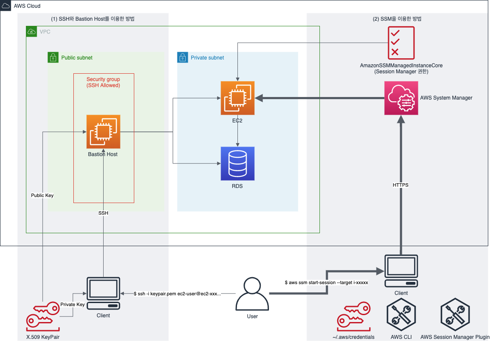

위 그림은 VPC의 Private Subnet 리소스에 접근하기 위한 SSH(기존) 과 SSM을 사용한 방법을 비교한 그림이다.

좌측은 SSH 이용 `Bastion Host` 경우, `Private Subnet`에 도달  
우측은 AWS SSM 이용 AWS System Manager를 거쳐서 가는 방법을 나타낸다.

```
[연결 흐름 비교]
기존: IDE → 인터넷 → EC2 공인 IP:22 (보안 그룹 22번 포트 열기 필수)
SSM: IDE → 로컬 PC의 SSH 설정 → AWS CLI (ProxyCommand) → SSM 터널 → EC2 인스턴스 (보안 그룹 22번 포트 닫기 가능)
```

**적용방법**은? 매우 간단하다. 별도의 보안 그룹 설정 없이, 작업할 작업자의 IAM 계정의 역할에 `AmazonSSMManagedInstanceCore` 만 붙여주면된다.

기존 SSH 방식에 비해 가지는 장점은

- Bastion Host, Key Pair, SG+Rule 다 필요없다
- 그럼에도 **SSH로 가능한건 다 한다**
- Private Subnet의 EC2 인스턴스에 바로 접속할 수 있다

이에 대한 IDE 등에서의 연결설정은 모든 설정을 끝내고 해주면 된다.

나머지 모든 3개의 어플리케이션에 대한 보안설정(`TIO-Spring-EC2-SG`, `TIO-Python-EC2-SG`, `TIO-Node.js-EC2-SG`을 마무리해준다.

`아웃바운드` 룰은 기본(`모든 트래픽 대상`)으로 둬도 된다.

---

### Q2. 보안 그룹은 각각 설정해줘야하는가?

구현하기 나름.

1. 각 애플리케이션을 별도 서버 그룹에 배포
2. 모든 애플리케이션을 하나의 인스턴스 그룹에 배포

이 두 가지 방식을 사용할 수 있는데,  
1번 방식을 사용하게되면,  

```
my-shop-ec2-sg의 인바운드 규칙:

포트 8080 (Spring)을 my-shop-alb-sg로부터 허용
포트 8000 (Python)을 my-shop-alb-sg로부터 허용
포트 3000 (Node.js)을 my-shop-alb-sg로부터 허용
```  

이렇게 각각의 SG를 설정하고, 각 EC2의 ALB에 적용해주면 된다.  

```
ALB (로드 밸런서) 구성
ALB의 경로 기반 라우팅(Path-based Routing) 규칙을 사용하여 트래픽을 분배

https://yourshop.com/api/spring/* 요청 → spring-target-group (Spring EC2 그룹)으로 전달
https://yourshop.com/api/python/* 요청 → python-target-group (Python EC2 그룹)으로 전달
https://yourshop.com/api/node/* 요청 → node-target-group (Node.js EC2 그룹)으로 전달
```

2번 방식의 경우 하나의 인스턴스 ALB에 하나의 보안 그룹을 설정하고, 모든 어플리케이션에 해당하는 `모든 포트`를 열어준다

```
my-shop-ec2-sg의 인바운드 규칙:
포트 8080 (Spring)을 my-shop-alb-sg로부터 허용
포트 8000 (Python)을 my-shop-alb-sg로부터 허용
포트 3000 (Node.js)을 my-shop-alb-sg로부터 허용
```

1번이 `매우` 권장되는 이유는 아래와 같다

- **독립적인 확장 (Independent Scaling)**: Python API에 트래픽이 몰리면 Python 서버 그룹만 증설(Scale-out)하면 됩니다. 다른 서비스에 영향을 주지 않습니다.
- **독립적인 배포 (Independent Deployment)**: Node.js 앱을 업데이트할 때, Spring Boot 서비스는 아무런 영향 없이 안정적으로 운영됩니다.
- **높은 보안성 및 명확성**: 각 서비스에 필요한 포트만 최소한으로 열기 때문에 보안에 유리하고, 어떤 보안 그룹이 어떤 역할을 하는지 명확하게 알 수 있습니다.
- **장애 격리 (Fault Isolation)**: 만약 Spring Boot 앱에 메모리 누수가 발생해 서버가 다운되어도, Python과 Node.js 서비스는 정상적으로 계속 작동합니다.

---

### DB 보안그룹 생성

`TIO-DB-SG`로 생성해준다.

이때 흐름자체가

- `DB 보안그룹` 의 인바운드 : 오직 `EC2 보안그룹` 으로부터 오는 요청만 허용한다
- `EC2 보안그룹` 의 아웃바운드 규칙 : 오직 `DB 보안그룹` 으로부터 나가는 요청을 허용한다.

### **Q3. 복합 데이터 흐름과 보안 그룹 규칙**

> 데이터 흐름이. 예를들어 FastAPI가 필요한 호출이 외부에서 들어오게되면 ALB를 통해서 spring을 거치고, fastapi에다가 요청을 넣으면, fastapi에서 S3의 이미지를 꺼내와서 처리를 하고 그 결과를 spring을 통해서 클라이언트로 보내주는데 이때 보안 그룹 규칙은 어떻게되는거지?

**데이터 흐름 시나리오:**
`클라이언트` → `ALB` → `Spring EC2` → `FastAPI EC2` → `S3` → `FastAPI EC2` → `Spring EC2` → `ALB` → `클라이언트`

| 단계 | 출발지 | 목적지 | 통과하는 보안 그룹 | **필요한 핵심 규칙 (Inbound 위주)** |
| :--- | :--- | :--- | :--- | :--- |
| **1.** | 클라이언트 (인터넷) | ALB | `sg-alb` (ALB 보안 그룹) | **Inbound:** 포트 `443`(HTTPS) / 소스 `0.0.0.0/0` |
| **2.** | ALB | Spring EC2 | `sg-spring` (Spring 보안 그룹) | **Inbound:** 포트 `8080` / 소스 **`sg-alb`** |
| **3.** | **Spring EC2** | **FastAPI EC2** | **`sg-python`** (Python 보안 그룹) | **Inbound: 포트 `8000` / 소스 `sg-spring`** |
| **4.** | **FastAPI EC2** | **Amazon S3** | `sg-python` (아웃바운드) | **Outbound:** 포트 `443` / 대상 `S3 엔드포인트` 또는 `0.0.0.0/0` |
| **5.** | FastAPI EC2 | Spring EC2 | `sg-spring` (인바운드) | **(규칙 불필요)** - 3번 요청에 대한 **Stateful 응답**이므로 자동 허용 |
| **6.** | Spring EC2 | ALB | `sg-alb` (인바운드) | **(규칙 불필요)** - 2번 요청에 대한 **Stateful 응답**이므로 자동 허용 |
| **7.** | ALB | 클라이언트 (인터넷) | - | **(규칙 불필요)** - 1번 요청에 대한 **Stateful 응답**이므로 자동 허용 |

#### **단계별 상세 설명:**

- **1단계 (클라이언트 → ALB):** 외부 사용자의 요청. ALB 보안 그룹(`sg-alb`)이 인터넷(`0.0.0.0/0`)으로부터의 웹 트래픽(HTTPS/443)을 허용.

- **2단계 (ALB → Spring):** ALB가 Spring 서버로 요청을 전달. Spring 보안 그룹(`sg-spring`)이 ALB 보안 그룹(`sg-alb`)으로부터의 애플리케이션 트래픽(8080)을 허용.

- **3단계 (Spring → FastAPI):** **가장 핵심적인 부분입니다.** Spring이 FastAPI를 동기 호출. FastAPI 서버의 보안 그룹(`sg-python`)이 Spring 서버 보안 그룹(`sg-spring`)으로부터의 API 트래픽(8000)을 허용. 이 규칙이 없으면 Spring은 FastAPI에 접속할 수 없음.

- **4단계 (FastAPI → S3):** FastAPI가 S3에서 이미지를 가져옴.

  - 이 통신은 FastAPI EC2 인스턴스에서 시작되는 **아웃바운드(Outbound)** 통신.
  - 이전에 설정한 **S3 게이트웨이 엔드포인트**를 사용한다면, 이 트래픽은 AWS 내부망을 통해 S3로 안전하게 라우팅됨.
  - `sg-python`의 아웃바운드 규칙에 HTTPS(443)가 허용되어 있어야 함. (기본 아웃바운드 규칙은 '모두 허용'이므로 보통은 문제없이 동작.)

- **5, 6, 7단계 (응답 트래픽):**

  - 이 모든 과정은 맨 처음에 클라이언트가 시작한 단일 요청에 대한 "응답"의 흐름이다.
  - 보안 그룹은 **Stateful**이기 때문에, 한 번 허용된 요청에 대한 응답 트래픽은 **별도의 규칙 없이 자동으로 허용**된다. 따라서 FastAPI → Spring, Spring → ALB, ALB → 클라이언트로 돌아가는 응답 경로는 추가적인 보안 그룹 규칙 설정이 필요 없다고 한다.

결론적으로, 이 복잡한 흐름을 가능하게 하는 가장 중요한 맞춤 규칙은 **`sg-python`의 인바운드 규칙에 `sg-spring`을 허용해주는 설정** 단 하나다.

## ALB (Application Load Balancer) 생성

> Network - Amazon VPC 실습에서 생성한 네트워크 인프라를 사용하여 부하에 따라 자동으로 확장/축소할 수 있고 고가용성을 보장하는 웹 서비스를 배포합니다. (라고 AWS에서 설명한다)

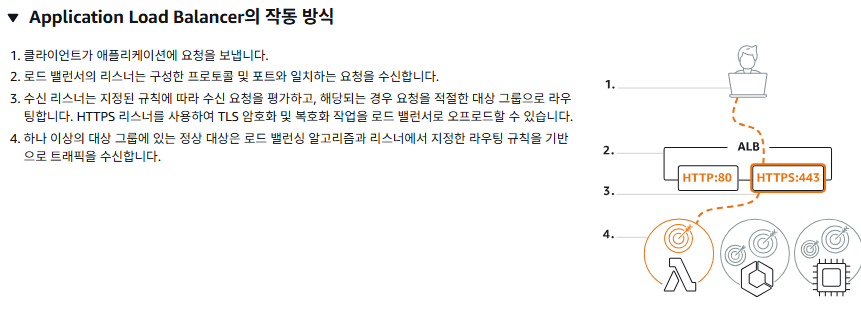

결국 쉽게 말하면 정문같은 느낌이다.

### Target Group 생성

먼저 ALB 전에 Target Group을 생성한다. 이는 ALB가 트래픽을 전달할 대상(EC2 인스턴스, 우리는 `Spring 인스턴스`가 되겠다)의 그룹을 정의한다.

  
EC2 콘솔 > 대상 그룹 > 대상 그룹 생성으로 가서 인스턴스를 대상으로 생성해준다.


spring으로 들어오는 호출이기때문에 포트번호를 `8080`으로 맞춰주고, VPC를 우리가 생성한것으로 변경해주면된다. 나머지는 기본값으로.

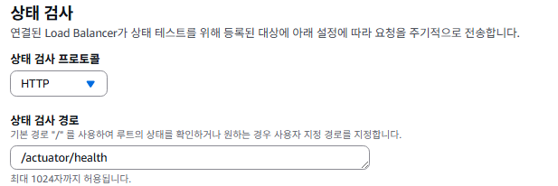

상태 검사 경로는 `Spring Boot Actuator` 라이브러리에서 저 경로를 통해 DB 연결 상태까지 확인해준다.

만일 라이브러리가 없더라도 나중을 위해 경로를 적어줘도 서버 설정에는 무방하고. 필요한 시점에 프로젝트의 `build.gradle`에 의존성을 추가해준다.

```Groovy
dependencies {
    implementation 'org.springframework.boot:spring-boot-starter-actuator'
}
```

다음으로 넘기면 현재까지는 인스턴스가 없기 때문에 바로 `대상 그룹 생성`으로 종료한다.


이제 로드밸런서를 생성해 이 콘솔을 채워준다.

### 로드밸런서

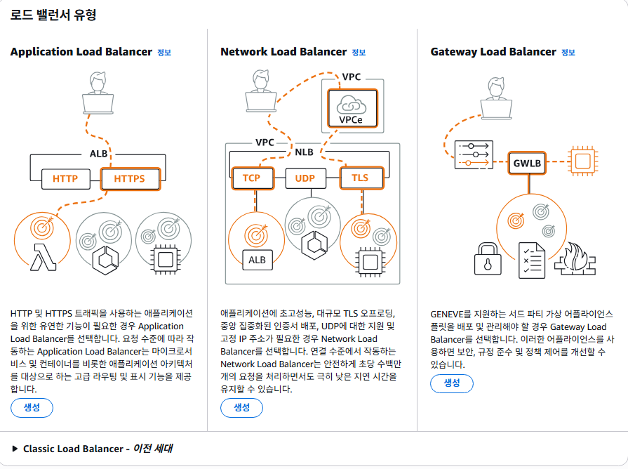

제일 왼쪽을 누르면 된다.


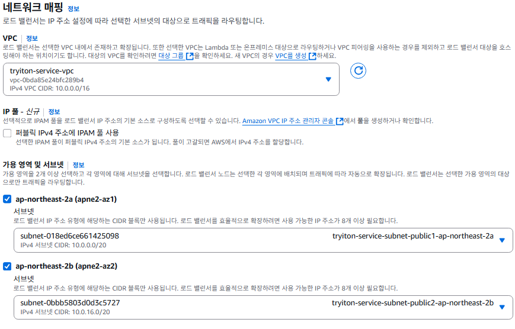

이 부분이 조금 중요하다. 현재 vpc로 골라주고, `가용 영역 및 서브넷`의 두 서브넷을 체크해주면 고를 수 있는 박스가 나온다.


우리의 ALB는 `인터넷과 직접 통신`해줘야 하기 때문에, 반드시 두 개의 서브넷 모두 `public`으로 설정해주어야한다.


초반에 만든 ALB의 보안그룹을 지정해주고,

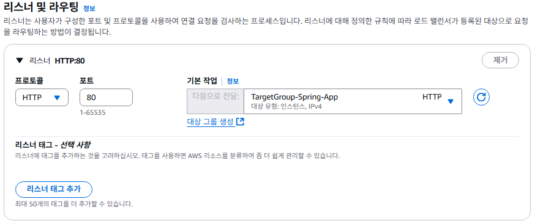

리스너는 기본값인 프로토콜 `HTTP`와 포트 `80`으로 되어있는지 확인만 하자.  
그리고 직전에 생성한 `TargetGroup`을 선택해준다.


이상없이 설정 해줬다면 아래로 쭉 스크롤하여, `요약`에서 이상없는지 최종 확인하고 **`로드 밸런서 생성`** 클릭.

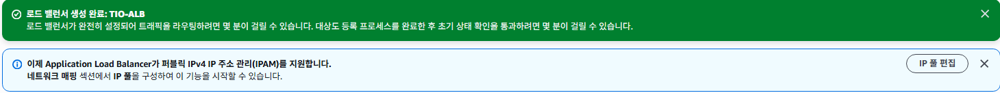
상단에 `로드 밸런서 생성 완료` 라는 메시지가 뜨며 아무것도 없던 `EC2 > 로드 밸런서`콘솔로 빠져나오게된다.


상태를 보면 회색 음영처리된 글씨로 `프로비저닝(Provisioning) 중`이라고 떠있는데, `활성(Active)` 상태로 변경되는데 몇분정도 소요된다.

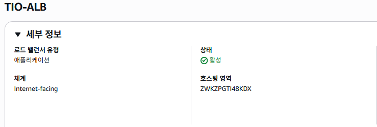

### IAM 역할 생성

우리는 Auto Scaling Group에게 서버의 생성과 관리를 위임하기 위해서, 해당 기능을 구현하기 위해 `EC2` 서버에게 IAM role을 부여해 줄 것이다.  
> "너는 SSM, S3, CloudWatch와 통신할 수 있는 권한이 있어" 라고 허락해주는 역할

검색창에 IAM 검색하여 들어온 콘솔에서, `역할 만들기`를 눌러 들어온다.

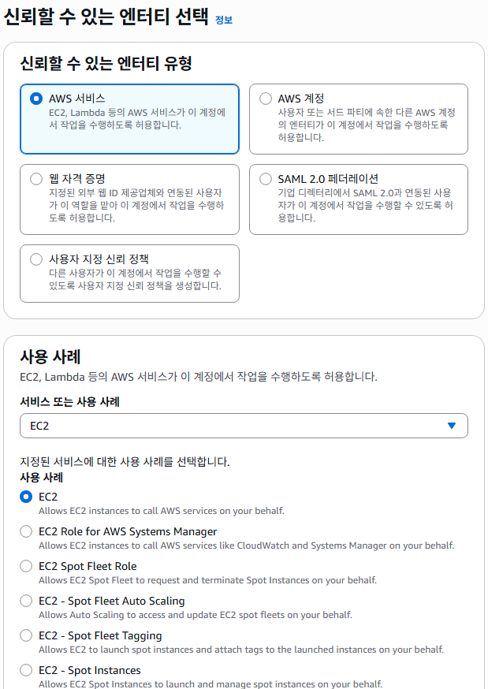

다음 권한 추가 창에서 아래 3개의 정책을 찾아 체크해준다.

- AmazonSSMManagedInstanceCore (SSM 원격 접속용)
- AmazonS3FullAccess (S3 파일 접근용)
- CloudWatchAgentServerPolicy (서버 모니터링 및 로그 수집용)  
3개를 모두 체크했으면 [다음] 클릭


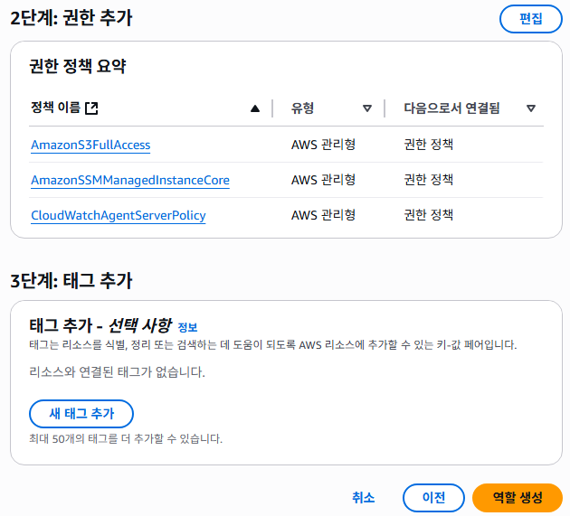

역할 생성 후 다시 Template로 돌아온다

## Launch Template 생성

시작 템플릿은 일종의 도면이다. 로드밸런싱에 의해 EC2를 자동으로 늘려줘야 하는 상황에서도, 이 도면(시작 템플릿)을 보고 그대로 늘려주게 된다.


Auto Scaling 지침 꼭 체크해주자. 말이 모호하긴한데, 그냥 AWS가 이 설정을 인식하고 필요한 상황에 `이 템플릿을 사용하세요` 라는 사인? 같은거라고 생각하면된다.

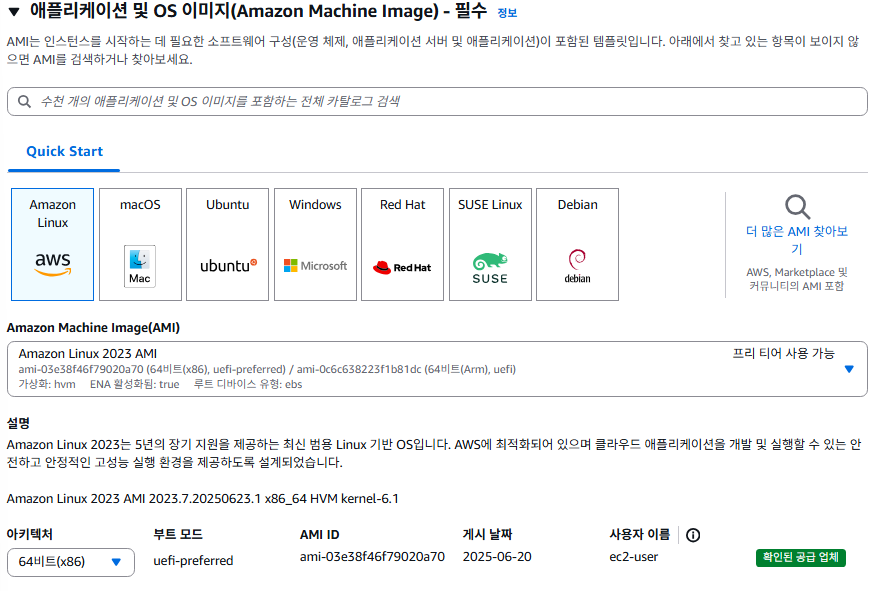

쓰고싶은 AMI를 고른다. 꼭 특정 버전의 Ubuntu를 사용해야하고, 의존성 문제가 있는게 아니라면 Amazon Linux가 무난한 선택지라고한다.  
(일단 무료에, EC2 맞춤형 튜닝, AWS측 보안패치 자동 제공 등)

혹시 나중에라도 AMI를 바꾸고싶다면 현재 만들었던 템플릿을 기반으로 새로운 버전을 만들어주게되면 서버 실행에는 영향을 끼치지 않고 버전 교체를 해 줄 수 있다.

> 잠깐 설명하면 템플릿 교체 하는법은 아래와 같다.  
> `새버전 생성` -> `Auto Scaling Group 설정 내 새 시작템플릿으로 변경` -> `Auto Scaling Group 의 인스턴스 새로고침 시작으로 새 이미지 업로드`
>


인스턴스 유형은 아직까지 개발 / 테스트 단계이기 때문에 t2.micro로 설정해준다.
SSM을 쓸 것이기 때문에, 키페어는 비워둔다
방화벽에서 기존 보안 그룹 선택, 보안그룹 설정은 만들어둔 `TIO-Spring-EC2-SG` 보안 그룹 선택한다.

스토리지도 상술한 이유로 일단 기본값으로 해준다.

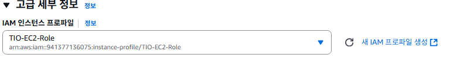
아까 생성한 TIO-EC2-Role을 골라준다.


이 곳에 각 인스턴스가 생성될 때 마다 반복적으로 초기화해줄 `사용자 데이터`의 스크립트 작성해준다.

### 사용했던 사용자 데이터 스크립트

```Bash
#!/bin/bash
# 1. 시스템 패키지 업데이트 (보안 강화)
sudo dnf update -y

# 2. 타임존을 한국 시간으로 변경 (로그 시간 동기화)
sudo timedatectl set-timezone Asia/Seoul

# 3. Java 17 (Corretto) 설치
sudo dnf install java-17-amazon-corretto-devel -y

# 4. CodeDeploy 에이전트 설치 (CI/CD 자동 배포 준비)
#    - CodeDeploy 에이전트는 Ruby를 필요로 합니다.
sudo dnf install ruby -y
sudo dnf install wget -y
cd /home/ec2-user
wget https://aws-codedeploy-ap-northeast-2.s3.ap-northeast-2.amazonaws.com/latest/install
chmod +x ./install
sudo ./install auto

# 5. CloudWatch 에이전트 설치 및 설정/실행 (중앙 로깅 및 모니터링)
sudo dnf install amazon-cloudwatch-agent -y

# CloudWatch 에이전트 설정 파일 생성
# - 이 설정은 메모리/디스크 사용률 같은 시스템 지표와 /app/logs/application.log 파일을 수집합니다.
sudo bash -c 'cat <<EOF > /opt/aws/amazon-cloudwatch-agent/bin/config.json
{
  "agent": {
    "metrics_collection_interval": 60,
    "run_as_user": "root"
  },
  "metrics": {
    "metrics_collected": {
      "disk": {
        "measurement": [
          "used_percent"
        ],
        "metrics_collection_interval": 60,
        "resources": [
          "*"
        ]
      },
      "mem": {
        "measurement": [
          "mem_used_percent"
        ],
        "metrics_collection_interval": 60
      }
    }
  },
  "logs": {
    "logs_collected": {
      "files": {
        "collect_list": [
          {
            "file_path": "/app/logs/application.log",
            "log_group_name": "/my-shop/ec2/spring-application",
            "log_stream_name": "{instance_id}"
          }
        ]
      }
    }
  }
}
EOF'

# CloudWatch 에이전트 실행 및 부팅 시 자동 시작 설정
sudo /opt/aws/amazon-cloudwatch-agent/bin/amazon-cloudwatch-agent-ctl -a fetch-config -m ec2 -s -c file:/opt/aws/amazon-cloudwatch-agent/bin/config.json
sudo systemctl enable amazon-cloudwatch-agent
```

### 각 추가 항목의 의미

1. **시스템 업데이트**: 서버가 시작될 때마다 OS의 모든 패키지를 최신 버전으로 업데이트하여, 알려진 보안 취약점들을 사전에 방지.

2. **타임존 설정**: 서버의 기본 시간은 보통 UTC(세계 표준시)입니다. 모든 로그(에러 로그, 접속 로그 등)와 애플리케이션의 시간 기록이 한국 시간(KST)으로 통일되어야 나중에 문제를 추적하기 매우 쉬움.

3. **CodeDeploy 에이전트 설치**: 가장 중요한 추가 항목 중 하나입니다. 나중에 `GitHub Actions 등으로 CI/CD 파이프라인을 구축`할 때, AWS의 `CodeDeploy`라는 서비스가 이 에이전트를 통해 서버에 접속하여 애플리케이션 코드를 자동으로 배포(복사, 실행). 이것을 미리 설치해두는 것.

4. **CloudWatch 에이전트 설정 및 실행**: 단순히 에이전트를 설치만 하는 것을 넘어, 실제로 동작하도록 설정하고 실행하는 단계.

config.json 파일을 만들어 "어떤 지표와 로그 파일을 수집해서, 어떤 이름으로 CloudWatch에 보낼지"를 정의
EC2 인스턴스의 메모리/디스크 사용률과, 나중에 우리 Spring 애플리케이션이 생성할 로그 파일(/app/logs/application.log)을 수집하도록 설정했다.
이렇게 해야 실제로 CloudWatch 대시보드에서 서버의 상태를 모니터링하고 로그를 검색할 수 있게 된다고 한다.

---

### Launch Template 생성 완료


이제 Auto Scaling Group을 위한 준비가 완료되었다.

## Auto Scaling Group

> Auto Scaling Group(ASG)은 '서버 공장'이자 '서버 관리 매니저'이다. 시작 템플릿을 기반으로 EC2 인스턴스를 찍어내고, 항상 정해진 수의 인스턴스가 건강하게 동작하도록 관리하며, ALB와 연동하는 모든 것을 책임진다

EC2 > Auto Scaling 그룹 > Auto Caling 그룹 생성으로 이동한다


Auto Scaling 그룹 이름: TIO-Spring-ASG
시작 템플릿: 드롭다운 메뉴에서 우리가 만든 TIO-Spring-LT를 선택합니다.
템플릿 버전이 'Default (1)'로 올바르게 선택되었는지 확인하고 **다음**을 클릭합니다.


네트워크 (VPC): tryiton-service-vpc가 선택되어 있는지 확인합니다.  
가용 영역 및 서브넷: `프라이빗 서브넷(Private Subnet)` 2개를 모두 선택합니다.  

- (매우 중요!) 우리의 애플리케이션 서버는 외부 인터넷에 직접 노출되면 안 되므로, 반드시 안전한 프라이빗 서브넷에 위치해야 합니다.


기존 로드 밸런서 대상 그룹에서 아까 만들어준 `TargetGroup`을 연결해준다

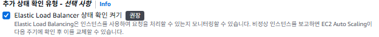

서버의 상태를 지속 확인하고 ALB가 `비정상`이라 판단 시 자동으로 교체해주어 `안전성`이 높아진다.


- 원하는 용량(Desired capacity): 2
  - ASG가 항상 유지하려고 노력하는 인스턴스 수
- 최소 용량(Minimum capacity): 2
- 최대 용량(Maximum capacity): 4 (나중에 트래픽이 많아지면 최대 4대까지 자동으로 늘어날 수 있다.)  


- 조정 정책: 대상 추적 조정 정책을 선택
- 조정 정책 이름: TIO-CPU-Scaling-Policy (식별하기 쉬운 이름)
- 측정항목 유형: 평균 CPU 사용률(Average CPU utilization)
- 대상 값 (Target value): 60
  - 의미: Auto Scaling Group에 속한 모든 서버들의 평균 CPU 사용률을 60% 수준으로 유지하겠다는 의미. 만약 평균값이 60%를 초과하면 서버를 늘리고, 한참 낮으면 서버를 줄임.
  - (참고: 60% ~ 70% 사이의 값이 일반적으로 많이 사용 된다고 한다. 너무 낮게 잡으면 너무 자주 서버가 늘어나 비용이 증가하고, 너무 높게 잡으면 트래픽이 폭증할 때 대응이 늦을 수 있음.)
- 인스턴스 준비 기간 (Instance warmup): 180 초 (3분)
  - 의미: 새 인스턴스가 시작된 후, 사용자 데이터 스크립트가 실행되고 Java 애플리케이션이 완전히 구동되어 정상적으로 트래픽을 받을 준비가 될 때까지 걸리는 시간을 의미. 이 시간 동안에는 해당 인스턴스의 CPU 사용률을 평균값 계산에서 제외하여 불필요한 추가 확장을 방지합니다. Java 애플리케이션은 시작 시간에 약간의 시간이 걸리므로 3분 정도로 넉넉하게 설정하는 것이 좋음.


생략

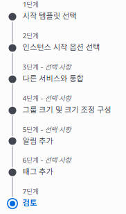

우리가 설정한걸 최종 검토하고 `Auto Scaling 그룹 생성` 을 눌러주면

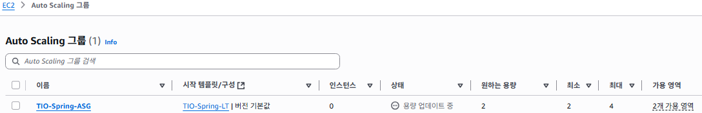

콘솔에서 준비중인것을 확인할 수 있고, 잠시.. 기다리고 EC2 인스턴스 대시보드로 가면, 새로운 인스턴스가 `2개` 실행중인 것을 확인할 수 있다.


어떻게 이런일이 가능한건지? 는, Auto Scaling Group이 생성되는 순간 아래의 절차를 백그라운드에서 수행한다.

1. Auto Scaling Group이 TIO-Spring-LT 설계도를 읽습니다.
2. 원하는 용량인 2대에 맞춰, 지정된 프라이빗 서브넷에 EC2 인스턴스 2대를 생성하기 시작합니다.
3. 각 인스턴스가 켜지면서, 우리가 넣었던 사용자 데이터 스크립트가 실행되어 Java, 에이전트 등이 자동으로 설치됩니다.
4. 생성이 완료된 인스턴스들은 자동으로 TargetGroup-Spring-App 대상 그룹에 등록됩니다.
5. ALB가 대상 그룹에 등록된 새 인스턴스들을 대상으로 **상태 검사(/actuator/health)**를 시작합니다.
6. 상태 검사를 통과하면, 인스턴스의 상태가 **'healthy'**로 바뀌고, ALB는 드디어 실제 트래픽을 이 인스턴스들로 보내기 시작합니다.

---

## 한번 더...?

여기까지 왔다면 Spring을 위한 서버는 완성된거다.

그럼 python이랑 node.js는...? 한번씩 그대로 반복하되, `이름`, `포트`, `사용자 데이터 스크립트`만 달리 가져가면 된다. ㅎㅎ..

-----

### **Node.js 서버 그룹 생성 (핵심 요약)**

#### **1. 대상 그룹 (Target Group) 생성**

- **이름:** `TargetGroup-Node-App`
- **포트:** **`3000`** (Node.js 앱 포트)
- **상태 검사 경로:** `/` (또는 앱에 맞는 경로)

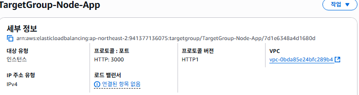

#### **2. 시작 템플릿 (Launch Template) 생성**

- **이름:** `TIO-Node-LT`
- **보안 그룹:** `TIO-Node-EC2-SG` 선택
- **IAM 역할:** `TIO-EC2-Role` 선택
- **사용자 데이터 (User Data):** 아래 스크립트로 교체 (Node.js 18.x 설치)

    ```bash
    #!/bin/bash
    sudo dnf update -y
    sudo timedatectl set-timezone Asia/Seoul
    # Node.js 18.x 설치
    curl -sL https://rpm.nodesource.com/setup_18.x | sudo bash -
    sudo dnf install -y nodejs
    # CodeDeploy & CloudWatch 에이전트 설치 (동일)
    sudo dnf install ruby wget -y
    cd /home/ec2-user
    wget https://aws-codedeploy-ap-northeast-2.s3.ap-northeast-2.amazonaws.com/latest/install
    chmod +x ./install
    sudo ./install auto
    sudo dnf install amazon-cloudwatch-agent -y
    ```


#### **3. Auto Scaling 그룹 (ASG) 생성**

- **이름:** `TIO-Node-ASG`
- **시작 템플릿:** `TIO-Node-LT` 선택
- **서브넷:** **프라이빗 서브넷** 2개 선택
- **대상 그룹 연결:** `TargetGroup-Node-App` 선택
- **용량:** 원하는 용량 `2`, 최소 `2`, 최대 `4`
  - 인스턴스 워밍업 : `90초`
- **태그:** `Name`을 `TIO-Node-Server`로, `Service`를 `tio-node`로 변경


```
메시지의 의미: "선택하신 t2.micro 라는 서버 사양이, 지금 선택한 가용 영역(ap-northeast-2a 또는 ap-northeast-2b 중 하나)에서 일시적으로 재고가 부족하거나 더 이상 제공되지 않습니다." 라는 뜻.
```

이해하기 쉽게 정리하자면 가용영역 안의 `모델의 서버 재고 부족`  
일단 만들고, 시작 템플릿을 `t2.micro`에서 다른 인스턴스 유형으로 변경해주면 됨.

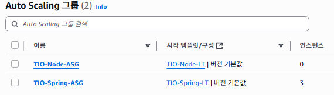

-----

### **Python(FastAPI) 서버 그룹 생성 (핵심 요약)**

#### **1. 대상 그룹 (Target Group) 생성**

- **이름:** `TargetGroup-Python-App`
- **포트:** **`8000`** (FastAPI 앱 포트)
- **상태 검사 경로:** `/` (또는 앱에 맞는 경로)

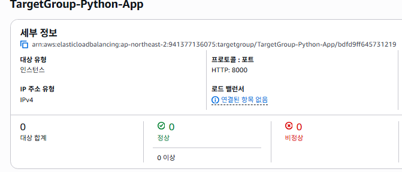

#### **2. 시작 템플릿 (Launch Template) 생성**

- **이름:** `TIO-Python-LT`
- **AMI**: Ubuntu Server 22.04 LTS 검색하여 선택 (가장 큰 차이점!)
- **보안 그룹:** `TIO-Python-EC2-SG` 선택
- **IAM 역할:** `TIO-EC2-Role` 선택
- **사용자 데이터 (User Data):** 아래 스크립트로 교체 (Python 3.10 설치)

    ```bash
    #!/bin/bash
    # Ubuntu는 apt-get 사용
    sudo apt-get update -y
    sudo timedatectl set-timezone Asia/Seoul
    # Python 3.10 설치
    sudo apt-get install -y python3.10 python3.10-pip
    # CodeDeploy & CloudWatch 에이전트 설치
    sudo apt-get install -y ruby-full wget
    cd /home/ubuntu
    wget https://aws-codedeploy-ap-northeast-2.s3.ap-northeast-2.amazonaws.com/latest/install
    chmod +x ./install
    sudo ./install auto
    wget https://s3.amazonaws.com/amazoncloudwatch-agent/ubuntu/amd64/latest/amazon-cloudwatch-agent.deb
    sudo dpkg -i -E ./amazon-cloudwatch-agent.deb
    ```

#### **3. Auto Scaling 그룹 (ASG) 생성**

- **이름:** `TIO-Python-ASG`
- **시작 템플릿:** `TIO-Python-LT` 선택
- **서브넷:** **프라이빗 서브넷** 2개 선택
- **대상 그룹 연결:** `TargetGroup-Python-App` 선택
- **용량:** 원하는 용량 `2`, 최소 `2`, 최대 `4`
- **태그:** `Name`을 `TIO-Python-Server`로, `Service`를 `tio-python`로 변경

-----

3개의 마이크로서비스(Spring, Node, Python)를 위한 서버 인프라가 완?벽하게 분리되어 구축

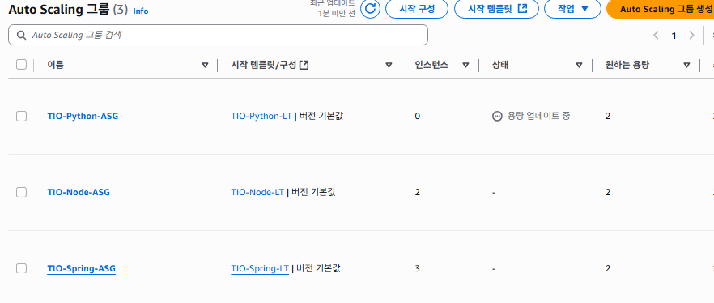

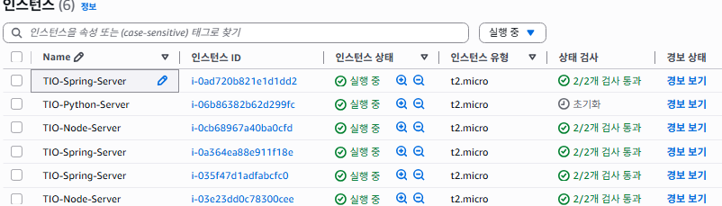

## 차후과제

사실 아직 FitDit을 위한 인스턴스 유형(필요한 옵션이 막혀있음)이나, Autoscaling 설정이 추가로 필요하다.
사유는 아래와 같다

---

### 1. 인스턴스 유형: GPU는 필수입니다.**

Python(FitDit) 프로젝트의 Dockerfile은 `nvidia/cuda` 이미지를 기반으로 하고, `onnxruntime-gpu` 같은 라이브러리를 사용합니다. 이는 이 애플리케이션이 **NVIDIA GPU의 고속 병렬 처리 능력**을 사용하도록 설계되었다는 명백한 증거입니다.

일반적인 `t3.micro` 같은 인스턴스에는 GPU가 없습니다. 따라서 여기에 FitDit 컨테이너를 실행하면, 애플리케이션이 GPU를 찾지 못해 오류를 내거나, CPU만으로 동작하여 엄청나게 느려지게 됩니다.

**해결책: AWS의 GPU 탑재 인스턴스 사용**

- AI 모델을 '학습'시키는 것이 아니라, 이미 학습된 모델을 사용해 '추론(Inference)'을 실행하는 것이므로, **비용 효율적인 G 시리즈 (예: g4dn, g5)가 적합합니다.**
- **추천 인스턴스 유형:** 가장 일반적으로 시작하는 유형은 **`g4dn.xlarge`** 입니다.

**조치:**
Python 서버용 시작 템플릿(`TIO-Python-LT`)을 생성하실 때, **인스턴스 유형**을 `t3.micro`가 아닌 **`g4dn.xlarge`** 로 선택해야 합니다.

---

### **2. 로드밸런싱 사이즈 (Auto Scaling 그룹 규모 및 정책)**

#### **가. 로드 밸런서 자체**

로드 밸런서(ALB) 자체는 AWS가 알아서 트래픽에 맞게 내부적으로 확장하므로, 저희가 사이즈를 정할 필요는 없습니다.

#### **나. Auto Scaling 그룹의 용량 및 정책 (매우 중요!)**

**1. 서버 개수 (min/desired/max)**

- **비용 고려:** GPU 인스턴스는 t3.micro보다 훨씬 비쌉니다. 따라서 불필요하게 여러 대를 계속 켜두는 것은 비용 낭비일 수 있습니다.
- **추천 값:**
  - **원하는 용량(Desired): `1`**
  - **최소 용량(Minimum): `1`** (만약 실시간 서비스가 아니라면 비용 절감을 위해 `0`으로 설정할 수도 있습니다.)
  - **최대 용량(Maximum): `2`** (또는 예상 트래픽에 따라 조정)
  - 일단 최소한의 서버(1대)로 시작하고, 필요할 때만 늘어나도록 구성하는 것이 효율적입니다.

**2. 조정 정책 (Scaling Policy)**

- **문제점:** CPU 사용률은 더 이상 좋은 지표가 아닐 수 있습니다. 이미지 처리 작업 중에는 **GPU가 100% 일하고 있어도 CPU는 상대적으로 놀고 있을 수 있기 때문**입니다. CPU 기준으로 스케일링하면, 서버가 힘들어하고 있는데도 확장이 일어나지 않을 수 있습니다.
- **해결책: 요청 수 기반 스케일링**
  - 더 간단하고 효과적인 방법은 **'서버 1대당 처리하는 요청 수'를 기준**으로 스케일링하는 것입니다.
  - **추천 정책:**
    - **정책 유형:** **`Application Load Balancer 요청 수(초당)/대상`** (Request Count Per Target)
    - **대상 값 (Target value):** **`10`** (예시)
    - **의미:** "각 Python 서버가 처리하는 초당 요청 수가 평균 10개를 넘으면, 서버가 바쁘다고 판단하고 새 서버를 한 대 더 추가해라" 라는 의미입니다. 이 값은 실제 애플리케이션의 처리 속도를 테스트하며 최적의 값을 찾아나가야 합니다.

---

### **결론: Python(FitDit) 서버를 위한 최종 구성**

- **시작 템플릿 (`TIO-Python-LT`):**
  - AMI: `Ubuntu Server 22.04 LTS`
  - **인스턴스 유형: `g4dn.xlarge`**
  - 사용자 데이터: Docker 설치 스크립트
- **Auto Scaling 그룹 (`TIO-Python-ASG`):**
  - **용량:** 원하는 용량: `1`, 최소: `1`, 최대: `2`
  - **조정 정책:** 대상 추적 - **`ALB 대상 그룹별 요청 수`** - 대상 값: **`10`**

## RDS(데이터베이스) 생성

> 모든 상품 정보, 회원 데이터, 주문 내역 등을 저장할 서비스의 DB. RDS를 사용하여 MySQL 데이터베이스 인스턴스를 생성. `프라이빗 서브넷`에 위치 시키고, 이전에 설계한 `TIO-DB-SG` 보안 그룹을 적용하여 EC2 서버들만 접속하도록 설정.

### 보안 그룹 생성

> 우리 서버들만 이 DB에 접속할 수 있다고 허용.

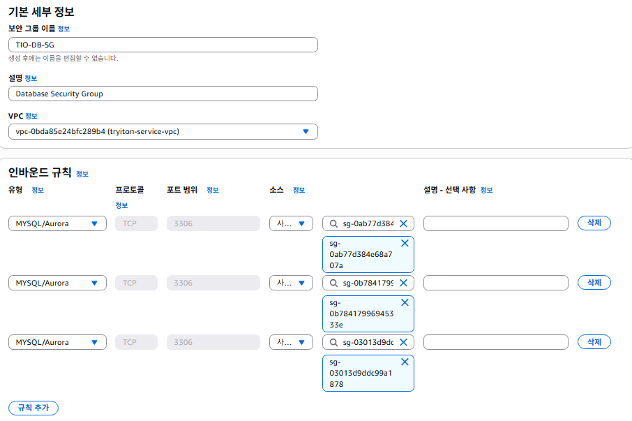

**`인바운드 규칙`**을 유형은 `MySQL`, 소스는 우리 3개의 서버(`spring, node, python`)만 접근 가능하도록 설정한다.

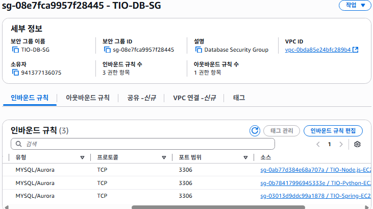

나머지는 기본값 동일.

### RDS 인스턴스 생성


특별한 이유가 없다면 Aurora보다 MySQL을 사용하자. `프리티어`(20GiB, 범용 SSD)도 가능함(일반적인 개발 수준의 트래픽에서는 오버스펙)

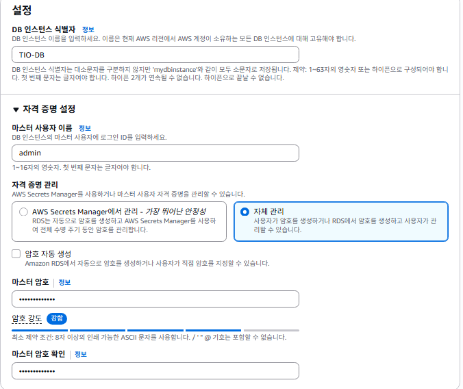

인스턴스 명칭(DB 서버명), 마스터 사용자 이름 / `암호`를 설정한다.  
암호는 추후 애플리케이션에서 사용해야하므로, 잊어버리지 않도록 주의

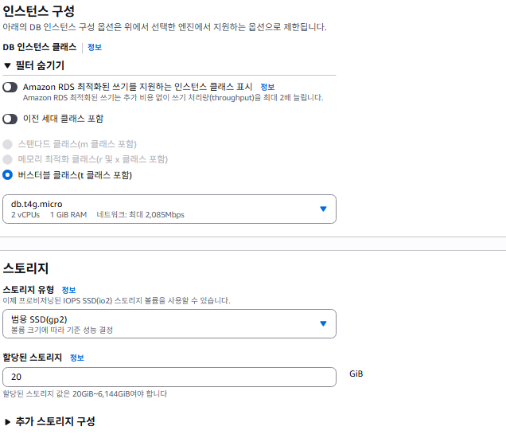

`인스턴스 구성`, `스토리지` 우리는 프리티어니까 기본 설정으로 둔다.  
초기에는 저정도도 넉넉하다

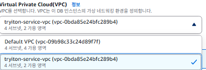

`연결`에서, `VPC`(이제는 지긋지긋하지만, 해줘야한다)와

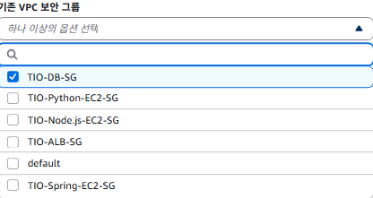

`VPC 보안 그룹`을 아까 만들어준 DB-SG로 변경해준다. 그리고 `default`가 체크되어있을 텐데, ❗***꼭 해제해줘야한다***


`추가 구성`을 펼쳐서, `초기 데이터베이스 이름`을 설정한다.

> ❗초기 데이터베이스 이름을 설정하지 않게되면 인스턴스는 정상적으로 생성되나. `스키마`(빈방)이 없는 상태로 만들어짐

**아파트 비유**

- RDS 인스턴스: 새로 지은 텅 빈 아파트 건물

- '초기 데이터베이스 이름' 설정: "건물이 완공되면, 미리 '101호' 라는 이름의 방 하나만 만들어주세요" 라고 건축 회사에 요청하는 것과 같습니다.

- `설정하지 않았을 경우`: 그냥 텅 빈 건물만 덩그러니 지어지는 것입니다. 아직 `호실이 하나도 없는 상태`입니다.  
나중에 우리가 '101호'로 이사 들어가려고 하면(`애플리케이션 연결`), "그런 호수는 없는데요?" 라는 말을 듣게 됨.  
그래서 우리가 `직접` 건물에 들어가서 '101호'라는 방을 만드는 공사(`SQL 명령어 실행`)를 해야만 함

아무튼 특별한 이유가 없다면 `설정하는게 맞다`

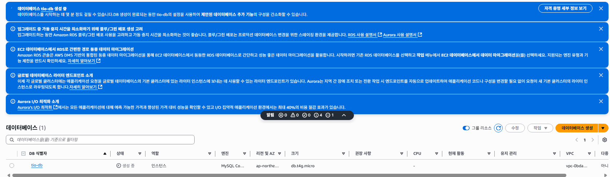
나머지는 기본설정으로 두고 생성해주면 데이터베이스의 인스턴스가 생성되게된다.  
`시간이 좀 걸린다`


창 띄워놓고 넋놓고 있다보면(굳이 그럴필요는 없다) 초록창으로 띠며 인스턴스 생성이 완료된다 :)

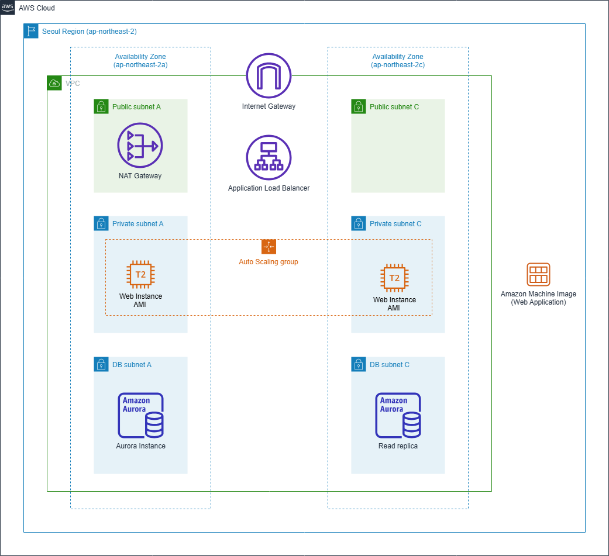

지금까지의 구현 상태는 위와 같다. (완전히 같진 않아도)

## AWS Secrets Manager 설정 및 RDS 자격 증명 저장

> 데이터베이스 자격 증명, API 키 등 모든 종류의 비밀 정보를 안전하게 저장하고 관리하며, 자동으로 교체해주는 서비스

참고: <https://catalog.us-east-1.prod.workshops.aws/workshops/869a0a06-1f98-4e19-b5ac-cbb1abdfc041/ko-KR/advanced-modules/database/connect-app>

즉 이 작업의 목표는 아까 RDS 생성시 사용한 `마스터 사용자 이름`과 `암호`를 코드나 서버가 아닌 AWS에 보관하는 것

여기서 새 보안암호를 만들건데, 이친구의 동작과 역할은

- RDS 마스터 사용자 이름과 암호를 Secrets Manager에 '비밀'로 저장합니다.
- EC2 인스턴스의 IAM 역할(TIO-EC2-Role)에 "이 특정 비밀을 읽을 수 있는 권한"을 부여합니다.
- Spring 애플리케이션이 시작될 때, AWS SDK를 사용하여 IAM 역할의 권한으로 Secrets Manager에 접속하여 DB 비밀번호를 안전하게 가져옵니다.
- 가져온 비밀번호를 사용해 DB에 연결합니다.

이렇게 함으로서, 소스코드에 비밀번호를 남기지 않고, 자동 암호 교체로 주기적으로 DB 암호를 자동으로 변경하여 보안을 극대화함.

### 새 보안 암호 저장

콘솔창에서 `AWS Secrets Manager`를 검색해서 들어간 후 `새 보안 암호 저장`을 클릭


내부 설정은 다 기본으로 놔두고, 아까 만든 계정의 이름과 비밀번호를 기입하고, DB 인스턴스를 선택한다.


나중에 관리하기 편하도록 이름과 설명을 기입한다.
(이름 : 일반적으로, 프로젝트명/서비스명/용도)


기본으로 두고 저장하여 완료한다.


이제 이 DB 접근은 우리의 애플리케이션 서버(spring, python, node)에서만 접근할 수 있도록 해야한다.

저장 직전에 검토단계에서 샘플코드로, 각 언어별 보안 암호 검색 코드를 제공한다.  
그 코드는 어플리케이션 실행 시 암호 취득 후 DB에 접근할 수 있도록 한다.

---

### AWS SDK 샘플코드

#### spring(java)

```java
// Use this code snippet in your app.
// If you need more information about configurations or implementing the sample
// code, visit the AWS docs:
// https://docs.aws.amazon.com/sdk-for-java/latest/developer-guide/home.html

// Make sure to import the following packages in your code
// import software.amazon.awssdk.regions.Region;
// import software.amazon.awssdk.services.secretsmanager.SecretsManagerClient;
// import software.amazon.awssdk.services.secretsmanager.model.GetSecretValueRequest;
// import software.amazon.awssdk.services.secretsmanager.model.GetSecretValueResponse; 

public static void getSecret() {

    String secretName = "tio/db/credentials";
    Region region = Region.of("ap-northeast-2");

    // Create a Secrets Manager client
    SecretsManagerClient client = SecretsManagerClient.builder()
            .region(region)
            .build();

    GetSecretValueRequest getSecretValueRequest = GetSecretValueRequest.builder()
            .secretId(secretName)
            .build();

    GetSecretValueResponse getSecretValueResponse;

    try {
        getSecretValueResponse = client.getSecretValue(getSecretValueRequest);
    } catch (Exception e) {
        // For a list of exceptions thrown, see
        // https://docs.aws.amazon.com/secretsmanager/latest/apireference/API_GetSecretValue.html
        throw e;
    }

    String secret = getSecretValueResponse.secretString();

    // Your code goes here.
}
```

#### node.js(JS)

```javascript
// Use this code snippet in your app.
// If you need more information about configurations or implementing the sample code, visit the AWS docs:
// https://docs.aws.amazon.com/sdk-for-javascript/v3/developer-guide/getting-started.html

import {
  SecretsManagerClient,
  GetSecretValueCommand,
} from "@aws-sdk/client-secrets-manager";

const secret_name = "tio/db/credentials";

const client = new SecretsManagerClient({
  region: "ap-northeast-2",
});

let response;

try {
  response = await client.send(
    new GetSecretValueCommand({
      SecretId: secret_name,
      VersionStage: "AWSCURRENT", // VersionStage defaults to AWSCURRENT if unspecified
    })
  );
} catch (error) {
  // For a list of exceptions thrown, see
  // https://docs.aws.amazon.com/secretsmanager/latest/apireference/API_GetSecretValue.html
  throw error;
}

const secret = response.SecretString;

// Your code goes here
```

#### python

```python
# Use this code snippet in your app.
# If you need more information about configurations
# or implementing the sample code, visit the AWS docs:
# https://aws.amazon.com/developer/language/python/

import boto3
from botocore.exceptions import ClientError


def get_secret():

    secret_name = "tio/db/credentials"
    region_name = "ap-northeast-2"

    # Create a Secrets Manager client
    session = boto3.session.Session()
    client = session.client(
        service_name='secretsmanager',
        region_name=region_name
    )

    try:
        get_secret_value_response = client.get_secret_value(
            SecretId=secret_name
        )
    except ClientError as e:
        # For a list of exceptions thrown, see
        # https://docs.aws.amazon.com/secretsmanager/latest/apireference/API_GetSecretValue.html
        raise e

    secret = get_secret_value_response['SecretString']

    # Your code goes here.
```

## EC2의 RDS 접근권한 부여

### IAM Policy(정책) 설정

> 최소 권한 원칙을 따르기 위해 리소스에 필요한 권한만 부여하는 것이 모범 사례로, 인스턴스에 DB 자격 증명이 포함된 특정 Secret에 액세스 할 수 있는 권한만 부여.

`TIO-EC2-Role`이라는 IAM의 `역할`에, 비밀을 읽어올 수 있도록 권한을 부여해 주는것이 목표이다.

IAM 관리 콘솔의 역할목록에서 역할을 찾아 클릭하면,  


`권한 추가` 버튼을 눌러 `인라인 정책 생성` 을 눌러준다
> 인라인 정책생성을 사용하는 이유:  
> 이 권한은 오직 이 역할에만 사용되는 특수한 경우로,  
> `다른 곳에서 재사용할 필요 없는` 인라인 정책으로 `직접` 붙여주는것

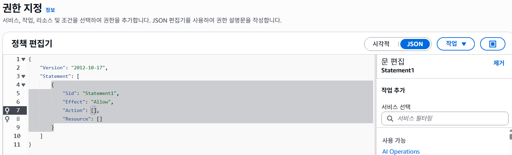

선택 버튼에 `시각적` / `JSON` 중에 JSON을 누르게되면 편집기가 뜨고,

기존의 코드를 다 날리고 아래의 코드로 대체한다

```json
{
    "Version": "2012-10-17",
    "Statement": [
        {
            "Sid": "AllowReadTioDbCredentialsSecret",
            "Effect": "Allow",
            "Action": "secretsmanager:GetSecretValue",
            "Resource": "YOUR_SECRET_ARN"
        }
    ]
}
```

`YOUR_SECRET_ARN` 값을 아까 Secrets Manager 콘솔에서 생성해준 비밀을 클릭하고, 보안 암호 ARN (Secret ARN) 값을 복사해서 넣어주고 정책 생성해주면 된다.


### 지금까지 완성된것

- 안전한 사설망 (VPC): 외부와 격리된 우리만의 데이터 센터 공간
- 똑똑한 교통 경찰 (ALB): 모든 사용자 요청을 가장 먼저 받아 적절한 서버 그룹에 분배
- 스스로 관리하는 서버 그룹 (Auto Scaling Group): 각 마이크로서비스(Spring, Node, Python)를 위한, 장애 시 자동 복구되고 트래픽에 따라 스스로 확장/축소하는 서버들
- 안전한 중앙 데이터베이스 (RDS): 모든 데이터를 보관하는 관리형 DB
- 비밀번호 금고 (Secrets Manager): DB 접속 정보 등 민감한 정보를 안전하게 보관
- 허가된 통행증 (IAM Role & Security Groups): 이 모든 구성 요소들이 서로에게 꼭 필요한 만큼의 권한만 가지고 안전하게 통신할 수 있는 규칙

### RDS 관리기능 설정 (고가용성을 위한 다중 AZ) - 옵션

> 🚨 RDS를 프리티어로 했지만, 해당 옵션을 활성화하게되면 요금이 부과되게 된다(DB인스턴스 비용 2배).  
> 이는 개발환경에서는 추천하지않으며, **운영환경으로 전환하기 직전**에 키거나, 그냥 알고만 넘어가도 무방하다.

현재 생성한 RDS는 `단일 AZ` 상태로, 이는 데이터베이스가 하나의 데이터센터에서만 동작한다.  
만일 이 곳에서 문제가 생기면 DB 장애로 서비스가 중단된다.

이를 방지하기 위해 다중 AZ 배포를 사용할 것이다.

AWS에서 예비 DB를 다른 AZ(가용영역)에 만들어두고 실시간으로 동기화, 장애 발생시 자동 복구 조치를 하도록 한다.
> AWS 피셜 Failover에 필요한 시간은 일반적으로 60-120초이다.

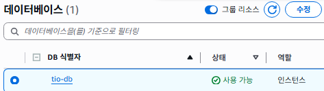  
RDS 콘솔 > 데이터베이스에서 이전에 만든 `tio-database`를 선택
[수정(Modify)] 버튼을 클릭

'가용성 및 내구성(Availability & durability)' 섹션으로 스크롤합니다.

대기 인스턴스를 생성하지 않음(단일 DB 인스턴스(Single DB instance))로 되어 있는 옵션을 **대기 인스턴스 생성(다중 AZ DB 인스턴스(Multi-AZ DB instance))**로 변경

## S3 버킷 생성 (파일 스토리지)

어렵지 않은 과정이라 AWS 교육 링크로 대체한다  
<https://catalog.us-east-1.prod.workshops.aws/workshops/869a0a06-1f98-4e19-b5ac-cbb1abdfc041/ko-KR/advanced-modules/storage/create-bucket>


우리 프로젝트는 2개의 버킷을 생성하였다.
> ✅ 사실 한참 뒤에 설명하겠지만, CICD를 위한 빌드 저장용으로도 하나 만들어야한다.

- 프론트엔드 배포용 : `tio-frontend-assets-jungle8th`
- 이미지 저장용 : `tio-image-storage-jungle8th`

이렇게 분리한 가장 큰 이유는 `보안`이고 나머지는 관리의 용이성이다.

프론트엔드 배포용은 생성 후 추가 설정이 필요하다.

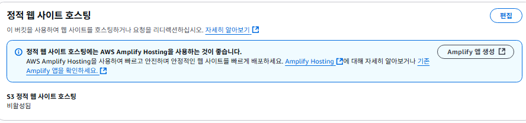
버킷의 속성 > 정적 웹사이트 호스팅 > 편집을 클릭하고,  

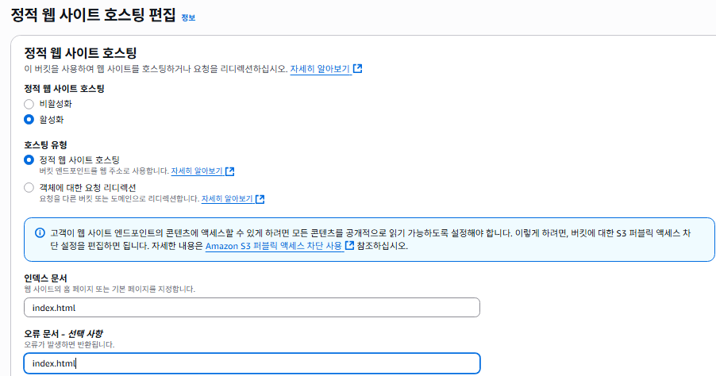
활성화 선택 후 인덱스 문서와 오류 문서에 모두 `index.html`을 입력

> 지금은 모든 퍼블릭 액세스가 막혔지만,  
> 이후 CloudFront생성 / S3와 연결하는 단계에서 관련 정책을 자동으로 추가해준다

---

### **두 버킷을 분리해야 하는 이유**

| 항목 | **1. 프론트엔드 배포용 버킷 (Next.js)** | **2. 이미지 저장용 버킷** |
| :--- | :--- | :--- |
| **주요 목적** | 웹사이트 파일(HTML, JS, CSS) 호스팅 | 사용자/상품 이미지, 파일 저장 |
| **주요 접근 주체**| **전 세계 인터넷 사용자 (Public Read)**, CloudFront | **애플리케이션 서버 (EC2)**, IAM 역할 |
| **퍼블릭 액세스** | **필요함** (웹사이트로 동작해야 하므로) | **절대 금지** (Private이 기본 원칙) |
| **보안 정책** | CloudFront를 통해서만 접근하도록 제한 (OAI/OAC) | 특정 IAM 역할에게만 CRUD 권한 부여 |
| **라이프사이클** | 배포 시점에 파일 전체가 교체됨 | 파일이 수시로 추가/삭제됨, 오래된 파일은 저렴한 스토리지로 이동 가능 |

#### **가장 큰 이유: 보안 (Security)**

두 버킷은 보안 정책의 방향성이 정반대로

- **프론트엔드 버킷**은 어떻게 하면 **'안전하게 공개할까'**를 고민하고. 그래서 CloudFront라는 대리인을 통해서만 공개하도록 설정한다.
- **이미지 저장용 버킷**은 어떻게 하면 **'완벽하게 비공개로 유지할까'**를 고민하고. 그래서 모든 퍼블릭 액세스를 차단하고, 오직 우리 서버의 IAM 역할에게만 접근을 허용하게된다.

### 연결은 어떻게하지?

이미 IAM EC2 role 생성시 `AmazonS3FullAccess` 권한을 이미 부여했기 때문에, 별도의 추가 연결 작업은 불필요하다.

애플리케이션에서 AWS SDK를 사용하여 `버킷 이름`으로 파일을 업로드하거나, 다운로드하면 자동으로 통신이 이루어진다.

> 여기까지 왔을 때, 모든 서버 세팅은 (일단 개발만)완료된 상태이다.

# CI/CD 파이프라인 구축 (자동 배포)

CICD 구축 목표는 개발자가 GitHub에 코드를 올리기만 하면, 그 이후 모든 과정 (빌드, 텥스트, 서버 배포)이 `완전 자동`으로 이루어지게 만드는 것임.

이를 가능하게 하는 조합은 여러가지가 있다.

## CI/CD 조합

### **1. "All-in-AWS" 조합: AWS Code-Series**

AWS가 제공하는 네이티브 CI/CD 서비스들만으로 파이프라인을 완벽하게 구축하는 방식

- **CI (빌드):** **AWS CodeBuild**
- **CD (배포):** **AWS CodeDeploy**
- **소스 코드:** **AWS CodeCommit** (GitHub 대신 사용)
- **파이프라인 총괄:** **AWS CodePipeline** (이 모든 흐름을 연결하고 자동화)

#### **이 조합의 장점:**

- **완벽한 통합:** 모든 것이 AWS 서비스이므로, IAM 권한 연동, 서비스 간의 연결이 매우 매끄럽고 자연스러움
- **관리 부담 없음:** CodePipeline, CodeBuild 모두 서버 관리가 필요 없는 완전 관리형 서비스
- **보안:** 모든 통신이 AWS 내부 네트워크에서 이루어지며, IAM으로 모든 권한을 세밀하게 제어

#### **이 조합의 단점:**

- **AWS 종속성:** 모든 것을 AWS 도구로 구성하므로, 나중에 다른 클라우드로 이전하거나 외부 도구와 연동할 때 유연성이 떨어짐
- **학습 곡선:** AWS의 각 서비스(CodeBuild, CodePipeline 등)의 설정 방식과 개념을 별도로 학습

---

### **2. "전통의 강자" 조합: Jenkins**

Jenkins는 오랫동안 CI/CD 시장의 최강자로 군림해 온 오픈소스 자동화 서버

- **CI (빌드):** **Jenkins**
- **CD (배포):** **Jenkins** (배포 기능도 직접 수행)
- **소스 코드:** GitHub, GitLab 등 무엇이든 연동 가능

#### **이 조합의 장점:**

- **궁극의 유연성:** 수천 개가 넘는 플러그인 생태계를 통해, 상상할 수 있는 거의 모든 종류의 빌드, 테스트, 배포 작업을 커스터마이징하여 구현
- **기술 중립성:** 특정 클라우드나 기술에 종속되지 않음

#### **이 조합의 단점:**

- **높은 관리 비용:** Jenkins를 실행하기 위한 **별도의 EC2 서버를 직접 구축하고 24시간 운영**. Jenkins 자체의 설치, 업데이트, 보안 패치, 플러그인 관리 등 모든 것을 사용자가 직접 책임져야 함 (상상만해도 머리아픔)
- **설정의 복잡성:** 모든 것을 직접 설정해야 하므로 초기 파이프라인 구축이 복잡하고 시간이 오래 걸릴 수 있음

---

### **3. "통합 플랫폼" 조합: GitLab CI/CD**

만약 소스 코드 리포지토리로 GitHub 대신 GitLab을 사용한다면, GitLab이 제공하는 내장 CI/CD 기능을 사용

- **CI (빌드):** **GitLab CI**
- **CD (배포):** **GitLab CD**
- **소스 코드:** **GitLab**

#### **이 조합의 장점:**

- **완벽한 단일 플랫폼:** 소스 코드 관리, 코드 리뷰, CI/CD, 이슈 트래킹 등 개발에 필요한 모든 것이 하나의 플랫폼 안에서 완벽하게 통합
- **강력한 기능:** 설정이 비교적 간단하면서도 매우 강력하고 유연한 파이프라인을 구성

#### **이 조합의 단점:**

- GitLab이라는 특정 플랫폼에 대한 의존성이 생깁니다. 이미 GitLab을 주력으로 사용하고 있는 팀에게 가장 적합

---

### **결론: 어떤 조합이 우리에게 좋을까?**

| 조합 | 이런 팀에게 추천 |
| :--- | :--- |
| **GitHub Actions + CodeDeploy** | **GitHub**를 사용하며, 서버리스 CI와 AWS에 최적화된 강력한 배포 기능을 원하는 현대적인 팀. **(가장 추천)** |
| **AWS Code-Series** | 모든 인프라를 AWS로 통일하고 싶고, AWS 네이티브 서비스 간의 매끄러운 통합을 선호하는 팀. |
| **Jenkins** | 이미 Jenkins 운영 경험이 풍부한 전문가가 있거나, 매우 특수하고 복잡한 맞춤형 파이프라인이 반드시 필요한 팀. |
| **GitLab CI/CD** | 이미 소스 코드 관리용으로 **GitLab**을 사용하고 있는 팀. |

**GitHub Actions + AWS CodeDeploy**를 채택한 이유는

- 이미 `GitHub을 사용`중이라, GitLab은 선택지에 없고  
- 서버 관리는 `EC2로 충분`하고(서버 이제 그만..! jenkins 탈락)  
- 현재 가장 인기 있고 강력한 조합 중 하나이기 때문  
(서버 관리가 필요 없는 CI 👍 + AWS에 최적화된 강력한 CD)

## 구축 순서

Phase 1: AWS에서 '배포 무대' 설정하기 (CodeDeploy)

배포가 이루어질 대상(어떤 서버 그룹)과 방식(어떻게 배포할지)을 AWS에 미리 정의하는 단계

Phase 2: 애플리케이션에 '배포 설명서' 추가하기 (appspec.yml)

우리 애플리케이션 코드 안에 "CodeDeploy가 우리 서버에 도착하면, 이 순서대로 이렇게 작업해 주세요" 라고 알려주는 설명서 파일을 추가하는 단계

Phase 3: GitHub에서 '자동화 실행기' 설정하기 (GitHub Actions)

"개발자가 특정 브랜치에 코드를 Push하면, Phase 2의 설명서를 포함한 코드를 빌드해서 Phase 1의 무대로 보내라" 고 명령하는 최종 자동화 스크립트를 작성하는 단계

## CodeDeploy 설정

### IAM 역할 생성

이전에 했던 것과 같다.

Code deploy 서비스를 사용하기위해 별개의 역할(권한)을 생성해줄 것이다. 이후 리소스에 접근하여 배포작업을 하도록 할 것이다.

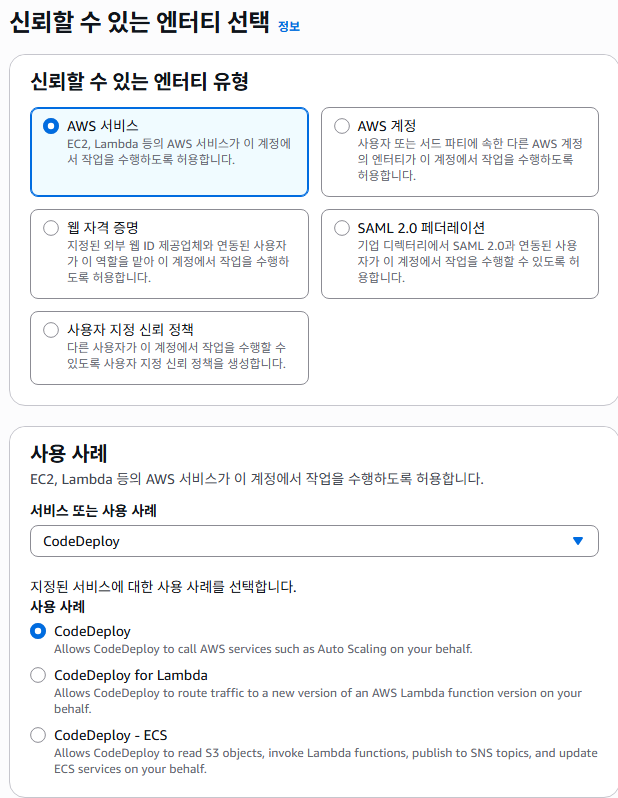

바로 앞에서 제대로 체크했다면, 권한 정책에 `AWSCodeDeployRole`이 들어와 있으면 된다


### CodeDeploy 애플리케이션 생성

애플리케이션은 배포들을 논리로 묶어주는 컨테이너

AWS 관리 콘솔에서 CodeDeploy 서비스로 이동합니다.

왼쪽 메뉴에서 애플리케이션을 클릭하고, [애플리케이션 생성] 버튼을 누릅니다.
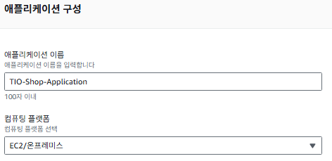
애플리케이션 이름: TIO-Shop-Application (저희 쇼핑몰 전체를 의미)

컴퓨팅 플랫폼: EC2/온프레미스 를 선택합니다.

**[애플리케이션 생성]**을 클릭합니다.


### CodeDeploy 배포 그룹 생성

배포 그룹은 `어떤 서버에, 어떤 방식으로 배포할 것인가`를 정의하는 설정


방금 만든 TIO-Shop-Application의 세부 정보 화면으로 이동하여, [배포 그룹 생성] 버튼을 클릭.

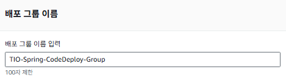
**배포 그룹 이름:** TIO-Spring-Deployment-Group


**서비스 역할:** 드롭다운 메뉴에서 우리가 만든 **TIO-CodeDeploy-Role**을 선택.

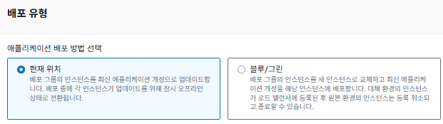
배포 유형: 현재 위치(In-place) 를 선택. (서버를 교체하지 않고, 기존 서버 위에서 애플리케이션만 업데이트하는 방식)

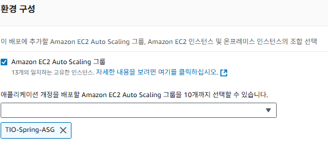
**환경 구성:**

**Auto Scaling 그룹**을 선택

방금 만든 TIO-Spring-ASG 를 선택. 이 설정을 통해 CodeDeploy는 *"아, 이 Auto Scaling Group에 속한 모든 서버가 배포 대상이구나"* 라고 인지하게 된다


배포 구성: `CodeDeployDefault.OneAtATime` 을 선택합니다. (한 번에 한 서버씩 배포하여 안정성을 높이는 방식)

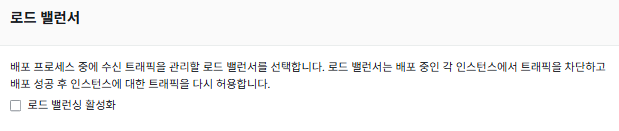

**로드 밸런서**:  
로드 밸런싱 활성화 체크박상태 검사를 통해 비정상적인 인스턴스를 자동으로 교체하고 ALB에서 제외시켜주기 때문입니다. CodeDeploy가 직접 ALB를 제어할 필요가 없습니다. 이 옵션을 끄는 것이 더 깔끔하고 권장되는 방식이라고 한다.


**[배포 그룹 생성]**을 클릭하여 완료합니다.

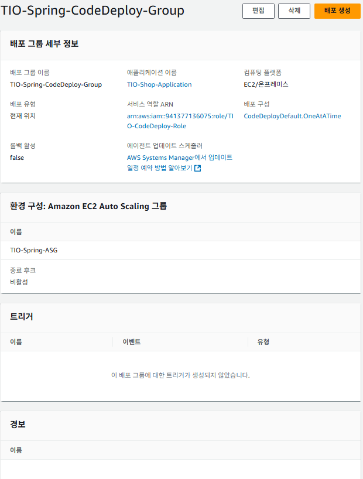

## 애플리케이션에 배포 설명서 / 스크립트 생성

> 내 서버에 도착하면 이 설명서대로 움직여주세요 라고 지시하는 문서

이 단계에서는 총 3개의 파일을 만들어서 Spring Boot 프로젝트에 추가해준다

- `appspec.yml`: 배포 프로세스의 각 단계에서 어떤 스크립트를 실행할지 정의하는 메인 설명서.
- `scripts/start_server.sh`: 새 버전의 애플리케이션을 실행하는 셸 스크립트.
- `scripts/stop_server.sh`: 이전 버전의 애플리케이션을 중지하는 셸 스크립트.

### yml 파일 생성

`build.gradle`이 위치한 최상위 루트 디렉토리에 `appspec.yml`이라는 이름의 아래 스크립트를 넣어준다.

```yaml
version: 0.0
os: linux
files:
  - source:  /
    destination: /home/ec2-user/app
    overwrite: yes

permissions:
  - object: /
    pattern: "**"
    owner: ec2-user
    group: ec2-user

hooks:
  ApplicationStop:
    - location: scripts/stop_server.sh
      timeout: 60
      runas: ec2-user
  ApplicationStart:
    - location: scripts/start_server.sh
      timeout: 60
      runas: ec2-user
```

설명:

- `files`: 배포 패키지(source: /)의 모든 내용을 EC2 서버의 /home/ec2-user/app 디렉토리로 복사하라는 지시
- `permissions`: 복사된 파일들의 소유자를 ec2-user로 설정
- `hooks`: 배포의 각 생명주기 단계에서 실행될 스크립트를 지정
- `ApplicationStop`: 새 버전을 설치하기 전에, stop_server.sh를 실행해서 구버전 앱을 먼저 중지
- `ApplicationStart`: 새 버전 파일이 모두 복사된 후, start_server.sh를 실행해서 새 버전 앱을 구동

### 배포 스크립트 파일 생성

프로젝트의 루트 디렉토리에 **`scripts`** 라는 이름의 새 폴더를 만듭니다. 그리고 그 폴더 안에 아래의 두 파일을 각각 생성하고 내용을 넣어준다.

**파일 1: `scripts/start_server.sh`**

```bash
#!/bin/bash
BUILD_JAR=$(ls /home/ec2-user/app/*.jar)
JAR_NAME=$(basename $BUILD_JAR)
echo "> build 파일명: $JAR_NAME" >> /home/ec2-user/app/deploy.log

echo "> build 파일 복사" >> /home/ec2-user/app/deploy.log
DEPLOY_PATH=/home/ec2-user/app/
cp $BUILD_JAR $DEPLOY_PATH

echo "> 현재 실행중인 애플리케이션 pid 확인" >> /home/ec2-user/app/deploy.log
CURRENT_PID=$(pgrep -f $JAR_NAME)

if [ -z $CURRENT_PID ]
then
  echo "> 현재 구동중인 애플리케이션이 없으므로 종료하지 않습니다." >> /home/ec2-user/app/deploy.log
else
  echo "> kill -15 $CURRENT_PID"
  kill -15 $CURRENT_PID
  sleep 5
fi

DEPLOY_JAR=$DEPLOY_PATH$JAR_NAME
echo "> DEPLOY_JAR 배포"    >> /home/ec2-user/app/deploy.log
nohup java -jar $DEPLOY_JAR >> /home/ec2-user/app/deploy.log 2>/home/ec2-user/app/deploy_err.log &
```

**파일 2: `scripts/stop_server.sh`**

```bash
#!/bin/bash
ps -ef | grep java | grep -v grep | awk '{print $2}' | xargs kill -15
```

**설명:**

- **`start_server.sh`**:
    1. 새로 배포된 `.jar` 파일의 이름을 찾습니다.
    2. 혹시 이전에 실행 중이던 애플리케이션이 있다면 종료
    3. `nohup` 명령어를 사용하여 터미널 연결이 끊겨도 애플리케이션이 계속 실행되도록 백그라운드에서 새 `.jar` 파일을 실행
    4. 모든 실행 로그는 `/home/ec2-user/app/deploy.log`에, 에러 로그는 `deploy_err.log`에 기록하여 나중에 문제를 추적하기 쉽게 한다
- **`stop_server.sh`**:
  - 서버에서 실행 중인 모든 `java` 프로세스를 찾아서 안전하게 종료(`kill -15`)시킨다

## GitHub Actions 워크플로우 설정

> 이 단계에서는 레포지토리에 `개발자가 코드를 push하면, 이 순서대로 빌드하고, AWS에 배포해!` 라고 지시하는 자동화 실행기(Actions 워크플로우)를 설정한다

### GitHub Actions IAM 사용자 생성 (권한 부여)

우리 AWS 계정 접속하여, S3에 파일을 올리고 CodeDeploy를 실행할 수 있도록, 전용 `IAM 사용자`를 만들고 `Access Key`를 발급한다


IAM 콘솔 \> **사용자** \> **[사용자 생성]**

**사용자 이름:** `github-actions-deployer`

**권한 설정:**
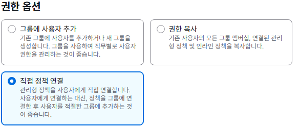

- **`직접 정책 연결`** 선택
- **[정책 생성]** 버튼을 눌러 **JSON** 편집기를 선택하고 아래 코드를 붙여넣음. (S3 업로드 및 CodeDeploy 실행에 필요한 ***최소한의 권한***)

```json
{
    "Version": "2012-10-17",
    "Statement": [
        {
            "Effect": "Allow",
            "Action": [
                "s3:GetObject",
                "s3:PutObject"
            ],
            "Resource": "arn:aws:s3:::your-artifact-bucket-name/*"
        },
        {
            "Effect": "Allow",
            "Action": [
                "codedeploy:CreateDeployment",
                "codedeploy:GetDeployment",
                "codedeploy:GetDeploymentConfig"
            ],
            "Resource": "*"
        }
    ]
}
```

- **`your-artifact-bucket-name`** 부분은 나중에 빌드 결과물을 저장할 S3 버킷 이름으로 바꿔주어야 한다.  (예: `tio-cicd-artifacts-jungle8th`)

> 맞다 또 버킷 만들어 줘야한다.. 지금까지 3개를 만든 것이다. (빌드용, 배포용, 이미지용)


정책 이름을 `GitHub-Actions-Deploy-Policy` 등으로 지정하고 저장


제대로 들어갔다면 권한이 이렇게 두 개 들어가있다.

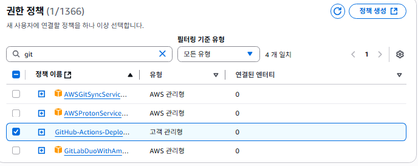

다시 사용자 생성 화면으로 돌아와, 방금 만든 `GitHub-Actions-Deploy-Policy`를 선택

사용자 생성을 완료하면, `액세스 키(Access Key ID`와 `비밀 액세스 키(Secret Access Key)`를 만들어줘야한다.

#### IAM 액세스 키 생성

만든 사용자의 세부 페이지로 들어가서, `보안 자격 증명` 탭의 `액세스 키` 항목에서 `액세스 키 만들기`로 진입해준다.


그림대로 체크하고 넘어가준다

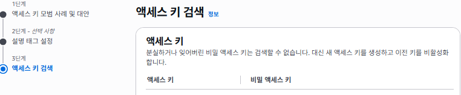

상단 팝업에 `지금이 아니면 비밀 액세스 키를 보거나 다운로드 할 수 없습니다. 나중에 복구할 수 없습니다`라고 경고한다.

어디에 잘 적어놓고(옵션), 하단의 csv 파일로 저장해준다.

### GitHub 리포지토리에 비밀 정보 저장 (Secrets)

> 끝이 보인다

배포할 Spring Boot 프로젝트의 GitHub 리포지토리로 이동

**[Settings]** \> **[Secrets and variables]** \> **[Actions]** 메뉴로 이동합니다.

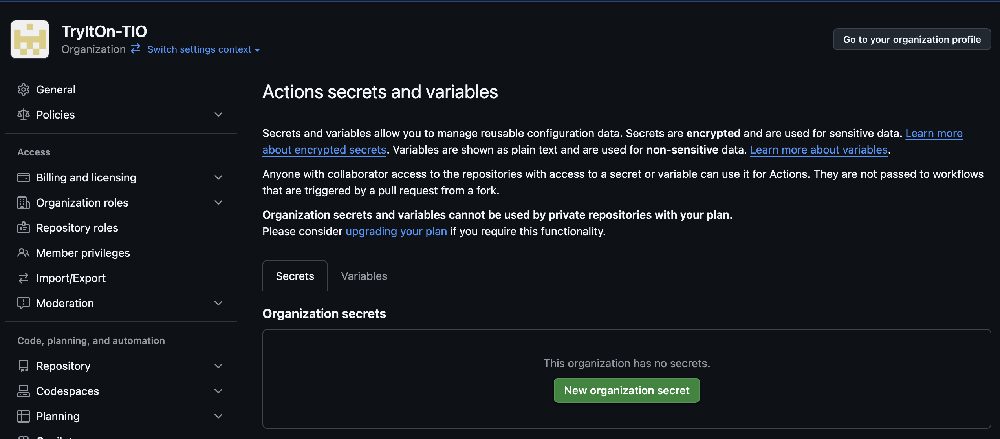

**[New repository secret]** 버튼을 클릭하여 아래 4개의 비밀 정보를 저장합니다.

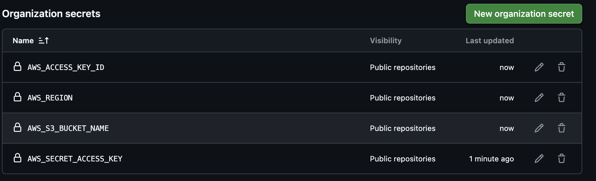

- **`AWS_ACCESS_KEY_ID`**: 방금 복사한 AWS 액세스 키 ID를 붙여넣습니다.
- **`AWS_SECRET_ACCESS_KEY`**: 방금 복사한 AWS 비밀 액세스 키를 붙여넣습니다.
- **`AWS_S3_BUCKET_NAME`**: 빌드 결과물을 저장할 S3 버킷 이름 (예: `tio-cicd-artifacts-jungle8th`)
- **`AWS_REGION`**: `ap-northeast-2`

### 워크플로우 파일 생성 (`deploy.yml`)

로컬의 Spring Boot 프로젝트 루트 디렉토리에 **`.github`** 라는 폴더를 만듭니다.

그 안에 **`workflows`** 라는 폴더를 또 만듭니다.

`workflows` 폴더 안에 **`deploy.yml`** 이라는 이름으로 새 파일을 만들고, 아래 내용을 그대로 복사하여 붙여넣어 주세요.

```yaml
name: TIO Spring CI/CD

on:
  push:
    branches: [ "main" ] # main 브랜치에 push될 때 실행됩니다.

permissions:
  contents: read

jobs:
  build-and-deploy:
    runs-on: ubuntu-latest
    steps:
    # 1. 소스 코드 다운로드
    - name: Checkout
      uses: actions/checkout@v3

    # 2. JDK 17 설치
    - name: Set up JDK 17
      uses: actions/setup-java@v3
      with:
        java-version: '17'
        distribution: 'corretto'

    # 3. Gradle 캐싱 (빌드 속도 향상)
    - name: Gradle Caching
      uses: actions/cache@v3
      with:
        path: |
          ~/.gradle/caches
          ~/.gradle/wrapper
        key: ${{ runner.os }}-gradle-${{ hashFiles('**/*.gradle*', '**/gradle-wrapper.properties') }}
        restore-keys: |
          ${{ runner.os }}-gradle-

    # 4. Gradle 권한 부여
    - name: Grant execute permission for gradlew
      run: chmod +x ./gradlew

    # 5. Spring Boot 애플리케이션 빌드
    - name: Build with Gradle
      run: ./gradlew build

    # 6. AWS 자격 증명 설정
    - name: Configure AWS credentials
      uses: aws-actions/configure-aws-credentials@v2
      with:
        aws-access-key-id: ${{ secrets.AWS_ACCESS_KEY_ID }}
        aws-secret-access-key: ${{ secrets.AWS_SECRET_ACCESS_KEY }}
        aws-region: ${{ secrets.AWS_REGION }}

    # 7. 배포 패키지 압축
    - name: Zip deployment package
      run: |
        mkdir -p deploy
        cp build/libs/*.jar deploy/application.jar
        cp appspec.yml deploy/appspec.yml
        cp -r scripts deploy/scripts
        cd deploy && zip -r deploy.zip .

    # 8. S3에 업로드
    - name: Upload to S3
      run: aws s3 cp deploy/deploy.zip s3://${{ secrets.AWS_S3_BUCKET_NAME }}/spring-app/deploy.zip

    # 9. AWS CodeDeploy 배포 실행
    - name: Deploy to AWS CodeDeploy
      run: |
        aws deploy create-deployment \
          --application-name TIO-Shop-Application \
          --deployment-group-name TIO-Spring-Deployment-Group \
          --s3-location bucket=${{ secrets.AWS_S3_BUCKET_NAME }},bundleType=zip,key=spring-app/deploy.zip
```

## **모든 준비 완료: 이제 Push만 남았다**

1. 지금까지 프로젝트에 추가한 모든 파일들(`appspec.yml`, `scripts/` 폴더, `.github/` 폴더)을 `git add`, `git commit` 합니다.
2. 그리고 **`git push origin main`** 명령어를 실행합니다.

이 Push를 하는 순간, 마법이 시작됩니다.  
GitHub 리포지토리의 **[Actions]** 탭으로 이동해보면, `TIO Spring CI/CD` 라는 워크플로우가 노란색으로 돌면서 실행되는 것을 실시간으로 확인할 수 있다.

이 워크플로우가 성공적으로 끝나면, AWS CodeDeploy 콘솔에서도 배포가 시작되고, 몇 분 안에 새로운 코드가 EC2 서버에 완벽하게 배포된다

### 이슈발생 1


'Zip deployment package' 단계에서 cp build/libs/*.jar ... 명령어가 실패

이를 위해 일단 내부에 어떤 `.jar`이 생기는지 확인하자.

`Build with Gradle` 다음 단계에 디버깅용 코드를 추가하고 push 하여, github actions의 콘솔을 확인한다.

```yaml
    # 5. Spring Boot 애플리케이션 빌드
    - name: Build with Gradle
      run: ./gradlew build

    # --- [추가] 디버깅용 단계 ---
    - name: Check for JAR file
      run: |
        echo "--- Checking the contents of build/libs directory ---"
        ls -l build/libs
    # --- 여기까지 추가 ---

    # 6. AWS 자격 증명 설정
    - name: Configure AWS credentials
      # ... 이하 생략 ...

```

#### actions 실행 결과


### 원인 : 기대한 SNAPSHOT.jar가 아닌 SNAPSHOT-plain.jar와 같이 두개의 파일이 존재

`core-0.0.1-SNAPSHOT-plain.jar` (라이브러리만 담긴 작은 파일)  
`core-0.0.1-SNAPSHOT.jar` (실행 가능한 모든 것이 포함된 큰 파일)

actions의 `deploy.yml`을 보면 run에서 `*.jar`으로 모든 파일을 집어오게하여, 우리가 원하는 파일이 아닌 것 까지 가져와서 실패한 것이다.

```yaml
    # 7. 배포 패키지 압축
    - name: Zip deployment package
      run: |
        mkdir -p deploy
        cp build/libs/*.jar deploy/application.jar
        cp appspec.yml deploy/appspec.yml
        cp -r scripts deploy/scripts
        cd deploy && zip -r deploy.zip .
```

### 해결 : run 스크립트를 변경하여, 정확한 파일만 가져오도록 변경

- 기존: `cp build/libs/*.jar deploy/application.jar`
- 변경: `cp $(find build/libs -name "*.jar" ! -name "*-plain.jar") deploy/application.jar`

`build/libs`폴더에서 .jar로 끝나지만, -plain.jar는 아닌 파일만 찾아내는 명령어이다.

이제 수정해서 다시 실행해보자.

### 이슈 발생 2


### 원인 : 배포 그룹을 찾을 수 없음

deploy.yml의 배포 그룹이 일치하지 않거나, 다른 리전일 경우가 될 수 있다.

CodeDeploy 애플리케이션 > `TIO-Shop-Application` > 배포 그룹을 보면

`TIO-Spring-CodeDeploy-Group`이라고 되어있다.
코드를 보면.

```yaml
      # 9. AWS CodeDeploy 배포 실행
      - name: Deploy to AWS CodeDeploy
        run: |
          aws deploy create-deployment \
            --application-name TIO-Shop-Application \
            --deployment-group-name TIO-Spring-Deployment-Group \
            --s3-location bucket=${{ secrets.AWS_S3_BUCKET_NAME }},bundleType=zip,key=spring-app/deploy.zip
```

맞다.. 내가 틀렸다 😭 그냥 yaml을 CodeDeploy 애플리케이션의 배포 그룹명으로 맞춰주면 끝난다.

### 이슈 3 : 접근 거부 (권한 문제?)

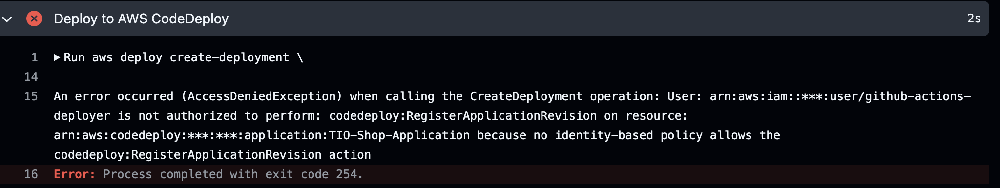

제미나이를 통해 도움받아서 작성한 IAM 정책이 `부족한 부분`이 있었나보다.

### 원인 : 권한 부족

CodeDeploy의 `create-deployment` 명령어는 내부적으로 여러 개의 세부적인 권한(예: 개정판 등록, 배포 그룹 정보 가져오기 등)을 필요.  
또한, CodeDeploy 서비스가 우리의 EC2에 배포 작업을 수행할 수 있도록 역할을 넘겨주는 `iam:PassRole` 권한도 필수적임

### 해결: 정책 수정

actions 전용으로 만들어준 IAM 유저인 `github-actions-deployer`의 정책을 수정해준다.
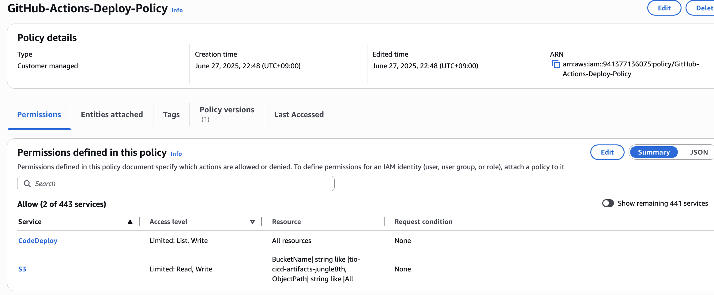

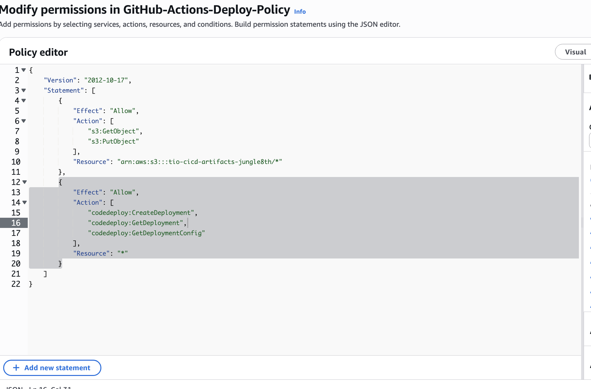

```json
{
    "Version": "2012-10-17",
    "Statement": [
        {
            "Sid": "S3ArtifactAccess",
            "Effect": "Allow",
            "Action": [
                "s3:GetObject",
                "s3:PutObject"
            ],
            "Resource": "arn:aws:s3:::your-artifact-bucket-name/*"
        },
        {
            "Sid": "CodeDeployActions",
            "Effect": "Allow",
            "Action": [
                "codedeploy:CreateDeployment",
                "codedeploy:GetDeployment",
                "codedeploy:GetDeploymentConfig",
                "codedeploy:GetApplicationRevision",
                "codedeploy:RegisterApplicationRevision",
                "codedeploy:GetDeploymentGroup"
            ],
            "Resource": "*"
        },
        {
            "Sid": "CodeDeployRolePassing",
            "Effect": "Allow",
            "Action": "iam:PassRole",
            "Resource": "arn:aws:iam::YOUR_AWS_ACCOUNT_ID:role/TIO-CodeDeploy-Role"
        }
    ]
}
```

수정할 부분:

- `your-artifact-bucket-name`: 이전에 GitHub Secret에 저장했던 S3 버킷 이름으로 변경. (예: tio-cicd-artifacts)
- `YOUR_AWS_ACCOUNT_ID`: 본인의 12자리 AWS 계정 ID로 변경. (콘솔 오른쪽 상단에서 확인 가능, `-`는 빼고 숫자만)
  - 왜 내 AWS 계정 id를 넣어줘야하나? : 관리자의 권한 위임을 해준다는 개념으로 이해하면됨

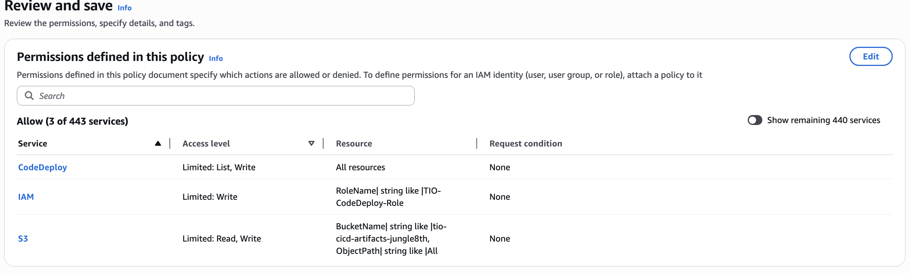

정책을 수정해주면, 아래와 같이 `IAM` 권한이 하나 더 생겼다.

## 진짜 끝


github actions가 다 정상적으로 돌아갔고, 배포에 성공했다! 🎉

(아마도?)

## 성공 확인하기

### 1. CodeDeploy 배포 콘솔 확인


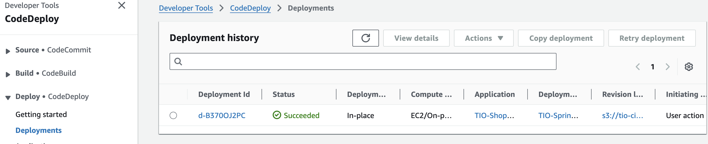

이상없다 😭

### 2. EC2 서버 직접 확인 (애플리케이션 실행 여부)

CodeDeploy가 성공했더라도, Spring Boot 애플리케이션 자체가 실행 중에 오류를 일으켜 바로 종료되었을 수도 있다고 한다. (예: DB 접속 정보 오류, 설정 파일 누락 등)

SSH 포트를 닫았으므로, SSM 세션 관리자를 통해 서버에 안전하게 접속하여 직접 확인 해야한다.

1. **EC2 콘솔** \> **인스턴스**로 이동


1. `TIO-Spring-Server` 중 하나를 선택하고, 상단의 **[연결(Connect)]** 버튼을 클릭


1. **'세션 관리자(Session Manager)'** 탭을 선택하고, **[연결]** 버튼 클릭 (브라우저에 검은색 터미널 창이 나타난다)


4. 터미널에 아래 명령어들을 입력하여 확인

      - **프로세스 확인:** `java` 프로세스가 실행 중인지 확인

        ```bash
        ps -ef | grep java
        ```

        

        명령어를 실행했을 때, `... application.jar` 와 같은 내용이 보인다면 성공적으로 실행 중인 것, 아무것도 나타나지 않는다면 실행에 실패한 것...

      - **배포 로그 확인:** 저희가 `start_server.sh`에 설정한 로그 파일을 확인하여 배포 과정에 문제가 없었는지 본다

        ```bash
        cat /home/ec2-user/app/deploy.log
        ```

        

        선명히 보이는 `permission denied`.. 원인이 뭘까?
        ssm으로 접속했을때와 파일을 생성할때의 사용자 정보가 다르다고한다. 그럼 우리는 마법의 주문인 `sudo` 를 사용하면 된다.

        

        ```bash
        sudo cat /home/ec2-user/app/deploy.log
        ```

      - **애플리케이션 에러 로그 확인 (가장 중요\!):** 애플리케이션 실행 실패 시, 원인이 여기에 기록된다.

        ```bash
        cat /home/ec2-user/app/deploy_err.log
        ```

        "DB에 연결할 수 없습니다", "설정 파일을 찾을 수 없습니다" 등의 구체적인 에러 메시지가 있는지 확인한다.

        `없다` 만세!!!!!!!!!!!!!!!!!!!!!!!!!

### **3단계: 대상 그룹 상태 확인 (가장 확실한 건강 상태)**

이것이 \*\*"애플리케이션이 외부의 요청을 받을 준비가 되었는가"\*\*를 확인하는 가장 확실한 방법이라고한다

1. **EC2 콘솔** \> \*\*대상 그룹(Target Groups)\*\*으로 이동
2. `TargetGroup-Spring-App`을 선택하고, 아래의 **[대상(Targets)] 탭**을 클릭

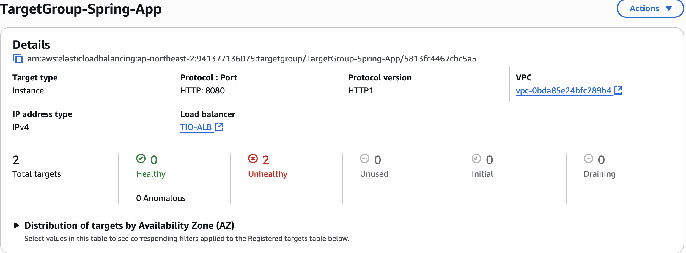
3. 등록된 인스턴스 2개의 상태(Status)를 확인합니다.
      - 상태가 녹색으로 **`healthy`** 라고 표시되어 있다면, 이는 ALB가 주기적으로 EC2 서버의 `/actuator/health` 경로로 신호를 보냈고, Spring Boot 애플리케이션이 "저 건강해요\!" 라는 정상적인 응답(HTTP 200 OK)을 보내줬다는 의미. **이 상태라면 애플리케이션이 완벽하게 구동 중이라고 확신할 수 있다고한다.**
      - 만약 `unhealthy`라면, 애플리케이션이 응답하지 않거나 에러를 반환한다는 뜻이므로 2단계의 에러 로그를 다시 확인해야 한다.
      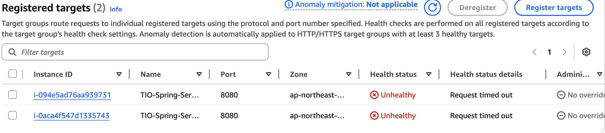

### 원인찾기

'Unhealthy' 상태는 로드밸런서(ALB)가 EC2 서버에게 "잘 지내?" 라고 안부 인사(Health Check)를 보냈는데, 서버가 "나 아파" 라고 응답하거나, 아예 응답조차 하지 않았다는 뜻  
원인은 여러 가지일 수 있으니, 아래 순서대로 차근차근 점검하면 된다.

#### **1단계: 애플리케이션 로그 확인 (가장 먼저\!)**

가장 흔한 원인은 **애플리케이션이 실행되다가 에러가 나서 바로 종료**되는 경우

1. 이전과 같이 **SSM 세션 관리자**로 EC2 인스턴스 중 하나에 접속합니다.
2. `ec2-user`로 변신한다.

    ```bash
    sudo su - ec2-user
    ```

    실행하면 커맨드 라인이 `sh-5.2$`에서 `[ec2-user@ip-어쩌구 -]$`로 바뀐다.
3. **에러 로그 파일**을 확인하여 애플리케이션이 왜 죽었는지 확인합니다. 이 파일에 모든 단서가 들어있을 확률이 가장 높습니다.

    ```bash
    cat /home/ec2-user/app/deploy_err.log
    ```

      - 혹시 `DB 접속 정보가 틀렸습니다`, `설정 파일을 찾을 수 없습니다`, `필요한 Bean을 찾을 수 없습니다` 같은 Spring Boot 에러 메시지가 있는지 확인해 보자
      
      이렇게 아무것도 안뜨고 다음 줄로 넘어가면 2단계로 넘어가면된다.

#### **2단계: EC2 인스턴스 내부에서 직접 상태 검사**

애플리케이션은 실행 중이지만 상태 검사 요청에 제대로 응답하지 못하는 경우일 수 있다고한다.  
서버 내부에서 직접 테스트해 보자

1. 위와 같이 SSM으로 서버에 접속한 상태에서, 아래 명령어를 실행

    ```bash
    curl -v http://localhost:8080/actuator/health
    ```

    이 명령어는 서버 자기 자신에게 상태 검사 요청을 보내보는 것이라고한다
    

2. **결과를 확인**

      - **정상적인 경우:** 출력 메시지 중에 `< HTTP/1.1 200 OK` 와 함께 `{"status":"UP"}` 같은 JSON 응답이 보인다. 이렇다면 애플리케이션 자체는 건강한 것이다
      - **비정상적인 경우:**
          - `Connection refused`: 8080 포트에서 아무것도 실행되고 있지 않다는 뜻
          (1단계의 `ps -ef | grep java`로 다시 확인)
          - `404 Not Found`: `/actuator/health` 라는 경로가 존재하지 않는다는 뜻, 혹시 `build.gradle`에 `spring-boot-starter-actuator` 의존성을 추가했는지 확인
          - `500 Internal Server Error` 또는 `503 Service Unavailable`: 앱이 실행은 됐지만, DB 연결 실패 등으로 인해 스스로 '아프다'고 응답하는 경우 (1단계 에러 로그 확인)

> 우리는 `HTTP/1.1 403`을 뱉고있다
> 이 말은, `요청 주소는 존재하지만, 접근할 권한이 없다` 라는 의미로 다음 단계로 넘어가면된다.

### 최종 원인 발견 : Spring Security 설정

Spring Boot의 `spring-boot-starter-security` 의존성이 있으면 모든 엔드포인트를 보호한다.

#### 해결 : `application.yml` 또는 `application.properties`파일 수정

`application.yml 파일

```yaml
management:
  endpoints:
    web:
      exposure:
        include: "health"  # health 엔드포인트만 외부에 노출하도록 허용
  endpoint:
    health:
      show-details: never  # 보안을 위해 상세 정보는 노출하지 않음
```

`application.properties` 파일 아래 두 줄 추가

```properties
management.endpoints.web.exposure.include=health
management.endpoint.health.show-details=never
```

- management.endpoints.web.exposure.include: "health": Actuator의 여러 웹 엔드포인트 중에서, health 엔드포인트만은 인증 없이도 접근할 수 있도록 외부에 노출(expose)하겠다는 설정

- management.endpoint.health.show-details: never: 상태가 'UP'인지 'DOWN'인지만 보여주고, 어떤 데이터베이스에 연결되었는지 같은 민감한 상세 정보는 절대 노출하지 않도록 설정하는 것 (보안)

### 여전히 403

다시 배포 완료하고 헬스체크해도 HTTP/1.1 403을 뱉는다.

SecurityConfig에 health 엔드포인트를 직접적으로 추가해준다.

내부적인 원인은 `.anyRequest().authenticated()` 구문에 의해서인데. 이친구가 "지금까지 허용한 주소들 외의 다른 모든 요청은 무조건 인증이 필요하다"라는 강력한 규직을 준 것임.

그래서 `requestMathcers` 최 상단에 추가해준다.

1. build.gradle에 의존성 추가: `implementation 'org.springframework.boot:spring-boot-starter-actuator'
`
1. `SecurityConfig.java`

기존에 만들어진 SecurityConfig.java가 있어서, `import문`과, `health Check 허용 규칙`을 추가했다.

```java
import org.springframework.boot.actuate.autoconfigure.security.servlet.EndpointRequest;

public class SecurityConfig {

        // 인가 정책 (수정된 부분)
        http.authorizeHttpRequests(auth -> auth
            // --- [이 부분 추가!] ---
            .requestMatchers(EndpointRequest.to("health")).permitAll() // Health Check는 모두에게 허용
            // --- 여기까지 추가 ---
            .requestMatchers(
            "/", "/auth/**", "/h2-console/**",
            "/swagger-ui/**", "/v3/api-docs/**", "/swagger-resources/**", "/webjars/**"
            ).permitAll()
            .requestMatchers("/admin").hasRole("ADMIN")
            .requestMatchers("/product").hasAnyRole("ADMIN", "USER")
            .anyRequest().authenticated()
        )

}
```

그리고 다시 헬스체크 해본다.

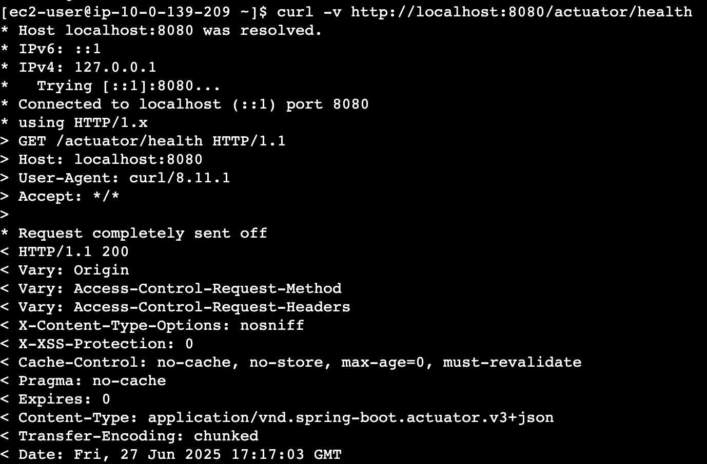

야호!!!! 200이다

## 다시 이어서 성공확인하기

### **4단계: ALB 엔드포인트로 API 테스트 (최종 관문)**

대상 그룹이 `healthy`인 것을 확인했다면, 이제 외부 세계에서 실제 API를 호출해볼 차례입니다.

1. **EC2 콘솔** \> \*\*로드 밸런서(Load Balancers)\*\*로 이동합니다.


2. `TIO`를 선택하고, 세부 정보에서 \*\*DNS 이름(DNS name)\*\*을 복사. (예: `TIO-ALB-173623777.ap-northeast-2.elb.amazonaws.com`)
3. Postman 같은 API 테스트 도구나, 웹 브라우저 주소창에 `http://<복사한-ALB-DNS-이름>/` 또는 테스트용으로 만들어두신 API 경로를 입력하여 호출
4. 정상적인 JSON 응답이나 웹페이지가 보인다면, 모든 과정이 성공적으로 끝난 것

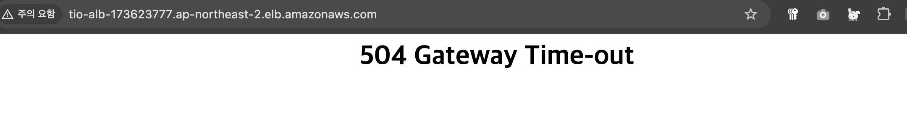

### 504...?

겁내지말자 오히려 긍정적인 신호이다.  
`Unhealthy가 아님` → 이제 ALB가 보낸 Health Check에 서버가 정상적으로 응답
`403 Forbidden이 아님` → 보안 설정도 통과

- 이 상황은 사용자(나)의 요청이 ALB에 성공적으로 도착

- ALB는 건강한 EC2 서버를 찾아 그 요청을 성공적으로 전달

- EC2 서버의 Spring Boot 애플리케이션이 요청을 받았지만, 응답을 보내주는 데 너무 오랜 시간이 걸림

- 참을성 있게 기다리던 ALB가 결국 "더는 못 기다리겠다"며 포기하고, 사용자에게 "게이트웨이(백엔드 서버)에서 시간 초과가 발생했습니다" 라는 504 에러를 대신 보내준 것

가장 흔한 이유는 `DB 연결 중 첫 시도에서 실패하는것` 이라고 한다.

에러 로그부터 확인한다. `sudo su - ec2-user`, `cat /home/ec2-user/app/deploy_err.log`

아무것도 안뜬다.

#### RDS 확인하기

콘솔로 가서 `tio-db`의 엔드포인트 주소를 복사한다
`tio-db.cjgee4eswvls.ap-northeast-2.rds.amazonaws.com`

인스턴스 SSM 콘솔로 다시 들어가서,
`nc -zv RDS-엔드포인트-주소 3306`을 입력한다
> nc는 네트워크 연결을 테스트하는 도구  
> -zv는 연결 과정의 상세한 결과 (verbose)를 보여주고 실제 데이터는 안보내고 연결 가능 여부만 확인한다(zero-I/O).

안되면 아래 코드로 진행한다

```bash
timeout 10 bash -c '</dev/tcp/tio-db.cjgee4eswvls.ap-northeast-2.rds.amazonaws.com/3306' && echo "SUCCESS: Port is open" || echo "FAILURE: Port is closed or blocked"
```

`SUCCESS: Port is open`  
이 메시지가 나타나면, 네트워크와 보안 그룹 설정에 아무런 문제가 없다는 100% 확실한 증거. 문제는 애플리케이션의 설정(DB 주소, 자격 증명 등)에 있다.

`FAILURE: Port is closed or blocked`  
이 메시지가 나타나면, 문제는 100% 네트워크 또는 보안 그룹 문제라는 확실한 증거. 이 경우 TIO-DB-SG의 인바운드 규칙에 TIO-Spring-EC2-SG가 3306 포트로 허용되어 있는지 다시 점검


### 원인 : 로컬 개발용 H2 설정문제

`application.properties`의 DB 설정이 문제였다.

`spring.datasource.url=jdbc:h2:mem:testdb`

1. **H2 인메모리 DB 사용:** 이 설정은 Spring Boot가 시작될 때, 외부의 실제 데이터베이스(RDS)에 연결하는 대신, **애플리케이션 내부 메모리에 임시 테스트용 데이터베이스를 만들어서 사용**하라는 의미
2. **Health Check 통과:** 애플리케이션은 시작할 때 이 가짜 DB에 성공적으로 연결. 따라서 `/actuator/health` 상태 검사도 '성공(Healthy)'으로 응답 했던것
3. **실제 API 요청 → 504 Timeout:** 하지만 ALB를 통해 실제 API 요청이 들어와서, 애플리케이션이 **실제 데이터(상품, 회원 정보 등)를 조회하려고 할 때**, 코드는 RDS가 아닌 텅 빈 H2 메모리에 쿼리를 날리게 되고, 이 과정에서 예상치 못한 오류가 발생하거나 DB 커넥션을 새로 맺으려다 무한 대기 상태에 빠져, 결국 ALB의 타임아웃 시간(60초)을 초과하여 `504 Gateway Timeout` 에러가 발생한 것

-----

### **최종 문제 현상**

- **`504 Gateway Timeout`**: 로드 밸런서(ALB)를 통해 API를 호출하면, 서버가 응답하지 않아 시간 초과 에러가 발생한다.
- **`Healthy` 상태**: 하지만 대상 그룹의 EC2 인스턴스들은 모두 `Healthy` 상태로, `/actuator/health` 상태 검사는 정상적으로 통과하고 있다.

### **결론: 진짜 문제의 본질**

문제의 본질은 \*\*"애플리케이션이 클라우드 환경에서 실제 데이터베이스(RDS)가 아닌, 로컬 테스트용 가짜 데이터베이스(H2 인메모리)를 사용하도록 설정되어 있었다"\*\*는 것

이로 인해, 애플리케이션 자체는 정상적으로 시작하고 가짜 DB에 연결하여 `Healthy` 상태를 유지했지만, 실제 데이터가 필요한 API 요청이 들어오자 RDS에 연결을 시도하다가 설정이 없어 실패하고 무한 대기 상태에 빠져 `504` 타임아웃을 유발했던 것

-----

### **최종 해결책: Spring 프로파일을 이용한 환경 분리**

이 문제를 근본적으로 해결하고, 다른 팀원들의 로컬 개발 환경까지 고려하는 가장 올바른 방법은 **Spring Boot의 '프로파일(Profiles)' 기능을 사용**하는 것
> 프로파일이란? Spring Boot에서 제공하는 것을 특정 환경(local, dev, prod 등)에 따라 다른 설정파일을 로드함.

- application-local.properties: 파일 이름만 정확히 만들고, 안에는 H2 관련 설정만 넣는다.
- application.properties: 클라우드(RDS) 관련 설정을 넣고, 맨 위에 spring.profiles.active=local 한 줄만 추가하여 로컬 개발자들이 아무 설정 없이 실행해도 H2가 켜지도록 배려해준다.

#### **1단계: `build.gradle` 의존성 추가**

RDS 및 Secrets Manager 연결에 필요한 라이브러리를 추가

```groovy
// 'Spring Cloud AWS'의 버전 목록표(BOM)를 import 합니다.
dependencyManagement {
 imports {
  // Spring Boot 3.x 버전에 맞는 Spring Cloud AWS의 BOM
  mavenBom "io.awspring.cloud:spring-cloud-aws-dependencies:3.1.1"
 }
}
dependencies {
    // ...
 implementation 'io.awspring.cloud:spring-cloud-aws-starter-secrets-manager'
    runtimeOnly 'com.mysql:mysql-connector-j'
    // ...
}
```

#### **2단계: 로컬 개발용 설정 파일 생성 (`application-local.properties`)**

`src/main/resources` 폴더에, 로컬에서만 사용할 H2 DB 설정을 담은 새 파일 생성

**`application-local.properties` 내용:**

```properties
# 'local' 프로파일 전용: H2 인메모리 DB 사용
spring.datasource.url=jdbc:h2:mem:testdb
spring.datasource.driver-class-name=org.h2.Driver
spring.datasource.username=sa
spring.datasource.password=
spring.jpa.hibernate.ddl-auto=create-drop
spring.h2.console.enabled=true
```

#### **3단계: 기본 설정 파일 수정 (`application.properties`)**

기존 `application.properties`의 내용을 **클라우드 배포용 설정**으로 완전히 교체하고, **기본 프로파일을 `local`로 지정**

**`application.properties` 내용:**

```properties
# 기본 프로파일은 'local'로 활성화 (로컬 개발자를 위함)
spring.profiles.active=local

# --- 아래는 'local'이 아닌 다른 프로파일(dev, prod)에서 사용될 설정 ---
spring.application.name=core

# AWS Secrets Manager 연동 설정
spring.config.import=aws-secretsmanager:tio/db/credentials

# DataSource 및 JPA 설정 (MySQL/RDS용)
spring.datasource.driver-class-name=com.mysql.cj.jdbc.Driver
spring.jpa.hibernate.ddl-auto=update
spring.jpa.properties.hibernate.dialect=org.hibernate.dialect.MySQLDialect

# ... (oauth, actuator 설정은 기존과 동일) ...
```

#### **4단계: 배포 스크립트 수정 (`scripts/start_server.sh`)**

EC2 서버에서 앱을 실행할 때, **`dev` 프로파일을 강제로 활성화**하도록 실행 명령어에 옵션을 추가.

**`start_server.sh`의 마지막 실행 부분:**

```bash
# --spring.profiles.active=dev 옵션을 추가
nohup java -jar $DEPLOY_JAR --spring.profiles.active=dev >> /home/ec2-user/app/deploy.log 2>/home/ec2-user/app/deploy_err.log &
```

-----

**핵심 설정:**
`spring.config.import=aws-secretsmanager:tio/db/credentials`

Spring Boot가 시작될 때 AWS Secrets Manager에 접속해서 `tio/db/credentials` 라는 비밀을 찾아, 그 안에 있는 `host`, `port`, `username`, `password`, `dbname` 같은 값들을 자동으로 `spring.datasource.*` 속성에 주입해줌.  
더 이상 코드에 민감한 정보를 적을 필요가 없다.

-----

## 🔧 CI/CD 환경에서 발생한 추가 문제 해결

### 문제 1: AWS Secrets Manager 의존성으로 인한 테스트 실패

**현상**: CI/CD 파이프라인에서 `ConfigDataResourceNotFoundException` 및 `SdkClientException` 발생

**원인**: 테스트 환경에서 AWS Secrets Manager에 접근할 수 없음

**해결책**: 환경별 설정 파일 분리 및 테스트 전용 설정 추가

#### 추가된 설정 파일들

1. **`src/test/resources/application.properties`** (단위 테스트용)

```properties

# 테스트 환경용 설정 - AWS 의존성 제거

spring.application.name=core
spring.h2.console.enabled=true
spring.datasource.url=jdbc:h2:mem:testdb
spring.datasource.driver-class-name=org.h2.Driver
spring.datasource.username=sa
spring.datasource.password=
spring.jpa.hibernate.ddl-auto=create-drop
spring.jpa.properties.hibernate.dialect=org.hibernate.dialect.H2Dialect
```

2. **`src/main/resources/application-ci.properties`** (CI/CD용)

```properties
# CI/CD 환경용 설정 - AWS 의존성 제거하되, MySQL 환경유지
spring.application.name=core

# MySQL 테스트 데이터베이스 설정 (CI/CD에서 제공되는 MySQL 서비스 사용)
spring.datasource.driver-class-name=com.mysql.cj.jdbc.Driver
spring.datasource.url=jdbc:mysql://localhost:3306/test_db?useSSL=false&allowPublicKeyRetrieval=true&serverTimezone=UTC
spring.datasource.username=root
spring.datasource.password=test_password

# JPA 설정 (MySQL 방언 사용)
spring.jpa.hibernate.ddl-auto=create-drop
spring.jpa.properties.hibernate.dialect=org.hibernate.dialect.MySQLDialect
spring.jpa.show-sql=true

# OAuth 환경변수 사용 (CI/CD에서 환경변수로 제공)
spring.security.oauth2.client.registration.google.client-id=${OAUTH_ID:test-client-id}
spring.security.oauth2.client.registration.google.client-secret=${OAUTH_PASSWORD:test-client-secret}
spring.security.oauth2.client.registration.google.scope=email,profile

# Actuator 설정
management.endpoints.web.exposure.include=health
management.endpoint.health.show-details=never

```

3. **테스트 클래스 수정** (`CoreApplicationTests.java`)

```java
@SpringBootTest(properties = {
   "spring.config.import=",
   "spring.cloud.aws.secretsmanager.enabled=false",
   "spring.cloud.aws.region.static=us-east-1",
   "spring.cloud.aws.credentials.access-key=test",
   "spring.cloud.aws.credentials.secret-key=test"
})
```

4. **build.gradle 테스트 설정 추가**

```gradle
tasks.named('test') {
   useJUnitPlatform()
   systemProperty 'spring.profiles.active', 'test'
   systemProperty 'spring.config.import', ''
}
```

### 문제 2: CI/CD 파이프라인에서 배포 파일 누락

**현상**: `cp: cannot stat 'appspec.yml': No such file or directory`

**원인**: develop 브랜치에 CI/CD 관련 파일들이 누락됨

**해결책**:

- `appspec.yml` 파일 복원
- `scripts/` 폴더 및 배포 스크립트 복원
- GitHub Actions 워크플로우에 `feat/cicd` 브랜치 트리거 추가

#### GitHub Actions 워크플로우 수정

yaml
on:
 push:
   branches: [ "main" , "develop", "feat/cicd"]

### 최종 환경별 설정 정리

| 환경 | 프로파일 | 데이터베이스 | 용도 |
|------|----------|--------------|------|
| **로컬 개발** | `local` | H2 (인메모리) | 개발자 로컬 환경 |
| **단위 테스트** | `test` | H2 (인메모리) | 빠른 단위 테스트 |
| **CI/CD 테스트** | `ci` | MySQL | 통합 테스트 환경 |
| **운영 서버** | `dev` | RDS MySQL | 실제 운영 환경 |

## 팀원과 협업을 위한 추가설정

### 환경변수 비밀 설정

CI에서는 `GitHub Secrets`를 사용하고, 실제 배포 환경(dev)에서는 `AWS Secrets Manager`를 사용하도록 분리해야한다.

#### github action

로컬 .env 환경이나, 서버 외의 github secret에도 추가시킨 이유는 `github action`에서 AWS로 넘겨주기 전, 이후 만들어질, 각종 `테스트(단위, 전체)를 실행 후` 빌드하고 S3로 넘겨주기 위해서이다.

github actions에서 테스트를 돌리기위해선 변수가 필요하지않겠는가? 그래서 암호화된 변수로 넣어주는 것이다

테스트가 끝나고 가상머신이 사라지면, 이 비밀값도 사라지니 걱정말자.

OAuth와 email login을 사용하기 위해 몇개의 환경변수가 있는데, 이를 Github repository setting > Secrets and variables > actions > secrets에서 추가해준다.

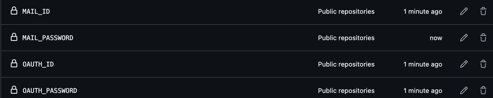

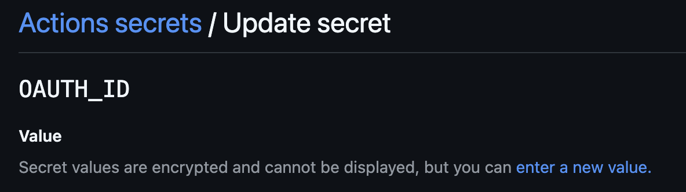
이는 암호화되어, 사용자가 다시 열어봐도 확인할수 없다.
.

이를 위해서 `deploy.yml`도 수정해주어야한다

전

```yaml
      # 5. Spring Boot 애플리케이션 빌드
      - name: Build with Gradle
        run: ./gradlew build
```

후

```yaml
      # 5. Spring Boot 애플리케이션 빌드
      - name: Build and Test with Gradle
        # 이 단계에서만 사용할 환경 변수를 GitHub Secrets에서 가져와 설정합니다.
        env:
          OAUTH_ID: ${{ secrets.OAUTH_ID }}
          OAUTH_PASSWORD: ${{ secrets.OAUTH_PASSWORD }}
          MAIL_ID: ${{ secrets.MAIL_ID }}
          MAIL_PASSWORD: ${{ secrets.MAIL_PASSWORD }}
        run: ./gradlew build -Dspring.profiles.active=ci
```

#### AWS Secrets Manager  비밀 생성

서버 운영 환경에서 사용하기 위한 비밀도 생성해준다.

지금 가지고 있는 환경변수는 `OAuth 자격증명`, `JWT 비밀키`, `mail 자격증명` 이렇게 세가지이다.

- 이 친구들의 역할은 빌드와 테스트가 모두 끝나고, 최종 .jar 파일이 EC2 서버에 배포된다.

- 배포 스크립트(start_server.sh)가 --spring.profiles.active=dev 옵션과 함께 애플리케이션을 실행시킨다

- 애플리케이션은 dev 프로파일이 활성화된 것을 보고, application-dev.properties 파일을 읽는다

- 이 파일 안의 spring.config.import=aws-secretsmanager:... 설정을 보고, EC2 서버가 직접 AWS Secrets Manager에 접속하여 데이터베이스와 OAuth 비밀번호를 실시간으로 가져옴

- 이 방식 덕분에, EC2 서버 어디에도 비밀번호가 파일 형태로 저장되지 않아 매우 안전하게 다뤄진다.

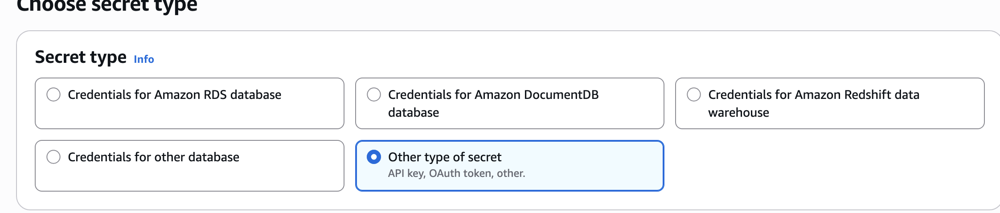

**OAuth 자격증명: `tio/oauth/google`**  

기존 환경변수에서 문자로 치환하여 호출하던 Key말고, `spring.config.import`로 AWS Secret을 호출하도록 외부 설정파일을 가져오도록 한다.
그래서 Key값을 입력해주고

그에 맞는 value를 넣고 입력해주면된다.

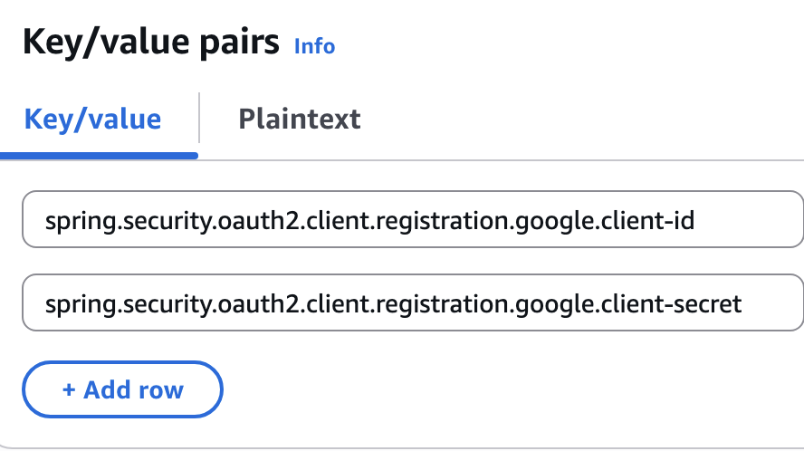
value는 비밀😉 이다

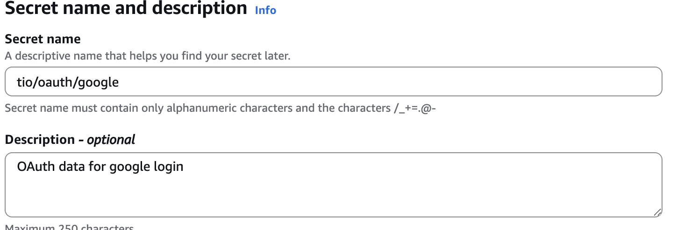
이름은 `tio/oauth/google`로 명명해준다.

> 이렇게 키 이름을 application.properties의 전체 속성 이름과 똑같이 만들면, Spring Cloud AWS가 이 값을 가져와서 '아, 이건 이 설정에 대한 값이구나!' 하고 자동으로 정확한 위치에 값을 주입해줌


**JWT 비밀키 : `tio/jwt`**

키랑 이름빼고 넣는법은 동일하다.  
키는 `spring.jwt.secret`으로 넣어준다.

**Mail 자격증명 : `tio/mail`**
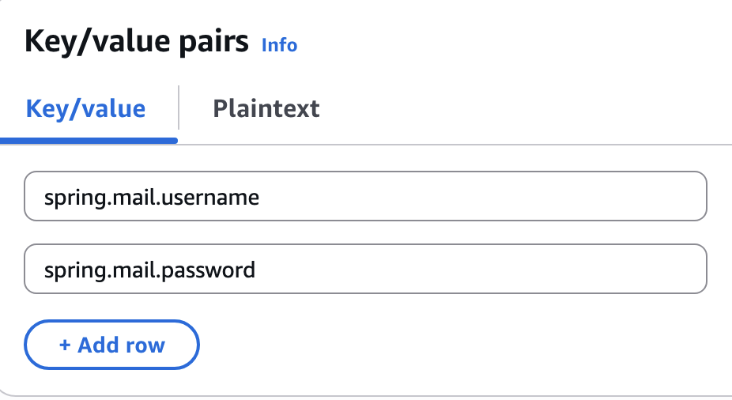
`spring.mail.username`, `spring.mail.password` 두개의 키와 그 value를 넣어준다.

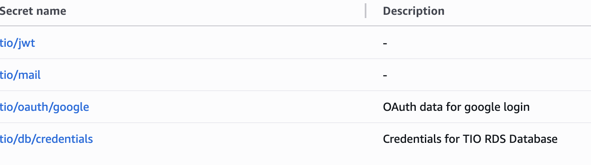

4개의 비밀이 생겼다.

#### IAM 정책 모든 비밀 접근 권한 추가

이제 우리 EC2 서버(TIO-EC2-Role 역할)가 이 4개의 비밀을 모두 읽을 수 있도록 허가해줘야 합니다.

- IAM 콘솔 > 역할 > **TIO-EC2-Role**을 선택합니다.

- Allow-TIO-DB-Secret-Read 라는 이름으로 만들었던 인라인 정책을 찾아 **[편집]**을 누릅니다.

- JSON 탭에서, Resource 부분을 **4개 비밀의 ARN이 모두 포함된 배열([])**로 수정
- 아래 그대로 복사하면 안된다. Resource를 다 각 비밀에서 arn을 복사해와야한다.

```json
{
    "Version": "2012-10-17",
    "Statement": [
        {
            "Sid": "AllowReadMultipleSecrets",
            "Effect": "Allow",
            "Action": "secretsmanager:GetSecretValue",
            "Resource": [
                "arn:aws:secretsmanager:ap-northeast-2:ACCOUNT_ID:secret:tio/db/credentials-xxxxxx",
                "arn:aws:secretsmanager:ap-northeast-2:ACCOUNT_ID:secret:tio/oauth/google-yyyyyy",
                "arn:aws:secretsmanager:ap-northeast-2:ACCOUNT_ID:secret:tio/jwt-zzzzzz",
                "arn:aws:secretsmanager:ap-northeast-2:ACCOUNT_ID:secret:tio/mail-aaaaaa"
            ]
        }
    ]
}
```

-----

## ⚙️ 최종 spring CICD 설정 (Properties) 대전쟁: 그 끝을 기록하며

모든 인프라를 다 구축했는데, 왜 애플리케이션은 `504 Gateway Timeout`을 뱉으며 우리를 그토록 괴롭혔을까? 문제는 로컬, 테스트, 운영이라는 각기 다른 환경을 모두 아우르는 \*\*'설정(Configuration)'\*\*에 있었다.

단순히 하나의 `application.properties` 파일만으로는 로컬 개발의 편의성과 클라우드 배포의 보안성을 동시에 만족시킬 수 없었다. 수많은 빌드 실패와 `403`, `504` 에러를 거쳐, 마침내 우리는 Spring Boot의 '프로파일(Profiles)' 기능을 사용하여 이 문제를 해결했으며, 그 최종 구성을 아래와 같이 확정한다.

### 설정의 핵심 원칙

1.  **환경 분리:** 로컬, 단위 테스트, 통합 테스트, 클라우드 배포 환경이 서로에게 영향을 주지 않고 독립적으로 동작하도록 한다.
2.  **보안 우선:** 실제 운영 환경의 비밀번호, API 키 등은 코드 저장소(GitHub)에서 완전히 분리하여 AWS Secrets Manager와 GitHub Secrets를 통해서만 관리한다.
3.  **중복 최소화(DRY):** 공통 설정은 한곳에, 환경별 차이점만 해당 프로파일 파일에 정의한다.

### 최종 확정된 `Properties` 파일 5가지

#### **1. `application.properties` (모든 환경의 기본이자 중심)**

모든 환경에 공통으로 적용될 설정과, 개발자가 아무 설정 없이 로컬에서 실행했을 때 사용할 기본 프로파일(`local`)을 지정하는 역할을 한다.

```properties
# 모든 환경에 공통인 애플리케이션 이름
spring.application.name=core

# 개발자가 로컬에서 실행 시 기본으로 활성화할 프로파일 지정
spring.profiles.default=local

# --- 모든 환경에 공통인 Mail 설정 ---
spring.mail.host=smtp.gmail.com
spring.mail.port=587
spring.mail.properties.mail.smtp.auth=true
spring.mail.properties.mail.smtp.starttls.enable=true

# --- 모든 환경에 공통인 Actuator 설정 ---
management.endpoints.web.exposure.include=health
management.endpoint.health.show-details=never
```

#### **2. `application-local.properties` (편안한 로컬 개발을 위하여)**

`local` 프로파일이 활성화될 때 `application.properties`의 설정을 덮어쓴다. AWS 연결 없이 H2 인메모리 DB로 즉시 개발을 시작할 수 있게 해준다.

```properties
# 'local' 프로파일 전용: H2 인메모리 DB와 테스트용 비밀 값 사용
spring.datasource.url=jdbc:h2:mem:testdb
spring.datasource.driver-class-name=org.h2.Driver
spring.datasource.username=sa
spring.datasource.password=
spring.jpa.hibernate.ddl-auto=create-drop
spring.h2.console.enabled=true

# 로컬 테스트용 OAuth 및 기타 비밀 정보
spring.security.oauth2.client.registration.google.client-id=local-test-id
spring.security.oauth2.client.registration.google.client-secret=local-test-secret
spring.jwt.secret=this-is-a-super-long-and-safe-secret-key-for-local-dev-only
spring.mail.username=local.test.email@example.com
spring.mail.password=local.test.password
email.send=local.test.email@example.com
```

#### **3. `application-test.properties` (빠른 단위 테스트를 위하여)**

`./gradlew build` 과정 중 `@ActiveProfiles("test")` 어노테이션에 의해 활성화된다. 외부 통신 없이 순수한 로직을 빠르게 검증하는 데 사용된다.

```properties
# 'test' 프로파일 전용: H2 DB 사용
spring.datasource.url=jdbc:h2:mem:testdb
spring.datasource.driver-class-name=org.h2.Driver
spring.datasource.username=sa
spring.datasource.password=
spring.jpa.hibernate.ddl-auto=create-drop
```

#### **4. `application-ci.properties` (신뢰도 높은 통합 테스트를 위하여)**

GitHub Actions에서 `-Dspring.profiles.active=ci` 옵션으로 활성화된다. 임시 MySQL 컨테이너에 연결하고, GitHub Secrets를 통해 비밀 값을 주입받아 실제 DB와의 호환성을 검증한다.

```properties
# CI/CD 환경용 설정: 임시 MySQL 컨테이너 사용
spring.datasource.driver-class-name=com.mysql.cj.jdbc.Driver
spring.datasource.url=jdbc:mysql://localhost:3306/test_db?useSSL=false&allowPublicKeyRetrieval=true&serverTimezone=UTC
spring.datasource.username=root
spring.datasource.password=test_password
spring.jpa.hibernate.ddl-auto=create-drop
spring.jpa.properties.hibernate.dialect=org.hibernate.dialect.MySQLDialect

# OAuth 비밀 값은 CI 환경변수(${...})로부터 주입받음
spring.security.oauth2.client.registration.google.client-id=${OAUTH_ID:test-client-id}
spring.security.oauth2.client.registration.google.client-secret=${OAUTH_PASSWORD:test-client-secret}
```

#### **5. `application-dev.properties` (안전한 클라우드 배포를 위하여)**

EC2 서버에서 `--spring.profiles.active=dev` 옵션으로 활성화될 최종 운영 설정이다. **AWS Secrets Manager**를 통해 모든 실제 비밀 정보를 안전하게 가져온다.

```properties
# 'dev' 프로파일 전용: EC2 + RDS 환경
# Secrets Manager에서 모든 비밀 정보를 가져옵니다.
spring.config.import=aws-secretsmanager:tio/db/credentials,aws-secretsmanager:tio/oauth/google,aws-secretsmanager:tio/jwt,aws-secretsmanager:tio/mail

# DataSource 및 JPA 설정 (DB 비밀은 tio/db/credentials에서 자동으로 주입됨)
spring.datasource.driver-class-name=com.mysql.cj.jdbc.Driver
spring.jpa.hibernate.ddl-auto=update
spring.jpa.properties.hibernate.dialect=org.hibernate.dialect.MySQLDialect
spring.jpa.show-sql=true

# OAuth, JWT, Mail 등의 비밀 정보는 위 spring.config.import를 통해
# Secrets Manager가 자동으로 값을 채워주므로, 이 파일에 더 이상 명시할 필요가 없습니다.
```

### 최종 요약

| 환경 | 활성화 방법 | 데이터베이스 | 비밀 정보 관리 |
| :--- | :--- | :--- | :--- |
| **로컬 개발** | IDE에서 그냥 실행 (기본값) | H2 인메모리 | `application-local.properties` |
| **단위 테스트** | `@ActiveProfiles("test")` | H2 인메모리 | `application-test.properties`|
| **통합 테스트** | `gradlew -Dspring.profiles.active=ci` | CI의 MySQL 컨테이너| `GitHub Secrets` |
| **AWS 배포** | `java --spring.profiles.active=dev` | RDS MySQL | `AWS Secrets Manager` |
