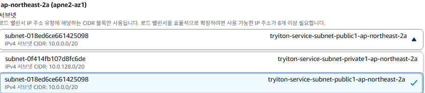
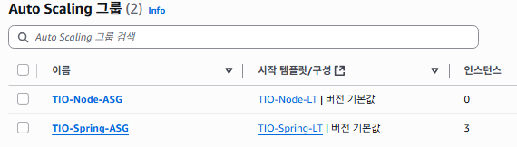
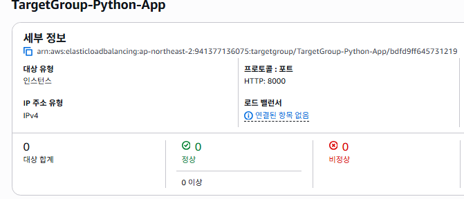
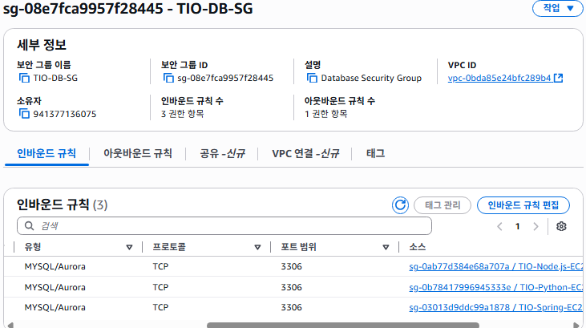

# 환경설정 (AWS 서버편 - VPC, 로드밸런싱, 오토 스케일링)

우리 팀은 FE : Next.js, : Spring과 마이크로 서비스를 위한 Node.js, 그리고 FitDit 활용을 위한 Python FAST API를 계획했다.  
먼저 회의를 통해일정이 빠듯한 점을 감안하여, 이번주 금요일 까지 백엔드까지 완성하기로 했다. 

## VPC 생성

### VPC는 Virtual Private Cloud로

사용자가 정의한 가상 네트워크를 설정해 주는 것이다. 일종의 클라우드(AWS 전체 시스템) 내의 클라우드(VPC) 정도로 이해하는게 정신건강에 좋다.


가용영역(AZ)과 퍼블릭 서브넷 / 프라이빗 서브넷은 각각 2로 설정한다.
> 고가용성과 장애 내구성을 위해 여러 가용영역에 걸쳐 리소스를 배포하는 것이 모범사례라고 한다.


이 결과 4개의 서브넷이 생성됨.  
`public : ap-northeast-2a, ap-northeast-2b`  
`private : ap-northeast-2a, ap-northeast-2b` 


**외부로 연결해주는 사진 넣기**

### NAT 게이트웨이는 
Private Subnet의 컨테이너가 외부 인터넷으로 패치를 다운로드하거나 API를 호출(Outbound)할 수는 있지만, 외부에서 Private Subnet으로 직접 들어올(Inbound) 수는 없게 만드는 "일방향" 출구 역할을 한다.  
일반적으로 내부의 EC2가 외부의 S3 bucket으로 접근할 때 사용된다.

다른 반대되는 개념으로는 **인터넷 게이트웨이**가 있다

### 인터넷 게이트웨이


VPC와 인터넷을 연결하는 관문. 마법사가 생성하여 VPC에 연결해줌


우리의 서비스 규모 등을 생각했을 때 1개만 생성해주는게 좋다.

### 엔드포인트
> AWS TIP: VPC 엔드포인트는 AWS 네트워크 내부의 통신이며 엔드포인트를 통해 트래픽을 제어할 수 있는 보안 및 규정 준수 이점이 있습니다.  
> 또한 NAT 게이트웨이가 아닌 VPC 엔드포인트를 통해 데이터를 전송하면 데이터 처리 비용을 최적화할 수 있습니다.  

엔드포인트를 S3게이트웨이로 선택한다.  
엔드포인트는 프라이빗 서브넷의 컨테이너가 S3 저장 이미지 읽고 쓰기를 할때 필요한 경로로

**없음**일 때
`PRIVATE SUBNET EC2` -> `NAT 게이트웨이` -> `인터넷` -> `S3`

이렇게되면 모든 트래픽 경로가 길어질 경우 NAT 게이트웨이 데이터 `처리비용`이 발생하고,  
암호화되어있지만 `공용 인터넷`을 통해 `보안`문제가 발생 할 수 있음  
또한 인터넷을 경유하므로 `성능 저하`도 발생할 수 있다.

**엔드포인트를 설정할 경우**
`Private Subnet의 ECS 컨테이너` → `라우팅 테이블의 S3 엔드포인트 경로` → `S3 서비스 (AWS 내부망)`

장점은 엔드포인트가 없는 상태의 모든 반대이다.

#### Q. 그렇다면 연결할 S3는 먼저 만들어줘야하나?
A. 독립적인 서비스이므로 순서는 중요치 않고, 이후 라우팅 테이블 구성때 경로를 설정해 주면된다.

#### Q. VPC 설정할때 만들지 못했으면 어떻게하지?
https://catalog.us-east-1.prod.workshops.aws/workshops/869a0a06-1f98-4e19-b5ac-cbb1abdfc041/ko-KR/advanced-modules/network/20-index

VPC 콘솔의 PrivateLink 및 Lattice에서 `엔드포인트`에서 직접 생성해도된다. 

## VPC 생성완료


이 페이지로 넘어와서 기다리다보면.. VPC가 생성된다. 생각보다 꽤 시간이 걸린다. 한 3분정도 기다리면 모든 항목이 녹색으로 표시된다.


현재까지 구성된 상태는 아래와 같다.  

> 출처 : AWS workshop studio  

## 보안그룹(sg, security group) 생성

이제 우리의 공간(VPC 등), 을 지키기위해 방화벽을 설정하는 과정으로, 총 3개의 보안 그룹을 생성해야한다. `로드 밸런서(ALB)용 보안 그룹`, `EC2 서비스용 보안 그룹`, `DB용`

EC2 콘솔의 > 보안 그룹 > 보안 그룹 생성으로 이동한다

### Q1. AWS 워크샵에서는 EC2 생성후 보안그룹생성, ALB 생성후 보안그룹생성했는데 지금은 왜 각 그룹먼저 설정 후 인스턴스 / ALB 만들어 주면서 연결해주는지?

```
보안 그룹을 먼저 만드는 것이 더 좋은 이유
1. 상호 참조 (의존성) 문제 해결
이것이 가장 핵심적인 이유입니다. 우리의 아키텍처 목표를 다시 생각해보겠습니다.

"EC2 인스턴스는 오직 ALB로부터 오는 트래픽만 받아야 한다."

이 규칙을 구현하려면, EC2 보안 그룹의 인바운드 규칙에 "소스(Source)"로 ALB 보안 그룹을 지정해야 합니다.

만약 사용자님 말씀처럼, ALB를 만드는 과정에서 ALB 보안 그룹을 만들고, EC2 인스턴스를 만드는 과정에서 EC2 보안 그룹을 만든다고 가정해봅시다.
EC2 보안 그룹을 만드는 시점에는, 아직 세상에 존재하지 않는 ALB 보안 그룹을 "소스"로 지정할 수가 없습니다. 닭이 먼저냐, 달걀이 먼저냐 하는 문제가 생기는 것이죠.
결국 두 리소스를 다 만든 뒤, 다시 EC2 보안 그룹 설정으로 돌아가서 인바운드 규칙을 ALB 보안 그룹으로 수정하는 번거로운 추가 작업을 해야만 합니다. 이 과정에서 실수가 발생할 확률이 높아집니다.
2. 역할의 분리와 명확성
인프라를 구성하는 것을 "건축"에 비유할 수 있습니다.

보안 그룹, VPC, 서브넷 설정: 건물의 기초 공사와 방화벽, 출입문을 설계하고 만드는 **"설계/보안팀"**의 역할입니다.
EC2 인스턴스, ALB 생성: 설계도에 따라 실제 서버와 장비를 들여놓는 **"설비/운영팀"**의 역할입니다.
보안과 관련된 설정을 먼저 명확하게 끝내놓고, 그 위에 필요한 리소스들을 안전하게 얹는 방식이 훨씬 체계적이고 실수를 줄일 수 있습니다.

3. 관리의 용이성과 재사용성
보안 그룹은 일종의 "템플릿"입니다. 예를 들어, 쇼핑몰의 웹 서버가 10대가 필요하다면, 10개의 EC2 인스턴스 모두 동일한 my-shop-ec2-sg 보안 그룹을 사용하게 됩니다.

보안 정책 변경이 필요할 때 (예: 새 관리자 IP 추가) 이 보안 그룹 하나만 수정하면 10대의 서버에 모두 적용됩니다.
"리소스 생성 시 함께 만들기" 방식으로 하면 launch-wizard-1-sg, launch-wizard-2-sg 처럼 용도를 알 수 없는 보안 그룹들이 많아져 관리가 매우 어려워집니다.
```

### 로드 밸런서용 보안그룹 생성

> 이 보안 그룹은 인터넷으로부터의 웹 트래픽(HTTP/HTTPS)을 받아들이는 역할 


이름 `TIO-ALB-SG`와 설명을 기입하고, 사용할 VPC 영역을 선택해준다.


꼭 기본 vpc가 아닌, 새로 생성한 VPC를 선택해야한다.

**`인바운드 규칙`** 을 모든 웹 트래픽을 받아들일 수 있도록 HTTP와 HTTPS(비필수, but 권장)을 열어준다.

여기서 `0.0.0.0/0`은 위치와 무관하게 접속을 허용한다는 의미이다.

### EC2 인스턴스용 보안그룹 생성

> 실제 애플리케이션이 설치 될 EC2 서버를 보호

여기선 총 `두 종류의 트래픽`을 허용해야함.

1. 로드 밸런서로부터 오는 애플리케이션 트래픽
2. 서버 관리를 위한 관리자의 SSH 접속 트래픽 (22번 포트)

생성 절차는 `인바운드 규칙`만 달리하고 모든 절차는 위와 같다.

인바운드 규칙에서 먼저. `애플리케이션의 포트`를 열어준다. 


우리 프로젝트에서는 FastAPI, Node.js, Spring 이 세개를 비즈니스 로직처리에 사용하기 때문에. 세개에 대해서 인바운드 규칙을 설정해줘야한다.

> ❗우리의 서비스는 Spring에서 Node.js의 마이크로 서비스와 FastAPI를 호출하기 때문에, Spring은 ALB로의 inbound를 열지만, `Node.js 서버와 FastAPI의` inbound 규칙 `source`를 `Spring의 보안 그룹`으로 설정해준다.


(Spring의 호출을 열어 둔 Python 서버의 보안 그룹 규칙)

다 구성이 완료되면 아래와 같은 모습이 된다

```
+-------------------------------------------------------------------------+
|  VPC                                                                    |
|                                                                         |
|  +---------------------------+       +--------------------------------+ |
|  |   Availability Zone A     |       |   Availability Zone B          | |
|  |                           |       |                                | |
|  | +-----------------------+ |       | +----------------------------+ | |
|  | |  Private Subnet 1     | |       | | Private Subnet 2           | | |
|  | |                       | |       | |                            | | |
|  | |  [EC2 - Spring] <----sg-spring  | | [EC2 - Spring] <----sg-spring| |
|  | |  [EC2 - Python] <----sg-python  | | [EC2 - Python] <----sg-python| |
|  | |  [EC2 - Node]   <----sg-node    | | [EC2 - Node]   <----sg-node  | |
|  | |                       | |       | |                            | | |
|  | +-----------------------+ |       | +----------------------------+ | |
|  +---------------------------+       +--------------------------------+ |
|                                                                         |
+-------------------------------------------------------------------------+
```

일반적으로 혼자 작업한다면 이렇게 사용할 어플리케이션의 TCP 포트와, `포트범위 22의 SSH`를 열어주고 SSH 소스 부분에 내 고정 IP를 사용하면 된다.  
하지만 지금은 다수의 팀원들과 운영해야하고, 와이파이 환경이며(유동 ip인지, 아닌지 모름) 여러모로 여는게 보안상 불안하기때문에, `SSH를 열지 않기로 한다`.

그럼 어떻게 하느냐?

### AWS Systems Manager (SSM) 세션 관리자
를 활용한 방법이다. 현재 업계 표준이라고하며, AWS에서 권장한다고한다.


위 그림은 VPC의 Private Subnet 리소스에 접근하기 위한 SSH(기존) 과 SSM을 사용한 방법을 비교한 그림이다.

좌측은 SSH 이용 `Bastion Host` 경우, `Private Subnet`에 도달  
우측은 AWS SSM 이용 AWS System Manager를 거쳐서 가는 방법을 나타낸다.

```
[연결 흐름 비교]
기존: IDE → 인터넷 → EC2 공인 IP:22 (보안 그룹 22번 포트 열기 필수)
SSM: IDE → 로컬 PC의 SSH 설정 → AWS CLI (ProxyCommand) → SSM 터널 → EC2 인스턴스 (보안 그룹 22번 포트 닫기 가능)
```

**적용방법**은? 매우 간단하다. 별도의 보안 그룹 설정 없이, 작업할 작업자의 IAM 계정의 역할에 `AmazonSSMManagedInstanceCore` 만 붙여주면된다. 

기존 SSH 방식에 비해 가지는 장점은
- Bastion Host, Key Pair, SG+Rule 다 필요없다
- 그럼에도 **SSH로 가능한건 다 한다**
- Private Subnet의 EC2 인스턴스에 바로 접속할 수 있다

이에 대한 IDE 등에서의 연결설정은 모든 설정을 끝내고 해주면 된다. 

나머지 모든 3개의 어플리케이션에 대한 보안설정(`TIO-Spring-EC2-SG`, `TIO-Python-EC2-SG`, `TIO-Node.js-EC2-SG`을 마무리해준다.

`아웃바운드` 룰은 기본(`모든 트래픽 대상`)으로 둬도 된다.

---
### Q2. 보안 그룹은 각각 설정해줘야하는가?

구현하기 나름. 
1. 각 애플리케이션을 별도 서버 그룹에 배포
2. 모든 애플리케이션을 하나의 인스턴스 그룹에 배포

이 두 가지 방식을 사용할 수 있는데,  
1번 방식을 사용하게되면,  
```
my-shop-ec2-sg의 인바운드 규칙:

포트 8080 (Spring)을 my-shop-alb-sg로부터 허용
포트 8000 (Python)을 my-shop-alb-sg로부터 허용
포트 3000 (Node.js)을 my-shop-alb-sg로부터 허용
```  
이렇게 각각의 SG를 설정하고, 각 EC2의 ALB에 적용해주면 된다.  
```
ALB (로드 밸런서) 구성
ALB의 경로 기반 라우팅(Path-based Routing) 규칙을 사용하여 트래픽을 분배

https://yourshop.com/api/spring/* 요청 → spring-target-group (Spring EC2 그룹)으로 전달
https://yourshop.com/api/python/* 요청 → python-target-group (Python EC2 그룹)으로 전달
https://yourshop.com/api/node/* 요청 → node-target-group (Node.js EC2 그룹)으로 전달
```

2번 방식의 경우 하나의 인스턴스 ALB에 하나의 보안 그룹을 설정하고, 모든 어플리케이션에 해당하는 `모든 포트`를 열어준다
```
my-shop-ec2-sg의 인바운드 규칙:
포트 8080 (Spring)을 my-shop-alb-sg로부터 허용
포트 8000 (Python)을 my-shop-alb-sg로부터 허용
포트 3000 (Node.js)을 my-shop-alb-sg로부터 허용
```

1번이 `매우` 권장되는 이유는 아래와 같다
- **독립적인 확장 (Independent Scaling)**: Python API에 트래픽이 몰리면 Python 서버 그룹만 증설(Scale-out)하면 됩니다. 다른 서비스에 영향을 주지 않습니다.
- **독립적인 배포 (Independent Deployment)**: Node.js 앱을 업데이트할 때, Spring Boot 서비스는 아무런 영향 없이 안정적으로 운영됩니다.
- **높은 보안성 및 명확성**: 각 서비스에 필요한 포트만 최소한으로 열기 때문에 보안에 유리하고, 어떤 보안 그룹이 어떤 역할을 하는지 명확하게 알 수 있습니다.
- **장애 격리 (Fault Isolation)**: 만약 Spring Boot 앱에 메모리 누수가 발생해 서버가 다운되어도, Python과 Node.js 서비스는 정상적으로 계속 작동합니다.

---

### DB 보안그룹 생성
`TIO-DB-SG`로 생성해준다.

이때 흐름자체가 
- `DB 보안그룹` 의 인바운드 : 오직 `EC2 보안그룹` 으로부터 오는 요청만 허용한다
- `EC2 보안그룹` 의 아웃바운드 규칙 : 오직 `DB 보안그룹` 으로부터 나가는 요청을 허용한다.

### **Q3. 복합 데이터 흐름과 보안 그룹 규칙**

> 데이터 흐름이. 예를들어 FastAPI가 필요한 호출이 외부에서 들어오게되면 ALB를 통해서 spring을 거치고, fastapi에다가 요청을 넣으면, fastapi에서 S3의 이미지를 꺼내와서 처리를 하고 그 결과를 spring을 통해서 클라이언트로 보내주는데 이때 보안 그룹 규칙은 어떻게되는거지?


**데이터 흐름 시나리오:**
`클라이언트` → `ALB` → `Spring EC2` → `FastAPI EC2` → `S3` → `FastAPI EC2` → `Spring EC2` → `ALB` → `클라이언트`

| 단계 | 출발지 | 목적지 | 통과하는 보안 그룹 | **필요한 핵심 규칙 (Inbound 위주)** |
| :--- | :--- | :--- | :--- | :--- |
| **1.** | 클라이언트 (인터넷) | ALB | `sg-alb` (ALB 보안 그룹) | **Inbound:** 포트 `443`(HTTPS) / 소스 `0.0.0.0/0` |
| **2.** | ALB | Spring EC2 | `sg-spring` (Spring 보안 그룹) | **Inbound:** 포트 `8080` / 소스 **`sg-alb`** |
| **3.** | **Spring EC2** | **FastAPI EC2** | **`sg-python`** (Python 보안 그룹) | **Inbound: 포트 `8000` / 소스 `sg-spring`** |
| **4.** | **FastAPI EC2** | **Amazon S3** | `sg-python` (아웃바운드) | **Outbound:** 포트 `443` / 대상 `S3 엔드포인트` 또는 `0.0.0.0/0` |
| **5.** | FastAPI EC2 | Spring EC2 | `sg-spring` (인바운드) | **(규칙 불필요)** - 3번 요청에 대한 **Stateful 응답**이므로 자동 허용 |
| **6.** | Spring EC2 | ALB | `sg-alb` (인바운드) | **(규칙 불필요)** - 2번 요청에 대한 **Stateful 응답**이므로 자동 허용 |
| **7.** | ALB | 클라이언트 (인터넷) | - | **(규칙 불필요)** - 1번 요청에 대한 **Stateful 응답**이므로 자동 허용 |

#### **단계별 상세 설명:**

  * **1단계 (클라이언트 → ALB):** 외부 사용자의 요청. ALB 보안 그룹(`sg-alb`)이 인터넷(`0.0.0.0/0`)으로부터의 웹 트래픽(HTTPS/443)을 허용.

  * **2단계 (ALB → Spring):** ALB가 Spring 서버로 요청을 전달. Spring 보안 그룹(`sg-spring`)이 ALB 보안 그룹(`sg-alb`)으로부터의 애플리케이션 트래픽(8080)을 허용.

  * **3단계 (Spring → FastAPI):** **가장 핵심적인 부분입니다.** Spring이 FastAPI를 동기 호출. FastAPI 서버의 보안 그룹(`sg-python`)이 Spring 서버 보안 그룹(`sg-spring`)으로부터의 API 트래픽(8000)을 허용. 이 규칙이 없으면 Spring은 FastAPI에 접속할 수 없음.

  * **4단계 (FastAPI → S3):** FastAPI가 S3에서 이미지를 가져옴.

      * 이 통신은 FastAPI EC2 인스턴스에서 시작되는 **아웃바운드(Outbound)** 통신.
      * 이전에 설정한 **S3 게이트웨이 엔드포인트**를 사용한다면, 이 트래픽은 AWS 내부망을 통해 S3로 안전하게 라우팅됨.
      * `sg-python`의 아웃바운드 규칙에 HTTPS(443)가 허용되어 있어야 함. (기본 아웃바운드 규칙은 '모두 허용'이므로 보통은 문제없이 동작.)

  * **5, 6, 7단계 (응답 트래픽):**

      * 이 모든 과정은 맨 처음에 클라이언트가 시작한 단일 요청에 대한 "응답"의 흐름이다.
      * 보안 그룹은 **Stateful**이기 때문에, 한 번 허용된 요청에 대한 응답 트래픽은 **별도의 규칙 없이 자동으로 허용**된다. 따라서 FastAPI → Spring, Spring → ALB, ALB → 클라이언트로 돌아가는 응답 경로는 추가적인 보안 그룹 규칙 설정이 필요 없다고 한다.

결론적으로, 이 복잡한 흐름을 가능하게 하는 가장 중요한 맞춤 규칙은 **`sg-python`의 인바운드 규칙에 `sg-spring`을 허용해주는 설정** 단 하나다.


## ALB (Application Load Balancer) 생성

> Network - Amazon VPC 실습에서 생성한 네트워크 인프라를 사용하여 부하에 따라 자동으로 확장/축소할 수 있고 고가용성을 보장하는 웹 서비스를 배포합니다. (라고 AWS에서 설명한다)


결국 쉽게 말하면 정문같은 느낌이다.

### Target Group 생성

먼저 ALB 전에 Target Group을 생성한다. 이는 ALB가 트래픽을 전달할 대상(EC2 인스턴스, 우리는 `Spring 인스턴스`가 되겠다)의 그룹을 정의한다.

  
EC2 콘솔 > 대상 그룹 > 대상 그룹 생성으로 가서 인스턴스를 대상으로 생성해준다.


spring으로 들어오는 호출이기때문에 포트번호를 `8080`으로 맞춰주고, VPC를 우리가 생성한것으로 변경해주면된다. 나머지는 기본값으로.


상태 검사 경로는 `Spring Boot Actuator` 라이브러리에서 저 경로를 통해 DB 연결 상태까지 확인해준다.

만일 라이브러리가 없더라도 나중을 위해 경로를 적어줘도 서버 설정에는 무방하고. 필요한 시점에 프로젝트의 `build.gradle`에 의존성을 추가해준다.
```Groovy
dependencies {
    implementation 'org.springframework.boot:spring-boot-starter-actuator'
}
```

다음으로 넘기면 현재까지는 인스턴스가 없기 때문에 바로 `대상 그룹 생성`으로 종료한다.


이제 로드밸런서를 생성해 이 콘솔을 채워준다.

### 로드밸런서


제일 왼쪽을 누르면 된다. 


이 부분이 조금 중요하다. 현재 vpc로 골라주고, `가용 영역 및 서브넷`의 두 서브넷을 체크해주면 고를 수 있는 박스가 나온다.



우리의 ALB는 `인터넷과 직접 통신`해줘야 하기 때문에, 반드시 두 개의 서브넷 모두 `public`으로 설정해주어야한다.


초반에 만든 ALB의 보안그룹을 지정해주고,


리스너는 기본값인 프로토콜 `HTTP`와 포트 `80`으로 되어있는지 확인만 하자.  
그리고 직전에 생성한 `TargetGroup`을 선택해준다.


이상없이 설정 해줬다면 아래로 쭉 스크롤하여, `요약`에서 이상없는지 최종 확인하고 **`로드 밸런서 생성`** 클릭.


상단에 `로드 밸런서 생성 완료` 라는 메시지가 뜨며 아무것도 없던 `EC2 > 로드 밸런서`콘솔로 빠져나오게된다.


상태를 보면 회색 음영처리된 글씨로 `프로비저닝(Provisioning) 중`이라고 떠있는데, `활성(Active)` 상태로 변경되는데 몇분정도 소요된다.


### IAM 역할 생성
우리는 Auto Scaling Group에게 서버의 생성과 관리를 위임하기 위해서, 해당 기능을 구현하기 위해 `EC2` 서버에게 IAM role을 부여해 줄 것이다.  
> "너는 SSM, S3, CloudWatch와 통신할 수 있는 권한이 있어" 라고 허락해주는 역할

검색창에 IAM 검색하여 들어온 콘솔에서, `역할 만들기`를 눌러 들어온다.


다음 권한 추가 창에서 아래 3개의 정책을 찾아 체크해준다.

- AmazonSSMManagedInstanceCore (SSM 원격 접속용)
- AmazonS3FullAccess (S3 파일 접근용)
- CloudWatchAgentServerPolicy (서버 모니터링 및 로그 수집용)  
3개를 모두 체크했으면 [다음] 클릭


역할 생성 후 다시 Template로 돌아온다


## Launch Template 생성

시작 템플릿은 일종의 도면이다. 로드밸런싱에 의해 EC2를 자동으로 늘려줘야 하는 상황에서도, 이 도면(시작 템플릿)을 보고 그대로 늘려주게 된다.


Auto Scaling 지침 꼭 체크해주자. 말이 모호하긴한데, 그냥 AWS가 이 설정을 인식하고 필요한 상황에 `이 템플릿을 사용하세요` 라는 사인? 같은거라고 생각하면된다.


쓰고싶은 AMI를 고른다. 꼭 특정 버전의 Ubuntu를 사용해야하고, 의존성 문제가 있는게 아니라면 Amazon Linux가 무난한 선택지라고한다.  
(일단 무료에, EC2 맞춤형 튜닝, AWS측 보안패치 자동 제공 등)

혹시 나중에라도 AMI를 바꾸고싶다면 현재 만들었던 템플릿을 기반으로 새로운 버전을 만들어주게되면 서버 실행에는 영향을 끼치지 않고 버전 교체를 해 줄 수 있다.

> 잠깐 설명하면 템플릿 교체 하는법은 아래와 같다.  
> `새버전 생성` -> `Auto Scaling Group 설정 내 새 시작템플릿으로 변경` -> `Auto Scaling Group 의 인스턴스 새로고침 시작으로 새 이미지 업로드`
>


인스턴스 유형은 아직까지 개발 / 테스트 단계이기 때문에 t2.micro로 설정해준다.
SSM을 쓸 것이기 때문에, 키페어는 비워둔다
방화벽에서 기존 보안 그룹 선택, 보안그룹 설정은 만들어둔 `TIO-Spring-EC2-SG` 보안 그룹 선택한다.

스토리지도 상술한 이유로 일단 기본값으로 해준다.


아까 생성한 TIO-EC2-Role을 골라준다.


이 곳에 각 인스턴스가 생성될 때 마다 반복적으로 초기화해줄 `사용자 데이터`의 스크립트 작성해준다.

### 사용했던 사용자 데이터 스크립트

```Bash
#!/bin/bash
# 1. 시스템 패키지 업데이트 (보안 강화)
sudo dnf update -y

# 2. 타임존을 한국 시간으로 변경 (로그 시간 동기화)
sudo timedatectl set-timezone Asia/Seoul

# 3. Java 17 (Corretto) 설치
sudo dnf install java-17-amazon-corretto-devel -y

# 4. CodeDeploy 에이전트 설치 (CI/CD 자동 배포 준비)
#    - CodeDeploy 에이전트는 Ruby를 필요로 합니다.
sudo dnf install ruby -y
sudo dnf install wget -y
cd /home/ec2-user
wget https://aws-codedeploy-ap-northeast-2.s3.ap-northeast-2.amazonaws.com/latest/install
chmod +x ./install
sudo ./install auto

# 5. CloudWatch 에이전트 설치 및 설정/실행 (중앙 로깅 및 모니터링)
sudo dnf install amazon-cloudwatch-agent -y

# CloudWatch 에이전트 설정 파일 생성
# - 이 설정은 메모리/디스크 사용률 같은 시스템 지표와 /app/logs/application.log 파일을 수집합니다.
sudo bash -c 'cat <<EOF > /opt/aws/amazon-cloudwatch-agent/bin/config.json
{
  "agent": {
    "metrics_collection_interval": 60,
    "run_as_user": "root"
  },
  "metrics": {
    "metrics_collected": {
      "disk": {
        "measurement": [
          "used_percent"
        ],
        "metrics_collection_interval": 60,
        "resources": [
          "*"
        ]
      },
      "mem": {
        "measurement": [
          "mem_used_percent"
        ],
        "metrics_collection_interval": 60
      }
    }
  },
  "logs": {
    "logs_collected": {
      "files": {
        "collect_list": [
          {
            "file_path": "/app/logs/application.log",
            "log_group_name": "/my-shop/ec2/spring-application",
            "log_stream_name": "{instance_id}"
          }
        ]
      }
    }
  }
}
EOF'

# CloudWatch 에이전트 실행 및 부팅 시 자동 시작 설정
sudo /opt/aws/amazon-cloudwatch-agent/bin/amazon-cloudwatch-agent-ctl -a fetch-config -m ec2 -s -c file:/opt/aws/amazon-cloudwatch-agent/bin/config.json
sudo systemctl enable amazon-cloudwatch-agent
```

### 각 추가 항목의 의미
1. **시스템 업데이트**: 서버가 시작될 때마다 OS의 모든 패키지를 최신 버전으로 업데이트하여, 알려진 보안 취약점들을 사전에 방지.

2. **타임존 설정**: 서버의 기본 시간은 보통 UTC(세계 표준시)입니다. 모든 로그(에러 로그, 접속 로그 등)와 애플리케이션의 시간 기록이 한국 시간(KST)으로 통일되어야 나중에 문제를 추적하기 매우 쉬움.

3. **CodeDeploy 에이전트 설치**: 가장 중요한 추가 항목 중 하나입니다. 나중에 `GitHub Actions 등으로 CI/CD 파이프라인을 구축`할 때, AWS의 `CodeDeploy`라는 서비스가 이 에이전트를 통해 서버에 접속하여 애플리케이션 코드를 자동으로 배포(복사, 실행). 이것을 미리 설치해두는 것.

4. **CloudWatch 에이전트 설정 및 실행**: 단순히 에이전트를 설치만 하는 것을 넘어, 실제로 동작하도록 설정하고 실행하는 단계.

config.json 파일을 만들어 "어떤 지표와 로그 파일을 수집해서, 어떤 이름으로 CloudWatch에 보낼지"를 정의
EC2 인스턴스의 메모리/디스크 사용률과, 나중에 우리 Spring 애플리케이션이 생성할 로그 파일(/app/logs/application.log)을 수집하도록 설정했다. 
이렇게 해야 실제로 CloudWatch 대시보드에서 서버의 상태를 모니터링하고 로그를 검색할 수 있게 된다고 한다.

---

### Launch Template 생성 완료


이제 Auto Scaling Group을 위한 준비가 완료되었다.

## Auto Scaling Group

> Auto Scaling Group(ASG)은 '서버 공장'이자 '서버 관리 매니저'이다. 시작 템플릿을 기반으로 EC2 인스턴스를 찍어내고, 항상 정해진 수의 인스턴스가 건강하게 동작하도록 관리하며, ALB와 연동하는 모든 것을 책임진다

EC2 > Auto Scaling 그룹 > Auto Caling 그룹 생성으로 이동한다


Auto Scaling 그룹 이름: TIO-Spring-ASG
시작 템플릿: 드롭다운 메뉴에서 우리가 만든 TIO-Spring-LT를 선택합니다.
템플릿 버전이 'Default (1)'로 올바르게 선택되었는지 확인하고 **다음**을 클릭합니다.


네트워크 (VPC): tryiton-service-vpc가 선택되어 있는지 확인합니다.  
가용 영역 및 서브넷: `프라이빗 서브넷(Private Subnet)` 2개를 모두 선택합니다.  
- (매우 중요!) 우리의 애플리케이션 서버는 외부 인터넷에 직접 노출되면 안 되므로, 반드시 안전한 프라이빗 서브넷에 위치해야 합니다.


기존 로드 밸런서 대상 그룹에서 아까 만들어준 `TargetGroup`을 연결해준다


서버의 상태를 지속 확인하고 ALB가 `비정상`이라 판단 시 자동으로 교체해주어 `안전성`이 높아진다.


- 원하는 용량(Desired capacity): 2
  - ASG가 항상 유지하려고 노력하는 인스턴스 수
- 최소 용량(Minimum capacity): 2
- 최대 용량(Maximum capacity): 4 (나중에 트래픽이 많아지면 최대 4대까지 자동으로 늘어날 수 있다.)  


- 조정 정책: 대상 추적 조정 정책을 선택
- 조정 정책 이름: TIO-CPU-Scaling-Policy (식별하기 쉬운 이름)
- 측정항목 유형: 평균 CPU 사용률(Average CPU utilization)
- 대상 값 (Target value): 60
  - 의미: Auto Scaling Group에 속한 모든 서버들의 평균 CPU 사용률을 60% 수준으로 유지하겠다는 의미. 만약 평균값이 60%를 초과하면 서버를 늘리고, 한참 낮으면 서버를 줄임.
  - (참고: 60% ~ 70% 사이의 값이 일반적으로 많이 사용 된다고 한다. 너무 낮게 잡으면 너무 자주 서버가 늘어나 비용이 증가하고, 너무 높게 잡으면 트래픽이 폭증할 때 대응이 늦을 수 있음.)
- 인스턴스 준비 기간 (Instance warmup): 180 초 (3분)
  - 의미: 새 인스턴스가 시작된 후, 사용자 데이터 스크립트가 실행되고 Java 애플리케이션이 완전히 구동되어 정상적으로 트래픽을 받을 준비가 될 때까지 걸리는 시간을 의미. 이 시간 동안에는 해당 인스턴스의 CPU 사용률을 평균값 계산에서 제외하여 불필요한 추가 확장을 방지합니다. Java 애플리케이션은 시작 시간에 약간의 시간이 걸리므로 3분 정도로 넉넉하게 설정하는 것이 좋음.


생략


우리가 설정한걸 최종 검토하고 `Auto Scaling 그룹 생성` 을 눌러주면 


콘솔에서 준비중인것을 확인할 수 있고, 잠시.. 기다리고 EC2 인스턴스 대시보드로 가면, 새로운 인스턴스가 `2개` 실행중인 것을 확인할 수 있다.


어떻게 이런일이 가능한건지? 는, Auto Scaling Group이 생성되는 순간 아래의 절차를 백그라운드에서 수행한다.

1. Auto Scaling Group이 TIO-Spring-LT 설계도를 읽습니다.
2. 원하는 용량인 2대에 맞춰, 지정된 프라이빗 서브넷에 EC2 인스턴스 2대를 생성하기 시작합니다.
3. 각 인스턴스가 켜지면서, 우리가 넣었던 사용자 데이터 스크립트가 실행되어 Java, 에이전트 등이 자동으로 설치됩니다.
4. 생성이 완료된 인스턴스들은 자동으로 TargetGroup-Spring-App 대상 그룹에 등록됩니다.
5. ALB가 대상 그룹에 등록된 새 인스턴스들을 대상으로 **상태 검사(/actuator/health)**를 시작합니다.
6. 상태 검사를 통과하면, 인스턴스의 상태가 **'healthy'**로 바뀌고, ALB는 드디어 실제 트래픽을 이 인스턴스들로 보내기 시작합니다.

---

## 한번 더...?

여기까지 왔다면 Spring을 위한 서버는 완성된거다.

그럼 python이랑 node.js는...? 한번씩 그대로 반복하되, `이름`, `포트`, `사용자 데이터 스크립트`만 달리 가져가면 된다. ㅎㅎ..

-----

### **Node.js 서버 그룹 생성 (핵심 요약)**

#### **1. 대상 그룹 (Target Group) 생성**

  * **이름:** `TargetGroup-Node-App`
  * **포트:** **`3000`** (Node.js 앱 포트)
  * **상태 검사 경로:** `/` (또는 앱에 맞는 경로)


#### **2. 시작 템플릿 (Launch Template) 생성**

  * **이름:** `TIO-Node-LT`
  * **보안 그룹:** `TIO-Node-EC2-SG` 선택
  * **IAM 역할:** `TIO-EC2-Role` 선택
  * **사용자 데이터 (User Data):** 아래 스크립트로 교체 (Node.js 18.x 설치)
    ```bash
    #!/bin/bash
    sudo dnf update -y
    sudo timedatectl set-timezone Asia/Seoul
    # Node.js 18.x 설치
    curl -sL https://rpm.nodesource.com/setup_18.x | sudo bash -
    sudo dnf install -y nodejs
    # CodeDeploy & CloudWatch 에이전트 설치 (동일)
    sudo dnf install ruby wget -y
    cd /home/ec2-user
    wget https://aws-codedeploy-ap-northeast-2.s3.ap-northeast-2.amazonaws.com/latest/install
    chmod +x ./install
    sudo ./install auto
    sudo dnf install amazon-cloudwatch-agent -y
    ```


#### **3. Auto Scaling 그룹 (ASG) 생성**

  * **이름:** `TIO-Node-ASG`
  * **시작 템플릿:** `TIO-Node-LT` 선택
  * **서브넷:** **프라이빗 서브넷** 2개 선택
  * **대상 그룹 연결:** `TargetGroup-Node-App` 선택
  * **용량:** 원하는 용량 `2`, 최소 `2`, 최대 `4`
    * 인스턴스 워밍업 : `90초`
  * **태그:** `Name`을 `TIO-Node-Server`로, `Service`를 `tio-node`로 변경


```
메시지의 의미: "선택하신 t2.micro 라는 서버 사양이, 지금 선택한 가용 영역(ap-northeast-2a 또는 ap-northeast-2b 중 하나)에서 일시적으로 재고가 부족하거나 더 이상 제공되지 않습니다." 라는 뜻.
```

이해하기 쉽게 정리하자면 가용영역 안의 `모델의 서버 재고 부족`  
일단 만들고, 시작 템플릿을 `t2.micro`에서 다른 인스턴스 유형으로 변경해주면 됨.



-----

### **Python(FastAPI) 서버 그룹 생성 (핵심 요약)**

#### **1. 대상 그룹 (Target Group) 생성**

  * **이름:** `TargetGroup-Python-App`
  * **포트:** **`8000`** (FastAPI 앱 포트)
  * **상태 검사 경로:** `/` (또는 앱에 맞는 경로)



#### **2. 시작 템플릿 (Launch Template) 생성**

  * **이름:** `TIO-Python-LT`
  * **AMI**: Ubuntu Server 22.04 LTS 검색하여 선택 (가장 큰 차이점!)
  * **보안 그룹:** `TIO-Python-EC2-SG` 선택
  * **IAM 역할:** `TIO-EC2-Role` 선택
  * **사용자 데이터 (User Data):** 아래 스크립트로 교체 (Python 3.10 설치)
    ```bash
    #!/bin/bash
    # Ubuntu는 apt-get 사용
    sudo apt-get update -y
    sudo timedatectl set-timezone Asia/Seoul
    # Python 3.10 설치
    sudo apt-get install -y python3.10 python3.10-pip
    # CodeDeploy & CloudWatch 에이전트 설치
    sudo apt-get install -y ruby-full wget
    cd /home/ubuntu
    wget https://aws-codedeploy-ap-northeast-2.s3.ap-northeast-2.amazonaws.com/latest/install
    chmod +x ./install
    sudo ./install auto
    wget https://s3.amazonaws.com/amazoncloudwatch-agent/ubuntu/amd64/latest/amazon-cloudwatch-agent.deb
    sudo dpkg -i -E ./amazon-cloudwatch-agent.deb
    ```

#### **3. Auto Scaling 그룹 (ASG) 생성**

  * **이름:** `TIO-Python-ASG`
  * **시작 템플릿:** `TIO-Python-LT` 선택
  * **서브넷:** **프라이빗 서브넷** 2개 선택
  * **대상 그룹 연결:** `TargetGroup-Python-App` 선택
  * **용량:** 원하는 용량 `2`, 최소 `2`, 최대 `4`
  * **태그:** `Name`을 `TIO-Python-Server`로, `Service`를 `tio-python`로 변경

-----

3개의 마이크로서비스(Spring, Node, Python)를 위한 서버 인프라가 완?벽하게 분리되어 구축


## 차후과제
사실 아직 FitDit을 위한 인스턴스 유형(필요한 옵션이 막혀있음)이나, Autoscaling 설정이 추가로 필요하다.
사유는 아래와 같다

---
### 1. 인스턴스 유형: GPU는 필수입니다.**

Python(FitDit) 프로젝트의 Dockerfile은 `nvidia/cuda` 이미지를 기반으로 하고, `onnxruntime-gpu` 같은 라이브러리를 사용합니다. 이는 이 애플리케이션이 **NVIDIA GPU의 고속 병렬 처리 능력**을 사용하도록 설계되었다는 명백한 증거입니다.

일반적인 `t3.micro` 같은 인스턴스에는 GPU가 없습니다. 따라서 여기에 FitDit 컨테이너를 실행하면, 애플리케이션이 GPU를 찾지 못해 오류를 내거나, CPU만으로 동작하여 엄청나게 느려지게 됩니다.

**해결책: AWS의 GPU 탑재 인스턴스 사용**

* AI 모델을 '학습'시키는 것이 아니라, 이미 학습된 모델을 사용해 '추론(Inference)'을 실행하는 것이므로, **비용 효율적인 G 시리즈 (예: g4dn, g5)가 적합합니다.**
* **추천 인스턴스 유형:** 가장 일반적으로 시작하는 유형은 **`g4dn.xlarge`** 입니다.

**조치:**
Python 서버용 시작 템플릿(`TIO-Python-LT`)을 생성하실 때, **인스턴스 유형**을 `t3.micro`가 아닌 **`g4dn.xlarge`** 로 선택해야 합니다.

---

### **2. 로드밸런싱 사이즈 (Auto Scaling 그룹 규모 및 정책)**

#### **가. 로드 밸런서 자체**
로드 밸런서(ALB) 자체는 AWS가 알아서 트래픽에 맞게 내부적으로 확장하므로, 저희가 사이즈를 정할 필요는 없습니다.

#### **나. Auto Scaling 그룹의 용량 및 정책 (매우 중요!)**

**1. 서버 개수 (min/desired/max)**

* **비용 고려:** GPU 인스턴스는 t3.micro보다 훨씬 비쌉니다. 따라서 불필요하게 여러 대를 계속 켜두는 것은 비용 낭비일 수 있습니다.
* **추천 값:**
    * **원하는 용량(Desired): `1`**
    * **최소 용량(Minimum): `1`** (만약 실시간 서비스가 아니라면 비용 절감을 위해 `0`으로 설정할 수도 있습니다.)
    * **최대 용량(Maximum): `2`** (또는 예상 트래픽에 따라 조정)
    * 일단 최소한의 서버(1대)로 시작하고, 필요할 때만 늘어나도록 구성하는 것이 효율적입니다.

**2. 조정 정책 (Scaling Policy)**

* **문제점:** CPU 사용률은 더 이상 좋은 지표가 아닐 수 있습니다. 이미지 처리 작업 중에는 **GPU가 100% 일하고 있어도 CPU는 상대적으로 놀고 있을 수 있기 때문**입니다. CPU 기준으로 스케일링하면, 서버가 힘들어하고 있는데도 확장이 일어나지 않을 수 있습니다.
* **해결책: 요청 수 기반 스케일링**
    * 더 간단하고 효과적인 방법은 **'서버 1대당 처리하는 요청 수'를 기준**으로 스케일링하는 것입니다.
    * **추천 정책:**
        * **정책 유형:** **`Application Load Balancer 요청 수(초당)/대상`** (Request Count Per Target)
        * **대상 값 (Target value):** **`10`** (예시)
        * **의미:** "각 Python 서버가 처리하는 초당 요청 수가 평균 10개를 넘으면, 서버가 바쁘다고 판단하고 새 서버를 한 대 더 추가해라" 라는 의미입니다. 이 값은 실제 애플리케이션의 처리 속도를 테스트하며 최적의 값을 찾아나가야 합니다.

---

### **결론: Python(FitDit) 서버를 위한 최종 구성**

* **시작 템플릿 (`TIO-Python-LT`):**
    * AMI: `Ubuntu Server 22.04 LTS`
    * **인스턴스 유형: `g4dn.xlarge`**
    * 사용자 데이터: Docker 설치 스크립트
* **Auto Scaling 그룹 (`TIO-Python-ASG`):**
    * **용량:** 원하는 용량: `1`, 최소: `1`, 최대: `2`
    * **조정 정책:** 대상 추적 - **`ALB 대상 그룹별 요청 수`** - 대상 값: **`10`**


## RDS(데이터베이스) 생성

> 모든 상품 정보, 회원 데이터, 주문 내역 등을 저장할 서비스의 DB. RDS를 사용하여 MySQL 데이터베이스 인스턴스를 생성. `프라이빗 서브넷`에 위치 시키고, 이전에 설계한 `TIO-DB-SG` 보안 그룹을 적용하여 EC2 서버들만 접속하도록 설정.

### 보안 그룹 생성

> 우리 서버들만 이 DB에 접속할 수 있다고 허용.


**`인바운드 규칙`**을 유형은 `MySQL`, 소스는 우리 3개의 서버(`spring, node, python`)만 접근 가능하도록 설정한다. 



나머지는 기본값 동일.

### RDS 인스턴스 생성


특별한 이유가 없다면 Aurora보다 MySQL을 사용하자. `프리티어`(20GiB, 범용 SSD)도 가능함(일반적인 개발 수준의 트래픽에서는 오버스펙)


인스턴스 명칭(DB 서버명), 마스터 사용자 이름 / `암호`를 설정한다.  
암호는 추후 애플리케이션에서 사용해야하므로, 잊어버리지 않도록 주의


`인스턴스 구성`, `스토리지` 우리는 프리티어니까 기본 설정으로 둔다.  
초기에는 저정도도 넉넉하다


`연결`에서, `VPC`(이제는 지긋지긋하지만, 해줘야한다)와


`VPC 보안 그룹`을 아까 만들어준 DB-SG로 변경해준다. 그리고 `default`가 체크되어있을 텐데, ❗***꼭 해제해줘야한다***


`추가 구성`을 펼쳐서, `초기 데이터베이스 이름`을 설정한다.

> ❗초기 데이터베이스 이름을 설정하지 않게되면 인스턴스는 정상적으로 생성되나. `스키마`(빈방)이 없는 상태로 만들어짐

**아파트 비유**
- RDS 인스턴스: 새로 지은 텅 빈 아파트 건물

- '초기 데이터베이스 이름' 설정: "건물이 완공되면, 미리 '101호' 라는 이름의 방 하나만 만들어주세요" 라고 건축 회사에 요청하는 것과 같습니다.

- `설정하지 않았을 경우`: 그냥 텅 빈 건물만 덩그러니 지어지는 것입니다. 아직 `호실이 하나도 없는 상태`입니다.  
나중에 우리가 '101호'로 이사 들어가려고 하면(`애플리케이션 연결`), "그런 호수는 없는데요?" 라는 말을 듣게 됨.  
그래서 우리가 `직접` 건물에 들어가서 '101호'라는 방을 만드는 공사(`SQL 명령어 실행`)를 해야만 함

아무튼 특별한 이유가 없다면 `설정하는게 맞다`


나머지는 기본설정으로 두고 생성해주면 데이터베이스의 인스턴스가 생성되게된다.  
`시간이 좀 걸린다`


창 띄워놓고 넋놓고 있다보면(굳이 그럴필요는 없다) 초록창으로 띠며 인스턴스 생성이 완료된다 :)


지금까지의 구현 상태는 위와 같다. (완전히 같진 않아도)

## AWS Secrets Manager 설정 및 RDS 자격 증명 저장

> 데이터베이스 자격 증명, API 키 등 모든 종류의 비밀 정보를 안전하게 저장하고 관리하며, 자동으로 교체해주는 서비스

참고: https://catalog.us-east-1.prod.workshops.aws/workshops/869a0a06-1f98-4e19-b5ac-cbb1abdfc041/ko-KR/advanced-modules/database/connect-app

즉 이 작업의 목표는 아까 RDS 생성시 사용한 `마스터 사용자 이름`과 `암호`를 코드나 서버가 아닌 AWS에 보관하는 것

여기서 새 보안암호를 만들건데, 이친구의 동작과 역할은
- RDS 마스터 사용자 이름과 암호를 Secrets Manager에 '비밀'로 저장합니다.
- EC2 인스턴스의 IAM 역할(TIO-EC2-Role)에 "이 특정 비밀을 읽을 수 있는 권한"을 부여합니다.
- Spring 애플리케이션이 시작될 때, AWS SDK를 사용하여 IAM 역할의 권한으로 Secrets Manager에 접속하여 DB 비밀번호를 안전하게 가져옵니다.
- 가져온 비밀번호를 사용해 DB에 연결합니다.

이렇게 함으로서, 소스코드에 비밀번호를 남기지 않고, 자동 암호 교체로 주기적으로 DB 암호를 자동으로 변경하여 보안을 극대화함.

### 새 보안 암호 저장

콘솔창에서 `AWS Secrets Manager`를 검색해서 들어간 후 `새 보안 암호 저장`을 클릭


내부 설정은 다 기본으로 놔두고, 아까 만든 계정의 이름과 비밀번호를 기입하고, DB 인스턴스를 선택한다.


나중에 관리하기 편하도록 이름과 설명을 기입한다.
(이름 : 일반적으로, 프로젝트명/서비스명/용도)


기본으로 두고 저장하여 완료한다.


이제 이 DB 접근은 우리의 애플리케이션 서버(spring, python, node)에서만 접근할 수 있도록 해야한다.

저장 직전에 검토단계에서 샘플코드로, 각 언어별 보안 암호 검색 코드를 제공한다.  
그 코드는 어플리케이션 실행 시 암호 취득 후 DB에 접근할 수 있도록 한다. 

---

### AWS SDK 샘플코드 

#### spring(java)

```java
// Use this code snippet in your app.
// If you need more information about configurations or implementing the sample
// code, visit the AWS docs:
// https://docs.aws.amazon.com/sdk-for-java/latest/developer-guide/home.html

// Make sure to import the following packages in your code
// import software.amazon.awssdk.regions.Region;
// import software.amazon.awssdk.services.secretsmanager.SecretsManagerClient;
// import software.amazon.awssdk.services.secretsmanager.model.GetSecretValueRequest;
// import software.amazon.awssdk.services.secretsmanager.model.GetSecretValueResponse;	

public static void getSecret() {

    String secretName = "tio/db/credentials";
    Region region = Region.of("ap-northeast-2");

    // Create a Secrets Manager client
    SecretsManagerClient client = SecretsManagerClient.builder()
            .region(region)
            .build();

    GetSecretValueRequest getSecretValueRequest = GetSecretValueRequest.builder()
            .secretId(secretName)
            .build();

    GetSecretValueResponse getSecretValueResponse;

    try {
        getSecretValueResponse = client.getSecretValue(getSecretValueRequest);
    } catch (Exception e) {
        // For a list of exceptions thrown, see
        // https://docs.aws.amazon.com/secretsmanager/latest/apireference/API_GetSecretValue.html
        throw e;
    }

    String secret = getSecretValueResponse.secretString();

    // Your code goes here.
}
```

#### node.js(JS)

```javascript
// Use this code snippet in your app.
// If you need more information about configurations or implementing the sample code, visit the AWS docs:
// https://docs.aws.amazon.com/sdk-for-javascript/v3/developer-guide/getting-started.html

import {
  SecretsManagerClient,
  GetSecretValueCommand,
} from "@aws-sdk/client-secrets-manager";

const secret_name = "tio/db/credentials";

const client = new SecretsManagerClient({
  region: "ap-northeast-2",
});

let response;

try {
  response = await client.send(
    new GetSecretValueCommand({
      SecretId: secret_name,
      VersionStage: "AWSCURRENT", // VersionStage defaults to AWSCURRENT if unspecified
    })
  );
} catch (error) {
  // For a list of exceptions thrown, see
  // https://docs.aws.amazon.com/secretsmanager/latest/apireference/API_GetSecretValue.html
  throw error;
}

const secret = response.SecretString;

// Your code goes here
```

#### python

```python
# Use this code snippet in your app.
# If you need more information about configurations
# or implementing the sample code, visit the AWS docs:
# https://aws.amazon.com/developer/language/python/

import boto3
from botocore.exceptions import ClientError


def get_secret():

    secret_name = "tio/db/credentials"
    region_name = "ap-northeast-2"

    # Create a Secrets Manager client
    session = boto3.session.Session()
    client = session.client(
        service_name='secretsmanager',
        region_name=region_name
    )

    try:
        get_secret_value_response = client.get_secret_value(
            SecretId=secret_name
        )
    except ClientError as e:
        # For a list of exceptions thrown, see
        # https://docs.aws.amazon.com/secretsmanager/latest/apireference/API_GetSecretValue.html
        raise e

    secret = get_secret_value_response['SecretString']

    # Your code goes here.
```

## EC2의 RDS 접근권한 부여

### IAM Policy(정책) 설정

> 최소 권한 원칙을 따르기 위해 리소스에 필요한 권한만 부여하는 것이 모범 사례로, 인스턴스에 DB 자격 증명이 포함된 특정 Secret에 액세스 할 수 있는 권한만 부여.

`TIO-EC2-Role`이라는 IAM의 `역할`에, 비밀을 읽어올 수 있도록 권한을 부여해 주는것이 목표이다.


## S3 버킷 생성 (파일 스토리지)


## CI/CD 파이프라인 구축 (자동 배포)

