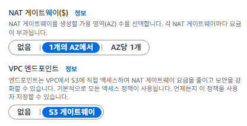
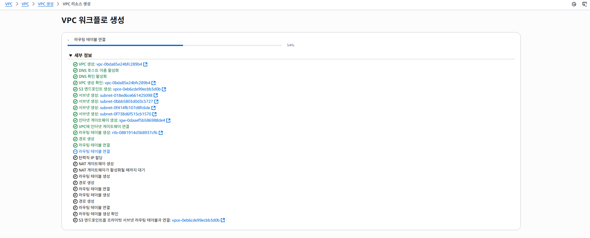
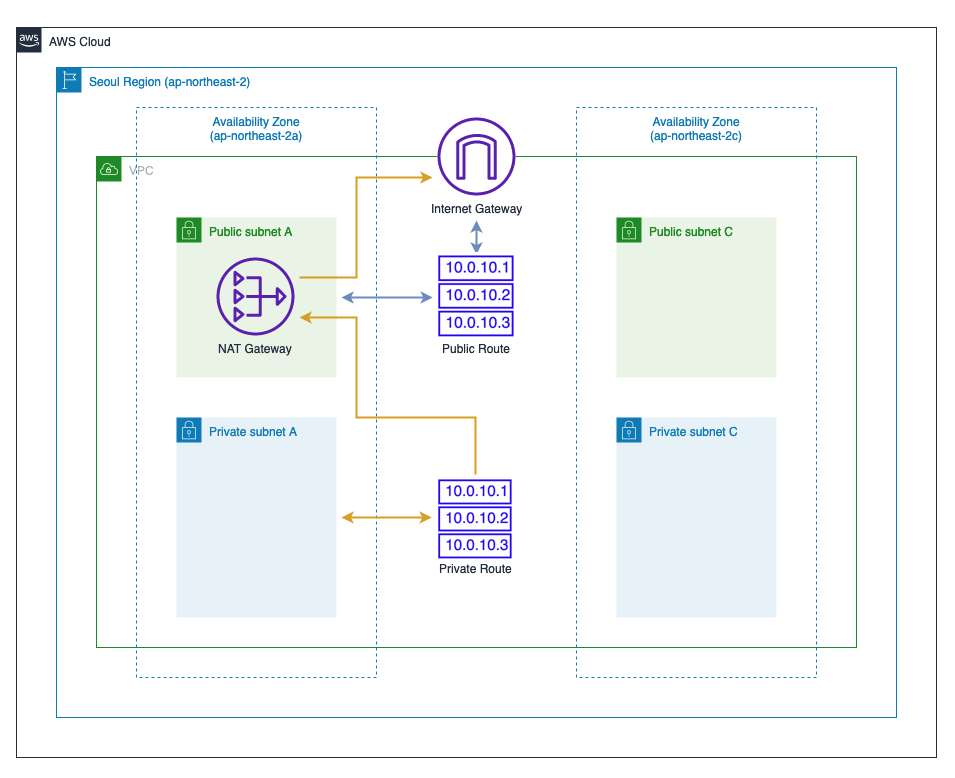

# AWS 인프라 구축기 1편: VPC와 네트워크 기초 구성

## 배경 및 아키텍처 구상

### 서비스 개요
우리 팀이 기획한 TryItOn은 AI(FitDit) 기반 가상 피팅 서비스다. 사용자가 자신의 사진을 업로드하고, 특정 실제 의류를 가상으로 착용해볼 수 있는 이커머스 플랫폼이다.

### 기술 구성

## VPC 생성

### VPC는 Virtual Private Cloud로

사용자가 정의한 가상 네트워크를 설정해 주는 것이다. 일종의 클라우드(AWS 전체 시스템) 내의 클라우드(VPC) 정도로 이해하는게 정신건강에 좋다.

가용영역(AZ)과 퍼블릭 서브넷 / 프라이빗 서브넷은 각각 2로 설정한다.
> 고가용성과 장애 내구성을 위해 여러 가용영역에 걸쳐 리소스를 배포하는 것이 모범사례라고 한다.

이 결과 4개의 서브넷이 생성됨.  
`public : ap-northeast-2a, ap-northeast-2b`  
`private : ap-northeast-2a, ap-northeast-2b`

**외부로 연결해주는 사진 넣기**

### NAT 게이트웨이는

Private Subnet의 컨테이너가 외부 인터넷으로 패치를 다운로드하거나 API를 호출(Outbound)할 수는 있지만, 외부에서 Private Subnet으로 직접 들어올(Inbound) 수는 없게 만드는 "일방향" 출구 역할을 한다.  
일반적으로 내부의 EC2가 외부의 S3 bucket으로 접근할 때 사용된다.

다른 반대되는 개념으로는 **인터넷 게이트웨이**가 있다

### 인터넷 게이트웨이

VPC와 인터넷을 연결하는 관문. 마법사가 생성하여 VPC에 연결해줌

우리의 서비스 규모 등을 생각했을 때 1개만 생성해주는게 좋다.

### 엔드포인트
>
> AWS TIP: VPC 엔드포인트는 AWS 네트워크 내부의 통신이며 엔드포인트를 통해 트래픽을 제어할 수 있는 보안 및 규정 준수 이점이 있습니다.  
> 또한 NAT 게이트웨이가 아닌 VPC 엔드포인트를 통해 데이터를 전송하면 데이터 처리 비용을 최적화할 수 있습니다.  

엔드포인트를 S3게이트웨이로 선택한다.  
엔드포인트는 프라이빗 서브넷의 컨테이너가 S3 저장 이미지 읽고 쓰기를 할때 필요한 경로로

**없음**일 때
`PRIVATE SUBNET EC2` -> `NAT 게이트웨이` -> `인터넷` -> `S3`

이렇게되면 모든 트래픽 경로가 길어질 경우 NAT 게이트웨이 데이터 `처리비용`이 발생하고,  
암호화되어있지만 `공용 인터넷`을 통해 `보안`문제가 발생 할 수 있음  
또한 인터넷을 경유하므로 `성능 저하`도 발생할 수 있다.

**엔드포인트를 설정할 경우**
`Private Subnet의 ECS 컨테이너` → `라우팅 테이블의 S3 엔드포인트 경로` → `S3 서비스 (AWS 내부망)`

장점은 엔드포인트가 없는 상태의 모든 반대이다.

#### Q. 그렇다면 연결할 S3는 먼저 만들어줘야하나?

A. 독립적인 서비스이므로 순서는 중요치 않고, 이후 라우팅 테이블 구성때 경로를 설정해 주면된다.

#### Q. VPC 설정할때 만들지 못했으면 어떻게하지?

<https://catalog.us-east-1.prod.workshops.aws/workshops/869a0a06-1f98-4e19-b5ac-cbb1abdfc041/ko-KR/advanced-modules/network/20-index>

VPC 콘솔의 PrivateLink 및 Lattice에서 `엔드포인트`에서 직접 생성해도된다.

## VPC 생성완료

이 페이지로 넘어와서 기다리다보면.. VPC가 생성된다. 생각보다 꽤 시간이 걸린다. 한 3분정도 기다리면 모든 항목이 녹색으로 표시된다.

현재까지 구성된 상태는 아래와 같다.  

> 출처 : AWS workshop studio  

다음 편에서는 이 VPC 위에 보안 그룹을 설정하고 로드밸런서를 구축해보겠습니다.
