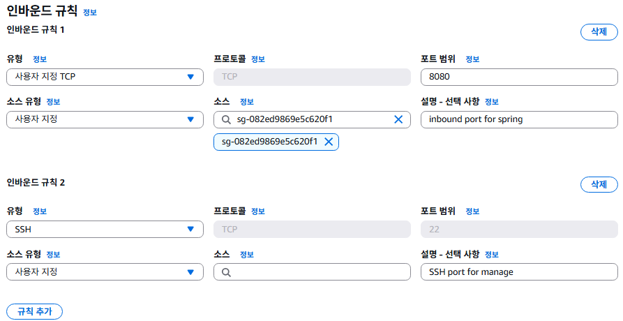
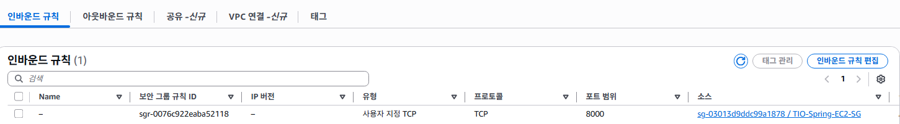
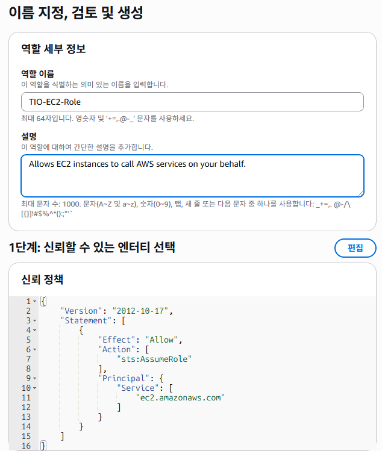

# AWS 인프라 구축기 2편: 보안그룹과 IAM 설정

지난 편에서 VPC와 네트워크 기초 구성을 완료했습니다. 이번 편에서는 우리의 공간(VPC)을 지키기 위한 방화벽 설정과 권한 관리를 해보겠습니다.

## 보안그룹(sg, security group) 생성

이제 우리의 공간(VPC 등), 을 지키기위해 방화벽을 설정하는 과정으로, 총 3개의 보안 그룹을 생성해야한다. `로드 밸런서(ALB)용 보안 그룹`, `EC2 서비스용 보안 그룹`, `DB용`

EC2 콘솔의 > 보안 그룹 > 보안 그룹 생성으로 이동한다

### Q1. AWS 워크샵에서는 EC2 생성후 보안그룹생성, ALB 생성후 보안그룹생성했는데 지금은 왜 각 그룹먼저 설정 후 인스턴스 / ALB 만들어 주면서 연결해주는지?

```
보안 그룹을 먼저 만드는 것이 더 좋은 이유
1. 상호 참조 (의존성) 문제 해결
이것이 가장 핵심적인 이유입니다. 우리의 아키텍처 목표를 다시 생각해보겠습니다.

"EC2 인스턴스는 오직 ALB로부터 오는 트래픽만 받아야 한다."

이 규칙을 구현하려면, EC2 보안 그룹의 인바운드 규칙에 "소스(Source)"로 ALB 보안 그룹을 지정해야 합니다.

만약 사용자님 말씀처럼, ALB를 만드는 과정에서 ALB 보안 그룹을 만들고, EC2 인스턴스를 만드는 과정에서 EC2 보안 그룹을 만든다고 가정해봅시다.
EC2 보안 그룹을 만드는 시점에는, 아직 세상에 존재하지 않는 ALB 보안 그룹을 "소스"로 지정할 수가 없습니다. 닭이 먼저냐, 달걀이 먼저냐 하는 문제가 생기는 것이죠.
결국 두 리소스를 다 만든 뒤, 다시 EC2 보안 그룹 설정으로 돌아가서 인바운드 규칙을 ALB 보안 그룹으로 수정하는 번거로운 추가 작업을 해야만 합니다. 이 과정에서 실수가 발생할 확률이 높아집니다.
2. 역할의 분리와 명확성
인프라를 구성하는 것을 "건축"에 비유할 수 있습니다.

보안 그룹, VPC, 서브넷 설정: 건물의 기초 공사와 방화벽, 출입문을 설계하고 만드는 **"설계/보안팀"**의 역할입니다.
EC2 인스턴스, ALB 생성: 설계도에 따라 실제 서버와 장비를 들여놓는 **"설비/운영팀"**의 역할입니다.
보안과 관련된 설정을 먼저 명확하게 끝내놓고, 그 위에 필요한 리소스들을 안전하게 얹는 방식이 훨씬 체계적이고 실수를 줄일 수 있습니다.

3. 관리의 용이성과 재사용성
보안 그룹은 일종의 "템플릿"입니다. 예를 들어, 쇼핑몰의 웹 서버가 10대가 필요하다면, 10개의 EC2 인스턴스 모두 동일한 my-shop-ec2-sg 보안 그룹을 사용하게 됩니다.

보안 정책 변경이 필요할 때 (예: 새 관리자 IP 추가) 이 보안 그룹 하나만 수정하면 10대의 서버에 모두 적용됩니다.
"리소스 생성 시 함께 만들기" 방식으로 하면 launch-wizard-1-sg, launch-wizard-2-sg 처럼 용도를 알 수 없는 보안 그룹들이 많아져 관리가 매우 어려워집니다.
```

### 로드 밸런서용 보안그룹 생성

> 이 보안 그룹은 인터넷으로부터의 웹 트래픽(HTTP/HTTPS)을 받아들이는 역할

이름 `TIO-ALB-SG`와 설명을 기입하고, 사용할 VPC 영역을 선택해준다.


꼭 기본 vpc가 아닌, 새로 생성한 VPC를 선택해야한다.

**`인바운드 규칙`** 을 모든 웹 트래픽을 받아들일 수 있도록 HTTP와 HTTPS(비필수, but 권장)을 열어준다.

여기서 `0.0.0.0/0`은 위치와 무관하게 접속을 허용한다는 의미이다.

### EC2 인스턴스용 보안그룹 생성

> 실제 애플리케이션이 설치 될 EC2 서버를 보호

여기선 총 `두 종류의 트래픽`을 허용해야함.

1. 로드 밸런서로부터 오는 애플리케이션 트래픽
2. 서버 관리를 위한 관리자의 SSH 접속 트래픽 (22번 포트)

생성 절차는 `인바운드 규칙`만 달리하고 모든 절차는 위와 같다.

인바운드 규칙에서 먼저. `애플리케이션의 포트`를 열어준다.


우리 프로젝트에서는 FastAPI, Node.js, Spring 이 세개를 비즈니스 로직처리에 사용하기 때문에. 세개에 대해서 인바운드 규칙을 설정해줘야한다.

> ❗우리의 서비스는 Spring에서 Node.js의 마이크로 서비스와 FastAPI를 호출하기 때문에, Spring은 ALB로의 inbound를 열지만, `Node.js 서버와 FastAPI의` inbound 규칙 `source`를 `Spring의 보안 그룹`으로 설정해준다.


(Spring의 호출을 열어 둔 Python 서버의 보안 그룹 규칙)

다 구성이 완료되면 아래와 같은 모습이 된다

```
+-------------------------------------------------------------------------+
|  VPC                                                                    |
|                                                                         |
|  +---------------------------+       +--------------------------------+ |
|  |   Availability Zone A     |       |   Availability Zone B          | |
|  |                           |       |                                | |
|  | +-----------------------+ |       | +----------------------------+ | |
|  | |  Private Subnet 1     | |       | | Private Subnet 2           | | |
|  | |                       | |       | |                            | | |
|  | |  [EC2 - Spring] <----sg-spring  | | [EC2 - Spring] <----sg-spring| |
|  | |  [EC2 - Python] <----sg-python  | | [EC2 - Python] <----sg-python| |
|  | |  [EC2 - Node]   <----sg-node    | | [EC2 - Node]   <----sg-node  | |
|  | |                       | |       | |                            | | |
|  | +-----------------------+ |       | +----------------------------+ | |
|  +---------------------------+       +--------------------------------+ |
|                                                                         |
+-------------------------------------------------------------------------+
```

일반적으로 혼자 작업한다면 이렇게 사용할 어플리케이션의 TCP 포트와, `포트범위 22의 SSH`를 열어주고 SSH 소스 부분에 내 고정 IP를 사용하면 된다.  
하지만 지금은 다수의 팀원들과 운영해야하고, 와이파이 환경이며(유동 ip인지, 아닌지 모름) 여러모로 여는게 보안상 불안하기때문에, `SSH를 열지 않기로 한다`.

그럼 어떻게 하느냐?

### AWS Systems Manager (SSM) 세션 관리자

를 활용한 방법이다. 현재 업계 표준이라고하며, AWS에서 권장한다고한다.


위 그림은 VPC의 Private Subnet 리소스에 접근하기 위한 SSH(기존) 과 SSM을 사용한 방법을 비교한 그림이다.

좌측은 SSH 이용 `Bastion Host` 경우, `Private Subnet`에 도달  
우측은 AWS SSM 이용 AWS System Manager를 거쳐서 가는 방법을 나타낸다.

```
[연결 흐름 비교]
기존: IDE → 인터넷 → EC2 공인 IP:22 (보안 그룹 22번 포트 열기 필수)
SSM: IDE → 로컬 PC의 SSH 설정 → AWS CLI (ProxyCommand) → SSM 터널 → EC2 인스턴스 (보안 그룹 22번 포트 닫기 가능)
```

**적용방법**은? 매우 간단하다. 별도의 보안 그룹 설정 없이, 작업할 작업자의 IAM 계정의 역할에 `AmazonSSMManagedInstanceCore` 만 붙여주면된다.

기존 SSH 방식에 비해 가지는 장점은

- Bastion Host, Key Pair, SG+Rule 다 필요없다
- 그럼에도 **SSH로 가능한건 다 한다**
- Private Subnet의 EC2 인스턴스에 바로 접속할 수 있다

이에 대한 IDE 등에서의 연결설정은 모든 설정을 끝내고 해주면 된다.

나머지 모든 3개의 어플리케이션에 대한 보안설정(`TIO-Spring-EC2-SG`, `TIO-Python-EC2-SG`, `TIO-Node.js-EC2-SG`을 마무리해준다.

`아웃바운드` 룰은 기본(`모든 트래픽 대상`)으로 둬도 된다.

---

### Q2. 보안 그룹은 각각 설정해줘야하는가?

구현하기 나름.

1. 각 애플리케이션을 별도 서버 그룹에 배포
2. 모든 애플리케이션을 하나의 인스턴스 그룹에 배포

이 두 가지 방식을 사용할 수 있는데,  
1번 방식을 사용하게되면,  

```
my-shop-ec2-sg의 인바운드 규칙:

포트 8080 (Spring)을 my-shop-alb-sg로부터 허용
포트 8000 (Python)을 my-shop-alb-sg로부터 허용
포트 3000 (Node.js)을 my-shop-alb-sg로부터 허용
```  

이렇게 각각의 SG를 설정하고, 각 EC2의 ALB에 적용해주면 된다.  

```
ALB (로드 밸런서) 구성
ALB의 경로 기반 라우팅(Path-based Routing) 규칙을 사용하여 트래픽을 분배

https://yourshop.com/api/spring/* 요청 → spring-target-group (Spring EC2 그룹)으로 전달
https://yourshop.com/api/python/* 요청 → python-target-group (Python EC2 그룹)으로 전달
https://yourshop.com/api/node/* 요청 → node-target-group (Node.js EC2 그룹)으로 전달
```

2번 방식의 경우 하나의 인스턴스 ALB에 하나의 보안 그룹을 설정하고, 모든 어플리케이션에 해당하는 `모든 포트`를 열어준다

```
my-shop-ec2-sg의 인바운드 규칙:
포트 8080 (Spring)을 my-shop-alb-sg로부터 허용
포트 8000 (Python)을 my-shop-alb-sg로부터 허용
포트 3000 (Node.js)을 my-shop-alb-sg로부터 허용
```

1번이 `매우` 권장되는 이유는 아래와 같다

- **독립적인 확장 (Independent Scaling)**: Python API에 트래픽이 몰리면 Python 서버 그룹만 증설(Scale-out)하면 됩니다. 다른 서비스에 영향을 주지 않습니다.
- **독립적인 배포 (Independent Deployment)**: Node.js 앱을 업데이트할 때, Spring Boot 서비스는 아무런 영향 없이 안정적으로 운영됩니다.
- **높은 보안성 및 명확성**: 각 서비스에 필요한 포트만 최소한으로 열기 때문에 보안에 유리하고, 어떤 보안 그룹이 어떤 역할을 하는지 명확하게 알 수 있습니다.
- **장애 격리 (Fault Isolation)**: 만약 Spring Boot 앱에 메모리 누수가 발생해 서버가 다운되어도, Python과 Node.js 서비스는 정상적으로 계속 작동합니다.

---

### DB 보안그룹 생성

`TIO-DB-SG`로 생성해준다.

이때 흐름자체가

- `DB 보안그룹` 의 인바운드 : 오직 `EC2 보안그룹` 으로부터 오는 요청만 허용한다
- `EC2 보안그룹` 의 아웃바운드 규칙 : 오직 `DB 보안그룹` 으로부터 나가는 요청을 허용한다.

### **Q3. 복합 데이터 흐름과 보안 그룹 규칙**

> 데이터 흐름이. 예를들어 FastAPI가 필요한 호출이 외부에서 들어오게되면 ALB를 통해서 spring을 거치고, fastapi에다가 요청을 넣으면, fastapi에서 S3의 이미지를 꺼내와서 처리를 하고 그 결과를 spring을 통해서 클라이언트로 보내주는데 이때 보안 그룹 규칙은 어떻게되는거지?

**데이터 흐름 시나리오:**
`클라이언트` → `ALB` → `Spring EC2` → `FastAPI EC2` → `S3` → `FastAPI EC2` → `Spring EC2` → `ALB` → `클라이언트`

| 단계 | 출발지 | 목적지 | 통과하는 보안 그룹 | **필요한 핵심 규칙 (Inbound 위주)** |
| :--- | :--- | :--- | :--- | :--- |
| **1.** | 클라이언트 (인터넷) | ALB | `sg-alb` (ALB 보안 그룹) | **Inbound:** 포트 `443`(HTTPS) / 소스 `0.0.0.0/0` |
| **2.** | ALB | Spring EC2 | `sg-spring` (Spring 보안 그룹) | **Inbound:** 포트 `8080` / 소스 **`sg-alb`** |
| **3.** | **Spring EC2** | **FastAPI EC2** | **`sg-python`** (Python 보안 그룹) | **Inbound: 포트 `8000` / 소스 `sg-spring`** |
| **4.** | **FastAPI EC2** | **Amazon S3** | `sg-python` (아웃바운드) | **Outbound:** 포트 `443` / 대상 `S3 엔드포인트` 또는 `0.0.0.0/0` |
| **5.** | FastAPI EC2 | Spring EC2 | `sg-spring` (인바운드) | **(규칙 불필요)** - 3번 요청에 대한 **Stateful 응답**이므로 자동 허용 |
| **6.** | Spring EC2 | ALB | `sg-alb` (인바운드) | **(규칙 불필요)** - 2번 요청에 대한 **Stateful 응답**이므로 자동 허용 |
| **7.** | ALB | 클라이언트 (인터넷) | - | **(규칙 불필요)** - 1번 요청에 대한 **Stateful 응답**이므로 자동 허용 |

#### **단계별 상세 설명:**

- **1단계 (클라이언트 → ALB):** 외부 사용자의 요청. ALB 보안 그룹(`sg-alb`)이 인터넷(`0.0.0.0/0`)으로부터의 웹 트래픽(HTTPS/443)을 허용.

- **2단계 (ALB → Spring):** ALB가 Spring 서버로 요청을 전달. Spring 보안 그룹(`sg-spring`)이 ALB 보안 그룹(`sg-alb`)으로부터의 애플리케이션 트래픽(8080)을 허용.

- **3단계 (Spring → FastAPI):** **가장 핵심적인 부분입니다.** Spring이 FastAPI를 동기 호출. FastAPI 서버의 보안 그룹(`sg-python`)이 Spring 서버 보안 그룹(`sg-spring`)으로부터의 API 트래픽(8000)을 허용. 이 규칙이 없으면 Spring은 FastAPI에 접속할 수 없음.

- **4단계 (FastAPI → S3):** FastAPI가 S3에서 이미지를 가져옴.

  - 이 통신은 FastAPI EC2 인스턴스에서 시작되는 **아웃바운드(Outbound)** 통신.
  - 이전에 설정한 **S3 게이트웨이 엔드포인트**를 사용한다면, 이 트래픽은 AWS 내부망을 통해 S3로 안전하게 라우팅됨.
  - `sg-python`의 아웃바운드 규칙에 HTTPS(443)가 허용되어 있어야 함. (기본 아웃바운드 규칙은 '모두 허용'이므로 보통은 문제없이 동작.)

- **5, 6, 7단계 (응답 트래픽):**

  - 이 모든 과정은 맨 처음에 클라이언트가 시작한 단일 요청에 대한 "응답"의 흐름이다.
  - 보안 그룹은 **Stateful**이기 때문에, 한 번 허용된 요청에 대한 응답 트래픽은 **별도의 규칙 없이 자동으로 허용**된다. 따라서 FastAPI → Spring, Spring → ALB, ALB → 클라이언트로 돌아가는 응답 경로는 추가적인 보안 그룹 규칙 설정이 필요 없다고 한다.

결론적으로, 이 복잡한 흐름을 가능하게 하는 가장 중요한 맞춤 규칙은 **`sg-python`의 인바운드 규칙에 `sg-spring`을 허용해주는 설정** 단 하나다.

## IAM 역할 생성

우리는 Auto Scaling Group에게 서버의 생성과 관리를 위임하기 위해서, 해당 기능을 구현하기 위해 `EC2` 서버에게 IAM role을 부여해 줄 것이다.  
> "너는 SSM, S3, CloudWatch와 통신할 수 있는 권한이 있어" 라고 허락해주는 역할

검색창에 IAM 검색하여 들어온 콘솔에서, `역할 만들기`를 눌러 들어온다.


다음 권한 추가 창에서 아래 3개의 정책을 찾아 체크해준다.

- AmazonSSMManagedInstanceCore (SSM 원격 접속용)
- AmazonS3FullAccess (S3 파일 접근용)
- CloudWatchAgentServerPolicy (서버 모니터링 및 로그 수집용)  
3개를 모두 체크했으면 [다음] 클릭




역할 생성 후 다음 편에서는 이 보안 설정을 바탕으로 로드밸런서와 Auto Scaling을 구축해보겠습니다.
