# AWS 인프라 구축기 3편: 로드밸런서와 Auto Scaling 구축

지난 편에서 보안그룹과 IAM 설정을 완료했습니다. 이번 편에서는 실제 트래픽을 처리할 로드밸런서와 자동 확장 기능을 구축해보겠습니다.

## ALB (Application Load Balancer) 생성

> Network - Amazon VPC 실습에서 생성한 네트워크 인프라를 사용하여 부하에 따라 자동으로 확장/축소할 수 있고 고가용성을 보장하는 웹 서비스를 배포합니다. (라고 AWS에서 설명한다)


결국 쉽게 말하면 정문같은 느낌이다.

### Target Group 생성

먼저 ALB 전에 Target Group을 생성한다. 이는 ALB가 트래픽을 전달할 대상(EC2 인스턴스, 우리는 `Spring 인스턴스`가 되겠다)의 그룹을 정의한다.

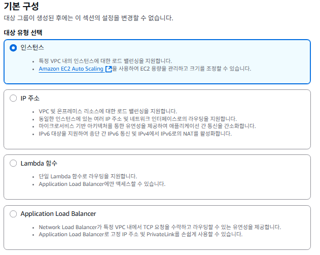  
EC2 콘솔 > 대상 그룹 > 대상 그룹 생성으로 가서 인스턴스를 대상으로 생성해준다.

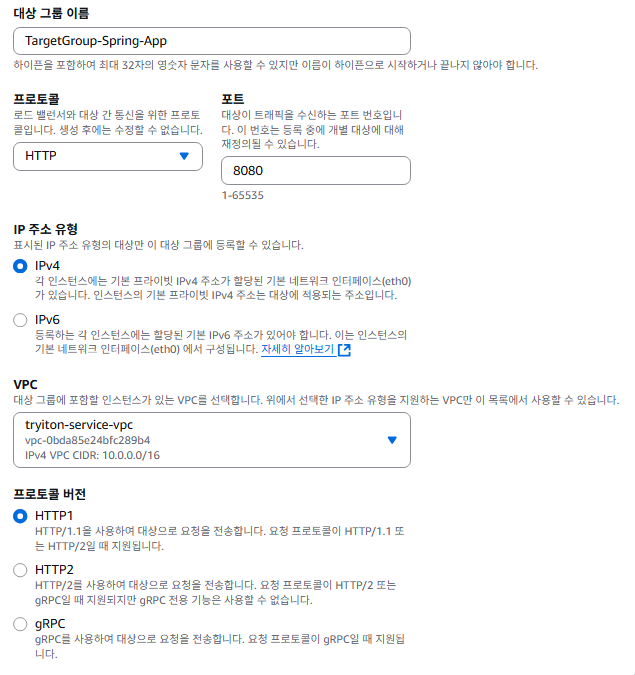

spring으로 들어오는 호출이기때문에 포트번호를 `8080`으로 맞춰주고, VPC를 우리가 생성한것으로 변경해주면된다. 나머지는 기본값으로.


상태 검사 경로는 `Spring Boot Actuator` 라이브러리에서 저 경로를 통해 DB 연결 상태까지 확인해준다.

만일 라이브러리가 없더라도 나중을 위해 경로를 적어줘도 서버 설정에는 무방하고. 필요한 시점에 프로젝트의 `build.gradle`에 의존성을 추가해준다.

```Groovy
dependencies {
    implementation 'org.springframework.boot:spring-boot-starter-actuator'
}
```

다음으로 넘기면 현재까지는 인스턴스가 없기 때문에 바로 `대상 그룹 생성`으로 종료한다.

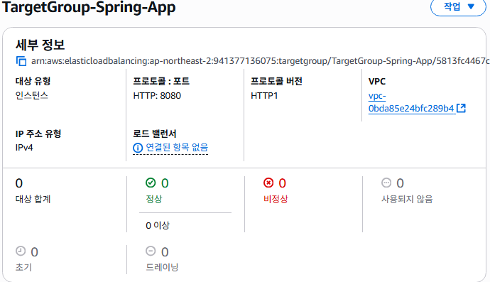

이제 로드밸런서를 생성해 이 콘솔을 채워준다.

### 로드밸런서


제일 왼쪽을 누르면 된다.

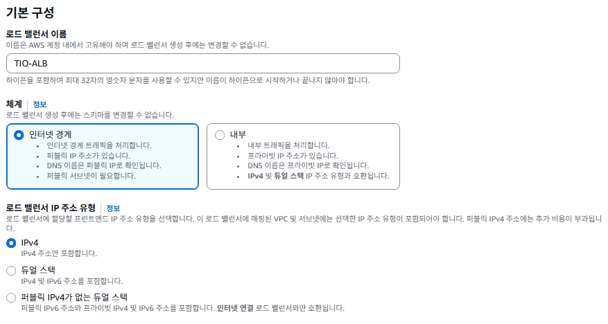


이 부분이 조금 중요하다. 현재 vpc로 골라주고, `가용 영역 및 서브넷`의 두 서브넷을 체크해주면 고를 수 있는 박스가 나온다.

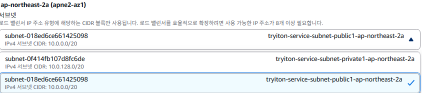

우리의 ALB는 `인터넷과 직접 통신`해줘야 하기 때문에, 반드시 두 개의 서브넷 모두 `public`으로 설정해주어야한다.

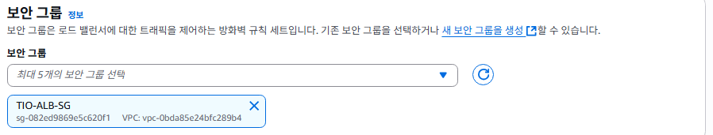

초반에 만든 ALB의 보안그룹을 지정해주고,


리스너는 기본값인 프로토콜 `HTTP`와 포트 `80`으로 되어있는지 확인만 하자.  
그리고 직전에 생성한 `TargetGroup`을 선택해준다.

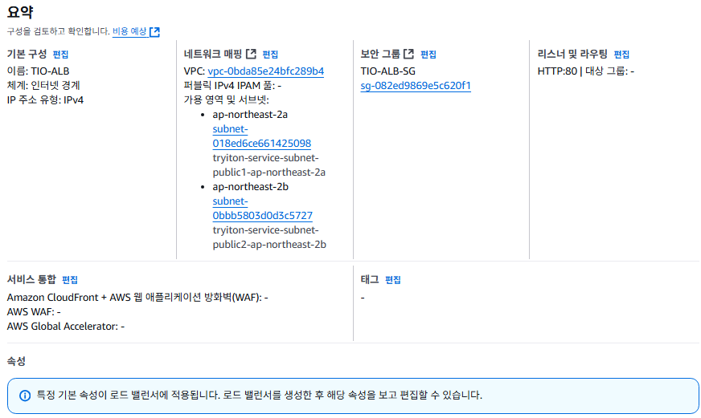
이상없이 설정 해줬다면 아래로 쭉 스크롤하여, `요약`에서 이상없는지 최종 확인하고 **`로드 밸런서 생성`** 클릭.


상단에 `로드 밸런서 생성 완료` 라는 메시지가 뜨며 아무것도 없던 `EC2 > 로드 밸런서`콘솔로 빠져나오게된다.

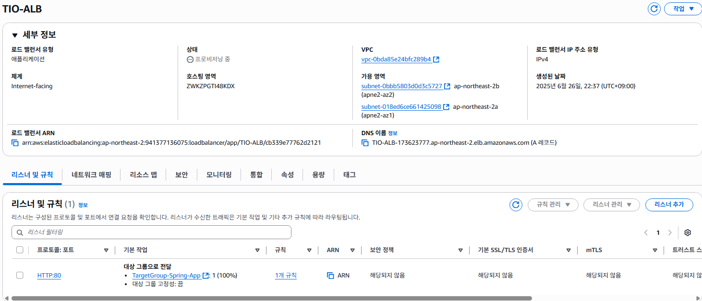

상태를 보면 회색 음영처리된 글씨로 `프로비저닝(Provisioning) 중`이라고 떠있는데, `활성(Active)` 상태로 변경되는데 몇분정도 소요된다.


## Launch Template 생성

시작 템플릿은 일종의 도면이다. 로드밸런싱에 의해 EC2를 자동으로 늘려줘야 하는 상황에서도, 이 도면(시작 템플릿)을 보고 그대로 늘려주게 된다.

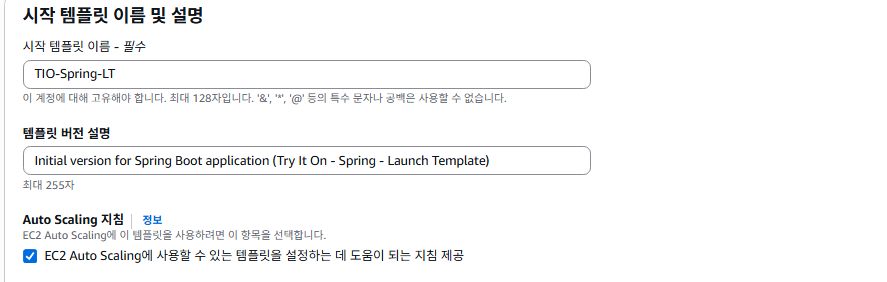

Auto Scaling 지침 꼭 체크해주자. 말이 모호하긴한데, 그냥 AWS가 이 설정을 인식하고 필요한 상황에 `이 템플릿을 사용하세요` 라는 사인? 같은거라고 생각하면된다.


쓰고싶은 AMI를 고른다. 꼭 특정 버전의 Ubuntu를 사용해야하고, 의존성 문제가 있는게 아니라면 Amazon Linux가 무난한 선택지라고한다.  
(일단 무료에, EC2 맞춤형 튜닝, AWS측 보안패치 자동 제공 등)

혹시 나중에라도 AMI를 바꾸고싶다면 현재 만들었던 템플릿을 기반으로 새로운 버전을 만들어주게되면 서버 실행에는 영향을 끼치지 않고 버전 교체를 해 줄 수 있다.

> 잠깐 설명하면 템플릿 교체 하는법은 아래와 같다.  
> `새버전 생성` -> `Auto Scaling Group 설정 내 새 시작템플릿으로 변경` -> `Auto Scaling Group 의 인스턴스 새로고침 시작으로 새 이미지 업로드`
>

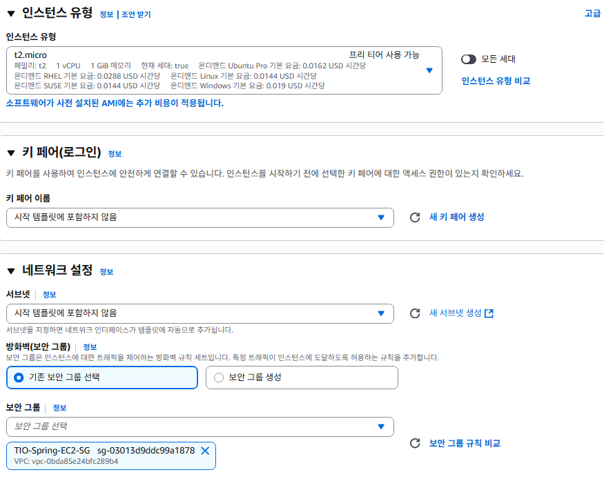

인스턴스 유형은 아직까지 개발 / 테스트 단계이기 때문에 t2.micro로 설정해준다.
SSM을 쓸 것이기 때문에, 키페어는 비워둔다
방화벽에서 기존 보안 그룹 선택, 보안그룹 설정은 만들어둔 `TIO-Spring-EC2-SG` 보안 그룹 선택한다.

스토리지도 상술한 이유로 일단 기본값으로 해준다.


아까 생성한 TIO-EC2-Role을 골라준다.


이 곳에 각 인스턴스가 생성될 때 마다 반복적으로 초기화해줄 `사용자 데이터`의 스크립트 작성해준다.

### 사용했던 사용자 데이터 스크립트

```Bash
#!/bin/bash
# 1. 시스템 패키지 업데이트 (보안 강화)
sudo dnf update -y

# 2. 타임존을 한국 시간으로 변경 (로그 시간 동기화)
sudo timedatectl set-timezone Asia/Seoul

# 3. Java 17 (Corretto) 설치
sudo dnf install java-17-amazon-corretto-devel -y

# 4. CodeDeploy 에이전트 설치 (CI/CD 자동 배포 준비)
#    - CodeDeploy 에이전트는 Ruby를 필요로 합니다.
sudo dnf install ruby -y
sudo dnf install wget -y
cd /home/ec2-user
wget https://aws-codedeploy-ap-northeast-2.s3.ap-northeast-2.amazonaws.com/latest/install
chmod +x ./install
sudo ./install auto

# 5. CloudWatch 에이전트 설치 및 설정/실행 (중앙 로깅 및 모니터링)
sudo dnf install amazon-cloudwatch-agent -y

# CloudWatch 에이전트 설정 파일 생성
# - 이 설정은 메모리/디스크 사용률 같은 시스템 지표와 /app/logs/application.log 파일을 수집합니다.
sudo bash -c 'cat <<EOF > /opt/aws/amazon-cloudwatch-agent/bin/config.json
{
  "agent": {
    "metrics_collection_interval": 60,
    "run_as_user": "root"
  },
  "metrics": {
    "metrics_collected": {
      "disk": {
        "measurement": [
          "used_percent"
        ],
        "metrics_collection_interval": 60,
        "resources": [
          "*"
        ]
      },
      "mem": {
        "measurement": [
          "mem_used_percent"
        ],
        "metrics_collection_interval": 60
      }
    }
  },
  "logs": {
    "logs_collected": {
      "files": {
        "collect_list": [
          {
            "file_path": "/app/logs/application.log",
            "log_group_name": "/my-shop/ec2/spring-application",
            "log_stream_name": "{instance_id}"
          }
        ]
      }
    }
  }
}
EOF'

# CloudWatch 에이전트 실행 및 부팅 시 자동 시작 설정
sudo /opt/aws/amazon-cloudwatch-agent/bin/amazon-cloudwatch-agent-ctl -a fetch-config -m ec2 -s -c file:/opt/aws/amazon-cloudwatch-agent/bin/config.json
sudo systemctl enable amazon-cloudwatch-agent
```

### 각 추가 항목의 의미

1. **시스템 업데이트**: 서버가 시작될 때마다 OS의 모든 패키지를 최신 버전으로 업데이트하여, 알려진 보안 취약점들을 사전에 방지.

2. **타임존 설정**: 서버의 기본 시간은 보통 UTC(세계 표준시)입니다. 모든 로그(에러 로그, 접속 로그 등)와 애플리케이션의 시간 기록이 한국 시간(KST)으로 통일되어야 나중에 문제를 추적하기 매우 쉬움.

3. **CodeDeploy 에이전트 설치**: 가장 중요한 추가 항목 중 하나입니다. 나중에 `GitHub Actions 등으로 CI/CD 파이프라인을 구축`할 때, AWS의 `CodeDeploy`라는 서비스가 이 에이전트를 통해 서버에 접속하여 애플리케이션 코드를 자동으로 배포(복사, 실행). 이것을 미리 설치해두는 것.

4. **CloudWatch 에이전트 설정 및 실행**: 단순히 에이전트를 설치만 하는 것을 넘어, 실제로 동작하도록 설정하고 실행하는 단계.

config.json 파일을 만들어 "어떤 지표와 로그 파일을 수집해서, 어떤 이름으로 CloudWatch에 보낼지"를 정의
EC2 인스턴스의 메모리/디스크 사용률과, 나중에 우리 Spring 애플리케이션이 생성할 로그 파일(/app/logs/application.log)을 수집하도록 설정했다.
이렇게 해야 실제로 CloudWatch 대시보드에서 서버의 상태를 모니터링하고 로그를 검색할 수 있게 된다고 한다.

---

### Launch Template 생성 완료

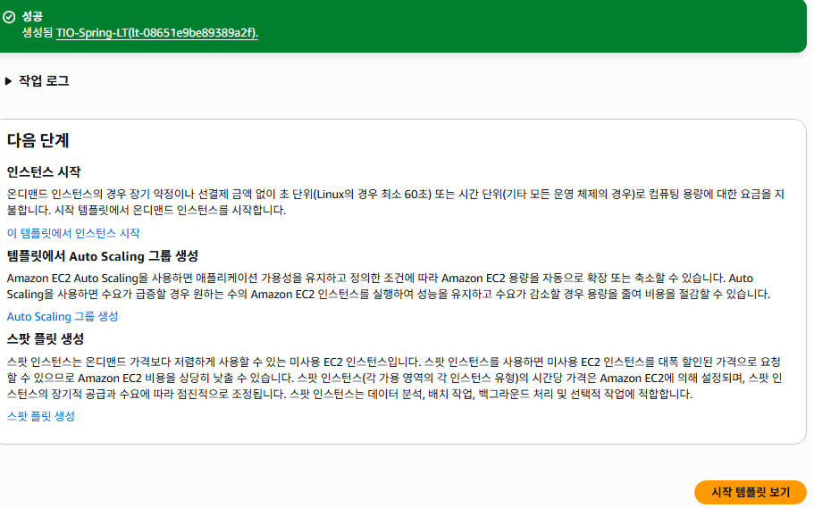

이제 Auto Scaling Group을 위한 준비가 완료되었다.

## Auto Scaling Group

> Auto Scaling Group(ASG)은 '서버 공장'이자 '서버 관리 매니저'이다. 시작 템플릿을 기반으로 EC2 인스턴스를 찍어내고, 항상 정해��� 수의 인스턴스가 건강하게 동작하도록 관리하며, ALB와 연동하는 모든 것을 책임진다

EC2 > Auto Scaling 그룹 > Auto Caling 그룹 생성으로 이동한다

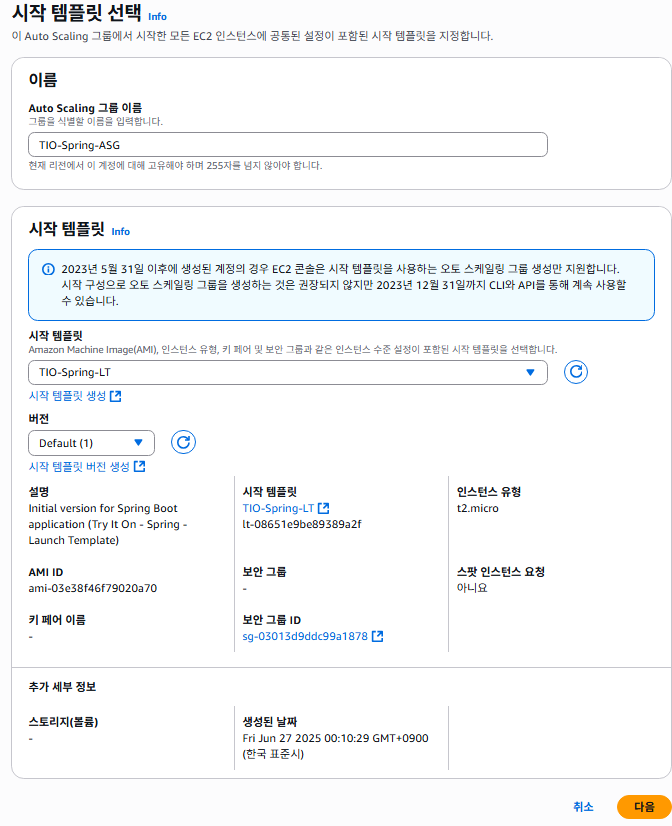
Auto Scaling 그룹 이름: TIO-Spring-ASG
시작 템플릿: 드롭다운 메뉴에서 우리가 만든 TIO-Spring-LT를 선택합니다.
템플릿 버전이 'Default (1)'로 올바르게 선택되었는지 확인하고 **다음**을 클릭합니다.

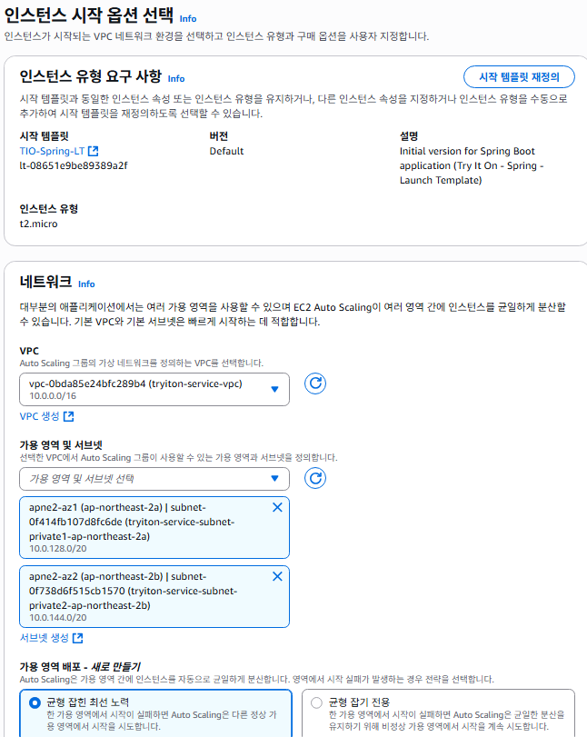

네트워크 (VPC): tryiton-service-vpc가 선택되어 있는지 확인합니다.  
가용 영역 및 서브넷: `프라이빗 서브넷(Private Subnet)` 2개를 모두 선택합니다.  

- (매우 중요!) 우리의 애플리케이션 서버는 외부 인터넷에 직접 노출되면 안 되므로, 반드시 안전한 프라이빗 서브넷에 위치해야 합니다.

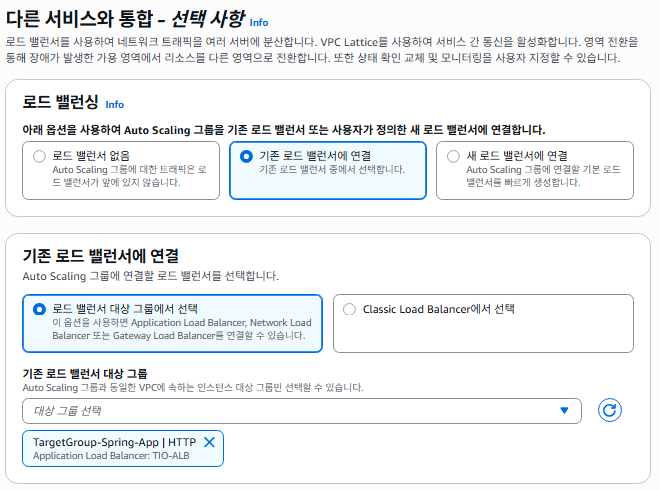

기존 로드 밸런서 대상 그룹에서 아까 만들어준 `TargetGroup`을 연결해준다


서버의 상태를 지속 확인하고 ALB가 `비정상`이라 판단 시 자동으로 교체해주어 `안전성`이 높아진다.

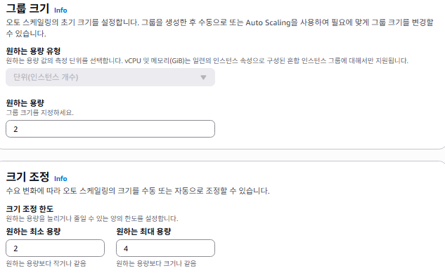

- 원하는 용량(Desired capacity): 2
  - ASG가 항상 유지하려고 노력하는 인스턴스 수
- 최소 용량(Minimum capacity): 2
- 최대 용량(Maximum capacity): 4 (나중에 트래픽이 많아지면 최대 4대까지 자동으로 늘어날 수 있다.)  

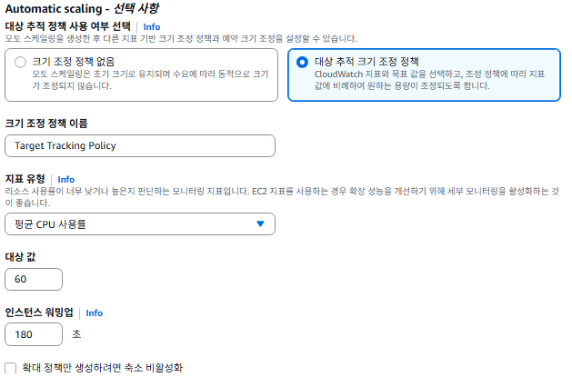

- 조정 정책: 대상 추적 조정 정책을 선택
- 조정 정책 이름: TIO-CPU-Scaling-Policy (식별하기 쉬운 이름)
- 측정항목 유형: 평균 CPU 사용률(Average CPU utilization)
- 대상 값 (Target value): 60
  - 의미: Auto Scaling Group에 속한 모든 서버들의 평균 CPU 사용률을 60% 수준으로 유지하겠다는 의미. 만약 평균값이 60%를 초과하면 서버를 늘리고, 한참 낮으면 서버를 줄임.
  - (참고: 60% ~ 70% 사이의 값이 일반적으로 많이 사용 된다고 한다. 너무 낮게 잡으면 너무 자주 서버가 늘어나 비용이 증가하고, 너무 높게 잡으면 트래픽이 폭증할 때 대응이 늦을 수 있음.)
- 인스턴스 준비 기간 (Instance warmup): 180 초 (3분)
  - 의미: 새 인스턴스가 시작된 후, 사용자 데이터 스크립트가 실행되고 Java 애플리케이션이 완전히 구동되어 정상적으로 트래픽을 받을 준비가 될 때까지 걸리는 시간을 의미. 이 시간 동안에는 해당 인스턴스의 CPU 사용률을 평균값 계산에서 제외하여 불필요한 추가 확장을 방지합니다. Java 애플리케이션은 시작 시간에 약간의 시간이 걸리므로 3분 정도로 넉넉하게 설정하는 것이 좋음.

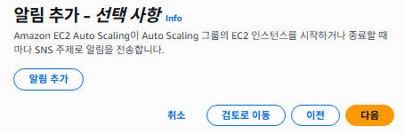

생략


우리가 설정한걸 최종 검토하고 `Auto Scaling 그룹 생성` 을 눌러주면


콘솔에서 준비중인것을 확인할 수 있고, 잠시.. 기다리고 EC2 인스턴스 대시보드로 가면, 새로운 인스턴스가 `2개` 실행중인 것을 확인할 수 있다.

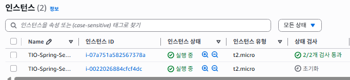

어떻게 이런일이 가능한건지? 는, Auto Scaling Group이 생성되는 순간 아래의 절차를 백그라운드에서 수행한다.

1. Auto Scaling Group이 TIO-Spring-LT 설계도를 읽습니다.
2. 원하는 용량인 2대에 맞춰, 지정된 프라이빗 서브넷에 EC2 인스턴스 2대를 생성하기 시작합니다.
3. 각 인스턴스가 켜지면서, 우리가 넣었던 사용자 데이터 스크립트가 실행되어 Java, 에이전트 등이 자동으로 설치됩니다.
4. 생성이 완료된 인스턴스들은 자동으로 TargetGroup-Spring-App 대상 그룹에 등록됩니다.
5. ALB가 대상 그룹에 등록된 새 인스턴스들을 대상으로 **상태 검사(/actuator/health)**를 시작합니다.
6. 상태 검사를 통과하면, 인스턴스의 상태가 **'healthy'**로 바뀌고, ALB는 드디어 실제 트래픽을 이 인스턴스들로 보내기 시작합니다.

다음 편에서는 데이터베이스와 스토리지 설정을 진행하겠습니다.
