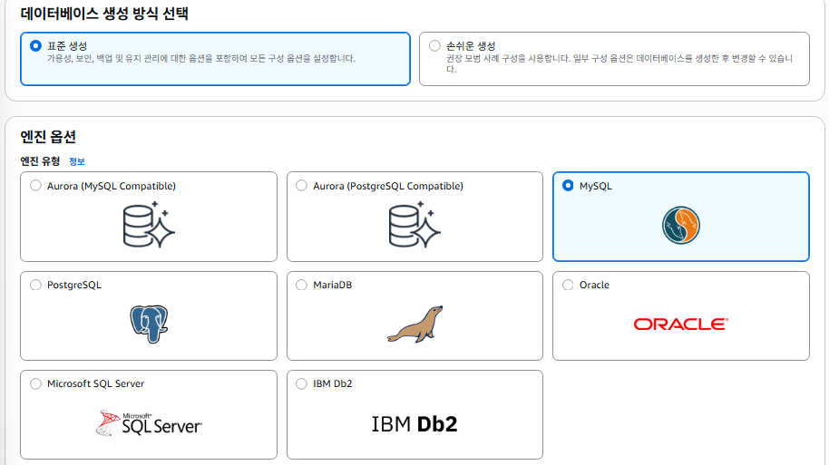
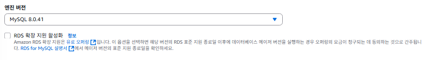
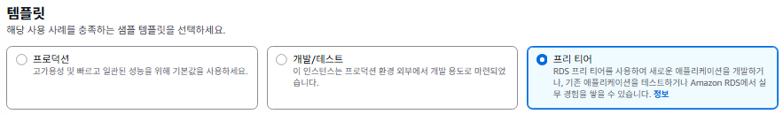
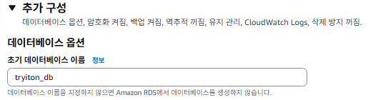
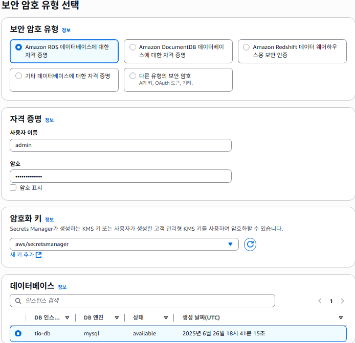
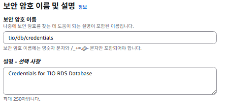
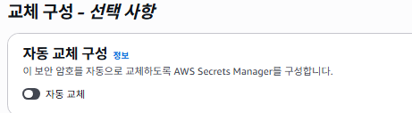
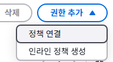
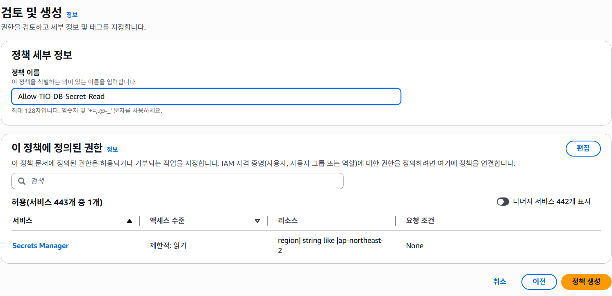
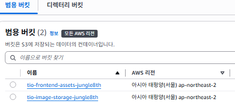

# AWS 인프라 구축기 4편: 데이터베이스와 스토리지 구축

지난 편에서 로드밸런서와 Auto Scaling을 구축했습니다. 이번 편에서는 데이터를 저장할 데이터베이스와 파일 스토리지를 설정해보겠습니다.

## RDS(데이터베이스) 생성

> 모든 상품 정보, 회원 데이터, 주문 내역 등을 저장할 서비스의 DB. RDS를 사용하여 MySQL 데이터베이스 인스턴스를 생성. `프라이빗 서브넷`에 위치 시키고, 이전에 설계한 `TIO-DB-SG` 보안 그룹을 적용하여 EC2 서버들만 접속하도록 설정.

### 보안 그룹 생성

> 우리 서버들만 이 DB에 접속할 수 있다고 허용.


**`인바운드 규칙`**을 유형은 `MySQL`, 소스는 우리 3개의 서버(`spring, node, python`)만 접근 가능하도록 설정한다.


나머지는 기본값 동일.

### RDS 인스턴스 생성





특별한 이유가 없다면 Aurora보다 MySQL을 사용하자. `프리티어`(20GiB, 범용 SSD)도 가능함(일반적인 개발 수준의 트래픽에서는 오버스펙)


인스턴스 명칭(DB 서버명), 마스터 사용자 이름 / `암호`를 설정한다.  
암호는 추후 애플리케이션에서 사용해야하므로, 잊어버리지 않도록 주의


`인스턴스 구성`, `스토리지` 우리는 프리티어니까 기본 설정으로 둔다.  
초기에는 저정도도 넉넉하다


`연결`에서, `VPC`(이제는 지긋지긋하지만, 해줘야한다)와


`VPC 보안 그룹`을 아까 만들어준 DB-SG로 변경해준다. 그리고 `default`가 체크되어있을 텐데, ❗***꼭 해제해줘야한다***



`추가 구성`을 펼쳐서, `초기 데이터베이스 이름`을 설정한다.

> ❗초기 데이터베이스 이름을 설정하지 않게되면 인스턴스는 정상적으로 생성되나. `스키마`(빈방)이 없는 상태로 만들어짐

**아파트 비유**

- RDS 인스턴스: 새로 지은 텅 빈 아파트 건물

- '초기 데이터베이스 이름' 설정: "건물이 완공되면, 미리 '101호' 라는 이름의 방 하나만 만들어주세요" 라고 건축 회사에 요청하는 것과 같습니다.

- `설정하지 않았을 경우`: 그냥 텅 빈 건물만 덩그러니 지어지는 것입니다. 아직 `호실이 하나도 없는 상태`입니다.  
나중에 우리가 '101호'로 이사 들어가려고 하면(`애플리케이션 연결`), "그런 호수는 없는데요?" 라는 말을 듣게 됨.  
그래서 우리가 `직접` 건물에 들어가서 '101호'라는 방을 만드는 공사(`SQL 명령어 실행`)를 해야만 함

아무튼 특별한 이유가 없다면 `설정하는게 맞다`


나머지는 기본설정으로 두고 생성해주면 데이터베이스의 인스턴스가 생성되게된다.  
`시간이 좀 걸린다`


창 띄워놓고 넋놓고 있다보면(굳이 그럴필요는 없다) 초록창으로 띠며 인스턴스 생성이 완료된다 :)


지금까지의 구현 상태는 위와 같다. (완전히 같진 않아도)

## AWS Secrets Manager 설정 및 RDS 자격 증명 저장

> 데이터베이스 자격 증명, API 키 등 모든 종류의 비밀 정보를 안전하게 저장하고 관리하며, 자동으로 교체해주는 서비스

참고: <https://catalog.us-east-1.prod.workshops.aws/workshops/869a0a06-1f98-4e19-b5ac-cbb1abdfc041/ko-KR/advanced-modules/database/connect-app>

즉 이 작업의 목표는 아까 RDS 생성시 사용한 `마스터 사용자 이름`과 `암호`를 코드나 서버가 아닌 AWS에 보관하는 것

여기서 새 보안암호를 만들건데, 이친구의 동작과 역할은

- RDS 마스터 사용자 이름과 암호를 Secrets Manager에 '비밀'로 저장합니다.
- EC2 인스턴스의 IAM 역할(TIO-EC2-Role)에 "이 특정 비밀을 읽을 수 있는 권한"을 부여합니다.
- Spring 애플리케이션이 시작될 때, AWS SDK를 사용하여 IAM 역할의 권한으로 Secrets Manager에 접속하여 DB 비밀번호를 안전하게 가져옵니다.
- 가져온 비밀번호를 사용해 DB에 연결합니다.

이렇게 함으로서, 소스코드에 비밀번호를 남기지 않고, 자동 암호 교체로 주기적으로 DB 암호를 자동으로 변경하여 보안을 극대화함.

### 새 보안 암호 저장

콘솔창에서 `AWS Secrets Manager`를 검색해서 들어간 후 `새 보안 암호 저장`을 클릭


내부 설정은 다 기본으로 놔두고, 아까 만든 계정의 이름과 비밀번호를 기입하고, DB 인스턴스를 선택한다.


나중에 관리하기 편하도록 이름과 설명을 기입한다.
(이름 : 일반적으로, 프로젝트명/서비스명/용도)


기본으로 두고 저장하여 완료한다.


이제 이 DB 접근은 우리의 애플리케이션 서버(spring, python, node)에서만 접근할 수 있도록 해야한다.

저장 직전에 검토단계에서 샘플코드로, 각 언어별 보안 암호 검색 코드를 제공한다.  
그 코드는 어플리케이션 실행 시 암호 취득 후 DB에 접근할 수 있도록 한다.

---

### AWS SDK 샘플코드

#### spring(java)

```java
// Use this code snippet in your app.
// If you need more information about configurations or implementing the sample
// code, visit the AWS docs:
// https://docs.aws.amazon.com/sdk-for-java/latest/developer-guide/home.html

// Make sure to import the following packages in your code
// import software.amazon.awssdk.regions.Region;
// import software.amazon.awssdk.services.secretsmanager.SecretsManagerClient;
// import software.amazon.awssdk.services.secretsmanager.model.GetSecretValueRequest;
// import software.amazon.awssdk.services.secretsmanager.model.GetSecretValueResponse; 

public static void getSecret() {

    String secretName = "tio/db/credentials";
    Region region = Region.of("ap-northeast-2");

    // Create a Secrets Manager client
    SecretsManagerClient client = SecretsManagerClient.builder()
            .region(region)
            .build();

    GetSecretValueRequest getSecretValueRequest = GetSecretValueRequest.builder()
            .secretId(secretName)
            .build();

    GetSecretValueResponse getSecretValueResponse;

    try {
        getSecretValueResponse = client.getSecretValue(getSecretValueRequest);
    } catch (Exception e) {
        // For a list of exceptions thrown, see
        // https://docs.aws.amazon.com/secretsmanager/latest/apireference/API_GetSecretValue.html
        throw e;
    }

    String secret = getSecretValueResponse.secretString();

    // Your code goes here.
}
```

#### node.js(JS)

```javascript
// Use this code snippet in your app.
// If you need more information about configurations or implementing the sample code, visit the AWS docs:
// https://docs.aws.amazon.com/sdk-for-javascript/v3/developer-guide/getting-started.html

import {
  SecretsManagerClient,
  GetSecretValueCommand,
} from "@aws-sdk/client-secrets-manager";

const secret_name = "tio/db/credentials";

const client = new SecretsManagerClient({
  region: "ap-northeast-2",
});

let response;

try {
  response = await client.send(
    new GetSecretValueCommand({
      SecretId: secret_name,
      VersionStage: "AWSCURRENT", // VersionStage defaults to AWSCURRENT if unspecified
    })
  );
} catch (error) {
  // For a list of exceptions thrown, see
  // https://docs.aws.amazon.com/secretsmanager/latest/apireference/API_GetSecretValue.html
  throw error;
}

const secret = response.SecretString;

// Your code goes here
```

#### python

```python
# Use this code snippet in your app.
# If you need more information about configurations
# or implementing the sample code, visit the AWS docs:
# https://aws.amazon.com/developer/language/python/

import boto3
from botocore.exceptions import ClientError


def get_secret():

    secret_name = "tio/db/credentials"
    region_name = "ap-northeast-2"

    # Create a Secrets Manager client
    session = boto3.session.Session()
    client = session.client(
        service_name='secretsmanager',
        region_name=region_name
    )

    try:
        get_secret_value_response = client.get_secret_value(
            SecretId=secret_name
        )
    except ClientError as e:
        # For a list of exceptions thrown, see
        # https://docs.aws.amazon.com/secretsmanager/latest/apireference/API_GetSecretValue.html
        raise e

    secret = get_secret_value_response['SecretString']

    # Your code goes here.
```

## EC2의 RDS 접근권한 부여

### IAM Policy(정책) 설정

> 최소 권한 원칙을 따르기 위해 리소스에 필요한 권한만 부여하는 것이 모범 사례로, 인스턴스에 DB 자격 증명이 포함된 특정 Secret에 액세스 할 수 있는 권한만 부여.

`TIO-EC2-Role`이라는 IAM의 `역할`에, 비밀을 읽어올 수 있도록 권한을 부여해 주는것이 목표이다.

IAM 관리 콘솔의 역할목록에서 역할을 찾아 클릭하면,  



`권한 추가` 버튼을 눌러 `인라인 정책 생성` 을 눌러준다
> 인라인 정책생성을 사용하는 이유:  
> 이 권한은 오직 이 역할에만 사용되는 특수한 경우로,  
> `다른 곳에서 재사용할 필요 없는` 인라인 정책으로 `직접` 붙여주는것


선택 버튼에 `시각적` / `JSON` 중에 JSON을 누르게되면 편집기가 뜨고,

기존의 코드를 다 날리고 아래의 코드로 대체한다

```json
{
    "Version": "2012-10-17",
    "Statement": [
        {
            "Sid": "AllowReadTioDbCredentialsSecret",
            "Effect": "Allow",
            "Action": "secretsmanager:GetSecretValue",
            "Resource": "YOUR_SECRET_ARN"
        }
    ]
}
```

`YOUR_SECRET_ARN` 값을 아까 Secrets Manager 콘솔에서 생성해준 비밀을 클릭하고, 보안 암호 ARN (Secret ARN) 값을 복사해서 넣어주고 정책 생성해주면 된다.



## S3 버킷 생성 (파일 스토리지)

어렵지 않은 과정이라 AWS 교육 링크로 대체한다  
<https://catalog.us-east-1.prod.workshops.aws/workshops/869a0a06-1f98-4e19-b5ac-cbb1abdfc041/ko-KR/advanced-modules/storage/create-bucket>


우리 프로젝트는 2개의 버킷을 생성하였다.
> ✅ 사실 한참 뒤에 설명하겠지만, CICD를 위한 빌드 저장용으로도 하나 만들어야한다.

- 프론트엔드 배포용 : `tio-frontend-assets-jungle8th`
- 이미지 저장용 : `tio-image-storage-jungle8th`

이렇게 분리한 가장 큰 이유는 `보안`이고 나머지는 관리의 용이성이다.

프론트엔드 배포용은 생성 후 추가 설정이 필요하다.


버킷의 속성 > 정적 웹사이트 호스팅 > 편집을 클릭하고,  


활성화 선택 후 인덱스 문서와 오류 문서에 모두 `index.html`을 입력

> 지금은 모든 퍼블릭 액세스가 막혔지만,  
> 이후 CloudFront생성 / S3와 연결하는 단계에서 관련 정책을 자동으로 추가해준다

---

### **두 버킷을 분리해야 하는 이유**

| 항목 | **1. 프론트엔드 배포용 버킷 (Next.js)** | **2. 이미지 저장용 버킷** |
| :--- | :--- | :--- |
| **주요 목적** | 웹사이트 파일(HTML, JS, CSS) 호스팅 | 사용자/상품 이미지, 파일 저장 |
| **주요 접근 주체**| **전 세계 인터넷 사용자 (Public Read)**, CloudFront | **애플리케이션 서버 (EC2)**, IAM 역할 |
| **퍼블릭 액세스** | **필요함** (웹사이트로 동작해야 하므로) | **절대 금지** (Private이 기본 원칙) |
| **보안 정책** | CloudFront를 통해서만 접근하도록 제한 (OAI/OAC) | 특정 IAM 역할에게만 CRUD 권한 부여 |
| **라이프사이클** | 배포 시점에 파일 전체가 교체됨 | 파일이 수시로 추가/삭제됨, 오래된 파일은 저렴한 스토리지로 이동 가능 |

#### **가장 큰 이유: 보안 (Security)**

두 버킷은 보안 정책의 방향성이 정반대로

- **프론트엔드 버킷**은 어떻게 하면 **'안전하게 공개할까'**를 고민하고. 그래서 CloudFront라는 대리인을 통해서만 공개하도록 설정한다.
- **이미지 저장용 버킷**은 어떻게 하면 **'완벽하게 비공개로 유지할까'**를 고민하고. 그래서 모든 퍼블릭 액세스를 차단하고, 오직 우리 서버의 IAM 역할에게만 접근을 허용하게된다.

### 연결은 어떻게하지?

이미 IAM EC2 role 생성시 `AmazonS3FullAccess` 권한을 이미 부여했기 때문에, 별도의 추가 연결 작업은 불필요하다.

애플리케이션에서 AWS SDK를 사용하여 `버킷 이름`으로 파일을 업로드하거나, 다운로드하면 자동으로 통신이 이루어진다.

> 여기까지 왔을 때, 모든 서버 세팅은 (일단 개발만)완료된 상태이다.

다음 편에서는 CI/CD 파이프라인을 구축하고 실제 배포 과정에서 발생한 문제들과 해결 과정을 다뤄보겠습니다.
