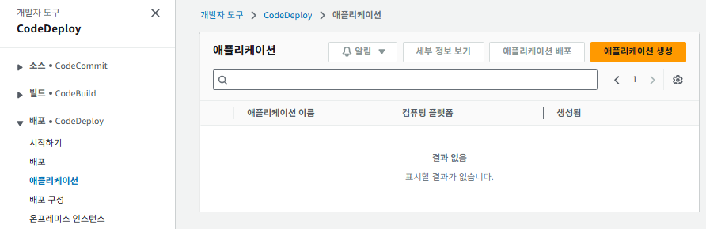
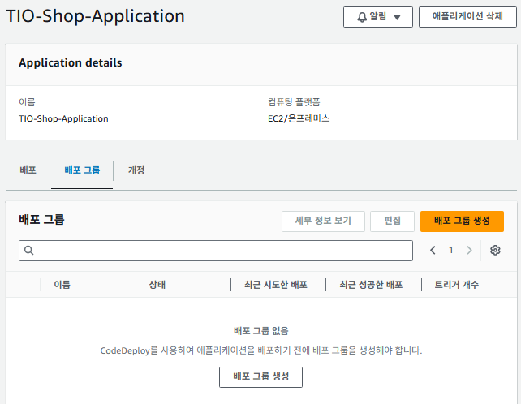
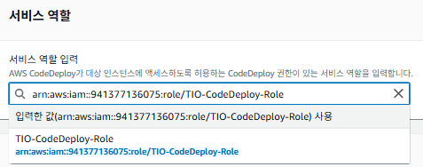
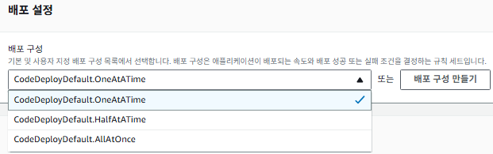
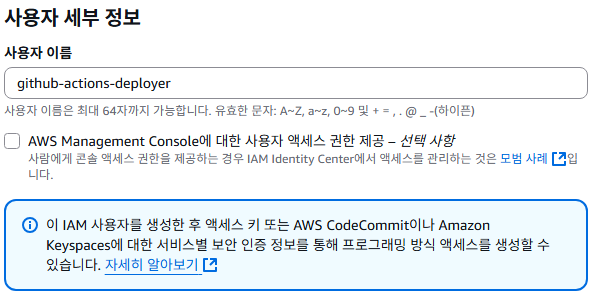
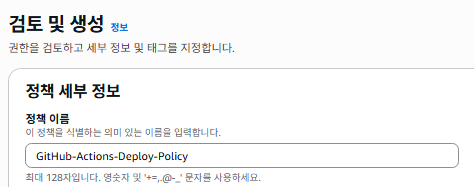
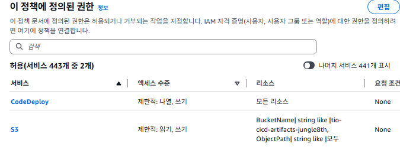
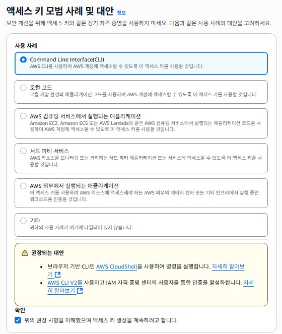

# AWS 인프라 구축기 5편: CI/CD 파이프라인 구축

지난 편에서 데이터베이스와 스토리지 구축을 완료했습니다. 이번 편에서는 자동 배포 시스템을 구축해보겠습니다.

# CI/CD 파이프라인 구축 (자동 배포)

CICD 구축 목표는 개발자가 GitHub에 코드를 올리기만 하면, 그 이후 모든 과정 (빌드, 텝스트, 서버 배포)이 `완전 자동`으로 이루어지게 만드는 것임.

이를 가능하게 하는 조합은 여러가지가 있다.

## CI/CD 조합

### **1. "All-in-AWS" 조합: AWS Code-Series**

AWS가 제공하는 네이티브 CI/CD 서비스들만으로 파이프라인을 완벽하게 구축하는 방식

- **CI (빌드):** **AWS CodeBuild**
- **CD (배포):** **AWS CodeDeploy**
- **소스 코드:** **AWS CodeCommit** (GitHub 대신 사용)
- **파이프라인 총괄:** **AWS CodePipeline** (이 모든 흐름을 연결하고 자동화)

### **2. "전통의 강자" 조합: Jenkins**

Jenkins는 오랫동안 CI/CD 시장의 최강자로 군림해 온 오픈소스 자동화 서버

- **CI (빌드):** **Jenkins**
- **CD (배포):** **Jenkins** (배포 기능도 직접 수행)
- **소스 코드:** GitHub, GitLab 등 무엇이든 연동 가능

### **3. "통합 플랫폼" 조합: GitLab CI/CD**

만약 소스 코드 리포지토리로 GitHub 대신 GitLab을 사용한다면, GitLab이 제공하는 내장 CI/CD 기능을 사용

- **CI (빌드):** **GitLab CI**
- **CD (배포):** **GitLab CD**
- **소스 코드:** **GitLab**

**GitHub Actions + AWS CodeDeploy**를 채택한 이유는

- 이미 `GitHub을 사용`중이라, GitLab은 선택지에 없고  
- 서버 관리는 `EC2로 충분`하고(서버 이제 그만..! jenkins 탈락)  
- 현재 가장 인기 있고 강력한 조합 중 하나이기 때문  
(서버 관리가 필요 없는 CI 👍 + AWS에 최적화된 강력한 CD)

## 구축 순서

Phase 1: AWS에서 '배포 무대' 설정하기 (CodeDeploy)

배포가 이루어질 대상(어떤 서버 그룹)과 방식(어떻게 배포할지)을 AWS에 미리 정의하는 단계

Phase 2: 애플리케이션에 '배포 설명서' 추가하기 (appspec.yml)

우리 애플리케이션 코드 안에 "CodeDeploy가 우리 서버에 도착하면, 이 순서대로 이렇게 작업해 주세요" 라고 알려주는 설명서 파일을 추가하는 단계

Phase 3: GitHub에서 '자동화 실행기' 설정하기 (GitHub Actions)

"개발자가 특정 브랜치에 코드를 Push하면, Phase 2의 설명서를 포함한 코드를 빌드해서 Phase 1의 무대로 보내라" 고 명령하는 최종 자동화 스크립트를 작성하는 단계

## CodeDeploy 설정

### IAM 역할 생성

이전에 했던 것과 같다.

Code deploy 서비스를 사용하기위해 별개의 역할(권한)을 생성해줄 것이다. 이후 리소스에 접근하여 배포작업을 하도록 할 것이다.


바로 앞에서 제대로 체크했다면, 권한 정책에 `AWSCodeDeployRole`이 들어와 있으면 된다


### CodeDeploy 애플리케이션 생성

애플리케이션은 배포들을 논리로 묶어주는 컨테이너

AWS 관리 콘솔에서 CodeDeploy 서비스로 이동합니다.

왼쪽 메뉴에서 애플리케이션을 클릭하고, [애플리케이션 생성] 버튼을 누릅니다.

애플리케이션 이름: TIO-Shop-Application (저희 쇼핑몰 전체를 의미)

컴퓨팅 플랫폼: EC2/온프레미스 를 선택합니다.

**[애플리케이션 생성]**을 클릭합니다.


### CodeDeploy 배포 그룹 생성

배포 그룹은 `어떤 서버에, 어떤 방식으로 배포할 것인가`를 정의하는 설정


방금 만든 TIO-Shop-Application의 세부 정보 화면으로 이동하여, [배포 그룹 생성] 버튼을 클릭.


**배포 그룹 이름:** TIO-Spring-Deployment-Group


**서비스 역할:** 드롭다운 메뉴에서 우리가 만든 **TIO-CodeDeploy-Role**을 선택.


배포 유형: 현재 위치(In-place) 를 선택. (서버를 교체하지 않고, 기존 서버 위에서 애플리케이션만 업데이트하는 방식)


**환경 구성:**

**Auto Scaling 그룹**을 선택

방금 만든 TIO-Spring-ASG 를 선택. 이 설정을 통해 CodeDeploy는 *"아, 이 Auto Scaling Group에 속한 모든 서버가 배포 대상이구나"* 라고 인지하게 된다



배포 구성: `CodeDeployDefault.OneAtATime` 을 선택합니다. (한 번에 한 서버씩 배포하여 안정성을 높이는 방식)


**로드 밸런서**:  
로드 밸런싱 활성화 체크박상태 검사를 통해 비정상적인 인스턴스를 자동으로 교체하고 ALB에서 제외시켜주기 때문입니다. CodeDeploy가 직접 ALB를 제어할 필요가 없습니다. 이 옵션을 끄는 것이 더 깔끔하고 권장되는 방식이라고 한다.


**[배포 그룹 생성]**을 클릭하여 완료합니다.


## 애플리케이션에 배포 설명서 / 스크립트 생성

> 내 서버에 도착하면 이 설명서대로 움직여주세요 라고 지시하는 문서

이 단계에서는 총 3개의 파일을 만들어서 Spring Boot 프로젝트에 추가해준다

- `appspec.yml`: 배포 프로세스의 각 단계에서 어떤 스크립트를 실행할지 정의하는 메인 설명서.
- `scripts/start_server.sh`: 새 버전의 애플리케이션을 실행하는 셸 스크립트.
- `scripts/stop_server.sh`: 이전 버전의 애플리케이션을 중지하는 셸 스크립트.

### yml 파일 생성

`build.gradle`이 위치한 최상위 루트 디렉토리에 `appspec.yml`이라는 이름의 아래 스크립트를 넣어준다.

```yaml
version: 0.0
os: linux
files:
  - source:  /
    destination: /home/ec2-user/app
    overwrite: yes

permissions:
  - object: /
    pattern: "**"
    owner: ec2-user
    group: ec2-user

hooks:
  ApplicationStop:
    - location: scripts/stop_server.sh
      timeout: 60
      runas: ec2-user
  ApplicationStart:
    - location: scripts/start_server.sh
      timeout: 60
      runas: ec2-user
```

설명:

- `files`: 배포 패키지(source: /)의 모든 내용을 EC2 서버의 /home/ec2-user/app 디렉토리로 복사하라는 지시
- `permissions`: 복사된 파일들의 소유자를 ec2-user로 설정
- `hooks`: 배포의 각 생명주기 단계에서 실행될 스크립트를 지정
- `ApplicationStop`: 새 버전을 설치하기 전에, stop_server.sh를 실행해서 구버전 앱을 먼저 중지
- `ApplicationStart`: 새 버전 파일이 모두 복사된 후, start_server.sh를 실행해서 새 버전 앱을 구동

### 배포 스크립트 파일 생성

프로젝트의 루트 디렉토리에 **`scripts`** 라는 이름의 새 폴더를 만듭니다. 그리고 그 폴더 안에 아래의 두 파일을 각각 생성하고 내용을 넣어준다.

**파일 1: `scripts/start_server.sh`**

```bash
#!/bin/bash
BUILD_JAR=$(ls /home/ec2-user/app/*.jar)
JAR_NAME=$(basename $BUILD_JAR)
echo "> build 파일명: $JAR_NAME" >> /home/ec2-user/app/deploy.log

echo "> build 파일 복사" >> /home/ec2-user/app/deploy.log
DEPLOY_PATH=/home/ec2-user/app/
cp $BUILD_JAR $DEPLOY_PATH

echo "> 현재 실행중인 애플리케이션 pid 확인" >> /home/ec2-user/app/deploy.log
CURRENT_PID=$(pgrep -f $JAR_NAME)

if [ -z $CURRENT_PID ]
then
  echo "> 현재 구동중인 애플리케이션이 없으므로 종료하지 않습니다." >> /home/ec2-user/app/deploy.log
else
  echo "> kill -15 $CURRENT_PID"
  kill -15 $CURRENT_PID
  sleep 5
fi

DEPLOY_JAR=$DEPLOY_PATH$JAR_NAME
echo "> DEPLOY_JAR 배포"    >> /home/ec2-user/app/deploy.log
nohup java -jar $DEPLOY_JAR >> /home/ec2-user/app/deploy.log 2>/home/ec2-user/app/deploy_err.log &
```

**파일 2: `scripts/stop_server.sh`**

```bash
#!/bin/bash
ps -ef | grep java | grep -v grep | awk '{print $2}' | xargs kill -15
```

## GitHub Actions 워크플로우 설정

> 이 단계에서는 레포지토리에 `개발자가 코드를 push하면, 이 순서대로 빌드하고, AWS에 배포해!` 라고 지시하는 자동화 실행기(Actions 워크플로우)를 설정한다

### GitHub Actions IAM 사용자 생성 (권한 부여)

우리 AWS 계정 접속하여, S3에 파일을 올리고 CodeDeploy를 실행할 수 있도록, 전용 `IAM 사용자`를 만들고 `Access Key`를 발급한다


IAM 콘솔 \> **사용자** \> **[사용자 생성]**

**사용자 이름:** `github-actions-deployer`

**권한 설정:**


- **`직접 정책 연결`** 선택
- **[정책 생성]** 버튼을 눌러 **JSON** 편집기를 선택하고 아래 코드를 붙여넣음. (S3 업로드 및 CodeDeploy 실행에 필요한 ***최소한의 권한***)

```json
{
    "Version": "2012-10-17",
    "Statement": [
        {
            "Effect": "Allow",
            "Action": [
                "s3:GetObject",
                "s3:PutObject"
            ],
            "Resource": "arn:aws:s3:::your-artifact-bucket-name/*"
        },
        {
            "Effect": "Allow",
            "Action": [
                "codedeploy:CreateDeployment",
                "codedeploy:GetDeployment",
                "codedeploy:GetDeploymentConfig"
            ],
            "Resource": "*"
        }
    ]
}
```

- **`your-artifact-bucket-name`** 부분은 나중에 빌드 결과물을 저장할 S3 버킷 이름으로 바꿔주어야 한다.  (예: `tio-cicd-artifacts-jungle8th`)



정책 이름을 `GitHub-Actions-Deploy-Policy` 등으로 지정하고 저장



제대로 들어갔다면 권한이 이렇게 두 개 들어가있다.


다시 사용자 생성 화면으로 돌아와, 방금 만든 `GitHub-Actions-Deploy-Policy`를 선택

사용자 생성을 완료하면, `액세스 키(Access Key ID`와 `비밀 액세스 키(Secret Access Key)`를 만들어줘야한다.

#### IAM 액세스 키 생성

만든 사용자의 세부 페이지로 들어가서, `보안 자격 증명` 탭의 `액세스 키` 항목에서 `액세스 키 만들기`로 진입해준다.



그림대로 체크하고 넘어가준다


상단 팝업에 `지금이 아니면 비밀 액세스 키를 보거나 다운로드 할 수 없습니다. 나중에 복구할 수 없습니다`라고 경고한다.

어디에 잘 적어놓고(옵션), 하단의 csv 파일로 저장해준다.

### GitHub 리포지토리에 비밀 정보 저장 (Secrets)

> 끝이 보인다

배포할 Spring Boot 프로젝트의 GitHub 리포지토리로 이동

**[Settings]** \> **[Secrets and variables]** \> **[Actions]** 메뉴로 이동합니다.


**[New repository secret]** 버튼을 클릭하여 아래 4개의 비밀 정보를 저장합니다.


- **`AWS_ACCESS_KEY_ID`**: 방금 복사한 AWS 액세스 키 ID를 붙여넣습니다.
- **`AWS_SECRET_ACCESS_KEY`**: 방금 복사한 AWS 비밀 액세스 키를 붙여넣습니다.
- **`AWS_S3_BUCKET_NAME`**: 빌드 결과물을 저장할 S3 버킷 이름 (예: `tio-cicd-artifacts-jungle8th`)
- **`AWS_REGION`**: `ap-northeast-2`

### 워크플로우 파일 생성 (`deploy.yml`)

로컬의 Spring Boot 프로젝트 루트 디렉토리에 **`.github`** 라는 폴더를 만듭니다.

그 안에 **`workflows`** 라는 폴더를 또 만듭니다.

`workflows` 폴더 안에 **`deploy.yml`** 이라는 이름으로 새 파일을 만들고, 아래 내용을 그대로 복사하여 붙여넣어 주세요.

```yaml
name: TIO Spring CI/CD

on:
  push:
    branches: [ "main" ] # main 브랜치에 push될 때 실행됩니다.

permissions:
  contents: read

jobs:
  build-and-deploy:
    runs-on: ubuntu-latest
    steps:
    # 1. 소스 코드 다운로드
    - name: Checkout
      uses: actions/checkout@v3

    # 2. JDK 17 설치
    - name: Set up JDK 17
      uses: actions/setup-java@v3
      with:
        java-version: '17'
        distribution: 'corretto'

    # 3. Gradle 캐싱 (빌드 속도 향상)
    - name: Gradle Caching
      uses: actions/cache@v3
      with:
        path: |
          ~/.gradle/caches
          ~/.gradle/wrapper
        key: ${{ runner.os }}-gradle-${{ hashFiles('**/*.gradle*', '**/gradle-wrapper.properties') }}
        restore-keys: |
          ${{ runner.os }}-gradle-

    # 4. Gradle 권한 부여
    - name: Grant execute permission for gradlew
      run: chmod +x ./gradlew

    # 5. Spring Boot 애플리케이션 빌드
    - name: Build with Gradle
      run: ./gradlew build

    # 6. AWS 자격 증명 설정
    - name: Configure AWS credentials
      uses: aws-actions/configure-aws-credentials@v2
      with:
        aws-access-key-id: ${{ secrets.AWS_ACCESS_KEY_ID }}
        aws-secret-access-key: ${{ secrets.AWS_SECRET_ACCESS_KEY }}
        aws-region: ${{ secrets.AWS_REGION }}

    # 7. 배포 패키지 압축
    - name: Zip deployment package
      run: |
        mkdir -p deploy
        cp build/libs/*.jar deploy/application.jar
        cp appspec.yml deploy/appspec.yml
        cp -r scripts deploy/scripts
        cd deploy && zip -r deploy.zip .

    # 8. S3에 업로드
    - name: Upload to S3
      run: aws s3 cp deploy/deploy.zip s3://${{ secrets.AWS_S3_BUCKET_NAME }}/spring-app/deploy.zip

    # 9. AWS CodeDeploy 배포 실행
    - name: Deploy to AWS CodeDeploy
      run: |
        aws deploy create-deployment \
          --application-name TIO-Shop-Application \
          --deployment-group-name TIO-Spring-Deployment-Group \
          --s3-location bucket=${{ secrets.AWS_S3_BUCKET_NAME }},bundleType=zip,key=spring-app/deploy.zip
```

## **모든 준비 완료: 이제 Push만 남았다**

1. 지금까지 프로젝트에 추가한 모든 파일들(`appspec.yml`, `scripts/` 폴더, `.github/` 폴더)을 `git add`, `git commit` 합니다.
2. 그리고 **`git push origin main`** 명령어를 실행합니다.

이 Push를 하는 순간, 마법이 시작됩니다.  
GitHub 리포지토리의 **[Actions]** 탭으로 이동해보면, `TIO Spring CI/CD` 라는 워크플로우가 노란색으로 돌면서 실행되는 것을 실시간으로 확인할 수 있다.

이 워크플로우가 성공적으로 끝나면, AWS CodeDeploy 콘솔에서도 배포가 시작되고, 몇 분 안에 새로운 코드가 EC2 서버에 완벽하게 배포된다

다음 편에서는 실제 배포 과정에서 발생한 다양한 문제들과 해결 과정을 다뤄보겠습니다.
