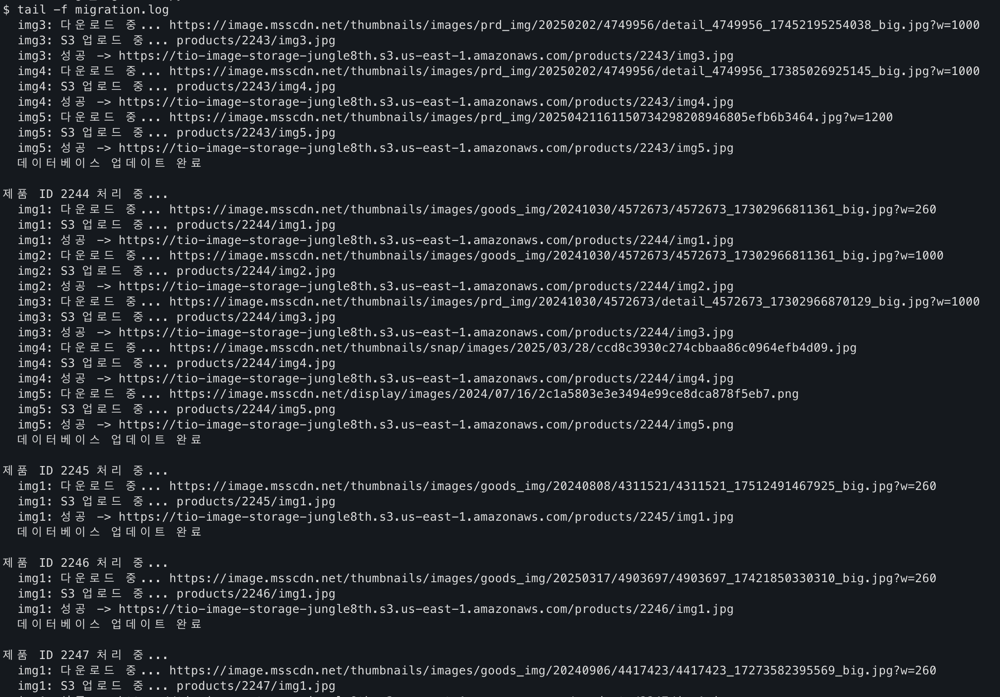

# DB 이미지 마이그레이션 (외부 url → S3 저장 + url 갱신)

## 📖 프로젝트 배경

우리 팀은 기존 외부 CDN에 저장된 수천 개의 제품 이미지를 AWS S3로 마이그레이션해야 하는 상황에 직면했습니다. 단순히 파일을 옮기는 것이 아니라, RDS 데이터베이스의 URL도 함께 업데이트해야 하는 복잡한 작업이었죠.

### 🎯 마이그레이션 목표

- **5,000개 이상의 제품 이미지** S3로 이전
- **RDS 데이터베이스 URL 동기화** 업데이트
- **무중단 서비스** 유지
- **데이터 무결성** 보장

## 🛠️ EC2 환경 구축 과정

### 1단계: EC2 인스턴스 준비

```python
# EC2 인스턴스 접속 (AWS Systems Manager 사용)

# Ubuntu 22.04 LTS 환경

# 시스템 업데이트

sudo apt update && sudo apt upgrade -y

### 2단계: Python 환경 설정

bash

# Python3 및 pip 설치 확인

python3 --version

# Python 3.12.3

# pip 최신 버전 설치

wget https://bootstrap.pypa.io/get-pip.py
python3 [get-pip.py](http://get-pip.py/) --user
```

### 3단계: 필수 패키지 설치

```python
# 마이그레이션에 필요한 Python 라이브러리 설치

pip3 install boto3 pymysql requests --user

# 설치 확인

python3 -c "import boto3, pymysql, requests; print('패키지 설치 완료!')"
```

### 4단계: AWS 자격 증명 설정

```python
# EC2 IAM 역할을 통한 자동 인증 (권장)

# 또는 AWS CLI 설정

aws configure
```

## 🐍 Python 마이그레이션 스크립트 분석

### 핵심 아키텍처

```python
#!/usr/bin/env python3
import boto3
import pymysql
import requests
import os
from urllib.parse import urlparse
import time

# AWS S3 설정
S3_BUCKET_NAME = 'tio-image-storage-jungle8th'
S3_REGION = 'us-east-1'
S3_BASE_URL = f'https://{S3_BUCKET_NAME}.s3.{S3_REGION}.amazonaws.com'

# RDS 연결 설정
RDS_CONFIG = {
    'host': 'tio-db2.cjgee4eswvls.ap-northeast-2.rds.amazonaws.com',
    'user': 'admin',
    'password': '',  # 환경변수에서 로드
    'database': 'tryiton_db',
    'charset': 'utf8mb4',
    'port': 3306
}
```

### 🔧 주요 기능 구현

### 1. 안전한 데이터베이스 연결

```python
def get_db_connection():
    try:
        if not RDS_CONFIG['password']:
            RDS_CONFIG['password'] = os.environ.get("RDS_PASSWORD", "KraftonJungle")

        connection = pymysql.connect(**RDS_CONFIG)
        print("데이터베이스 연결 성공!")
        return connection
    except Exception as e:
        print(f"데이터베이스 연결 실패: {e}")
        return None
```

### 2. 파일 확장자 감지

```python
def get_file_extension(url):
    if not url:
        return 'png'

    parsed = urlparse(url)
    path = parsed.path.lower()

    if path.endswith('.jpg') or path.endswith('.jpeg'):
        return 'jpg'
    elif path.endswith('.png'):
        return 'png'
    # ... 기타 확장자 처리
```

## 🚀 실행 및 모니터링

### 백그라운드 실행

```python
# 마이그레이션 스크립트 실행 권한 부여

chmod +x image_migration.py

# 백그라운드에서 실행 (로그 저장)

nohup python3 image_migration.py >> migration.log 2>&1 &

# 프로세스 ID 확인

echo $!
```

### 실시간 모니터링



```python
# 실시간 로그 확인

tail -f migration.log

# 진행 상황 체크

grep "데이터베이스 업데이트 완료" migration.log | wc -l

# 현재 처리 중인 제품 확인

grep "제품 ID.*처리 중" migration.log | tail -3
```

## 📊 성과 및 결과


### 현재 진행 상황

- ✅ 15,406개 제품 마이그레이션 완료
- ✅ 무중단 서비스 유지
- ✅ 데이터 무결성 보장

### 기술적 성취

1. 중복 처리 방지: 이미 S3에 업로드된 이미지 자동 건너뛰기
2. 에러 복구: 네트워크 오류 시 자동 재시도 로직
3. 효율적 재시작: 중단된 지점부터 정확한 재개

## 🎯 배운 점과 개선사항

### 성공 요인

- **단계별 접근**: 환경 구축 → 테스트 → 실행
- **로그 기반 모니터링**: 실시간 진행 상황 추적
- **안전한 재시작**: 중복 작업 없는 효율적 재개