# FrontEnd 마이그레이션(for CDN → SSR)

## 📊 현재 구현 상태

현재 Next.js 설정 분석:
• Next.js 15.3.4 사용 (최신 버전)
• 클라이언트 사이드 렌더링(CSR) 위주
• API 호출: axios + @tanstack/react-query
• 환경변수: NEXT_PUBLIC_API_URL (클라이언트 노출)

## ⚡ SSR 마이그레이션이 필요한 이유

### **기존 프론트엔드 CI/CD (CSR 전용):**

```bash
 GitHub Push → Next.js Build (정적) → S3 업로드 → CloudFront 무효화
```

문제점:
• ❌ SSR 불가능: output: 'export' 설정으로 정적 파일만 생성
• ❌ SEO 제한: 검색엔진이 빈 페이지만 크롤링
• ❌ 초기 로딩 느림: JavaScript 다운로드 후 렌더링
• ❌ 소셜 공유 제한: 동적 메타태그 불가

### **1. SEO 최적화**

```bash
javascript
// 현재 (CSR): 검색엔진이 빈 페이지만 크롤링
<div id="root">Loading...</div>
// SSR 후: 완전한 HTML 제공
<div>
<h1>TryItOn - 가상 피팅 서비스</h1>

</div>
```

### **2. 초기 로딩 성능**

- **현재**: JavaScript 다운로드 → 실행 → API 호출 → 렌더링
• **SSR**: 서버에서 완성된 HTML 즉시 표시

### **3. 소셜 미디어 공유**

```bash
html
<!-- 현재: 동적 메타태그 불가 -->
<meta property="og:title" content="TryItOn" />
<!-- SSR: 상품별 동적 메타태그 -->
<meta property="og:title" content="Nike 에어맥스 - TryItOn" />
<meta property="og:image" content="product-specific-image.jpg" />
```

## 🚀 SSR 마이그레이션 서비스 종류

### **1. AWS Amplify**

서비스 개요:
• AWS의 풀스택 웹/모바일 애플리케이션 개발 플랫폼
• JAMstack 아키텍처 기반의 정적 사이트 호스팅 + 서버리스 백엔드
• Git 기반 CI/CD와 글로벌 CDN을 통한 배포 자동화

작동 방식:
GitHub Push → Amplify Build → CloudFront CDN → 전 세계 배포

핵심 기능:
• **Hosting**: CloudFront CDN을 통한 글로벌 배포
• **Build**: 자동 빌드 파이프라인 (CodeBuild 기반)
• **Auth**: Cognito 통합 인증
• **API**: GraphQL/REST API 자동 생성
• **Storage**: S3 파일 저장소 통합

비용 구조:
• 빌드 시간: $0.01/분
• 호스팅: $0.15/GB (전송량)
• 무료 티어: 월 1,000 빌드분, 15GB 전송량

### **2. Vercel**

서비스 개요:
• Next.js 개발사(Vercel Inc.)가 만든 프론트엔드 배포 플랫폼
• Edge Functions와 Serverless Functions를 통한 최적화
• 개발자 경험(DX) 최우선 설계

작동 방식:
Git Push → Vercel Build → Edge Network → 즉시 배포

핵심 기능:
• **Edge Runtime**: 전 세계 엣지에서 SSR 실행
• **Preview Deployments**: PR마다 미리보기 URL 생성
• **Analytics**: 실시간 성능 분석
• **Image Optimization**: 자동 이미지 최적화
• **Serverless Functions**: API 라우트 자동 배포

비용 구조:
• Hobby: 무료 (개인 프로젝트)
• Pro: $20/월 (팀용)
• Enterprise: 커스텀 가격

### **3. AWS ECS + Fargate**

서비스 개요:
• **ECS**: Elastic Container Service - AWS의 컨테이너 오케스트레이션 서비스
• **Fargate**: 서버리스 컨테이너 실행 엔진 (서버 관리 불필요)
• Docker 컨테이너 기반 애플리케이션 배포

작동 방식:
Docker Image → ECR → ECS Task → Fargate → ALB → 사용자

핵심 기능:
• **Task Definition**: 컨테이너 실행 설정 정의
• **Service**: 원하는 수의 태스크 유지
• **Auto Scaling**: CPU/메모리 기반 자동 확장
• **Load Balancing**: ALB/NLB 통합
• **Service Discovery**: 내부 서비스 간 통신

비용 구조:
• vCPU: $0.04048/시간
• 메모리: $0.004445/GB/시간
• 네트워크: 데이터 전송량 기반

### **4. AWS EC2 + PM2**

서비스 개요:
• **EC2**: Elastic Compute Cloud - AWS의 가상 서버 서비스
• **PM2**: Node.js 프로세스 매니저 (Process Manager 2)
• 전통적인 서버 기반 애플리케이션 배포 방식

작동 방식:
EC2 인스턴스 → PM2 → Next.js App → 여러 프로세스 → 로드 밸런싱

PM2 핵심 기능:
• **Cluster Mode**: CPU 코어 수만큼 프로세스 생성
• **Auto Restart**: 크래시 시 자동 재시작
• **Log Management**: 로그 수집 및 로테이션
• **Monitoring**: 실시간 성능 모니터링
• **Zero Downtime**: 무중단 배포

비용 구조:
• 인스턴스 비용: t3.medium $0.0416/시간
• 스토리지: EBS $0.10/GB/월
• 네트워크: 아웃바운드 데이터 전송량

### **5. AWS Lambda + Next.js**

서비스 개요:
• **Lambda**: AWS의 서버리스 컴퓨팅 서비스
• **@serverless-nextjs/lambda**: Next.js를 Lambda에서 실행하는 프레임워크
• 요청 기반 실행으로 사용한 만큼만 과금

작동 방식:
API Gateway → Lambda Function → Next.js SSR → Response
CloudFront → S3 (정적 파일) → 사용자

아키텍처 구성:
• **Lambda@Edge**: CloudFront에서 SSR 실행
• **API Gateway**: HTTP 요청 라우팅
• **S3**: 정적 자산 저장
• **CloudFront**: CDN 및 캐싱

핵심 특징:
• **Cold Start**: 첫 요청 시 초기화 지연 (100-1000ms)
• **Warm Start**: 후속 요청은 빠른 응답
• **Auto Scaling**: 동시 요청 수에 따라 자동 확장
• **Memory/Timeout**: 최대 10GB 메모리, 15분 실행 시간

비용 구조:
• 요청: $0.20/100만 요청
• 실행 시간: $0.0000166667/GB-초
• 무료 티어: 월 100만 요청, 400,000 GB-초

## 🚀 사용할 수 있는 옵션 (조합)

### **1. AWS Amplify (추천)**

장점:
• Next.js SSR 네이티브 지원
• 자동 CI/CD 파이프라인
• CDN + 엣지 최적화
• 서버리스 아키텍처

단점:
• AWS 종속성
• 복잡한 커스터마이징 제한

### **2. Vercel**

장점:
• Next.js 개발사 플랫폼
• 최고의 Next.js 최적화
• 간편한 배포

단점:
• 기존 AWS 인프라와 분리
• 비용 (트래픽 증가시)

### **3. AWS ECS + Fargate**

장점:
• 완전한 컨테이너 제어
• 기존 VPC 통합
• 스케일링 유연성

단점:
• 복잡한 설정
• 인프라 관리 필요

### **4. AWS EC2 + PM2**

장점:
• 기존 EC2 인프라 활용
• 비용 효율적
• 완전한 제어권

단점:
• 수동 관리 필요
• 확장성 제한

### **5. AWS Lambda + Next.js**

장점:
• 서버리스
• 사용량 기반 과금
• 자동 스케일링

단점:
• 콜드 스타트 지연
• 복잡한 설정

### 📋 각 옵션별 비교표

| 옵션 | 설정 복잡도 | 비용 | 성능 | AWS 통합 | 추천도 |
| --- | --- | --- | --- | --- | --- |
| Amplify | ⭐⭐ | ⭐⭐⭐ | ⭐⭐⭐⭐ | ⭐⭐⭐⭐⭐ | ⭐⭐⭐⭐⭐ |
| Vercel | ⭐ | ⭐⭐ | ⭐⭐⭐⭐⭐ | ⭐ | ⭐⭐⭐⭐ |
| ECS | ⭐⭐⭐⭐ | ⭐⭐⭐ | ⭐⭐⭐⭐ | ⭐⭐⭐⭐⭐ | ⭐⭐⭐ |
| EC2 | ⭐⭐⭐ | ⭐⭐⭐⭐ | ⭐⭐⭐ | ⭐⭐⭐⭐ | ⭐⭐ |
| Lambda | ⭐⭐⭐⭐⭐ | ⭐⭐⭐⭐ | ⭐⭐ | ⭐⭐⭐⭐⭐ | ⭐⭐ |

## AWS Amplify SSR 구축

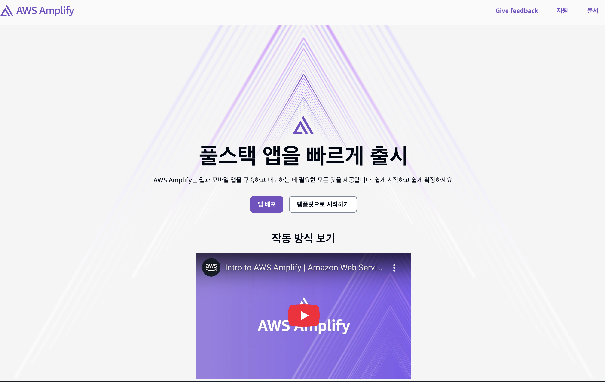

### **1단계: Amplify 콘솔 접속**

AWS 콘솔 → Amplify → "Create new app"

### **2단계: 소스 연결**

1. "Deploy without Git provider" 또는 "GitHub" 선택
    
    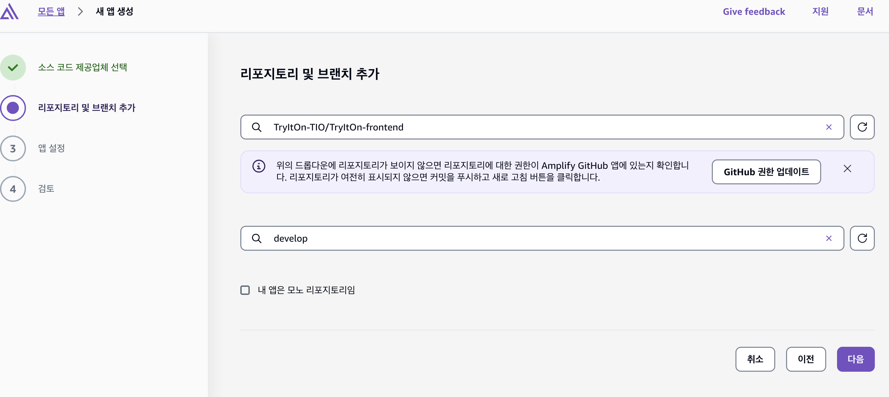
    
2. Repository: [https://github.com/TryItOn-TIO/TryItOn-frontend](https://github.com/TryItOn-TIO/TryItOn-frontend)
3. Branch: develop 선택(나중엔 main으로 변경)

### **3단계: 앱 설정**

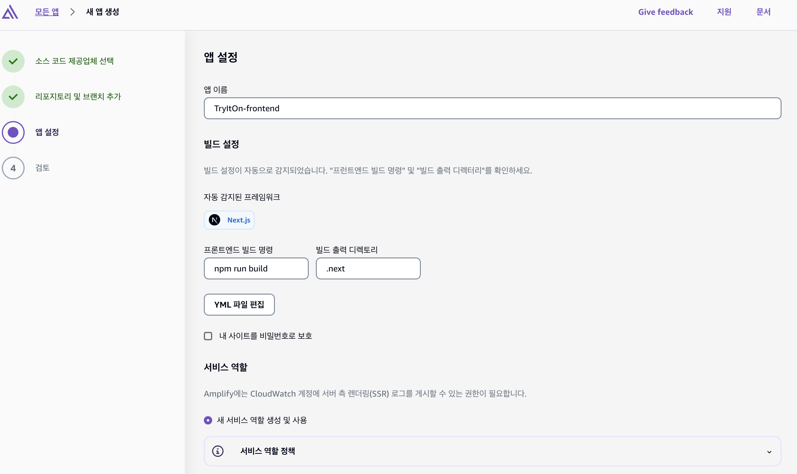

이 부분은 `YML 파일 편집` 을 누르면 뜨는데, 자동으로 스크립팅 되어있다.

```yaml
yaml
version: 1
	frontend:
	phases:
		preBuild:
			commands:
				- npm ci
				- echo "Preparing SSR build..."
		build:
			commands:
				- npm run build
	artifacts:
		baseDirectory: .next
		files:
			- '**/*'
	cache:
		paths:
			- node_modules/**/*
			- .next/cache/**/*
```

### **3-1. 서비스 역할 (Service Role)**

"새 서비스 역할 생성 및 사용" 선택 (추천)

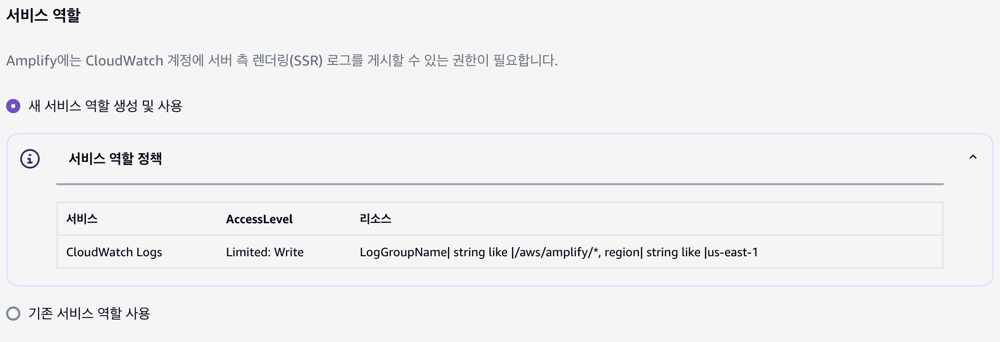

이유:
• SSR 로그를 CloudWatch에 자동 전송
• Amplify가 필요한 권한을 자동으로 설정
• 수동 IAM 설정 불필요

권한 내용:

```yaml

{
  "Version": "2012-10-17",
  "Statement": [
    {
      "Effect": "Allow",
      "Action": [
        "logs:CreateLogGroup",
        "logs:CreateLogStream",
        "logs:PutLogEvents"
      ],
      "Resource": "arn:aws:logs:*:*:*"
    }
  ]
}
```

### **3-2. 고급 설정 권장 사항**

**🖥️ 인스턴스 유형 구축**

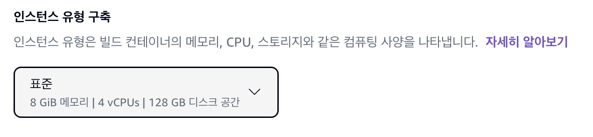

표준 (4 vCPU, 7GB RAM)

이유:
• Next.js 빌드는 메모리 집약적
• TypeScript 컴파일 + 최적화 작업

**📦 빌드 이미지**


기본 빌드 컨테이너 사용 (Amazon Linux 2023)

**🔧 환경 변수**

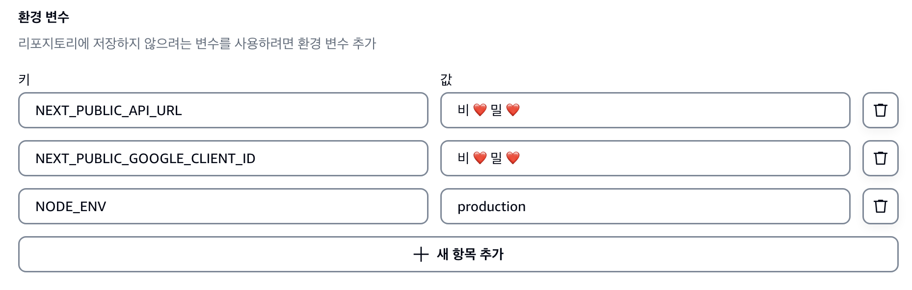

```bash
NEXT_PUBLIC_API_URL = [http://TIO-ALB-173623777.ap-northeast-2.elb.amazonaws.com](http://tio-alb-173623777.ap-northeast-2.elb.amazonaws.com/)
NEXT_PUBLIC_GOOGLE_CLIENT_ID = [651316530817-852jcf8ppqsg1adqvh2791fcfg5bq6lv.apps.googleusercontent.com](http://651316530817-852jcf8ppqsg1adqvh2791fcfg5bq6lv.apps.googleusercontent.com/)
NODE_ENV = production
```

환경변수별 역할 설명

**1. NEXT_PUBLIC_API_URL**

• 프론트엔드에서 백엔드 API 호출할 때 사용하는 기본 URL
• NEXT_PUBLIC_ 접두사로 클라이언트 사이드에서 접근 가능

**2. NEXT_PUBLIC_GOOGLE_CLIENT_ID**

• Google OAuth 로그인에 필요한 클라이언트 ID
• Google 로그인 버튼 초기화할 때 사용

**3. NODE_ENV = production** ⭐

**빌드 최적화**

```bash
NODE_ENV=production일 때만 활성화되는 최적화들
- 코드 압축 (minification)
- 트리 쉐이킹 (사용하지 않는 코드 제거)
- 프로덕션 빌드 최적화
- React DevTools 비활성화
```

**성능 향상**

```bash
// 개발 모드 vs 프로덕션 모드
if (process.env.NODE_ENV === 'development') {
// 개발용 로깅, 디버깅 코드
console.log('Debug info:', data)
} else {
// 프로덕션에서는 실행되지 않음
}
```

**보안 강화**

```bash
- 에러 스택 트레이스 숨김
- 개발용 API 엔드포인트 비활성화
- 디버그 정보 제거
```

**Next.js 특화 최적화**

```bash
- 정적 파일 압축
- 이미지 최적화 활성화
- 서버 사이드 렌더링 최적화
- 캐싱 전략 적용
```

**🍪 쿠키를 캐시 키에 보관**


활성화되지 않음 (기본값 유지)

• 사용자별 개인화가 많지 않은 경우
• CDN 캐시 효율성 우선
• 필요시 나중에 활성화 가능
**📦 라이브 패키지 업데이트**

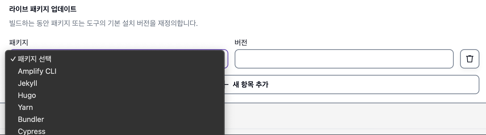

Node.js version: 18
npm version: latest

- Node.js 18.x 최신 버전 설치
- npm 9.x 자동으로 함께 설치


로딩 이후에 콘솔로 가게된다.

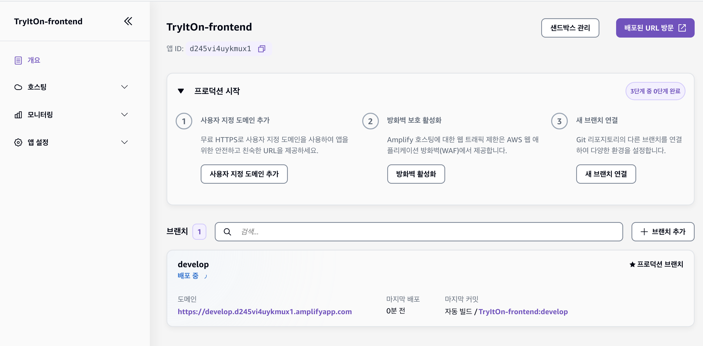

보면 브랜치를 통해 배포중인것을 아래에서 볼 수 있다.

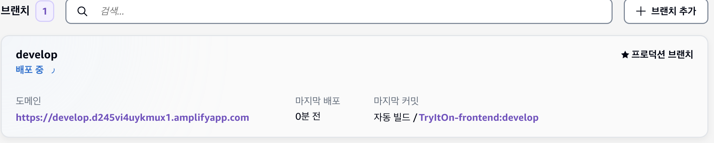

### **3. 최종 권장 설정**

```bash
서비스 역할: 새 서비스 역할 생성 ✅
인스턴스 유형: Medium (4 vCPU, 7GB RAM) ✅
빌드 이미지: 기본 빌드 컨테이너 ✅
쿠키 캐시: 비활성화 ✅
패키지 업데이트: Node.js 18 ✅
```

### **4. 설정 후 확인사항**

빌드 로그에서 확인:

```bash
bash
# 성공적인 빌드 로그 예시

✓ Creating an optimized production build
✓ Compiled successfully
✓ Collecting page data
✓ Generating static pages
✓ Finalizing page optimization
```

CloudWatch 로그 확인:
• AWS 콘솔 → CloudWatch → 로그 그룹
• /aws/amplify/TryItOn-Frontend 그룹 생성 확인

### **💡 주의사항**

1. 서비스 역할: 반드시 새로 생성 (SSR 로그 필수)
2. 인스턴스 크기: Small로 시작해서 빌드 실패시 Medium으로 업그레이드
3. 환경변수: 민감한 정보는 별도 관리 고려
4. 비용: Medium 인스턴스는 빌드 시간당 약 $0.01

### **5단계: Next.js 설정 수정**

```tsx
typescript
// next.config.ts
/** @type {import('next').NextConfig} */
const nextConfig = {
	output: 'standalone', // Amplify SSR 최적화
	images: {
		domains: ['[your-api-domain.com](http://your-api-domain.com/)'],
	},
	experimental: {
		serverActions: true, // 서버 액션 활성화
	}
}
export default nextConfig
```

### **6단계: SSR 페이지 구현 예시**

```tsx

typescript
// pages/products/[id].tsx
import { GetServerSideProps } from 'next'

export default function ProductPage({ product }) {
  return (
    <div>
      <h1>{product.name}</h1>
      
    </div>
  )
}

export const getServerSideProps: GetServerSideProps = async ({ params }) => {
  const res = await fetch(`${process.env.API_URL}/products/${params.id}`)
  const product = await res.json()

  return {
    props: { product }
  }
}
```

### **7단계: 배포 및 확인**

1. "Save and deploy" 클릭
2. 빌드 로그에서 SSR 활성화 확인:
    
    ✓ Generating static pages
    ✓ Finalizing page optimization
    

## 배포 단계에서 자꾸 오류가 발생해서 익숙한 EC2로 전환

## **Phase 1: EC2 인스턴스 준비**

### **1-1. EC2 인스턴스 생성**

AWS 콘솔 → EC2 → Instances → Launch Instance

1. Name: TIO-Frontend-SSR
2. AMI: Amazon Linux 2023 AMI
3. Instance type: t3.medium (2 vCPU, 4GB RAM)
4. Key pair: - (SSM)
5. Network settings:
• VPC: vpc-0bda85e24bfc289b4 (기존 VPC)
• Subnet: subnet-039bb1ba72f793a5b (Private 서브넷)
• Auto-assign public IP: Disable
    
    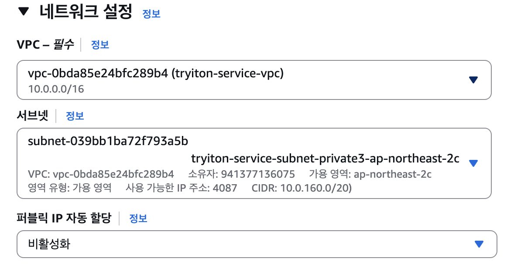
    
6. Security groups: 새 보안 그룹 생성
• Name: TIO-Frontend-EC2-SG
• Rules:
• SSH (22): My IP
• HTTP (3000): Custom → ALB 보안 그룹 선택
    
    **포트 3000이 HTTP인 이유 설명**
    
    ### **포트와 프로토콜의 관계:**
    
    포트 번호 ≠ 프로토콜 타입
    
    - **포트 3000**: 단순히 통신 채널 번호
    • **HTTP**: 통신 프로토콜 (Hypertext Transfer Protocol)
    
    ### **Next.js 서버의 동작 방식:**
    
    ```jsx
    // Next.js는 기본적으로 HTTP 서버로 동작
    const server = http.createServer(app)
    server.listen(3000) // HTTP 프로토콜로 3000번 포트에서 대기
    ```
    
    ### **왜 "Custom TCP"를 사용하는가?**
    
    AWS 보안 그룹의 미리 정의된 타입:
    • HTTP: 포트 80 (고정)
    • HTTPS: 포트 443 (고정)
    • SSH: 포트 22 (고정)
    • Custom TCP: 사용자 정의 포트 (3000, 8080 등)
    
    ### **실제 통신 흐름:**
    
    ```jsx
    사용자 → CloudFront (HTTPS/443)
    ↓
    ALB (HTTP/80)
    ↓
    EC2 (HTTP/3000) ← Next.js 서버
    ```
    
    ### **정정된 보안 그룹 설정:**
    
    ```yaml
    yaml
    TIO-Frontend-EC2-SG:
      Inbound Rules:
        - Type: SSH
          Port: 22
          Source: My IP
    
        - Type: Custom TCP  # HTTP가 아님!
          Port: 3000
          Source: sg-082ed9869e5c620f1 (ALB 보안 그룹)
    ```
    
7. Storage: 20 GB gp3
8. 사용자 데이터 :
    
    ```bash
    
    #!/bin/bash
    
    # 로그 파일 설정 (맨 앞으로 이동)
    exec > >(tee /var/log/user-data.log|logger -t user-data -s 2>/dev/console) 2>&1
    echo "User data script started at $(date)"
    
    # 시스템 업데이트
    echo "Updating system packages..."
    yum update -y
    
    # Node.js 18 설치
    echo "Installing Node.js 18..."
    curl -fsSL https://rpm.nodesource.com/setup_18.x | bash -
    yum install -y nodejs
    
    # 버전 확인 및 로그
    echo "Node.js version: $(node --version)"
    echo "npm version: $(npm --version)"
    
    # PM2 전역 설치
    echo "Installing PM2..."
    npm install -g pm2
    
    # Nginx 설치
    echo "Installing Nginx..."
    yum install -y nginx
    
    # Nginx 자동 시작 설정
    systemctl enable nginx
    
    # Git 설치
    echo "Installing Git..."
    yum install -y git
    
    # CodeDeploy Agent 설치
    echo "Installing CodeDeploy Agent..."
    yum install -y ruby wget
    
    cd /home/ec2-user
    wget https://aws-codedeploy-ap-northeast-2.s3.ap-northeast-2.amazonaws.com/latest/install
    chmod +x ./install
    ./install auto
    
    # CodeDeploy Agent 서비스 시작 및 활성화
    echo "Starting CodeDeploy Agent..."
    service codedeploy-agent start
    chkconfig codedeploy-agent on
    
    # CodeDeploy Agent 상태 확인
    service codedeploy-agent status
    
    # 작업 디렉토리 생성 (중복 제거)
    echo "Creating application directory..."
    mkdir -p /var/www/tryiton-frontend
    chown ec2-user:ec2-user /var/www/tryiton-frontend
    
    # PM2 로그 디렉토리 생성
    echo "Creating PM2 log directory..."
    mkdir -p /var/log/pm2
    chown ec2-user:ec2-user /var/log/pm2
    
    # CloudWatch Agent 설치
    echo "Installing CloudWatch Agent..."
    yum install -y amazon-cloudwatch-agent
    
    # 설치 완료 확인
    echo "=== Installation Summary ==="
    echo "Node.js: $(node --version)"
    echo "npm: $(npm --version)"
    echo "PM2: $(pm2 --version)"
    echo "Nginx: $(nginx -v 2>&1)"
    echo "Git: $(git --version)"
    
    # 서비스 상태 확인
    echo "=== Service Status ==="
    echo "CodeDeploy Agent: $(service codedeploy-agent status)"
    
    # 완료 로그
    echo "EC2 User Data script completed successfully at $(date)"
    
    ```
    
9. Launch Instance

## **Phase 2: Load Balancer 타겟 그룹 생성**

### **2-1. 타겟 그룹 생성**

EC2 → Load Balancing → Target Groups → Create target group

1. Target type: Instances
    
    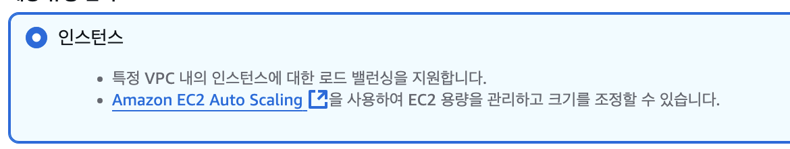
    
2. Target group name: TargetGroup-Frontend-SSR
3. Protocol: HTTP
4. Port: 3000
    
    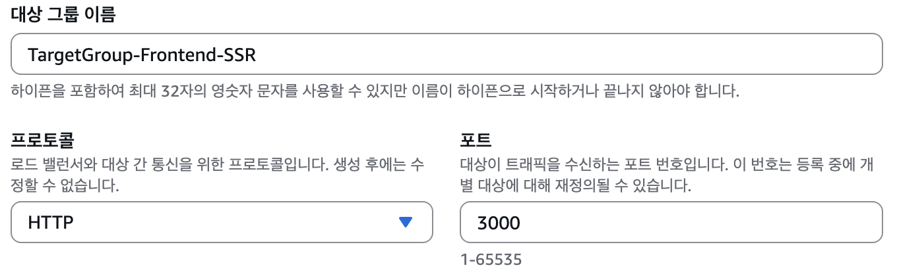
    
5. VPC
    
    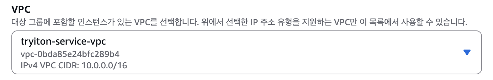
    
6. Protocol version: HTTP1
    
    상태검사:
    • Health check path(경로): /
    
    아래는 `고급 상태 검사 설정` (안해도 됨)
    • Health check port: Traffic port
    • Healthy threshold: 2
    • Unhealthy threshold: 2
    • Timeout: 5 seconds
    • Interval: 30 seconds
    • Success codes: 200
    
7. Next → Register targets
8. Select instances: 새로 생성한 TIO-Frontend-SSR 인스턴스 선택
    
    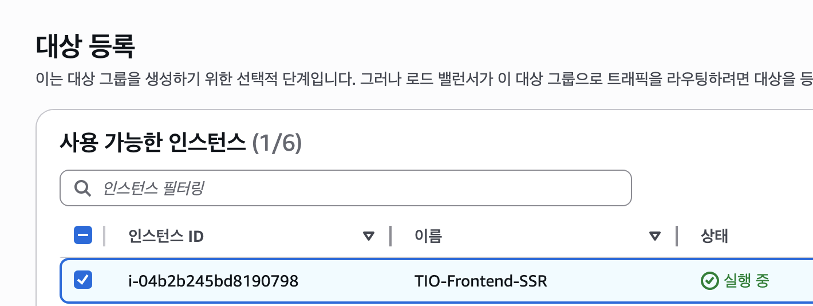
    
9. Port: 3000
    
    
    
10. Include as pending below → Create target group

### **2-2. ALB 리스너 규칙 추가**

EC2 → Load Balancers → TIO-ALB → Listeners

HTTP:80 리스너 클릭 → Rules → Add rule

1. Rule name: Frontend-SSR-Rule
2. Add condition:
• Condition type: Path
• Path: /*
    
    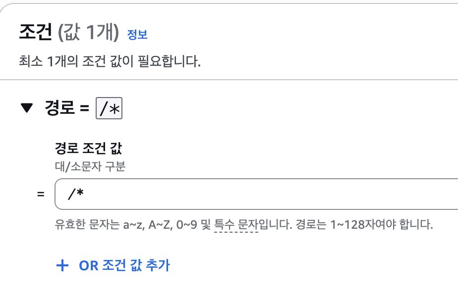
    
3. Add action:
• Action type: Forward to target groups
• Target group: TargetGroup-Frontend-SSR
• Weight: 100
(모든 트래픽 100%를 해당 그룹으로 전달, 이후 A/B 테스트나 배포 전략 변경 시 다르게 조정)
    
    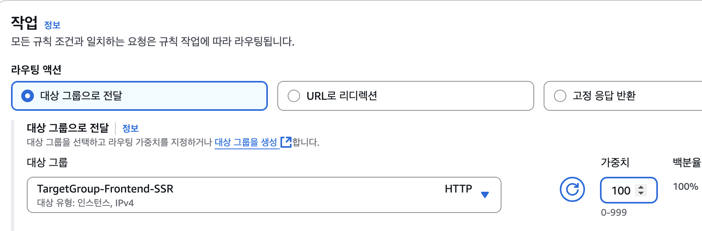
    
4. Priority: 50
(기존 API 규칙들과 충돌하지 않으면서도 적절한 순서로 Frontend 요청을 처리하기 위한 안전한 중간값)
    
    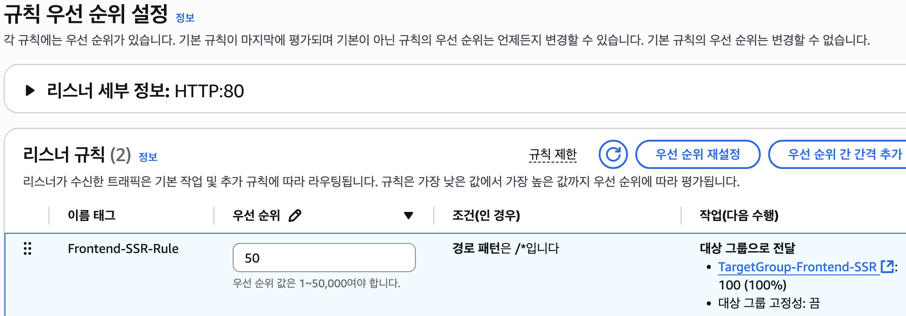
    
5. Save
    
    
    

## **Phase 3: 프로젝트 설정**

**next.config.ts 수정 - 기존**

```bash

import type { NextConfig } from "next";

const nextConfig: NextConfig = {
  /* config options here */
  output: 'export', // S3 정적파일 배포위한 설정 추가 (npm build run시 정적파일이 ./out 폴더에 생성)
  eslint: {
      ignoreDuringBuilds: true, // (임시) 빌드 시 ESLint 검사 건너뛰기
      },
  images: {
    unoptimized: true, // 이미지 최적화 비활성화 (정적 배포용)
    remotePatterns: [
      {
        protocol: "https",
        hostname: "**",
        // hostname: "s3.amazonaws.com",
        port: "",
        pathname: "/my-bucket/**",
        search: "",
      },
    ],
  },
};

export default nextConfig;
```

**변경**

```bash

import type { NextConfig } from "next";

const nextConfig: NextConfig = {
  // output: 'export', // SSR 활성화를 위해 주석 처리
  eslint: {
    ignoreDuringBuilds: true,
  },
  images: {
    // unoptimized: true, // 이미지 최적화 활성화
    remotePatterns: [
      {
        protocol: "https",
        hostname: "tio-image-storage-jungle8th.s3.ap-northeast-2.amazonaws.com",
      },
      {
        protocol: "https",
        hostname: "**",
      },
    ],
  },
  // 정적 파일을 S3에서 로드 (하이브리드 배포)
  assetPrefix: process.env.NODE_ENV === 'production'
    ? 'https://tio-frontend-assets-jungle8th.s3.ap-northeast-2.amazonaws.com'
    : '',
};

export default nextConfig;
```

### pm2 설정파일 생성 (루트 디렉토리. ecosystem.config.js)

```bash
module.exports = {
    apps: [{
        // 애플리케이션 이름 (PM2에서 식별용)
        name: 'tryiton-frontend',

        // 실행할 스크립트 (npm을 통해 Next.js 시작)
        script: 'npm',
        args: 'start',  // npm start 명령어 실행

        // 클러스터 설정
        instances: 'max',        // CPU 코어 수만큼 프로세스 생성
        exec_mode: 'cluster',    // 클러스터 모드 활성화

        // 환경 변수 설정 (실제 값은 배포 시 주입됨)
        env: {
            NODE_ENV: 'production',
            PORT: 3000,
            NEXT_PUBLIC_API_URL: process.env.NEXT_PUBLIC_API_URL || 'http://localhost:8080',
            NEXT_PUBLIC_GOOGLE_CLIENT_ID: process.env.NEXT_PUBLIC_GOOGLE_CLIENT_ID || ''
        },

        // 로그 파일 경로
        error_file: '/var/log/pm2/tryiton-frontend-error.log',
        out_file: '/var/log/pm2/tryiton-frontend-out.log',
        log_file: '/var/log/pm2/tryiton-frontend.log',

        // 로그에 타임스탬프 추가
        time: true,

        // 메모리 사용량이 1GB 초과시 자동 재시작
        max_memory_restart: '1G',

        // Node.js 메모리 옵션
        node_args: '--max_old_space_size=1024',

        // 자동 재시작 설정
        autorestart: true,

        // 파일 변경 감지 (프로덕션에서는 false)
        watch: false,

        // 재시작 지연 시간 (밀리초)
        restart_delay: 4000,

        // 최대 재시작 횟수 (무한 재시작 방지)
        max_restarts: 10,

        // 재시작 간격 (1분)
        min_uptime: '1m'
    }]
}
```

process.env 로 설정한 환경변수는 나중에 AWS Systems Manager Parameter Store를 사용하여 저장한다.

Code deploy를 통해 환경변수를 전달하기는 제한적임. Actions를 통해 

### appspec.yml 파일 생성(루트)

```yaml

version: 0.0
os: linux

#### **📁 files 섹션:**
yaml
files:
  - source: /          # GitHub Actions에서 업로드한 zip 파일의 루트
    destination: /var/www/tryiton-frontend  # EC2의 배포 디렉토리
    overwrite: yes     # 기존 파일 덮어쓰기

#### **🔐 permissions 섹션:**
yaml
permissions:
  - object: /          # 모든 파일
    pattern: "**"      # 모든 패턴
    owner: ec2-user    # 소유자
    group: ec2-user    # 그룹
    mode: 755          # 권한 (rwxr-xr-x)

  - object: /scripts   # 스크립트 파일들
    pattern: "*.sh"    # .sh 확장자
    mode: 755          # 실행 권한 부여

# 배포 생명주기 훅
hooks:
  # 1. 애플리케이션 중지
  ApplicationStop:
    - location: scripts/stop_server.sh
      timeout: 60
      runas: ec2-user

  # 2. 파일 설치 전 준비
  BeforeInstall:
    - location: scripts/before_install.sh
      timeout: 300
      runas: ec2-user

  # 3. 파일 설치 후 의존성 설치
  AfterInstall:
    - location: scripts/setup_env.sh
      timeout: 60
      runas: ec2-user
    - location: scripts/install_dependencies.sh
      timeout: 300
      runas: ec2-user

  # 4. 애플리케이션 시작
  ApplicationStart:
    - location: scripts/start_server.sh
      timeout: 120
      runas: ec2-user

  # 5. 애플리케이션 검증
  ValidateService:
    - location: scripts/validate_service.sh
      timeout: 60
      runas: ec2-user
```

### 스크립트 생성 (인스턴스 내부에서 동작 처리)

scripts/before_install.sh

```bash

#!/bin/bash

echo "=== Before Install Phase ==="

# 배포 디렉토리 생성 (없는 경우)
sudo mkdir -p /var/www/tryiton-frontend
sudo chown ec2-user:ec2-user /var/www/tryiton-frontend

# PM2 로그 디렉토리 생성
sudo mkdir -p /var/log/pm2
sudo chown ec2-user:ec2-user /var/log/pm2

# 이전 배포 백업 (롤백용)
if [ -d "/var/www/tryiton-frontend/.next" ]; then
    echo "Backing up previous deployment..."
    sudo rm -rf /var/www/tryiton-frontend-backup
    sudo cp -r /var/www/tryiton-frontend /var/www/tryiton-frontend-backup
fi

echo "Before install completed"
```

scripts/stop_server.sh

```bash
#!/bin/bash

echo "=== Application Stop Phase ==="

# PM2 프로세스 상태 확인
if pm2 list | grep -q "tryiton-frontend"; then
    echo "Stopping PM2 process: tryiton-frontend"

    # Graceful shutdown (30초 대기)
    pm2 stop tryiton-frontend
    sleep 5

    # 프로세스 삭제
    pm2 delete tryiton-frontend

    echo "PM2 process stopped and deleted"
else
    echo "No PM2 process found to stop"
fi

# 포트 3000 사용 중인 프로세스 강제 종료 (안전장치)
if lsof -ti:3000; then
    echo "Killing processes on port 3000"
    sudo kill -9 $(lsof -ti:3000) || true
fi

echo "Application stop completed"
```

scripts/install_dependencies.sh

```bash
#!/bin/bash

echo "=== Install Dependencies Phase ==="

cd /var/www/tryiton-frontend

# Node.js 버전 확인
echo "Node.js version: $(node --version)"
echo "npm version: $(npm --version)"

# npm 캐시 정리
npm cache clean --force

# 기존 node_modules 제거 (깨끗한 설치)
if [ -d "node_modules" ]; then
    echo "Removing existing node_modules..."
    rm -rf node_modules
fi

# package-lock.json 존재 확인
if [ -f "package-lock.json" ]; then
    echo "Installing dependencies with npm ci..."
    npm ci --only=production --no-audit
else
    echo "Installing dependencies with npm install..."
    npm install --only=production --no-audit
fi

# 설치 결과 확인
if [ $? -eq 0 ]; then
    echo "Dependencies installed successfully"
else
    echo "Failed to install dependencies"
    exit 1
fi

# .next 디렉토리 권한 설정
if [ -d ".next" ]; then
    chmod -R 755 .next
fi

echo "Install dependencies completed"
```

scripts/start_server.sh

```bash
#!/bin/bash

echo "=== Application Start Phase ==="

cd /var/www/tryiton-frontend

# ecosystem.config.js 파일 존재 확인
if [ ! -f "ecosystem.config.js" ]; then
    echo "Error: ecosystem.config.js not found"
    exit 1
fi

# .next 디렉토리 존재 확인
if [ ! -d ".next" ]; then
    echo "Error: .next directory not found. Build may have failed."
    exit 1
fi

# PM2로 애플리케이션 시작
echo "Starting application with PM2..."
pm2 start ecosystem.config.js

# PM2 프로세스 상태 확인
sleep 5
if pm2 list | grep -q "tryiton-frontend.*online"; then
    echo "Application started successfully"

    # PM2 설정 저장
    pm2 save

    # 시스템 재시작 시 자동 시작 설정
    pm2 startup systemd -u ec2-user --hp /home/ec2-user

else
    echo "Failed to start application"
    pm2 logs tryiton-frontend --lines 20
    exit 1
fi

echo "Application start completed"
```

scripts/validate_service.sh

```bash
#!/bin/bash

echo "=== Validate Service Phase ==="

# 서비스 시작 대기
echo "Waiting for service to be ready..."
sleep 15

# PM2 상태 확인
echo "Checking PM2 status..."
pm2 status

# 프로세스 실행 확인
if ! pm2 list | grep -q "tryiton-frontend.*online"; then
    echo "PM2 process is not running"
    pm2 logs tryiton-frontend --lines 20
    exit 1
fi

# HTTP 응답 확인 (최대 5번 시도)
echo "Checking HTTP response..."
for i in {1..5}; do
    response=$(curl -s -o /dev/null -w "%{http_code}" http://localhost:3000 || echo "000")

    if [ "$response" = "200" ]; then
        echo "Service is responding correctly (HTTP $response)"
        break
    else
        echo "Attempt $i: HTTP response code: $response"
        if [ $i -eq 5 ]; then
            echo "Service validation failed after 5 attempts"
            pm2 logs tryiton-frontend --lines 20
            exit 1
        fi
        sleep 10
    fi
done

# 메모리 사용량 확인
echo "Checking memory usage..."
pm2 show tryiton-frontend

echo "Service validation completed successfully"
```

scripts/setup_env.sh

```bash
#!/bin/bash

echo "=== Setting up environment variables ==="

cd /var/www/tryiton-frontend

# AWS Systems Manager Parameter Store에서 환경변수 가져오기
echo "Fetching environment variables from Parameter Store..."

# API URL 가져오기
NEXT_PUBLIC_API_URL=$(aws ssm get-parameter --name "/tryiton/frontend/api-url" --query "Parameter.Value" --output text --region ap-northeast-2 2>/dev/null || echo "http://localhost:8080")

# Google Client ID 가져오기 (SecureString)
NEXT_PUBLIC_GOOGLE_CLIENT_ID=$(aws ssm get-parameter --name "/tryiton/frontend/google-client-id" --with-decryption --query "Parameter.Value" --output text --region ap-northeast-2 2>/dev/null || echo "")

# .env.production 파일 생성
cat > .env.production << EOF
NODE_ENV=production
PORT=3000
NEXT_PUBLIC_API_URL=${NEXT_PUBLIC_API_URL}
NEXT_PUBLIC_GOOGLE_CLIENT_ID=${NEXT_PUBLIC_GOOGLE_CLIENT_ID}
EOF

# 파일 권한 설정
chmod 600 .env.production
chown ec2-user:ec2-user .env.production

echo "Environment variables configured successfully"
echo "API URL: ${NEXT_PUBLIC_API_URL}"
echo "Google Client ID: ${NEXT_PUBLIC_GOOGLE_CLIENT_ID:0:20}..." # 일부만 표시

```

### 스크립트 파일 권한 설정(로컬에서 권한 부여)

```bash
bash
cd /Users/ahpicl/Desktop/Jungle8/나만무/TryItOn-frontend

# 모든 스크립트에 실행 권한 부여
chmod +x scripts/*.sh
```

### 배포 스크립트 (github action) deploy.yml 수정

```bash

name: TIO Frontend SSR CI/CD

on:
  push:
    branches: [ "main", "develop" ]
  workflow_dispatch:
    inputs:
      environment:
        description: 'Deployment environment'
        required: false
        default: 'production'

permissions:
  contents: read

jobs:
  # Job 1: 빌드
  build:
    runs-on: ubuntu-latest

    steps:
      - name: Checkout code
        uses: actions/checkout@v4

      - name: Set up Node.js
        uses: actions/setup-node@v4
        with:
          node-version: '18'
          cache: 'npm'

      - name: Install dependencies
        run: |
          echo "Installing dependencies..."
          npm ci

      - name: Build Next.js application
        env:
          NEXT_PUBLIC_API_URL: http://TIO-ALB-173623777.ap-northeast-2.elb.amazonaws.com
          NEXT_PUBLIC_GOOGLE_CLIENT_ID: ${{ secrets.NEXT_PUBLIC_GOOGLE_CLIENT_ID }}
          NODE_ENV: production
        run: |
          echo "Building Next.js application for SSR..."
          npm run build

      - name: Verify build output
        run: |
          echo "Verifying build output..."
          if [ -d ".next" ]; then
            echo "✅ .next directory created successfully"
            ls -la .next/
            echo "Build files:"
            find .next -type f -name "*.js" -o -name "*.json" | head -10
          else
            echo "❌ .next directory not found after build"
            echo "Current directory contents:"
            ls -la
            exit 1
          fi
          echo "Build verification completed"

      - name: Create build archive
        run: |
          echo "Creating build archive..."
          tar -czf build-artifacts.tar.gz \
            .next/ \
            package.json \
            package-lock.json \
            next.config.ts \
            ecosystem.config.js \
            appspec.yml \
            scripts/
          ls -lh build-artifacts.tar.gz
          echo "Build archive created successfully"

      - name: Upload build artifacts
        uses: actions/upload-artifact@v4
        with:
          name: nextjs-build-${{ github.sha }}
          path: build-artifacts.tar.gz
          retention-days: 7

  # Job 2: 정적 파일 S3 배포
  deploy-static:
    runs-on: ubuntu-latest
    needs: build

    steps:
      - name: Download build artifacts
        uses: actions/download-artifact@v4
        with:
          name: nextjs-build-${{ github.sha }}

      - name: Extract build artifacts
        run: |
          echo "Extracting build artifacts..."
          tar -xzf build-artifacts.tar.gz
          ls -la
          echo "Build artifacts extracted successfully"

      - name: Verify static artifacts
        run: |
          echo "Verifying static artifacts..."
          if [ -d ".next/static" ]; then
            echo "✅ .next/static directory found"
            ls -la .next/static/
          else
            echo "❌ .next/static directory not found"
            echo "Available directories:"
            find . -type d -name ".next*" -o -name "static*" | head -10
          fi

      - name: Configure AWS credentials
        uses: aws-actions/configure-aws-credentials@v4
        with:
          aws-access-key-id: ${{ secrets.AWS_ACCESS_KEY_ID }}
          aws-secret-access-key: ${{ secrets.AWS_SECRET_ACCESS_KEY }}
          aws-region: ${{ secrets.AWS_REGION }}

      - name: Deploy static files to S3
        run: |
          echo "Deploying static files to S3..."

          # 정적 파일만 S3에 업로드 (하이브리드 배포)
          if [ -d ".next/static" ]; then
            aws s3 sync .next/static s3://${{ secrets.AWS_S3_FRONTEND_BUCKET_NAME }}/_next/static/ \
              --delete \
              --cache-control "public, max-age=31536000, immutable"
            echo "Static files deployed successfully"
          else
            echo "No static files found to deploy"
          fi

      - name: Invalidate CloudFront cache
        run: |
          echo "Invalidating CloudFront cache for static files..."
          aws cloudfront create-invalidation \
            --distribution-id ${{ secrets.AWS_CLOUDFRONT_DISTRIBUTION_ID }} \
            --paths "/_next/static/*"
          echo "CloudFront cache invalidated"

  # Job 3: SSR 서버 배포
  deploy-ssr:
    runs-on: ubuntu-latest
    needs: build

    steps:
      - name: Download build artifacts
        uses: actions/download-artifact@v4
        with:
          name: nextjs-build-${{ github.sha }}

      - name: Extract build artifacts
        run: |
          echo "Extracting build artifacts..."
          tar -xzf build-artifacts.tar.gz
          ls -la
          echo "Build artifacts extracted successfully"

      - name: Verify SSR artifacts
        run: |
          echo "Verifying SSR artifacts..."
          echo "Checking for .next directory..."
          if [ -d ".next" ]; then
            echo "✅ .next directory found"
            ls -la .next/
          else
            echo "❌ .next directory not found"
            echo "Available files and directories:"
            find . -type f -name "*.json" -o -name "*.js" -o -name "*.ts" | head -20
          fi

      - name: Configure AWS credentials
        uses: aws-actions/configure-aws-credentials@v4
        with:
          aws-access-key-id: ${{ secrets.AWS_ACCESS_KEY_ID }}
          aws-secret-access-key: ${{ secrets.AWS_SECRET_ACCESS_KEY }}
          aws-region: ${{ secrets.AWS_REGION }}

      - name: Create deployment package
        run: |
          echo "Creating deployment package..."

          # 배포 패키지 디렉토리 생성
          mkdir -p deploy

          # 필요한 파일들 복사
          cp -r .next deploy/
          cp package.json deploy/
          cp package-lock.json deploy/
          cp next.config.ts deploy/
          cp ecosystem.config.js deploy/
          cp appspec.yml deploy/
          cp -r scripts deploy/

          # 배포 패키지 압축
          cd deploy
          zip -r ../deploy.zip . -x "*.git*" "node_modules/*"
          cd ..

          # 패키지 크기 확인
          ls -lh deploy.zip
          echo "Deployment package created successfully"

      - name: Upload deployment package to S3
        run: |
          echo "Uploading deployment package to S3..."

          # 타임스탬프 추가로 고유한 키 생성
          TIMESTAMP=$(date +%Y%m%d-%H%M%S)
          S3_KEY="frontend-ssr/deploy-${TIMESTAMP}-${{ github.sha }}.zip"

          aws s3 cp deploy.zip s3://${{ secrets.AWS_S3_BUCKET_NAME }}/${S3_KEY}

          # 환경 변수로 S3 키 저장 (다음 단계에서 사용)
          echo "S3_DEPLOYMENT_KEY=${S3_KEY}" >> $GITHUB_ENV
          echo "Deployment package uploaded to S3"

      - name: Create CodeDeploy deployment
        run: |
          echo "Creating CodeDeploy deployment..."

          # 배포 생성
          DEPLOYMENT_ID=$(aws deploy create-deployment \
            --application-name TIO-Shop-Application \
            --deployment-group-name TIO-Frontend-DeploymentGroup \
            --s3-location bucket=${{ secrets.AWS_S3_BUCKET_NAME }},bundleType=zip,key=${{ env.S3_DEPLOYMENT_KEY }} \
            --deployment-config-name CodeDeployDefault.AllAtOnceHalfAtATime \
            --description "Frontend SSR deployment from GitHub Actions - ${{ github.sha }}" \
            --query 'deploymentId' \
            --output text)

          echo "Deployment created with ID: $DEPLOYMENT_ID"
          echo "DEPLOYMENT_ID=$DEPLOYMENT_ID" >> $GITHUB_ENV

      - name: Wait for deployment completion
        run: |
          echo "Waiting for deployment completion..."

          # 배포 상태 모니터링 (최대 10분)
          for i in {1..60}; do
            STATUS=$(aws deploy get-deployment \
              --deployment-id ${{ env.DEPLOYMENT_ID }} \
              --query 'deploymentInfo.status' \
              --output text)

            echo "Deployment status: $STATUS (attempt $i/60)"

            case $STATUS in
              "Succeeded")
                echo "✅ Deployment completed successfully!"
                exit 0
                ;;
              "Failed"|"Stopped")
                echo "❌ Deployment failed with status: $STATUS"

                # 실패 원인 조회
                aws deploy get-deployment \
                  --deployment-id ${{ env.DEPLOYMENT_ID }} \
                  --query 'deploymentInfo.errorInformation'
                exit 1
                ;;
              "InProgress"|"Queued"|"Created")
                sleep 10
                ;;
              *)
                echo "Unknown deployment status: $STATUS"
                sleep 10
                ;;
            esac
          done

          echo "❌ Deployment timeout after 10 minutes"
          exit 1

  # Job 4: 배포 후 검증
  post-deployment:
    runs-on: ubuntu-latest
    needs: [deploy-static, deploy-ssr]
    if: always()

    steps:
      - name: Configure AWS credentials
        uses: aws-actions/configure-aws-credentials@v4
        with:
          aws-access-key-id: ${{ secrets.AWS_ACCESS_KEY_ID }}
          aws-secret-access-key: ${{ secrets.AWS_SECRET_ACCESS_KEY }}
          aws-region: ${{ secrets.AWS_REGION }}

      - name: Verify deployment
        run: |
          echo "Verifying deployment..."

          # ALB 헬스체크 확인
          TARGET_GROUP_ARN="${{ secrets.TARGET_GROUP_ARN }}"

          if [ -n "$TARGET_GROUP_ARN" ]; then
            HEALTH_STATUS=$(aws elbv2 describe-target-health \
              --target-group-arn $TARGET_GROUP_ARN \
              --query 'TargetHealthDescriptions[0].TargetHealth.State' \
              --output text 2>/dev/null || echo "unknown")

            echo "Target group health status: $HEALTH_STATUS"

            if [ "$HEALTH_STATUS" = "healthy" ]; then
              echo "✅ Target group is healthy"
            else
              echo "⚠️ Target group health status: $HEALTH_STATUS"
            fi
          fi

      - name: Send deployment notification
        if: always()
        run: |
          if [ "${{ needs.deploy-ssr.result }}" = "success" ] && [ "${{ needs.deploy-static.result }}" = "success" ]; then
            echo "🎉 Deployment completed successfully!"
            echo "Frontend URL: https://tio-style.com"
          else
            echo "❌ Deployment failed. Check the logs for details."
          fi
```

### **병렬 배포:**

```bash
build → deploy-static (S3)
      → deploy-ssr (EC2)
```

**아티팩트 관리:**

- 빌드 결과물을 GitHub Actions 아티팩트로 저장
- 7일간 보관 (디버깅용)
- SHA 해시로 고유성 보장

**배포 모니터링:**

- CodeDeploy 상태 실시간 모니터링
- 10분 타임아웃 설정
- 실패 시 상세 에러 정보 출력

**배포 후 검증:**

- ALB 타겟 그룹 헬스체크 확인
- 배포 결과 알림

### **3-4. github secrets 설정**

`Target group arn` 제외하고 다 기존에 있음

```bash

# AWS 인증 정보
AWS_ACCESS_KEY_ID=AKIA...
AWS_SECRET_ACCESS_KEY=...
AWS_REGION=ap-northeast-2

# S3 버킷 정보
AWS_S3_BUCKET_NAME=tio-cicd-artifacts-jungle8th
AWS_S3_FRONTEND_BUCKET_NAME=tio-frontend-assets-jungle8th

# CloudFront 정보
AWS_CLOUDFRONT_DISTRIBUTION_ID=EOOGBPUYRN1V5

# Google OAuth (기존)
NEXT_PUBLIC_GOOGLE_CLIENT_ID=651316530817-852jcf8ppqsg1adqvh2791fcfg5bq6lv.apps.googleusercontent.com

# 타겟 그룹 ARN (선택사항 - 헬스체크용)
TARGET_GROUP_ARN=arn:aws:elasticloadbalancing:ap-northeast-2:941377136075:targetgroup/TargetGroup-Frontend-SSR/...
```

## AWS 설정 변경

### Systems Manager Parameter Store 환경변수 등록

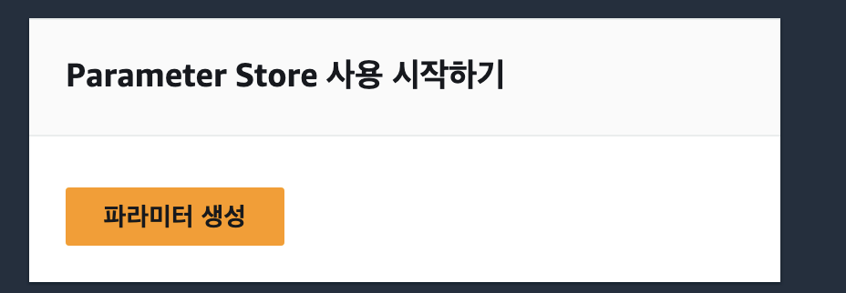

APU URL 등록

- 이름 : `/tryiton/frontend/api-url`
- 유형 : 문자열
- 데이터 형식: text
- 값:  http://TIO-ALB-173623777.ap-northeast-2.elb……
    
    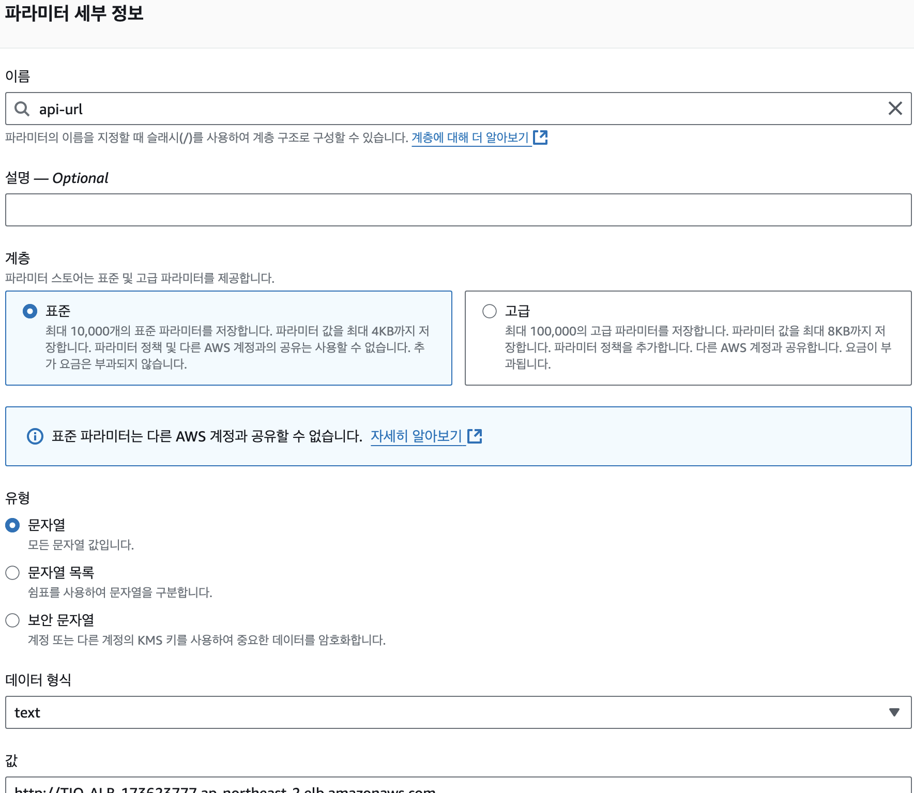
    
    이미지에 보이는 `이름` 은 잘못된 이름이다. 삭제하고 다시만들었는데 스크린샷을 못찍음;;
    
- 파라미터 생성

똑같이 `Google Client ID` 도 등록해준다. 다만 `보안 문자열` 로 생성한다.

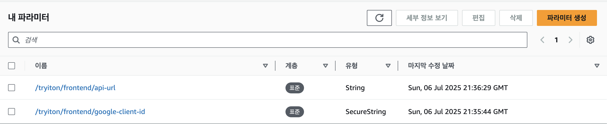

### EC2 인스턴스 IAM 역할에 권한 추가:

EC2 인스턴스가 Parameter Store에 접근할 수 있도록 기존 IAM 역할(`TIO-EC2-Role`)에 다음 권한을 추가

```bash
{
    "Version": "2012-10-17",
    "Statement": [
        {
            "Effect": "Allow",
            "Action": [
                "ssm:GetParameter",
                "ssm:GetParameters"
            ],
            "Resource": [
                "arn:aws:ssm:ap-northeast-2:*:parameter/tryiton/frontend/*"
            ]
        }
    ]
}
```

### CodeDeploy 설정 - **배포 그룹 생성:**

Spring 설정시 했던것 과 동일하다

Deployment groups → Create deployment group

1. Deployment group name: TIO-Frontend-DeploymentGroup
    
    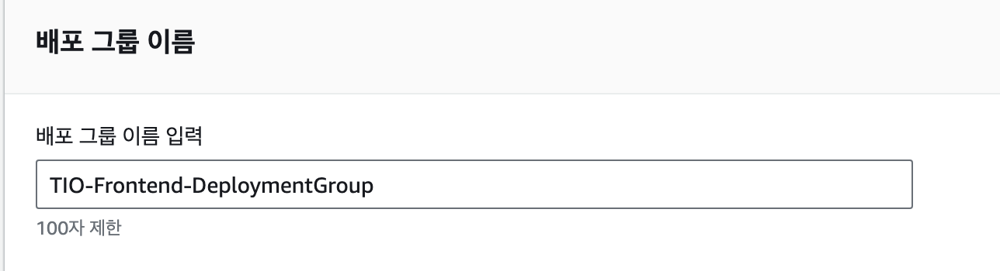
    
2. Service role: TIO-CodeDeploy-Role
    
    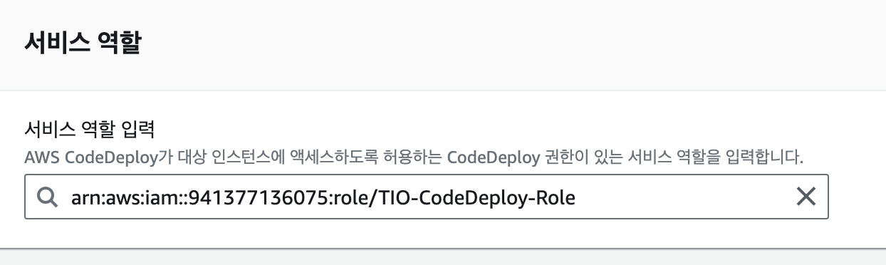
    
3. Deployment type: In-place
    
    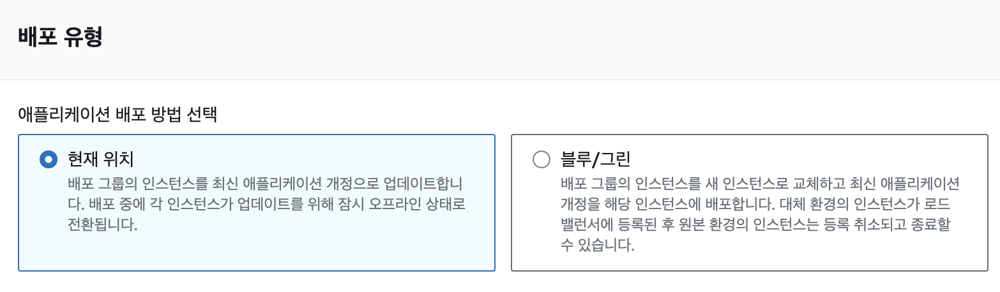
    
4. Environment configuration: Amazon EC2 instances
• **Key**: Name
• **Value**: TIO-Frontend-SSR
    
    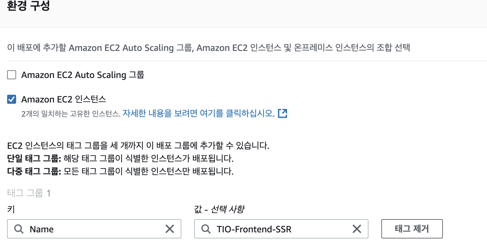
    
5. Deployment settings: CodeDeployDefault.HalfAtATime
    
    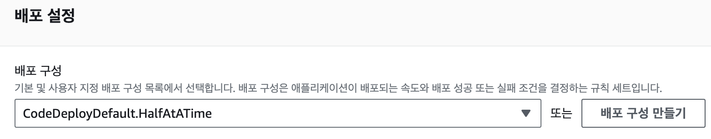
    
    스프링 서버와 다른 옵션인 이유
    
    ```bash
    
    #### **AllAtOnceTime (Spring용):**
    모든 인스턴스를 동시에 배포
    ┌─────┐ ┌─────┐ ┌─────┐
    │ OLD │ │ OLD │ │ OLD │
    └─────┘ └─────┘ └─────┘
        ↓       ↓       ↓
    ┌─────┐ ┌─────┐ ┌─────┐
    │ NEW │ │ NEW │ │ NEW │
    └─────┘ └─────┘ └─────┘
    
    장점:
    • ✅ 빠른 배포: 모든 인스턴스 동시 업데이트
    • ✅ 일관성: 모든 서버가 동일한 버전
    
    단점:
    • ❌ 서비스 중단: 잠깐의 다운타임 발생
    • ❌ 위험성: 문제 발생 시 전체 서비스 영향
    
    #### **HalfAtATime (Frontend용):**
    절반씩 순차적으로 배포
    1단계: 절반 배포
    ┌─────┐ ┌─────┐ ┌─────┐ ┌─────┐
    │ OLD │ │ OLD │ │ NEW │ │ NEW │
    └─────┘ └─────┘ └─────┘ └─────┘
    
    2단계: 나머지 배포
    ┌─────┐ ┌─────┐ ┌─────┐ ┌─────┐
    │ NEW │ │ NEW │ │ NEW │ │ NEW │
    └─────┘ └─────┘ └─────┘ └─────┘
    
    장점:
    • ✅ 무중단 배포: 항상 일부 서버가 서비스 제공
    • ✅ 안전성: 문제 발생 시 절반은 정상 동작
    • ✅ 점진적 배포: 단계적으로 위험 분산
    
    단점:
    • ❌ 느린 배포: 순차적 배포로 시간 소요
    • ❌ 버전 혼재: 배포 중 다른 버전 동시 실행
    
    #### **사용자 경험 우선:**
    javascript
    // 사용자가 웹사이트 접속 중
    // 배포 중에도 서비스 중단 없이 이용 가능
    
    #### **PM2 클러스터 특성:**
    javascript
    // PM2 클러스터 모드에서 프로세스별 순차 재시작
    // 일부 프로세스는 계속 서비스 제공
    
    #### **Next.js 시작 시간:**
    # Next.js 서버 시작 시간이 Spring보다 길어서
    # 점진적 배포가 더 안전
    ```
    
6. Load balancer
    
    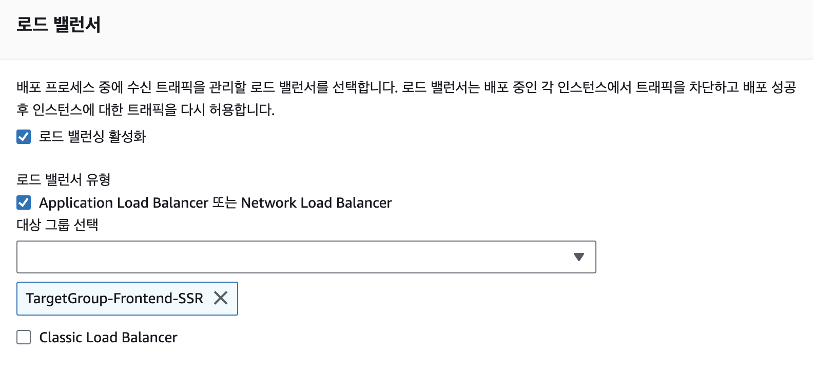
    
7. Create deployment group
    
    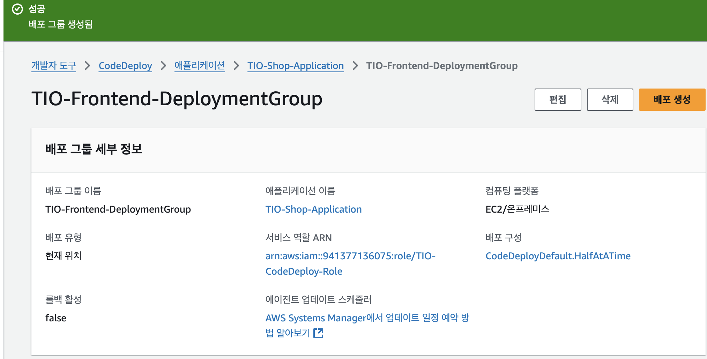
    

### **Phase 4: CloudFront 설정 수정**

### **4-1. 현재 CloudFront 구조 분석**

```yaml
현재 설정:
기본 동작 (/) → S3 (정적 파일)
/api/* → ALB (백엔드 서버)
_next/image/* → S3 (이미지)
```

```yaml
목표 설정:
기본 동작 (/) → ALB → EC2 (Next.js SSR)
/_next/static/* → S3 (정적 파일)
/api/* → ALB (백엔드 서버) - 기존 유지
_next/image/* → S3 (이미지) - 기존 유지
```

### **4-2. CloudFront 설정 수정 단계**

CloudFront → Distributions → EOOGBPUYRN1V5

### **1단계: 새 캐시 동작 추가**

Behaviors 탭 → Create behavior

- Path pattern: `/_next/static/*`
- Origin: [tio-frontend-assets-jungle8th.s3.ap-northeast-2.amazonaws.com](http://tio-frontend-assets-jungle8th.s3.ap-northeast-2.amazonaws.com/)
    
    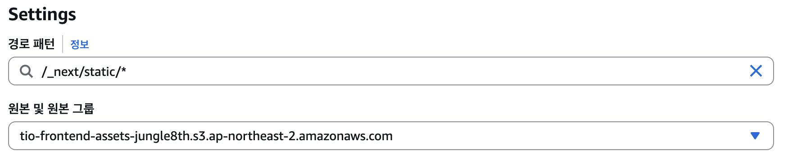
    
- Viewer protocol policy: Redirect HTTP to HTTPS
- Allowed HTTP methods: GET, HEAD
    
    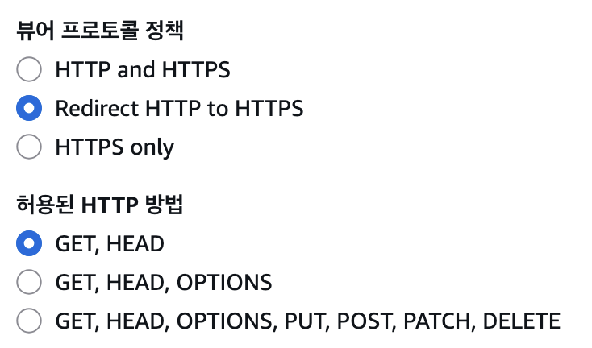
    
- Cache policy: CachingOptimized
- Origin request policy: None
- Response headers policy: None
    
    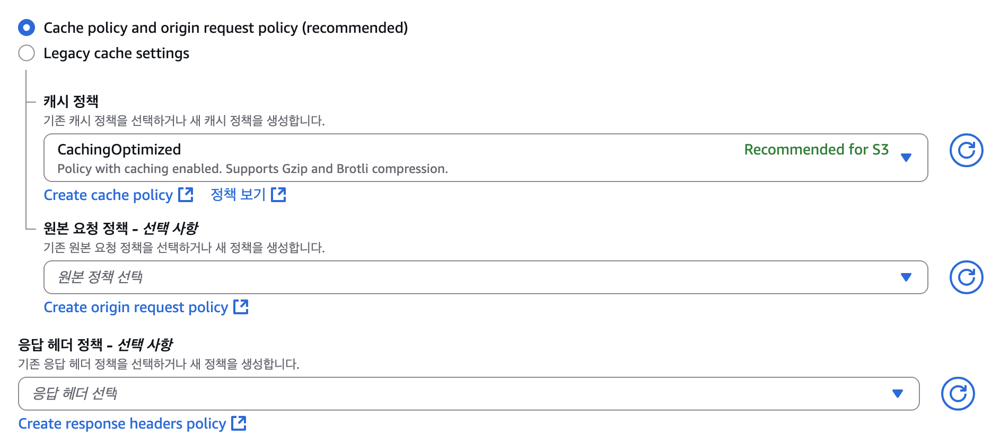
    

### **2단계: 기본 동작 수정**

`Default (*)` behavior 선택 → Edit

- Origin: [tio-alb-173623777.ap-northeast-2.elb.amazonaws.com](http://tio-alb-173623777.ap-northeast-2.elb.amazonaws.com/)
- Viewer protocol policy: Redirect HTTP to HTTPS
- Allowed HTTP methods: GET, HEAD, OPTIONS, PUT, POST, PATCH, DELETE
    
    왜 method 기존에서 확장되었을까?
    
    ```yaml
    
    #### **기존 (GET, HEAD):**
    yaml
    GET: 페이지/데이터 조회
    HEAD: 메타데이터만 조회
    
    #### **변경 후 (모든 HTTP 메서드):**
    yaml
    GET: 페이지 조회
    POST: 데이터 생성 (회원가입, 주문 등)
    PUT: 데이터 전체 수정
    PATCH: 데이터 부분 수정
    DELETE: 데이터 삭제
    OPTIONS: CORS preflight 요청
    HEAD: 메타데이터 조회
    
    #### **Next.js API Routes 지원:**
    javascript
    // pages/api/products.js
    export default function handler(req, res) {
      switch (req.method) {
        case 'GET':
          // 상품 목록 조회
          return getProducts(req, res);
        case 'POST':
          // 새 상품 생성
          return createProduct(req, res);
        case 'PUT':
          // 상품 정보 수정
          return updateProduct(req, res);
        case 'DELETE':
          // 상품 삭제
          return deleteProduct(req, res);
        default:
          res.setHeader('Allow', ['GET', 'POST', 'PUT', 'DELETE']);
          res.status(405).end(`Method ${req.method} Not Allowed`);
      }
    }
    
    #### **실제 사용 예시:**
    javascript
    // TryItOn 프로젝트에서 사용될 HTTP 메서드들
    POST /api/auth/login        // 로그인
    POST /api/orders           // 주문 생성
    PUT /api/users/profile     // 프로필 수정
    DELETE /api/cart/items     // 장바구니 아이템 삭제
    OPTIONS /api/*             // CORS preflight
    ```
    
    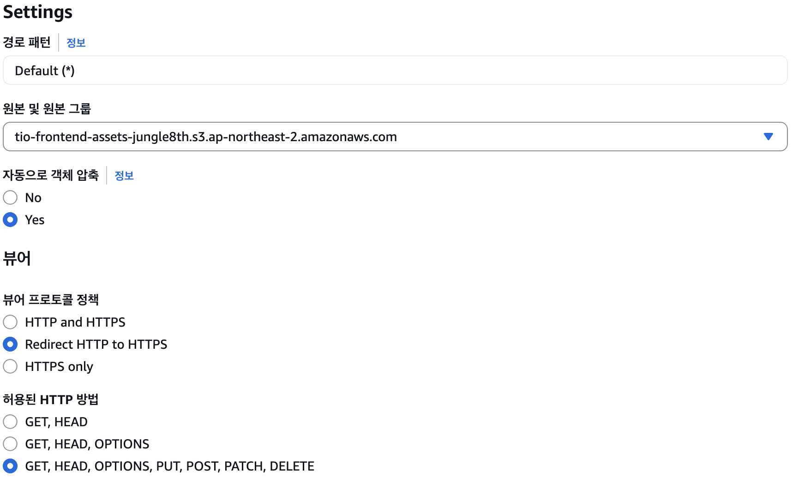
    
- Cache policy: Managed-CachingDisabled (SSR용)
    
    왜 캐싱을 비활성하는가
    
    ```yaml
    
    SSR의 특성:
    javascript
    // SSR은 요청마다 서버에서 동적으로 HTML 생성
    export async function getServerSideProps({ params, req }) {
      const user = await getUserFromSession(req);
      const products = await fetchProducts(user.id);
    
      return {
        props: { products, user } // 사용자마다 다른 데이터
      }
    }
    ```
    
    캐싱 문제:
    사용자 A 요청 → 서버에서 A용 HTML 생성 → CloudFront 캐시 저장
    사용자 B 요청 → CloudFront에서 A용 HTML 반환 ❌ (잘못된 데이터)
    
    CachingDisabled 효과:
    • ✅ 개인화된 콘텐츠: 사용자별 다른 데이터 제공
    • ✅ 실시간 데이터: 최신 정보 항상 반영
    • ✅ 동적 라우팅: Next.js 동적 경로 정상 동작
    
    ```yaml
    
    #### **정적 파일은 여전히 캐싱:**
    yaml
    /_next/static/* → S3 → CachingOptimized (캐싱 활성화)
    /* (SSR 페이지) → ALB → CachingDisabled (캐싱 비활성화)
    ```
    
- Origin request policy: Managed-CORS-S3Origin
    
    CORS-S3Origin 정책이 하는 일:
    • ✅ Origin 헤더 전달: 요청 출처 정보 유지
    • ✅ Referer 헤더 전달: 참조 페이지 정보 유지
    • ✅ User-Agent 전달: 브라우저 정보 유지
    • ✅ Authorization 헤더: 인증 정보 전달
    
    ```yaml
    브라우저의 CORS 요청:
    javascript
    // 프론트엔드에서 API 호출
    fetch('/api/products', {
      method: 'POST',
      headers: {
        'Content-Type': 'application/json',
      },
      body: JSON.stringify(data)
    })
    
    CORS 헤더 전달:
    브라우저 → CloudFront → ALB → EC2 (Next.js)
    ```
    
    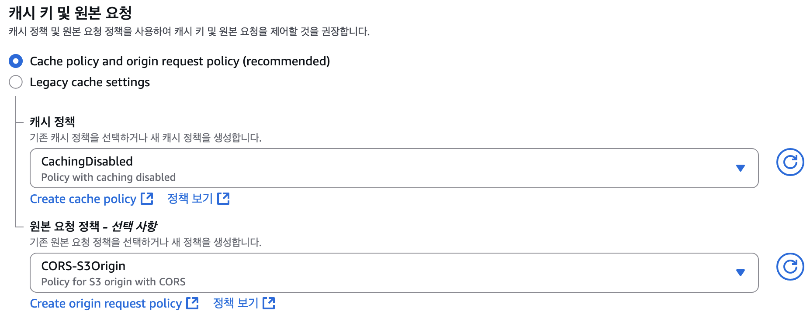
    
- Response headers policy: None

### 설정 변경 종합 해설

### **기존: 정적 웹사이트**

CloudFront → S3 → HTML/CSS/JS 파일 직접 서빙

- 캐싱 최적화 (변하지 않는 파일)
- GET/HEAD만 필요 (파일 다운로드)
- CORS 불필요 (단순 파일 서빙)

### **변경 후: 동적 웹 애플리케이션**

CloudFront → ALB → EC2 → Next.js SSR 서버

- 캐싱 비활성화 (동적 콘텐츠)
- 모든 HTTP 메서드 (RESTful API)
- CORS 지원 (브라우저 호환성)

## 💡 왜 이런 복잡한 설정이 필요한가?

### **사용자 경험 향상:**

- SSR로 초기 페이지 빠른 로딩
- 이후 클라이언트 사이드에서 동적 상호작용
- API 호출로 실시간 데이터 업데이트

### **SEO 최적화:**

```html
<!-- 서버에서 완성된 HTML 제공 -->
<meta property="og:title" content="Nike 에어맥스 - TryItOn" />
<meta property="og:image" content="product-image.jpg" />
```

### **4-3. 최종 CloudFront 동작 순서**

```yaml
우선순위 1: /api/* → ALB → 백엔드 서버 (기존)
우선순위 2: /_next/static/* → S3 → 정적 파일 (새로 추가)
우선순위 3: _next/image/* → S3 → 이미지 (기존)
기본 동작: /* → ALB → EC2 (Next.js SSR) (수정됨)
```

### **4-4. 설정 완료 후 확인**

1. 캐시 무효화:
    
    CloudFront → Invalidations → Create invalidation
    Object paths: /*
    
2. 동작 테스트:
    
    [https://tio-style.com](https://tio-style.com/) → SSR 페이지
    [https://tio-style.com/_next/static/](https://tio-style.com/_next/static/)... → S3 정적 파일
    [https://tio-style.com/api/](https://tio-style.com/api/)... → 백엔드 API
    

## CloudFront 설정 후 전체 배포 테스트

설정 완료 후:

1. 코드 푸시 → GitHub Actions 트리거
2. 빌드 확인 → Next.js SSR 빌드
3. 배포 확인 → CodeDeploy → EC2
4. 서비스 확인 → [https://tio-style.com](https://tio-style.com/) 접속