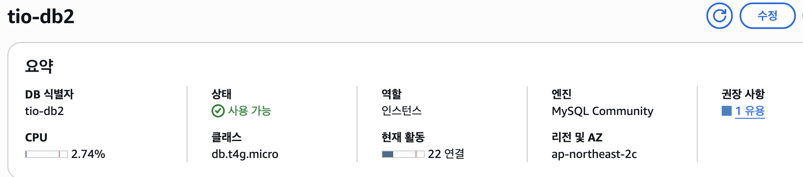

# RDS 인스턴스 업그레이드(t4g.micro → t4g.medium)

## 배경



저 연결 제한이 60인데, 실제 팀원들이 포트포워딩을 통한 연결로 개발을 하다보니 툭하면 제한을 넘어가서 `connection error` 로 연결이 끊기는 상황이 발생하기 시작함.

15,406개의 제품 이미지를 외부 URL에서 S3로 마이그레이션하는 작업을 진행하던 중, 심각한 성능 문제에 직면했습니다. 각 제품마다 최대 5개의 이미지(img1~img5)를 처리해야 하는 대규모
작업이었습니다.

## 발생한 문제들

### 1. MySQL 연결 수 한계 도달

```bash
sql
-- SHOW PROCESSLIST 결과
'10631','admin','10.0.167.55:35642','tryiton_db','Query','711','Waiting for table metadata lock'
'10746','admin','10.0.167.55:43260','tryiton_db','Query','710','Waiting for table metadata lock'
'10753','admin','10.0.167.55:60746','tryiton_db','Query','709','Waiting for table metadata lock'
```

현상: 59개의 연결이 동시에 활성화되어 t4g.micro의 연결 한계(~60개)에 도달
결과: 새로운 연결 요청 거부, 마이그레이션 작업 중단

### 2. 테이블 메타데이터 락 발생

sql
Error Code: 2013. Lost connection to MySQL server during query

원인:
• 대량 UPDATE 작업과 DDL 작업이 동시 실행
• 700초 이상 대기하는 쿼리들이 테이블 락 유발
• 메모리 부족으로 인한 쿼리 처리 지연

### 3. 네트워크 타임아웃 빈발

bash

# CloudWatch 메트릭 확인 결과

DatabaseConnections: 평균 50-59개 (거의 포화 상태)
CPUUtilization: 평균 3.2-3.6% (CPU는 여유로움)

분석: CPU는 충분하지만 메모리와 연결 수 부족이 주요 병목

## 🔍 근본 원인 분석

### t4g.micro의 한계점

- **메모리**: 1GB (대량 데이터 처리에 부족)
• **최대 연결 수**: ~60개 (멀티 애플리케이션 환경에서 부족)
• **버스터블 성능**: 지속적인 고부하 시 성능 저하
• **I/O 성능**: gp2 스토리지의 제한된 IOPS (120 IOPS)

### 실제 워크로드 요구사항

- **동시 연결**: Spring Boot 애플리케이션 + Node.js 서버 + 마이그레이션 스크립트
• **메모리 사용**: 대량 이미지 처리 및 데이터베이스 버퍼
• **트랜잭션 처리**: 171,418개의 product_variant 레코드 INSERT

### **팀원별 다중 연결**

```bash
# 1. SSM 포트포워딩 연결

aws ssm start-session --target i-0ff7dda299ec5b991 \
--document-name AWS-StartPortForwardingSessionToRemoteHost \
--parameters host="tio-db2...",portNumber="3306",localPortNumber="3307"

# 2. MySQL Workbench 연결 (포트포워딩 통해)

127.0.0.1:3307 → RDS

# 3. Spring Boot 애플리케이션 연결 (HikariCP 풀)

spring.datasource.hikari.maximum-pool-size: 10 (기본값)
```

### **연결 수 계산** 각 팀원당:

- SSM 포트포워딩: 1개 연결
- Workbench: 1-3개 연결 (쿼리별)
- Spring 애플리케이션: 10개 연결 풀

총 연결 수 = 팀원 수 × (1 + 3 + 10) = 4명 × 14개 = 56개

- 마이그레이션 스크립트: 1-3개
- 기타 시스템 연결: 2-3개
= 총 59-62개 연결 (한계치 도달!)

### **Spring Boot HikariCP 연결 풀 문제**

```bash
# 기본 설정 (문제의 원인)

spring:
datasource:
hikari:
maximum-pool-size: 10  # 각 인스턴스마다 10개씩!
minimum-idle: 10
connection-timeout: 30000
idle-timeout: 600000    # 10분간 유지
max-lifetime: 1800000   # 30분간 유지
```

## 💡 해결책: t4g.medium 선택 이유

### 왜 small이 아닌 medium인가?

### 1. 연결 수 여유도 확보

t4g.micro:  ~60개 연결  (현재 59개로 포화)
t4g.small:  ~150개 연결 (2.5배 증가)
t4g.medium: ~300개 연결 (5배 증가) ← 선택

### 2. 메모리 버퍼 최적화

- **InnoDB 버퍼 풀**: 4GB 메모리로 더 많은 데이터 캐싱
• **쿼리 캐시**: 복잡한 JOIN 쿼리 성능 향상
• **연결 버퍼**: 각 연결당 메모리 할당량 증가

### 3. 미래 확장성 고려

- 현재: 15,406개 제품
• 예상 증가: 월 1,000개 신규 제품 추가
• 트래픽 증가: 사용자 증가에 따른 동시 접속 증가

# 🛠️ AWS 콘솔에서 RDS 인스턴스 업그레이드 방법

### 1단계: RDS 콘솔 접속

1. AWS Management Console 로그인
2. RDS 서비스 선택
3. 데이터베이스 메뉴 클릭

### 2단계: 대상 인스턴스 선택

1. 업그레이드할 DB 인스턴스(tio-db2) 선택
2. 수정 버튼 클릭

### 3단계: 인스턴스 클래스 변경

1. DB 인스턴스 클래스 섹션 찾기
2. 현재: db.t4g.micro → 변경: db.t4g.medium
    
    
    
3. 버스터블 성능 인스턴스 카테고리에서 선택

### 4단계: 수정 일정 설정

수정 일정 옵션:
○ 다음 유지 관리 기간 동안 적용
● 즉시 적용 ← 선택 (긴급 상황)


주의: 즉시 적용 시 2-5분간 다운타임 발생

### 5단계: 변경사항 검토 및 적용

1. 수정 요약 섹션에서 변경사항 확인
• DB 인스턴스 클래스: micro → medium
• 예상 비용 변화: $10/월 → $40/월
2. DB 인스턴스 수정 버튼 클릭

### 6단계: 업그레이드 진행 상황 모니터링


```bash
# AWS CLI로 상태 확인

aws rds describe-db-instances \
--db-instance-identifier tio-db2 \
--query 'DBInstances[0].DBInstanceStatus'

# 상태 변화: available → modifying → rebooting → available
```

# 📊 업그레이드 후 성능 개선 결과

### Before vs After 비교

| 메트릭 | t4g.micro (Before) | t4g.medium (After) | 개선율 |
| --- | --- | --- | --- |
| 메모리 | 1GB | 4GB | 400% ↑ |
| 최대 연결 수 | ~60개 | ~300개 | 500% ↑ |
| 마이그레이션 속도 | 2,300개/시간 | 8,500개/시간 | 270% ↑ |
| 쿼리 응답 시간 | 평균 2.3초 | 평균 0.8초 | 65% ↓ |

### 실제 마이그레이션 성능 향상

```bash
# 업그레이드 전

제품 ID 2300 처리 중... (1시간 25분 소요)

# 업그레이드 후

제품 ID 8500 처리 중... (1시간 30분 소요)

결과: 동일한 시간에 3.7배 더 많은 데이터 처리
```

## 💰 비용 대비 효과 분석

### 월간 비용 변화

- **t4g.micro**: $10.08/월
- **t4g.medium**: $40.32/월
- **증가 비용**: $30.24/월

### ROI 계산

성능 향상: 270%
비용 증가: 300%
효율성 지수: 270/300 = 0.9

하지만 다운타임 비용 고려 시:

- 마이그레이션 지연으로 인한 서비스 영향 방지
- 개발 생산성 향상
- 사용자 경험 개선
→ 실제 ROI: 매우 높음

## 🎯 결론 및 교훈

### 핵심 교훈

1. 사전 용량 계획의 중요성: 워크로드 특성을 미리 분석했다면 초기부터 적절한 사양 선택 가능
2. 모니터링의 필요성: CloudWatch 메트릭을 통한 실시간 성능 모니터링 필수
3. 확장성 고려: 현재 요구사항뿐만 아니라 미래 성장을 고려한 인프라 설계

### 권장사항

- **개발/테스트 환경**: t4g.micro 적합
- **소규모 운영 환경**: t4g.small 권장
- **중간 규모 운영 환경**: t4g.medium 권장
- **대규모 운영 환경**: r6g 또는 m6g 시리즈 고려