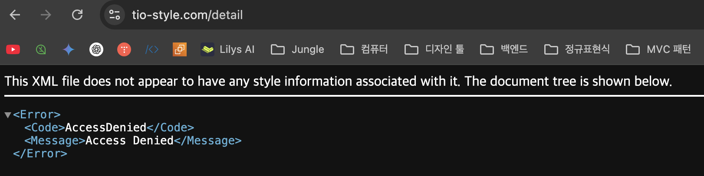

# S3 / CloudFront AccessDenied 문제 해결



## 문제점: 링크를 직접 입력해서 이동 시도하면 `AccessDenied`

메인에서 마이페이지(/mypage)나, 제품을 눌러 상세페이지(/details)로 이동하면 정상적으로 보이나, 주소창에 직접 입력해서 이동을 시도하면 위의 사진이 노출됨.

## 실제 파일이 있는데 AccessDenied가 뜨는 원인

### 1. S3 버킷 권한 문제

- 파일은 존재하지만 퍼블릭 읽기 권한이 없음
- 버킷 정책이나 객체 ACL 설정 문제

### 2. S3 버킷 정책 확인

```json

{
  "Effect": "Allow",
  "Principal": {
    "Service": "cloudfront.amazonaws.com"
  },
  "Action": "s3:GetObject",
  "Resource": "arn:aws:s3:::tio-frontend-assets-jungle8th/*",
  "Condition": {
    "StringEquals": {
      "AWS:SourceArn": "arn:aws:cloudfront::941377136075:distribution/EOOGBPUYRN1V5"
    }
  }
}
```

S3 버킷이 CloudFront를 통해서만 접근 가능하도록 설정되어 있는데 처리되지 못한다면, CloudFront가 정상동작하지않음에 무게를 둘 수 있다.

### 동작 흐름

[tio-style.com/mypage](http://tio-style.com/mypage) 접근:

1. CloudFront가 요청 받음
2. CloudFront가 S3에서 mypage.html 요청
3. S3가 CloudFront에게 파일 제공 ✅
4. 사용자에게 정상 응답 전달되어야 함

하지만 AccessDenied 발생 = CloudFront 설정 문제

### **핵심 문제:**

CloudFront가 /mypage 요청을 /mypage.html 파일로 매핑하지 못함

## 문제 진단 방법

### **CloudFront 동작 확인**

```bash
# CloudFront를 통한 직접 접근 테스트

curl -I https://d1vke19yqieoiy.cloudfront.net/mypage
curl -I https://d1vke19yqieoiy.cloudfront.net/mypage.html
```


분석:
• ❌ 403 Forbidden 에러 (도메인과 동일한 결과)
• 🔍 확인: CloudFront 직접 도메인으로도 같은 문제 발생
• 📝 의미: 도메인 설정 문제가 아닌 CloudFront 자체 설정 문제


분석:
• ✅ 정상 응답
• 📁 파일 크기: 20,050 bytes
• 🔄 캐시 상태: Miss (처음 요청, 캐시되지 않음)
• ✅ 동작: CloudFront → S3 → mypage.html 파일 찾음 → 정상 반환

```bash
# 도메인을 통한 접근 테스트

curl -I https://tio-style.com/mypage
curl -I https://tio-style.com/mypage.html
```


분석:
• ❌ 403 Forbidden 에러
• 🔍 원인: CloudFront가 S3에서 /mypage 파일을 찾으려 했지만 존재하지 않음
• 📝 동작: CloudFront → S3 요청 → 파일 없음 → 403 반환
• 🚨 문제: URL 리라이팅 없음 (/mypage → /mypage.html 변환 안됨)


분석:
• ✅ 정상 응답
• 📁 파일 크기: 20,050 bytes
• 🔄 캐시 상태: Miss (처음 요청, 캐시되지 않음)
• ✅ 동작: CloudFront → S3 → mypage.html 파일 찾음 → 정상 반환

## 핵심 문제 확인

### **문제 정의:**

✅ 작동: /mypage.html
❌ 실패: /mypage

CloudFront가 /mypage 요청을 /mypage.html로 자동 변환하지 못함

### **해결해야 할 것:**

1. URL 리라이팅: /mypage → /mypage.html
2. Custom Error Response: 403/404 → index.html (SPA 라우팅용)

### **방법 1: 패턴 기반 URL 리라이팅 (권장)**

```json
function handler(event) {
    var request = event.request;
    var uri = request.uri;

    // 확장자가 없는 경로는 모두 .html 추가
    if (!uri.includes('.') && !uri.endsWith('/')) {
        request.uri = uri + '.html';
    }

    // 디렉토리 경로 처리 (/mypage/profile -> /mypage/profile.html)
    if (uri.match(/^\/[^.]*\/[^.]*$/)) {
        request.uri = uri + '.html';
    }

    return request;
}
```

이렇게 하면:
• /mypage → /mypage.html
• /profile → /profile.html
• /mypage/orders → /mypage/orders.html
• /category/123 → /category/123.html

## 🛠️ 해야 할 작업

### **1단계: CloudFront Functions 생성**

콘솔

1. AWS 콘솔 로그인 → CloudFront 서비스 이동
2. 왼쪽 메뉴에서 "Functions" 클릭
3. "Create function" 버튼 클릭
    
    
    
4. 함수 설정:
• **Name**: url-rewrite-function
• **Description**: URL rewriting for HTML files
• **Runtime**: cloudfront-js-2.0 (기본값)
    
    
    

CLI

```json
function handler(event) {
    var request = event.request;
    var uri = request.uri;

    // 확장자가 없는 경로에 .html 추가
    if (!uri.includes('.') && !uri.endsWith('/')) {
        request.uri = uri + '.html';
    }

    return request;
}
```

### **2단계: 함수 배포**


아무것도 입력되지 않은 코드 에디터. 여기에 다음 코드 입력:

```jsx
function handler(event) {
    var request = event.request;
    var uri = request.uri;

    // 확장자가 없는 경로에 .html 추가
    if (!uri.includes('.') && !uri.endsWith('/')) {
        request.uri = uri + '.html';
    }

    return request;
}
```

1. "Save" 버튼 클릭
    
    
    
2. "Publish" 탭으로 이동
3. "Publish function" 버튼 클릭
    
    
    
4. 게시 완료 확인
    
    
    

CLI

```json
# 함수 파일 생성
echo 'function handler(event) {
    var request = event.request;
    var uri = request.uri;

    if (!uri.includes(".") && !uri.endsWith("/")) {
        request.uri = uri + ".html";
    }

    return request;
}' > url-rewrite.js

# CloudFront 함수 생성
aws cloudfront create-function \
    --name "url-rewrite-function" \
    --function-config Comment="URL rewriting",Runtime="cloudfront-js-1.0" \
    --function-code fileb://url-rewrite.js**3단계: CloudFront 배포에 함수 연결**
```

### 3단계: CloudFront 배포에 함수 연결

콘솔

1. CloudFront → Distributions(배포) 이동
2. 배포 ID 클릭
3. "Behaviors(동작)" 탭 선택
4. Default (*) behavior 선택 후 "Edit" 클릭
    
    
    
    + Function associations 섹션에서:
    
    
    
5. Viewer request 드롭다운 클릭
6. CloudFront Functions 선택
    
    
    
7. Function ARN/Name 필드에 url-rewrite-function 입력
    
    
    
8. 하단 "Save changes" 클릭
    
    
    

CLI

```json
# 현재 설정 가져오기
aws cloudfront get-distribution-config --id EOOGBPUYRN1V5 > current-config.json

# 설정 수정 후 업데이트
aws cloudfront update-distribution \
    --id EOOGBPUYRN1V5 \
    --distribution-config file://updated-config.json \
    --if-match E19I27J19AR1F8
```

### **4단계: 배포 완료 대기**

콘솔

1. Distributions 목록으로 돌아가기
    
    
    
2. 배포 상태가 "Deploying" → "Deployed"로 변경될 때까지 대기
    
    
    
3. 보통 5-15분 소요
    
    
    
    배포가 정상적으로 완료되면 `마지막 수정` 부분이 시간으로 바뀌어있다.
    

CLI

```json
# 배포 상태 확인
aws cloudfront get-distribution --id EOOGBPUYRN1V5 --query 'Distribution.Status'

# 배포 완료까지 대기 (5-15분)
aws cloudfront wait distribution-deployed --id EOOGBPUYRN1V5
```


상태 확인시 진행중 확인할 수 있음.


완료까지 대기 명령어를 터미널에 입력 시, 커서가 아래로 내려가고.. 완료가 되는 순간 입력 커서가 다시 활성화된다.


다시 위에 명령어를 입력해보면

### **5단계: 캐시 무효화**

콘솔

1. 해당 배포 클릭
2. "Invalidations(무효화)" 탭 선택
3. "Create invalidation" 클릭
4. Object paths에 /* 입력
    
    
    
5. "Create invalidation" 클릭
    
    
    
    
    
    
    
    `진행 중` 에서 `완료됨` 으로 변경되면 된다.
    

CLI

```json
# 기존 캐시 삭제
aws cloudfront create-invalidation \
    --distribution-id EOOGBPUYRN1V5 \
    --paths "/*"
```

### **6단계: 테스트**

```json
# 테스트 실행

curl -I https://tio-style.com/mypage

# 예상 결과: HTTP/2 200
```

---

## 🔍 실제 동작 방식

### **CloudFront Functions의 동작:**

```json
사용자 입력: [tio-style.com/mypage](http://tio-style.com/mypage)
↓
브라우저 주소창: [tio-style.com/mypage](http://tio-style.com/mypage) (그대로 유지)
↓
CloudFront Functions: /mypage → /mypage.html (내부 변환)
↓
S3에서 mypage.html 파일 가져옴
↓
사용자에게 콘텐츠 전달
```

### **사용자가 보는 것:**

- ✅ 주소창: [tio-style.com/mypage](http://tio-style.com/mypage) (깔끔한 URL)
- ✅ 페이지 내용: mypage.html의 실제 콘텐츠
- ✅ 링크 공유: [tio-style.com/mypage로](http://tio-style.com/mypage%EB%A1%9C) 공유 가능

## 🎯 핵심 포인트

### **URL 리라이팅 vs 리다이렉트**

❌ 리다이렉트 (사용자가 URL 변화 봄):
/mypage → 302 리다이렉트 → /mypage.html

✅ 리라이팅 (사용자는 URL 변화 못 봄):
/mypage → 내부적으로 /mypage.html 처리

### **실제 테스트 결과 예상:**

```json
curl -I [https://tio-style.com/mypage](https://tio-style.com/mypage)
# HTTP/2 200 (리다이렉트 없음)

# 브라우저 주소창: [tio-style.com/mypage](http://tio-style.com/mypage) 그대로
```

## 📱 사용자 경험

### **현재 (문제 상황):**

- 사용자: [tio-style.com/mypage](http://tio-style.com/mypage) 입력
- 결과: 403 에러 페이지

### **수정 후 (정상 동작):**

- 사용자: [tio-style.com/mypage](http://tio-style.com/mypage) 입력
- 주소창: [tio-style.com/mypage](http://tio-style.com/mypage) (변화 없음)
- 결과: 마이페이지 정상 표시

## 🔧 기술적 설명

CloudFront Functions는 "Viewer Request" 단계에서 작동:

1. 사용자 요청 받음
2. 내부적으로만 URI 수정
3. 수정된 URI로 S3에서 파일 가져옴
4. 원래 URL 그대로 응답 반환

결과: 사용자는 URL 변화를 전혀 모르고, 깔끔한 URL을 유지하면서 정상적으로 페이지를 볼 수 있음