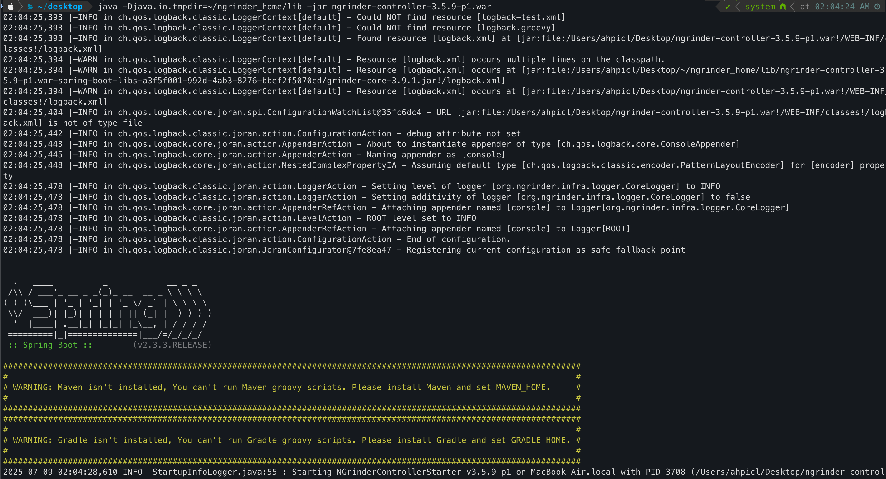

# nGrinder 설치 및 실행

## nGrinder는?

네이버에서 오픈소스로 제작한 테스트 도구다. 

자세한건 공식문서 [https://naver.github.io/ngrinder/](https://naver.github.io/ngrinder/) or [https://github.com/naver/ngrinder/wiki/User-Guide](https://github.com/naver/ngrinder/wiki/User-Guide)

## 설치

[https://github.com/naver/ngrinder/releases](https://github.com/naver/ngrinder/releases)

### 1. 초기 실행 시도 및 문제 발생

첫 번째 실행 시도:

```jsx
java -jar ngrinder-controller-3.5.9-p1.war
```

발생한 에러:

```jsx
ERROR
Please set java.io.tmpdir property like following. tmpdir should be different from the OS default tmpdir.
java -Djava.io.tmpdir=${NGRINDER_HOME}/lib -jar ngrinder-controller.war
```

### 2. 임시 디렉토리 설정 및 재실행

해결 방법:

```jsx
# ngrinder 홈 디렉토리 생성

mkdir -p ~/ngrinder_home/lib

# 올바른 옵션으로 실행

cd ~/Desktop
java -Djava.io.tmpdir=~/ngrinder_home/lib -jar ngrinder-controller-3.5.9-p1.war
```

### 3. SVN 권한 문제 발생

발생한 에러:

```jsx
ERROR FileEntryRepository.java:192 : Error while fetching files from SVN for admin
SVNException: svn: E160004: Can't read length line from file /Users/ahpicl/.ngrinder/repos/admin/db/fs-type: Permission denied
```

권한 문제 해결 시도 1:

```jsx
# 권한 수정

chmod -R 755 ~/.ngrinder

권한 문제가 지속되어 근본적 해결:

# 기존 문제 있는 저장소 백업

cd ~/.ngrinder && mv repos repos_backup_$(date +%Y%m%d_%H%M%S)

# 완전 삭제 (권한 문제로 sudo 필요)

sudo rm -rf ~/.ngrinder
```

### 4. Agent 및 Monitor 설치

압축 파일 해제:

```jsx
cd ~/Desktop
tar -xf ngrinder-agent-3.5.9-p1-localhost.tar
tar -xf ngrinder-monitor-3.5.9-p1.tar
```

### 5. 최종 실행 순서

1단계: Controller 실행

```jsx
cd ~/Desktop
java -Djava.io.tmpdir=~/ngrinder_home/lib -jar ngrinder-controller-3.5.9-p1.war
```



긴 메세지 끝에 `Tomcat started on port(s) : 8080 (http) with context path ~` 라고 나오면 컨트롤러 실행 성공


2단계: Agent 실행 (새 터미널)

```bash
cd ~/Desktop/ngrinder-agent
./run_agent.sh
```


3단계: 웹 UI 접속

• 브라우저에서 [http://localhost:8080](http://localhost:8080/) 접속


• 로그인: admin / admin

4단계: Agent 연결 확인
• Admin → Agent Management에서 Agent 상태 확인
• "Ready" 상태면 정상 연결


### 6. 주요 해결 포인트

권한 문제 해결:
• macOS에서 SVN 저장소 권한 충돌 발생
• 기존 .ngrinder 디렉토리 완전 삭제 후 재생성으로 해결

실행 옵션:
• java.io.tmpdir 설정 필수
• OS 기본 임시 디렉토리와 다른 경로 지정 필요

```jsx
파일 구조:
~/Desktop/
├── ngrinder-controller-3.5.9-p1.war
├── ngrinder-agent/
│   ├── run_agent.sh
│   └── lib/
└── ngrinder-monitor/
└── run_monitor.sh
~/ngrinder_home/lib/  (임시 디렉토리)
~/.ngrinder/          (설정 및 저장소, 자동 생성)
```

### 7. 최종 성공 상태

- Controller: 정상 실행 및 웹 UI 접속 가능
- Agent: Controller에 성공적으로 연결
- SVN 에러: 완전 해결
- 성능 테스트 준비 완료

이제 EC2 대상으로 성능 테스트 스크립트를 작성하고 실행할 수 있는 상태