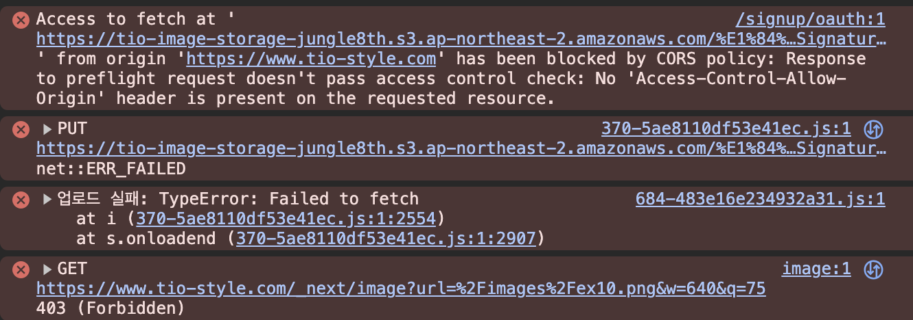

# pre-signed URL 기법 (front → s3) (완료)

### **Pre-signed URL을 이용한 파일 업로드 구현 흐름**

이 흐름의 핵심은 **"프론트엔드는 백엔드에게 '허가증'을 요청하고, 그 허가증으로 S3에 직접 파일을 올린다"** 입니다.

### **1단계: 백엔드 - '임시 허가증(Pre-signed URL)' 발급 API 만들기**

가장 먼저, 프론트엔드가 허가증을 요청할 수 있는 API 엔드포인트를 Spring Boot 서버에 만들어야 합니다.

- **무엇을 하는가?:** "이 파일 이름으로, 이 버킷에, 10분 동안만, 파일을 올릴 수 있는(PUT) 특별한 URL을 생성해줘" 라고 AWS S3에 요청하고, 받은 URL을 클라이언트에게 돌려주는 API를 만듭니다.
- **왜 하는가?:** 모든 권한 발급 과정을 우리가 통제하는 안전한 백엔드 서버에서만 처리하여, 프론트엔드에 AWS 자격 증명을 절대 노출하지 않기 위함입니다.
- **상세 실행 방법:**
    1. build.gradle에 AWS SDK 의존성 추가:Groovy
        
        S3와 통신하기 위한 라이브러리를 추가합니다. (이전 aws-starter-secrets-manager와 함께 aws-starter-s3를 추가하면 편리합니다.)
        
        ```bash
        // build.gradle
        dependencies {
            // ...
            implementation 'io.awspring.cloud:spring-cloud-aws-starter-s3'
        }
        ```
        
    2. Controller에 API 엔드포인트 생성:Java
        
        프론트엔드가 파일 이름과 종류를 보내면, Pre-signed URL을 생성하여 반환하는 컨트롤러를 만듭니다.
        
        ```bash
        // FileUploadController.java
        
        import io.awspring.cloud.s3.S3Template;
        import org.springframework.beans.factory.annotation.Autowired;
        import org.springframework.beans.factory.annotation.Value;
        import org.springframework.http.ResponseEntity;
        import org.springframework.web.bind.annotation.GetMapping;
        import org.springframework.web.bind.annotation.RequestParam;
        import org.springframework.web.bind.annotation.RestController;
        import software.amazon.awssdk.services.s3.model.PutObjectRequest;
        import software.amazon.awssdk.services.s3.presigner.model.PresignedPutObjectRequest;
        import software.amazon.awssdk.services.s3.presigner.S3Presigner;
        
        import java.net.URL;
        import java.time.Duration;
        
        @RestController
        public class FileUploadController {
        
            @Autowired
            private S3Template s3Template; // 또는 S3Presigner를 직접 주입
        
            @Value("${cloud.aws.s3.bucket}") // application.properties에 버킷 이름 설정
            private String bucketName;
        
            @GetMapping("/api/files/generate-presigned-url")
            public ResponseEntity<String> generatePresignedUrl(@RequestParam String fileName) {
        
                // S3Presigner를 직접 사용하여 URL 생성
                S3Presigner presigner = S3Presigner.builder().region(Region.AP_NORTHEAST_2).build();
        
                PutObjectRequest objectRequest = PutObjectRequest.builder()
                        .bucket(bucketName)
                        .key(fileName) // 업로드할 파일의 이름
                        // .contentType("image/jpeg") // 파일 타입 지정 (선택 사항)
                        .build();
        
                PresignedPutObjectRequest presignedRequest = presigner.presignPutObject(r -> r
                        .signatureDuration(Duration.ofMinutes(10)) // URL의 유효 시간 10분
                        .putObjectRequest(objectRequest));
        
                URL url = presignedRequest.url();
        
                presigner.close();
        
                return ResponseEntity.ok(url.toString());
            }
        }
        ```
        
    3. **`application-dev.properties`에 버킷 이름 추가:**Properties (생략. secret 및  각자 .env로 저장)
        
        ```bash
        # ...
        cloud.aws.s3.bucket=tio-image-storage-jungle8th
        ```
        

---

### **2단계: 프론트엔드 - 허가증 요청 및 파일 업로드 구현하기**

이제 프론트엔드(Next.js/React)에서 파일이 선택되었을 때, 위에서 만든 API를 호출하고 받은 URL로 실제 파일을 업로드하는 로직을 구현합니다.

- **무엇을 하는가?:** 파일이 선택되면, 파일 이름을 백엔드 API로 보내 Pre-signed URL을 받아온 뒤, `axios`나 `fetch`를 사용하여 해당 URL로 파일을 `PUT` 요청으로 전송합니다.
- **왜 하는가?:** AWS 자격 증명 없이, 오직 백엔드로부터 받은 '임시 허가증'만으로 S3에 안전하게 파일을 업로드하기 위함입니다.
- **상세 실행 방법 (React/Next.js 예시):**JavaScript
    
    ```tsx
    // src/api/files.tsx
    import { axiosWithoutAuth } from './index';
    
    export interface FileUploadResponse {
      presignedUrl: string;
    }
    
    /**
     * S3 Pre-signed URL 생성 요청
     * @param fileName - 업로드할 파일명
     * @returns Pre-signed URL
     */
    export const generatePresignedUrl = async (fileName: string): Promise<string> => {
      const response = await axiosWithoutAuth().get<string>('/api/files', {
        params: {
          fileName,
        },
      });
      
      return response.data;
    };
    
    /**
     * S3에 파일 직접 업로드
     * @param presignedUrl - Pre-signed URL
     * @param file - 업로드할 파일
     */
    export const uploadFileToS3 = async (presignedUrl: string, file: File): Promise<void> => {
      await fetch(presignedUrl, {
        method: 'PUT',
        body: file,
        headers: {
          'Content-Type': file.type,
        },
      });
    };
    
    ```
    
    ```tsx
    // src/components/common/imageUploader.tsx
    'use client';
    
    import React, { useState } from 'react';
    import { generatePresignedUrl, uploadFileToS3 } from '@/api/files';
    
    interface ImageUploaderProps {
      onUploadSuccess?: (fileUrl: string) => void;
      onUploadError?: (error: Error) => void;
      accept?: string;
      maxSize?: number; // MB 단위
    }
    
    const ImageUploader: React.FC<ImageUploaderProps> = ({
      onUploadSuccess,
      onUploadError,
      accept = 'image/*',
      maxSize = 10, // 기본 10MB
    }) => {
      const [selectedFile, setSelectedFile] = useState<File | null>(null);
      const [isUploading, setIsUploading] = useState(false);
      const [uploadProgress, setUploadProgress] = useState(0);
    
      const handleFileChange = (event: React.ChangeEvent<HTMLInputElement>) => {
        const file = event.target.files?.[0];
        
        if (!file) {
          setSelectedFile(null);
          return;
        }
    
        // 파일 크기 검증
        if (file.size > maxSize * 1024 * 1024) {
          alert(`파일 크기는 ${maxSize}MB 이하여야 합니다.`);
          return;
        }
    
        // 파일 타입 검증
        if (!file.type.startsWith('image/')) {
          alert('이미지 파일만 업로드 가능합니다.');
          return;
        }
    
        setSelectedFile(file);
      };
    
      const handleUpload = async () => {
        if (!selectedFile) {
          alert('파일을 먼저 선택해주세요.');
          return;
        }
    
        setIsUploading(true);
        setUploadProgress(0);
    
        try {
          // 1. 백엔드에 Pre-signed URL 요청
          console.log('Pre-signed URL 요청 중...');
          const presignedUrl = await generatePresignedUrl(selectedFile.name);
          console.log('받아온 Pre-signed URL:', presignedUrl);
          
          setUploadProgress(30);
    
          // 2. S3에 파일 업로드
          console.log('S3 업로드 시작...');
          await uploadFileToS3(presignedUrl, selectedFile);
          
          setUploadProgress(100);
    
          // 3. 업로드된 파일의 공개 URL 생성 (S3 버킷 설정에 따라 다름)
          const fileUrl = presignedUrl.split('?')[0]; // 쿼리 파라미터 제거
          
          console.log('업로드 성공! 파일 URL:', fileUrl);
          alert('업로드 성공!');
          
          // 성공 콜백 호출
          onUploadSuccess?.(fileUrl);
          
          // 상태 초기화
          setSelectedFile(null);
          const fileInput = document.getElementById('file-input') as HTMLInputElement;
          if (fileInput) fileInput.value = '';
    
        } catch (error) {
          console.error('업로드 실패:', error);
          alert('업로드에 실패했습니다.');
          onUploadError?.(error as Error);
        } finally {
          setIsUploading(false);
          setUploadProgress(0);
        }
      };
    
      return (
        <div className="space-y-4">
          <div>
            <input
              id="file-input"
              type="file"
              accept={accept}
              onChange={handleFileChange}
              disabled={isUploading}
              className="block w-full text-sm text-gray-500 file:mr-4 file:py-2 file:px-4 file:rounded-full file:border-0 file:text-sm file:font-semibold file:bg-blue-50 file:text-blue-700 hover:file:bg-blue-100"
            />
          </div>
    
          {selectedFile && (
            <div className="text-sm text-gray-600">
              선택된 파일: {selectedFile.name} ({(selectedFile.size / 1024 / 1024).toFixed(2)} MB)
            </div>
          )}
    
          {isUploading && (
            <div className="w-full bg-gray-200 rounded-full h-2.5">
              <div
                className="bg-blue-600 h-2.5 rounded-full transition-all duration-300"
                style={{ width: `${uploadProgress}%` }}
              ></div>
            </div>
          )}
    
          <button
            onClick={handleUpload}
            disabled={!selectedFile || isUploading}
            className="px-4 py-2 bg-blue-600 text-white rounded-md hover:bg-blue-700 disabled:bg-gray-400 disabled:cursor-not-allowed"
          >
            {isUploading ? '업로드 중...' : '이미지 업로드'}
          </button>
        </div>
      );
    };
    
    export default ImageUploader;
    
    ```
    

### 문제 발생



제일 위에보면 CORS 정책에 의해 막혔다고 나와있다. `~has been blocked by CORS policy: ~` 

사용자가 이미지를 제출하면 Client는 서버에게 pre-signed URL을 받아와 AWS S3에 접근해 이미지를 업로드한다. 그 과정에서 발생하는 듯 하다.


```json

[{
    "AllowedHeaders": [
        "*"
    ],
    "AllowedMethods": [
        "GET",
        "PUT",
        "POST",
        "DELETE",
        "HEAD"
    ],
    "AllowedOrigins": [
        "http://localhost:3000",
        "https://tio-style.com",
        "https://www.tio-style.com"
    ],
    "ExposeHeaders": [
        "ETag"
    ],
    "MaxAgeSeconds": 3000
}]

```

버킷의 권한에서 CORS 부분에 위와 같이 추가한다. 해당 버킷으로 [http://localhost:3000](http://localhost:3000/) 에서 POST 요청이 들어온다면 이를 허용한다는 의미이다.

### CORS 정책의 의미

**1. AllowedOrigins (허용된 출처)**

```json
json
"AllowedOrigins": [
"[http://localhost:3000](http://localhost:3000/)",      // 로컬 개발
"[https://tio-style.com](https://tio-style.com/)",      // 프로덕션
"[https://www.tio-style.com](https://www.tio-style.com/)"   // 프로덕션 (www)
]
```

의미: "이 도메인들에서 오는 요청만 허용하겠다"

**2. AllowedMethods (허용된 HTTP 메서드)**

```json
json
"AllowedMethods": ["GET", "PUT", "POST", "DELETE", "HEAD"]
```

의미: "이런 종류의 요청만 허용하겠다"
• PUT: 파일 업로드 (Pre-signed URL 사용)
• GET: 파일 다운로드
• POST: 데이터 전송

**3. AllowedHeaders (허용된 헤더)**

```json
json
"AllowedHeaders": ["*"]
```

의미: "모든 HTTP 헤더를 허용하겠다"
• Content-Type: 파일 형식 정보
• Authorization: 인증 정보 등

**4. ExposeHeaders (노출할 헤더)**

```json
json
"ExposeHeaders": ["ETag"]
```

의미: "브라우저가 이 헤더들을 읽을 수 있게 하겠다"
• ETag: 파일 업로드 성공 확인용

### 왜 CORS가 필요한가?

**보안상의 이유**

```json
javascript
// 악의적인 사이트에서
fetch('[https://your-bank.com/transfer](https://your-bank.com/transfer)', {
method: 'POST',
body: JSON.stringify({to: 'hacker', amount: 1000000})
});
```

CORS가 없다면 악의적인 웹사이트가 사용자 모르게 다른 사이트로 요청을 보낼 수 있습니다.

**우리 상황에서는**

```json
javascript
// 우리 웹사이트에서 S3로 파일 업로드
fetch('[https://tio-image-storage-jungle8th.s3](https://tio-image-storage-jungle8th.s3/)...', {
method: 'PUT',
body: imageFile
});
```

S3에 CORS 정책을 설정해서 "우리 도메인에서 오는 요청은 안전하다"고 알려주는 것입니다.

**요약**

CORS 정책 = "누가, 어떤 방식으로, 우리 서버에 접근할 수 있는지 정하는 규칙"

우리가 설정한 정책은 "tio-style.com과 localhost:3000에서 PUT/GET 등의 방법으로 파일 업로드/다운로드를 허용한다"는 의미입니다.


버킷 안에 이미지가 잘 들어간다.