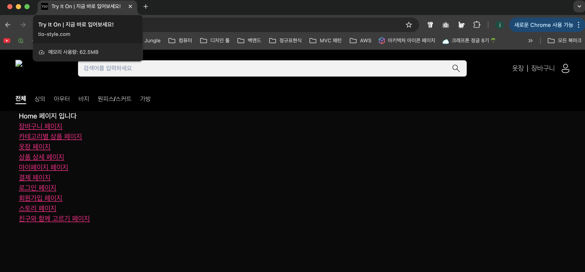

# 사이트 접속 성공 후 트러블슈팅(API연결, 이미지처리 / 완료)



접속이 되었다. 근데 Google OAuth 후 회원가입 진행중


콘솔창을 들여다보면 network 헤더에 request URL이 우리 ALB의 DNS인것을 알 수 있다.


## **문제 1: 백엔드 API 연결 실패 (`net::ERR_CONNECTION_REFUSED`)**

이것이 가장 먼저 해결해야 할 심각한 문제

- **현상:** 프론트엔드에서 `/api/auth/google/login` 등 백엔드 API를 호출하면, 브라우저가 "연결이 거부되었습니다"라는 오류를 뱉어냄
    
    
    
- **정확한 원인:** 이 에러는 프론트엔드가 **안전한 HTTPS 프로토콜**로 API 서버에 접속을 시도했지만, 우리의 로드 밸런서(ALB)는 현재 **안전하지 않은 HTTP(80번 포트) 요청만 받도록 설정**되어 있기 때문에 발생
    - 즉, 자물쇠가 없는 문에 열쇠를 사용하려 하니 문이 열리지 않는 것

### **해결책: ALB에 HTTPS 리스너 추가하기**

ALB가 HTTPS(443번 포트) 요청을 받아서 처리할 수 있도록 설정을 추가해야 합니다.


1. **AWS 관리 콘솔**에서 **EC2** > 왼쪽 메뉴의 **로드 밸런서(Load Balancers)**로 이동합니다.
2. 목록에서 `TIO-ALB`를 선택하고, 아래쪽의 **[리스너(Listeners)]** 탭을 클릭합니다.
3. **[리스너 추가(Add listener)]** 버튼을 클릭합니다.
4. *프로토콜(Protocol)**은 **`HTTPS`**, **포트(Port)**는 **`443`*을 선택합니다.
5. *기본 작업(Default action)**에서, 요청을 전달할 대상으로 기존의 Spring 대상 그룹(`TargetGroup-Spring-App`)을 선택합니다.
    
    
    
6. **보안 리스너 설정(Secure listener settings)** 섹션에서, **'기본 SSL/TLS 인증서'**에 이전에 ACM에서 발급받은 `.tryiton.com` 인증서를 선택합니다.
7. **[추가]** 버튼을 눌러 리스너 생성을 완료합니다.

이제 ALB는 안전한 HTTPS 요청을 받을 준비가 되었습니다.

## 문제 1-1 인증서가 보이지않음


HTTPS 설정을 위해서는 이전에 생성했던 인증서가 필요한데 보이지않음. 왜일까?

### 원인 : CloudFront의 인증서와 ALB를 위한 인증서는 별개 
/ 사실 우리 상황에서는잘못된 해결법이었음

**보이지 않는 이유** : AWS 정책상 CloudFront의 인증서는 us-east-1 리전에 생성해야함. ALB는 인증서와 로드밸런서가 같은 리전에 있어야한다 그래서 보이지않았던것.

- 현 상황
    - 인증서: us-east-1 (버지니아)
    - 로드밸런서: ap-northeast-2 (서울)

### 원인 탐색

1. CloudFront 미사용 : ALB 전용 인증서 재발급
2. CloudFront 사용 : CloudFront에서 HTTPS 처리하고, ALB는 HTTP만 사용
    
    
    
    ### **1. 사용자 ↔ CloudFront 구간: `HTTPS` 사용**
    
    - **역할:** 사용자의 웹 브라우저와 우리 서비스의 가장 바깥 관문인 CloudFront 사이의 통신
    - **왜 HTTPS를 써야 하는가?:**
        - **보안:** 이 구간은 인터넷을 통해 이루어지므로, 중간에 누군가 데이터를 가로챌 위험이 있습니다. HTTPS로 이 구간을 암호화하면, 사용자의 로그인 정보나 개인정보가 안전하게 보호
        - **신뢰성:** 브라우저에 표시되는 '자물쇠' 아이콘은 사용자에게 이 사이트가 안전하다는 신뢰를 줌
        - **SEO 및 최신 브라우저 정책:** 최신 브라우저들은 HTTPS를 사용하지 않는 사이트에 대해 '안전하지 않음' 경고를 표시하며, 검색 엔진 또한 HTTPS를 사용하는 사이트에 가산점을 줌
    - **설정 방법:** CloudFront 배포 설정의 **'뷰어 프로토콜 정책'**에서 **`Redirect HTTP to HTTPS`**를 선택하여 이 동작을 강제한다
        - CloudFront의 세부정보 > `동작` 으로 간다
            
            
            
        - 편집을 눌러 `뷰어 프로토콜 정책` 을 수정해준다 (문제없음)
            
            
            
    
    ### **2. CloudFront ↔ ALB 구간: `HTTP` 사용 (사실 이 부분이 문제)**
    
    - **역할:** 전 세계에 퍼져있는 CloudFront 엣지 로케이션과, 서울 리전의 우리 ALB 사이의 통신
    - **왜 HTTP를 써도 괜찮은가?:**
        - **안전한 AWS 백본망:** 이 통신은 일반적인 인터넷이 아닌, **보안 수준이 매우 높은 AWS의 전용 내부 네트워크(백본망)**를 통해 이루어진다. 따라서 중간에 데이터가 탈취될 위험이 거의 없다
        - **성능 및 비용:** SSL/TLS 암호화 및 복호화 과정에는 약간의 컴퓨팅 자원이 소모된다. 이 구간을 HTTP로 설정하면, ALB에서 SSL/TLS 처리를 위한 부담을 덜어주어 아주 미세하게나마 응답 속도를 높이고 비용을 절감할 수 있다고한다
        - **관리의 단순함:** SSL 인증서 관리를 CloudFront 한 곳으로 집중할 수 있다. `ALB에는 별도의 인증서를 설정할 필요가 없음`
        
        ### 현재 아키텍처
        
        - **CloudFront**: 정적 파일(S3)만 서빙
        - **ALB**: 별도로 존재하지만 CloudFront와 연결되지 않음
        
        ### API 요청이 ALB로 가지 않는 이유
        
        CloudFront에 `ALB Origin`이 설정되어 있지 않기 때문
        
        ### frontend-asset이 origin으로 되어있는 설정이랑 별개인가?  A: 완전히 별개임
        
        현재 CloudFront 설정:
        
        - **S3 Origin** (frontend-assets): 정적 파일 서빙용 (HTML, CSS, JS, 이미지 등)
        - **ALB Origin** (없음, 추가 필요): API 요청 처리용
        
        ### 일반적인 아키텍처
        
        ```bash
        사용자 → CloudFront → ┌─ S3 (정적 파일: /, /about, /product 등)
                            └─ ALB (API: /api/*, /auth/* 등)
        ```
        
        ### 현재 vs 필요한 설정
        
        현재 (S3만):
        • 모든 요청이 S3로 감
        • API 호출이 작동하지 않음
        
        필요한 설정 (S3 + ALB):
        • 정적 파일 요청 → S3
        • API 요청 → ALB
        
        ### CloudFront에서 두 Origin을 구분하는 방법
        
        Cache Behaviors로 경로별 라우팅:
        • Default (/*): S3 Origin
        • /api/*: ALB Origin
        
        • /auth/*: ALB Origin (필요시)
        

### 해결 방법

CloudFront에 ALB를 Origin으로 추가하고 API 경로(/api/*)에 대한 Cache Behavior를 설정해야 함:

### 1. ALB Origin 추가


새로생성할때 원본 도메인을 ALB로 골라주고, 프로토콜을 HTTP로 선택한 다음 생성한다

(나머지는 기본값)


이렇게 콘솔에 S3 외에도 ELB에 대한 원본 설정이 생겼다.

### 2. Cache Behavior 추가 (/api/* 경로를 ALB로 라우팅)

1. CloudFront 상세페이지의 동작 > 동작 생성 클릭
2. 경로 패턴에 /api/*를 선택해준다
    
    
    
3. 방금 만든 ALB 원본을 선택해준다
    
    
    
4. 허용된 HTTP 방법에 전부(GET, HEAD, OPTIONS, PUT, POST…) 선택한다
    
    
    
5. 캐시 키 및 원본 요청에서 캐시정책 / CachingDisabled를 선택해야 API는 캐싱하지 않는다
    
    
    
    
    
    아직도 안된다.
    
6. Origin Protocol Policy를 HTTP Only로 설정 (CloudFront → ALB는 HTTP 사용)

이렇게 설정하면:

- 정적 파일: CloudFront → S3
- API 요청: CloudFront → ALB (HTTP)
- 사용자: HTTPS로 CloudFront 접근

## 문제 1-2 여전히 같은 오류 발생

### 1. 환경변수 우선순위 문제

.env.local (localhost:8080) > .env.production (CloudFront 도메인)

- **로컬 개발**: .env.local의 localhost:8080 사용 ✅
• **프로덕션 빌드**: .env.local이 없어야 하는데 여전히 localhost:8080 참조 ❌

### 2. 실제 발생한 문제

- API 요청이 ALB 직접 호출: [tio-alb-173623777.ap-northeast-2.elb.amazonaws.com](http://tio-alb-173623777.ap-northeast-2.elb.amazonaws.com/)
• CloudFront 우회로 인한 CORS, SSL 인증서 문제
• ERR_CONNECTION_REFUSED 에러 발생

## 조치 방법

### 1. 환경별 분리

```bash
# 로컬 개발 (.env.local - git 제외)

NEXT_PUBLIC_API_URL=http://localhost:8080

# 프로덕션 (.env.production - git 포함)

NEXT_PUBLIC_API_URL=https://tio-style.com
```

### 2. GitHub Actions 환경변수 설정

```bash
- name: Build Next.js
env:
NEXT_PUBLIC_GOOGLE_CLIENT_ID: ${{ secrets.NEXT_PUBLIC_GOOGLE_CLIENT_ID }}
run: npm run build
```

### 3. 결과

- **로컬**: localhost:8080 → 백엔드 직접 연결
• **프로덕션**: [tio-style.com](http://tio-style.com/) → CloudFront → ALB 경로
• **보안**: 민감한 정보는 GitHub Secrets 관리

## 문제 1-3 (API Requst URL은 정상으로 넘어가는데..)


1-1, 1-2의 이슈는 해결되었다. 근데 새로운 문제가 발생했다


### 원인 (CORS)

```java
    @Bean
    public SecurityFilterChain filterChain(HttpSecurity http) throws Exception {

        // CORS 설정
        http.cors(cors -> cors.configurationSource(request -> {
            CorsConfiguration config = new CorsConfiguration();
            config.setAllowedOrigins(List.of("http://localhost:3000"),
            config.setAllowedMethods(List.of("GET", "POST", "PUT", "DELETE", "OPTIONS"));
            config.setAllowedHeaders(List.of("*"));
            config.setExposedHeaders(List.of("Authorization"));
            config.setAllowCredentials(true);
            return config;
        }));
```

보면 로컬 개발환경을 위해 [`localhost:3000`](http://localhost:3000) 에 대해서만 열려있다.

우리가 발급받은 도메인 `https://tio-style.com` 과, `https://www.tio-style.com` 으로 열어주면 된다.

```java
    @Bean
    public SecurityFilterChain filterChain(HttpSecurity http) throws Exception {

        // CORS 설정
        http.cors(cors -> cors.configurationSource(request -> {
            CorsConfiguration config = new CorsConfiguration();
            config.setAllowedOrigins(List.of(
                    "http://localhost:3000",
                    "https://tio-style.com",
                    "https://www.tio-style.com"));
            config.setAllowedMethods(List.of("GET", "POST", "PUT", "DELETE", "OPTIONS"));
            config.setAllowedHeaders(List.of("*"));
            config.setExposedHeaders(List.of("Authorization"));
            config.setAllowCredentials(true);
            return config;
        }));
```

### 안된다

### **1. 핵심 문제 해결: 헬스체크 실패 → 복구**

문제: 14:21 UTC부터 ALB 헬스체크가 계속 실패
• 모든 EC2 인스턴스가 unhealthy 상태
• Spring Boot 애플리케이션이 시작되지 않음
• 8080 포트에서 리스닝하지 않음

원인: tio/payments/toss AWS Secrets Manager 접근 실패
`Config data resource 'aws-secretsmanager:tio/payments/toss' does not exist`

해결책:

```java
application-dev.properties에서 제거
spring.config.import=aws-secretsmanager:tio/db/credentials,aws-secretsmanager:tio/oauth/google,aws-secretsmanager:tio/jwt,aws-secretsmanager:tio/mail
tio/payments/toss 제거
```

### **2. 추가 조치사항**

ALB 헬스체크 경로 변경:
• /actuator/health → / 로 변경
• 간단한 헬스체크 컨트롤러 추가

CORS 설정 개선:

```java
config.setAllowedOrigins(List.of(
"[http://localhost:3000](http://localhost:3000/)",
"[https://tio-style.com](https://tio-style.com/)",
"[https://www.tio-style.com](https://www.tio-style.com/)"));
```

### **3. 결과 확인**

✅ 성공한 것들:
• ALB 타겟 그룹: healthy 상태 복구
• 8080 포트 리스닝: 정상 동작
• Spring Boot 애플리케이션: 정상 시작
• API 연결: Network Error → 400 Bad Request (정상 처리)

## 🎉 현재 상태

이미지에서 확인된 것:
• ✅ Request URL이 올바른 도메인([tio-style.com](http://tio-style.com/))으로 요청
• ✅ CloudFront → ALB 라우팅 정상 동작
• ✅ 400 Bad Request는 비즈니스 로직 레벨 에러 (정상적인 API 처리)

---

## **문제 2: 이미지 및 정적 파일 로딩 실패 (`403 Forbidden`)**


- **현상:** 웹사이트에 접속했을 때, `/_next/image?...` 와 같은 경로의 이미지들이 로드되지 않고 "접근이 금지되었습니다"라는 403 에러가 발생
- **정확한 원인:** 이 문제는 **Next.js의 이미지 최적화 기능**과 **CloudFront의 캐시 정책**이 서로 맞지 않아서 발생
    - Next.js의 `<Image>` 컴포넌트는 `/_next/image?url=/images/logo.png&w=640&q=75` 와 같이, 이미지 경로 뒤에 크기(`w`)나 품질(`q`) 같은 **쿼리 파라미터**를 붙여서 요청한다
    - 하지만 CloudFront의 기본 캐시 설정은 이러한 쿼리 파라미터를 무시하고 오직 주소 경로만 보고 원본(S3)에 파일을 요청한다. 결과적으로 S3는 `/_next/image`라는 이름의 파일을 찾을 수 없어서 접근을 거부하고, 이 거부 응답이 캐싱되어 모든 이미지 요청이 403 에러를 뱉는 것

### **해결책: CloudFront 캐시 및 원본 요청 정책 수정하기**

CloudFront가 Next.js의 쿼리 파라미터를 올바르게 처리하도록 정책을 수정해야 합니다.

1. **CloudFront 콘솔** > 왼쪽 메뉴의 **정책(Policies)**으로 이동합니다.
2. **'캐시(Cache)'** 탭을 선택하고 **[캐시 정책 생성]**을 클릭합니다.
    - **이름:** `NextJS-Image-Optimized`
    - **캐시 키 설정(Cache key settings):**
        - **헤더:** `포함 안 함`
        - **쿠키:** `없음`
        - **쿼리 문자열:** **`모두`** 를 선택합니다.
    - 정책을 생성합니다.
3. 다시 왼쪽 메뉴의 **정책(Policies)** > **'원본 요청(Origin request)'** 탭을 선택하고 **[원본 요청 정책 생성]**을 클릭합니다.
    
    
    
    - **이름:** `NextJS-Image-Optimized`
    - **원본 요청 설정:**
        - **헤더:** **`모두 뷰어 헤더`** 선택
        - **쿼리 문자열:** **`모두`** 선택
        - **쿠키:** **`모두`** 선택
    - 정책을 생성합니다.
4. 마지막으로, **CloudFront 콘솔** > **배포(Distributions)**에서 프론트엔드용 배포를 선택하고 **[동작(Behaviors)]** 탭으로 이동합니다.
5. `_next/image*` 경로에 대한 새로운 동작을 생성하거나, 기본(`Default (*)`) 동작을 편집합니다.
    
    
    
6. **'캐시 정책(Cache policy)'** 드롭다운에서 방금 만든 **`NextJS-Image-Optimized`*를 선택합니다.
    
    
    
7. **'원본 요청 정책(Origin request policy)'** 드롭다운에서도 **`NextJS-Image-Optimized`*를 선택합니다.
    
    
    
8. **[변경 사항 저장]**을 클릭합니다. (적용까지 몇 분 소요)

## 문제 2-1 하라는대로 했는데..


나오던 페이지도 안나오기 시작한다.

### 원인 : 동작 > 기본값에 모든 복잡한 요청이 S3로 들어가게됨

CloudFront의 Default Behavior(아까 수정한 `기본값(*)`)에 NextJS-Image-Optimized 정책이 적용되어 있어서:

- 모든 파일 요청(CSS, JS, 이미지 등)에 복잡한 쿼리 파라미터와 헤더가 추가됨
- S3는 이런 복잡한 요청을 처리할 수 없어서 404 에러 발생

### 해결 방법

CloudFront 콘솔에서:

1. Default Behavior 수정 `(원상복구)`
• Cache Policy: Managed-CachingOptimized로 변경
• Origin Request Policy: 제거
2. 새 Cache Behavior 추가
• Path Pattern: _next/image*
• Cache Policy: NextJS-Image-Optimized
• Origin Request Policy: NextJS-Image-Optimized


`_next/image/*`을 수동 입력

원본 그룹은 S3를 선택해준다


이미지만 받을거니까 GET, HEAD만 선택

## 문제 2-2 아직도? (403 Forbidden)


이젠 403에러다. 403 에러는 S3 Origin Access Control (OAC) 권한 문제라고한다.

Next.js 이미지 최적화 요청이 S3에 직접 접근하려 할 때 발생.

## 🔍 문제 상황

### **요청 경로:**

/_next/image?url=%2Fimages%2Fex10.png&w=640&q=75

### **실제 처리 과정:**

1. Next.js 이미지 최적화 요청 → CloudFront
2. CloudFront → S3 (OAC로 보호됨)
3. S3가 403 Forbidden 응답 (권한 없음)

## 🛠️ 해결 방법

### **1. S3 버킷 정책 확인 및 수정**

```json

[{
    "AllowedHeaders": [
        "*"
    ],
    "AllowedMethods": [
        "GET",
        "PUT",
        "POST",
        "DELETE",
        "HEAD"
    ],
    "AllowedOrigins": [
        "http://localhost:3000",
        "https://tio-style.com",
        "https://www.tio-style.com"
    ],
    "ExposeHeaders": [
        "ETag"
    ],
    "MaxAgeSeconds": 3000
}]

```

해당 버킷에 가서 위의 정책을 인라인정책으로 넣어준다.

## 근본적인 원인 : Nextjs 이미지최적화

### 1. Next.js Image Optimization 작동 방식

```json
jsx
<Image src="/images/ex10.png" width={300} height={400} />
```

Next.js는 이 이미지를 자동으로 최적화하기 위해:

1. /_next/image API 엔드포인트로 요청
2. 서버에서 이미지 리사이징, 포맷 변환 등 처리
3. 최적화된 이미지 반환

### 2. 현재 아키텍처에서의 문제

```json
브라우저 → CloudFront → S3 (정적 파일만)
                    → ALB (API만)
```

문제: /_next/image 요청이 S3로 라우팅되고 있음
• S3에는 정적 파일만 있음
• Next.js 이미지 최적화 서버가 없음
• 따라서 403 Forbidden 발생

## 해결

### 옵션 1: 이미지 최적화 비활성화 (권장)

next.config.js 파일 수정:

```json
/** @type {import('next').NextConfig} */
const nextConfig = {
	output: 'export',
	trailingSlash: true,
	images: {
		unoptimized: true  // 이미지 최적화 비활성화
	}
}
module.exports = nextConfig
```

### 옵션 2: CloudFront Cache Behavior 추가

/_next/image/* 경로를 별도 처리하도록 설정했지만, 현재 정적 배포 환경에서는 해당안됨.

이미지 최적화 비활성화 했더니, 보이지 않던 마크 페이지가 보인다

