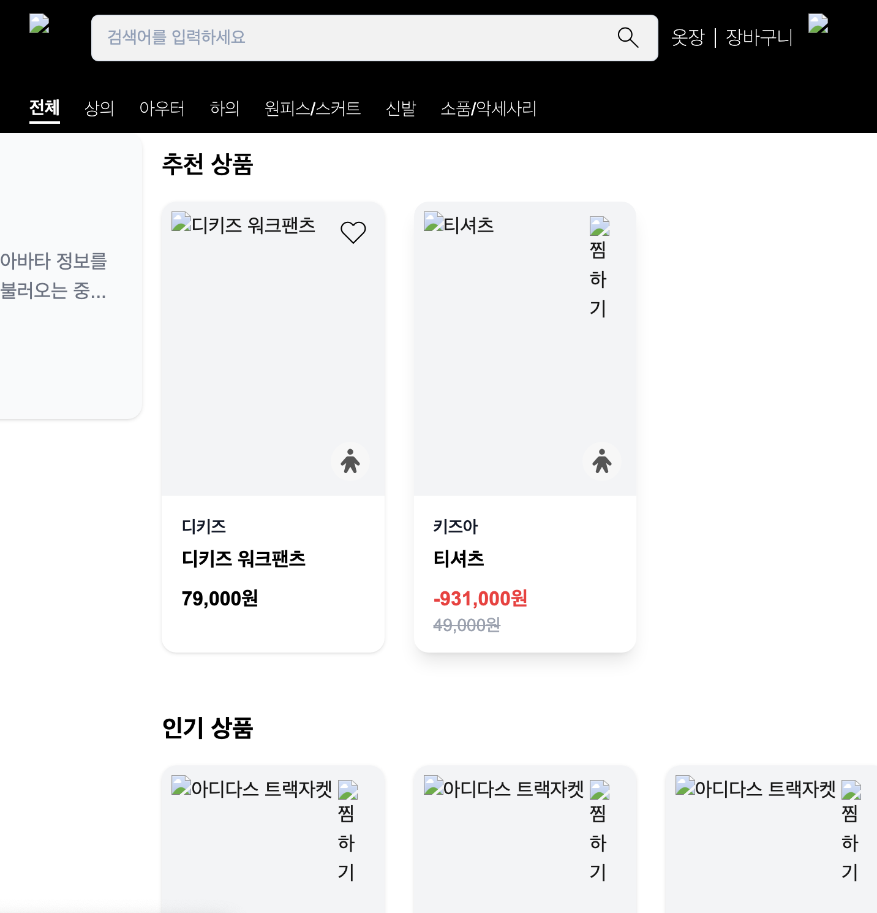

# 이미지 로드 실패 (next.js image optimization + CloudFront 라우팅)

CSS가 깨지고, html `404 not found` 와의 사투를 끝내고 나를 맞이하는건 텅 빈 이미지였다.




이미 일전에 한번 겪었던 이슈인데, 원인 자체는 `next.js의 이미지 최적화 기능` 에 있었다. 전에는 임시방편으로 `next.config.ts`에서 이미지 최적화를 꺼놓고 작업을 했는데. 켜놓은 탓에 발생한 것으로 보인다.

```json
const nextConfig: NextConfig = {
	images: {
		unoptimized: true // 이 부분이 true로 되어있으면 최적화를 끄는것이다.
	}
}
```

해당 설정은 위와 같이 비활성화 할 수 있다.

next.js의 이미지 최적화는 어플리케이션이 돌아가는 서버에서 이미지를 받아 최적화를 진행해 준 후 유저의 클라이언트로 반환해줘야하는데, 

기존의 S3 기반 정적페이지에서는 애초에 최적화를 해 줄 어플리케이션이 없었기 때문에 비활성화를 해두었던 것이고 그 설정이 지금까지 남아서 문제가 발생한 것이다.

### 기존 흐름

```json
브라우저 → CloudFront → S3 → S3 링크 이미지 반환
```

서버가 없었던 상황 + 최적화 옵션 off 상태에서는 문제가 안되었지만 EC2가 생긴 지금에는

```json
브라우저 → CloudFront → ALB → EC2 (Next.js) - 이미지 처리시도(안들어옴) → 400 Bad Request
												  → S3 이미지링크 
```

이렇게 오류를 뱉으며 이미지가 제대로 나오지 않는 것이다.

S3는 단순 파일 저장소이므로:

- 이미지 리사이징 불가능
- 포맷 변환 불가능
- 동적 처리 불가능
- /_next/image API 엔드포인트 존재하지 않음

### **Next.js가 이미지를 찾는 순서**

1. 로컬 public 폴더: /var/www/tryiton-frontend`/public/images/dummy/ex10.png`
2. 원격 이미지: next.config.ts의 remotePatterns 설정 확인
3. 찾지 못하면: `400 Bad Request`

### 해결책 CloudFront 동작 수정

AWS 콘솔에서:

1. CloudFront → Distribution EOOGBPUYRN1V5
2. Behaviors 탭
3. /_next/image/* 선택 → Edit
4. Origin and origin groups 변경:
• **현재**: [tio-frontend-assets-jungle8th.s3.ap-northeast-2.amazonaws.com](http://tio-frontend-assets-jungle8th.s3.ap-northeast-2.amazonaws.com/)
• **변경**: [tio-alb-173623777.ap-northeast-2.elb.amazonaws.com](http://tio-alb-173623777.ap-northeast-2.elb.amazonaws.com/)
5. Save changes

이렇게되면 처리되는 흐름이

```bash
브라우저 → CloudFront → ALB → EC2 (Next.js 서버)
                              ↓
                        이미지 최적화 처리
                              ↓
                        최적화된 이미지 반환
```

## but 이미지 자체가 EC2에 있어야함

### **현재 상황:**

EC2: /public/images/ → 파일 없음 ❌
S3: tio-image-storage-jungle8th → 실제 이미지들 존재 ✅

## + 설계 의도 차이

### **설계 의도 vs 실제 구현**

설계 의도:
• **정적 파일**: tio-frontend-assets-jungle8th (CSS, JS)
• **이미지 파일**: tio-image-storage-jungle8th (업로드된 이미지)
• **로컬 이미지**: /public/images/ (아이콘, 로고 등)y

실제 문제:

1. 로컬 이미지들(/images/common/avatar.svg)이 CloudFront에서 S3로 라우팅됨
2. S3에는 images/ 폴더가 없음 (업로드된 제품 이미지만 products/에 존재)
3. Next.js Image Optimization도 S3에 없는 이미지를 처리하려 해서 400 에러

## 🛠️ 해결 방법

### **이미지 파일(로컬)들을 EC2로 복사**

```bash
# EC2 서버에서 실행

cd /var/www/tryiton-frontend

# public/images 디렉토리 생성

mkdir -p public/images/dummy
mkdir -p public/images/common

# S3에서 이미지 파일들 다운로드

aws s3 cp s3://tio-frontend-assets-jungle8th/images/ --recursive
```

### **CloudFront에서 이미지 라우팅 추가**

AWS 콘솔에서:

1. CloudFront → Behaviors
2. Create behavior
3. Path pattern: /images/*
4. Origin: [tio-frontend-assets-jungle8th.s3.ap-northeast-2.amazonaws.com](http://tio-image-storage-jungle8th.s3.ap-northeast-2.amazonaws.com/)
5. Save

## 해결은 되었지만?


이젠 백엔드에서 처리가 안된다.

[ALB 라우팅 규칙 때문에 API가 안 되던 이야기](ALB%20라우팅%20규칙%20때문에%20API가%20안%20되던%20이야기%20229e0d05437c80ce836ff6aa51803419.md)