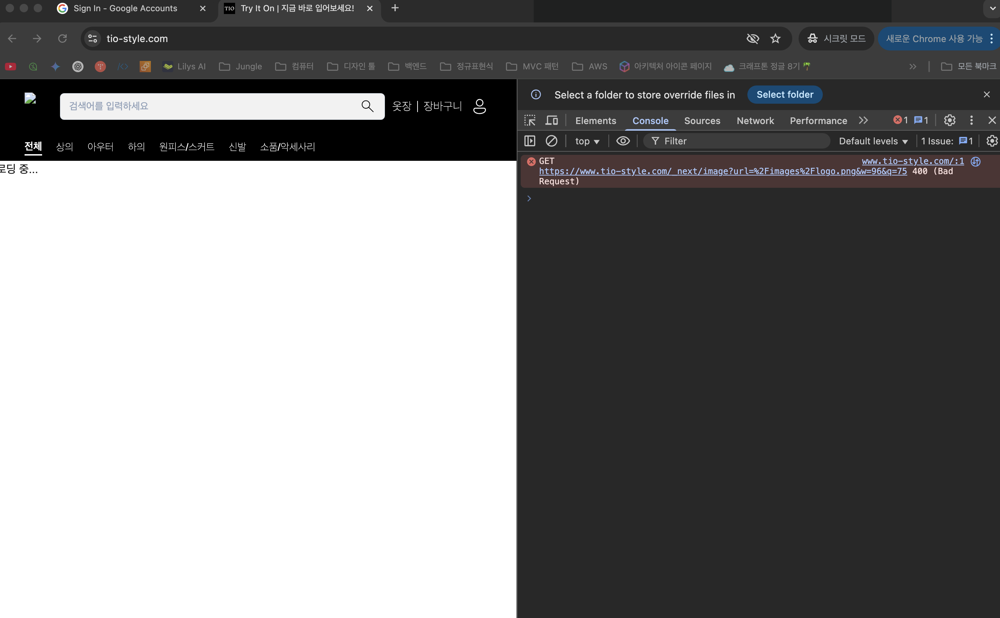

# 이미지 로딩 문제 (Next.js 이미지 최적화 문제 + CloudFront 캐시 무효화)



## 문제의 시작: "이미지가 왜 안 나와?"

S3 버킷 리전을 `us-east-1`에서 `ap-northeast-2`로 옮기면서 DB의 모든 이미지 URL을 업데이트했었다. 이제 올바른 S3 URL이 되었다. 하지만 웹사이트에서는 오히려 아무런 반응도 없다. 에러도, 나와야 할 이미지도.. 그저 빈 공간 뿐이었다.

```sql
-- 이런 식으로 URL을 전부 바꿨다
UPDATE products SET image_url = REPLACE(image_url, 'us-east-1', 'ap-northeast-2');

```

URL은 완벽하게 바뀌었다:

```
Before: <https://tio-image-storage-jungle8th.s3.us-east-1.amazonaws.com/products/2007/img1.jpg>
After:  <https://tio-image-storage-jungle8th.s3.ap-northeast-2.amazonaws.com/products/2007/img1.jpg>

```

그런데 왜 이미지가 안 나오지? 에러도 없고, 그냥 빈 공간만 있을 뿐이다. 뭔가 이상하다...

## 🕵️ 탐정 모드 ON: 단계별 디버깅

### 1단계: S3 직접 접근해보기

일단 가장 기본부터 확인해보자. S3에 이미지가 제대로 있는지 직접 접근해봤다.

```bash
curl -I <https://tio-image-storage-jungle8th.s3.ap-northeast-2.amazonaws.com/products/2007/img1.jpg>

```

```
HTTP/1.1 200 OK
Content-Type: image/jpeg
Content-Length: 8023
Server: AmazonS3
ETag: "d41d8cd98f00b204e9800998ecf8427e"

```

오케이, S3는 멀쩡하다. ✅

### 2단계: 브라우저 개발자 도구 뜯어보기

그럼 브라우저에서 뭔 일이 일어나고 있는지 확인해보자. 개발자 도구를 열어보니... 어라?

```
Request URL: <https://www.tio-style.com/_next/image?url=https%3A%2F%2Ftio-image-storage-jungle8th.s3.ap-northeast-2.amazonaws.com%2Fproducts%2F5222%2Fimg1.jpg&w=1920&q=75>
Status Code: 400 Bad Request
x-cache: Error from cloudfront

```

아하! 문제를 찾았다. Next.js의 이미지 최적화 API인 `/_next/image`에서 400 에러가 나고 있었다. 그리고 `x-cache: Error from cloudfront`라는 헤더를 보니 CloudFront에서 뭔가 잘못되고 있다.

### 3단계: ALB 직접 때려보기

혹시 CloudFront가 문제인가? ALB에 직접 접근해보자.

```bash
curl -I "<http://TIO-ALB-173623777.ap-northeast-2.elb.amazonaws.com/_next/image?url=https%3A%2F%2Ftio-image-storage-jungle8th.s3.ap-northeast-2.amazonaws.com%2Fproducts%2F2007%2Fimg1.jpg&w=1920&q=75>"

```

```
HTTP/1.1 200 OK
Content-Type: image/jpeg
Content-Length: 6093
X-Nextjs-Cache: MISS
Cache-Control: public, max-age=60

```

어? ALB 직접 접근은 성공한다! 🤔

이제 문제가 명확해졌다:

- S3 직접 접근: ✅ 성공
- ALB 직접 접근: ✅ 성공
- CloudFront 경유: ❌ 실패

결론: CloudFront에서 `/_next/image/*` 요청이 제대로 ALB로 라우팅되지 않고 있다.

## 🤦‍♂️ 첫 번째 삽질: CloudFront 설정 뜯어고치기

"아, CloudFront 설정 문제구나!" 하고 성급하게 결론을 내렸다. 그래서 CloudFront 설정을 뜯어보기 시작했다.

### CloudFront 현재 상태 파악

```bash
aws cloudfront list-distributions

```

현재 CloudFront에는 이런 Origin들이 있었다:

1. `tio-frontend-assets-jungle8th.s3` (정적 파일용)
2. `tio-alb-173623777.ap-northeast-2.elb.amazonaws.com` (API/SSR용)

그런데 잠깐, 이미지 스토리지 S3 버킷(`tio-image-storage-jungle8th`)에 대한 Origin이 없다!

"이거다!" 하고 생각했다. `/results/*` 경로의 이미지들은 `tio-image-storage-jungle8th` S3 버킷에 있는데, 이 버킷을 CloudFront Origin으로 추가하지 않았으니까 당연히 안 되는 거 아닌가?

### 새로운 Origin과 Behavior 추가

열심히 CloudFront 설정을 수정했다:

```json
{
  "Origins": {
    "Quantity": 3,
    "Items": [
      // 기존 Origins...
      {
        "Id": "tio-image-storage-jungle8th.s3.ap-northeast-2.amazonaws.com",
        "DomainName": "tio-image-storage-jungle8th.s3.ap-northeast-2.amazonaws.com",
        "S3OriginConfig": {
          "OriginAccessIdentity": ""
        },
        "OriginAccessControlId": "ESHQ21WXTV2D2"
      }
    ]
  },
  "CacheBehaviors": {
    "Items": [
      // 기존 Behaviors...
      {
        "PathPattern": "/results/*",
        "TargetOriginId": "tio-image-storage-jungle8th.s3.ap-northeast-2.amazonaws.com",
        "ViewerProtocolPolicy": "redirect-to-https"
      }
    ]
  }
}

```

설정을 업데이트하고 기다렸다. CloudFront 배포는 보통 5-15분 걸린다.

### 캐시 무효화도 해보자

혹시 몰라서 캐시 무효화도 실행했다:

```bash
aws cloudfront create-invalidation \\
  --distribution-id EOOGBPUYRN1V5 \\
  --paths "/_next/image/*"

```

15분 후... 여전히 400 에러다. 뭐지?

## 💡 진짜 문제 발견: "아, 이거였구나!"

한참을 삽질하다가 문득 깨달았다. 내가 근본적인 걸 놓치고 있었다.

### Next.js 이미지 최적화의 동작 원리

Next.js의 `<Image>` 컴포넌트는 이렇게 동작한다:

1. `<Image src="..." />` 렌더링
2. 브라우저에서 `/_next/image?url=...&w=1920&q=75` 요청
3. **Next.js 서버**에서 원본 이미지를 가져와서 최적화
4. 최적화된 이미지 반환

여기서 핵심은 **3번**이다. 이미지 최적화는 **Next.js 서버**에서 처리해야 한다!

### 우리 아키텍처의 실제 모습

우리는 하이브리드 배포를 하고 있다:

```
브라우저 → CloudFront → ALB → Next.js 서버 (TIO-Frontend-SSR)
                            ↘ Spring Boot 서버 (API)

```

실제로는 Next.js 서버가 있었다! 그럼 이미지 최적화가 작동해야 하는데...

### next.config.ts 확인해보니...

```tsx
// next.config.ts
const nextConfig: NextConfig = {
  images: {
    // unoptimized: true, // 이게 주석 처리되어 있었다!
    remotePatterns: [
      {
        protocol: "https",
        hostname: "tio-image-storage-jungle8th.s3.ap-northeast-2.amazonaws.com",
      },
      {
        protocol: "https",
        hostname: "**", // 이것도 보안상 문제
      },
    ],
  },
};

```

바로 이거였다! `unoptimized: true`가 주석 처리되어 있어서 Next.js가 이미지 최적화를 시도하고 있었는데, 뭔가 제대로 작동하지 않고 있었던 것이다.

## 🛠️ 진짜 해결책: 설정 수정

### 1. 이미지 최적화 비활성화

```tsx
// next.config.ts
const nextConfig: NextConfig = {
  images: {
    unoptimized: true, // 이미지 최적화 비활성화
    remotePatterns: [
      {
        protocol: "https",
        hostname: "tio-image-storage-jungle8th.s3.ap-northeast-2.amazonaws.com",
      },
      // "**" 제거 (보안상 위험)
    ],
  },
};

```

### 2. 보안 개선

`hostname: "**"`는 모든 도메인을 허용하는 설정이라 보안상 위험하다. 필요한 도메인만 명시적으로 추가했다.

### 3. 테스트

설정을 바꾸고 다시 테스트해보니...

```bash
# Before
curl -I "<https://www.tio-style.com/_next/image?url=>..."
# HTTP/2 400 Bad Request

# After
# 이제 _next/image 요청 자체가 생성되지 않음!
# 대신 S3 URL로 직접 요청됨
curl -I "<https://tio-image-storage-jungle8th.s3.ap-northeast-2.amazonaws.com/products/2007/img1.jpg>"
# HTTP/1.1 200 OK ✅

```

성공! 🎉

## 🤔 왜 이런 일이 생겼을까?

### 하이브리드 배포의 함정

우리는 하이브리드 배포를 하고 있다:

- **정적 파일**: S3에서 직접 서빙
- **API**: Spring Boot 서버
- **SSR**: Next.js 서버

Next.js 서버가 있긴 하지만, 이미지 최적화 기능이 제대로 작동하지 않는 상황이었다. 원인은 명확하지 않지만, 서버 설정이나 버전 호환성 문제일 가능성이 높다.

### 설정 파일의 주석도 중요하다

```tsx
// 이 한 줄의 주석이 모든 문제의 원인이었다
// unoptimized: true,

```

주석 하나 때문에 몇 시간을 삽질했다. 설정 파일의 주석도 신중하게 관리해야겠다.

### CloudFront 설정은 무죄였다

처음에 CloudFront 설정을 의심하고 한참 뜯어고쳤는데, 사실 CloudFront는 아무 문제가 없었다. 오히려 `/results/*` Origin을 추가한 건 나중에 도움이 될 것 같긴 하다.

## 🚀 성능 최적화: 이제 뭘 해야 할까?

`unoptimized: true`로 문제는 해결했지만, 이미지 최적화를 포기한 건 아쉽다. 성능을 위해 몇 가지 방안을 고려해볼 수 있다.

### 방안 1: S3에서 미리 최적화된 이미지 제공

```bash
# 이미지 업로드 시 여러 크기로 미리 생성
original.jpg
original_400.jpg
original_800.jpg
original_1200.jpg
original_1920.jpg

```

프론트엔드에서는 화면 크기에 맞는 이미지를 선택해서 로드한다:

```tsx
function ResponsiveImage({ src, alt }) {
  const getSrcSet = (baseSrc) => {
    const base = baseSrc.replace('.jpg', '');
    return `
      ${base}_400.jpg 400w,
      ${base}_800.jpg 800w,
      ${base}_1200.jpg 1200w,
      ${base}_1920.jpg 1920w
    `;
  };

  return (
    
  );
}

```

### 방안 2: CloudFront Functions로 이미지 최적화

CloudFront Functions를 사용해서 실시간으로 이미지를 최적화할 수도 있다:

```jsx
function handler(event) {
  var request = event.request;
  var uri = request.uri;

  // 이미지 요청에 크기 파라미터 추가
  if (uri.match(/\\.(jpg|jpeg|png|webp)$/i)) {
    var querystring = request.querystring;

    if (querystring.w) {
      // 최적화된 버전으로 리다이렉트
      request.uri = `/optimized${uri}?w=${querystring.w.value}`;
    }
  }

  return request;
}

```

### 방안 3: 별도의 이미지 최적화 서비스

AWS Lambda나 별도 서버로 이미지 최적화 API를 만들 수도 있다:

```tsx
// 커스텀 이미지 로더
export default function customLoader({ src, width, quality }) {
  return `https://image-optimizer.tio-style.com/optimize?url=${encodeURIComponent(src)}&w=${width}&q=${quality || 75}`;
}

// next.config.ts
images: {
  loader: 'custom',
  loaderFile: './src/lib/customLoader.ts'
}

```

### 방안 4: 점진적 로딩 최적화

일단 현재 상태에서도 성능을 개선할 수 있는 방법들:

```tsx
// 이미지 지연 로딩


// 중요한 이미지는 미리 로드
<link rel="preload" as="image" href="/hero-image.jpg" />

// WebP 포맷 지원
function OptimizedImage({ src, alt }) {
  const webpSrc = src.replace(/\\.(jpg|jpeg|png)$/, '.webp');

  return (
    <picture>
      <source srcSet={webpSrc} type="image/webp" />
      
    </picture>
  );
}

```

## 📊 성능 모니터링도 잊지 말자

이미지 로딩 성능을 측정해서 개선 효과를 확인해보자:

```tsx
function ImageWithMetrics({ src, ...props }) {
  useEffect(() => {
    const img = new Image();
    const startTime = performance.now();

    img.onload = () => {
      const loadTime = performance.now() - startTime;
      console.log(`Image loaded in ${loadTime}ms: ${src}`);

      // Google Analytics로 성능 데이터 전송
      if (typeof gtag !== 'undefined') {
        gtag('event', 'image_load_time', {
          custom_parameter: loadTime,
          image_src: src
        });
      }
    };

    img.onerror = () => {
      console.error(`Failed to load image: ${src}`);

      gtag('event', 'image_load_error', {
        image_src: src
      });
    };

    img.src = src;
  }, [src]);

  return ;
}

```

## 🎯 핵심 교훈들

### 1. 아키텍처를 제대로 이해하자

Next.js의 이미지 최적화는 **서버 사이드 기능**이다. 서버가 있어도 제대로 작동하지 않을 수 있다는 걸 배웠다.

### 2. 문제의 근본 원인을 찾자

처음에는 CloudFront 설정 문제라고 생각해서 한참 헤맸다. 하지만 진짜 문제는 Next.js 설정에 있었다. 증상만 보고 성급하게 결론을 내리지 말고, 단계별로 차근차근 디버깅하는 게 중요하다.

### 3. 설정 파일의 모든 줄이 중요하다

```tsx
// 이 한 줄이 모든 걸 바꿨다
unoptimized: true,

```

주석 처리된 설정도 신중하게 관리해야 한다. 특히 팀 프로젝트에서는 왜 주석 처리했는지 이유도 남겨두자.

### 4. 하이브리드 배포의 복잡성

여러 서비스가 연결된 환경에서는 한 곳의 변경이 다른 곳에 예상치 못한 영향을 줄 수 있다:

- S3 URL 변경 → DB 수정 필요
- CloudFront 설정 변경 → 캐시 무효화 필요
- Next.js 설정 변경 → 빌드 및 배포 필요

### 5. 단계별 테스트의 중요성

문제가 어디서 발생하는지 정확히 파악하려면:

1. **원본 데이터 확인** (S3 직접 접근)
2. **서버 로직 확인** (ALB 직접 접근)
3. **인프라 설정 확인** (CloudFront 경유)

각 단계별로 테스트해보면 문제의 위치를 정확히 찾을 수 있다.

## 🏁 마무리

"이미지 URL은 맞는데 왜 안 나와?"라는 단순한 문제였지만, 해결 과정에서 많은 걸 배웠다.

특히 하이브리드 배포 환경에서는:

- **각 레이어별로 단계적 테스트가 필수다**
- **설정 변경 후에는 전체 플로우를 다시 확인하자**
- **문제 발생 시 임시 해결책도 준비해두자**

그리고 무엇보다, **주석 처리된 코드도 중요하다**는 걸 뼈저리게 느꼈다.

다음에는 이런 삽질을 하지 않도록... 아니, 어차피 또 다른 삽질을 하게 될 테니까, 그때도 이렇게 차근차근 디버깅해보자. 🤷‍♂️

---

*P.S. 이 글을 쓰는 동안에도 또 다른 버그가 발견되었다. 개발자의 삶은 끝이 없다...*