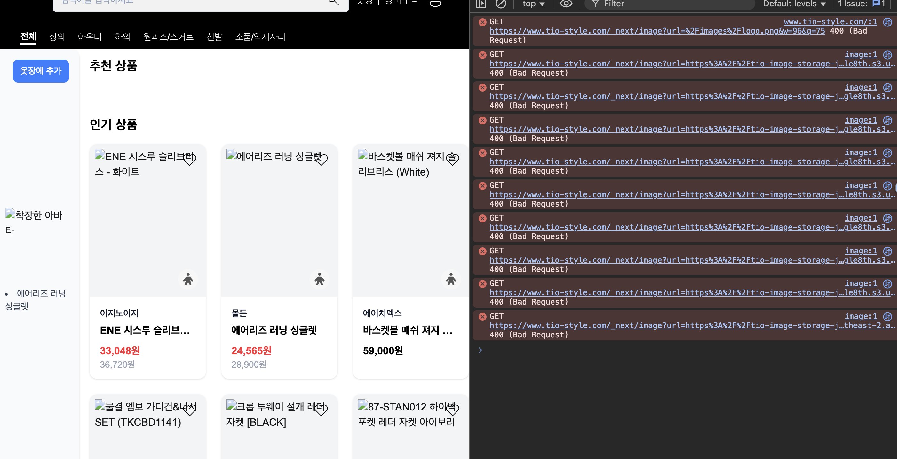
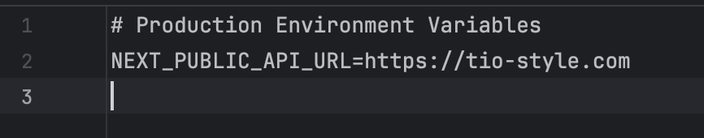

# 이미지 트러블슈팅 완전정복: S3 리전 오류, Mixed Content, Next.js 최적화

## 🚨 문제 상황 개요

CSS와 HTML 404 문제를 해결하고 나니, 이번엔 새로운 문제들이 나를 반겼다. 이미지 관련 문제들이 연쇄적으로 발생하면서 하루 종일 삽질을 하게 되었다.



주요 오류들:
- `/_next/image?url=...&w=1920&q=75` → 400 Bad Request
- `/api/home/products` → 404 Not Found  
- `/api/avatars/latest-info` → 404 Not Found
- Mixed Content 보안 오류

분명히 모든 설정을 다 했는데 왜 이런 일이 생기는 걸까? 시간 순서대로 문제들을 하나씩 해결해보자.

## 🔍 1단계: S3 리전 오류 문제

### 문제 발견

브라우저 개발자 도구를 보니 이런 요청이 실패하고 있었다:

```
/_next/image?url=https%3A%2F%2Ftio-image-storage-jungle8th.s3.us-east-1.amazonaws.com%2Fproducts%2F12697%2Fimg1.jpg&w=1920&q=75
```

URL을 디코딩해보니:
```
url=https://tio-image-storage-jungle8th.s3.us-east-1.amazonaws.com/products/12697/img1.jpg
```

어? S3 URL의 리전이 `us-east-1`이네?

### S3 버킷 실제 리전 확인


문제 발견! 실제 S3 버킷은 `ap-northeast-2`에 있는데, DB에 저장된 URL은 `us-east-1`로 되어 있었다.

### 올바른 리전으로 테스트

```bash
# 잘못된 리전 (실패)
curl -I https://tio-image-storage-jungle8th.s3.us-east-1.amazonaws.com/products/12697/img1.jpg
# → 404 Not Found

# 올바른 리전 (성공)
curl -I https://tio-image-storage-jungle8th.s3.ap-northeast-2.amazonaws.com/products/12697/img1.jpg
# → 200 OK
```

### DB 데이터 확인 및 수정

실제 DB를 확인해보니 모든 이미지 URL이 잘못된 리전으로 저장되어 있었다. 파이썬으로 자동화해서 마이그레이션 할 때 잘못된 경로로 생성되었나보다.

```sql
SELECT id, img1 FROM product LIMIT 3;
```

결과:
```
'2002' | 'https://tio-image-storage-jungle8th.s3.us-east-1.amazonaws.com/products/2002/img1.jpg'
'2003' | 'https://tio-image-storage-jungle8th.s3.us-east-1.amazonaws.com/products/2003/img1.jpg'
'2004' | 'https://tio-image-storage-jungle8th.s3.us-east-1.amazonaws.com/products/2004/img1.jpg'
```

### 해결 방법: DB 일괄 수정

```sql
UPDATE product 
SET 
    img1 = REPLACE(img1, 's3.us-east-1.amazonaws.com', 's3.ap-northeast-2.amazonaws.com'),
    img2 = REPLACE(img2, 's3.us-east-1.amazonaws.com', 's3.ap-northeast-2.amazonaws.com'),
    img3 = REPLACE(img3, 's3.us-east-1.amazonaws.com', 's3.ap-northeast-2.amazonaws.com'),
    img4 = REPLACE(img4, 's3.us-east-1.amazonaws.com', 's3.ap-northeast-2.amazonaws.com'),
    img5 = REPLACE(img5, 's3.us-east-1.amazonaws.com', 's3.ap-northeast-2.amazonaws.com')
WHERE 
    img1 LIKE '%s3.us-east-1.amazonaws.com%' 
    OR img2 LIKE '%s3.us-east-1.amazonaws.com%'
    OR img3 LIKE '%s3.us-east-1.amazonaws.com%'
    OR img4 LIKE '%s3.us-east-1.amazonaws.com%'
    OR img5 LIKE '%s3.us-east-1.amazonaws.com%';
```

## 🔒 2단계: Mixed Content 보안 오류

S3 URL을 수정했지만 여전히 이미지 업로드가 안 된다. 이번엔 다른 오류가 발생했다.


### Mixed Content란?

HTTPS 사이트(`https://www.tio-style.com`)에서 HTTP API 엔드포인트(`http://tio-alb-173623777.ap-northeast-2.elb.amazonaws.com`)로 요청을 보내려고 해서 브라우저가 차단하는 보안 정책이다.

### 문제 분석

현재 상황:
- 프론트엔드: HTTPS (CloudFront + SSL 인증서)
- 백엔드 API: HTTP (ALB 직접 호출)

브라우저는 보안상 HTTPS 페이지에서 HTTP 리소스 로드를 차단한다.

### 해결 방법들

#### 방법 1: ALB에 HTTPS 설정 (권장)

```bash
# AWS Certificate Manager에서 인증서 요청
aws acm request-certificate \
  --domain-name tio-alb-173623777.ap-northeast-2.elb.amazonaws.com \
  --validation-method DNS \
  --region ap-northeast-2
```

#### 방법 2: 코드에서 API URL 수정

현재 하드코딩된 HTTP URL을 HTTPS로 변경하거나 환경변수로 관리:

```javascript
// 현재
const API_BASE_URL = 'http://tio-alb-173623777.ap-northeast-2.elb.amazonaws.com';

// 수정 후
const API_BASE_URL = process.env.NEXT_PUBLIC_API_URL || 'https://api.tio-style.com';
```

#### 방법 3: Next.js 프록시 설정 (임시 해결책)

```javascript
// next.config.js
module.exports = {
  async rewrites() {
    return [
      {
        source: '/api/:path*',
        destination: 'http://tio-alb-173623777.ap-northeast-2.elb.amazonaws.com/api/:path*'
      }
    ]
  }
}
```

### 실제 원인: 환경변수 우선순위 문제

코드를 확인해보니 이미 올바르게 작성되어 있었다:
- ✅ `process.env.NEXT_PUBLIC_API_URL` 환경변수 사용
- ✅ `.env.production`에 `https://tio-style.com` 설정
- ✅ API 호출 시 baseURL 사용

하지만 브라우저 에러 메시지를 보면 여전히 `http://tio-alb-173623777.ap-northeast-2.elb.amazonaws.com`로 호출하고 있었다.



### Next.js 환경변수 우선순위

1. `.env.production.local` (가장 높음)
2. `.env.local` (**NODE_ENV에 관계없이 항상 로드됨**)
3. `.env.production`
4. `.env`

### 문제의 핵심

`.env.local`은 모든 환경에서 로드되기 때문에:
- 개발용 `NEXT_PUBLIC_API_URL=http://localhost:8080`이 설정되어 있음
- 프로덕션 빌드에서도 이 값이 우선적으로 사용됨
- `.env.production`의 `https://tio-style.com` 설정이 무시됨

추가로 `deploy.yml`에도 직접적인 ALB 주소가 사용되고 있었다:

```yaml
# .github/workflows/deploy.yml
- name: Build Next.js application
  env:
    NEXT_PUBLIC_API_URL: http://TIO-ALB-173623777.ap-northeast-2.elb.amazonaws.com  # 문제
```

### 해결 과정

1. **환경별 파일 분리**:
   - `.env.development` → 개발환경 전용 (`localhost:8080`)
   - `.env.production` → 프로덕션 전용 (`https://tio-style.com`)
   - `.env.local` → 공통 설정만 (API URL 제외, OAuth 설정만 유지)

2. **GitHub Actions 수정**:
   ```yaml
   # 수정 전
   NEXT_PUBLIC_API_URL: http://TIO-ALB-173623777.ap-northeast-2.elb.amazonaws.com
   
   # 수정 후  
   NEXT_PUBLIC_API_URL: https://www.tio-style.com
   ```

3. **빌드 결과 확인**:
   - 수정 전: `localhost:8080` 24개 포함
   - 수정 후: `localhost:8080` 3개로 감소, `tio-style.com` 21개로 증가

### 최종 해결책

```
올바른 환경변수 구조:
.env.local          # 공통 설정 (OAuth 등)
.env.development    # 개발: localhost:8080
.env.production     # 프로덕션: https://tio-style.com
```

## 🖼️ 3단계: Next.js 이미지 최적화 문제

Mixed Content 문제를 해결했지만, 여전히 이미지가 제대로 표시되지 않았다. 이번엔 Next.js 이미지 최적화 기능에서 문제가 발생했다.


### 문제의 시작

S3 버킷 리전을 `us-east-1`에서 `ap-northeast-2`로 옮기면서 DB의 모든 이미지 URL을 업데이트했다. 이제 올바른 S3 URL이 되었다. 하지만 웹사이트에서는 오히려 아무런 반응도 없다. 에러도, 나와야 할 이미지도.. 그저 빈 공간 뿐이었다.

```sql
-- 이런 식으로 URL을 전부 바꿨다
UPDATE products SET image_url = REPLACE(image_url, 'us-east-1', 'ap-northeast-2');
```

URL은 완벽하게 바뀌었다:
```
Before: https://tio-image-storage-jungle8th.s3.us-east-1.amazonaws.com/products/2007/img1.jpg
After:  https://tio-image-storage-jungle8th.s3.ap-northeast-2.amazonaws.com/products/2007/img1.jpg
```

그런데 왜 이미지가 안 나오지? 에러도 없고, 그냥 빈 공간만 있을 뿐이다.

### 단계별 디버깅

#### 1단계: S3 직접 접근해보기

```bash
curl -I https://tio-image-storage-jungle8th.s3.ap-northeast-2.amazonaws.com/products/2007/img1.jpg
```

```
HTTP/1.1 200 OK
Content-Type: image/jpeg
Content-Length: 8023
Server: AmazonS3
```

S3는 멀쩡하다. ✅

#### 2단계: 브라우저 개발자 도구 확인

```
Request URL: https://www.tio-style.com/_next/image?url=https%3A%2F%2Ftio-image-storage-jungle8th.s3.ap-northeast-2.amazonaws.com%2Fproducts%2F5222%2Fimg1.jpg&w=1920&q=75
Status Code: 400 Bad Request
x-cache: Error from cloudfront
```

문제 발견! Next.js의 이미지 최적화 API인 `/_next/image`에서 400 에러가 나고 있었다.

#### 3단계: ALB 직접 테스트

```bash
curl -I "http://TIO-ALB-173623777.ap-northeast-2.elb.amazonaws.com/_next/image?url=https%3A%2F%2Ftio-image-storage-jungle8th.s3.ap-northeast-2.amazonaws.com%2Fproducts%2F2007%2Fimg1.jpg&w=1920&q=75"
```

```
HTTP/1.1 200 OK
Content-Type: image/jpeg
Content-Length: 6093
X-Nextjs-Cache: MISS
Cache-Control: public, max-age=60
```

ALB 직접 접근은 성공한다! 🤔

결론:
- S3 직접 접근: ✅ 성공
- ALB 직접 접근: ✅ 성공  
- CloudFront 경유: ❌ 실패

### Next.js 이미지 최적화의 동작 원리

Next.js의 `<Image>` 컴포넌트는 이렇게 동작한다:

1. `<Image src="..." />` 렌더링
2. 브라우저에서 `/_next/image?url=...&w=1920&q=75` 요청
3. **Next.js 서버**에서 원본 이미지를 가져와서 최적화
4. 최적화된 이미지 반환

핵심은 **3번**이다. 이미지 최적화는 **Next.js 서버**에서 처리해야 한다!

### 진짜 문제 발견

`next.config.ts` 파일을 확인해보니:

```typescript
// next.config.ts
const nextConfig: NextConfig = {
  images: {
    // unoptimized: true, // 이게 주석 처리되어 있었다!
    remotePatterns: [
      {
        protocol: "https",
        hostname: "tio-image-storage-jungle8th.s3.ap-northeast-2.amazonaws.com",
      },
      {
        protocol: "https", 
        hostname: "**", // 이것도 보안상 문제
      },
    ],
  },
};
```

바로 이거였다! `unoptimized: true`가 주석 처리되어 있어서 Next.js가 이미지 최적화를 시도하고 있었는데, 뭔가 제대로 작동하지 않고 있었던 것이다.

### 해결책

#### 1. 이미지 최적화 비활성화

```typescript
// next.config.ts
const nextConfig: NextConfig = {
  images: {
    unoptimized: true, // 이미지 최적화 비활성화
    remotePatterns: [
      {
        protocol: "https",
        hostname: "tio-image-storage-jungle8th.s3.ap-northeast-2.amazonaws.com",
      },
      // "**" 제거 (보안상 위험)
    ],
  },
};
```

#### 2. 보안 개선

`hostname: "**"`는 모든 도메인을 허용하는 설정이라 보안상 위험하다. 필요한 도메인만 명시적으로 추가했다.

#### 3. 테스트 결과

```bash
# Before
curl -I "https://www.tio-style.com/_next/image?url=..."
# HTTP/2 400 Bad Request

# After  
# 이제 _next/image 요청 자체가 생성되지 않음!
# 대신 S3 URL로 직접 요청됨
curl -I "https://tio-image-storage-jungle8th.s3.ap-northeast-2.amazonaws.com/products/2007/img1.jpg"
# HTTP/1.1 200 OK ✅
```

성공! 🎉

## 💡 핵심 교훈들

### 1. 연쇄적 문제 해결의 중요성

하나의 문제(S3 리전 오류)를 해결하면 다른 문제(Mixed Content)가 나타나고, 그것을 해결하면 또 다른 문제(Next.js 최적화)가 나타났다. 각 문제를 단계별로 차근차근 해결하는 것이 중요하다.

### 2. 환경변수 우선순위 이해

Next.js 환경변수 로딩 순서:
1. `.env.production.local` (가장 높음)
2. `.env.local` (모든 환경에서 로드)
3. `.env.production`
4. `.env`

`.env.local`의 설정이 프로덕션 환경에서도 우선적으로 적용된다는 점을 놓치기 쉽다.

### 3. 설정 파일의 주석도 중요하다

```typescript
// 이 한 줄의 주석이 모든 문제의 원인이었다
// unoptimized: true,
```

주석 처리된 설정도 신중하게 관리해야 한다. 특히 팀 프로젝트에서는 왜 주석 처리했는지 이유도 남겨두자.

### 4. 단계별 테스트의 중요성

문제가 어디서 발생하는지 정확히 파악하려면:
1. **원본 데이터 확인** (S3 직접 접근)
2. **서버 로직 확인** (ALB 직접 접근)  
3. **인프라 설정 확인** (CloudFront 경유)

각 단계별로 테스트해보면 문제의 위치를 정확히 찾을 수 있다.

### 5. 하이브리드 배포의 복잡성

여러 서비스가 연결된 환경에서는 한 곳의 변경이 다른 곳에 예상치 못한 영향을 줄 수 있다:
- S3 URL 변경 → DB 수정 필요
- CloudFront 설정 변경 → 캐시 무효화 필요
- Next.js 설정 변경 → 빌드 및 배포 필요

## 🎯 최종 해결 상태

### ✅ S3 리전 오류 해결
- DB의 모든 이미지 URL을 올바른 리전(`ap-northeast-2`)으로 수정
- 이미지 파일들이 정상적으로 S3에서 로드됨

### ✅ Mixed Content 보안 오류 해결  
- 환경변수 우선순위 문제 해결
- 프로덕션 환경에서 HTTPS API URL 사용
- GitHub Actions 배포 스크립트 수정

### ✅ Next.js 이미지 최적화 문제 해결
- `unoptimized: true` 설정으로 이미지 최적화 비활성화
- 보안상 위험한 와일드카드 도메인 제거
- S3 이미지가 직접 로드되도록 수정

### ✅ 전체 시스템 안정화
- 이미지 로딩 성공
- API 통신 정상화
- 보안 정책 준수

## 📝 향후 개선 사항

1. **이미지 최적화 재도입**: S3에서 미리 최적화된 이미지 제공 또는 별도 최적화 서비스 구축
2. **모니터링 강화**: 이미지 로딩 성능 메트릭 추적
3. **캐싱 전략 개선**: CloudFront 캐싱 정책 최적화
4. **환경 관리**: 환경별 설정 파일 체계화

---

*"이미지 하나 띄우는 게 이렇게 복잡할 줄이야..." 하지만 이 과정에서 Next.js, CloudFront, 환경변수 관리에 대해 많은 것을 배웠다. 문제 해결 과정에서 얻은 경험이 앞으로 더 큰 도움이 될 것 같다.*
