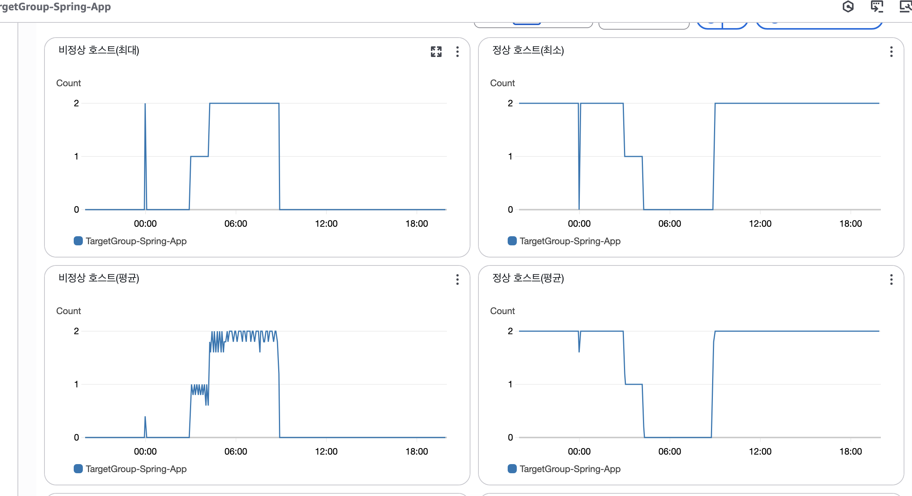

# 트러블슈팅) spring 서버 properties 꼬임(작성중)

## 📋 이슈 정리 및 해결 과정



새벽 3시부터 9시까지 총 6시간의 사투.. 기록을 전혀 못했기때문에 정확하게 모든 조치를 기입하진 못하고, 기억나는대로 적어본다.

## 🚨 발생한 주요 이슈

### 발단

- 프론트 개발을 위해 서버의 RDS를 온프레미스 환경의 MySQL에 SSM 포트포워딩을 통해 각 팀원에게 DB 정보를 가져온 채 작업을 할수있게 환경구성을 해주었었음
- 새벽 2~3시경 현아로부터 Spring 부팅속도가 느려지고, 가끔 끊긴다는 이슈를 접수함.

### SSM 설정 변경

- 느려지거나, 가끔 끊기긴 했었기 때문에 전혀 EC2의 문제라고 생각하지 않고, `properties` 파일의 설정 문제라고 생각하고 접근.
- 아래처럼 스프링을 실행하면, 특정 구간(`HikariPool-1 - Starting...`)에서 늦게 넘어가거나, 오류 메세지가 일부 나타났었다

```bash

  .   ____          _            __ _ _

 /\\ / ___'_ __ _ _(_)_ __  __ _ \ \ \ \

( ( )\___ | '_ | '_| | '_ \/ _` | \ \ \ \

 \\/  ___)| |_)| | | | | || (_| |  ) ) ) )

  '  |____| .__|_| |_|_| |_\__, | / / / /

 =========|_|==============|___/=/_/_/_/

 :: Spring Boot ::                (v3.5.3)

2025-07-02T04:49:55.206+09:00  INFO 92224 --- [core] [  restartedMain] com.tryiton.core.CoreApplication         : Starting CoreApplication using Java 17.0.12 with PID 92224 (/Users/ahpicl/Desktop/Jungle8/나만무/TryItOn-server-spring/build/classes/java/main started by ahpicl in /Users/ahpicl/Desktop/Jungle8/나만무/TryItOn-server-spring)

2025-07-02T04:49:55.208+09:00  INFO 92224 --- [core] [  restartedMain] com.tryiton.core.CoreApplication         : The following 1 profile is active: "local"

2025-07-02T04:49:55.233+09:00  INFO 92224 --- [core] [  restartedMain] o.s.b.devtools.restart.ChangeableUrls    : The Class-Path manifest attribute in /Users/ahpicl/.gradle/caches/modules-2/files-2.1/io.github.cdimascio/java-dotenv/5.2.2/f77d54ff193ed4b07415ab8d7b3d0550716aa8c/java-dotenv-5.2.2.jar referenced one or more files that do not exist: file:/Users/ahpicl/.gradle/caches/modules-2/files-2.1/io.github.cdimascio/java-dotenv/5.2.2/f77d54ff193ed4b07415ab8d7b3d0550716aa8c/kotlin-stdlib-1.4.0.jar,file:/Users/ahpicl/.gradle/caches/modules-2/files-2.1/io.github.cdimascio/java-dotenv/5.2.2/f77d54ff193ed4b07415ab8d7b3d0550716aa8c/kotlin-stdlib-common-1.4.0.jar,file:/Users/ahpicl/.gradle/caches/modules-2/files-2.1/io.github.cdimascio/java-dotenv/5.2.2/f77d54ff193ed4b07415ab8d7b3d0550716aa8c/annotations-13.0.jar

2025-07-02T04:49:55.233+09:00  INFO 92224 --- [core] [  restartedMain] .e.DevToolsPropertyDefaultsPostProcessor : Devtools property defaults active! Set 'spring.devtools.add-properties' to 'false' to disable

2025-07-02T04:49:55.233+09:00  INFO 92224 --- [core] [  restartedMain] .e.DevToolsPropertyDefaultsPostProcessor : For additional web related logging consider setting the 'logging.level.web' property to 'DEBUG'

2025-07-02T04:49:55.978+09:00  INFO 92224 --- [core] [  restartedMain] .s.d.r.c.RepositoryConfigurationDelegate : Bootstrapping Spring Data JPA repositories in DEFAULT mode.

2025-07-02T04:49:56.078+09:00  INFO 92224 --- [core] [  restartedMain] .s.d.r.c.RepositoryConfigurationDelegate : Finished Spring Data repository scanning in 93 ms. Found 14 JPA repository interfaces.

2025-07-02T04:49:56.434+09:00  INFO 92224 --- [core] [  restartedMain] o.s.b.w.embedded.tomcat.TomcatWebServer  : Tomcat initialized with port 8080 (http)

2025-07-02T04:49:56.442+09:00  INFO 92224 --- [core] [  restartedMain] o.apache.catalina.core.StandardService   : Starting service [Tomcat]

2025-07-02T04:49:56.442+09:00  INFO 92224 --- [core] [  restartedMain] o.apache.catalina.core.StandardEngine    : Starting Servlet engine: [Apache Tomcat/10.1.42]

2025-07-02T04:49:56.468+09:00  INFO 92224 --- [core] [  restartedMain] o.a.c.c.C.[Tomcat].[localhost].[/]       : Initializing Spring embedded WebApplicationContext

2025-07-02T04:49:56.468+09:00  INFO 92224 --- [core] [  restartedMain] w.s.c.ServletWebServerApplicationContext : Root WebApplicationContext: initialization completed in 1235 ms

Standard Commons Logging discovery in action with spring-jcl: please remove commons-logging.jar from classpath in order to avoid potential conflicts

2025-07-02T04:49:56.608+09:00  INFO 92224 --- [core] [  restartedMain] o.hibernate.jpa.internal.util.LogHelper  : HHH000204: Processing PersistenceUnitInfo [name: default]

2025-07-02T04:49:56.638+09:00  INFO 92224 --- [core] [  restartedMain] org.hibernate.Version                    : HHH000412: Hibernate ORM core version 6.6.18.Final

2025-07-02T04:49:56.664+09:00  INFO 92224 --- [core] [  restartedMain] o.h.c.internal.RegionFactoryInitiator    : HHH000026: Second-level cache disabled

2025-07-02T04:49:56.827+09:00  INFO 92224 --- [core] [  restartedMain] o.s.o.j.p.SpringPersistenceUnitInfo      : No LoadTimeWeaver setup: ignoring JPA class transformer

2025-07-02T04:49:56.843+09:00  INFO 92224 --- [core] [  restartedMain] com.zaxxer.hikari.HikariDataSource       : HikariPool-1 - Starting...

2025-07-02T04:49:57.906+09:00  WARN 92224 --- [core] [  restartedMain] o.h.engine.jdbc.spi.SqlExceptionHelper   : SQL Error: 0, SQLState: 08S01

2025-07-02T04:49:57.907+09:00 ERROR 92224 --- [core] [  restartedMain] o.h.engine.jdbc.spi.SqlExceptionHelper   : Communications link failure

The last packet sent successfully to the server was 0 milliseconds ago. The driver has not received any packets from the server.

2025-07-02T04:49:57.908+09:00  WARN 92224 --- [core] [  restartedMain] o.h.e.j.e.i.JdbcEnvironmentInitiator     : HHH000342: Could not obtain connection to query metadata

org.hibernate.exception.JDBCConnectionException: unable to obtain isolated JDBC connection [Communications link failure

The last packet sent successfully to the server was 0 milliseconds ago. The driver has not received any packets from the server.] [n/a]

at org.hibernate.exception.internal.SQLStateConversionDelegate.convert(SQLStateConversionDelegate.java:100) ~[hibernate-core-6.6.18.Final.jar:6.6.18.Final]

at org.hibernate.exception.internal.StandardSQLExceptionConverter.convert(StandardSQLExceptionConverter.java:58) ~[hibernate-core-6.6.18.Final.jar:6.6.18.Final]

at org.hibernate.engine.jdbc.spi.SqlExceptionHelper.convert(SqlExceptionHelper.java:108) ~[hibernate-core-6.6.18.Final.jar:6.6.18.Final]

at org.hibernate.engine.jdbc.spi.SqlExceptionHelper.convert(SqlExceptionHelper.java:94) ~[hibernate-core-6.6.18.Final.jar:6.6.18.Final]

at org.hibernate.resource.transaction.backend.jdbc.internal.JdbcIsolationDelegate.delegateWork(JdbcIsolationDelegate.java:116) ~[hibernate-core-6.6.18.Final.jar:6.6.18.Final]

at org.hibernate.engine.jdbc.env.internal.JdbcEnvironmentInitiator.getJdbcEnvironmentUsingJdbcMetadata(JdbcEnvironmentInitiator.java:336) ~[hibernate-core-6.6.18.Final.jar:6.6.18.Final]

at org.hibernate.engine.jdbc.env.internal.JdbcEnvironmentInitiator.initiateService(JdbcEnvironmentInitiator.java:129) ~[hibernate-core-6.6.18.Final.jar:6.6.18.Final]

at org.hibernate.engine.jdbc.env.internal.JdbcEnvironmentInitiator.initiateService(JdbcEnvironmentInitiator.java:81) ~[hibernate-core-6.6.18.Final.jar:6.6.18.Final]

at org.hibernate.boot.registry.internal.StandardServiceRegistryImpl.initiateService(StandardServiceRegistryImpl.java:130) ~[hibernate-core-6.6.18.Final.jar:6.6.18.Final]

at org.hibernate.service.internal.AbstractServiceRegistryImpl.createService(AbstractServiceRegistryImpl.java:263) ~[hibernate-core-6.6.18.Final.jar:6.6.18.Final]

at org.hibernate.service.internal.AbstractServiceRegistryImpl.initializeService(AbstractServiceRegistryImpl.java:238) ~[hibernate-core-6.6.18.Final.jar:6.6.18.Final]

at org.hibernate.service.internal.AbstractServiceRegistryImpl.getService(AbstractServiceRegistryImpl.java:215) ~[hibernate-core-6.6.18.Final.jar:6.6.18.Final]

at org.hibernate.boot.model.relational.Database.<init>(Database.java:45) ~[hibernate-core-6.6.18.Final.jar:6.6.18.Final]

at org.hibernate.boot.internal.InFlightMetadataCollectorImpl.getDatabase(InFlightMetadataCollectorImpl.java:226) ~[hibernate-core-6.6.18.Final.jar:6.6.18.Final]

at org.hibernate.boot.internal.InFlightMetadataCollectorImpl.<init>(InFlightMetadataCollectorImpl.java:194) ~[hibernate-core-6.6.18.Final.jar:6.6.18.Final]

at org.hibernate.boot.model.process.spi.MetadataBuildingProcess.complete(MetadataBuildingProcess.java:171) ~[hibernate-core-6.6.18.Final.jar:6.6.18.Final]

at org.hibernate.jpa.boot.internal.EntityManagerFactoryBuilderImpl.metadata(EntityManagerFactoryBuilderImpl.java:1442) ~[hibernate-core-6.6.18.Final.jar:6.6.18.Final]

at org.hibernate.jpa.boot.internal.EntityManagerFactoryBuilderImpl.build(EntityManagerFactoryBuilderImpl.java:1513) ~[hibernate-core-6.6.18.Final.jar:6.6.18.Final]

at org.springframework.orm.jpa.vendor.SpringHibernateJpaPersistenceProvider.createContainerEntityManagerFactory(SpringHibernateJpaPersistenceProvider.java:66) ~[spring-orm-6.2.8.jar:6.2.8]

at org.springframework.orm.jpa.LocalContainerEntityManagerFactoryBean.createNativeEntityManagerFactory(LocalContainerEntityManagerFactoryBean.java:390) ~[spring-orm-6.2.8.jar:6.2.8]

at org.springframework.orm.jpa.AbstractEntityManagerFactoryBean.buildNativeEntityManagerFactory(AbstractEntityManagerFactoryBean.java:419) ~[spring-orm-6.2.8.jar:6.2.8]

at org.springframework.orm.jpa.AbstractEntityManagerFactoryBean.afterPropertiesSet(AbstractEntityManagerFactoryBean.java:400) ~[spring-orm-6.2.8.jar:6.2.8]

at org.springframework.orm.jpa.LocalContainerEntityManagerFactoryBean.afterPropertiesSet(LocalContainerEntityManagerFactoryBean.java:366) ~[spring-orm-6.2.8.jar:6.2.8]

at org.springframework.beans.factory.support.AbstractAutowireCapableBeanFactory.invokeInitMethods(AbstractAutowireCapableBeanFactory.java:1873) ~[spring-beans-6.2.8.jar:6.2.8]

at org.springframework.beans.factory.support.AbstractAutowireCapableBeanFactory.initializeBean(AbstractAutowireCapableBeanFactory.java:1822) ~[spring-beans-6.2.8.jar:6.2.8]

at org.springframework.beans.factory.support.AbstractAutowireCapableBeanFactory.doCreateBean(AbstractAutowireCapableBeanFactory.java:607) ~[spring-beans-6.2.8.jar:6.2.8]

at org.springframework.beans.factory.support.AbstractAutowireCapableBeanFactory.createBean(AbstractAutowireCapableBeanFactory.java:529) ~[spring-beans-6.2.8.jar:6.2.8]

at org.springframework.beans.factory.support.AbstractBeanFactory.lambda$doGetBean$0(AbstractBeanFactory.java:339) ~[spring-beans-6.2.8.jar:6.2.8]

at org.springframework.beans.factory.support.DefaultSingletonBeanRegistry.getSingleton(DefaultSingletonBeanRegistry.java:373) ~[spring-beans-6.2.8.jar:6.2.8]

at org.springframework.beans.factory.support.AbstractBeanFactory.doGetBean(AbstractBeanFactory.java:337) ~[spring-beans-6.2.8.jar:6.2.8]

at org.springframework.beans.factory.support.AbstractBeanFactory.getBean(AbstractBeanFactory.java:207) ~[spring-beans-6.2.8.jar:6.2.8]

at org.springframework.context.support.AbstractApplicationContext.finishBeanFactoryInitialization(AbstractApplicationContext.java:970) ~[spring-context-6.2.8.jar:6.2.8]

at org.springframework.context.support.AbstractApplicationContext.refresh(AbstractApplicationContext.java:627) ~[spring-context-6.2.8.jar:6.2.8]

at org.springframework.boot.web.servlet.context.ServletWebServerApplicationContext.refresh(ServletWebServerApplicationContext.java:146) ~[spring-boot-3.5.3.jar:3.5.3]

at org.springframework.boot.SpringApplication.refresh(SpringApplication.java:752) ~[spring-boot-3.5.3.jar:3.5.3]

at org.springframework.boot.SpringApplication.refreshContext(SpringApplication.java:439) ~[spring-boot-3.5.3.jar:3.5.3]

at org.springframework.boot.SpringApplication.run(SpringApplication.java:318) ~[spring-boot-3.5.3.jar:3.5.3]

at org.springframework.boot.SpringApplication.run(SpringApplication.java:1361) ~[spring-boot-3.5.3.jar:3.5.3]

at org.springframework.boot.SpringApplication.run(SpringApplication.java:1350) ~[spring-boot-3.5.3.jar:3.5.3]

at com.tryiton.core.CoreApplication.main(CoreApplication.java:12) ~[main/:na]

at java.base/jdk.internal.reflect.NativeMethodAccessorImpl.invoke0(Native Method) ~[na:na]

at java.base/jdk.internal.reflect.NativeMethodAccessorImpl.invoke(NativeMethodAccessorImpl.java:77) ~[na:na]

at java.base/jdk.internal.reflect.DelegatingMethodAccessorImpl.invoke(DelegatingMethodAccessorImpl.java:43) ~[na:na]

at java.base/java.lang.reflect.Method.invoke(Method.java:569) ~[na:na]

at org.springframework.boot.devtools.restart.RestartLauncher.run(RestartLauncher.java:50) ~[spring-boot-devtools-3.5.3.jar:3.5.3]

Caused by: com.mysql.cj.jdbc.exceptions.CommunicationsException: Communications link failure

The last packet sent successfully to the server was 0 milliseconds ago. The driver has not received any packets from the server.

at com.mysql.cj.jdbc.exceptions.SQLError.createCommunicationsException(SQLError.java:165) ~[mysql-connector-j-9.2.0.jar:9.2.0]

at com.mysql.cj.jdbc.exceptions.SQLExceptionsMapping.translateException(SQLExceptionsMapping.java:55) ~[mysql-connector-j-9.2.0.jar:9.2.0]

at com.mysql.cj.jdbc.ConnectionImpl.createNewIO(ConnectionImpl.java:837) ~[mysql-connector-j-9.2.0.jar:9.2.0]

at com.mysql.cj.jdbc.ConnectionImpl.<init>(ConnectionImpl.java:420) ~[mysql-connector-j-9.2.0.jar:9.2.0]

at com.mysql.cj.jdbc.ConnectionImpl.getInstance(ConnectionImpl.java:238) ~[mysql-connector-j-9.2.0.jar:9.2.0]

at com.mysql.cj.jdbc.NonRegisteringDriver.connect(NonRegisteringDriver.java:180) ~[mysql-connector-j-9.2.0.jar:9.2.0]

at com.zaxxer.hikari.util.DriverDataSource.getConnection(DriverDataSource.java:139) ~[HikariCP-6.3.0.jar:na]

at com.zaxxer.hikari.pool.PoolBase.newConnection(PoolBase.java:368) ~[HikariCP-6.3.0.jar:na]

at com.zaxxer.hikari.pool.PoolBase.newPoolEntry(PoolBase.java:205) ~[HikariCP-6.3.0.jar:na]

at com.zaxxer.hikari.pool.HikariPool.createPoolEntry(HikariPool.java:483) ~[HikariCP-6.3.0.jar:na]

at com.zaxxer.hikari.pool.HikariPool.checkFailFast(HikariPool.java:571) ~[HikariCP-6.3.0.jar:na]

at com.zaxxer.hikari.pool.HikariPool.<init>(HikariPool.java:101) ~[HikariCP-6.3.0.jar:na]

at com.zaxxer.hikari.HikariDataSource.getConnection(HikariDataSource.java:111) ~[HikariCP-6.3.0.jar:na]

at org.hibernate.engine.jdbc.connections.internal.DatasourceConnectionProviderImpl.getConnection(DatasourceConnectionProviderImpl.java:126) ~[hibernate-core-6.6.18.Final.jar:6.6.18.Final]

at org.hibernate.engine.jdbc.env.internal.JdbcEnvironmentInitiator$ConnectionProviderJdbcConnectionAccess.obtainConnection(JdbcEnvironmentInitiator.java:483) ~[hibernate-core-6.6.18.Final.jar:6.6.18.Final]

at org.hibernate.resource.transaction.backend.jdbc.internal.JdbcIsolationDelegate.delegateWork(JdbcIsolationDelegate.java:61) ~[hibernate-core-6.6.18.Final.jar:6.6.18.Final]

... 40 common frames omitted

Caused by: com.mysql.cj.exceptions.CJCommunicationsException: Communications link failure

The last packet sent successfully to the server was 0 milliseconds ago. The driver has not received any packets from the server.

at java.base/jdk.internal.reflect.NativeConstructorAccessorImpl.newInstance0(Native Method) ~[na:na]

at java.base/jdk.internal.reflect.NativeConstructorAccessorImpl.newInstance(NativeConstructorAccessorImpl.java:77) ~[na:na]

at java.base/jdk.internal.reflect.DelegatingConstructorAccessorImpl.newInstance(DelegatingConstructorAccessorImpl.java:45) ~[na:na]

at java.base/java.lang.reflect.Constructor.newInstanceWithCaller(Constructor.java:500) ~[na:na]

at java.base/java.lang.reflect.Constructor.newInstance(Constructor.java:481) ~[na:na]

at com.mysql.cj.exceptions.ExceptionFactory.createException(ExceptionFactory.java:52) ~[mysql-connector-j-9.2.0.jar:9.2.0]

at com.mysql.cj.exceptions.ExceptionFactory.createException(ExceptionFactory.java:95) ~[mysql-connector-j-9.2.0.jar:9.2.0]

at com.mysql.cj.exceptions.ExceptionFactory.createException(ExceptionFactory.java:140) ~[mysql-connector-j-9.2.0.jar:9.2.0]

at com.mysql.cj.exceptions.ExceptionFactory.createCommunicationsException(ExceptionFactory.java:156) ~[mysql-connector-j-9.2.0.jar:9.2.0]

at com.mysql.cj.protocol.a.NativeSocketConnection.connect(NativeSocketConnection.java:79) ~[mysql-connector-j-9.2.0.jar:9.2.0]

at com.mysql.cj.NativeSession.connect(NativeSession.java:142) ~[mysql-connector-j-9.2.0.jar:9.2.0]

at com.mysql.cj.jdbc.ConnectionImpl.connectOneTryOnly(ConnectionImpl.java:961) ~[mysql-connector-j-9.2.0.jar:9.2.0]

at com.mysql.cj.jdbc.ConnectionImpl.createNewIO(ConnectionImpl.java:825) ~[mysql-connector-j-9.2.0.jar:9.2.0]

... 53 common frames omitted

Caused by: java.net.ConnectException: Connection refused

at java.base/sun.nio.ch.Net.pollConnect(Native Method) ~[na:na]

at java.base/sun.nio.ch.Net.pollConnectNow(Net.java:672) ~[na:na]

at java.base/sun.nio.ch.NioSocketImpl.timedFinishConnect(NioSocketImpl.java:554) ~[na:na]

at java.base/sun.nio.ch.NioSocketImpl.connect(NioSocketImpl.java:602) ~[na:na]

at java.base/java.net.SocksSocketImpl.connect(SocksSocketImpl.java:327) ~[na:na]

at java.base/java.net.Socket.connect(Socket.java:633) ~[na:na]

at com.mysql.cj.protocol.StandardSocketFactory.connect(StandardSocketFactory.java:144) ~[mysql-connector-j-9.2.0.jar:9.2.0]

at com.mysql.cj.protocol.a.NativeSocketConnection.connect(NativeSocketConnection.java:53) ~[mysql-connector-j-9.2.0.jar:9.2.0]

... 56 common frames omitted

2025-07-02T04:49:57.937+09:00  WARN 92224 --- [core] [  restartedMain] org.hibernate.orm.deprecation            : HHH90000025: MySQL8Dialect does not need to be specified explicitly using 'hibernate.dialect' (remove the property setting and it will be selected by default)

2025-07-02T04:49:57.938+09:00  WARN 92224 --- [core] [  restartedMain] org.hibernate.orm.deprecation            : HHH90000026: MySQL8Dialect has been deprecated; use org.hibernate.dialect.MySQLDialect instead

2025-07-02T04:49:57.949+09:00  INFO 92224 --- [core] [  restartedMain] org.hibernate.orm.connections.pooling    : HHH10001005: Database info:

Database JDBC URL [Connecting through datasource 'HikariDataSource (null)']

Database driver: undefined/unknown

Database version: 8.0

Autocommit mode: undefined/unknown

Isolation level: undefined/unknown

Minimum pool size: undefined/unknown

Maximum pool size: undefined/unknown

2025-07-02T04:49:58.575+09:00  INFO 92224 --- [core] [  restartedMain] o.h.e.t.j.p.i.JtaPlatformInitiator       : HHH000489: No JTA platform available (set 'hibernate.transaction.jta.platform' to enable JTA platform integration)

2025-07-02T04:49:58.583+09:00  INFO 92224 --- [core] [  restartedMain] com.zaxxer.hikari.HikariDataSource       : HikariPool-1 - Starting...

2025-07-02T04:49:59.588+09:00  WARN 92224 --- [core] [  restartedMain] o.h.engine.jdbc.spi.SqlExceptionHelper   : SQL Error: 0, SQLState: 08S01

2025-07-02T04:49:59.588+09:00 ERROR 92224 --- [core] [  restartedMain] o.h.engine.jdbc.spi.SqlExceptionHelper   : Communications link failure

The last packet sent successfully to the server was 0 milliseconds ago. The driver has not received any packets from the server.

2025-07-02T04:49:59.595+09:00 ERROR 92224 --- [core] [  restartedMain] j.LocalContainerEntityManagerFactoryBean : Failed to initialize JPA EntityManagerFactory: [PersistenceUnit: default] Unable to build Hibernate SessionFactory; nested exception is org.hibernate.exception.JDBCConnectionException: Unable to open JDBC Connection for DDL execution [Communications link failure

The last packet sent successfully to the server was 0 milliseconds ago. The driver has not received any packets from the server.] [n/a]

2025-07-02T04:49:59.596+09:00  WARN 92224 --- [core] [  restartedMain] ConfigServletWebServerApplicationContext : Exception encountered during context initialization - cancelling refresh attempt: org.springframework.beans.factory.BeanCreationException: Error creating bean with name 'entityManagerFactory' defined in class path resource [org/springframework/boot/autoconfigure/orm/jpa/HibernateJpaConfiguration.class]: [PersistenceUnit: default] Unable to build Hibernate SessionFactory; nested exception is org.hibernate.exception.JDBCConnectionException: Unable to open JDBC Connection for DDL execution [Communications link failure

The last packet sent successfully to the server was 0 milliseconds ago. The driver has not received any packets from the server.] [n/a]

2025-07-02T04:49:59.600+09:00  INFO 92224 --- [core] [  restartedMain] o.apache.catalina.core.StandardService   : Stopping service [Tomcat]

2025-07-02T04:49:59.621+09:00  INFO 92224 --- [core] [  restartedMain] .s.b.a.l.ConditionEvaluationReportLogger : 

Error starting ApplicationContext. To display the condition evaluation report re-run your application with 'debug' enabled.

2025-07-02T04:49:59.638+09:00 ERROR 92224 --- [core] [  restartedMain] o.s.boot.SpringApplication               : Application run failed

org.springframework.beans.factory.BeanCreationException: Error creating bean with name 'entityManagerFactory' defined in class path resource [org/springframework/boot/autoconfigure/orm/jpa/HibernateJpaConfiguration.class]: [PersistenceUnit: default] Unable to build Hibernate SessionFactory; nested exception is org.hibernate.exception.JDBCConnectionException: Unable to open JDBC Connection for DDL execution [Communications link failure

The last packet sent successfully to the server was 0 milliseconds ago. The driver has not received any packets from the server.] [n/a]

at org.springframework.beans.factory.support.AbstractAutowireCapableBeanFactory.initializeBean(AbstractAutowireCapableBeanFactory.java:1826) ~[spring-beans-6.2.8.jar:6.2.8]

at org.springframework.beans.factory.support.AbstractAutowireCapableBeanFactory.doCreateBean(AbstractAutowireCapableBeanFactory.java:607) ~[spring-beans-6.2.8.jar:6.2.8]

at org.springframework.beans.factory.support.AbstractAutowireCapableBeanFactory.createBean(AbstractAutowireCapableBeanFactory.java:529) ~[spring-beans-6.2.8.jar:6.2.8]

at org.springframework.beans.factory.support.AbstractBeanFactory.lambda$doGetBean$0(AbstractBeanFactory.java:339) ~[spring-beans-6.2.8.jar:6.2.8]

at org.springframework.beans.factory.support.DefaultSingletonBeanRegistry.getSingleton(DefaultSingletonBeanRegistry.java:373) ~[spring-beans-6.2.8.jar:6.2.8]

at org.springframework.beans.factory.support.AbstractBeanFactory.doGetBean(AbstractBeanFactory.java:337) ~[spring-beans-6.2.8.jar:6.2.8]

at org.springframework.beans.factory.support.AbstractBeanFactory.getBean(AbstractBeanFactory.java:207) ~[spring-beans-6.2.8.jar:6.2.8]

at org.springframework.context.support.AbstractApplicationContext.finishBeanFactoryInitialization(AbstractApplicationContext.java:970) ~[spring-context-6.2.8.jar:6.2.8]

at org.springframework.context.support.AbstractApplicationContext.refresh(AbstractApplicationContext.java:627) ~[spring-context-6.2.8.jar:6.2.8]

at org.springframework.boot.web.servlet.context.ServletWebServerApplicationContext.refresh(ServletWebServerApplicationContext.java:146) ~[spring-boot-3.5.3.jar:3.5.3]

at org.springframework.boot.SpringApplication.refresh(SpringApplication.java:752) ~[spring-boot-3.5.3.jar:3.5.3]

at org.springframework.boot.SpringApplication.refreshContext(SpringApplication.java:439) ~[spring-boot-3.5.3.jar:3.5.3]

at org.springframework.boot.SpringApplication.run(SpringApplication.java:318) ~[spring-boot-3.5.3.jar:3.5.3]

at org.springframework.boot.SpringApplication.run(SpringApplication.java:1361) ~[spring-boot-3.5.3.jar:3.5.3]

at org.springframework.boot.SpringApplication.run(SpringApplication.java:1350) ~[spring-boot-3.5.3.jar:3.5.3]

at com.tryiton.core.CoreApplication.main(CoreApplication.java:12) ~[main/:na]

at java.base/jdk.internal.reflect.NativeMethodAccessorImpl.invoke0(Native Method) ~[na:na]

at java.base/jdk.internal.reflect.NativeMethodAccessorImpl.invoke(NativeMethodAccessorImpl.java:77) ~[na:na]

at java.base/jdk.internal.reflect.DelegatingMethodAccessorImpl.invoke(DelegatingMethodAccessorImpl.java:43) ~[na:na]

at java.base/java.lang.reflect.Method.invoke(Method.java:569) ~[na:na]

at org.springframework.boot.devtools.restart.RestartLauncher.run(RestartLauncher.java:50) ~[spring-boot-devtools-3.5.3.jar:3.5.3]

Caused by: jakarta.persistence.PersistenceException: [PersistenceUnit: default] Unable to build Hibernate SessionFactory; nested exception is org.hibernate.exception.JDBCConnectionException: Unable to open JDBC Connection for DDL execution [Communications link failure

The last packet sent successfully to the server was 0 milliseconds ago. The driver has not received any packets from the server.] [n/a]

at org.springframework.orm.jpa.AbstractEntityManagerFactoryBean.buildNativeEntityManagerFactory(AbstractEntityManagerFactoryBean.java:431) ~[spring-orm-6.2.8.jar:6.2.8]

at org.springframework.orm.jpa.AbstractEntityManagerFactoryBean.afterPropertiesSet(AbstractEntityManagerFactoryBean.java:400) ~[spring-orm-6.2.8.jar:6.2.8]

at org.springframework.orm.jpa.LocalContainerEntityManagerFactoryBean.afterPropertiesSet(LocalContainerEntityManagerFactoryBean.java:366) ~[spring-orm-6.2.8.jar:6.2.8]

at org.springframework.beans.factory.support.AbstractAutowireCapableBeanFactory.invokeInitMethods(AbstractAutowireCapableBeanFactory.java:1873) ~[spring-beans-6.2.8.jar:6.2.8]

at org.springframework.beans.factory.support.AbstractAutowireCapableBeanFactory.initializeBean(AbstractAutowireCapableBeanFactory.java:1822) ~[spring-beans-6.2.8.jar:6.2.8]

... 20 common frames omitted

Caused by: org.hibernate.exception.JDBCConnectionException: Unable to open JDBC Connection for DDL execution [Communications link failure

The last packet sent successfully to the server was 0 milliseconds ago. The driver has not received any packets from the server.] [n/a]

at org.hibernate.exception.internal.SQLStateConversionDelegate.convert(SQLStateConversionDelegate.java:100) ~[hibernate-core-6.6.18.Final.jar:6.6.18.Final]

at org.hibernate.exception.internal.StandardSQLExceptionConverter.convert(StandardSQLExceptionConverter.java:58) ~[hibernate-core-6.6.18.Final.jar:6.6.18.Final]

at org.hibernate.engine.jdbc.spi.SqlExceptionHelper.convert(SqlExceptionHelper.java:108) ~[hibernate-core-6.6.18.Final.jar:6.6.18.Final]

at org.hibernate.engine.jdbc.spi.SqlExceptionHelper.convert(SqlExceptionHelper.java:94) ~[hibernate-core-6.6.18.Final.jar:6.6.18.Final]

at org.hibernate.resource.transaction.backend.jdbc.internal.DdlTransactionIsolatorNonJtaImpl.getIsolatedConnection(DdlTransactionIsolatorNonJtaImpl.java:74) ~[hibernate-core-6.6.18.Final.jar:6.6.18.Final]

at org.hibernate.resource.transaction.backend.jdbc.internal.DdlTransactionIsolatorNonJtaImpl.getIsolatedConnection(DdlTransactionIsolatorNonJtaImpl.java:39) ~[hibernate-core-6.6.18.Final.jar:6.6.18.Final]

at org.hibernate.tool.schema.internal.exec.ImprovedExtractionContextImpl.getJdbcConnection(ImprovedExtractionContextImpl.java:63) ~[hibernate-core-6.6.18.Final.jar:6.6.18.Final]

at org.hibernate.tool.schema.internal.exec.ImprovedExtractionContextImpl.getJdbcDatabaseMetaData(ImprovedExtractionContextImpl.java:70) ~[hibernate-core-6.6.18.Final.jar:6.6.18.Final]

at org.hibernate.tool.schema.extract.internal.InformationExtractorJdbcDatabaseMetaDataImpl.processTableResultSet(InformationExtractorJdbcDatabaseMetaDataImpl.java:65) ~[hibernate-core-6.6.18.Final.jar:6.6.18.Final]

at org.hibernate.tool.schema.extract.internal.AbstractInformationExtractorImpl.getTables(AbstractInformationExtractorImpl.java:570) ~[hibernate-core-6.6.18.Final.jar:6.6.18.Final]

at org.hibernate.tool.schema.extract.internal.DatabaseInformationImpl.getTablesInformation(DatabaseInformationImpl.java:122) ~[hibernate-core-6.6.18.Final.jar:6.6.18.Final]

at org.hibernate.tool.schema.internal.GroupedSchemaValidatorImpl.validateTables(GroupedSchemaValidatorImpl.java:41) ~[hibernate-core-6.6.18.Final.jar:6.6.18.Final]

at org.hibernate.tool.schema.internal.AbstractSchemaValidator.performValidation(AbstractSchemaValidator.java:99) ~[hibernate-core-6.6.18.Final.jar:6.6.18.Final]

at org.hibernate.tool.schema.internal.AbstractSchemaValidator.doValidation(AbstractSchemaValidator.java:77) ~[hibernate-core-6.6.18.Final.jar:6.6.18.Final]

at org.hibernate.tool.schema.spi.SchemaManagementToolCoordinator.performDatabaseAction(SchemaManagementToolCoordinator.java:289) ~[hibernate-core-6.6.18.Final.jar:6.6.18.Final]

at org.hibernate.tool.schema.spi.SchemaManagementToolCoordinator.lambda$process$5(SchemaManagementToolCoordinator.java:144) ~[hibernate-core-6.6.18.Final.jar:6.6.18.Final]

at java.base/java.util.HashMap.forEach(HashMap.java:1421) ~[na:na]

at org.hibernate.tool.schema.spi.SchemaManagementToolCoordinator.process(SchemaManagementToolCoordinator.java:141) ~[hibernate-core-6.6.18.Final.jar:6.6.18.Final]

at org.hibernate.boot.internal.SessionFactoryObserverForSchemaExport.sessionFactoryCreated(SessionFactoryObserverForSchemaExport.java:37) ~[hibernate-core-6.6.18.Final.jar:6.6.18.Final]

at org.hibernate.internal.SessionFactoryObserverChain.sessionFactoryCreated(SessionFactoryObserverChain.java:35) ~[hibernate-core-6.6.18.Final.jar:6.6.18.Final]

at org.hibernate.internal.SessionFactoryImpl.<init>(SessionFactoryImpl.java:324) ~[hibernate-core-6.6.18.Final.jar:6.6.18.Final]

at org.hibernate.boot.internal.SessionFactoryBuilderImpl.build(SessionFactoryBuilderImpl.java:463) ~[hibernate-core-6.6.18.Final.jar:6.6.18.Final]

at org.hibernate.jpa.boot.internal.EntityManagerFactoryBuilderImpl.build(EntityManagerFactoryBuilderImpl.java:1517) ~[hibernate-core-6.6.18.Final.jar:6.6.18.Final]

at org.springframework.orm.jpa.vendor.SpringHibernateJpaPersistenceProvider.createContainerEntityManagerFactory(SpringHibernateJpaPersistenceProvider.java:66) ~[spring-orm-6.2.8.jar:6.2.8]

at org.springframework.orm.jpa.LocalContainerEntityManagerFactoryBean.createNativeEntityManagerFactory(LocalContainerEntityManagerFactoryBean.java:390) ~[spring-orm-6.2.8.jar:6.2.8]

at org.springframework.orm.jpa.AbstractEntityManagerFactoryBean.buildNativeEntityManagerFactory(AbstractEntityManagerFactoryBean.java:419) ~[spring-orm-6.2.8.jar:6.2.8]

... 24 common frames omitted

Caused by: com.mysql.cj.jdbc.exceptions.CommunicationsException: Communications link failure

The last packet sent successfully to the server was 0 milliseconds ago. The driver has not received any packets from the server.

at com.mysql.cj.jdbc.exceptions.SQLError.createCommunicationsException(SQLError.java:165) ~[mysql-connector-j-9.2.0.jar:9.2.0]

at com.mysql.cj.jdbc.exceptions.SQLExceptionsMapping.translateException(SQLExceptionsMapping.java:55) ~[mysql-connector-j-9.2.0.jar:9.2.0]

at com.mysql.cj.jdbc.ConnectionImpl.createNewIO(ConnectionImpl.java:837) ~[mysql-connector-j-9.2.0.jar:9.2.0]

at com.mysql.cj.jdbc.ConnectionImpl.<init>(ConnectionImpl.java:420) ~[mysql-connector-j-9.2.0.jar:9.2.0]

at com.mysql.cj.jdbc.ConnectionImpl.getInstance(ConnectionImpl.java:238) ~[mysql-connector-j-9.2.0.jar:9.2.0]

at com.mysql.cj.jdbc.NonRegisteringDriver.connect(NonRegisteringDriver.java:180) ~[mysql-connector-j-9.2.0.jar:9.2.0]

at com.zaxxer.hikari.util.DriverDataSource.getConnection(DriverDataSource.java:139) ~[HikariCP-6.3.0.jar:na]

at com.zaxxer.hikari.pool.PoolBase.newConnection(PoolBase.java:368) ~[HikariCP-6.3.0.jar:na]

at com.zaxxer.hikari.pool.PoolBase.newPoolEntry(PoolBase.java:205) ~[HikariCP-6.3.0.jar:na]

at com.zaxxer.hikari.pool.HikariPool.createPoolEntry(HikariPool.java:483) ~[HikariCP-6.3.0.jar:na]

at com.zaxxer.hikari.pool.HikariPool.checkFailFast(HikariPool.java:571) ~[HikariCP-6.3.0.jar:na]

at com.zaxxer.hikari.pool.HikariPool.<init>(HikariPool.java:101) ~[HikariCP-6.3.0.jar:na]

at com.zaxxer.hikari.HikariDataSource.getConnection(HikariDataSource.java:111) ~[HikariCP-6.3.0.jar:na]

at org.hibernate.engine.jdbc.connections.internal.DatasourceConnectionProviderImpl.getConnection(DatasourceConnectionProviderImpl.java:126) ~[hibernate-core-6.6.18.Final.jar:6.6.18.Final]

at org.hibernate.engine.jdbc.env.internal.JdbcEnvironmentInitiator$ConnectionProviderJdbcConnectionAccess.obtainConnection(JdbcEnvironmentInitiator.java:483) ~[hibernate-core-6.6.18.Final.jar:6.6.18.Final]

at org.hibernate.resource.transaction.backend.jdbc.internal.DdlTransactionIsolatorNonJtaImpl.getIsolatedConnection(DdlTransactionIsolatorNonJtaImpl.java:46) ~[hibernate-core-6.6.18.Final.jar:6.6.18.Final]

... 45 common frames omitted

Caused by: com.mysql.cj.exceptions.CJCommunicationsException: Communications link failure

The last packet sent successfully to the server was 0 milliseconds ago. The driver has not received any packets from the server.

at java.base/jdk.internal.reflect.NativeConstructorAccessorImpl.newInstance0(Native Method) ~[na:na]

at java.base/jdk.internal.reflect.NativeConstructorAccessorImpl.newInstance(NativeConstructorAccessorImpl.java:77) ~[na:na]

at java.base/jdk.internal.reflect.DelegatingConstructorAccessorImpl.newInstance(DelegatingConstructorAccessorImpl.java:45) ~[na:na]

at java.base/java.lang.reflect.Constructor.newInstanceWithCaller(Constructor.java:500) ~[na:na]

at java.base/java.lang.reflect.Constructor.newInstance(Constructor.java:481) ~[na:na]

at com.mysql.cj.exceptions.ExceptionFactory.createException(ExceptionFactory.java:52) ~[mysql-connector-j-9.2.0.jar:9.2.0]

at com.mysql.cj.exceptions.ExceptionFactory.createException(ExceptionFactory.java:95) ~[mysql-connector-j-9.2.0.jar:9.2.0]

at com.mysql.cj.exceptions.ExceptionFactory.createException(ExceptionFactory.java:140) ~[mysql-connector-j-9.2.0.jar:9.2.0]

at com.mysql.cj.exceptions.ExceptionFactory.createCommunicationsException(ExceptionFactory.java:156) ~[mysql-connector-j-9.2.0.jar:9.2.0]

at com.mysql.cj.protocol.a.NativeSocketConnection.connect(NativeSocketConnection.java:79) ~[mysql-connector-j-9.2.0.jar:9.2.0]

at com.mysql.cj.NativeSession.connect(NativeSession.java:142) ~[mysql-connector-j-9.2.0.jar:9.2.0]

at com.mysql.cj.jdbc.ConnectionImpl.connectOneTryOnly(ConnectionImpl.java:961) ~[mysql-connector-j-9.2.0.jar:9.2.0]

at com.mysql.cj.jdbc.ConnectionImpl.createNewIO(ConnectionImpl.java:825) ~[mysql-connector-j-9.2.0.jar:9.2.0]

... 58 common frames omitted

Caused by: java.net.ConnectException: Connection refused

at java.base/sun.nio.ch.Net.pollConnect(Native Method) ~[na:na]

at java.base/sun.nio.ch.Net.pollConnectNow(Net.java:672) ~[na:na]

at java.base/sun.nio.ch.NioSocketImpl.timedFinishConnect(NioSocketImpl.java:554) ~[na:na]

at java.base/sun.nio.ch.NioSocketImpl.connect(NioSocketImpl.java:602) ~[na:na]

at java.base/java.net.SocksSocketImpl.connect(SocksSocketImpl.java:327) ~[na:na]

at java.base/java.net.Socket.connect(Socket.java:633) ~[na:na]

at com.mysql.cj.protocol.StandardSocketFactory.connect(StandardSocketFactory.java:144) ~[mysql-connector-j-9.2.0.jar:9.2.0]

at com.mysql.cj.protocol.a.NativeSocketConnection.connect(NativeSocketConnection.java:53) ~[mysql-connector-j-9.2.0.jar:9.2.0]

... 61 common frames omitted
```

### 뒤늦은 AWS 확인

- AWS 대상그룹(Target Group)을 살펴보니, Spring 서버 EC2 인스턴스가 `Unhealthy` 가 나타났고, 인스턴스 대시보드에서도 `EC2가 죽고 재실행하고 죽고 재실행하고` 를 반복하고 있는 것을 확인했다
    
    
    
    3시부터 비정상 호스트가 1개, 4시 반부터 2개로 완전히 죽은 것을 볼 수 있다.
    
- 이때부터 직접 EC2 콘솔에 접속해서 CLI 환경으로 로그들을 뜯어보았다.

### 증상 발견

정신없이 조치하느라 기록은 못남겼지만, EC2 내부에서 명령어들로 확인해본 결과, Spring application이 정상적으로 실행되지못하고, 바로 종료되는 것이었다. 

그러한 이유로 반환해 줄 어플리케이션이 꺼져있으니 health check 응답이 없으니 AWS는 인스턴스를 `Unhealthy` 한 상태로 판단하고 → 인스턴스들을 종료시키고 실행하고 → 안켜지고 → `Unhealthy`  무한 반복중이었던 것이다.

그래서

```bash
2025-07-02T05:35:29.058+09:00  WARN 27004 --- [core] [           main] org.hibernate.orm.deprecation            : HHH90000025: MySQL8Dialect does not need tobe specified explicitly using 'hibernate.dialect' (remove the property setting and it will be selected by default)

2025-07-02T05:35:29.061+09:00  WARN 27004 --- [core] [           main] org.hibernate.orm.deprecation            : HHH90000026: MySQL8Dialect has been deprecated; use org.hibernate.dialect.MySQLDialect instead

2025-07-02T05:35:29.088+09:00  INFO 27004 --- [core] [           main] org.hibernate.orm.connections.pooling    : HHH10001005: Database info:

        Database JDBC URL [Connecting through datasource 'HikariDataSource (null)']

        Database driver: undefined/unknown

        Database version: 8.0

        Autocommit mode: undefined/unknown

        Isolation level: undefined/unknown

        Minimum pool size: undefined/unknown

        Maximum pool size: undefined/unknown

2025-07-02T05:35:31.464+09:00  INFO 27004 --- [core] [           main] o.h.e.t.j.p.i.JtaPlatformInitiator       : HHH000489: No JTA platform available (set 'hibernate.transaction.jta.platform' to enable JTA platform integration)

2025-07-02T05:35:31.493+09:00  INFO 27004 --- [core] [           main] com.zaxxer.hikari.HikariDataSource       : HikariPool-1 - Starting...

2025-07-02T05:35:32.499+09:00  WARN 27004 --- [core] [           main] o.h.engine.jdbc.spi.SqlExceptionHelper   : SQL Error: 0, SQLState: 08S01

2025-07-02T05:35:32.500+09:00 ERROR 27004 --- [core] [           main] o.h.engine.jdbc.spi.SqlExceptionHelper   : Communications link failure

The last packet sent successfully to the server was 0 milliseconds ago. The driver has not received any packets from the server.

2025-07-02T05:35:32.504+09:00 ERROR 27004 --- [core] [           main] j.LocalContainerEntityManagerFactoryBean : Failed to initialize JPA EntityManagerFactory: [PersistenceUnit: default] Unable to build Hibernate SessionFactory; nested exception is org.hibernate.exception.JDBCConnectionException: Unable to open JDBC Connection for DDL execution [Communications link failure

The last packet sent successfully to the server was 0 milliseconds ago. The driver has not received any packets from the server.] [n/a]

2025-07-02T05:35:32.505+09:00  WARN 27004 --- [core] [           main] ConfigServletWebServerApplicationContext : Exception encountered during context initialization - cancelling refresh attempt: org.springframework.beans.factory.BeanCreationException: Error creating bean with name 'entityManagerFactory' defined in class path resource [org/springframework/boot/autoconfigure/orm/jpa/HibernateJpaConfiguration.class]: [PersistenceUnit: default] Unable to build Hibernate SessionFactory; nested exception is org.hibernate.exception.JDBCConnectionException: Unable to open JDBC Connection for DDL execution [Communications link failure

The last packet sent successfully to the server was 0 milliseconds ago. The driver has not received any packets from the server.] [n/a]

2025-07-02T05:35:32.507+09:00  INFO 27004 --- [core] [           main] o.apache.catalina.core.StandardService   : Stopping service [Tomcat]

2025-07-02T05:35:32.533+09:00  INFO 27004 --- [core] [           main] .s.b.a.l.ConditionEvaluationReportLogger :

Error starting ApplicationContext. To display the condition evaluation report re-run your application with 'debug' enabled.

2025-07-02T05:35:32.552+09:00 ERROR 27004 --- [core] [           main] o.s.boot.SpringApplication               : Application run failed
```

### 🚨 발생한 주요 이슈들

### **1. Spring Boot 애플리케이션 시작 실패**

- **문제**: Could not resolve placeholder 'payment.toss.secretKey' 오류
• **근본 원인**: EC2 인스턴스의 IAM 역할에 AWS Secrets Manager 접근 권한 부족
• **증상**:
• 헬스체크 실패로 Load Balancer에서 인스턴스 제외
• 애플리케이션 시작 불가
• PaymentService 빈 생성 실패

```
sh-5.2$ ls -la /home/ec2-user/*.sh /home/ec2-user/app/*.sh 2>/dev/null || echo "스크립트 파일을 찾을 수 없습니다"
스크립트 파일을 찾을 수 없습니다
sh-5.2$ suto less /home/ec2-user/app/application.log
sh: suto: command not found
sh-5.2$ sudo less /home/ec2-user/app/application.log
sh-5.2$ sudo less /home/ec2-user/app/application.log
sh-5.2$
sh-5.2$ sudo less /home/ec2-user/app/application.log
sh-5.2$
sh-5.2$ sudo systemctl restart spring-app
Failed to restart spring-app.service: Unit spring-app.service not found.
sh-5.2$ sudo pkill -f java
sh-5.2$ sudo -tail /home/ec2-user/app/application.log
sudo: /home/ec2-user/app/application.log: command not found
sh-5.2$ sudo tail /home/ec2-user/app/application.log
        at org.springframework.context.support.PropertySourcesPlaceholderConfigurer.lambda$processProperties$0(PropertySourcesPlaceholderConfigurer.java:186)~[spring-context-6.2.8.jar!/:6.2.8]
        at org.springframework.beans.factory.support.AbstractBeanFactory.resolveEmbeddedValue(AbstractBeanFactory.java:971) ~[spring-beans-6.2.8.jar!/:6.2.8]
        at org.springframework.beans.factory.support.DefaultListableBeanFactory.doResolveDependency(DefaultListableBeanFactory.java:1650) ~[spring-beans-6.2.8.jar!/:6.2.8]
        at org.springframework.beans.factory.support.DefaultListableBeanFactory.resolveDependency(DefaultListableBeanFactory.java:1628) ~[spring-beans-6.2.8.jar!/:6.2.8]
        at org.springframework.beans.factory.annotation.AutowiredAnnotationBeanPostProcessor$AutowiredFieldElement.resolveFieldValue(AutowiredAnnotationBeanPostProcessor.java:785) ~[spring-beans-6.2.8.jar!/:6.2.8]
        at org.springframework.beans.factory.annotation.AutowiredAnnotationBeanPostProcessor$AutowiredFieldElement.inject(AutowiredAnnotationBeanPostProcessor.java:768) ~[spring-beans-6.2.8.jar!/:6.2.8]
        at org.springframework.beans.factory.annotation.InjectionMetadata.inject(InjectionMetadata.java:146) ~[spring-beans-6.2.8.jar!/:6.2.8]
        at org.springframework.beans.factory.annotation.AutowiredAnnotationBeanPostProcessor.postProcessProperties(AutowiredAnnotationBeanPostProcessor.java:509) ~[spring-beans-6.2.8.jar!/:6.2.8]
        ... 39 common frames omitted

sh-5.2$ sudo -1000 tail /home/ec2-user/app/application.log
sudo: invalid option -- '1'
usage: sudo -h | -K | -k | -V
usage: sudo -v [-ABkNnS] [-g group] [-h host] [-p prompt] [-u user]
usage: sudo -l [-ABkNnS] [-g group] [-h host] [-p prompt] [-U user]
            [-u user] [command [arg ...]]
usage: sudo [-ABbEHkNnPS] [-r role] [-t type] [-C num] [-D directory]
            [-g group] [-h host] [-p prompt] [-R directory] [-T timeout]
            [-u user] [VAR=value] [-i | -s] [command [arg ...]]
usage: sudo -e [-ABkNnS] [-r role] [-t type] [-C num] [-D directory]
            [-g group] [-h host] [-p prompt] [-R directory] [-T timeout]
            [-u user] file ...
sh-5.2$ sudo tail -1000 /home/ec2-user/app/application.log
Standard Commons Logging discovery in action with spring-jcl: please remove commons-logging.jar from classpath in order to avoid potential conflicts

  .   ____          _            __ _ _
 /\\\\ / ___'_ __ _ _(_)_ __  __ _ \\ \\ \\ \\
( ( )\\___ | '_ | '_| | '_ \\/ _` | \\ \\ \\ \\
 \\\\/  ___)| |_)| | | | | || (_| |  ) ) ) )
  '  |____| .__|_| |_|_| |_\\__, | / / / /
 =========|_|==============|___/=/_/_/_/

 :: Spring Boot ::                (v3.5.3)

2025-07-02T08:32:13.306+09:00  INFO 24702 --- [core] [           main] com.tryiton.core.CoreApplication         : Starting CoreApplication v0.0.1-SNAPSHOT using Java 17.0.15 with PID 24702 (/home/ec2-user/app/application.jar started by ec2-user in /)
2025-07-02T08:32:13.326+09:00  INFO 24702 --- [core] [           main] com.tryiton.core.CoreApplication         : The following 1 profile is active: "dev"
2025-07-02T08:32:13.514+09:00  INFO 24702 --- [core] [           main] .a.c.a.c.s.SecretsManagerPropertySources : Loading secrets from AWS Secret Manager secret with name: tio/payments/toss, optional: false
2025-07-02T08:32:13.515+09:00  INFO 24702 --- [core] [           main] .a.c.a.c.s.SecretsManagerPropertySources : Loading secrets from AWS Secret Manager secret with name: tio/mail, optional: false
2025-07-02T08:32:13.515+09:00  INFO 24702 --- [core] [           main] .a.c.a.c.s.SecretsManagerPropertySources : Loading secrets from AWS Secret Manager secret with name: tio/jwt, optional: false
2025-07-02T08:32:13.515+09:00  INFO 24702 --- [core] [           main] .a.c.a.c.s.SecretsManagerPropertySources : Loading secrets from AWS Secret Manager secret with name: tio/oauth/google, optional: false
2025-07-02T08:32:13.516+09:00  INFO 24702 --- [core] [           main] .a.c.a.c.s.SecretsManagerPropertySources : Loading secrets from AWS Secret Manager secret with name: tio/db/credentials, optional: false
2025-07-02T08:32:16.749+09:00  INFO 24702 --- [core] [           main] .s.d.r.c.RepositoryConfigurationDelegate : Bootstrapping Spring Data JPA repositories in DEFAULT mode.
2025-07-02T08:32:17.228+09:00  INFO 24702 --- [core] [           main] .s.d.r.c.RepositoryConfigurationDelegate : Finished Spring Data repository scanning in459 ms. Found 16 JPA repository interfaces.
2025-07-02T08:32:18.790+09:00  INFO 24702 --- [core] [           main] o.s.b.w.embedded.tomcat.TomcatWebServer  : Tomcat initialized with port 8080 (http)
2025-07-02T08:32:18.816+09:00  INFO 24702 --- [core] [           main] o.apache.catalina.core.StandardService   : Starting service [Tomcat]
2025-07-02T08:32:18.816+09:00  INFO 24702 --- [core] [           main] o.apache.catalina.core.StandardEngine    : Starting Servlet engine: [Apache Tomcat/10.1.42]
2025-07-02T08:32:18.890+09:00  INFO 24702 --- [core] [           main] o.a.c.c.C.[Tomcat].[localhost].[/]       : Initializing Spring embedded WebApplicationContext
2025-07-02T08:32:18.894+09:00  INFO 24702 --- [core] [           main] w.s.c.ServletWebServerApplicationContext : Root WebApplicationContext: initialization completed in 5375 ms
Standard Commons Logging discovery in action with spring-jcl: please remove commons-logging.jar from classpath in order to avoid potential conflicts
2025-07-02T08:32:20.087+09:00  INFO 24702 --- [core] [           main] o.hibernate.jpa.internal.util.LogHelper  : HHH000204: Processing PersistenceUnitInfo [name: default]
2025-07-02T08:32:20.240+09:00  INFO 24702 --- [core] [           main] org.hibernate.Version                    : HHH000412: Hibernate ORM core version 6.6.18.Final
2025-07-02T08:32:20.317+09:00  INFO 24702 --- [core] [           main] o.h.c.internal.RegionFactoryInitiator    : HHH000026: Second-level cache disabled
2025-07-02T08:32:21.062+09:00  INFO 24702 --- [core] [           main] o.s.o.j.p.SpringPersistenceUnitInfo      : No LoadTimeWeaver setup: ignoring JPA classtransformer
2025-07-02T08:32:21.133+09:00  INFO 24702 --- [core] [           main] com.zaxxer.hikari.HikariDataSource       : HikariPool-1 - Starting...
2025-07-02T08:32:21.508+09:00  INFO 24702 --- [core] [           main] com.zaxxer.hikari.pool.HikariPool        : HikariPool-1 - Added connection com.mysql.cj.jdbc.ConnectionImpl@79177bc
2025-07-02T08:32:21.511+09:00  INFO 24702 --- [core] [           main] com.zaxxer.hikari.HikariDataSource       : HikariPool-1 - Start completed.
2025-07-02T08:32:21.612+09:00  WARN 24702 --- [core] [           main] org.hibernate.orm.deprecation            : HHH90000025: MySQLDialect does not need to be specified explicitly using 'hibernate.dialect' (remove the property setting and it will be selected by default)
2025-07-02T08:32:21.672+09:00  INFO 24702 --- [core] [           main] org.hibernate.orm.connections.pooling    : HHH10001005: Database info:
        Database JDBC URL [Connecting through datasource 'HikariDataSource (HikariPool-1)']
        Database driver: undefined/unknown
        Database version: 8.0.41
        Autocommit mode: undefined/unknown
        Isolation level: undefined/unknown
        Minimum pool size: undefined/unknown
        Maximum pool size: undefined/unknown
2025-07-02T08:32:24.037+09:00  INFO 24702 --- [core] [           main] o.h.e.t.j.p.i.JtaPlatformInitiator       : HHH000489: No JTA platform available (set 'hibernate.transaction.jta.platform' to enable JTA platform integration)
Hibernate: alter table member modify column provider enum ('EMAIL','GOOGLE') not null
2025-07-02T08:32:24.439+09:00  INFO 24702 --- [core] [           main] j.LocalContainerEntityManagerFactoryBean : Initialized JPA EntityManagerFactory for persistence unit 'default'
2025-07-02T08:32:25.437+09:00  INFO 24702 --- [core] [           main] o.s.d.j.r.query.QueryEnhancerFactory     : Hibernate is in classpath; If applicable, HQL parser will be used.
2025-07-02T08:32:27.444+09:00  WARN 24702 --- [core] [           main] ConfigServletWebServerApplicationContext : Exception encountered during context initialization - cancelling refresh attempt: org.springframework.beans.factory.UnsatisfiedDependencyException: Error creating bean with name 'paymentController' defined in URL [jar:nested:/home/ec2-user/app/application.jar/!BOOT-INF/classes/!/com/tryiton/core/payment/controller/PaymentController.class]: Unsatisfied dependency expressed through constructor parameter 0: Error creating bean with name 'paymentService': Injection of autowired dependencies failed
2025-07-02T08:32:27.447+09:00  INFO 24702 --- [core] [           main] j.LocalContainerEntityManagerFactoryBean : Closing JPA EntityManagerFactory for persistence unit 'default'
2025-07-02T08:32:27.451+09:00  INFO 24702 --- [core] [           main] com.zaxxer.hikari.HikariDataSource       : HikariPool-1 - Shutdown initiated...
2025-07-02T08:32:27.464+09:00  INFO 24702 --- [core] [           main] com.zaxxer.hikari.HikariDataSource       : HikariPool-1 - Shutdown completed.
2025-07-02T08:32:27.467+09:00  INFO 24702 --- [core] [           main] o.apache.catalina.core.StandardService   : Stopping service [Tomcat]
2025-07-02T08:32:27.500+09:00  INFO 24702 --- [core] [           main] .s.b.a.l.ConditionEvaluationReportLogger :

Error starting ApplicationContext. To display the condition evaluation report re-run your application with 'debug' enabled.
2025-07-02T08:32:27.533+09:00 ERROR 24702 --- [core] [           main] o.s.boot.SpringApplication               : Application run failed

org.springframework.beans.factory.UnsatisfiedDependencyException: Error creating bean with name 'paymentController' defined in URL [jar:nested:/home/ec2-user/app/application.jar/!BOOT-INF/classes/!/com/tryiton/core/payment/controller/PaymentController.class]: Unsatisfied dependency expressed through constructor parameter 0: Error creating bean with name 'paymentService': Injection of autowired dependencies failed
        at org.springframework.beans.factory.support.ConstructorResolver.createArgumentArray(ConstructorResolver.java:804) ~[spring-beans-6.2.8.jar!/:6.2.8]
        at org.springframework.beans.factory.support.ConstructorResolver.autowireConstructor(ConstructorResolver.java:240) ~[spring-beans-6.2.8.jar!/:6.2.8]
        at org.springframework.beans.factory.support.AbstractAutowireCapableBeanFactory.autowireConstructor(AbstractAutowireCapableBeanFactory.java:1395) ~[spring-beans-6.2.8.jar!/:6.2.8]
        at org.springframework.beans.factory.support.AbstractAutowireCapableBeanFactory.createBeanInstance(AbstractAutowireCapableBeanFactory.java:1232) ~[spring-beans-6.2.8.jar!/:6.2.8]
        at org.springframework.beans.factory.support.AbstractAutowireCapableBeanFactory.doCreateBean(AbstractAutowireCapableBeanFactory.java:569) ~[spring-beans-6.2.8.jar!/:6.2.8]
        at org.springframework.beans.factory.support.AbstractAutowireCapableBeanFactory.createBean(AbstractAutowireCapableBeanFactory.java:529) ~[spring-beans-6.2.8.jar!/:6.2.8]
        at org.springframework.beans.factory.support.AbstractBeanFactory.lambda$doGetBean$0(AbstractBeanFactory.java:339) ~[spring-beans-6.2.8.jar!/:6.2.8]
        at org.springframework.beans.factory.support.DefaultSingletonBeanRegistry.getSingleton(DefaultSingletonBeanRegistry.java:373) ~[spring-beans-6.2.8.jar!/:6.2.8]
        at org.springframework.beans.factory.support.AbstractBeanFactory.doGetBean(AbstractBeanFactory.java:337) ~[spring-beans-6.2.8.jar!/:6.2.8]
        at org.springframework.beans.factory.support.AbstractBeanFactory.getBean(AbstractBeanFactory.java:202) ~[spring-beans-6.2.8.jar!/:6.2.8]
        at org.springframework.beans.factory.support.DefaultListableBeanFactory.instantiateSingleton(DefaultListableBeanFactory.java:1222) ~[spring-beans-6.2.8.jar!/:6.2.8]
        at org.springframework.beans.factory.support.DefaultListableBeanFactory.preInstantiateSingleton(DefaultListableBeanFactory.java:1188) ~[spring-beans-6.2.8.jar!/:6.2.8]
        at org.springframework.beans.factory.support.DefaultListableBeanFactory.preInstantiateSingletons(DefaultListableBeanFactory.java:1123) ~[spring-beans-6.2.8.jar!/:6.2.8]
        at org.springframework.context.support.AbstractApplicationContext.finishBeanFactoryInitialization(AbstractApplicationContext.java:987) ~[spring-context-6.2.8.jar!/:6.2.8]
        at org.springframework.context.support.AbstractApplicationContext.refresh(AbstractApplicationContext.java:627) ~[spring-context-6.2.8.jar!/:6.2.8]
        at org.springframework.boot.web.servlet.context.ServletWebServerApplicationContext.refresh(ServletWebServerApplicationContext.java:146) ~[spring-boot-3.5.3.jar!/:3.5.3]
        at org.springframework.boot.SpringApplication.refresh(SpringApplication.java:752) ~[spring-boot-3.5.3.jar!/:3.5.3]
        at org.springframework.boot.SpringApplication.refreshContext(SpringApplication.java:439) ~[spring-boot-3.5.3.jar!/:3.5.3]
        at org.springframework.boot.SpringApplication.run(SpringApplication.java:318) ~[spring-boot-3.5.3.jar!/:3.5.3]
        at org.springframework.boot.SpringApplication.run(SpringApplication.java:1361) ~[spring-boot-3.5.3.jar!/:3.5.3]
        at org.springframework.boot.SpringApplication.run(SpringApplication.java:1350) ~[spring-boot-3.5.3.jar!/:3.5.3]
        at com.tryiton.core.CoreApplication.main(CoreApplication.java:12) ~[!/:0.0.1-SNAPSHOT]
        at java.base/jdk.internal.reflect.NativeMethodAccessorImpl.invoke0(Native Method) ~[na:na]
        at java.base/jdk.internal.reflect.NativeMethodAccessorImpl.invoke(NativeMethodAccessorImpl.java:77) ~[na:na]
        at java.base/jdk.internal.reflect.DelegatingMethodAccessorImpl.invoke(DelegatingMethodAccessorImpl.java:43) ~[na:na]
        at java.base/java.lang.reflect.Method.invoke(Method.java:569) ~[na:na]
        at org.springframework.boot.loader.launch.Launcher.launch(Launcher.java:102) ~[application.jar:0.0.1-SNAPSHOT]
        at org.springframework.boot.loader.launch.Launcher.launch(Launcher.java:64) ~[application.jar:0.0.1-SNAPSHOT]
        at org.springframework.boot.loader.launch.JarLauncher.main(JarLauncher.java:40) ~[application.jar:0.0.1-SNAPSHOT]
Caused by: org.springframework.beans.factory.BeanCreationException: Error creating bean with name 'paymentService': Injection of autowired dependencies failed
        at org.springframework.beans.factory.annotation.AutowiredAnnotationBeanPostProcessor.postProcessProperties(AutowiredAnnotationBeanPostProcessor.java:515) ~[spring-beans-6.2.8.jar!/:6.2.8]
        at org.springframework.beans.factory.support.AbstractAutowireCapableBeanFactory.populateBean(AbstractAutowireCapableBeanFactory.java:1459) ~[spring-beans-6.2.8.jar!/:6.2.8]
        at org.springframework.beans.factory.support.AbstractAutowireCapableBeanFactory.doCreateBean(AbstractAutowireCapableBeanFactory.java:606) ~[spring-beans-6.2.8.jar!/:6.2.8]
        at org.springframework.beans.factory.support.AbstractAutowireCapableBeanFactory.createBean(AbstractAutowireCapableBeanFactory.java:529) ~[spring-beans-6.2.8.jar!/:6.2.8]
        at org.springframework.beans.factory.support.AbstractBeanFactory.lambda$doGetBean$0(AbstractBeanFactory.java:339) ~[spring-beans-6.2.8.jar!/:6.2.8]
        at org.springframework.beans.factory.support.DefaultSingletonBeanRegistry.getSingleton(DefaultSingletonBeanRegistry.java:373) ~[spring-beans-6.2.8.jar!/:6.2.8]
        at org.springframework.beans.factory.support.AbstractBeanFactory.doGetBean(AbstractBeanFactory.java:337) ~[spring-beans-6.2.8.jar!/:6.2.8]
        at org.springframework.beans.factory.support.AbstractBeanFactory.getBean(AbstractBeanFactory.java:202) ~[spring-beans-6.2.8.jar!/:6.2.8]
        at org.springframework.beans.factory.support.DefaultListableBeanFactory.doResolveDependency(DefaultListableBeanFactory.java:1683) ~[spring-beans-6.2.8.jar!/:6.2.8]
        at org.springframework.beans.factory.support.DefaultListableBeanFactory.resolveDependency(DefaultListableBeanFactory.java:1628) ~[spring-beans-6.2.8.jar!/:6.2.8]
        at org.springframework.beans.factory.support.ConstructorResolver.resolveAutowiredArgument(ConstructorResolver.java:913) ~[spring-beans-6.2.8.jar!/:6.2.8]
        at org.springframework.beans.factory.support.ConstructorResolver.createArgumentArray(ConstructorResolver.java:791) ~[spring-beans-6.2.8.jar!/:6.2.8]
        ... 28 common frames omitted
Caused by: org.springframework.util.PlaceholderResolutionException: Could not resolve placeholder 'payment.toss.secretKey' in value "${payment.toss.secretKey}"
        at org.springframework.util.PlaceholderResolutionException.withValue(PlaceholderResolutionException.java:81) ~[spring-core-6.2.8.jar!/:6.2.8]
        at org.springframework.util.PlaceholderParser$ParsedValue.resolve(PlaceholderParser.java:423) ~[spring-core-6.2.8.jar!/:6.2.8]
        at org.springframework.util.PlaceholderParser.replacePlaceholders(PlaceholderParser.java:128) ~[spring-core-6.2.8.jar!/:6.2.8]
        at org.springframework.util.PropertyPlaceholderHelper.parseStringValue(PropertyPlaceholderHelper.java:118) ~[spring-core-6.2.8.jar!/:6.2.8]
        at org.springframework.util.PropertyPlaceholderHelper.replacePlaceholders(PropertyPlaceholderHelper.java:114) ~[spring-core-6.2.8.jar!/:6.2.8]
        at org.springframework.core.env.AbstractPropertyResolver.doResolvePlaceholders(AbstractPropertyResolver.java:293) ~[spring-core-6.2.8.jar!/:6.2.8]
        at org.springframework.core.env.AbstractPropertyResolver.resolveRequiredPlaceholders(AbstractPropertyResolver.java:264) ~[spring-core-6.2.8.jar!/:6.2.8]
        at org.springframework.context.support.PropertySourcesPlaceholderConfigurer.lambda$processProperties$0(PropertySourcesPlaceholderConfigurer.java:186)~[spring-context-6.2.8.jar!/:6.2.8]
        at org.springframework.beans.factory.support.AbstractBeanFactory.resolveEmbeddedValue(AbstractBeanFactory.java:971) ~[spring-beans-6.2.8.jar!/:6.2.8]
        at org.springframework.beans.factory.support.DefaultListableBeanFactory.doResolveDependency(DefaultListableBeanFactory.java:1650) ~[spring-beans-6.2.8.jar!/:6.2.8]
        at org.springframework.beans.factory.support.DefaultListableBeanFactory.resolveDependency(DefaultListableBeanFactory.java:1628) ~[spring-beans-6.2.8.jar!/:6.2.8]
        at org.springframework.beans.factory.annotation.AutowiredAnnotationBeanPostProcessor$AutowiredFieldElement.resolveFieldValue(AutowiredAnnotationBeanPostProcessor.java:785) ~[spring-beans-6.2.8.jar!/:6.2.8]
        at org.springframework.beans.factory.annotation.AutowiredAnnotationBeanPostProcessor$AutowiredFieldElement.inject(AutowiredAnnotationBeanPostProcessor.java:768) ~[spring-beans-6.2.8.jar!/:6.2.8]
        at org.springframework.beans.factory.annotation.InjectionMetadata.inject(InjectionMetadata.java:146) ~[spring-beans-6.2.8.jar!/:6.2.8]
        at org.springframework.beans.factory.annotation.AutowiredAnnotationBeanPostProcessor.postProcessProperties(AutowiredAnnotationBeanPostProcessor.java:509) ~[spring-beans-6.2.8.jar!/:6.2.8]
        ... 39 common frames omitted

sh-5.2$
cd /home/ec2-user/app
nohup java -jar application.jar --spring.profiles.active=dev > application.log 2>&1 &
sh: cd: /home/ec2-user/app: Not a directory
[1] 26636
sh-5.2$ sh: application.log: Permission denied
^C
[1]+  Done(1)                 nohup java -jar application.jar --spring.profiles.active=dev > application.log 2>&1
sh-5.2$ sudo nohup java -jar application.jar --spring.profiles.active=dev > application.log 2>&1 &
[1] 26640
sh-5.2$ sh: application.log: Permission denied
sudo su - ec2-user
Last login: Wed Jul  2 08:32:04 KST 2025
nohup java -jar application.jar --spring.profiles.active=dev > application.log 2>&1 &[ec2-user@ip-10-0-160-24 ~]$ nohup java -jar application.jar --spring.profiles.active=dev > application.log 2>&1 &
[1] 26678
[ec2-user@ip-10-0-160-24 ~]$ nohup java -jar application.jar --spring.profiles.active=dev > application.log 2>&1 &
[2] 26679
[1]   Exit 1                  nohup java -jar application.jar --spring.profiles.active=dev > application.log 2>&1
[ec2-user@ip-10-0-160-24 ~]$ sudo nohup java -jar application.jar --spring.profiles.active=dev > application.log 2>&1 &
[3] 26680
[2]   Exit 1                  nohup java -jar application.jar --spring.profiles.active=dev > application.log 2>&1
[ec2-user@ip-10-0-160-24 ~]$ sudo nohup java -jar application.jar --spring.profiles.active=dev > application.log 2>&1 &
[4] 26684
[3]   Exit 1                  sudo nohup java -jar application.jar --spring.profiles.active=dev > application.log 2>&1
[ec2-user@ip-10-0-160-24 ~]$
[4]+  Exit 1                  sudo nohup java -jar application.jar --spring.profiles.active=dev > application.log 2>&1
[ec2-user@ip-10-0-160-24 ~]$ sudo tail -1000 /home/ec2-user/app/application.log
Standard Commons Logging discovery in action with spring-jcl: please remove commons-logging.jar from classpath in order to avoid potential conflicts

  .   ____          _            __ _ _
 /\\\\ / ___'_ __ _ _(_)_ __  __ _ \\ \\ \\ \\
( ( )\\___ | '_ | '_| | '_ \\/ _` | \\ \\ \\ \\
 \\\\/  ___)| |_)| | | | | || (_| |  ) ) ) )
  '  |____| .__|_| |_|_| |_\\__, | / / / /
 =========|_|==============|___/=/_/_/_/

 :: Spring Boot ::                (v3.5.3)

2025-07-02T08:32:13.306+09:00  INFO 24702 --- [core] [           main] com.tryiton.core.CoreApplication         : Starting CoreApplication v0.0.1-SNAPSHOT using Java 17.0.15 with PID 24702 (/home/ec2-user/app/application.jar started by ec2-user in /)
2025-07-02T08:32:13.326+09:00  INFO 24702 --- [core] [           main] com.tryiton.core.CoreApplication         : The following 1 profile is active: "dev"
2025-07-02T08:32:13.514+09:00  INFO 24702 --- [core] [           main] .a.c.a.c.s.SecretsManagerPropertySources : Loading secrets from AWS Secret Manager secret with name: tio/payments/toss, optional: false
2025-07-02T08:32:13.515+09:00  INFO 24702 --- [core] [           main] .a.c.a.c.s.SecretsManagerPropertySources : Loading secrets from AWS Secret Manager secret with name: tio/mail, optional: false
2025-07-02T08:32:13.515+09:00  INFO 24702 --- [core] [           main] .a.c.a.c.s.SecretsManagerPropertySources : Loading secrets from AWS Secret Manager secret with name: tio/jwt, optional: false
2025-07-02T08:32:13.515+09:00  INFO 24702 --- [core] [           main] .a.c.a.c.s.SecretsManagerPropertySources : Loading secrets from AWS Secret Manager secret with name: tio/oauth/google, optional: false
2025-07-02T08:32:13.516+09:00  INFO 24702 --- [core] [           main] .a.c.a.c.s.SecretsManagerPropertySources : Loading secrets from AWS Secret Manager secret with name: tio/db/credentials, optional: false
2025-07-02T08:32:16.749+09:00  INFO 24702 --- [core] [           main] .s.d.r.c.RepositoryConfigurationDelegate : Bootstrapping Spring Data JPA repositories in DEFAULT mode.
2025-07-02T08:32:17.228+09:00  INFO 24702 --- [core] [           main] .s.d.r.c.RepositoryConfigurationDelegate : Finished Spring Data repository scanning in459 ms. Found 16 JPA repository interfaces.
2025-07-02T08:32:18.790+09:00  INFO 24702 --- [core] [           main] o.s.b.w.embedded.tomcat.TomcatWebServer  : Tomcat initialized with port 8080 (http)
2025-07-02T08:32:18.816+09:00  INFO 24702 --- [core] [           main] o.apache.catalina.core.StandardService   : Starting service [Tomcat]
2025-07-02T08:32:18.816+09:00  INFO 24702 --- [core] [           main] o.apache.catalina.core.StandardEngine    : Starting Servlet engine: [Apache Tomcat/10.1.42]
2025-07-02T08:32:18.890+09:00  INFO 24702 --- [core] [           main] o.a.c.c.C.[Tomcat].[localhost].[/]       : Initializing Spring embedded WebApplicationContext
2025-07-02T08:32:18.894+09:00  INFO 24702 --- [core] [           main] w.s.c.ServletWebServerApplicationContext : Root WebApplicationContext: initialization completed in 5375 ms
Standard Commons Logging discovery in action with spring-jcl: please remove commons-logging.jar from classpath in order to avoid potential conflicts
2025-07-02T08:32:20.087+09:00  INFO 24702 --- [core] [           main] o.hibernate.jpa.internal.util.LogHelper  : HHH000204: Processing PersistenceUnitInfo [name: default]
2025-07-02T08:32:20.240+09:00  INFO 24702 --- [core] [           main] org.hibernate.Version                    : HHH000412: Hibernate ORM core version 6.6.18.Final
2025-07-02T08:32:20.317+09:00  INFO 24702 --- [core] [           main] o.h.c.internal.RegionFactoryInitiator    : HHH000026: Second-level cache disabled
2025-07-02T08:32:21.062+09:00  INFO 24702 --- [core] [           main] o.s.o.j.p.SpringPersistenceUnitInfo      : No LoadTimeWeaver setup: ignoring JPA classtransformer
2025-07-02T08:32:21.133+09:00  INFO 24702 --- [core] [           main] com.zaxxer.hikari.HikariDataSource       : HikariPool-1 - Starting...
2025-07-02T08:32:21.508+09:00  INFO 24702 --- [core] [           main] com.zaxxer.hikari.pool.HikariPool        : HikariPool-1 - Added connection com.mysql.cj.jdbc.ConnectionImpl@79177bc
2025-07-02T08:32:21.511+09:00  INFO 24702 --- [core] [           main] com.zaxxer.hikari.HikariDataSource       : HikariPool-1 - Start completed.
2025-07-02T08:32:21.612+09:00  WARN 24702 --- [core] [           main] org.hibernate.orm.deprecation            : HHH90000025: MySQLDialect does not need to be specified explicitly using 'hibernate.dialect' (remove the property setting and it will be selected by default)
2025-07-02T08:32:21.672+09:00  INFO 24702 --- [core] [           main] org.hibernate.orm.connections.pooling    : HHH10001005: Database info:
        Database JDBC URL [Connecting through datasource 'HikariDataSource (HikariPool-1)']
        Database driver: undefined/unknown
        Database version: 8.0.41
        Autocommit mode: undefined/unknown
        Isolation level: undefined/unknown
        Minimum pool size: undefined/unknown
        Maximum pool size: undefined/unknown
2025-07-02T08:32:24.037+09:00  INFO 24702 --- [core] [           main] o.h.e.t.j.p.i.JtaPlatformInitiator       : HHH000489: No JTA platform available (set 'hibernate.transaction.jta.platform' to enable JTA platform integration)
Hibernate: alter table member modify column provider enum ('EMAIL','GOOGLE') not null
2025-07-02T08:32:24.439+09:00  INFO 24702 --- [core] [           main] j.LocalContainerEntityManagerFactoryBean : Initialized JPA EntityManagerFactory for persistence unit 'default'
2025-07-02T08:32:25.437+09:00  INFO 24702 --- [core] [           main] o.s.d.j.r.query.QueryEnhancerFactory     : Hibernate is in classpath; If applicable, HQL parser will be used.
2025-07-02T08:32:27.444+09:00  WARN 24702 --- [core] [           main] ConfigServletWebServerApplicationContext : Exception encountered during context initialization - cancelling refresh attempt: org.springframework.beans.factory.UnsatisfiedDependencyException: Error creating bean with name 'paymentController' defined in URL [jar:nested:/home/ec2-user/app/application.jar/!BOOT-INF/classes/!/com/tryiton/core/payment/controller/PaymentController.class]: Unsatisfied dependency expressed through constructor parameter 0: Error creating bean with name 'paymentService': Injection of autowired dependencies failed
2025-07-02T08:32:27.447+09:00  INFO 24702 --- [core] [           main] j.LocalContainerEntityManagerFactoryBean : Closing JPA EntityManagerFactory for persistence unit 'default'
2025-07-02T08:32:27.451+09:00  INFO 24702 --- [core] [           main] com.zaxxer.hikari.HikariDataSource       : HikariPool-1 - Shutdown initiated...
2025-07-02T08:32:27.464+09:00  INFO 24702 --- [core] [           main] com.zaxxer.hikari.HikariDataSource       : HikariPool-1 - Shutdown completed.
2025-07-02T08:32:27.467+09:00  INFO 24702 --- [core] [           main] o.apache.catalina.core.StandardService   : Stopping service [Tomcat]
2025-07-02T08:32:27.500+09:00  INFO 24702 --- [core] [           main] .s.b.a.l.ConditionEvaluationReportLogger :

Error starting ApplicationContext. To display the condition evaluation report re-run your application with 'debug' enabled.
2025-07-02T08:32:27.533+09:00 ERROR 24702 --- [core] [           main] o.s.boot.SpringApplication               : Application run failed

org.springframework.beans.factory.UnsatisfiedDependencyException: Error creating bean with name 'paymentController' defined in URL [jar:nested:/home/ec2-user/app/application.jar/!BOOT-INF/classes/!/com/tryiton/core/payment/controller/PaymentController.class]: Unsatisfied dependency expressed through constructor parameter 0: Error creating bean with name 'paymentService': Injection of autowired dependencies failed
        at org.springframework.beans.factory.support.ConstructorResolver.createArgumentArray(ConstructorResolver.java:804) ~[spring-beans-6.2.8.jar!/:6.2.8]
        at org.springframework.beans.factory.support.ConstructorResolver.autowireConstructor(ConstructorResolver.java:240) ~[spring-beans-6.2.8.jar!/:6.2.8]
        at org.springframework.beans.factory.support.AbstractAutowireCapableBeanFactory.autowireConstructor(AbstractAutowireCapableBeanFactory.java:1395) ~[spring-beans-6.2.8.jar!/:6.2.8]
        at org.springframework.beans.factory.support.AbstractAutowireCapableBeanFactory.createBeanInstance(AbstractAutowireCapableBeanFactory.java:1232) ~[spring-beans-6.2.8.jar!/:6.2.8]
        at org.springframework.beans.factory.support.AbstractAutowireCapableBeanFactory.doCreateBean(AbstractAutowireCapableBeanFactory.java:569) ~[spring-beans-6.2.8.jar!/:6.2.8]
        at org.springframework.beans.factory.support.AbstractAutowireCapableBeanFactory.createBean(AbstractAutowireCapableBeanFactory.java:529) ~[spring-beans-6.2.8.jar!/:6.2.8]
        at org.springframework.beans.factory.support.AbstractBeanFactory.lambda$doGetBean$0(AbstractBeanFactory.java:339) ~[spring-beans-6.2.8.jar!/:6.2.8]
        at org.springframework.beans.factory.support.DefaultSingletonBeanRegistry.getSingleton(DefaultSingletonBeanRegistry.java:373) ~[spring-beans-6.2.8.jar!/:6.2.8]
        at org.springframework.beans.factory.support.AbstractBeanFactory.doGetBean(AbstractBeanFactory.java:337) ~[spring-beans-6.2.8.jar!/:6.2.8]
        at org.springframework.beans.factory.support.AbstractBeanFactory.getBean(AbstractBeanFactory.java:202) ~[spring-beans-6.2.8.jar!/:6.2.8]
        at org.springframework.beans.factory.support.DefaultListableBeanFactory.instantiateSingleton(DefaultListableBeanFactory.java:1222) ~[spring-beans-6.2.8.jar!/:6.2.8]
        at org.springframework.beans.factory.support.DefaultListableBeanFactory.preInstantiateSingleton(DefaultListableBeanFactory.java:1188) ~[spring-beans-6.2.8.jar!/:6.2.8]
        at org.springframework.beans.factory.support.DefaultListableBeanFactory.preInstantiateSingletons(DefaultListableBeanFactory.java:1123) ~[spring-beans-6.2.8.jar!/:6.2.8]
        at org.springframework.context.support.AbstractApplicationContext.finishBeanFactoryInitialization(AbstractApplicationContext.java:987) ~[spring-context-6.2.8.jar!/:6.2.8]
        at org.springframework.context.support.AbstractApplicationContext.refresh(AbstractApplicationContext.java:627) ~[spring-context-6.2.8.jar!/:6.2.8]
        at org.springframework.boot.web.servlet.context.ServletWebServerApplicationContext.refresh(ServletWebServerApplicationContext.java:146) ~[spring-boot-3.5.3.jar!/:3.5.3]
        at org.springframework.boot.SpringApplication.refresh(SpringApplication.java:752) ~[spring-boot-3.5.3.jar!/:3.5.3]
        at org.springframework.boot.SpringApplication.refreshContext(SpringApplication.java:439) ~[spring-boot-3.5.3.jar!/:3.5.3]
        at org.springframework.boot.SpringApplication.run(SpringApplication.java:318) ~[spring-boot-3.5.3.jar!/:3.5.3]
        at org.springframework.boot.SpringApplication.run(SpringApplication.java:1361) ~[spring-boot-3.5.3.jar!/:3.5.3]
        at org.springframework.boot.SpringApplication.run(SpringApplication.java:1350) ~[spring-boot-3.5.3.jar!/:3.5.3]
        at com.tryiton.core.CoreApplication.main(CoreApplication.java:12) ~[!/:0.0.1-SNAPSHOT]
        at java.base/jdk.internal.reflect.NativeMethodAccessorImpl.invoke0(Native Method) ~[na:na]
        at java.base/jdk.internal.reflect.NativeMethodAccessorImpl.invoke(NativeMethodAccessorImpl.java:77) ~[na:na]
        at java.base/jdk.internal.reflect.DelegatingMethodAccessorImpl.invoke(DelegatingMethodAccessorImpl.java:43) ~[na:na]
        at java.base/java.lang.reflect.Method.invoke(Method.java:569) ~[na:na]
        at org.springframework.boot.loader.launch.Launcher.launch(Launcher.java:102) ~[application.jar:0.0.1-SNAPSHOT]
        at org.springframework.boot.loader.launch.Launcher.launch(Launcher.java:64) ~[application.jar:0.0.1-SNAPSHOT]
        at org.springframework.boot.loader.launch.JarLauncher.main(JarLauncher.java:40) ~[application.jar:0.0.1-SNAPSHOT]
Caused by: org.springframework.beans.factory.BeanCreationException: Error creating bean with name 'paymentService': Injection of autowired dependencies failed
        at org.springframework.beans.factory.annotation.AutowiredAnnotationBeanPostProcessor.postProcessProperties(AutowiredAnnotationBeanPostProcessor.java:515) ~[spring-beans-6.2.8.jar!/:6.2.8]
        at org.springframework.beans.factory.support.AbstractAutowireCapableBeanFactory.populateBean(AbstractAutowireCapableBeanFactory.java:1459) ~[spring-beans-6.2.8.jar!/:6.2.8]
        at org.springframework.beans.factory.support.AbstractAutowireCapableBeanFactory.doCreateBean(AbstractAutowireCapableBeanFactory.java:606) ~[spring-beans-6.2.8.jar!/:6.2.8]
        at org.springframework.beans.factory.support.AbstractAutowireCapableBeanFactory.createBean(AbstractAutowireCapableBeanFactory.java:529) ~[spring-beans-6.2.8.jar!/:6.2.8]
        at org.springframework.beans.factory.support.AbstractBeanFactory.lambda$doGetBean$0(AbstractBeanFactory.java:339) ~[spring-beans-6.2.8.jar!/:6.2.8]
        at org.springframework.beans.factory.support.DefaultSingletonBeanRegistry.getSingleton(DefaultSingletonBeanRegistry.java:373) ~[spring-beans-6.2.8.jar!/:6.2.8]
        at org.springframework.beans.factory.support.AbstractBeanFactory.doGetBean(AbstractBeanFactory.java:337) ~[spring-beans-6.2.8.jar!/:6.2.8]
        at org.springframework.beans.factory.support.AbstractBeanFactory.getBean(AbstractBeanFactory.java:202) ~[spring-beans-6.2.8.jar!/:6.2.8]
        at org.springframework.beans.factory.support.DefaultListableBeanFactory.doResolveDependency(DefaultListableBeanFactory.java:1683) ~[spring-beans-6.2.8.jar!/:6.2.8]
        at org.springframework.beans.factory.support.DefaultListableBeanFactory.resolveDependency(DefaultListableBeanFactory.java:1628) ~[spring-beans-6.2.8.jar!/:6.2.8]
        at org.springframework.beans.factory.support.ConstructorResolver.resolveAutowiredArgument(ConstructorResolver.java:913) ~[spring-beans-6.2.8.jar!/:6.2.8]
        at org.springframework.beans.factory.support.ConstructorResolver.createArgumentArray(ConstructorResolver.java:791) ~[spring-beans-6.2.8.jar!/:6.2.8]
        ... 28 common frames omitted
Caused by: org.springframework.util.PlaceholderResolutionException: Could not resolve placeholder 'payment.toss.secretKey' in value "${payment.toss.secretKey}"
        at org.springframework.util.PlaceholderResolutionException.withValue(PlaceholderResolutionException.java:81) ~[spring-core-6.2.8.jar!/:6.2.8]
        at org.springframework.util.PlaceholderParser$ParsedValue.resolve(PlaceholderParser.java:423) ~[spring-core-6.2.8.jar!/:6.2.8]
        at org.springframework.util.PlaceholderParser.replacePlaceholders(PlaceholderParser.java:128) ~[spring-core-6.2.8.jar!/:6.2.8]
        at org.springframework.util.PropertyPlaceholderHelper.parseStringValue(PropertyPlaceholderHelper.java:118) ~[spring-core-6.2.8.jar!/:6.2.8]
        at org.springframework.util.PropertyPlaceholderHelper.replacePlaceholders(PropertyPlaceholderHelper.java:114) ~[spring-core-6.2.8.jar!/:6.2.8]
        at org.springframework.core.env.AbstractPropertyResolver.doResolvePlaceholders(AbstractPropertyResolver.java:293) ~[spring-core-6.2.8.jar!/:6.2.8]
        at org.springframework.core.env.AbstractPropertyResolver.resolveRequiredPlaceholders(AbstractPropertyResolver.java:264) ~[spring-core-6.2.8.jar!/:6.2.8]
        at org.springframework.context.support.PropertySourcesPlaceholderConfigurer.lambda$processProperties$0(PropertySourcesPlaceholderConfigurer.java:186)~[spring-context-6.2.8.jar!/:6.2.8]
        at org.springframework.beans.factory.support.AbstractBeanFactory.resolveEmbeddedValue(AbstractBeanFactory.java:971) ~[spring-beans-6.2.8.jar!/:6.2.8]
        at org.springframework.beans.factory.support.DefaultListableBeanFactory.doResolveDependency(DefaultListableBeanFactory.java:1650) ~[spring-beans-6.2.8.jar!/:6.2.8]
        at org.springframework.beans.factory.support.DefaultListableBeanFactory.resolveDependency(DefaultListableBeanFactory.java:1628) ~[spring-beans-6.2.8.jar!/:6.2.8]
        at org.springframework.beans.factory.annotation.AutowiredAnnotationBeanPostProcessor$AutowiredFieldElement.resolveFieldValue(AutowiredAnnotationBeanPostProcessor.java:785) ~[spring-beans-6.2.8.jar!/:6.2.8]
        at org.springframework.beans.factory.annotation.AutowiredAnnotationBeanPostProcessor$AutowiredFieldElement.inject(AutowiredAnnotationBeanPostProcessor.java:768) ~[spring-beans-6.2.8.jar!/:6.2.8]
        at org.springframework.beans.factory.annotation.InjectionMetadata.inject(InjectionMetadata.java:146) ~[spring-beans-6.2.8.jar!/:6.2.8]
        at org.springframework.beans.factory.annotation.AutowiredAnnotationBeanPostProcessor.postProcessProperties(AutowiredAnnotationBeanPostProcessor.java:509) ~[spring-beans-6.2.8.jar!/:6.2.8]
        ... 39 common frames omitted

[ec2-user@ip-10-0-160-24 ~]$

```

### **2. 데이터베이스 연결 설정 혼재**

- **문제**: RDS tio-db2 새로 생성했지만 연결 설정 불명확
• **원인**:
• 여러 보안 그룹이 중복 설정되어 복잡함
• 데이터베이스명 누락 (tryiton_db 미생성)
• **증상**: DB 연결 불안정, 설정 관리 복잡성

### **3. 불필요한 보안 그룹 난립**

- **문제**: rds-ec2-1, rds-ec2-2, ec2-rds-2 등 미사용 보안 그룹들
• **원인**: 테스트 과정에서 생성된 중복 보안 그룹들
• **증상**: 설정 복잡성 증가, 관리 어려움, 보안 정책 혼재

### ✅ 단계별 해결 과정

### **1단계: IAM 권한 문제 해결**

bash

# EC2 IAM 역할에 Secrets Manager 접근 권한 추가

aws iam attach-role-policy \
--role-name TIO-EC2-Role \
--policy-arn arn:aws:iam::aws:policy/SecretsManagerReadWrite

- **결과**: AWS Secrets Manager 연동 성공
• **검증**: 모든 시크릿 정상 로드 확인

### **2단계: 보안 그룹 정리 및 최적화** / RDS 재생성간 초기설정 오류로 그룹 혼재

- **삭제된 보안 그룹들**:
• sg-00344dbd714648d74 (rds-ec2-1)
• sg-0a88502806bda184b (rds-ec2-2)
• sg-039ec0c0b39d91edd (ec2-rds-2)
• **최종 구성**: Spring EC2 SG → TIO-DB-SG로 단순화
• **결과**: 보안 정책 명확화, 관리 복잡성 감소


### **3단계: 인스턴스 갱신**

bash

# Auto Scaling Group Instance Refresh 실행

aws autoscaling start-instance-refresh \
--auto-scaling-group-name TIO-Spring-ASG

- **결과**: 새로운 권한이 적용된 인스턴스로 교체
• **검증**: 헬스체크 통과, 정상 서비스 제공

### 🎯 최종 해결 상태

### **✅ AWS Secrets Manager 연동 성공**

- tio/payments/toss - Toss 결제 API 키
• tio/mail - Gmail SMTP 설정
• tio/jwt - JWT 토큰 시크릿
• tio/oauth/google - Google OAuth 클라이언트 정보
• tio/db/credentials - 데이터베이스 인증정보 (host, port, dbname, username, password)

### **✅ RDS 연결 성공**

- **호스트**: [tio-db2.cjgee4eswvls.ap-northeast-2.rds.amazonaws.com](http://tio-db2.cjgee4eswvls.ap-northeast-2.rds.amazonaws.com/)
• **데이터베이스**: tryiton_db
• **연결 풀**: HikariCP 정상 동작
• **상태**: MySQL 8.0.41, 정상 운영 중

### **✅ Spring Boot 애플리케이션 정상 시작**

- **서버**: 포트 8080에서 Tomcat 서버 실행
• **JPA**: 16개 리포지토리 스캔 완료
• **웹**: DispatcherServlet 초기화 완료
• **상태**: 모든 빈 정상 생성, 헬스체크 통과

### 📊 현재 아키텍처

Internet → ALB → Target Group → Spring EC2 Instances (t3.medium)
↓
AWS Secrets Manager
↓
RDS tio-db2 (MySQL 8.0.41)

### **보안 그룹 구성 (최적화 완료)**

- **Spring EC2**: sg-03013d9ddc99a1878 (TIO-Spring-EC2-SG)
• **RDS**: sg-08e7fca9957f28445 (TIO-DB-SG)
• **ALB**: sg-082ed9869e5c620f1 (TIO-ALB-SG)

### 🚀 성능 및 안정성 개선사항

### **인프라 최적화**

- **인스턴스 타입**: t2.micro → t3.medium (4GB RAM)
• **Auto Scaling**: 최소 2개, 최대 4개 인스턴스
• **헬스체크**: ELB 기반, 500초 Grace Period

### **보안 강화**

- **IAM 역할**: 최소 권한 원칙 적용
• **Secrets Manager**: 민감 정보 중앙화 관리
• **보안 그룹**: 필요한 포트만 허용

### **모니터링 개선**

- **CloudWatch**: 로그 수집 활성화
• **헬스체크**: ALB Target Group 모니터링
• **메트릭**: CPU, 메모리, 네트워크 추적

## develop 브랜치 병합 후 CI 트러블 발생


