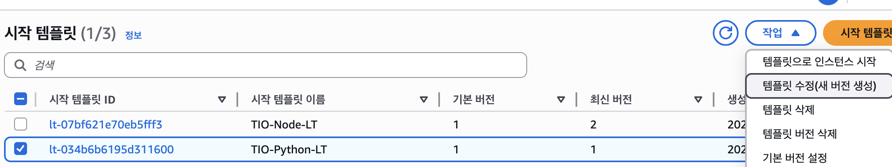

# 파이썬 인스턴스 스펙(인스턴스 유형, 스토리지) 변경하기

기존까지 인프라 구축하는동안에는 모델을 돌리기위한 환경 스펙이 어느정도가 되는지 몰라서 일단 프리티어 기준으로 t2.micro, 8GiB의 EC2 환경설정 토대만 만들어놨었다.

팀장인 성광이가 모델 올릴 준비가 되었다고 해서 원하는 인스턴스 유형과, 용량을 맞춰서 기존 EC2를 갈아끼우려고한다.

## 전체 과정 요약:

1. 인스턴스 중지 (인스턴스 유형 변경 시에만 필요)
2. 인스턴스 유형 변경
3. EBS 볼륨 크기 확장
4. 인스턴스 시작
5. 파일시스템 확장

### 1. 롤링 업데이트 방식 (무중단)

```json
bash
# 1단계: 첫 번째 인스턴스 중지 및 변경
aws ec2 stop-instances --instance-ids i-첫번째인스턴스ID --region ap-northeast-2
# 인스턴스 유형 변경
aws ec2 modify-instance-attribute --instance-id i-첫번째인스턴스ID --instance-type t3.medium --region ap-northeast-2
# 인스턴스 시작
aws ec2 start-instances --instance-ids i-첫번째인스턴스ID --region ap-northeast-2
# 2단계: 첫 번째가 Healthy 상태가 되면 두 번째도 동일하게 진행
```

### 2. Auto Scaling Group 설정 변경 (더 깔끔한 방법)

Auto Scaling Group의 Launch Template을 업데이트하는 것이 더 좋습니다:




기존 템플릿 스펙 `t2.micro`에 `8GiB`

### 1단계: 새 Launch Template 버전 생성

현재 TIO-Spring-LT가 t2.micro로 설정되어 있으니, 새 버전을 만들어야 합니다.

AWS 콘솔에서:

1. EC2 → Launch Templates → "TIO-Spring-LT" 선택
2. Actions → Create new version 클릭
3. Source template version: 기존 버전 선택
    
    
    
4. Instance type: g4dn.xlarge (또는 원하는 유형)으로 변경
    
    
    
5. Storage:
• Volume size를 8GB → 180GB로 변경
• Volume type은 gp3 유지
6. 유저데이터 변경
    1. 기존
        
        ```json
        #!/bin/bash
        # Ubuntu는 apt-get 사용
        sudo apt-get update -y
        sudo timedatectl set-timezone Asia/Seoul
        # Python 3.10 설치
        sudo apt-get install -y python3.10 python3.10-pip
        # CodeDeploy & CloudWatch 에이전트 설치
        sudo apt-get install -y ruby-full wget
        cd /home/ubuntu
        wget https://aws-codedeploy-ap-northeast-2.s3.ap-northeast-2.amazonaws.com/latest/install
        chmod +x ./install
        sudo ./install auto
        wget https://s3.amazonaws.com/amazoncloudwatch-agent/ubuntu/amd64/latest/amazon-cloudwatch-agent.deb
        sudo dpkg -i -E ./amazon-cloudwatch-agent.deb
        ```
        
    2. 변경
        
        ```json
        #!/bin/bash
        # Ubuntu는 apt-get 사용
        sudo apt-get update -y
        sudo timedatectl set-timezone Asia/Seoul
        
        # Python 3.10 설치
        sudo apt-get install -y python3.10 python3.10-pip python3.10-venv
        
        # NVIDIA GPU 드라이버 및 CUDA 설치 (fitdit 모델용)
        sudo apt-get install -y ubuntu-drivers-common
        sudo ubuntu-drivers autoinstall
        # 또는 특정 드라이버 설치
        # sudo apt-get install -y nvidia-driver-470
        
        # CUDA 툴킷 설치
        wget https://developer.download.nvidia.com/compute/cuda/repos/ubuntu2004/x86_64/cuda-keyring_1.0-1_all.deb
        sudo dpkg -i cuda-keyring_1.0-1_all.deb
        sudo apt-get update
        sudo apt-get install -y cuda
        
        # Docker 설치 (컨테이너 기반 모델 실행용)
        sudo apt-get install -y docker.io
        sudo systemctl start docker
        sudo systemctl enable docker
        sudo usermod -aG docker ubuntu
        
        # NVIDIA Container Toolkit 설치
        distribution=$(. /etc/os-release;echo $ID$VERSION_ID)
        curl -s -L https://nvidia.github.io/nvidia-docker/gpgkey | sudo apt-key add -
        curl -s -L https://nvidia.github.io/nvidia-docker/$distribution/nvidia-docker.list | sudo tee /etc/apt/sources.list.d/nvidia-docker.list
        sudo apt-get update && sudo apt-get install -y nvidia-docker2
        sudo systemctl restart docker
        
        # Python ML 라이브러리 설치
        sudo python3.10 -m pip install --upgrade pip
        sudo python3.10 -m pip install torch torchvision torchaudio --index-url https://download.pytorch.org/whl/cu118
        sudo python3.10 -m pip install transformers diffusers accelerate
        
        # CodeDeploy & CloudWatch 에이전트 설치
        sudo apt-get install -y ruby-full wget
        cd /home/ubuntu
        wget https://aws-codedeploy-ap-northeast-2.s3.ap-northeast-2.amazonaws.com/latest/install
        chmod +x ./install
        sudo ./install auto
        
        wget https://s3.amazonaws.com/amazoncloudwatch-agent/ubuntu/amd64/latest/amazon-cloudwatch-agent.deb
        sudo dpkg -i -E ./amazon-cloudwatch-agent.deb
        
        # GPU 모니터링을 위한 nvidia-ml-py 설치
        sudo python3.10 -m pip install nvidia-ml-py3
        
        # 재부팅 (GPU 드라이버 적용)
        sudo reboot
        ```
        
7. Create launch template version 클릭

### 2단계: Auto Scaling Group 업데이트

새 버전의 템플릿 적용 전, 1개의 서버만 유지하기위해 조정한도를 2/2/4에서 모두 1로 낮춘다. (갑자기 늘리거나 하는것을 방지하기 위해)


ASG에서 새 템플릿 버전 적용:

1. EC2 → Auto Scaling Groups → "TIO-Spring-ASG" 선택
2. Details 탭에서 Edit 클릭
    1. 
    
    
    
3. Launch template 섹션에서:
• Version을 Latest 또는 새로 만든 버전 번호(`버전 2`)로 변경
    
    
    
    
    
4. Update 클릭
    
    
    

### 3단계: Instance Refresh 실행 (점진적 교체)

무중단으로 인스턴스 교체:

1. ASG 상세 페이지에서 Instance refresh 탭 선택
    
    
    
2. Start instance refresh 클릭
3. 설정:
    
    
    
    - **Minimum healthy percentage**: 50% (한 번에 하나씩 교체)
    - **Instance warmup**: 300초 (새 인스턴스가 준비되는 시간)
        
        
        
    - **Skip matching**: 체크 해제 (모든 인스턴스 교체)
        
        
        
4. Start 클릭


### 4단계: 진행 상황 모니터링

Instance Refresh 진행 과정:


1. 첫 번째 인스턴스 종료
2. 새 Launch Template으로 새 인스턴스 시작
 (`t2.micro`가 하나 사라지고, `g4dn.xlarge` 인스턴스가 새로 생겨서 `초기화`중이다)
    
    
    
3. 새 인스턴스가 Health Check 통과할 때까지 대기
4. 두 번째 인스턴스도 동일하게 진행
    - 우리의 경우에는 오토스케일링의 설정을 낮췄기 때문에, 그냥 나머지 두번째 인스턴스는 종료 된다.

## 장점:

- **무중단 서비스**: 항상 최소 1개 인스턴스가 실행 중
• **자동화**: 수동 개입 없이 모든 인스턴스 교체
• **롤백 가능**: 문제 시 이전 Launch Template 버전으로 되돌리기 가능
• **일관성**: 모든 새 인스턴스가 동일한 설정으로 생성

### 1단계: 새 Launch Template 버전 생성

현재 TIO-Spring-LT가 t2.micro로 설정되어 있으니, 새 버전을 만들어야 합니다.

AWS 콘솔에서:

1. EC2 → Launch Templates → "TIO-Spring-LT" 선택
2. Actions → Create new version 클릭
3. Source template version: 기존 버전 선택
4. Instance type: t3.small (또는 원하는 유형)으로 변경
5. Storage:
• Volume size를 8GB → 20GB로 변경
• Volume type은 gp3 유지
6. Create launch template version 클릭

### 2단계: Auto Scaling Group 업데이트

ASG에서 새 템플릿 버전 적용:

1. EC2 → Auto Scaling Groups → "TIO-Spring-ASG" 선택
2. Details 탭에서 Edit 클릭
3. Launch template 섹션에서:
• Version을 Latest 또는 새로 만든 버전 번호로 변경
4. Update 클릭

### 3단계: Instance Refresh 실행 (점진적 교체)

무중단으로 인스턴스 교체:

1. ASG 상세 페이지에서 Instance refresh 탭 선택
2. Start instance refresh 클릭
3. 설정:
• **Minimum healthy percentage**: 50% (한 번에 하나씩 교체)
• **Instance warmup**: 300초 (새 인스턴스가 준비되는 시간)
• **Skip matching**: 체크 해제 (모든 인스턴스 교체)
4. Start 클릭

### 4단계: 진행 상황 모니터링

Instance Refresh 진행 과정:

1. 첫 번째 인스턴스 종료
2. 새 Launch Template으로 새 인스턴스 시작
3. 새 인스턴스가 Health Check 통과할 때까지 대기
4. 두 번째 인스턴스도 동일하게 진행


## 장점:

- **무중단 서비스**: 항상 최소 1개 인스턴스가 실행 중
• **자동화**: 수동 개입 없이 모든 인스턴스 교체
• **롤백 가능**: 문제 시 이전 Launch Template 버전으로 되돌리기 가능
• **일관성**: 모든 새 인스턴스가 동일한 설정으로 생성
1. ASG에서 새 템플릿 버전 적용
2. Instance Refresh 실행 (점진적 교체)