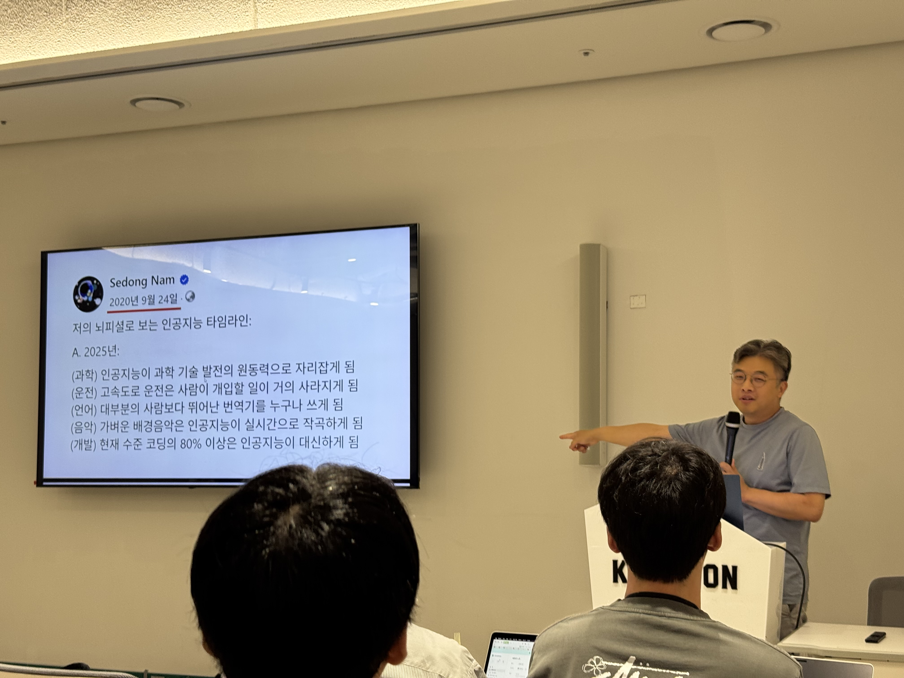
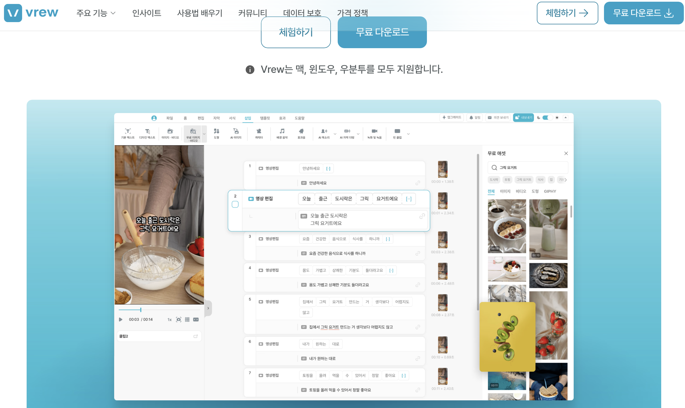
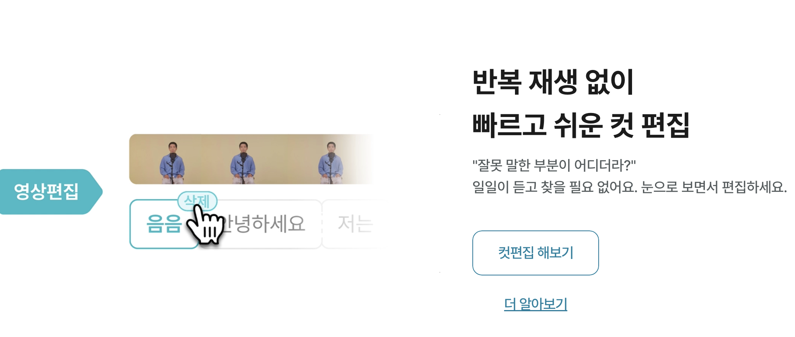
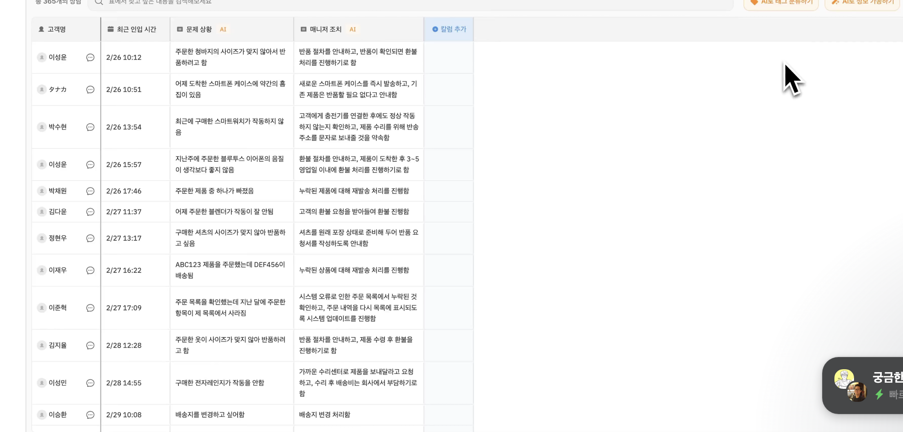
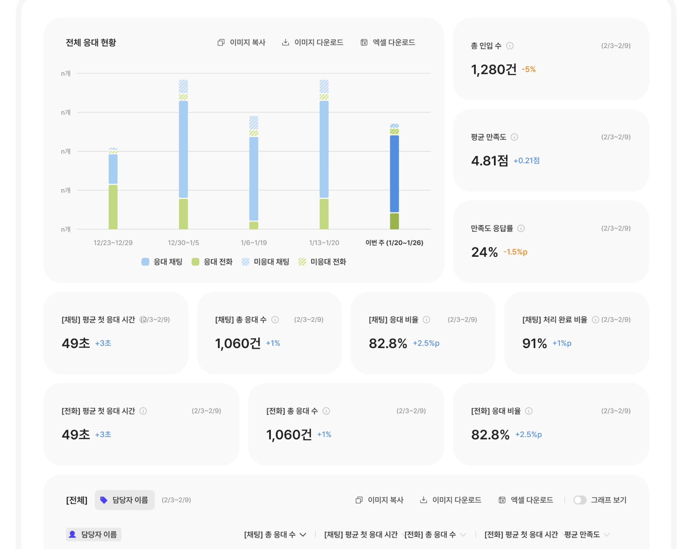

# 보이저 엑스 채용설명회

- 일시: 7.28.(월) 17:00
- 장소: 정글스테이지
- 주관: 보이저엑스 대표 남세동

## 사무실 소개 영상


<https://www.youtube.com/watch?v=EdGE_aq8fC8>

## 딥러닝으로 스타트업 (남세동)

카이스트 정글때부터 안빠지고 와봣음.

보이저엑스 17년도 창업 인공지능 개발 스타트업. 정글인원이 인턴 포함 여태 30명이 다녀감. 10명은 정직원으로 전환. 서비스 별 발표 3명이 할텐데, 다 정글 출신임.

꼭 한명은 뽑아가겠다는 생각으로 방문.

> 인공지능과 서비스에 진심입니다.

이상한 회사지만 도전이 있고 즐거움.

`딥러닝`: 사람이 작성하지 못 하던 프로그램을 컴퓨터가 찾아주는 것.

음성인식, 코딩 보조, 등 알고리즘으로 할 수 없는 도움

스타트업: 큰 기업이 도전하지 못한(안하기도하고 못하는) 미래를 만들어 가는 기업

딥러닝 스타트업: 프로그래밍만으로는 도저히 못만들던 `새로운 소프트웨어`를 딥러닝으로 만들어 `미래`를 만들어가는 `작은` 기업 (커서나 윈드서프가 예시임)

딥러닝? 과거의 연금술로 치부되던.. 과학적이라고 생각할 수 있지만 과학적이지 않음. `왜 되지?`

증기기관이 동일하게 1850년대 열역학이 정의되었는데 증기기관은 1700년대에 산업혁명의 역군이됨. 열역학도 모르는데. 현재 시대가 딱 그런 상태라고 봄

인공신경망으로 숫자에서 패턴찾기. 라고 생각함(대표)

아이폰 첫 발표시절 클리앙에서(클리에를 쓰는 사람들의 모임, 당시의얼리어답터들)의 반응은 어땠을까?

2007-01-11 이찬진씨의 블로그글(한국에서 아이폰을 쓰는 시기가 올 것이다.. 라는)을 가져온 사람의 게시글에 대한 댓글 반응은, `그리 새롭다고 생각하지 않는다`, `과장도 있는 것 같지만 글 정말 잘쓰시네요`, `호들갑은 이제 그만` 등등..

아이폰은 나오자마자 열광하던? 그런 시기는 아니었음 오히려 배척받는 그런 포지션

배달의 민족도 처음나왔을때 어떻게 생각했을까? `전화하면 되는데?` 에어팟은? `콩나물같다` 등등등. 테슬라? 다 비슷하다.

스타트업은 새로운 일을 하기 때문에 사회적으로는 `이상한 일`을 하는 것, `WOW 한 일`을 하는 것이다.

대표 본인도 2020년 9월 24일: 인공지능 타임라인 2025년을 작성한, GPT도 출시하기 전에 글을써서 미친사람 취급받음.



**프로젝트 선정 기준**

- 딥러닝 때문에 가능해진 것
- 임팩트가 크고
- 10년 동안 성장할 것
- 6개월 내로 런칭할 것

현재 흑자를 눈앞에 두고 있음. 25년 6월 기준 10억원

현재 해외 매출이 더 늘어나는 중. `미국에 대한 확장`을 노리는중.

## Vrew 프로젝트 소개 (이주희, 카이스트정글 6기)



> 누구나 영상편집을 쉽고 즐겁게

### 영상편집의 역사

비디오가 컨텐츠가 되는 서비스들이 많음. 10분짜리를 만드는데 하루를 소요하는 경우가 허다함. 영상편집 기술은 시대의 흐름을 타고 혁신을 거치는 중

최초는 필름을 가위 / 칼로 잘라 붙임

타임라인기반 편집 (2세대)

하지만 여전히 불편함을 가짐. (각 시점의 내용 확인 불가, 비문, 중언부언, 공백 등 단순편집반복, 자막작업에 많은 노력 요구)

### vrew의 기능

1. 음성을 인식해서 자동 자막을 만듬

2. 생성된 자막을 이용해서 편집점을 찾아 컷편집이 가능함
3. 기반이 되는 영상이 없어도 한 문장의 타이틀로도 자동생성함

그외 기능.

```
음성 덮어쓰기
AI 내 목소리
비디오 리믹스
썸네일 생성
이미지 생성
무음 구간 줄이기
트랜지션
클라우드 저장 etc
```

파생 서비스로는 `vProp: 부동산 소개 앱`, `vStory: 이미지만 넣으면 인스타 스토리 생성`

### Vrew팀 개발자가 하는일?
>
> 고객들을 실제로 자주만남

- 사용성 인터뷰
- CS 응대
- 라이브 방송: 고객층이 많은 일본에서 행사 또는 인터뷰 진행
- 컨퍼런스: 미국 컨퍼런스 브루 부스 운영
- 웨비나
- Cold visit 인터뷰: 최근 시애틀에서 진행

> 발전하는 기술로 인해 영상의 프레임 단위가 아닌 컨텐츠 자체에 집중하게됨

## vFlat 프로젝트 소개 (누구임? 정글 21년도, 3년차)
>
> 터치 한번으로 빠르고 쉬운 스캔

그냥 스캐너가 아니고 AI 기술을 적용한 스캐너

**주 사용자** 실물 책/ 문서/ 학습/ 강의 등 자료를 디지털화 하고싶은 (10대~ 80대 까지 다양)

MAU 170만 글로벌 / 누적 2700만 이용중

**팀 구성** : 현재 개발팀 5명, 사업개발(PO) 1명

**주요 특징**

```
곡면 보정, 후처리를 통해 깔끔한 스캔 서빙
모든 스캔 과정에서 Local에서 동작(AI)
```

스택: iOS/ Android Native.. 등

신입 개발자에 대해서 기대는, CS에 대한 지식수준만

모든 처리가 사용자의 디바이스에서 동작하기 때문에 최적화가 중요

### 업무 방식

프로세스 자체는 일반 회사와 동일하나

특별점은
개발자 자유도가 높고, 디자이너가 없이 피쳐를 만들기도하고, 각자 맡은 역할에 책임을 가지고(자유도가 높은 만큼) 협력으로 이뤄짐

### 사용자 중심 팀워크 지향

팀 전원 CS 응대중. 필요하다면 전화, 화상 인터뷰 / 사용자 대면
> 사용자가 있어야 서비스와 팀이 있다 (사용자가 최우선 가치)

### B2C 외에 B2B 솔루션도 진행

팀 리소스를 고려하여 제한적으로 받아 일부 회사 솔루션 제공중

1금융권, 보험사, 교육, 팩스회사 일부

### 앞으로는?

Scan x AI, Documents x AI → 현재는 연 40억이나, n*100억을 목표로 나아가는 중

## VOC STUDIO 프로젝트 소개 (카이스트 정글 4기 수료자)

> B2B 서비스, 고객 CX 솔루션

사용자의 경험이 기술보다 앞서야한다 - 스티브잡스

결국 그걸 알기위해서는 Voc(Voice of Customers)가 필요한데. 이는 VOC Studio로 솔루션을 제시함

### VoC는 관리가 어려움

> 다양한 채널, 리뷰 / QnA / 메일 등등 취합하는게 어렵고 한눈에 보기 어려움

또한 이를 통해 취합을 하더라도 통계와 같은 시각화나, 한 방향을 바라보는 인사이트를도출하기도 어려움

### AI가 잘 하는일

- 문의 요약
- 문의 자동 분류 / 추천
- 유사 문의 탐색

이를 통해 VOC 취합 / 대시보드 생성, 공유, 이상탐지를 함

### 서비스 소개

1. 채널 연동 지원: 채널톡, 엑셀, 앱스토어, 플레이스토어, 슬랙
2. 고객 상담 문서 정리: 채팅 내역을 정리해서 `상품명 추출`, `문제 상황` 인식, `매니저 조치` 를 정리

3. 각 상담 결과를 인라인으로 정리해줌
4. 온도에 따라 불만 정도나, 문의 유형 태깅, 상담 만족도, 긍 부정 태깅을 자동화

5. 대시보드로 트래킹 / 추이 확인 가능

### 현재 고객사는?

600 + `채널톡`, `팀스파르타`, `t오더` 등..

### 현재 개발중인 기능은?

- AI VoC 리서치: AI가 많이 개입하는 기능인데 키워드로 질문하면 요약함
- Chat to Chart: 입찰한 상담 건수의 추이를 지표로 알려줘 → 주황색 그래프로 바꿔줘, 등 시각화 도움

## QnA
> 대표님과 구성원이 돌아가면서 답할 예정

### 사전질문

### 커리어 / 기술 관련
> 최근 백엔드 기준 클라우드네이티브 개발, 보안, 개발자 경험 개선(CICD 파이프 라인 통합) 이 개발 트렌드라고 들었는데 어떤지 궁금합니다, 업계에서 필수적인 요소인지도 궁금합니다

질문자 안나와서 스킵

> AI 분야는 공부량이 많음. 정글 이후 어떤 역량을 길러야할지? 정글 과정과 연계(`CS 역량`)했을 때 가장 중요한것 과 이후 가장 먼저 길러야하는 보이저엑스가 가장 선호하는 역량은 무엇일까요?

대표님 A: 정글에서 배우는게 실전 개발자가 알아야 할 CS 핵심 기초만 잘 뽑아서 배우는 것 같고. 늘 이야기하는 것은 모든 개발자가 알아야하는 우선순위 세가지는 `1. OS, 2. DB, 3. network.` 정글에서의 교육 시간상 어쩔수없이 학습 비중이 다르겠지만 필수는 저 세가지인 것 같다.

VOC 발표자(진영?진혁?): AI분야와 기초 CS가. 질문 요지가 잘 모르겠음 딥러닝 개발자인지 그냥 개발자인지..?
일단 운영체제를 뽑을 것 같음.  
정글에서 이 커리큘럼을 쓰는 이유가 있음. 실제로 업무중에 운영체제를 공부하는 기회가 적음. 이왕 한 김에 좀 더 딥다이브하고. 가상메모리, 스레드스케쥴링 이런것을 얼마나 하드웨어를 더 얼마나 잘쓰기 위해서 고민해야하는 부분이기 때문임.  
가장 중요한건 OS, 그다음은 모르겠습니다..? 각자 프레임워크나 알아서 잘.. 각자 생각하는 분야에서 필요한 것 열심히 했으면

vFlat 발표자: ?????????????????? OS 중요하고, 알고, 정글에서 잘 다루지 않는게 DB(특히 백엔드), 백엔드가 아니더라도 쿼리를 어떻게 날릴때 느릴 수 잇는지, 무거운지 정도는 알아야함, 네트워크 중요. 결국 각자에 필요한 프레임워크 등 필요하다고 느끼는 부분을 학습할 필요가 있음.

### 채용 관련
> 신입 채용 시 직무 및 각 직무별 인원

대표A: 보이저엑스는 나누지않음. 신입은 ? 요리사인데 개발자는. 일식만해요, 중식만해요... 그냥 보면 모르는게 많은데 따지는게 많아보임. 별로 좋게보지 않음

> 신입 개발자에게 기대하는 역량이나 경험은 무엇이며, 어떻게 평가하는지도 궁금

대표: 1차면접은 앞의 소개인원들이 보게됨. 2차도 동일한 경우도 많음. 그래서 앞의 직원들이 설명

주희: 정글 분들이시니까. 면접에 만일 자기가 들어가면? 정글에서 배운것을 잘 답변하기를 기대. DB, 네트워크 안배웠지만, 경험이 있다? 그에 대한 잘 답변이 되었으면좋겠음. 경험한 부분에 대해서 잘 정리해서 답변  
좀 더 어려운 부분은 논리력을 좀 더 중요하게 생각함. 평소에 공부하거나 면접준비시 대답을 할때 조리있게 잘 전달될 수 있게 고민해서 준비해보기바람.

대표: 정글 코스를 너무 잘알기 때문에 코스에 나온 것을 얼마나 잘 아는지가 중요. 얼마나 열심히 했는지.

vFlat 발표자: 전공자 / 비전공자냐 따라 다르기는 한데, 배운것 내에서 얼마나 잘 성장했는지, 잘 알고있는지. 사실은 앞으로가 더 중요하기 때문에 이후의 성장추세를 볼 것 같음.  
커뮤니케이션 능력, 기본지식을 얼마나 성실하게 익혔는지, 논리적인 사고 등..

대표: 다시 정리하면 `정글은 정글 과정에서 열심히했다는 가정하에 커리큘럼에 대해 깊게 물어보게됨`. `전공자`보다 `비전공자`의 허들이 좀 낮긴함.

> 크래프톤 정글 출신을 채용할 때 어느 부분을 중요하게 고려하는지 궁금합니다.(경력, 업무이해도 등)

대표: 방금 이야기한게 전부임

진혁(VOC): 신입을 가정했을 때, 요즘은 특히 개발을 했지만 어떻게 돌아가는지 모른다. 이런 경험을 한 개발자가 많을거임. LLM, 바이브코딩 등..  
처음에 신입 개발자 입장에서는 GPT를 통해 코드를 짰어도 어떻게 돌아가는지에 대해서 정확히 아는게 중요함. 정글의 커리큘럼 내에서도 핀토스가 어떻게 돌아가는지를 자세히 아는 분들이 면접에 좀 더 유리할 것 같다는 생각이 듬.  
역량은, 개발 외적으로는 스타트업에 지원하는거니까 언제나 직원의 고성장을 꿈 꾸게됨. 서비스를 성장하고싶어하는 진심을 가지고 있는 사람들이 지원했으면 좋겠음.

대표: 원래 정글과 몇년을 처음부터 오래했기 때문에 맞춤 면접 프로세스가 있음. 얼마나 열심히햇는지가 중요

> 이런 개발자는 우리 회사로 데려오고 싶다. 어떤점을 보고?

vFlat: 태도가 중요. 힘든일이 있어도 도망치거나 남한테 미루지않고 본인이 나서서 하려는 태도. 개발 실력은 기본임. 적어도 대화하는데 지장없고, 예를들어 이런 구조면 이렇게 짜면 되지않을까? 이런 업무적인대화.

VOC: 개발은 어떻게든 해결이 됨. 시니어분들이 훌륭하셔서 온보딩은 문제없음. 어떤 것을 개발할지 사용자를 잘 이해하고 아시는분들을 환영할것. `어떻게 하면 좋은 서비스를 만들어서 돈을 벌 것인가` 에 대한 감이 좋은 사람  

대표: 정말 나중에 가면 진짜 훌륭한 개발자는 안되는걸 되게함. 신입은 되는것도 안되게하는 경우가 많기 때문에 답답하거나 난감한데. 대표가 원하는 인재상은 나중에 `진짜 안되는걸 되게 할` 잠재역량이 있거나 혹은 그런 능력이 있는 개발자  

> 함께 일하고 싶은 동료

주희: 앞 질문이랑 비슷하게 느끼기는함. 보이저엑스 개발자 성향이 대부분 그런데, 감정적인 성향을 잘 안보이고(언성높이거나, 흔들리거나) 어떤 상황에서도 든든한? 그리고 논리적인 대화가 가능한 분이면 좋을 것 같음.

VOC: 기억나는 동료는, 딥러닝 모델을 만드신 분. 딥러닝은 언제 끝날지 모르는 개발을하게됨. 인턴분이었는데 본인이 책임을 가지고 밤낮없이 주말에도. 주변 동료들이 만류할 정도였음.  
그런 `자기가 맡은 역할`에 대해 무거운 책임감을 가지고 해내야한다는 마음을 가지신분인것 같음. 그런 분들이 함께 일하고싶다고 생각

대표: 결국 사람마다 다 다르겠지만. 보이저엑스는 정직, 성실, 논리적인 사람들임. 정글을 통과한 사람들은 대체적으로 성실하다고 생각

> 중고 신입에 대한 생각

대표: 중고신입.. 의 정의는 사람마다 생각이 다르긴한데 일단 다른사람들이 답변

VOC(진혁): 좋게 생각합니다. (세명 다 다른일을 하다가 개발자로 커리어전환 케이스)

대표: 중고신입이 되보고 경험한 느낌은?

vFlat: 면접에 임할때 딱히 고려를 하지는 않는 듯 함.(편견을 갖지 않는다)

VOC: 대체로 경력있는 신입으로 지원을 하신다고 편견을 갖진 않지만, 이전 회사에서 개발자로 일했다면 그 당시 개발을 하면서 있던 기술에 대해서는 질문을 할 수 있음.  
잘 답변하지 못하면 이전 경력에 대해서는 평가가 낮아질 가능성이 있음. 이전에 했던 일도 잘 했던 사람이길 바람.

주희: 중고신입은 개발자를 하다가 채용을 하러온사람.. 을 말할 것 같은데. 보이저엑스는 딱히 신입만 채용을 구분해서 하지않아서 중고신입에 대해 고려를 잘 안하는 것 같았음.  
나의 경우에는 이전의 개발 경력이 있는데, 그 전에 경우에 대해서는 잘 묻지 않으심. 오히려 정글의 질문을 많이 하셨는데. 그래도 이전 일에 대해서 잘 알아두고 답변하면 좋을듯.

대표: 실제로 면접 / 채용시에 대한 기대는? 신입 기준에서 평가를 하되, 실력을. 중고 신입의 좋은 점은 사회생활이나 팀워크 등에서 좋은 점을 기대하게됨. 신입과 회사 다녀본사람들은 차이가 남. 회사를 다녔다면 그 회사에서 팀웍이나 이런 것을 어떻게 훈련을 받았고 생각을 하는지에대한 기대를함.  
좀 더 좋게 생각함. 서비스를 해봤다? 대학생이랑 사회생활을 한 사람이랑 차이를 둠.

> 요즘 채용시장 분위기와 현실

김현민(채용담당자): 8년정도 IT 채용 업무 경험 있음. 이 질문을 한 배경은, 요즘 IT업계 침체라는 소식이 많이 들려서 불안감때문에 하지 않았나 싶긴함.  

코로나 이후 금리 오르고 시장에 돈이 안돌고.. 회사들이 많이 폐업하고 실제로도 22,23,24 3년간 매년 폐업률이 증가함.  
실제 지표가 그렇긴하고 뉴스로 접할수 있는 분위기는 안좋다 안좋다가 많은데, 거기에 따라 채용도 줄고 신입공채도 줄고 는 맞음.  

반대로 없어지는 회사는 많은데, 일자리 자체는 줄어들지 않음. 살아남은 회사는 오히려 커짐  

IT업계로 한정지어 생각해보면 AI시대 이후로 오히려 더 성장이 가속화되서 사람을 더 많이 필요로함. 우리가 희망하는 채용 기회는 오히려 줄지 않았음.

토스만해도 1000명 뽑고.. 산업군의 기회는 줄지 않는것으로 판단됨. 많은 스타트업이 폐업하고 그런것들은 많는데 다른 포커스로 보면 좋을듯.

대표: 다른 포커스로 첨언하면, AI로 인해 자리가 줄고 그런건 동의함. 개발자가 제일 먼저 두들겨맞긴함(먼저 영향을 받음). 실제로는 개발자 연봉이 오히려 올라가는중.  
반대로 스포츠 스타들보다 고점을 찍기도 했고. 오히려 AI 개발자의 수요로인해 다른 직업군들에 비해 마지막까지 살아남지않을까 라고 생각함. 즉 AI 스타트업으로 일을 해야한다고 생각함

### 회사 관련
> 최근 생성형 AI 활용이 증가. 사내에서는 어떻게 활용하고있으며, 보안 측면에서 어떻게 대비하는지?

vFlat: LLM을 굉장히 많이 활용중, 특히 코드작업시. 사내에서는 코드 작성 어시스턴트 툴들에 대해서 사용시 보안성 검토 절차가 있음. 

대표: 사내에서 모든 파트가 AI의존도가 높아지기도 했지만 생산성도 3, 4배 높아짐. 깃허브 쓴다고 마이크로소프트가 다 들여다볼까? 그런 느낌임. AWS 쓰면 보안이 문제가 없나? 모든 기술이 보안에 문제가 있음.

> 백지원: 개발보다 기획 측면에 좀 더 관심이 많음. 개발자들의 해당 부분에 대해서 발언권이 강한지?

대표: 70명중에 개발자가 50명임. 기획자는 딱 2명있는데, 개발자 45명을 2명이 상대할 수 없기도하고 모든 일을 기획자라는 타이틀을 달고 싶은 사람이 다 할수가 없음.  
어떤 회사보다 개발자가 기획에 많이 참여함. 기획 개발 디자인 전부.  
특히 요즘 인공지능이 디자인, 문서화, 기획을 잘 서포트해주기때문에 특정 포지션에 대한 갈망은 걱정하지않아도 될듯.

> ⭐김성광: 포트폴리오를 준비해야한다면 어떻게 해야할까? AI개발자로 경력을 쌓고싶다면 예를들어 논문투고라던가.

대표: 신입 수준에서 대단한 경우는 드뭄. 포트폴리오를 열심히 보는 경우는 잘 없음. 포트폴리오때문에 합불이 갈린다? 그런 경우는 크지 않음.

다만 잘 했다고 말한 프로젝트를 제대로 답변하지못한다? 거기서는 문제가 발생할듯. 열심히 하고 잘 한 부분에 대해서 자연스럽게 대답할 수 있어야함.  
뭘 하더라도 신입이 감동을 주는 경우는 잘 없다.

본인이 정확하게 한 일에 대해서만 어필을 해야할 듯

> 보이저엑스라는 회사에 대해서 처음들어봄. 일반적인 스타트업의 규모는 지났다고 생각하는데, 개인적으로 생각하기로는 가슴뛰는 일은 아닌것 같음(영상편집, 스캐너 등..) 그래서 앞으로 10년간 비전은?

대표: 그럼 가슴뛰는 멋진 일은 뭐지?

> 리벨리온, 토스, 배달의민족

대표: 배달의민족 첫 시작을 아나? 토스는?  
배민은 전단지앱으로 시작. 쿠팡은 쿠폰뿌리던회사. 토스는? 친구들끼리 밥먹고나서 소액 간편송금. 그런식으로 시작함.

보이저엑스는 B2C로 할 수 있는 일이 무궁무진하다고 생각함. 모든 스타트업은 이상하다고 생각하는 일부터 생각함