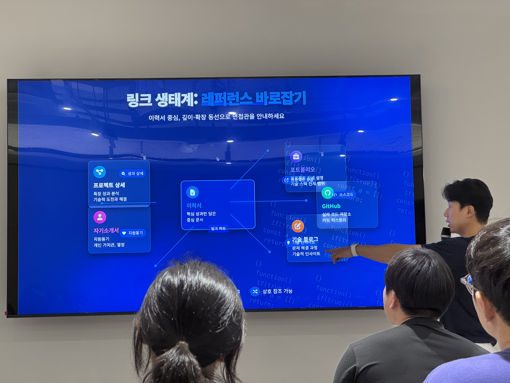
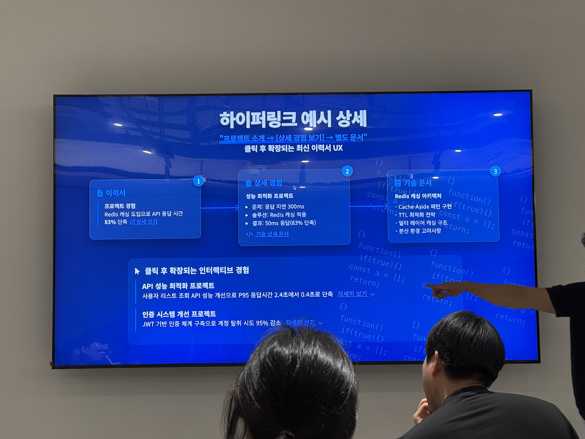
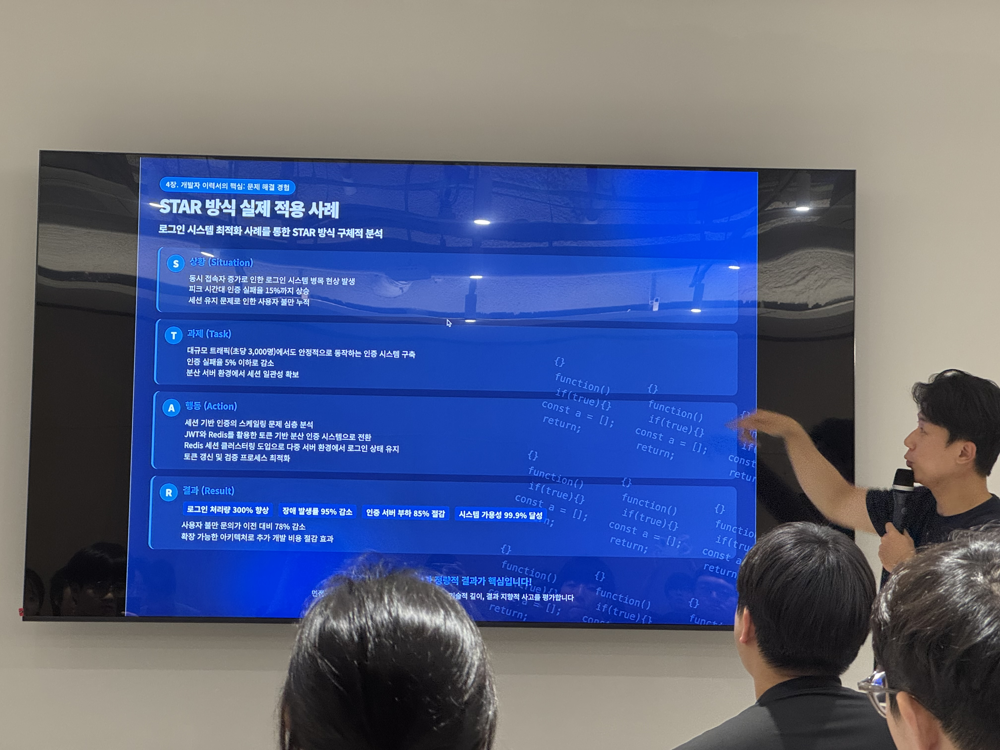
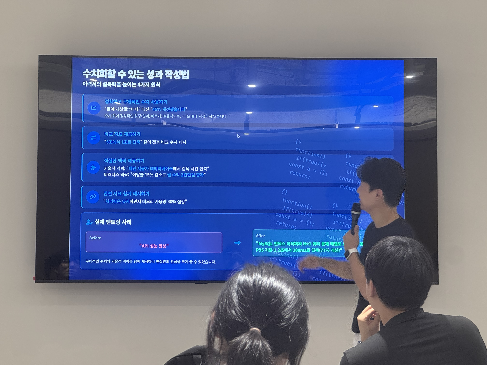
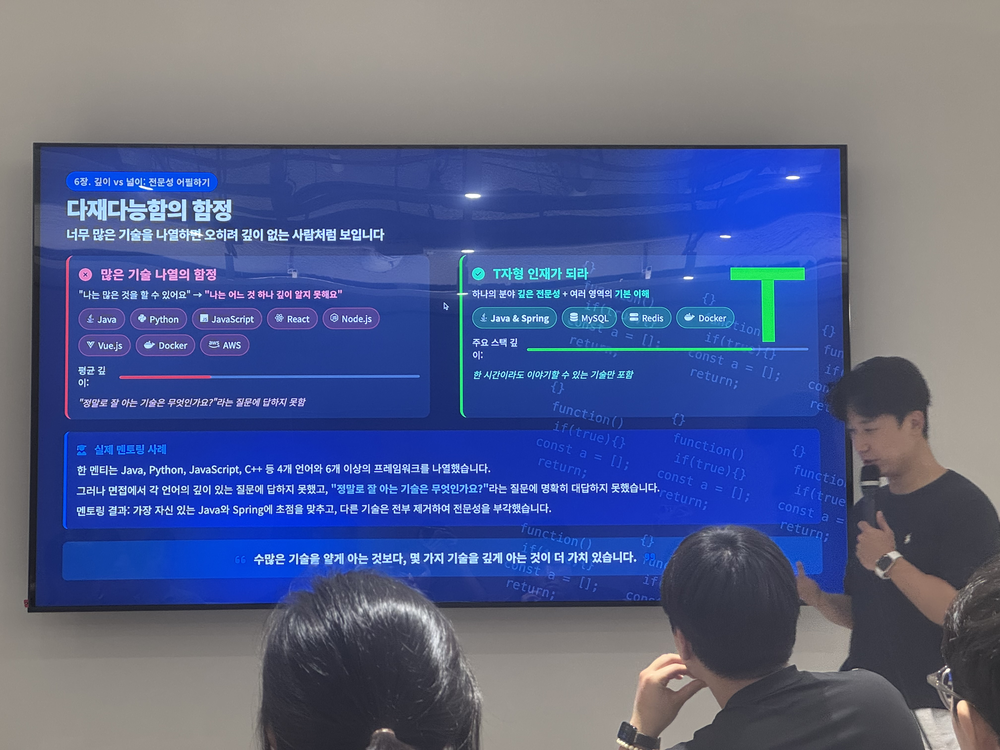
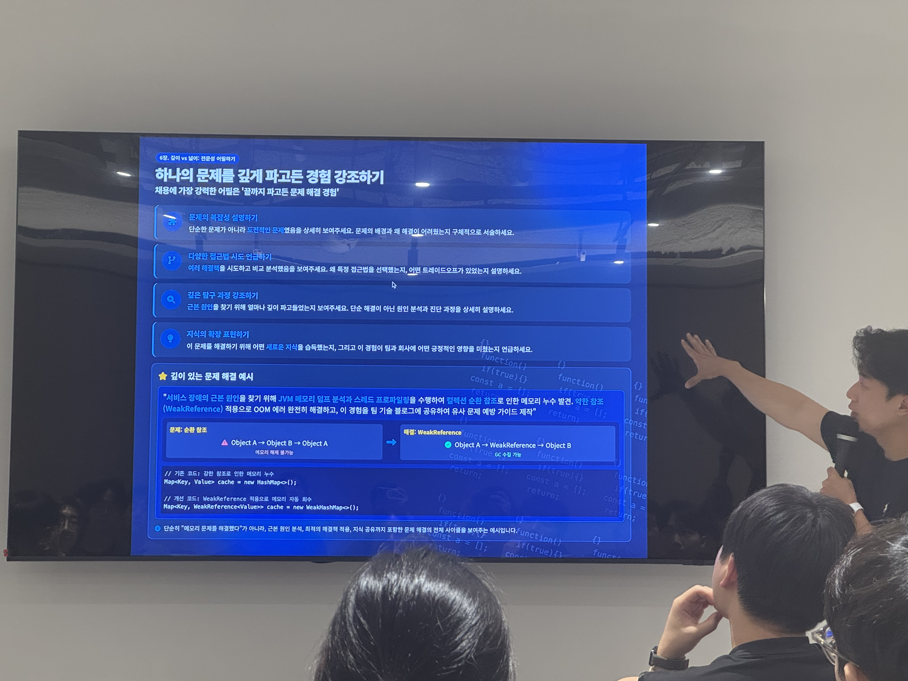
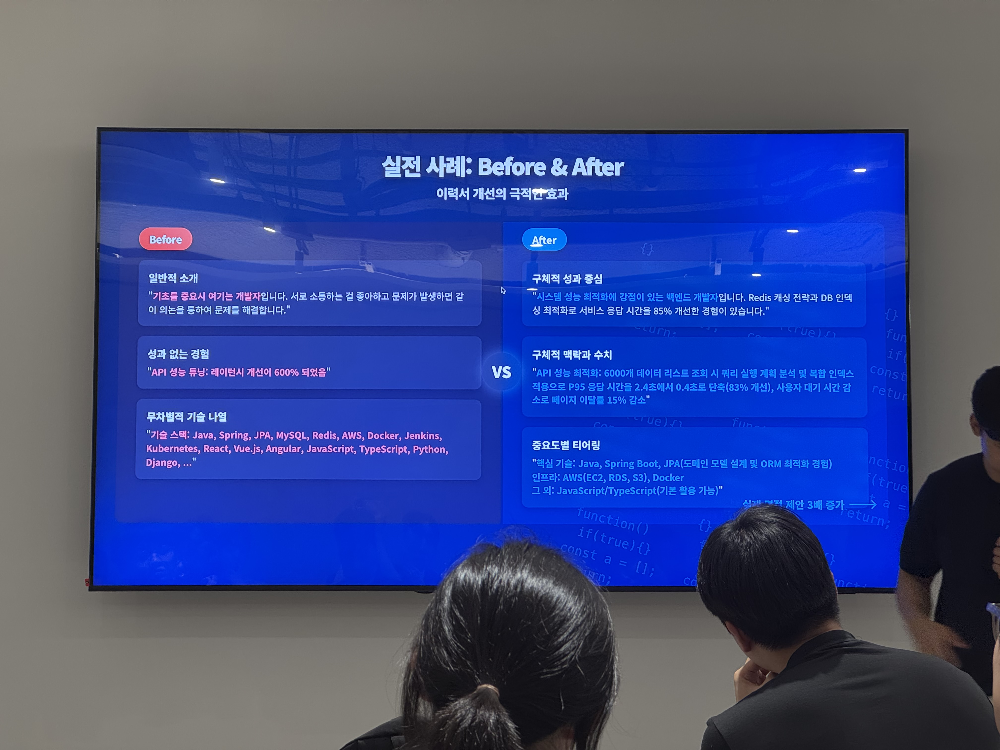
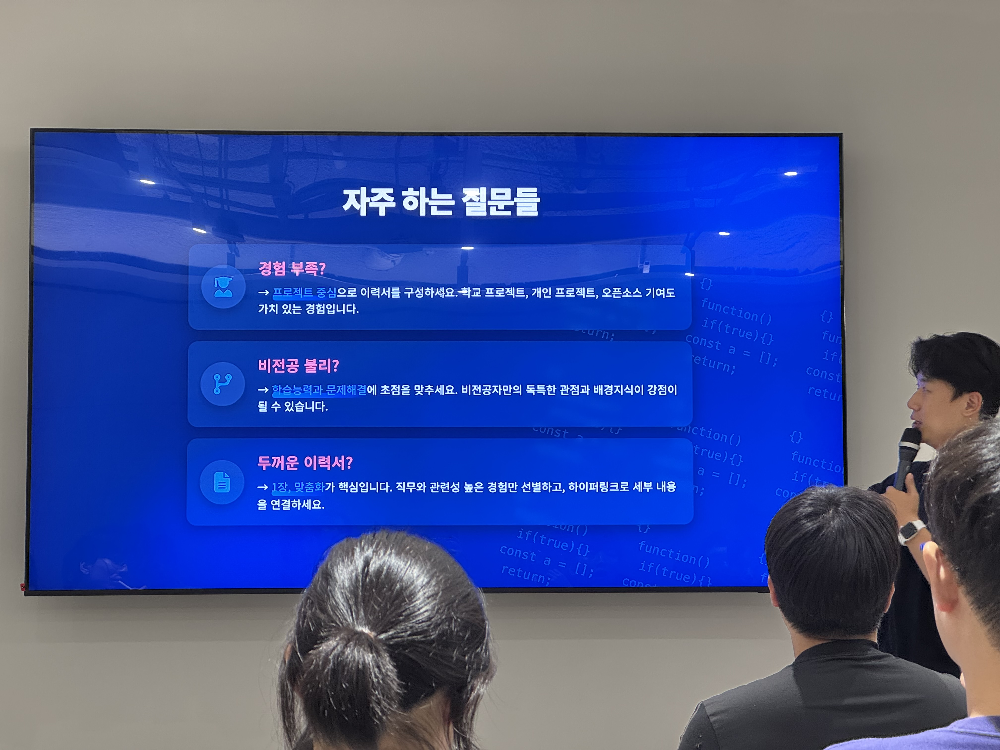
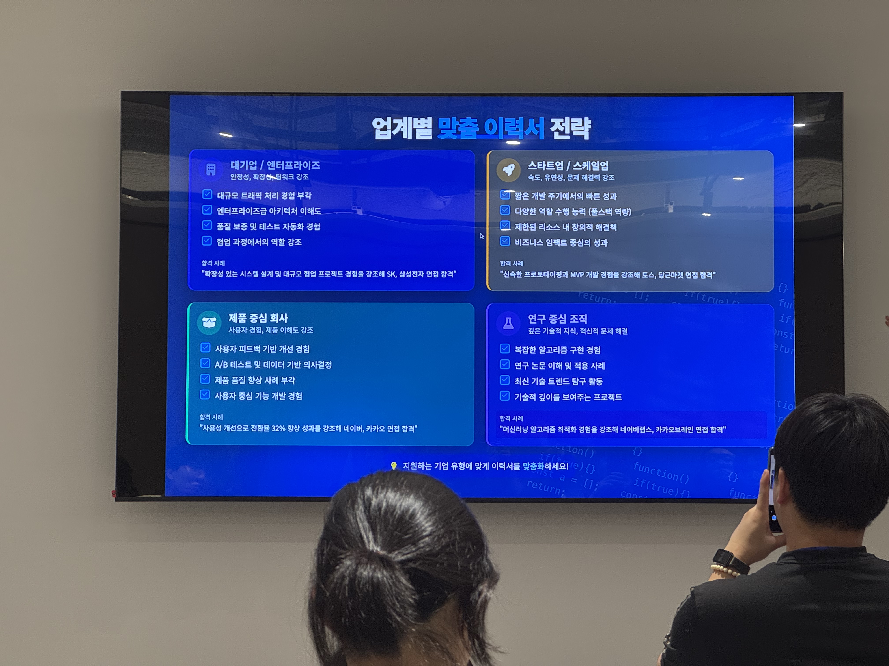

# 이력서 특강

- 연사: 밸런스히어로(인도 금융서비스) 김재운
  
  (BE 4년차, 카이스트 정글 3기)
- 장소: 정글스테이지
- 일시: 8.10 17:00

> "당신의 이력서는 단 3초 만에 판가름 납니다."
>
> 면접관이 놓을 수 없게 하는 최강의 이력서 만들기
> > 면접관의 시선을 사로잡는 이력서 작성법

## 배경

- 비전공자 & 대기업 인턴 (하이닉스 R&D 인턴)
- KAIST 대학원석사
- AI스타트업 창업
- 부트캠프 & 개발자 전향

이러한 이력들로 인해 어떤 이력서를 받았을 지 상대적으로 매력적으로 느끼는지 알고있음.

틱톡, 팔란티어 인터뷰 제의 경험

## 이력서의 목적: 궁금증 유발하기

**대부분의 실수** : 이력서를 자신의 모든 것을 담아내는 문서로 생각

but 진정한 목적은 `면접관에게 당신에 대한 궁금증을 유발하는 것`

일상적인 대화(or 소개팅)에서도 한 번에 모든 이야기를 쏟아내는 사람보다,

`흥미로운 이야기의 핵심만 던져 더 알고 싶게 만드는 사람`에게 끌리게 됨

### 역할은 그 다음 스텝(코테 or 면접)까지 안내 하기만 하면 되는 것

**실제 사례**

```
한 멘티가 자신의 모든 프로젝트와 경험을 빼곡히 채운 5페이지짜리 이력서 가져옴
핵심 경험이 다른 정보에 묻혀 버려 잘 보이지 않았음.
→ 이력서를 1페이지로 압축하고, 가장 인상적인 문제 해결 경험 하나에 초점을 맞춤
→ 더 자세한 내용은 링크로 연결
개선 결과 원하는 회사 면접경험 획득
```

### 숨겨진 심리학: 찾는 세 요소는

1. 소통능력

    복잡한 기술적 개념을 명확하게 설명할 수 있는가?
   - 복잡한 아키텍처를 간결히 설명
   - 비 개발자도 이해할 수 있는 설명력
   - 기술적 의사결정의 명확한 표현

2. 학습 능력

    새로운 기술과 개념을 빠르게 습득할 수 있는가?
   - 새로운 프레임워크 적용 경험
   - 문제 해결을 위한 기술 탐색력
   - 최신 트렌드 습득 의지와 속도

3. 열정

    문제를 깊이 있게 파고들 의지와 능력이 있는가?
   - 근본 원인 분석의 끈기
   - 복잡한 문제 직면 시 태도
   - 최적화/개선에 대한 지속적 관심

**예시**

- 약한표현

    "DDD를 적용한 경험이 있습니다"
- 강한표현

    "애그리게이트, 엔티티, 리포지토리 패턴을 활용한 DDD기반 설계로 복잡한 비즈니스 로직을 모듈화 했습니다 (상세 사례 보기 링크)"

### 신입 vs 경력: 이력서 차이

개발자의 본질은 `문제를 해결하는 사람` 그 경험을 녹여서 보여줘야함.

 "나는 문제를 해결할 수 있는 사람이야"

**신입**: 학습 능력과 열정

- 새로운 기술과 개념을 빠르게 습득할 수 있는 능력, 문제 해결 의지 보여주기
- 프로젝트 문제 해결: 학교나 개인 프로젝트에서 직면한 문제와 해결 방법 중심으로 서술
- CS지식 실무 적용: 기본적인 컴퓨터 과학 지식을 실제 프로젝트에 어떻게 적용했는지 보여주기

**경력** 개발자: 실제 성과와 임팩트

- 실제 업무에서 달성한 성과와 비즈니스에 미친 영향을 수치화하여 제시
- 전문성과 깊이: 특정 도메인이나 기술 분야에서 쌓은 전문 지식과 경험의 깊이 강조
- 복잡한 문제 해결 사례: 복잡한 기술적 비즈니스적 문제를 어떻게 해결했는지 구체적 사례 제시

학력, 자격증 이런건의미 없다. 위의 내용이 가장 중요. 굳이 포함하자면 오픈소스 컨트리뷰트?

## 황금 법칙: 1장의 원칙

### 1. 면접관의 시간은 제한되어있다
HR이 아닌 실무 개발자들이 검토, 하루에 수십 개 이력서를 7초만에 스캔

`독자를 배려해야한다`

### 2. 첫 인상이 중요하다
한 페이지에 핵심 정보만 간결하게 담으면 강점을 빠르게 파악할 수 있음

### 3. 선택과 집중은 자신감의 표현
중요한 것을 갈고 그것만 보여줄 줄 아는 사람은 자신의 가치를 명확히 이해함

`모든게 다 어필할 수 있는 경험이 아닐 것임` 선택과 집중을 깊이있게 문제를 해결한 경험을 보여주는게 더 좋음. 

> 실제 사례 
> 
> " 보여줄 게 많지 않아 이력서가 부실해 보일까 걱정"
>
> 이력서를 1장으로 압축하는 과정에서 오히려 자신의 핵심 경험과 강점이 무엇인지 더 정확히 인식하게 되어 더 설득력 있게 자신을 어필

## 하이퍼링크 활용법 (1장 이력서 한계를 링크로 극복)

### 핵심 정보만 간결하게
이력서에는 가장 중요한 정보만 담고, 나머지는 하이퍼링크로 확장

### 궁금증 유발 키워드에 링크 삽입
면접관이 더 알고 싶게 만드는 키워드나 문구에 하이퍼링크 추가

### 링크된 페이지에서 상세 정보 제공
면접관이 관심 있는 부분만 선택적으로 깊이 탐색할 수 있는 구조 설계

예시
"Java/Spring 기반 웹 애플리케이션 개발 경험이 있으며, 대용량 트래픽 처리를 위한[성능 최적화](가상링크)에 관심이 많습니다."

→ Github, 포트폴리오, 기술 블로그로 정보를 확장하여 더 깊은 인상을 줌

이렇게 제공했을 경우 독자의 관점에서 선택적으로 읽을 수 있게 하는 장치


## 요약의 힘: 임팩트+가독성 높이기

**1. 중요한 것부터 보여주기**: 각 항목에서 가장 임팩트 있는 성과나 경험을 맨 앞에 배치하여 주목도 높이기

사실 스킬 등의 언어는 별로 중요하지 않고, 어떻게 문제해결을 하고 접근할 수 있는지

**2. 숫자를 활용하기**: "성능 개선" 대신 "응답 시간 65% 단축" 과 같이 구체적인 수치로 임팩트 강조

**3. 불필요한 단어 제거하기**: "저는 ~을 수행했습니다" 와 같은 표현 대신 " ~을 수행"형태로 간결하게 작성

**4. 시각적 계층 구조 활용하기**: 제목, 부제목, 강조표시 등을 사용해 중요한 정보가 한 눈에 들어오게 구성

**5. 적절한 여백 활용하기**: 빽빽하게 채워진 페이지보다 적절한 여백이 있는 페이지가 읽기 편하고 가독성 높음

**예시**

프로젝트에서 DynamoDB를 사용하여 데이터베이스 작업 수행 → 
DynamoDB 파티션 키 최적화로 조회 성능 300% 향상

기술적 세부사항 대신 구체적 성과 중심으로 재구성. 상세 정보는 링크된 문서로 제공하여 이력서는 임팩트 있게 유지

## 객체지향적 이력서

이력서 - 포트폴리오 - 자기소개서 각각의 책임 분리, 링크로 연결 등 효율적인 구조가 답이다

**이력서**: 경력, 주요 성과와 스킬 요약

**포트폴리오**: 프로젝트 상세, 기술적 깊이

**자기소개서**: 가치관, 동기, 문화적 적합성

### 이력서도 구조적으로
문서별 단일 책임을 명확히 하면 자식의 책임에만 집중 가능


### 링크 생태계




### 문제 해결 경험이 전부다

개발자는 문제를 해결하는 게 근본이라고 앞에서 언급. 기업은 특정 기술을 아는 사람이 아니라, 비즈니스 문제를 기술로 해결할 수 있는 사람을 원함

왜?

1. 실무 적합성 평가: 과거에 어떤 문제를 어떻게 해결했는지를 통해 실무 적응력을 예측할 수 있다. 우리 기업에 와서도 어떻게 해결할 수 있겟네? 라고 예측 가능

2. 사고 프로세스 확인: 기술은 변하지만, 문제를 분석하고 해결책을 도출하는 사고 과정은 변하지 않음. 이력서에 드러난 문제 해결 접근법은 사고 프로세스를 보여줌

3. 독립적 문제 해결 능력: 스스로 문제를 정의하고 해결할 수 있는 개발자가 모든 회사에서 가치 있게 평가

4. 임팩트 검증: 단순히 구현한 것 이 아닌 어떤 비즈니스적 임팩트를 가져왓는지 보여줘야함.

## 효과적인 문제 해결 경험 서술

### STAR 기법 활용

Situdation, Task, Action, Result

어떤 문제가 있었는지? → 해결해야 했던 구체적인 도전 과제 → 어떤 접근법을 사용했고 어떻게 실행했는지 → 얻은 구체적인 성과(가능한 한 수치화)

"로그인 시스템을 개선했습니다."

에서

"동시 접속자 증가로 (S)// 인한 로그인 시스템 병목 현상을 분석하여, (T)// 토큰 기반 인증과 Redis 세션 클러스터링 도입으로 (A)// 로그인 처리랑 300% 향상 및 장애 발생률 95% 감소(R)"



이 행위에 대한 백그라운드를 읽는 사람으로서(채용담당자) 납득 시켜야함

### 해봤습니다 가 아닌 이렇게 했고, 이런 결과가 있었습니다.

구체적인 문제 상황과 해결 과정, 그리고 측정 가능한 결과를 제시

결과 제시시에 %만 제시하지말고, 실제 디테일한 실제 값을 제공해야함

또한 단위 쓸 때, 주의해야할점이 이미 개선 전 응답시간이 300ms가 아닌 30ms?일때 그정도만 해도 사용자 경험이 충분한데 정말 오버해서 최적화 한게 아닐까?라는 고민을 할 필요가 있음

## 호기심을 유발하는 경험 서술 법

문제-해결-결과 구조 활용

### 호기심 유발 포인트 남기기
모든 세부사항을 나열하기보다, 면접관이 "어떻게 그렇게 했지?" 라고 물어보게만드는 지점 남기기

대용량 트래픽(초당 3,000 요청)에서 발생한 병목 현상을 프로파일링하여 식별하고, 비동기 처리 패턴, 커넥션 풀 최적화로 처리량 향상

> 대용량 트래픽 어떻게 발생했지? 
>
> 병목 현상은 뭐였지?
>
> 프로파일링?은 어떻게했지
>
> 비동기 처리패턴, 커넥션 풀은 어떻게 했지?

### 수치화 할 수 있는 성과 작성



정량적으로. 정성적인 워딩은 `절대` 사용하지 않음

적절한 맥락은, 그 개선을 할 수 밖에 없는 납득가능한 이유를 남겨야함.

수치작성은? 사실을 어필하는 것 보다는, 면접관으로 하여금 설득을 하기 위해서임.


## 다재다능함의 함정



> 한 시간이라도 이야기할 수 있는 기술만 포함, 내지는 15분. 어느정도 깊이있는 대답이 가능해야함

## 하나의 문제를 깊게 파고든 경험 강조

포트폴리오에 해당



문제의 복잡성 설명 + 다양한 접근법 시도 (해결책은 다양함)

어떻게 비교를 했고 어떤 tradeoff가 있었는지

## 결론





두개의 프로젝트를 깊이있게 제시하는 게 좋음.




1. 1장 제한(간결화)
2. 궁금증 유발: 컨텐츠 설계
3. 증명/수치화: 구체적 성과와 결과를 수치로 입증
4. 깊이있는 문제 해결: 하나의 문제를 끝까지 파고드 ㄴ경험 강조
5. 하이퍼링크 전략: 효율적 정보 연결로 깊이있는 탐색 유도
6. 맞춤화: 지원 직무와 회사에 맞게 최적화하기

`훌륭한 이력서는 당신을 대변하는 것이 아니라, 당신에 대한 대화를 시작하는 도구`

== 시작점

## Q/A

### 이력서는 1장 ~ 3장으로 간략한것이 중요, 자소서 / 포폴의 제약은?
없음, 장수에 연연할 필요는 없으나

포폴은 절대 PPT로 만들지 말 것. 오히려 기술블로그라고 생각하고 접근

예시로 배민 기술블로그. 

가장 좋은 포맷은 노션이 가장 좋은 것 같음

들어가며 -> 소개 -> 문제정의 -> 왜 중요한지? -> 구상방안 -> 접근방식 -> 해결 -> 결과 임팩트

## 전자책 참고

https://www.latpeed.com/products/KankB