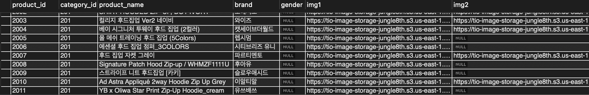
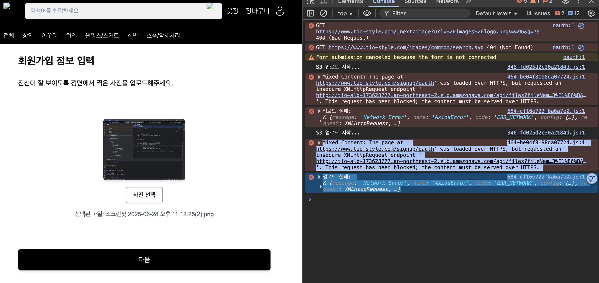
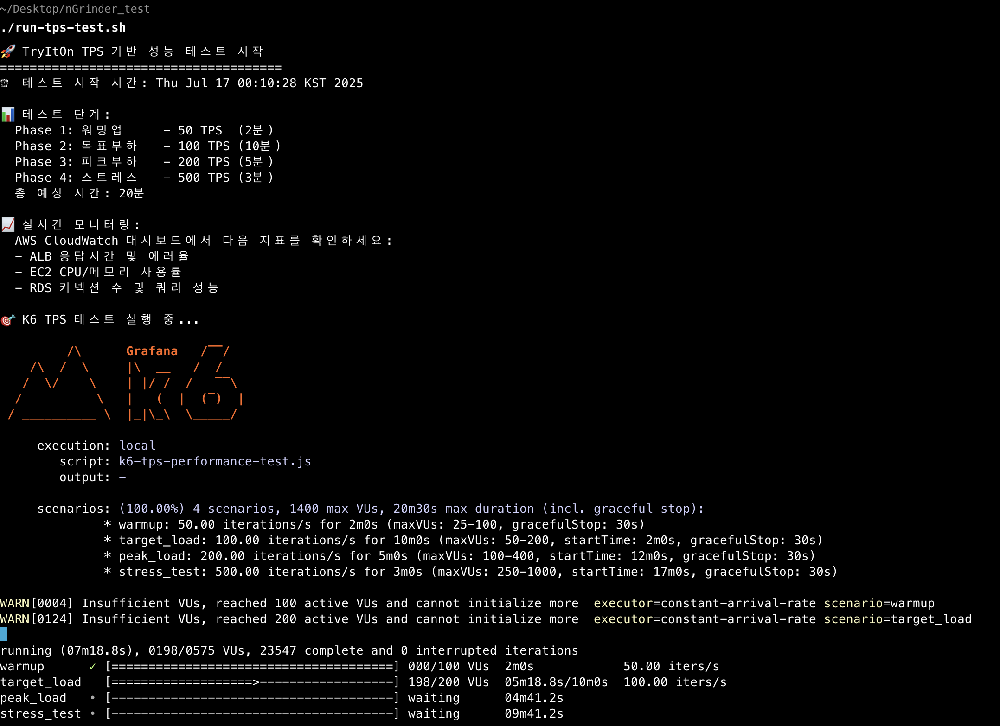
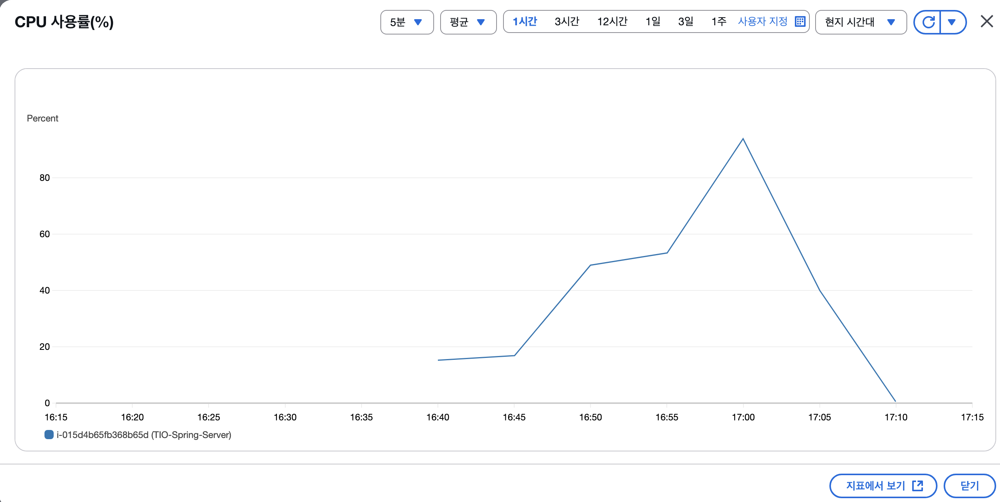

# 정글 프로젝트 기술 도전기

5개월간의 크래프톤 정글에서 진행한 **TryItOn (가상 피팅 서비스)** 프로젝트의 핵심 기술적 도전들을 정리했습니다.

---

## 1. Next.js CSR → SSR 마이그레이션

기존 S3 정적 배포에서 **Server-Side Rendering**으로 전환하여 SEO 최적화와 초기 로딩 성능을 개선했습니다.

### 배경
기존 CSR 방식의 한계점이 명확했습니다:
- 검색엔진이 빈 페이지만 크롤링
- JavaScript 다운로드 후 렌더링으로 초기 로딩 지연
- 소셜 공유 시 동적 메타태그 불가능

### 접근 방식
**하이브리드 아키텍처**를 설계하여 정적 파일과 동적 렌더링을 분리했습니다.

```
CloudFront 라우팅:
- /_next/static/* → S3 (정적 파일, 캐싱 최적화)
- /api/* → ALB → Spring Boot (기존 유지)
- /* → ALB → EC2 → Next.js SSR (새로 구축)
```

### 핵심 설계 포인트
- **CloudFront 캐시 전략 분리**: 정적 파일은 1년 캐싱, SSR 페이지는 캐싱 비활성화
- **PM2 클러스터 모드**: CPU 코어 수만큼 프로세스 생성으로 성능 최적화
- **무중단 배포**: CodeDeploy HalfAtATime 정책으로 점진적 배포

### 실제 구현
```typescript
// next.config.ts - 하이브리드 배포 설정
const nextConfig: NextConfig = {
  // output: 'export', // SSR 활성화를 위해 제거
  assetPrefix: process.env.NODE_ENV === 'production'
    ? 'https://tio-frontend-assets-jungle8th.s3.ap-northeast-2.amazonaws.com'
    : '',
};
```

```javascript
// ecosystem.config.js - PM2 클러스터 설정
module.exports = {
  apps: [{
    name: 'tryiton-frontend',
    instances: 'max',        // CPU 코어 수만큼 프로세스 생성
    exec_mode: 'cluster',    // 클러스터 모드 활성화
    max_memory_restart: '1G',
  }]
}
```

### 결과
- **SEO 최적화**: 서버에서 완성된 HTML 제공으로 검색엔진 크롤링 개선
- **초기 로딩 성능 향상**: JavaScript 다운로드 전에 콘텐츠 표시
- **동적 메타태그**: 상품별 개별 소셜 공유 메타데이터 생성

---

## 2. 이미지 시스템 연쇄 트러블슈팅

SSR 마이그레이션 후 이미지 관련 문제들이 연쇄적으로 발생했습니다. **S3 리전 오류 → Mixed Content → Next.js 최적화 충돌**까지, 단계별로 해결한 과정입니다.


### 배경
이미지가 전혀 표시되지 않는 상황에서 시작되었습니다:
- `/_next/image?url=...&w=1920&q=75` → 400 Bad Request
- Mixed Content 보안 오류
- 에러도 없이 그냥 빈 공간만 표시

### 접근 방식
**단계별 디버깅**으로 각 레이어의 문제를 순차적으로 분리하여 해결했습니다.

```
1. 원본 데이터 확인 (S3 직접 접근)
2. 서버 로직 확인 (ALB 직접 접근)  
3. 인프라 설정 확인 (CloudFront 경유)
4. 클라이언트 설정 확인 (Next.js 최적화)
```

### 핵심 설계 포인트
- **연쇄 문제 해결**: 하나의 문제 해결이 다음 문제를 드러내는 구조
- **환경변수 우선순위 이해**: Next.js 환경변수 로딩 순서의 함정
- **설정 파일 관리**: 주석 처리된 한 줄이 전체 시스템에 미치는 영향

### 실제 구현

#### 1단계: S3 리전 오류 해결
```sql
-- 21만건 이미지 URL 일괄 수정
UPDATE product 
SET 
    img1 = REPLACE(img1, 's3.us-east-1.amazonaws.com', 's3.ap-northeast-2.amazonaws.com'),
    img2 = REPLACE(img2, 's3.us-east-1.amazonaws.com', 's3.ap-northeast-2.amazonaws.com'),
    -- ... 모든 이미지 컬럼 수정
WHERE img1 LIKE '%s3.us-east-1.amazonaws.com%';
```



#### 2단계: Mixed Content 보안 오류 해결
문제의 핵심은 **Next.js 환경변수 우선순위**였습니다.

```
Next.js 환경변수 로딩 순서:
1. .env.production.local (가장 높음)
2. .env.local (모든 환경에서 로드) ← 문제!
3. .env.production
4. .env
```



`.env.local`의 개발용 설정이 프로덕션에서도 우선 적용되어 HTTP API를 호출하고 있었습니다.

#### 3단계: Next.js 이미지 최적화 문제 해결
```typescript
// 문제의 원인: 주석 처리된 한 줄
const nextConfig: NextConfig = {
  images: {
    // unoptimized: true, // 이게 주석 처리되어 있었다!
    remotePatterns: [
      {
        protocol: "https",
        hostname: "**", // 이것도 보안상 문제
      },
    ],
  },
};
```


### 결과
- **S3 리전 오류**: DB 21만건 URL 수정으로 완전 해결
- **Mixed Content**: 환경변수 구조 개선으로 HTTPS 통신 확보
- **이미지 최적화**: 설정 수정으로 S3 직접 로드 방식으로 전환
- **시스템 안정화**: 모든 이미지가 정상적으로 표시되도록 개선

---

## 3. TPS 성능 테스트 및 최적화 (144TPS 달성)

21만건 데이터 환경에서 **N+1 쿼리 문제**를 해결하고 인프라 최적화를 통해 목표 TPS를 44% 초과 달성했습니다.

### 배경
안정화된 인프라에서 실제 성능 한계를 측정해야 했습니다:
- N+1 쿼리로 인한 응답시간 지연
- t3.medium에서 CPU 100% 도달
- 피크 시 응답시간 30초까지 증가

### 접근 방식
**과학적 성능 분석**을 위해 실제 사용자 패턴을 반영한 단계별 부하 테스트를 설계했습니다.

```javascript
// 실제 사용자 행동 패턴 시뮬레이션
const USER_BEHAVIORS = {
  BROWSER: { weight: 80, actions: ['login', 'browse_products', 'view_detail'] },
  SHOPPER: { weight: 15, actions: ['login', 'browse_products', 'add_to_cart'] },
  BUYER: { weight: 5, actions: ['login', 'browse_products', 'checkout', 'payment'] }
};
```

### 핵심 설계 포인트
- **4단계 부하 테스트**: 워밍업(50) → 목표부하(100) → 피크부하(200) → 스트레스(500) TPS
- **실제 사용자 패턴**: 80% 브라우징, 15% 쇼핑, 5% 구매 비율 반영
- **비즈니스 지표 측정**: TPS뿐만 아니라 주문 TPS, 예상 매출까지 추적

### 실제 구현

#### 1차 테스트 결과 (110TPS)


- 평균 TPS: 110.01
- 평균 응답시간: 1330ms
- **병목 지점**: EC2 CPU 95% 도달

#### N+1 쿼리 문제 해결
```java
// 기존 코드 (N+1 쿼리 발생)
@GetMapping("/products")
public List<ProductDto> getProducts() {
    List<Product> products = productRepository.findAll();
    return products.stream()
        .map(product -> {
            // 각 상품마다 별도 쿼리 실행 (N+1 문제)
            List<Review> reviews = reviewRepository.findByProductId(product.getId());
            return ProductDto.from(product, reviews);
        })
        .collect(Collectors.toList());
}

// 해결책: JPA 페치 조인 적용
@Query("SELECT p FROM Product p " +
       "LEFT JOIN FETCH p.reviews " +
       "LEFT JOIN FETCH p.variants")
List<Product> findAllWithReviewsAndVariants();
```

#### 인프라 최적화
- **EC2 인스턴스 업그레이드**: t3.medium → c4.xlarge (CPU 집약적 워크로드 최적화)
- **Auto Scaling 튜닝**: CPU 70% → 60% (조기 스케일링), 쿨다운 300초 → 180초



### 결과

#### 2차 테스트 결과 (144TPS)
| 지표 | 1차 결과 | 2차 결과 | 개선율 |
|------|----------|----------|--------|
| 평균 TPS | 110.01 | 144.6 | +31% |
| 평균 응답시간 | 1330ms | 601ms | **-55%** |
| API 성공률 | 100% | 100% | 유지 |

- **목표 달성**: 100 TPS 목표 대비 **44% 초과 달성**
- **안정성**: 20분간 0% 오류율 유지
- **비즈니스 임팩트**: 예상 시간당 매출 723만원 처리 능력 확보

---

## 후속 고려 사항

각 시스템별로 추가 개선이 필요한 영역들을 정리했습니다:

### SSR 시스템
- **이미지 최적화 재도입**: S3에서 미리 최적화된 이미지 제공 또는 별도 최적화 서비스 구축
- **캐싱 전략 개선**: 사용자별 개인화와 성능 최적화의 균형점 찾기

### 이미지 시스템  
- **모니터링 강화**: 이미지 로딩 성능 메트릭 추적 및 알람 설정
- **환경 관리 체계화**: 환경별 설정 파일 표준화 및 문서화

### 성능 최적화
- **캐싱 레이어 추가**: Redis 기반 애플리케이션 레벨 캐싱 도입
- **데이터베이스 최적화**: 읽기 복제본 구성 및 쿼리 성능 지속 모니터링

---

*"5개월간의 정글 여정에서 가장 값진 경험은 단순히 기술을 배운 것이 아니라, 실제 서비스를 운영하며 마주하는 복합적인 문제들을 체계적으로 해결하는 방법을 익힌 것이었습니다."*
