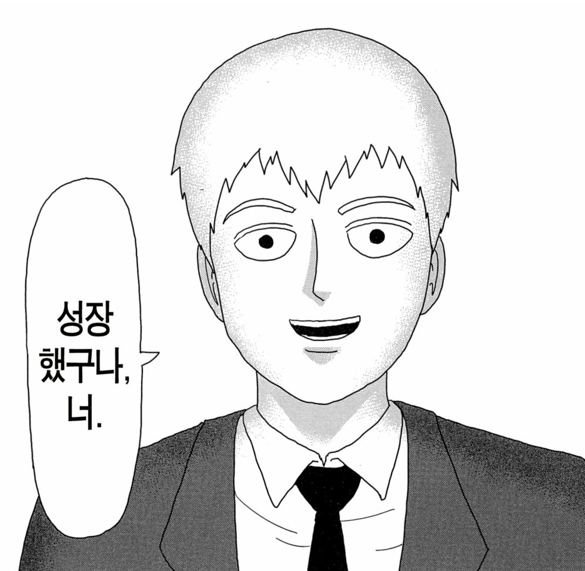
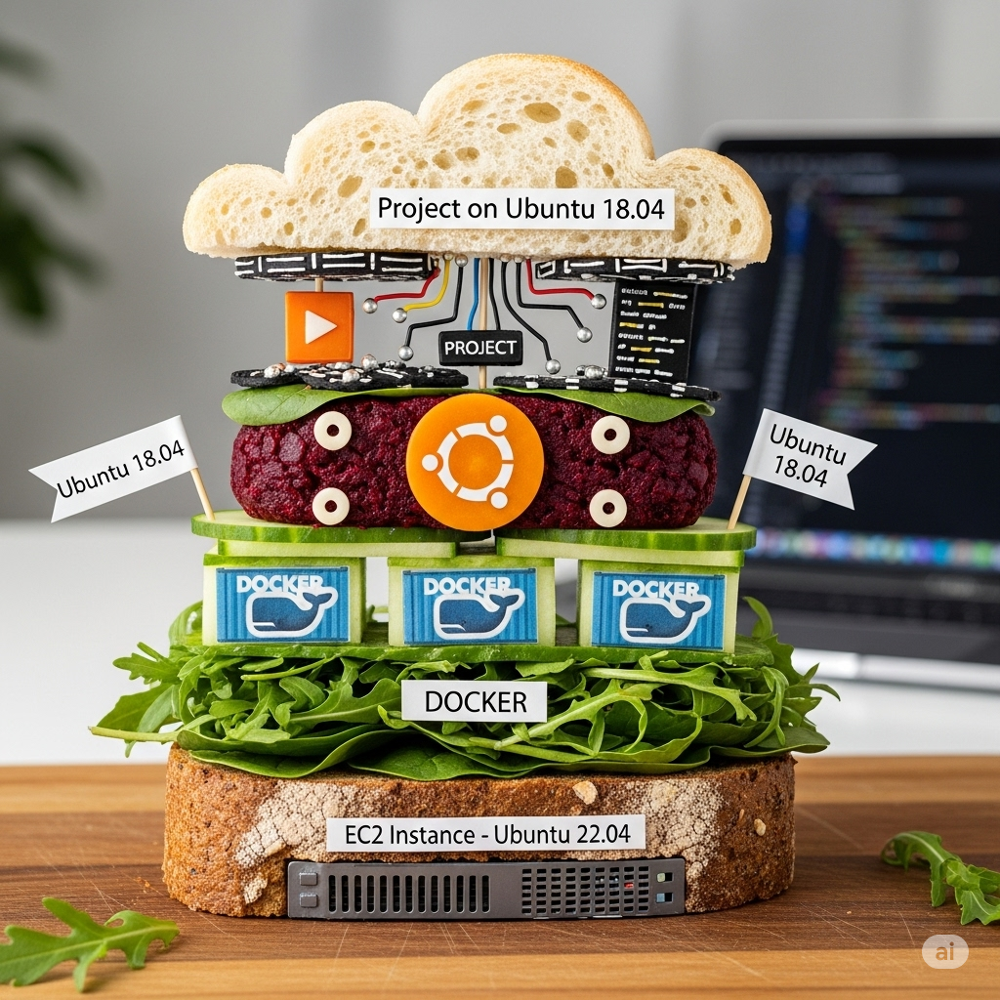
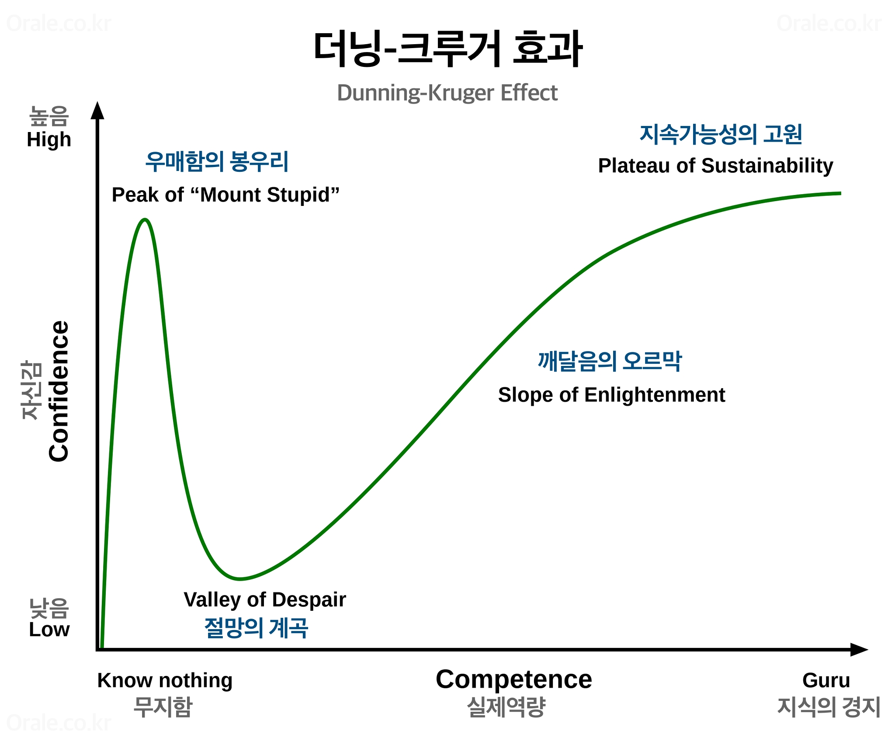
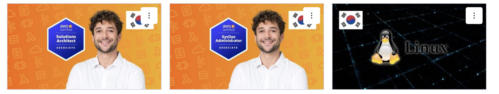
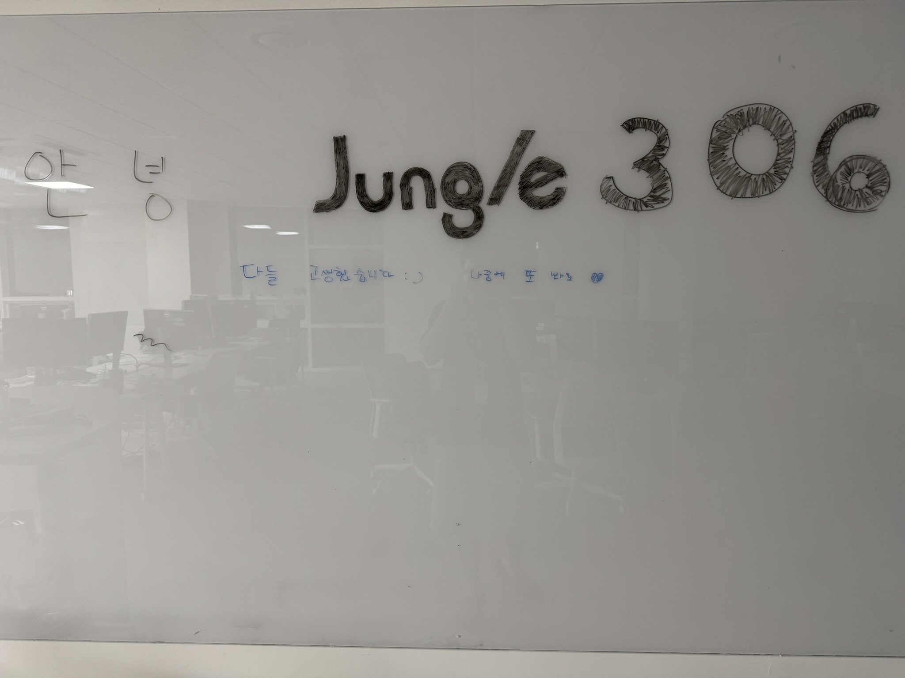
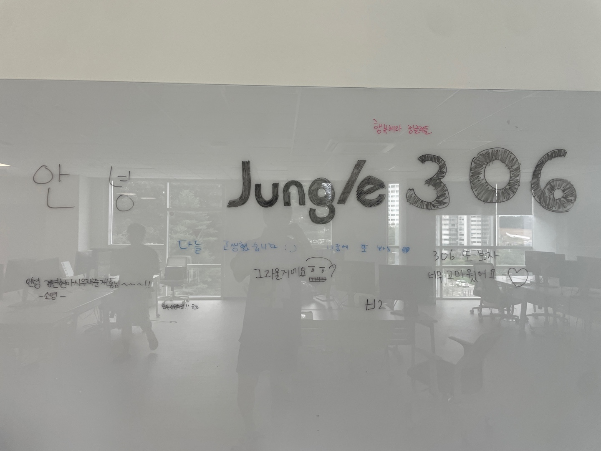

# 정글 수료 후 작성하는 회고


3.10(월) - 7.31(목)의 5개월간의 크래프톤 정글 8기의 수료식을 마친지 만으로 3일이 지났다.

정글측의 배려로 8.13(수)까지는 남아서 여러 준비를 할 수 있어서 교육장에 남아있지만.  
교육기간 내내 북적이던 장소가 10명 남짓 남아있는 모습을 보니 같은 공간이면서도 사뭇 다르다.

이력서, 포트폴리오, 자격증공부, 코테, 프레임워크 학습, 정글에서의 공부 복습 등 해야할 일이 산재해있지만, 블로그에 과정중의 내 어떤 감정이나, 소감등을 적어본게 없는 것 같고. 끝을 돌아보는 것도 좋을 것 같아 적어본다. _(새벽이라 센치해서 적는건 절대 아님, 진짜로.)_

## 먼저 현재

서두에서 언급했듯이 얼마전까지처럼 누가 정해주지는 않았지만, 나 스스로의 할일이 매우 산재해있다. 목적지는 **취업**이라는 어떻게보면 진부하지만, 중요한.

그래서 집으로 돌아가서 바로 쉬기보다는 정글에서 부여한 유예기간동안 생활/학습패턴유지, 교육생들과의 네트워킹, 정보공유, 현장 코치님들의 밀도있는 피드백 등의 수혜를 얻고자 아득바득 남아있는 상황이다.

그러면서 이력서를 적으면서 필연적으로 과정들을 돌아보게되었는데.

결과부터 이야기하자면, `내가 할 수 있는 최선을 다했다` 였다.

### 그렇다고 '아쉬움이 남지않느냐?'

라고 누군가 물어본다면 꼭 그렇진않다. 매 순간에 사람은 자신이 믿고 생각하는 최선의 선택으로 행동하고, 그 결과가 아무리 좋아도, 뒤돌아보면 아쉬운점은 분명히 있기마련이다.

### 그럼 왜 최선을 다했다고 판단하지?


출처: [정글 커리큘럼](https://jungle.krafton.com/program/info)

그냥 IT에 관심있는 일반인정도의 지식수준에서 전공생 1학년?(내 개인적인 판단이다) 정도의 의사소통능력과,

이러니 저러니해도 마지막의 5주의 프로젝트 기간에서. 팀원들에게 피해끼치지않고 목표달성에 기여해, 보여주기 민망하지 않은 결과물을 냈다면 그거야말로 최선을 다한게 아닐까? 라고 자축해본다.

> 프로젝트를 보고싶다면 [이곳](https://jungle.krafton.com/board/project/read/215)에서 시연 영상을 볼 수 있다.

그럼 현재는 잠깐 멈추고, 막 입소한 시기부터 지금까지 회고해본다.

## 정글의 주차별 과정

과정은 아래와 같았다.

```
WEEK00 : 정글 입성
➡️ 프로그램의 취지를 이해하고, 입학시험에서 공부한 내용을 바탕으로 압축된 팀프로젝트를 경험합니다. 단 시간 내에 팀원들과 몰입하여 성장하는 습관을 길러봅니다.

- WEEK00 : 정글에 적응하고, 미니 웹 프로젝트 완성하기

WEEK01 ~ WEEK04 : 컴퓨팅 사고로의 전환
➡️ 기본 교재를 토대로, 문제를 풀어가며 자료구조와 알고리즘을 공부합니다. 이미 익숙한 언어인 파이썬으로 진행합니다. 필요한 문법을 더 찾아가며 공부해보세요.

- WEEK01 : 정수론, 배열, 문자열, 재귀함수, 정렬, 완전탐색, 시간복잡도
- WEEK02 : 이분탐색, 분할정복, 스택, 큐, 우선순위 큐
- WEEK03 : 그래프(vertex, edge, node, arc), BFS, DFS, 위상정렬
- WEEK04 : 동적 프로그래밍, 그리디 알고리즘

WEEK05 ~ WEEK08 : 탐험 준비
➡️ C언어를 친구로 만들고, 그 과정에서 자료구조 심화, 웹서버, 네트워크 등을 공부합니다.

- WEEK05 : C자료구조 구현
- WEEK06 : RB트리 프로젝트
- WEEK07 : Malloc lab
- WEEK08 : 웹 프록시 서버

WEEK09 ~ WEEK13 : 정글끝까지
➡️ 전산학부 과정의 꽃, OS프로젝트를 진행합니다. 풀리지 않는 어려운 문제를 마침내 풀어가는 경험을 해보세요. 이후 어떤 문제를 만나도 두렵지 않은 개발자가 될 수 있습니다.

프로젝트 별 일정
- WEEK09: project1
- WEEK10~11: project2
- WEEK12~13: project3

WEEK14 : 실력 다지기
➡️ 자료구조/알고리즘 문제를 다시 풀며 개념을 복습하고, 프로젝트에 사용될 프레임워크(Spring, Node.js, React 중 택1)를 익힙니다.

- WEEK14 : 알고리즘 복습 / 프레임워크 학습 / 나만무 팀형성

WEEK15 ~ WEEK19 : 나만의 무기를 갖기
➡️ 실제 현업에서 쓰는 프레임워크와 언어를 이용하여, 5주 동안 멘토의 지도 하에 팀 프로젝트를 수행합니다. 세상에 의미있는 서비스를 만들어 모든 협력사가 모인 자리에서 발표합니다.

- WEEK15 : 프로젝트 기획
- WEEK16~17 : 프로젝트 개발 (MVP)
- WEEK18~19 : 프로젝트 개발 (폴리싱)
- 최종 발표회 : WEEK19 토요일

WEEK20 : 세상으로 뛰어들기
```

## 0주차 정글 입성


간소한 입소식 및 각 반에서의 안내 후에 바로 조별 `미니 웹 프로젝트`를 진행했다.

하나의 작업물을 완성하기위해 다수와 함께하는 첫 협업에(내가 하던 그런 의사소통 위주의 협업과는 다르다) 코딩 경험이라고는 인강들으며 클론코딩하고, `우테코 프리코스`, `정글 입학과제` 정도인게 전부인 나에겐 정신이 나가 버릴 것만같았고.

여기서 기존에 일하면서도 그랬지만, 수료시까지 이어져온 하나의 다짐을 다시 하게된다

> 몇인분을 할 수 있을진 모르겠지만, 팀원들에게 민폐가 되지않도록 하자.


_첫째날의 교실 전경. 다들 나가고 혼자 남은 모습이다._

과제가 시작하고 끝나는날까지 교실의 불을 끄고 나왔다. (마지막날에는 일찍 마무리되어 `비교적` 일찍 나갔다)

그러한 노력을 알아서일까? 0주차의 프로젝트는 상당히 무난하게, 잘 흘러갔다.

### 그래서 미니 프로젝트는 무얼했을까?

> 챌린지에 참여하고, 함께한 동료와 커피를 마시자!

라는 캐치프레이즈로, 각자가 정한 챌린지로 달성여부를 서로 확인하고 챌린지 참여유저와 자연스럽게 커피챗으로 연결될 수 있도록 하는 서비스였다.

지금 돌이켜보면 특별할 것 없는, 입학과제에서 조금 더 심화된정도의 CRUD board 수준이긴하였지만. (하지만 당시 팀원들끼리 나중에 pintos과정 등 힘들때 '그때가 재밌었는데'라면서 이야기하곤 했다)

어찌되었건 우리는 아래와 같은 느낌의 서비스를 만들었고,

> 당시 프론트엔드 경험이 많던 팀원이 짜준 와이어프레임, 거의 동일하게 결과물이 나왔다

나중에 다른 반 동기들끼리 '0주차때 뭐 했었지?'라고 서로 물어봤을때 (대부분 서로 안면이 트이지 않았던 시기라 서비스만 기억나는정도였음) '커피챌 했었어' 라고 답하면 '아 그거 가장 인상깊었다.' 라는 답변이 나올정도로 다른조 결과물에 비해 만족스러웠다.

또 협업 경험이 없던 내가 무난하게 1인분(?)을 할 수 있게 해준 요인중에 하나는 같은조 동료덕분이었던 것 같다.

나이차이가 많이 나서 나를 불편해 할 까봐 부담스러워 하던 나에게, 두명의 팀원은 오히려 자신이 가진 협업 경험들을 살려 서로를 이끌어주었고 나는 00년의 사회생활 경험을 살려 충실히 **따라가는데**에만 집중할 수 있던 것 같다.

## 1-4주차 자료구조, 알고리즘

먼저 이 시기를 정리하자면


### 가장 심리적으로 많이 흔들린 시기


특히 1주차가 그랬다.

일단, 경력 전환을 하기로 결심한 시점부터 시작점이 다름을 인정한 상태였다.

바뀐 팀원으로 인한 생소한 환경, 두 팀원의 빠른 문제풀이 진도(+ 다른 동기들도) 등등 여러 요소가 맞물려 '**시작이 다름을 인정하자, 
느려도 꾸준히 가면 종착지는 달라도, 나아가는 것은 맞다**' 등등 계속 스스로 긍정적으로 생각하려는 노력이 가장 많아질 정도로 혼란스러웠다. 군에서 온갖 ~~부조리~~와 ~~인간말종~~, 고강도업무 등으로 스트레스 저항이 높다고 스스로 자부함에도.

그 주차가 끝날 즈음에는 불안이 폭발하기 직전이었다. 극단적으로는 '이걸 수료할 시점에는 채용시장에서 이 친구들과 나를 비교하게 될텐데, 내가 이들보다 나은게 뭐지? 나이도 나보다 어리고, 다들 전공 혹은 부전공자들인데?' '꿈이었다는 이유로 이미 안정적인 궤도에서 탈선하고 이 시기에 이걸 하는게 맞나?' 라는식으로 생각하기 일쑤였다.

### 에세이로 정리한 마음

사실 그 불안감은 0주차가 마무리되는 목요일에 이미 시작되고있었다. 1주차가 시작할 때 정글에서 제시한 에세이 과제가 있었는데, 평소에 글쓰기라고는 업무기록밖에 없었던 내가 
막상 쓰니 그 당시의 불안을 잔뜩 담은 [글](https://ash-act-9e0.notion.site/1b5e0d05437c80879da9d79840fcf705?pvs=143)이 나왔다.

### 5개월을 평가하면?

에세이에서 적은 `앞으로는?`에 대해

민폐가 되지 않도록 발버둥쳤는가? → 🙆‍♂️

5개월 전보다 나아졌는가? → 🙆‍♂️

아직도 불안한가? → 어쩔수없지만 그것도 🙆‍♂️

아직도 언어들이 미숙하지만 python, C, java로 코드를 작성하는 경험을 하였고. AI를 학습 동료 또는 도구삼아 원하는 결과를 받을 수 있도록 핸들링하는 능력을 얻었고. 과금될까봐 겁먹고 설정하던 AWS는 특정 기능들에 한해서는 익숙해졌다. 그리고 이 과정에서 가장 기대하던 부분인 CS 학습도, 단순 지식으로만 접하기에는 진입장벽이 있었는데 알고리즘 풀이, CS:APP, Pintos 실습을 통해 앞으로의 학습 기틀을 마련할 수 있었다.

아무튼 당시 에세이때문에 갑자기 총평을 하게된것 같은데 계속 넘어가보자.

### 그래서 이후 학습은?

고민이 많아질 즈음 코치님과 커피챗을 가졌고, 고민을 터놓음으로서 어느정도 불안에 대한 해소. 긍정으로의 사고 전환. 불안은 아무것도 바꾸지 못한다는 그런 스탠스를 가질 수 있었다.

그래서 점점 더 어려워지는 커리큘럼 특성상 당연히 더 풀이 속도가 늦어질 수 밖에 없을것이라는것을 명확히 인지하고.

몰입 또는 문제해결능력을 기준으로 하였을 때는 하나의 문제를 파고들어서 푸는것도 좋지만, 순서대로 하다가는 뒷 주제의 자료구조 학습을 놓칠 수 있기 때문에. 주차별로 키워드가 되는 자료구조 / 알고리즘의 가장 낮은 난이도 - 중간난이도의 문제를 먼저 풀고 여유가 된다면 다시 처음부터 그 높은난이도를 푸는 식으로 문제를 해결했다.

### 극복하기

5개월이라는 짧지만 긴 마라톤을 클리어하기위해서는 정신/육체의 건강이 따라가야한다고 생각했다.

그래서 시설을 활용해서 하루에 한번은 운동을 챙기고, 가끔은 동기들에게 크로스핏을 전도하기도 했다.


(물론 뒤로 갈수록 패턴이 깨지려고하지만, 되도록이면 지키려고 노력했다. 거의 매일 밤새던 나만무 기간에는 작업기한때문에 거의 못지켰다..)

## 5-6주차 자료구조 심화

이때는 그간 배운 자료구조의 심화과정이면서 Pintos 실습을 하기 전 C에 대한 익숙함을 가져가는 과정이었다. C로 linked list, 우선순위 큐, Red-Black Tree 문제를 풀어보았다.

### C에 대한 두려움

저수준 언어임에 비교적 불친절한 문법과. `포인터`, `구조체` 등 진입장벽이 높은 것으로 유명해 지레 겁먹었었으나, 꾸준히 읽던 CS:APP를 통해 GCC가 전처리기 → 컴파일러 → 어셈블러 → 링커를 통해 실행가능 목적파일로 컴파일하며.

그 중간에 어셈블리코드는 어떤식으로 구성되어 어떻게 메모리를 읽고 동작하는지에 대해 알아보며 처음보다는 덜 두려워지게되었다.

(아직도 포인터가 헷갈리긴하다 😅)


C 포인터에 대한 meme, 우리반 슬랙에 이런 짤들이 돌곤 했다

## 7-8주차 Malloc, Web proxy server

### 키워드

```
3way 핸드셰이크, 바이트스트림, Socket API, 참조모델, FD / FD table, CGI, Client-Server model, Datagram(socket), DNS, Encapsulation/Decapsulation, HTTP, MAC Address, MIME Type, OSI 7 layer, packet, Router, Socket, Stream Socket, TCP, UDP, Webserver
```

### Malloc Lab

여기서는 이전에 자료구조를 하며 c에서 사용하던 malloc(memory Allocation)을 직접 구현하는 과정이었다. implicit, explicit, Segregated Free list 각 세 방식에 대해서 구현해본다.

구현하며 메모리의 단편화 / 탐색 속도를 개선하기 위해 First/next/best-fit 정책들도 각각 적용해 볼 수 있었다.

구현 과정 자체는 CSAPP 내에 잘 나와있었지만, CS 지식과 접목하여 이해하면서 진행하느라 진도가 좀 더딘면이 있었다 (언제는 안그랬는가 싶긴하다.)

그 과정에서 가상메모리, 페이징, 메모리 매핑에 대해서 알아보았고, 구현 자체는 절반의 구현만 완료하고 segregated 방식은 직접 접목해보지 못하였다.

그래도 ? 걱정했던 것 보다는? 책이 친절해서 무난하게 따라가지않았나? 결국은 코드도 코드이지만, 모든걸 다 챙길수 없었기때문에 CS적 관점에서 어떻게 동작하는지? 왜 이렇게 구현을 하는지. 기법들과 원리들에 대해서 좀 더 포커싱을 맞췄었다.

### AWS 인프라 인연의 시작

이 주차였나, 이전 C의 시작인 malloc때였는지는 기억이 모호하다.  
정글에서는 Pintos 과정을 위해서 미리 Ubuntu18.04버전의 환경설정을 하도록 요구했었다.

Jungle측에서 친절하게도, 어떤 이미지를 사용해서 EC2를 구성하고 어떻게 초기설정을 하고 프로젝트를 진행하면 되는지를 다 제공을 해줬기 때문에 그대로 따라하...다가.. SFTP방식을 쓰는게 마음에 들지 않아  

로컬 환경에서 VSCode의 `Remote SSH`를 사용하여 쓰고싶었기 때문에, 연결을 하려고했으나 실패했다. 원인은 `glibc` 버전 미지원.

Ubuntu 18.04 LTS의 내장 glibc는 2.27버전이고, Remote SSH는 25년 3월부 지원하는 최소버전이 2.28이었던 것이다.

### 그래도 들이받기

다들 docker로 로컬에서 18.04환경을 조성해서 하고있었지만, '이왕 시작했고, 이후에 팀 프로젝트로 들어갔을때 내가 해놓으면 팀원들에게 도움이 되지 않을까?'라는 마인드로 끝까지 해봤다. 그리고 노트북 리소스(많은 램 점유율)때문에 온프레미스에서는 도커를 쓰기싫었다. 뭐 잘 기억은 나지않지만 시도해봤던 방법들중에는

EC2 내부에 glibc 버전을 강제로 올리거나, Remote SSH 실행시 2.28버전인 것 처럼 인식하도록 우회하거나, EC2 내부에 VSCode 서버를 수동으로 설치하거나 등등..

### 찾은 해결책

그 당시 가상화, 도커 컨테이너 등에 대해서 막 학습했던 시점이라. 결국  
'VScode가 연결하는 서버가 18.04라서 연결이 안되는거라면, 22.04의 최신 버전으로 EC2를 열고 연결을하고.  
서버 내부의 작업영역에는 Docker에 Ubuntu 18.04를 올려서 작업하면 되는거 아닌가?'  
라는 발상에 이르렀다. 그래서 찾아보니 이미 선구자가 있었다.

[takealittle.time님의 velog](https://velog.io/@takealittletime/AWS-EC2-docker%EB%A5%BC-%ED%99%9C%EC%9A%A9%ED%95%9C-ubuntu18.04-%EA%B0%9C%EB%B0%9C%ED%99%98%EA%B2%BD%EC%9D%98-%EA%B5%AC%EC%B6%95)

그래서 나의 상황에 맞게 환경구성을 하고, 노션 문서화해서 동기분들을 위해서 공유했다.  
(당시 작성한 노션 <https://ash-act-9e0.notion.site/EC2-Docker-Ubuntu-18-04-GitHub-Mirror-1d8e0d05437c8063b33cc3622112861b?source=copy_link>)

### 줄어든 AWS와의 심리적 간격

대부분의 동기들은 AWS에 대한 경험이 없거나, 있어도 경제적인 이슈로 인해 사용에 대한 불안, 두려움, 공포를 가진편이었다. 나 또한 그랬고

이 경험을 통해 그 두려움이 대폭 감소하는 계기가 되어서, 이후 마지막 프로젝트 과정인 `나만의 무기 만들기` 주차에 인프라 구축을 담당하게 되었을때 어려워하거나 좌절하지않고. 빠른 목표달성을 위한 원동력과, 트러블 슈팅 발생시 해결할 때 까지 붙들 수 있었던 내구력의 기틀이 된 것 같다.

### 아쉬움이 남는 Web proxy Lab

개인적으로 아쉬움이 많이 남는 과정인데(커리큘럼의 문제가 아닌 내 학습에서), 네트워크가 메인이다보니 다른것들에 비해 더 생소함이 커서 더더욱 진도가 더뎠었다.

이론적인 측면에서는 네트워크계층(참조모델) / Client-Server model, 소켓 통신, FD, HTTP, Proxy등 에 대해서 학습을 했는데

지금 당시 기록을 돌아봐도 아직은 난해하고 깊게 이해하지 못한바 있어서 이 부분을 중점적으로 다시 볼 필요가 있다고 느끼고, 현재는 틈틈히 `TCP/IP Illustrated`와 `Computer Networking 하향식 접근` 이라는 책을 통해 학습하고있다.


## 다시 돌아와 지금

그래서 지금 나의 상태는 

### 5개월 전에 비해서 나아졌느냐?

> 당연히 많이 나아갔다




하지만, 딱 우매함의 봉우리를 건너고 **`깊은`** 절망의 계곡에 들어온 기분이다.  
정글을 들어오기 전 **아무것도 모르는 백짓장** 같은 나 보다는 `해 본것`은 많아졌지만,

정작 자신있게 **저 이거 잘 알아요** 라고 하기에는 많이 부족함을 절실히 느끼고있다. 한번 해본것과 잘 아는것은 명백한 차이가 있지않은가?

그리고 해본것에 더해서, 뭔가 다들 기본역량으로 갖추고있는것 같은 다양한 언어 또는 기술스택, 알고리즘풀이역량, 프로젝트 경험 심지어 자격증까지 뭐 하나 나은게 없다고 생각하니. 갈길은 멀고 많이 조급해지는 기분이 든다.

### 앞으로는

**가장 먼저**, 정글에서의 학습을 먼저 복습하는 것. 기억은 한번 보고 다시 보지않으면 금방 휘발되기때문에. 새로운 것을 받아들이기보다는 일단 이 부분에 대해서 집중을 하고. (정처기 실기도 같이 쳐낼 예정이다. 이젠 보내줘야지)

**두번째로**, 이번에 프로젝트를 하면서, 성능개선을 위해 다양한 방식이 있지만 어플리케이션 측면에서 쿼리튜닝을 통해서도 많은 것을 할 수 있다는 것을 알게되어서  
그 부분을 공부하고, 이를 원동력 삼기위한 조건을 달기위해 SQLD를 학습하고(이미 접수를 마쳤다.)

**셋째로**, 위에서는 이야기하지않았지만 프로젝트를 하면서 인프라, CICD를 먼저 도맡아 하고 그 마지막에 팀원들이 짜놓은 코드를 통해 성능개선을 했던터라. 언어나 프레임워크에 대해서는 학습할 여지가 많이 적었다. 그래서 그 부분을 보완해야하고. (Java, Spring, JPA 등)

**마지막으로**, 막상 인프라 해보니 재밌더라. 동기중에 DEVOPS에 관심있는, 잘 하는 친구와 함께 AWS와 linux에 대해 같이 학습하고자 한다. SSA(Solution Architect Associate), SAA(SysOps Administrator Associate)

가능하다면 Terraform이나 K8S도..


*이미 udemy 강의도..*

## Fin


*아쉬운 마음에 칠판에 낙서를 했다*


*수료 이후 13일까지 남아있던 친구들이 적어준 댓글들*

이걸 어떻게 끝내야할지 모르겠는데. 5개월간 진짜 거의 매일같이 밤샜다. 뭐 밤새는게 익숙하기도했고.. 근데 `하나도 안힘들었다` (앞에서 징징대놓고) 진짜 즐거운 5개월이었다. 수료하고 헤어지는 순간이 안왔으면 좋겠을 정도로..  
다른 동기들처럼 대학 막 졸업하고 온 시점이었으면 테크랩이나 게임랩도 지원해서 가고싶을정도로 모든 배움과 코치님이나 동기들과 함께하는 모든 순간이 유익하고 즐거웠다. 


나에게는 이제 `온전히 학습`에만 몰입할 수 있는 `마지막` 경험이었고, 그 시간을 `온전히 가치있게 보냈다`고 장담하는 것으로 마무리하겠다.