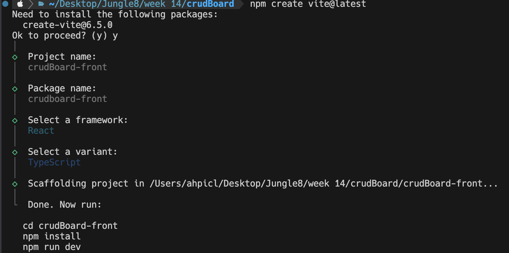
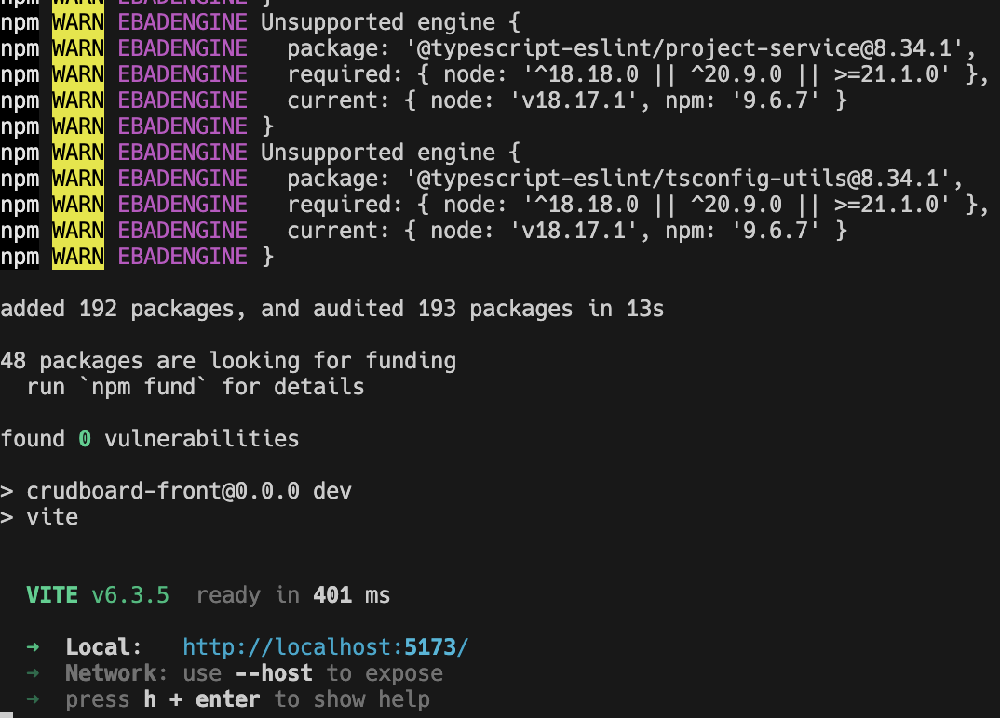
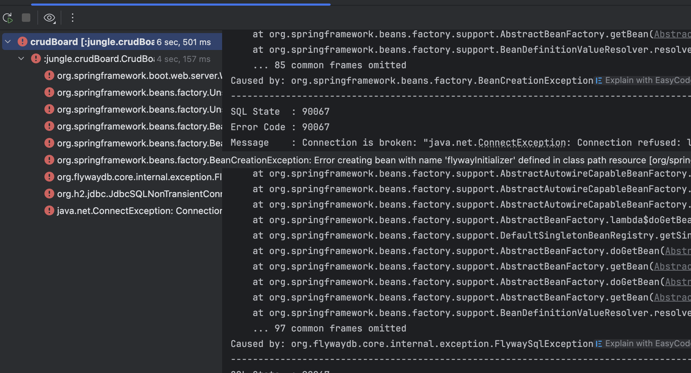
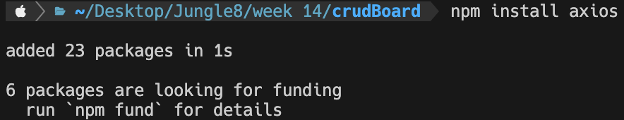
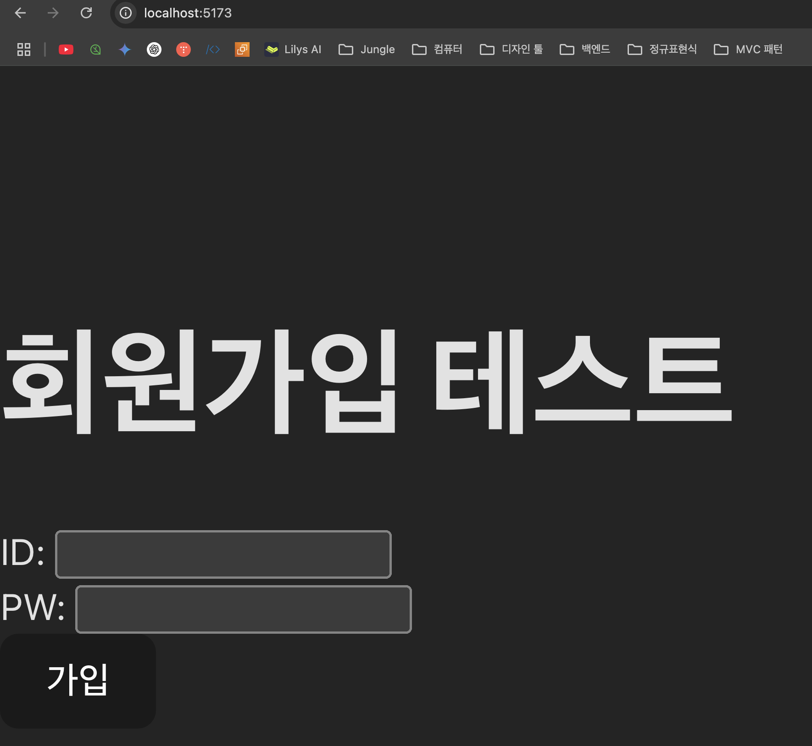
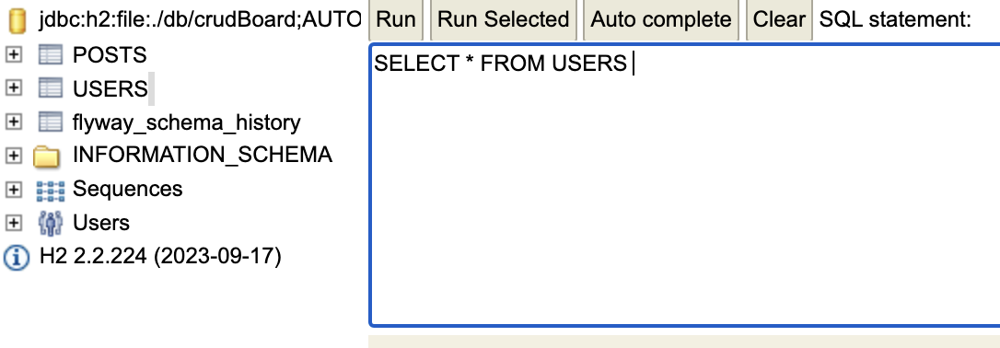
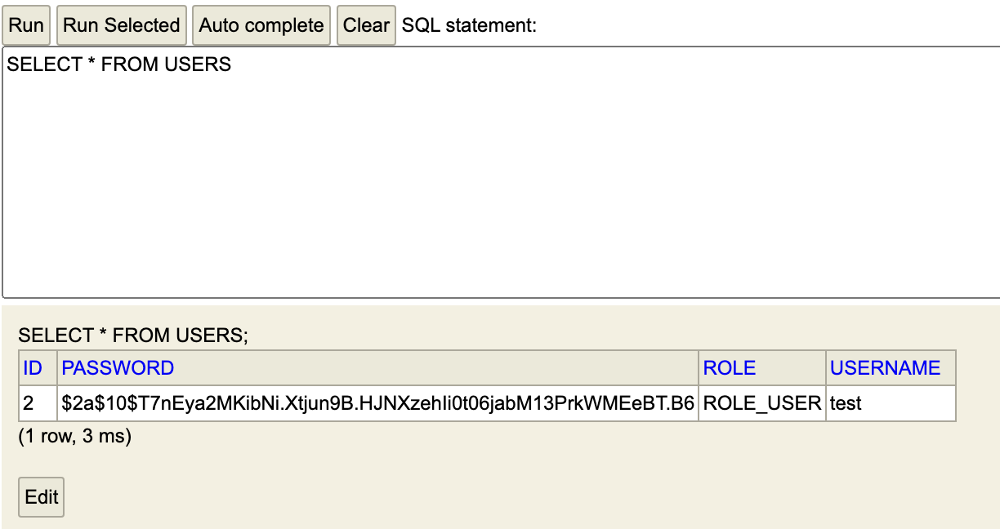

# 리액트(React) 환경설정 및 Spring Boot 연동

이전 포스팅에서는 Spring Boot를 사용하여 백엔드 서버를 구축하고 기본적인 설정을 마쳤다. 이제 사용자가 직접 마주할 화면, 즉 뷰(View)를 만들기 위해 프론트엔드 라이브러리인 리액트를 설정하고 기존 백엔드와 연동하는 과정을 정리해보고자 한다.

여기서 중요한 점은, Spring Boot 백엔드는 이제 화면을 직접 만드는(Thymeleaf) 역할이 아니라, **데이터만 제공하는 순수한 API 서버의 역할**을 맡게 된다는 것이다. 그리고 리액트는 그 API를 호출하여 데이터를 받아와 화면을 동적으로 그려주게 된다.

## 목차

- 프론트엔드 개발 환경 준비
- 리액트 프로젝트 생성 (Vite 사용)
- Spring Boot 백엔드와 연동하기 (CORS 설정)
- 리액트에서 API 호출 테스트

#### 백엔드와 연동

이제 리액트포트 5173, 스프링포트 8080 두 곳을 연결해줄 차례이다.  
바로 통신을 할수 없는게 CORS(브라우저 보안정책)으로 인해 별도 설정없이는 차단된다. 먼저 spring boot로 가서
리액트는 JavaScript 라이브러리이므로, 이를 실행하고 관리하기 위해 **Node.js**와 **npm**(Node Package Manager)이 필요하다.

- [Node.js 공식 홈페이지](https://nodejs.org/)에 접속해서 **LTS 버전**을 다운로드하여 설치해준다. (LTS 버전이 안정적이므로 추천함)

설치가 완료되면 터미널을 열고 아래 명령어로 버전이 제대로 출력되는지 확인한다.

```bash
node -v
npm -v
```

위 사진처럼 각자의 버전이 보이면 성공적으로 설치된 것이다.

## 리액트 프로젝트 생성하기

과거에는 `create-react-app`을 주로 사용했지만, 지금은 **Vite**라는 도구를 사용하는 것이 훨씬 빠르고 현대적인 방법이다.

터미널에서 리액트 프로젝트를 생성하고 싶은 경로로 이동한 후, 아래 명령어를 입력해주자.

```bash
npm create vite@latest
```

명령어를 실행하면 몇 가지 설정 질문이 나오는데, 순서대로 원하는 프로젝트 이름과 프레임워크(`React`), 언어(`JavaScript` 또는 `TypeScript`)를 선택해주면 된다.



프로젝트 생성이 끝나면 터미널의 안내 메시지에 따라 아래 명령어들을 실행해준다.



```bash
# 1. 생성된 프로젝트 폴더로 이동
cd your-project-name

# 2. 필요한 라이브러리 설치
npm install

# 3. 리액트 개발 서버 실행
npm run dev
```

`npm run dev`를 실행하면 `localhost:5173` 같은 주소로 개발 서버가 열리고, 브라우저에 리액트 초기 화면이 보이면 프로젝트 생성이 완료된 것이다\!
이 개발 서버는 앞으로 프론트엔드 코드를 수정할 때마다 자동으로 변경사항을 반영해주므로, 계속 켜두고 개발을 진행하면 된다.

## Spring Boot 백엔드와 연동하기 (CORS 설정)

이제 막 생성된 리액트 앱(예: `localhost:5173`)에서 Spring Boot API 서버(`localhost:8080`)로 데이터를 요청하면, 브라우저는 기본적으로 이 요청을 차단한다. 보안상의 이유로 다른 출처(Origin)의 리소스를 함부로 요청할 수 없게 막는 **CORS(Cross-Origin Resource Sharing) 정책** 때문이다.

따라서 Spring Boot 서버에서 "리액트 앱에서 오는 요청은 허용해줘\!" 라고 별도로 설정을 해주어야 한다.

`Spring Boot 프로젝트`에 `security` 패키지의 `SecurityConfig` 클래스를 수정해주자.

```java
package jungle.crudBoard.security;

import java.util.List;
import lombok.RequiredArgsConstructor;
import org.springframework.context.annotation.Bean;
import org.springframework.context.annotation.Configuration;
import org.springframework.security.config.annotation.web.builders.HttpSecurity;
import org.springframework.security.config.annotation.web.configuration.EnableWebSecurity;
import org.springframework.security.config.http.SessionCreationPolicy;
import org.springframework.security.crypto.bcrypt.BCryptPasswordEncoder;
import org.springframework.security.crypto.password.PasswordEncoder;
import org.springframework.security.web.SecurityFilterChain;
import org.springframework.security.web.authentication.UsernamePasswordAuthenticationFilter;
import org.springframework.web.cors.CorsConfiguration;
import org.springframework.web.cors.CorsConfigurationSource;
import org.springframework.web.cors.UrlBasedCorsConfigurationSource;

import static org.springframework.boot.autoconfigure.security.servlet.PathRequest.toH2Console;

@Configuration
@EnableWebSecurity
//@RequiredArgsConstructor
public class SecurityConfig {

    private final JwtAuthenticationFilter jwtAuthenticationFilter;

    public SecurityConfig(JwtAuthenticationFilter jwtAuthenticationFilter) {
        this.jwtAuthenticationFilter = jwtAuthenticationFilter;
    }

    @Bean
    public SecurityFilterChain securityFilterChain(HttpSecurity http) throws Exception {
        http
                .csrf(csrf -> csrf.disable()) // CSRF 보호 비활성화
                .headers(headers -> headers.frameOptions(frameOptions -> frameOptions.sameOrigin()))
                .cors(cors -> cors.configurationSource(corsConfigurationSource()))
                .sessionManagement(session -> session.sessionCreationPolicy(SessionCreationPolicy.STATELESS)) // 세션 사용 안함
                .authorizeHttpRequests(auth -> auth
                        .requestMatchers(toH2Console()).permitAll()
                        .requestMatchers("/api/auth/**").permitAll() // '/api/auth/' 경로는 인증 없이 허용
                        .anyRequest().authenticated() // 나머지 모든 경로는 인증 필요
                )
                .addFilterBefore(jwtAuthenticationFilter, UsernamePasswordAuthenticationFilter.class); // 직접 만든 필터를 추가

        return http.build();
    }

    //여기서 CORS 세부 설정
    @Bean
        public CorsConfigurationSource corsConfigurationSource() {
            CorsConfiguration configuration = new CorsConfiguration();

            configuration.setAllowedOrigins(List.of("http://localhost:5173"));
            configuration.setAllowedMethods(List.of("GET", "POST", "PUT", "DELETE", "PATCH", "OPTIONS"));
            configuration.setAllowedHeaders(List.of("*"));
            configuration.setAllowCredentials(true);

            UrlBasedCorsConfigurationSource source = new UrlBasedCorsConfigurationSource();
            source.registerCorsConfiguration("/api/**", configuration);
            return source;
    }

    @Bean
    public PasswordEncoder passwordEncoder() {
        return new BCryptPasswordEncoder();
    }
}
```

위와 같이 설정 파일을 추가한 후, **Spring Boot 애플리케이션을 반드시 재시작**해야 설정이 적용된다.

## 재시작이 안되는 현상 발생



애플리케이션을 실행했을 때, 서버가 구동되지 못하고 아래와 같은 오류 로그를 남기며 종료되는 현상이 발생했다.

> Caused by: **java.net.ConnectException: Connection refused**

## 1. 첫 번째 관문: `Connection Refused` 오류

- **문제 현상**: 애플리케이션을 실행하자마자 `java.net.ConnectException: Connection refused` 라는 오류 메시지와 함께 서버가 시작되지 못하고 종료되었다.
- **원인 분석**:
  - 오류의 의미는 "연결이 거부됨", 즉 내 애플리케이션이 H2 데이터베이스 서버에 접속을 시도했지만, 연결을 받아 줄 서버가 없다는 뜻이었다.
  - 당시 `application.properties`에 설정된 DB URL은 `jdbc:h2:tcp://localhost/~/crudBoard` 였다.
  - 이 **TCP 서버 모드**는 별도의 H2 서버 프로그램이 미리 실행되고 있어야만 접속할 수 있는 방식인데, 우리는 서버를 켠 적이 없으니 당연한 결과였다.
- **1차 해결 시도**:
  - 우리가 원했던 것은 애플리케이션이 직접 DB 파일을 관리하는 **파일 모드**였으므로, URL을 `jdbc:h2:file:~/crudBoard` 로 변경했다.

## 문제의 핵심: H2 데이터베이스 연결 모드

원인은 `application.yml` 파일에 설정한 데이터베이스 접속 주소(URL)에 있었다.

```yaml
# 문제의 설정
spring:
  datasource:
    url: jdbc:h2:tcp://localhost/~/crudBoard
```

나는 H2 데이터베이스를 내 컴퓨터의 파일(`.mv.db`)로 관리하고 싶었는데, 위 설정은 **TCP 서버 모드**를 의미한다. 두 모드의 차이점을 이해하는 것이 문제 해결의 핵심이었다.

- **TCP 서버 모드 (`jdbc:h2:tcp://...`)**: 내 Spring Boot 애플리케이션이 **클라이언트**가 되어, 어딘가에 **미리 실행되어 있는 H2 데이터베이스 서버**에 네트워크로 접속하는 방식이다. 우리는 별도의 H2 서버를 켠 적이 없으니, 당연히 접속이 거부될 수밖에 없었다.

- **파일 모드 (`jdbc:h2:file:...`)**: Spring Boot 애플리케이션이 **직접 DB 파일을 열고 관리**하는 방식이다. 별도의 서버가 필요 없고, 애플리케이션 내부에 데이터베이스 엔진이 내장되어 동작한다. 우리가 원했던 방식은 바로 이것이다.

## 파일 모드 vs TCP 서버 모드 장단점

그렇다면 이 두 모드는 각각 어떤 장단점이 있을까?

- **파일 모드 (Embedded Mode)**
  - **장점**: 별도 서버가 필요 없어 설정이 간단하고, 네트워크 통신이 없어 성능이 빠르다.
  - **단점**: **오직 하나의 프로그램만 데이터베이스 파일에 접근**할 수 있다. 즉, 내 Spring Boot 앱이 실행되어 파일을 사용하고 있으면, H2 콘솔이나 다른 DB 툴이 동시에 접속할 수 없다. (파일 잠금 문제)

- **TCP 서버 모드 (Server Mode)**
  - **장점**: **여러 프로그램에서 동시에 데이터베이스에 접속**할 수 있다. Spring Boot 앱과 H2 콘솔을 함께 사용하려면 이 방식이 필요하다.
  - **단점**: 애플리케이션을 실행하기 전에 **항상 H2 서버를 별도로 켜야 하는** 번거로움이 있다.

결국 개발 환경에서는 **애플리케이션과 H2 콘솔을 동시에 써야 하므로** 동시 접속이 가능한 TCP 서버 모드의 장점이 필요하지만, 서버를 매번 켜는 것은 귀찮은 일이다.

## 2. 두 번째 관문: H2 콘솔 접속과의 사투

파일 모드로 변경 후 애플리케이션은 정상 실행되었지만, 이번엔 H2 콘솔 접속이 말썽이었다.

- **문제 현상**:
    1. `localhost:8080/h2-console` 접속 시 **권한 없음 (403 Forbidden)** 오류 발생.
    2. 권한 문제를 해결하자 **화면이 깨져서** 보임.
    3. 올바른 DB 주소를 입력해도 **"Database not found"** 오류가 발생.
- **원인 분석**:
    1. **Spring Security 차단**: `SecurityConfig`의 보안 규칙이 H2 콘솔 경로(`/h2-console/**`)를 차단하고 있었다.
    2. **프레임 차단**: Spring Security의 기본 보안 정책이 H2 콘솔의 `<iframe>` 구조 렌더링을 막고 있었다.
    3. **브라우저 캐시 문제**: H2 콘솔이 이전에 접속했던 잘못된 DB 설정을 브라우저에 저장해두고, 새 주소를 입력해도 이를 무시하고 옛날 설정으로 되돌렸다.
- **해결책**:
    1. `SecurityConfig`에 `.requestMatchers(toH2Console()).permitAll()` 규칙을 추가해 H2 콘솔 경로의 접근을 허용했다.
    2. 마찬가지로 `SecurityConfig`에 `.headers(h -> h.frameOptions(f -> f.sameOrigin()))` 설정을 추가하여 프레임 렌더링을 허용했다.
    3. H2 콘솔 로그인 화면에서 새로운 설정 이름으로 올바른 URL을 다시 저장하거나, 브라우저의 시크릿 모드로 접속하여 캐시 문제를 해결했다.

## 3. 진짜 원인: 숨어있던 설정 파일의 충돌

위 문제들을 모두 해결했음에도, 간헐적으로 `Connection refused` 오류가 다시 발생했다. 분명 `application.yml` 파일에는 올바른 파일 모드 주소가 적혀 있었는데도 말이다.

- **문제 현상**: 올바른 `application.yml` 파일이 있는데도, 애플리케이션은 계속 TCP 모드로 연결을 시도하며 실패했다.
- **최종 원인**: `src/main/resources` 폴더 안에 **`application.yml`과 `application.properties` 파일이 동시에 존재**하는 것이 문제였다. Spring Boot는 두 파일이 모두 있으면 `.properties` 파일의 설정을 더 높은 우선순위로 적용한다. 결국, 삭제했어야 할 `.properties` 파일에 남아있던 옛날 TCP 설정이 모든 것을 덮어쓰고 있었던 것이다.
- **해결책**: 충돌을 일으키는 **`application.properties` 파일을 완전히 삭제**하고, `application.yml` 파일로 설정을 일원화했다.

## 최종 해결책 및 Best Practice

이 딜레마를 해결해주는 아주 편리한 옵션이 있었다. 바로 **`AUTO_SERVER=TRUE`** 옵션이다.

```yaml
# application.yml 최종 수정안

spring:
  datasource:
    # 파일 모드를 기본으로 사용하되, 여러 곳에서 접속을 시도하면 자동으로 서버 모드로 전환
    url: jdbc:h2:file:~/crudBoard;AUTO_SERVER=TRUE
    driver-class-name: org.h2.Driver
    username: sa
    password:
```

`jdbc:h2:file:` URL 뒤에 `;AUTO_SERVER=TRUE` 를 붙여주기만 하면 된다.

이 옵션은 마치 두 모드의 장점만 쏙쏙 뽑아온 것 같다. 평소에는 간단한 **파일 모드**로 동작하다가, H2 콘솔 같은 외부 프로그램이 DB 파일에 접속을 시도하면 **H2가 알아서 백그라운드에서 TCP 서버를 실행**시켜 동시 접속을 허용해준다.

결론적으로, 개발 환경에서 H2 데이터베이스를 사용할 때는 이 `AUTO_SERVER=TRUE` 옵션을 사용하는 것이 설정의 간편함과 동시 접속의 편리함을 모두 잡는 가장 이상적인 방법이라 할 수 있겠다.

## 리액트에서 API 호출 테스트

이제 모든 설정이 끝났으니, 리액트에서 백엔드의 회원가입 API를 호출하는 테스트를 진행해보자. API를 쉽게 호출하기 위해 `axios`라는 라이브러리를 먼저 설치한다.



리액트 프로젝트 터미널에서 `npm install axios` 명령어로 설치해주면 된다.

설치 후, `src/App.tsx` 파일을 열어 아래와 같이 간단한 회원가입 폼과 API 호출 로직을 작성한다.

```tsx
import React, { useState } from 'react';
import axios from 'axios';

function App() {
  // useState의 상태(state)가 문자열(string) 타입임을 명시합니다.
  const [username, setUsername] = useState<string>('');
  const [password, setPassword] = useState<string>('');

  // 이벤트(e)의 타입을 React.FormEvent로 지정합니다.
  const handleSubmit = async (e: React.FormEvent<HTMLFormElement>) => {
    e.preventDefault(); // form의 기본 새로고침 동작을 막아줌

    try {
      const response = await axios.post('http://localhost:8080/api/auth/signup', {
        username: username,
        password: password,
      });
      alert('회원가입 성공!');
      console.log(response.data);
    } catch (error) {
      alert('회원가입 실패');
      // axios 에러인 경우 더 구체적인 오류 메시지를 보여줄 수 있습니다.
      if (axios.isAxiosError(error)) {
        console.error('API Error:', error.response?.data);
      } else {
        console.error('API Error:', error);
      }
    }
  };

  return (
    <div>
      <h1>회원가입 테스트</h1>
      <form onSubmit={handleSubmit}>
        <div>
          <label>ID: </label>
          {/* input의 onChange 이벤트(e) 타입도 React.ChangeEvent로 지정합니다. */}
          <input
            type="text"
            value={username}
            onChange={(e: React.ChangeEvent<HTMLInputElement>) => setUsername(e.target.value)}
            required
          />
        </div>
        <div>
          <label>PW: </label>
          <input
            type="password"
            value={password}
            onChange={(e: React.ChangeEvent<HTMLInputElement>) => setPassword(e.target.value)}
            required
          />
        </div>
        <button type="submit">가입</button>
      </form>
    </div>
  );
}

export default App;
```

파일 저장 후 브라우저 화면에서 `localhost:5173` 으로 접속 시, 테스트 코드가 렌더되고.



 아이디(test)와 비밀번호(test)를 입력하고 '가입' 버튼을 눌렀을 때 '회원가입 성공\!' 알림이 뜨면, 드디어 프론트엔드와 백엔드가 성공적으로 연동된 것이다.

 

성공이 뜨고, h2 콘솔에 들어가 users 대상 run을 돌려보자
 

콘솔창 하단에 가입한 사용자의 이름이 db에 정상적으로 저장 된걸 확인할 수 있다.


### 의문점

- **Vite가 Create React App(CRA)보다 어떤 점이 나은지? -\> 기술 채택 이유**
  - Vite는 개발 서버 구동 시 네이티브 ES 모듈(ESM)을 사용하여 훨씬 빠른 속도를 제공한다고 한다. CRA는 모든 파일을 번들링하고 시작해서 느린데, Vite는 실제 요청이 들어오는 파일만 즉시 변환해서 보여주기 때문이라고... 이 부분은 나중에 성능 최적화를 다룰 때 더 깊게 파봐야겠다.
