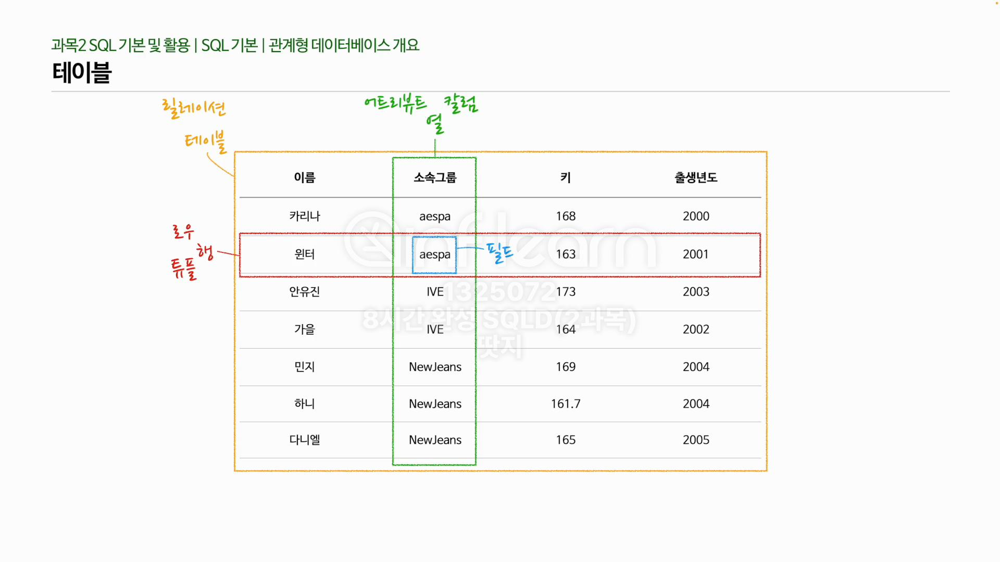
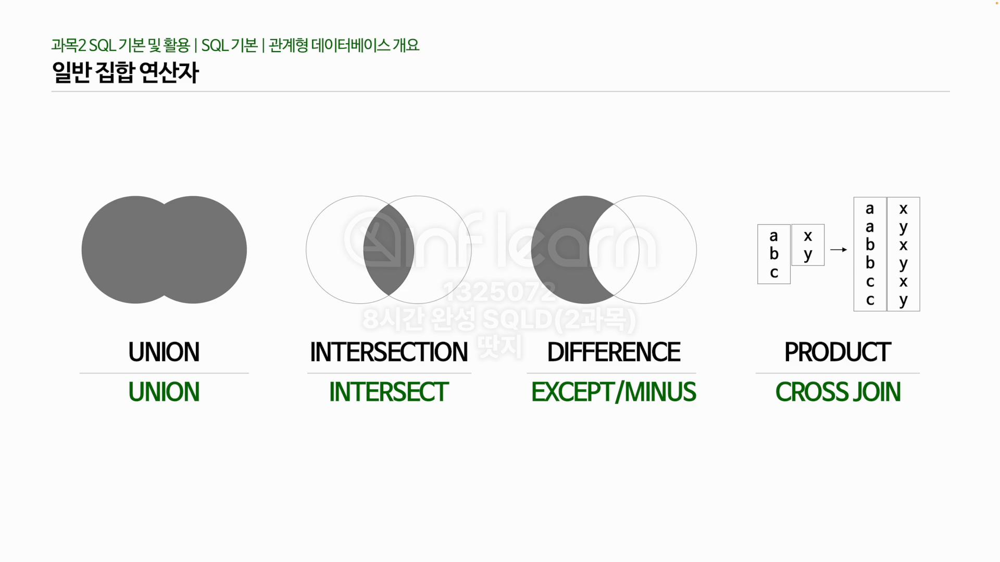
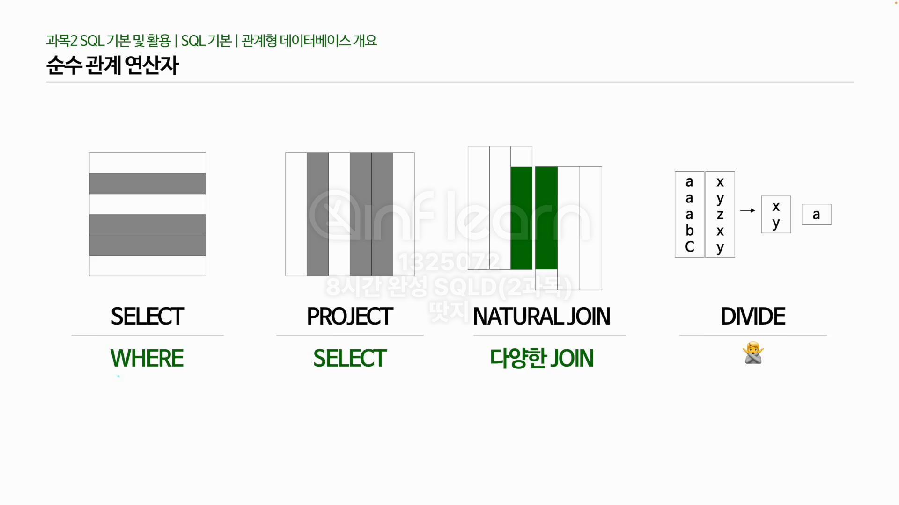

bbㅠ# 관계형 데이터 베이스 (용어, 명령어 등 개요)

## 명령어 분류 (DML, DDL, DCL, TCL)

### **DML(Data Manipulation Language, 데이터 조작어)**

데이터를 조회 및 변형: 데이터 베이스에 들어있는 데이터를 조회하거나 새로운 데이터 입력, 기존 데이터 수정, 삭제 등을 수행

- SELECT
- INSERT
- UPDATE
- DELETE

### **DDL(Data Definition Language, 데이터 정의어)**

테이블 구조 정의: 테이블 구조 생성, 변경, 삭제, 테이블 이름 변경

- CREATE
- RENAME
- ALTER
- DROP

### **DCL(Data Control Language, 데이터 제어어)**

DB 접근 및 사용 권한: 권한 부여 및 회수 명령

- GRANT
- REVOKE

### **TCL(Transaction Control Language, 트랜젝션 제어어)**

작업단위 제어: DML에 의해 조작된 결과를 작업 단위로 묶어서 제어

- COMMIT
- ROLLBACK

## 테이블 용어 정의

> 출처 [인프런 땃지 SQLD 강의](https://www.inflearn.com/course/sqld-%EC%99%84%EC%84%B1-2%EA%B3%BC%EB%AA%A9)

|공식 용어|자주 사용되는 용어|파일 시스템의용어|
|-|-|-|
|릴레이션|테이블|파일|
|튜플|행(로우)/레코드|레코드|
|어트리뷰트|열(컬럼)|필드|

### 릴레이션: 튜플의 집합

## 데이터 유형

|유형|설명|
|-|-|
|CHARACTER|CHAR, 고정길이 문자열 기본 길이 1바이트  고정길이를 갖고 있으므로 변수 길이가 설정한 길이보다 작으면 공백으로 채워짐|
|VARCHAR|가변 길이 문자열 할당 된 변수값의 바이트만 적용 VARCHAR(10)이면 10바이트만 할당|
|NUMBERIC|float, real, int, money 등 정수, 실수 등 숫자 정보 오라클은 `NUMBER[(p [, s])]` 형태로  p는 precision으로 유효 숫자를 지정, s는 소수점 이하 자리수 지정 예시: NUMERIC(10, 2) 는 정수 8자리 소수 2자리|
|DATETIME|Oracle의 경우 1초 단위, SQL Server 는 3.3ms 단위 관리|

## 일반 집합 연산자

UNION(합집합): UNION  
INTERSECTION(교집합): INTERSECT  
DIFFERENCE(차집합): EXCEPT/MINUS(오라클)  
PRODUCT(모든경우의수): CROSS JOIN  

## 순수 관계 연산자

SELECT: WHERE로 행을 필터링  
PROJECT: SELECT로 열을 필터링  
NATURAL JOIN: 두 개의 테이블에서 같은 이름을 가진 컬럼 간 INNER 조인 집합결과를 출력  
~~DEVIDE: 현재 미사용~~
