# 프로젝트 환경설정

## 목차

- 프로젝트 생성
- 라이브러리 살펴보기
- View 환경설정
- H2 데이터베이스 설치
- JPA DB 설정, 동작 확인

## 프로젝트 생성

- 스프링 부트 스타터 (<https://start.spring.io>)
  - 쉽게 프로젝트를 만들 수 있음.
  - project
    - ✅ Gradle - Groovy
    - Gradle - Kotlin
    - Maven
  - Metadata // 의미하는 바 확인하기
    - Group: jpabook
    - Artifact: jpashop
  - Dependencies(의존관계)
    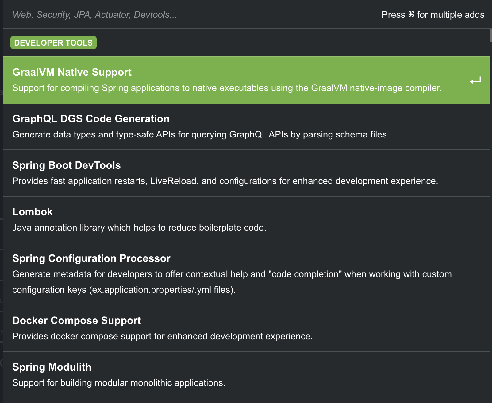  
    검색해서 원하는 의존성을 추가해준다.  

    - Spring Web (구 Spring Web Starter): RESTful API, Tomcat 컨테이너로 빌드
    - Thymeleaf: 모던 서버사이드 자바 템플릿
    - Spring Data JPA: 유틸성 라이브러리  
    - H2 Database: 개발 또는 테스트에 특화된 데이터베이스. MySQL는 환경설정시 까다로운데, h2는 간단하게 내부에서 구동가능
    - Lombok: 반복코드를 줄여줌. 간단한 어노테이션으로 자동 generation
    - Validation: JSR-303 validation with Hibernate validator
  
generate로 다운로드된 압축파일을 원하는 경로에 풀고, IntelliJ에서 열어주면된다. 최초 실행시에는 라이브러리 설치 등으로 오래걸림.

`build.gradle` // 여기서 스프링부트 버전을 갱신해주면 다른 라이브러리 의존성도 맞는 버전으로 갱신해줌.

```gradle
plugins {
 id 'java'
 id 'org.springframework.boot' version '3.3.12'
 id 'io.spring.dependency-management' version '1.1.7'
}
```

우리가 골랐던 의존관계 (라이브러리)

```gradle
dependencies {
 implementation 'org.springframework.boot:spring-boot-starter-data-jpa'
 implementation 'org.springframework.boot:spring-boot-starter-thymeleaf'
 implementation 'org.springframework.boot:spring-boot-starter-validation'
 implementation 'org.springframework.boot:spring-boot-starter-web'
 compileOnly 'org.projectlombok:lombok'
 runtimeOnly 'com.h2database:h2'
 annotationProcessor 'org.projectlombok:lombok'
 testImplementation 'org.springframework.boot:spring-boot-starter-test'
 testRuntimeOnly 'org.junit.platform:junit-platform-launcher'
}
```

src/main/java/jpabook/jpashop의 `JpashopApplication`을 실행해보면 아래와 같이 spring이 실행되게된다.
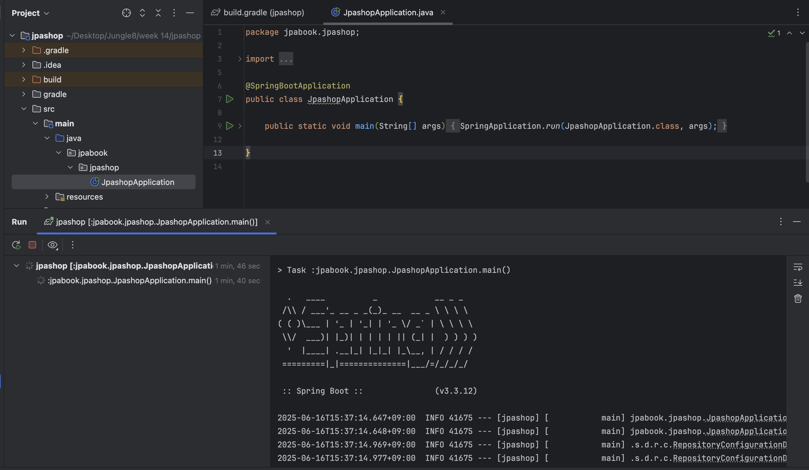

실행되는걸 잘 보다보면. 우측에 `Tomcat started on port 8080 (http) with context path '/'`라는 메시지가 보인다.
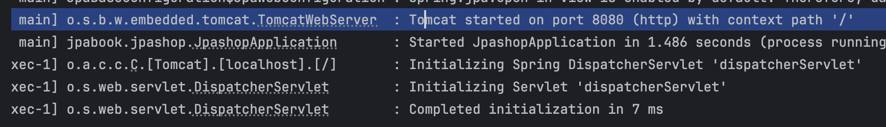

`localhost:8080`으로 브라우저에서 접속했을 때 아래와 같은 Error Page가 노출이되면 정상적으로 구동된 것이다!
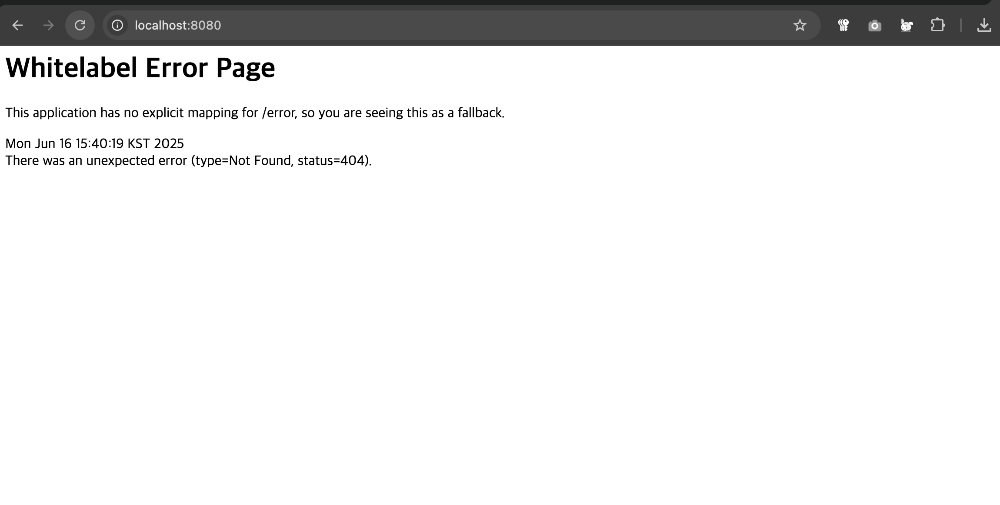

현재 구현한것이 아무것도 없기 때문에 흰 페이지에 Error가 표시되는 것이다.

외부 라이브러리가 왜이리 많냐 보면, `gradle`은 예를들어 `spring-bookt-starter` 하나를 가져왔을때 의존관계가 있다 싶은것들은 다 알아서 가져와주게됨.

lombok을 사용 / 확인하기위해서는 플러그인을 설치해야함. Setting -> Plugins에서 `lombok`을 Marketplace에서 검색후 install해준다.

설치가 끝나면 Apply, OK 눌러주고 편집기로 나오면 아래와 같이 메시지가 뜬다... 는데? 난 왜 안뜰까

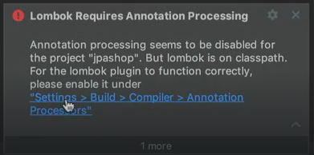

안뜨지만 annotation processing을 활성화해주고 나와주면 된다.

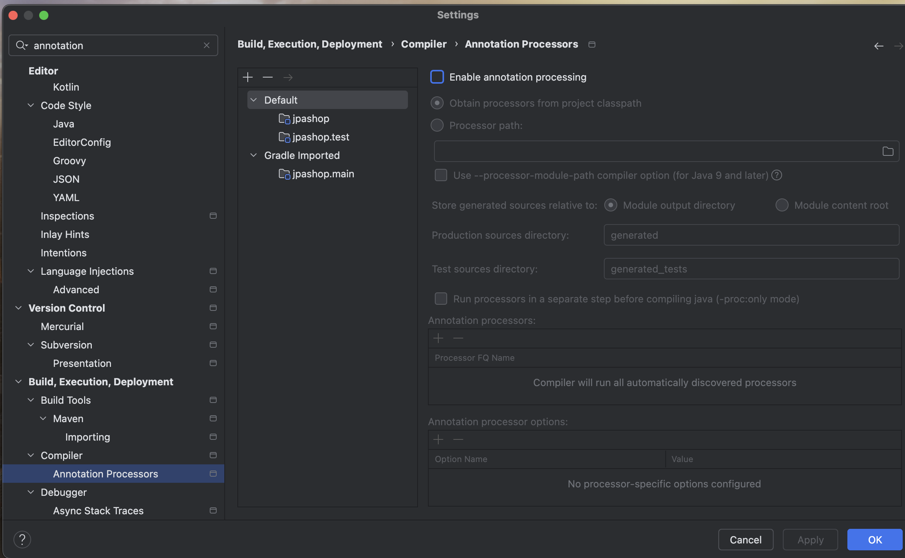

뭔가 잘 안되는거같길래 환경설정 교육자료를 보니  
> 스프링 부트 3.2부터 JDK 17과 Gradle 옵션을 별도로 설정해야한다.

라는 주의문구가 있더라.. 먼저 JDK부터.  
설정 위치는 cmd + ;로 들어가도 되고. 상단의 File -> Project Structure로 들어가서 확인하면된다.

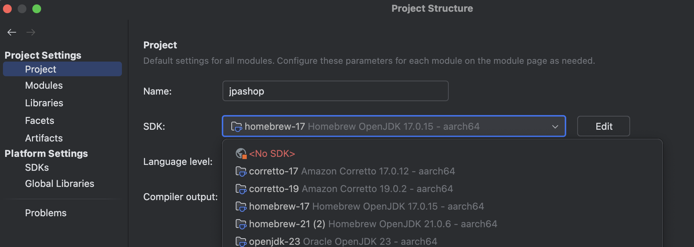

나는 이전에 깔아둔 버전들이 여러개 있었는데 21로 세팅되어있어서 17로 바로 변경해주었다.

gradle 설정은 환경설정`cmd+,` 으로 들어가서 gradle을 검색창에 검색해주면 `Build, Execution, Deployment` 하위에 Gradle 항목이 보인다.  

여기서는 `Build and run using`과 `Run tests using` 이 두 항목이 IntelliJ IDEA나 다른것으로 되어 있으면 Gradle로 바꿔주고. 여기에서도 `JVM 버전을 17`로 동일하게 맞추면된다.

여기서 IntelliJ IDEA로 되어있으면 추후 문제가 발생한다는데.. 어떤 문제가 발생하는지 / 왜 그런 문제가 발생하는지, 무슨 차이가 있는지는 따로 찾아보아야겠다.

최종적으로는 아래 사진처럼 되면 된다.

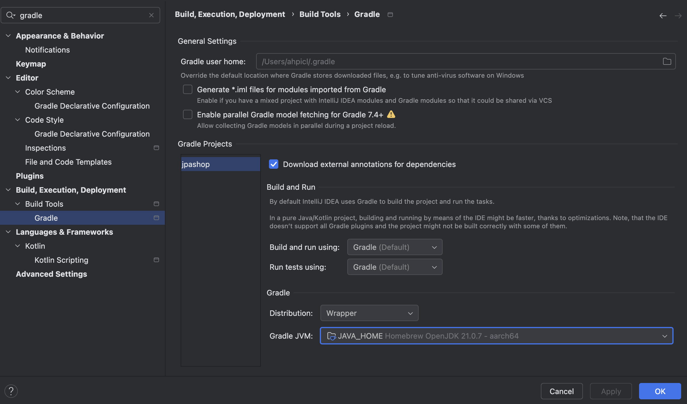

부팅이 오래걸리길래 뭔가 이상해서 검색해봤다. 사진에서도 30여분이 돌아가는게 보이는가...?

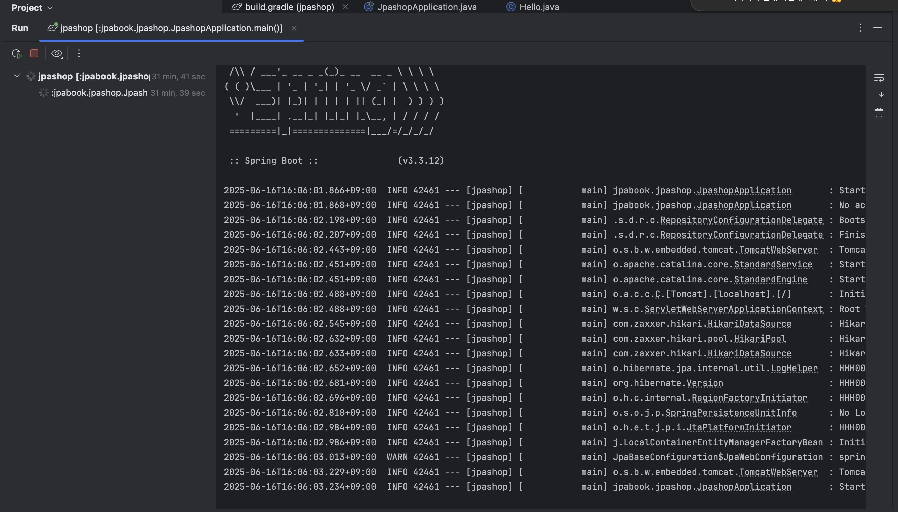

가장 마지막 실행중인 항목은 `Started Application in ~~ sec` 즉 실행 후 00초에 어플리케이션이 정상 작동되었다는 뜻이다.

```bash
2025-06-16T16:06:03.234+09:00  INFO 42461 --- [jpashop] [           main] jpabook.jpashop.JpashopApplication       : Started JpashopApplication in 1.557 seconds (process running for 1.788)
```

이에 대해 찾아보니. `내장 톰캣(Tomcat) 서버가 올라가서 포트(기본 8080)로 들어오는 HTTP 요청을 계속 받아들이기 때문에 JVM 프로세스가 살아있는 건 정상 동작` 이라는 것을 알았다.

따라서 계속 실행해 두고 → <http://localhost:8080> 같은 엔드포인트로 요청을 날려서 기능을 테스트하거나

끝낼 때 → IDE의 Stop 버튼(또는 터미널이면 Ctrl+C)으로 프로세스를 종료

### 세팅 잘 되었는지 확인하기

먼저 Application Class와 동일한 디렉토리에 `Hello` 라는 클래스를 새로 만들어준다.

```java
public class Hello {
    private String data;
}
```

이렇게 코드를 작성하고 상단에 `@Getter @Setter` 어노테이션을 작성해주면, lombok을 import하라는 경고가 떠주면 바로 넣어주면된다.

```java
import lombok.Getter;
import lombok.Setter;

@Getter @Setter
public class Hello{
    private String data;
}
```

이 lombok은 원래 getter랑 setter를 하기위해 아래와 같이 직접 작성 및 반환해줘야하던 반복적인 부분을 어노테이션으로 간단히 구현하도록 돕는 도구이다.

```java
public class Hello {
    private String data;

    public String getData() {
        return data;
    }

    public void setData(String data) {
        this.data = data;
    }
}
```

IntelliJ의 자체 기능으로도 쉽게 만들 수 있지만, 좀 더 간편하게보이지않는가?

```java
@SpringBootApplication
public class JpashopApplication {
    public static void main(String[] args) {
        Hello hello = new Hello();
        hello.setData("hello");
        String data = hello.getData();
        System.out.println("data = " + data);

        SpringApplication.run(JpashopApplication.class, args);
    }
}
```

이후 테스트를 해주기 위해 Application의 main 내부에 Hello를 set->get->print 해주고 프로그램을 실행해주면 최 상단에 `data = hello`가 출력문대로 나오게 된다.

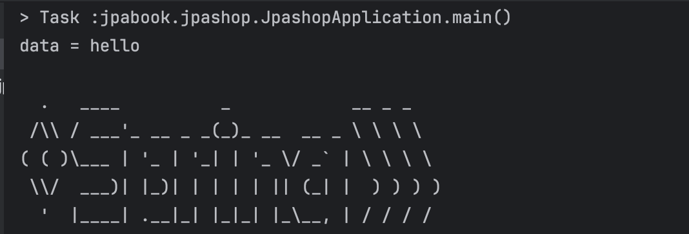

## 프로젝트 라이브러리 확인

### gradle 의존관계 보기

`./gradlew dependencies --configuration compileClasspath` 입력 시 원하는 라이브러리 설치를 위해 어떤 의존관계들로 인해 다른 라이브러리가 설치되었는지 관계도가 터미널에 쭉 출력된다.

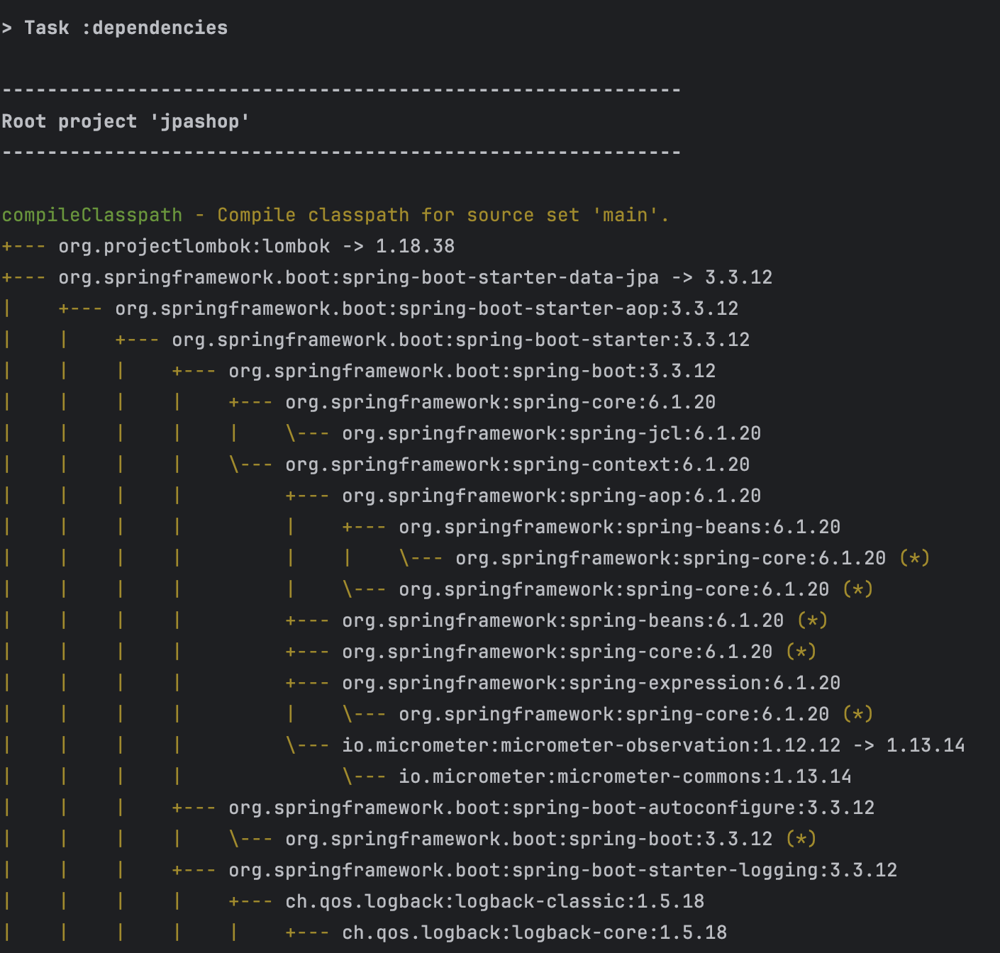

아.. 길다

```bash
compileClasspath - Compile classpath for source set 'main'.
+--- org.projectlombok:lombok -> 1.18.38
+--- org.springframework.boot:spring-boot-starter-data-jpa -> 3.3.12
|    +--- org.springframework.boot:spring-boot-starter-aop:3.3.12
|    |    +--- org.springframework.boot:spring-boot-starter:3.3.12
|    |    |    +--- org.springframework.boot:spring-boot:3.3.12
|    |    |    |    +--- org.springframework:spring-core:6.1.20
|    |    |    |    |    \--- org.springframework:spring-jcl:6.1.20
|    |    |    |    \--- org.springframework:spring-context:6.1.20
|    |    |    |         +--- org.springframework:spring-aop:6.1.20
|    |    |    |         |    +--- org.springframework:spring-beans:6.1.20
|    |    |    |         |    |    \--- org.springframework:spring-core:6.1.20 (*)
|    |    |    |         |    \--- org.springframework:spring-core:6.1.20 (*)
|    |    |    |         +--- org.springframework:spring-beans:6.1.20 (*)
|    |    |    |         +--- org.springframework:spring-core:6.1.20 (*)
|    |    |    |         +--- org.springframework:spring-expression:6.1.20
|    |    |    |         |    \--- org.springframework:spring-core:6.1.20 (*)
|    |    |    |         \--- io.micrometer:micrometer-observation:1.12.12 -> 1.13.14
|    |    |    |              \--- io.micrometer:micrometer-commons:1.13.14
|    |    |    +--- org.springframework.boot:spring-boot-autoconfigure:3.3.12
|    |    |    |    \--- org.springframework.boot:spring-boot:3.3.12 (*)
|    |    |    +--- org.springframework.boot:spring-boot-starter-logging:3.3.12
|    |    |    |    +--- ch.qos.logback:logback-classic:1.5.18
|    |    |    |    |    +--- ch.qos.logback:logback-core:1.5.18
|    |    |    |    |    \--- org.slf4j:slf4j-api:2.0.17
|    |    |    |    +--- org.apache.logging.log4j:log4j-to-slf4j:2.23.1
|    |    |    |    |    +--- org.apache.logging.log4j:log4j-api:2.23.1
|    |    |    |    |    \--- org.slf4j:slf4j-api:2.0.9 -> 2.0.17
|    |    |    |    \--- org.slf4j:jul-to-slf4j:2.0.17
|    |    |    |         \--- org.slf4j:slf4j-api:2.0.17
|    |    |    +--- jakarta.annotation:jakarta.annotation-api:2.1.1
|    |    |    +--- org.springframework:spring-core:6.1.20 (*)
|    |    |    \--- org.yaml:snakeyaml:2.2
|    |    +--- org.springframework:spring-aop:6.1.20 (*)
|    |    \--- org.aspectj:aspectjweaver:1.9.24
|    +--- org.springframework.boot:spring-boot-starter-jdbc:3.3.12
|    |    +--- org.springframework.boot:spring-boot-starter:3.3.12 (*)
|    |    +--- com.zaxxer:HikariCP:5.1.0
|    |    |    \--- org.slf4j:slf4j-api:1.7.36 -> 2.0.17
|    |    \--- org.springframework:spring-jdbc:6.1.20
|    |         +--- org.springframework:spring-beans:6.1.20 (*)
|    |         +--- org.springframework:spring-core:6.1.20 (*)
|    |         \--- org.springframework:spring-tx:6.1.20
|    |              +--- org.springframework:spring-beans:6.1.20 (*)
|    |              \--- org.springframework:spring-core:6.1.20 (*)
|    +--- org.hibernate.orm:hibernate-core:6.5.3.Final
|    |    +--- jakarta.persistence:jakarta.persistence-api:3.1.0
|    |    \--- jakarta.transaction:jakarta.transaction-api:2.0.1
|    +--- org.springframework.data:spring-data-jpa:3.3.12
|    |    +--- org.springframework.data:spring-data-commons:3.3.12
|    |    |    +--- org.springframework:spring-core:6.1.20 (*)
|    |    |    +--- org.springframework:spring-beans:6.1.20 (*)
|    |    |    \--- org.slf4j:slf4j-api:2.0.2 -> 2.0.17
|    |    +--- org.springframework:spring-orm:6.1.20
|    |    |    +--- org.springframework:spring-beans:6.1.20 (*)
|    |    |    +--- org.springframework:spring-core:6.1.20 (*)
|    |    |    +--- org.springframework:spring-jdbc:6.1.20 (*)
|    |    |    \--- org.springframework:spring-tx:6.1.20 (*)
|    |    +--- org.springframework:spring-context:6.1.20 (*)
|    |    +--- org.springframework:spring-aop:6.1.20 (*)
|    |    +--- org.springframework:spring-tx:6.1.20 (*)
|    |    +--- org.springframework:spring-beans:6.1.20 (*)
|    |    +--- org.springframework:spring-core:6.1.20 (*)
|    |    +--- org.antlr:antlr4-runtime:4.13.0
|    |    +--- jakarta.annotation:jakarta.annotation-api:2.0.0 -> 2.1.1
|    |    \--- org.slf4j:slf4j-api:2.0.2 -> 2.0.17
|    \--- org.springframework:spring-aspects:6.1.20
|         \--- org.aspectj:aspectjweaver:1.9.22.1 -> 1.9.24
+--- org.springframework.boot:spring-boot-starter-thymeleaf -> 3.3.12
|    +--- org.springframework.boot:spring-boot-starter:3.3.12 (*)
|    \--- org.thymeleaf:thymeleaf-spring6:3.1.3.RELEASE
|         +--- org.thymeleaf:thymeleaf:3.1.3.RELEASE
|         |    +--- org.attoparser:attoparser:2.0.7.RELEASE
|         |    +--- org.unbescape:unbescape:1.1.6.RELEASE
|         |    \--- org.slf4j:slf4j-api:2.0.16 -> 2.0.17
|         \--- org.slf4j:slf4j-api:2.0.16 -> 2.0.17
+--- org.springframework.boot:spring-boot-starter-validation -> 3.3.12
|    +--- org.springframework.boot:spring-boot-starter:3.3.12 (*)
|    +--- org.apache.tomcat.embed:tomcat-embed-el:10.1.41
|    \--- org.hibernate.validator:hibernate-validator:8.0.2.Final
|         +--- jakarta.validation:jakarta.validation-api:3.0.2
|         +--- org.jboss.logging:jboss-logging:3.4.3.Final -> 3.5.3.Final
|         \--- com.fasterxml:classmate:1.5.1 -> 1.7.0
\--- org.springframework.boot:spring-boot-starter-web -> 3.3.12
     +--- org.springframework.boot:spring-boot-starter:3.3.12 (*)
     +--- org.springframework.boot:spring-boot-starter-json:3.3.12
     |    +--- org.springframework.boot:spring-boot-starter:3.3.12 (*)
     |    +--- org.springframework:spring-web:6.1.20
     |    |    +--- org.springframework:spring-beans:6.1.20 (*)
     |    |    +--- org.springframework:spring-core:6.1.20 (*)
     |    |    \--- io.micrometer:micrometer-observation:1.12.12 -> 1.13.14 (*)
     |    +--- com.fasterxml.jackson.core:jackson-databind:2.17.3
     |    |    +--- com.fasterxml.jackson.core:jackson-annotations:2.17.3
     |    |    |    \--- com.fasterxml.jackson:jackson-bom:2.17.3
     |    |    |         +--- com.fasterxml.jackson.core:jackson-annotations:2.17.3 (c)
     |    |    |         +--- com.fasterxml.jackson.core:jackson-core:2.17.3 (c)
     |    |    |         +--- com.fasterxml.jackson.core:jackson-databind:2.17.3 (c)
     |    |    |         +--- com.fasterxml.jackson.datatype:jackson-datatype-jdk8:2.17.3 (c)
     |    |    |         +--- com.fasterxml.jackson.datatype:jackson-datatype-jsr310:2.17.3 (c)
     |    |    |         \--- com.fasterxml.jackson.module:jackson-module-parameter-names:2.17.3 (c)
     |    |    +--- com.fasterxml.jackson.core:jackson-core:2.17.3
     |    |    |    \--- com.fasterxml.jackson:jackson-bom:2.17.3 (*)
     |    |    \--- com.fasterxml.jackson:jackson-bom:2.17.3 (*)
     |    +--- com.fasterxml.jackson.datatype:jackson-datatype-jdk8:2.17.3
     |    |    +--- com.fasterxml.jackson.core:jackson-core:2.17.3 (*)
     |    |    +--- com.fasterxml.jackson.core:jackson-databind:2.17.3 (*)
     |    |    \--- com.fasterxml.jackson:jackson-bom:2.17.3 (*)
     |    +--- com.fasterxml.jackson.datatype:jackson-datatype-jsr310:2.17.3
     |    |    +--- com.fasterxml.jackson.core:jackson-annotations:2.17.3 (*)
     |    |    +--- com.fasterxml.jackson.core:jackson-core:2.17.3 (*)
     |    |    +--- com.fasterxml.jackson.core:jackson-databind:2.17.3 (*)
     |    |    \--- com.fasterxml.jackson:jackson-bom:2.17.3 (*)
     |    \--- com.fasterxml.jackson.module:jackson-module-parameter-names:2.17.3
     |         +--- com.fasterxml.jackson.core:jackson-core:2.17.3 (*)
     |         +--- com.fasterxml.jackson.core:jackson-databind:2.17.3 (*)
     |         \--- com.fasterxml.jackson:jackson-bom:2.17.3 (*)
     +--- org.springframework.boot:spring-boot-starter-tomcat:3.3.12
     |    +--- jakarta.annotation:jakarta.annotation-api:2.1.1
     |    +--- org.apache.tomcat.embed:tomcat-embed-core:10.1.41
     |    +--- org.apache.tomcat.embed:tomcat-embed-el:10.1.41
     |    \--- org.apache.tomcat.embed:tomcat-embed-websocket:10.1.41
     |         \--- org.apache.tomcat.embed:tomcat-embed-core:10.1.41
     +--- org.springframework:spring-web:6.1.20 (*)
     \--- org.springframework:spring-webmvc:6.1.20
          +--- org.springframework:spring-aop:6.1.20 (*)
          +--- org.springframework:spring-beans:6.1.20 (*)
          +--- org.springframework:spring-context:6.1.20 (*)
          +--- org.springframework:spring-core:6.1.20 (*)
          +--- org.springframework:spring-expression:6.1.20 (*)
          \--- org.springframework:spring-web:6.1.20 (*)

(c) - A dependency constraint, not a dependency. The dependency affected by the constraint occurs elsewhere in the tree.
(*) - Indicates repeated occurrences of a transitive dependency subtree. Gradle expands transitive dependency subtrees only once per project; repeat occurrences only display the root of the subtree, followed by this annotation.

A web-based, searchable dependency report is available by adding the --scan option.
```

그래서 어떤 라이브러리가 있는지 간단하게 정리해서 살펴보자

### 라이브러리 살펴보기

#### 스프링 부트 라이브러리 살펴보기

- **spring-boot-starter-web**
  - spring-boot-starter-json
    - spring-web: REST Client/Server 지원
    - Jackson: JSON (De)Serialization (`jackson-databind`, `jackson-core`, `jackson-annotations`, `jackson-datatype-jdk8`, `jackson-datatype-jsr310`, `jackson-module-parameter-names`)
    - Micrometer Observation: 메트릭 수집 지원
  - spring-boot-starter-tomcat: 톰캣 (웹서버)
  - **spring-webmvc**: 스프링 웹 MVC (컨트롤러·뷰 리졸버 등)
- **spring-boot-starter-thymeleaf**: 타임리프 템플릿 엔진(View)
- **spring-boot-starter-data-jpa**
  - spring-boot-starter-aop: AOP 기반 트랜잭션·로깅 지원
  - spring-boot-starter-jdbc
    - **HikariCP 커넥션 풀 (부트 2.0 기본)**
  - **hibernate-core** + JPA: 하이버네이트(표준 구현체) + JPA API
  - spring-data-jpa: 스프링 데이터 JPA 리포지토리 추상화
  - spring-aspects: AOP 설정용 추가 모듈
- spring-boot-starter-validation
  - hibernate-validator: Bean Validation 구현체
  - jakarta.validation-api: 표준 검증 API (JSR-380)
  - tomcat-embed-el: EL(Expression Language) 지원
- spring-boot-starter (공통)
  - spring-boot: 부트 코어 + 자동 설정
    - **spring-core**
  - **spring-boot-starter-logging: 로깅 설정** (**`logback`**, `slf4j`, `log4j-to-slf4j`/`log4j-api`, `jul-to-slf4j`)

#### 개발 지원 라이브러리

- Lombok (`compileOnly` + `annotationProcessor`):
  - `@Getter`/`@Setter`, `@Builder` 등으로 보일러플레이트 코드 자동 생성

#### 데이터베이스

- H2 Database (`runtimeOnly`):
  - 인메모리·파일 기반 경량 DB (개발·테스트용)

#### 테스트 라이브러리

- spring-boot-starter-test
  - JUnit Jupiter: 테스트 프레임워크
  - Mockito: 목 객체 생성
  - AssertJ: 유연한 어서션
  - Spring Test: 스프링 통합 테스트 지원
  - Hamcrest: 매처 기반 어서션
- junit-platform-launcher (`testRuntimeOnly`):
  - JUnit 플랫폼 런처

#### 메트릭

- Micrometer Observation:
  - `io.micrometer:micrometer-observation` (transitive via starter-json/spring-web)

## View 환경설정

thymeleaf는 Java SSR을 지원하는 라이브러리임. (스프링에서 밀어줌. 서로 상호적으로 지원함) Natural template를 지원하는게 장점임. if문 같은 구성을 쓰지않고 자연스럽게 마크업 그대로의 포맷에서의 활용이 장점.

### Thymeleaf 장점

- 자연스러운 HTML 템플릿
  - 순수 HTML 파일로도 동작해 디자이너가 별도 학습 없이 사용 가능
  - 브라우저 미리보기와 IDE 문법 검사가 그대로 적용
- 서버 사이드 렌더링 지원
  - 완전한 HTML을 생성해 SEO·크롤러 친화적
  - 초기 로드 속도가 빨라 사용자 경험 개선
- Spring과의 깊은 통합
  - `th:*` 속성으로 컨트롤러 모델 데이터를 간편 바인딩
  - Spring Boot 스타터로 별도 설정 없이 바로 적용
- 강력한 표현식 언어(OGNL 기반)
  - 변수 출력, 조건문(`th:if`), 반복문(`th:each`)을 직관적 문법으로 작성
  - 스프링 빈 호출 및 메서드 실행도 지원
- 레이아웃·프래그먼트 재사용
  - `th:fragment`로 공통 레이아웃 분리·재사용 가능
  - Layout Dialect 같은 확장으로 템플릿 구조화 용이
- 보안 기능 내장
  - 출력 시 자동으로 XSS 이스케이프
  - `th:action` 사용 시 CSRF 토큰을 자동 삽입
- 성능 최적화
  - 템플릿 캐싱으로 렌더링 속도 향상
  - Ajax·비동기 호출과의 병행 사용 지원
- 확장성과 커스터마이징
  - 커스텀 다이얼렉트로 새로운 속성·동작 추가 가능
  - 플러그인 형태로 기능을 유연하게 확장
- 테스트 용이성
  - 템플릿 단위 테스트로 렌더링 결과 검증 가능
  - 모의 모델 데이터를 주입해 다양한 시나리오 테스트 지원

### thymeleaf 써보기

```java
package jpabook.jpashop;

import org.springframework.stereotype.Controller;
import org.springframework.ui.Model;
import org.springframework.web.bind.annotation.GetMapping;


@Controller
public class HelloController {

    @GetMapping
    public String hello(Model model) {
        model.addAttribute("data", "hello!!!");
        return "hello";
    }
}
```

Spring UI에서 Model은 데이터를 실어서 view로 넘길 수 있음. data라는 키의 값을 hello!!!로 넘겨줌.  
return은 화면 이름(hello)임. 이는 관례상 `resources/templates` 경로에 hello.html(뷰 이름) 으로 만들어줌

```html
<!DOCTYPE HTML>
<html xmlns:th="http://www.thymeleaf.org">
<head>
    <title>Hello</title>
    <meta http-equiv="Content-Type" content="text/html; charset=UTF-8" />

</head>
<body>
<p th:text="'안녕하세요. ' + ${data}">안녕하세요. 손님</p>
</body>
</html>
```

일반적인 html이랑 다른점은 html 태그 옆에 `xmlns:th="http://www.thymeleaf.org"` 라는 네임스페이스 선언이 붙고, 동적으로 처리하고 싶은 HTML 태그에 `th:text` 같은 `th:` 속성을 사용한다는 점이다.

- **`th:text`**: 이 속성은 태그 안의 내용을 지정된 값으로 대체한다.
- **`${data}`**: Spring의 표현식(EL)으로, 컨트롤러에서 `model.addAttribute("data", "hello!!!")`로 넘겨준 값을 여기서 사용하게 된다.
- **`안녕하세요. 손님`**: 이 부분은 Thymeleaf의 가장 큰 장점인 `내추럴 템플릿` 기능을 보여준다. 서버 없이 이 HTML 파일을 그냥 브라우저로 열면 이 "안녕하세요. 손님"이라는 기본 텍스트가 보이고, 서버를 통해 렌더링하면 `${data}`의 값인 "hello\!\!\!"가 동적으로 치환되어 "안녕하세요. hello\!\!\!"가 출력된다.

이제 `JpashopApplication`을 다시 실행하고, 브라우저에서 `localhost:8080`으로 접속해보면 컨트롤러가 넘겨준 데이터가 정상적으로 출력되는 것을 확인할 수 있다\!

## H2 데이터베이스 설치 및 설정

뷰 템플릿을 설정했으니, 이제 데이터를 영구적으로 저장하고 관리할 데이터베이스를 설정할 차례다. 나는 개발 초기 단계에서 쉽고 빠르게 사용할 수 있는 **H2 데이터베이스**를 사용하기로 했다.

H2의 큰 장점은 **별도의 설치가 필요 없다**는 점이다. `build.gradle`에 아래와 같이 의존성을 추가해두었다면, Spring Boot가 알아서 라이브러리를 통해 인메모리 또는 파일 모드로 DB를 실행해준다.

```gradle
runtimeOnly 'com.h2database:h2'
```

이제 `src/main/resources` 폴더에 `application.properties` 파일을 만들고 H2 데이터베이스 설정을 추가해주자.

```properties
# H2 데이터베이스 설정
spring.datasource.url=jdbc:h2:file:./jpashop
spring.datasource.driver-class-name=org.h2.Driver
spring.datasource.username=sa
spring.datasource.password=

# JPA 및 Hibernate 설정
spring.jpa.hibernate.ddl-auto=create
```

- `spring.datasource.url`: 데이터베이스 연결 주소다. 나는 파일 모드를 사용하기로 했고, `./jpashop`이라고 적으면 프로젝트 루트 폴더에 `jpashop.mv.db`라는 DB 파일이 생성된다.
- `spring.jpa.hibernate.ddl-auto=create`: 이 설정이 아주 중요하다. `create`로 설정하면 애플리케이션 실행 시점에 JPA가 엔티티 클래스 정보를 보고 **테이블을 자동으로 생성**해준다. (개발 초기에는 `create`를 쓰고, 어느 정도 안정화되면 데이터 유지를 위해 `update`나 `validate`로 변경하는 것이 좋다고 한다.)

### H2 콘솔로 DB 확인하기

H2는 데이터베이스 상태를 쉽게 확인할 수 있는 웹 콘솔을 제공한다. `application.properties`에 아래 설정을 추가하면 활성화할 수 있다.

```properties
# H2 콘솔 활성화
spring.h2.console.enabled=true
```

이제 애플리케이션을 실행하고 `localhost:8080/h2-console`로 접속하면 H2 로그인 화면이 보인다.
여기서 **JDBC URL**을 위에서 설정한 값(`jdbc:h2:file:./jpashop`)과 동일하게 맞춰주고 연결하면, 데이터베이스 내부를 직접 들여다볼 수 있다.

## JPA DB 설정, 동작 확인

모든 설정이 끝났으니, 이제 JPA가 실제로 동작하는지 확인해 볼 시간이다. 간단한 테스트 코드를 작성해서 확인해보자.

**1. Member 엔티티 생성**
먼저 `jpabook.jpashop.domain` 패키지를 만들고 그 안에 간단한 `Member` 엔티티 클래스를 만든다.

```java
package jpabook.jpashop.domain;

import jakarta.persistence.Entity;
import jakarta.persistence.GeneratedValue;
import jakarta.persistence.Id;
import lombok.Getter;
import lombok.Setter;

@Entity
@Getter @Setter
public class Member {

    @Id @GeneratedValue
    private Long id;
    private String username;
}
```

**2. Member 리포지토리 생성**
다음으로 `jpabook.jpashop.repository` 패키지에 `MemberRepository` 인터페이스를 만든다.

```java
package jpabook.jpashop.repository;

import org.springframework.data.jpa.repository.JpaRepository;
import jpabook.jpashop.domain.Member;

public interface MemberRepository extends JpaRepository<Member, Long> {
}
```

Spring Data JPA가 `JpaRepository`를 상속받는 것만으로도 기본적인 CRUD 기능을 모두 구현해준다. 정말 편리하다.

**3. 테스트 코드 작성**
마지막으로 `src/test/java` 폴더에 `MemberRepositoryTest` 클래스를 만들어 실제 DB에 저장이 되는지 테스트한다.

```java
package jpabook.jpashop.repository;

import jpabook.jpashop.domain.Member;
import org.junit.jupiter.api.Test;
import org.springframework.beans.factory.annotation.Autowired;
import org.springframework.boot.test.context.SpringBootTest;
import org.springframework.transaction.annotation.Transactional;
import static org.assertj.core.api.Assertions.assertThat;

@SpringBootTest
public class MemberRepositoryTest {

    @Autowired MemberRepository memberRepository;

    @Test
    @Transactional // 테스트 후 롤백을 위해 필요
    public void testMember() {
        // given
        Member member = new Member();
        member.setUsername("memberA");

        // when
        Long savedId = memberRepository.save(member).getId();
        Member findMember = memberRepository.findById(savedId).get();

        // then
        assertThat(findMember.getId()).isEqualTo(member.getId());
        assertThat(findMember.getUsername()).isEqualTo(member.getUsername());
        assertThat(findMember).isEqualTo(member); // findMember는 영속성 컨텍스트에서 온 같은 객체
    }
}
```

`@SpringBootTest` 어노테이션을 붙이면 스프링 컨테이너와 함께 테스트를 실행할 수 있다. `@Autowired`로 `MemberRepository`를 주입받아 사용한다.

이제 테스트 클래스에서 실행 버튼을 눌러 테스트를 실행했을 때, 초록불이 들어오고 테스트가 통과하면 성공이다\! IDE 콘솔을 보면 Hibernate가 `insert` 쿼리를 생성하고 실행하는 로그도 확인할 수 있다.

이로써 Spring Boot, JPA, H2 데이터베이스가 모두 올바르게 연동되었음을 확인했다. 이제 본격적으로 비즈니스 로직을 구현할 준비가 끝났다.
