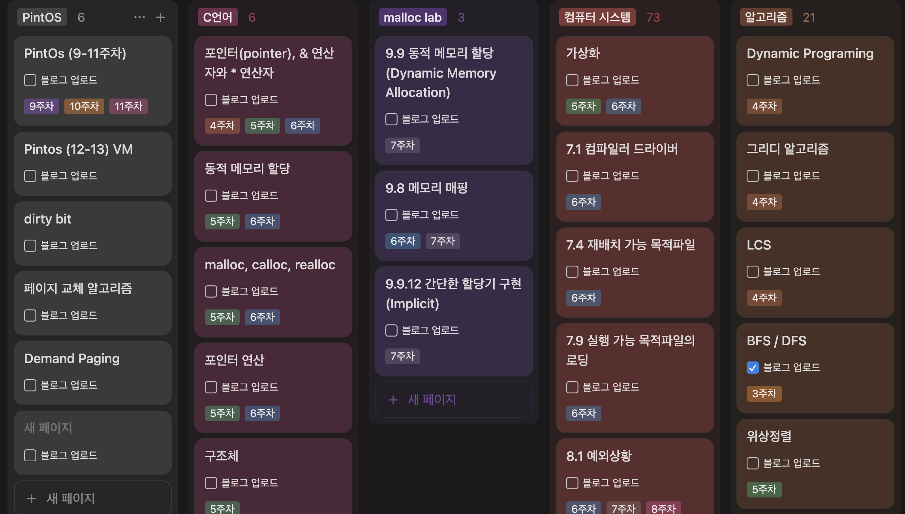
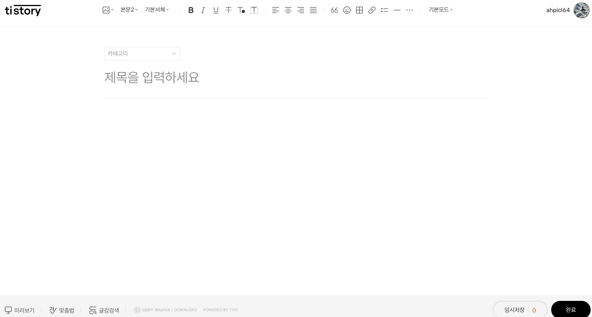
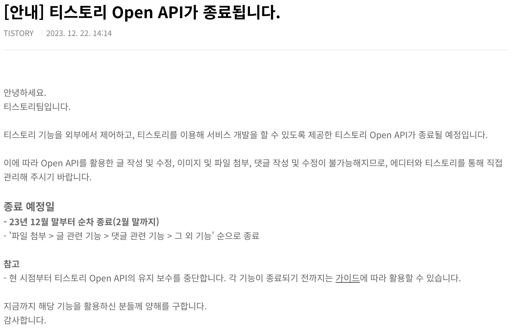

# GitHub → Tistory 자동 포스팅 스크립트

## 프로젝트 개요

IDE에서 작성하면, GitHub에 푸시된 Markdown(.md) 파일을 Tistory 블로그에 자동으로 신규 등록·수정하는 워크플로를 구축

- **배경**: `Notion`, `Obsidian`, `tistory` 등으로 파편화된 기록들을 하나로 통합하고, 최종적으로 유의미하게 기록들이 `tistory blog`로 모일 수 있도록.
      

    1. 평소에 학습 기록들을 노션에 했었는데, 이를 tistory로 올리는 과정에서 `마크다운 형식 오류`, `코드블럭 html 형식 깨짐(다른영역 침범)`, `사진 업로드 오류` 등의 빈번한 불편함이 느껴짐.

      
    *velog의 텍스트 편집기*

    
    *tistort의 텍스트 편집기. 미리보기가 있으나 라이브로 볼 수는 없다.*

    2. 다른 친구들이 사용하는 velog의 경우 편집창 내에 `live 미리보기` 창이 있어서 켜놓고 틈틈히 작성하기 편해보였으나, 티스토리의 편집기는 전혀 그런것이 지원되지 않았음. 그렇다고 velog로 넘어가고 싶진 않았음
        > **개인적으로 생각하는 velog 단점**
        >
        > 애드센스 지원 부재, 스킨은 깔끔하나 자유롭게 커스텀이 불가  

    3. github 블로그를 사용하면 대부분 해결이 가능하나, 이전에 시도할때 초기 설정이 번거롭게 느껴졌고, 이미 Tistory 블로그에 작성한 글들이(매우 작지만) 아쉬웠었음.
- **목표**: GitHub 저장소에 Markdown을 올리면, CI가 이를 감지해 Tistory에 글을 자동으로 올려주고, 수정까지 반영  

## 🛠️ 주요 기능  

1. **Markdown → HTML 변환** (`markdown-it`)  
2. **브라우저 자동화** (`puppeteer`)  
3. **카카오 SSO 로그인** 및 세션 유지 (`TISTORY_COOKIES_JSON`, ID/PW 환경변수)  
4. **신규 작성 vs. 수정 분기** (`post_map.json` 매핑)  
5. **Base64 인라인 이미지 처리** (로컬 이미지 → data URI)  
6. **GitHub Actions 연동** (변경된 `.md`만 감지, CI 실행)  
7. **GitHub bot `post_map.json` 자동 커밋·푸시** (매핑 변경 시만)  
<!-- 8. **에러·예외 처리** (`unhandledRejection`, `uncaughtException`)   -->

## ⚙️ 기술 스택  

- **Node.js 16**: 스크립트 실행 환경  
- **puppeteer**: Tistory 웹 에디터 자동화  
- **markdown-it**: Markdown → HTML 렌더링  
- **glob**: 파일 검색  
- **GitHub Actions**: CI/CD 파이프라인  
<!-- - **Bash**: 커밋 · 푸시 스크립트   -->

---

<!-- ## 상세 구현 · 트러블슈팅 타임라인 -->

## 🆕 시작  

불편함을 느끼기 시작하고, '비슷한 생각을 가지고 이미 행동에 옮겼던 사람들이 분명히 있을 것이다'라는 믿음속에. 정보의 바다속에서 구글링을 시작하였다.  
**노션 티스토리 연동**, **마크다운 티스토리 연동** 등의 키워드로 검색하자 많은 게시글이 나왔다.  
특히 평소에 자주 보는 [`개발바닥`](https://www.youtube.com/@devbadak) 유튜브를 운영하며 및 인프런의 CTO이신 **향로(이동욱)**님의 [블로그](https://jojoldu.tistory.com/)가 tistory이나, github repository 업로드 → 블로그 포스팅 자동화를 구축 해 운영중이신걸 알게 되었다.  
이를 참고하여 가능성을 보았고 작업에 착수하였다.

- 참고
   1. [향로님의 블로그 레포지토리](https://github.com/jojoldu/blog-code)  
         *여기서 모든 블로그 글을 관리하는 것을 알 수 있었다.*  
   2. [향로님의 자동화 프로젝트](https://github.com/jojoldu/md-tistory)

### 💡 구상한 기능 흐름

1. VSCODE 내 md 작성시 `미리보기` 기능이 지원되니, 해당 기능을 십분 활용하여 로컬에서 작성
2. 작성된 포스팅들을 github repository로 push
3. 이와 동시에 github → tistory로 포스팅

### 🚨 난관 1 Tistroy Open API 미지원

공개되어있는 대부분의 포스팅 자동화(N2T 등)는, Tistory에서 공식적으로 지원하던 Open API를 활용해서 구현되어있음



근데 그게 안됨 ㅋ


그래서 영원한 나만의 도라에몽(GPT)을 통해서 해답을 찾기시작했다.  
제시받은 네가지 방식은 아래와 같다  

``` plainText
다음 네 가지 방식을 제안한다. 각 방식마다 구현 난이도, 유지보수 부담, 비용·확장성 등을 비교해서 상황에 맞게 선택하면 된다.

1. **GitHub Actions + Puppeteer(헤드리스 Chrome) 워크플로우**

   1. GitHub 저장소에 Markdown 파일을 푸시하면 Actions가 트리거
   2. `actions/setup-node`로 Node.js 환경, `npm install puppeteer`로 Puppeteer 설치
   3. Puppeteer로 티스토리 로그인→글쓰기 UI 자동 조작
   4. 장점

      1. 별도 서버 불필요, GitHub 인프라 그대로 사용
      2. 커밋만으로 배포 가능
   5. 단점

      1. CI 환경에서 헤드리스 Chrome 설치·실행 이슈
      2. Actions 실행 시간·횟수 제한

2. **Self-hosted Cron + Python Selenium 스크립트**

   1. 개인 서버(VPS, 라즈베리파이 등)에 스크립트 배포
   2. OS의 `cron` 또는 Windows의 작업 스케줄러로 주기 실행
   3. Selenium + ChromeDriver로 티스토리 글쓰기 자동화
   4. 장점

      1. 실행 환경 완전 제어 가능
      2. 복잡한 로직·로그 취합이 용이
   5. 단점

      1. 서버 유지비·운영 부담
      2. UI 변경 시 직접 스크립트 수정 필요

3. **n8n(Self-hosted) + Puppeteer 노드**

   1. Docker로 n8n 인스턴스 띄우기
   2. “GitHub 푸시” → “HTTP 요청” → “Puppeteer 노드” 순 워크플로우 구축
   3. GUI 기반으로 흐름을 시각적으로 관리
   4. 장점

      1. 코드보다 시각적 흐름 관리에 친숙
      2. 각 노드를 재사용·확장하기 쉬움
   5. 단점

      1. n8n 서버 운영 필요
      2. Puppeteer 스크립트 작성은 여전히 필요

4. **AWS Lambda(또는 Cloud Functions) + Headless Chrome Layer**

   1. Lambda Layer에 headless Chromium 번들 업로드
   2. GitHub Actions 또는 Webhook으로 Lambda 함수 호출
   3. Lambda 내부에서 Puppeteer/Selenium으로 UI 자동화
   4. 장점

      1. 서버리스로 비용 최적화
      2. 확장성·가용성 우수
   5. 단점

      1. 크고 복잡한 런타임 빌드 필요 (Chrome 번들)
      2. Cold start 지연

–––
**요약**

* **간편 절충형**: GitHub Actions + Puppeteer
* **제어형**: Self-hosted Selenium + Cron
* **시각적 워크플로우**: n8n + Puppeteer
* **서버리스**: AWS Lambda + Headless Chrome

위 네 가지 중 환경(서버 유무, CI 제약, 유지보수 여력)에 맞춰 하나를 선택해 구현하는 것을 추천한다.
```

그래서 크게 고민없이..  
가장 간단해보이는 방식인 `Github Actions + Puppeteer` 조합으로 결정했다.  
> 여기서 ***Puppeteer***란?
>
> 구글에서 제작한 Headless 브라우저(크롬) 자동 조종 프로그램. 코드를 통해 사람이 하는 것 처럼 웹 브라우저를 제어할 수 있음
>
> - headless  : GUI를 제공하지 않는 브라우저

**주요 용도**

1. 웹 데이터 수집 (크롤링 / 스크래핑)
2. 자동화 테스트 : 웹사이트 버튼 클릭, 로그인 등의 기능이 작동하는지 테스트
3. 스크린샷/PDF 생성

### 구현 시작

준비물은 다음과 같다

1. 자동화 할 블로그용 repository
2. GitHub Secrets 설정
3. Node.js 설정

4. **기본 스크립트 작성**  
   - `glob`로 `posting/**/*.md` 수집  
   - `markdown-it`으로 HTML 변환  
   - Puppeteer로 신(新)글 만들기: 제목·본문 입력 후 발행

5. **신규·수정 분기 처리**  
   - `post_map.json`에 Markdown 경로 ↔ Tistory `postId` 저장  
   - 이미 매핑 있으면 수정 모드, 없으면 신규 작성 모드

6. **카카오 SSO 로그인 안정화**  
   - `TISTORY_COOKIES_JSON` 주입으로 로그인 세션 유지  
   - 로그인·2단계 인증·동의 화면까지 순차 자동화

7. **Headless 모드 수정 본문 누락 버그**  
   - CI(Headless) 실행 시 수정 모드에서 본문이 나타나지 않음  
   - TinyMCE 에디터의 `tinymce.activeEditor.setContent(html)` API로 해결

8. **Base64 인라인 이미지 처리 추가**  
   - Markdown `` 경로 추출  
   - 로컬 이미지 파일을 Base64로 인코딩해 ``로 삽입

9. **GitHub Actions 워크플로 작성**  
   - `paths: posting/**/*.md` 트리거  
   - `git diff`로 변경된 파일만 `FILES` 환경변수에 전달  
   - `node post_to_tistory.js` 실행

10. **post_map.json 자동 커밋/푸시**  

- `actions/checkout@v3`에 `persist-credentials: true` 추가 (권한 문제 해결)  
- 변경사항이 있을 때만 `git add`·`commit`·`push` 스크립트 적용

11. **방어 로직 & 최적화**  

- `FILES`가 빈 문자열일 때 “전체 순회 방지”  
- 전역 예외(`unhandledRejection`, `uncaughtException`) 처리 추가  
- 상세 로그 메시지 보강

12. **최종 안정화 & 문서화**  
    - 린트·형식 정리  
    - 본문에 구현 타임라인 및 사용 기술 스택 정리  
    - 재사용 가능한 README/블로그 포스트로 완성

---

## 결론 및 향후 계획  

- **현재 상태**: GitHub 푸시만으로 티스토리 신규·수정 글이 자동 발행  
- **향후 개선**:  
  - 티스토리 API 공식 지원 시 전환  
  - 이미지 CDN 업로드 연동  
  - 커스터마이즈 가능한 템플릿·메타데이터 자동 입력  
