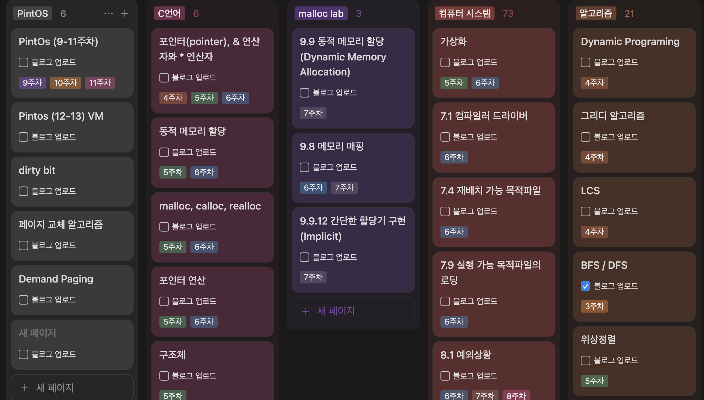
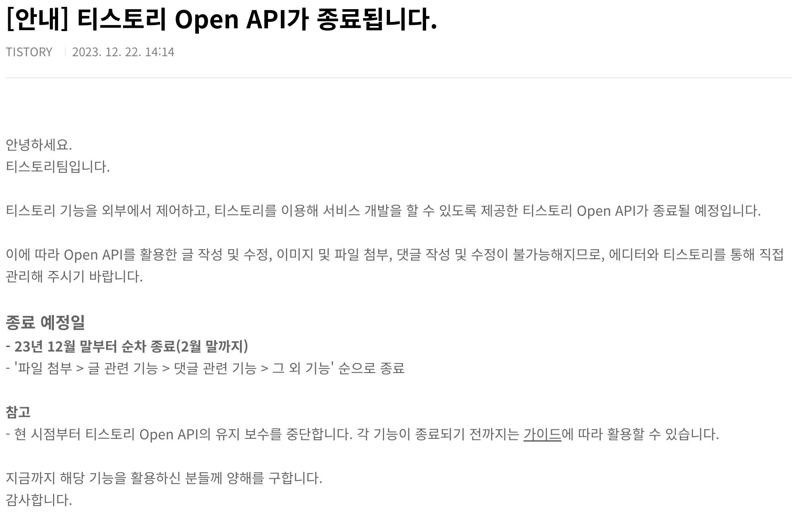
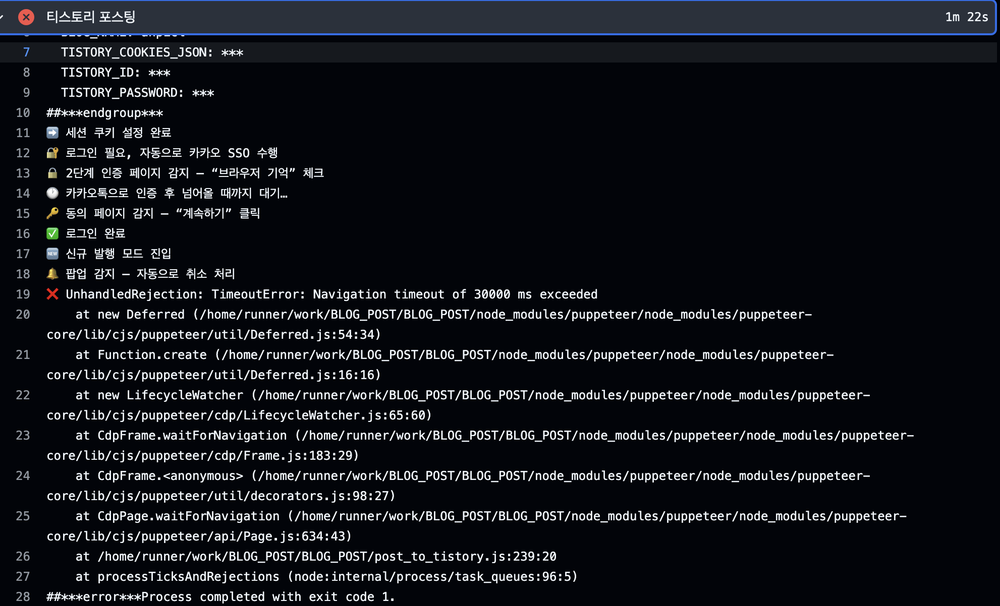
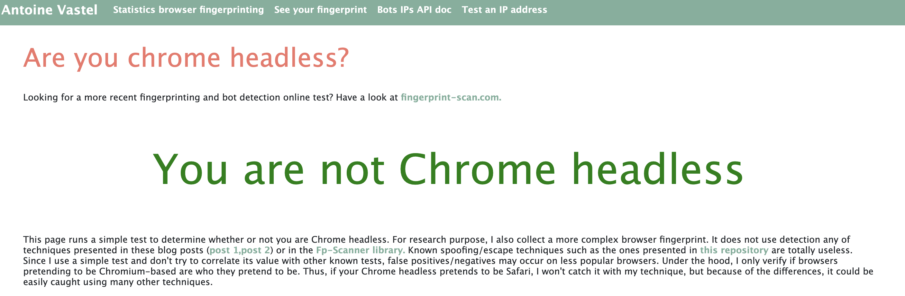
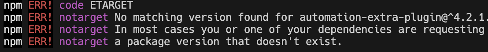

# GitHub → Tistory 자동 포스팅 스크립트

## 프로젝트 개요

IDE에서 작성하면, GitHub에 푸시된 Markdown(.md) 파일을 Tistory 블로그에 자동으로 신규 등록·수정하는 워크플로를 구축

- **배경**: `Notion`, `Obsidian`, `tistory` 등으로 파편화된 기록들을 하나로 통합하고, 최종적으로 유의미하게 기록들이 `tistory blog`로 모일 수 있도록.
      

    1. 평소에 학습 기록들을 노션에 했었는데, 이를 tistory로 올리는 과정에서 `마크다운 형식 오류`, `코드블럭 html 형식 깨짐(다른영역 침범)`, `사진 업로드 오류` 등의 빈번한 불편함이 느껴짐.

      
    *velog의 텍스트 편집기*

    
    *tistort의 텍스트 편집기. 미리보기가 있으나 라이브로 볼 수는 없다.*

    2. 다른 친구들이 사용하는 velog의 경우 편집창 내에 `live 미리보기` 창이 있어서 켜놓고 틈틈히 작성하기 편해보였으나, 티스토리의 편집기는 전혀 그런것이 지원되지 않았음. 그렇다고 velog로 넘어가고 싶진 않았음
        > **개인적으로 생각하는 velog 단점**
        >
        > 애드센스 지원 부재, 스킨은 깔끔하나 자유롭게 커스텀이 불가  

    3. github 블로그를 사용하면 대부분 해결이 가능하나, 이전에 시도할때 초기 설정이 번거롭게 느껴졌고, 이미 Tistory 블로그에 작성한 글들이(매우 작지만) 아쉬웠었음.
- **목표**: GitHub 저장소에 Markdown을 올리면, CI가 이를 감지해 Tistory에 글을 자동으로 올려주고, 수정까지 반영  

## 🛠️ 주요 기능  

1. **Markdown → HTML 변환** (`markdown-it`)  
2. **브라우저 자동화** (`puppeteer`)  
3. **카카오 SSO 로그인** 및 세션 유지 (`TISTORY_COOKIES_JSON`, ID/PW 환경변수)  
4. **신규 작성 vs. 수정 분기** (`post_map.json` 매핑)  
5. **Base64 인라인 이미지 처리** (로컬 이미지 → data URI)  
6. **GitHub Actions 연동** (변경된 `.md`만 감지, CI 실행)  
7. **GitHub bot `post_map.json` 자동 커밋·푸시** (매핑 변경 시만)  
<!-- 8. **에러·예외 처리** (`unhandledRejection`, `uncaughtException`)   -->

## ⚙️ 기술 스택  

- **Node.js 16**: 스크립트 실행 환경  
- **puppeteer**: Tistory 웹 에디터 자동화  
- **markdown-it**: Markdown → HTML 렌더링  
- **glob**: 파일 검색  
- **GitHub Actions**: CI/CD 파이프라인  
<!-- - **Bash**: 커밋 · 푸시 스크립트   -->

---

<!-- ## 상세 구현 · 트러블슈팅 타임라인 -->

## 🆕 시작  

불편함을 느끼기 시작하고, '비슷한 생각을 가지고 이미 행동에 옮겼던 사람들이 분명히 있을 것이다'라는 믿음속에. 정보의 바다속에서 구글링을 시작하였다.  
**노션 티스토리 연동**, **마크다운 티스토리 연동** 등의 키워드로 검색하자 많은 게시글이 나왔다.  
특히 평소에 자주 보는 [`개발바닥`](https://www.youtube.com/@devbadak) 유튜브를 운영하며 및 인프런의 CTO이신 **향로(이동욱)**님의 [블로그](https://jojoldu.tistory.com/)가 tistory이나, github repository 업로드 → 블로그 포스팅 자동화를 구축 해 운영중이신걸 알게 되었다.  
이를 참고하여 가능성을 보았고 작업에 착수하였다.

- 참고
   1. [향로님의 블로그 레포지토리](https://github.com/jojoldu/blog-code)  
         *여기서 모든 블로그 글을 관리하는 것을 알 수 있었다.*  
   2. [향로님의 자동화 프로젝트](https://github.com/jojoldu/md-tistory)

### 💡 구상한 기능 흐름

1. VSCODE 내 md 작성시 `미리보기` 기능이 지원되니, 해당 기능을 십분 활용하여 로컬에서 작성
2. 작성된 포스팅들을 github repository로 push
3. 이와 동시에 github → tistory로 포스팅

### 🚨 문제 1 : Tistroy Open API 미지원

공개되어있는 대부분의 포스팅 자동화(N2T 등)는, Tistory에서 공식적으로 지원하던 Open API를 활용해서 구현되어있음



근데 그게 안됨 ㅋ


그래서 영원한 나만의 도라에몽(GPT)을 통해서 해답을 찾기시작했다.  
제시받은 네가지 방식은 아래와 같다  

``` plainText
다음 네 가지 방식을 제안한다. 각 방식마다 구현 난이도, 유지보수 부담, 비용·확장성 등을 비교해서 상황에 맞게 선택하면 된다.

1. **GitHub Actions + Puppeteer(헤드리스 Chrome) 워크플로우**

   1. GitHub 저장소에 Markdown 파일을 푸시하면 Actions가 트리거
   2. `actions/setup-node`로 Node.js 환경, `npm install puppeteer`로 Puppeteer 설치
   3. Puppeteer로 티스토리 로그인→글쓰기 UI 자동 조작
   4. 장점

      1. 별도 서버 불필요, GitHub 인프라 그대로 사용
      2. 커밋만으로 배포 가능
   5. 단점

      1. CI 환경에서 헤드리스 Chrome 설치·실행 이슈
      2. Actions 실행 시간·횟수 제한

2. **Self-hosted Cron + Python Selenium 스크립트**

   1. 개인 서버(VPS, 라즈베리파이 등)에 스크립트 배포
   2. OS의 `cron` 또는 Windows의 작업 스케줄러로 주기 실행
   3. Selenium + ChromeDriver로 티스토리 글쓰기 자동화
   4. 장점

      1. 실행 환경 완전 제어 가능
      2. 복잡한 로직·로그 취합이 용이
   5. 단점

      1. 서버 유지비·운영 부담
      2. UI 변경 시 직접 스크립트 수정 필요

3. **n8n(Self-hosted) + Puppeteer 노드**

   1. Docker로 n8n 인스턴스 띄우기
   2. “GitHub 푸시” → “HTTP 요청” → “Puppeteer 노드” 순 워크플로우 구축
   3. GUI 기반으로 흐름을 시각적으로 관리
   4. 장점

      1. 코드보다 시각적 흐름 관리에 친숙
      2. 각 노드를 재사용·확장하기 쉬움
   5. 단점

      1. n8n 서버 운영 필요
      2. Puppeteer 스크립트 작성은 여전히 필요

4. **AWS Lambda(또는 Cloud Functions) + Headless Chrome Layer**

   1. Lambda Layer에 headless Chromium 번들 업로드
   2. GitHub Actions 또는 Webhook으로 Lambda 함수 호출
   3. Lambda 내부에서 Puppeteer/Selenium으로 UI 자동화
   4. 장점

      1. 서버리스로 비용 최적화
      2. 확장성·가용성 우수
   5. 단점

      1. 크고 복잡한 런타임 빌드 필요 (Chrome 번들)
      2. Cold start 지연

–––
**요약**

* **간편 절충형**: GitHub Actions + Puppeteer
* **제어형**: Self-hosted Selenium + Cron
* **시각적 워크플로우**: n8n + Puppeteer
* **서버리스**: AWS Lambda + Headless Chrome

위 네 가지 중 환경(서버 유무, CI 제약, 유지보수 여력)에 맞춰 하나를 선택해 구현하는 것을 추천한다.
```

그래서 크게 고민없이..  
가장 간단해보이는 방식인 `Github Actions + Puppeteer` 조합으로 결정했다.  
> 여기서 ***Puppeteer***란?
>
> 구글에서 제작한 Headless 브라우저(크롬) 자동 조종 프로그램. 코드를 통해 사람이 하는 것 처럼 웹 브라우저를 제어할 수 있음
>
> - headless  : GUI를 제공하지 않는 브라우저

**주요 용도**

1. 웹 데이터 수집 (크롤링 / 스크래핑)
2. 자동화 테스트 : 웹사이트 버튼 클릭, 로그인 등의 기능이 작동하는지 테스트
3. 스크린샷/PDF 생성

### ⏩ 구현 시작

준비물은 다음과 같다

1. 자동화 할 블로그용 repository
2. GitHub Secrets 설정
3. Node.js 설정

npm 설치
`npm install fs glob path markdown-it puppeteer puppeteer-extra puppeteer-extra-plugin-stealth @extra/humanize puppeteer-extra-plugin-human-typing --package-lock-only front-matter js-yaml`

`npm install glob markdown-it puppeteer puppeteer-extra puppeteer-extra-plugin-stealth @extra/humanize puppeteer-extra-plugin-human-typing front-matter js-yaml`

### 1. **기본 스크립트 작성**  

- `glob`로 `posting/**/*.md` 수집  
- `markdown-it`으로 HTML 변환  
- Puppeteer로 신(新)글 만들기: 제목·본문 입력 후 발행

### 2. **신규·수정 분기 처리**  

- `post_map.json`에 Markdown 경로 ↔ Tistory `postId` 저장  
- 이미 매핑 있으면 수정 모드, 없으면 신규 작성 모드

### 3. **카카오 SSO 로그인 안정화**  

- `TISTORY_COOKIES_JSON` 주입으로 로그인 세션 유지 시도
- 로그인·2단계 인증·동의 화면까지 순차 자동화

### 4. **Headless 모드 수정 본문 누락 버그**  

- CI(Headless) 실행 시 수정 모드에서 본문이 나타나지 않음  
- TinyMCE 에디터의 `tinymce.activeEditor.setContent(html)` API로 해결

### 5. **Base64 인라인 이미지 처리 추가**  

- Markdown `` 경로 추출  
- 로컬 이미지 파일을 Base64로 인코딩해 ``로 삽입

### 6. **GitHub Actions 워크플로 작성**  

- `paths: posting/**/*.md` 트리거  
- `git diff`로 변경된 파일만 `FILES` 환경변수에 전달  
- `node post_to_tistory.js` 실행

### 7. **post_map.json 자동 커밋/푸시**  

- `actions/checkout@v3`에 `persist-credentials: true` 추가 (권한 문제 해결)  
- 변경사항이 있을 때만 `git add`·`commit`·`push` 스크립트 적용

### 🚨 문제 : 글 발행 시 reCaptcha 검사 실행

카테고리 하위 폴더에 작성 시 제대로 포스팅되나 테스트 하던 중.. 아래와 같이 타임아웃으로 포스팅이 제대로 되지 않고 종료되는 것을 확인하였다.


로컬에서 headless를 끄고 js파일을 실행했는데, 글 작성 직후 `발행` 버튼 클릭시 하단에 `reCAPTCHA`가 뜨는것이 아닌가?  


예상되는 원인은 `잦은 자동화 반복`으로...  
LLM 피셜 다양한 `탐지벡터`가 있는데, 지금 내가 활용하는 방식은 recaptcha 감지간 낮은 신뢰점수를 유지할수 밖에없는 요소를 다량 포함하여 발동기준을 충분히 충족시키는 `완벽한 폭풍(perfect storm)` 상태가 된다고 한다.  

- **첫째**로 Github Actions의 실행환경의 IP주소가 가정용이 아닌 대규모 클라우드 제공업체의 데이터 센터 가상머신에서 실행되고
- **둘째**로 헤드리스 브라우저의 특성 또한 일반 사용자와 구분되는 `디지털 지문`(fingerprint)을 남긴다고한다.
  - 예를들어 `HeadlessChrome`이나, `navigator.webdriver = true`같은 W3C 속성

### 해결책 1 📚 puppeteer 라이브러리 사용 (브라우저 레벨 마스킹)

세상에 많은 점검방식이 있다면 수많은 회피방법도 있기마련, 관련 방법을 찾아보았다.

내가 사용중인 puppeteer의 회피 툴킷인 `puppeteer-extra-plugin-stealth`를 활용하면 브라우저를 효과적으로 은닉할 수 있다고한다.  

먼저 프로젝트에 패키지를 설치해준다

```Bash
npm install puppeteer puppeteer-extra puppeteer-extra-plugin-stealth
```

설치 후 기존에 puppeteer를 바로 실행시키는 대신 puppeteer-extra를 가져오게하여, extra는 stealth 플러그인을 실행하도록 조작해준다.

```JavaScript
// puppeteer 대신 puppeteer-extra를 가져온다.
const puppeteer = require('puppeteer-extra');

// stealth 플러그인을 가져온다.
const StealthPlugin = require('puppeteer-extra-plugin-stealth');

// puppeteer-extra에 stealth 플러그인을 사용하도록 설정합니다.
puppeteer.use(StealthPlugin());

// 이제 평소처럼 puppeteer를 사용하면 stealth 기능이 자동으로 적용됩니다.
(async () => {
  const browser = await puppeteer.launch({ headless: true });
  const page = await browser.newPage();
  
  await browser.close();
})();
```

필요하다면 적용 후 기존에 매크로로 넘어가는 대신 headless browser 검사하는 웹페이지로 이동시켜 확인할 수 있다.

이때 검사는 local terminal에서 `HEADLESS=false
 node <실행시킬 js파일명>` 또는 HEADLESS를 끈 채 github action에서 실행하도록 해주면 육안으로 확인할 수 있다.

```javascript
// 봇 탐지 테스트 페이지로 이동하여 효과를 확인할 수 있다.
await page.goto('https://arh.antoinevastel.com/bots/areyouheadless');
await page.screenshot({ path: 'stealth_test.png' });
```



정상적으로 적용되었다면 위와 같이 headless모드가 아니라고 표현해준다.

이제 정상적으로 stealth가 적용되었지만, 이것으로 리캡챠가 **`해결되진 않았다.`** 😥

### 해결책 2 👥 인간처럼 보여주기

탐지벡터에는 브라우저의 뷰포트, 동작 지연시간 등도 포함되는데, 이를 인간처럼 보이게하는 기법을 시도할 수 있다.

#### 🌄 2-1 뷰포트 설정

브라우저를 실행시키는 라인 직후 `await page.setVieport({ width: 1920, height: 1080 })`와 같이 실제 사용자들이 사용하는 해상도를 입력해준다.

이는 리캡차 검사 서버에서는 headless의 `'어 브라우저 안키고 돌아가네?'`가 아닌 `'어? 1920*1080 사이즈의 브라우저가 켜진 상태에서 돌아가는구나?'`라고 착각하게 만들어준다.

실제 코드에서는 아래와 같이 들어갔다.

```javascript
(async () => {
    const browser = await puppeteerExtra.launch({
        executablePath: CHROME_PATH,
        headless: HEADLESS ? 'new' : false,
        userDataDir: path.join(PROJECT_ROOT, 'puppeteer_profile'),
        args: ['--no-sandbox', '--disable-setuid-sandbox', '--disable-dev-shm-usage']
    });
    const page = await browser.newPage();
    /* page를 선언해 준 다음 넣어준다. */
    await page.setVieport({ width: 1920, height: 1080 });
    /* 이후 기존 로그인과정 진행 */
```

#### ⏳ 2-2 무작위 지연시간

코드 곳곳에 안정화를 위한 지연시간이 포함되어있는데, (페이지 전환 로딩, 애니메이션 대기 등) 이를 고정된 시간 대신 n초 사이 무작위 시간동안 기다리게 할 수 있다.

만일 기존 대기시간이 `await page.waitForTimeout(2000)` 과 같이 구현이 되어있었다면,

`await page,waitForTimeout(Math.random() * 2000 + 1000)` 과 같이 `Math.random()`을 사용하여 랜덤한 시간이 인자로 들어갈 수 있게 해줄 수 있다.

#### 🐭 ~~마우스 움직임 시뮬레이션 구현~~

`page.click()`을 사용하는건 마우스 커서가 순간이동 하는것과 같다. 이는 누가봐도 기계 / 매크로가 동작하는것이다. ~~이를 위해 라이브러리가 있다~~.  
**이젠 없다.**

`ghost-cursor` 라이브러리는 아래 세 기능을 구현하여 `인간적임`을 표현해주는 라이브러리다.

- 〰️ 베지에 곡선(Bezier Curves) 경로: 두 점 사이를 직선이 아닌, 실제 사람이 마우스를 움직이는 것처럼 부드러운 곡선으로 이동한다.  
- ⏩ 피츠의 법칙(Fitts's Law) 적용: 목표물까지의 거리와 목표물의 크기를 고려하여 이동 속도를 조절합니다. 멀고 작은 목표일수록 더 신중하게 움직이는 인간의 행동을 모방한다.  
- ⚡ 오버슈팅(Overshooting) 및 보정: 목표 지점을 살짝 지나치거나 빗나간 후, 다시 목표 지점으로 커서를 되돌리는 움직임을 시뮬레이션한다.  
- 📳 무작위성과 미세한 떨림(Jitter): 클릭 위치를 요소의 정중앙이 아닌 약간의 무작위성을 가진 지점으로 설정하고, 사람이 마우스를 가만히 두지 못하는 것처럼 미세한 떨림을 추가한다.

`puppeteer-extra`의 플러그인인 `@extra/humanize`는 이 ghost-cursor 라이브러리를 기반으로 page.click() 과 같은 기본 함수를 👨‍💻사람같은 마우스 움직임으로 만들어준다.

플러그인을 설치해준다

```Bash
npm install @extra/humanize 
```



응.. 에러터진다. 찾아보니 내가 설치하려던 npm은 repository에서 아예 사라졌고. 다른 puppeteer/humanize 플로그인이 있으나, 그 것도 4년전에 업데이트가 종료되었다...

~~아래 코드를 소스코드 최상단에 적용만 해주면, 모든 `.click()`함수가 🐭 → 🧓인간이 되버린다.~~

```javascript
// 플러그인 가져오기
const HumanizePlugin = require('@extra/humanize');

// extra에 새로운 플러그인을 적용
puppeteerExtra.use(HumanizePlugin()); // 마우스 움직임을 인간화
```

#### ⌨️ 타이핑 시뮬레이션 구현

실제 사람은 오타도내고, 백스페이스로 수정도하고, 속도도 계속 변하는데, `page.type()` 기본함수는 일정한 속도를 제공하기때문에 `are you robot?`과 같은 질문을 받을 수 밖에 없다.

이에 대응하는 플러그인을 사용하여 `page.typeHuman()`으로 함수를 대체하여 인간적인 타이핑을 구현한다.

먼저, 프로젝트 경로에서 터미널을 열어 아래 커맨드를 입력하여 설치해준다.

```Bash
npm install puppeteer-extra-plugin-human-typing
```

이 플러그인은 **가변 입력속도**, 오타 및 수정 묘사, 단어 사이 간격 조절 등 자연스러운 멈춤을 구현하여 ***사람답게 타이핑하는것***을 묘사한다.

```javascript
// 플러그인 가져오기
const HumanTypingPlugin = require('puppeteer-extra-plugin-human-typing');

// 플러그인 적용
puppeteerExtra.use(HumanTypingPlugin());

// 이후 .type 함수를 .typeHuman으로 바꿔주면된다.
// 아래와같이 구체적으로 수를 지정해줘도되지만, 안해줘도 무방
await page.typeHuman(
  '#search-input', 
  '이것은 사람처럼 보이는 타이핑 테스트입니다.', 
  {
    minimumDelayInMs: 150, // 최소 지연
    maximumDelayInMs: 650, // 최대 지연
    backspaceMinimumDelayInMs: 750 // 백스페이스 최소 지연
  }
);
```

이러한 방식으로 사용하면 된다.

### 해결책 2 🌐 pupppeteer에서 인증 프록시 구현하기 (네트워크 레벨 마스킹)

github actions의 ip가 아닌 프록시 서버의 ip로 우회해줘서 네트워크 레벨의 마스킹을 해주는 방식이다.  
