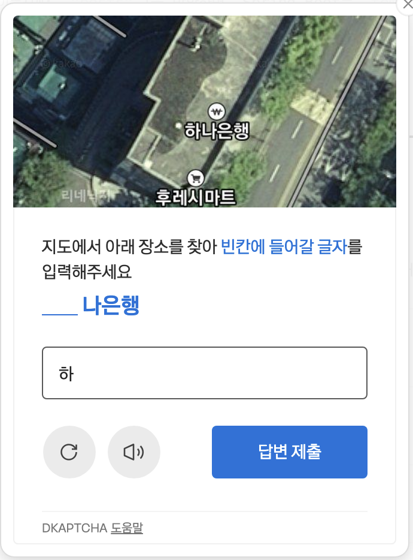
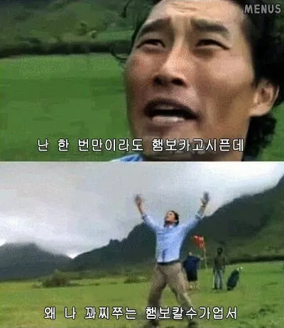

# GitHub → Tistory 자동 포스팅 스크립트 (2편)



우리 ~~죽이고싶은~~ 귀여운 DKAPTCHA 보고가세요 :)

## 또 돌아왔다. 2편



진짜 자동화하고싶어요.. 하게해주세요 제가 크롤링하거나 무지성 AI 딸깍 게시글 작성하는것도 아닌데 왜 이것도 못하게 해 난 행복할수가 없는거야 꽈찌쭈는 햄보칼수없어

## 구원투수 amazon Q development CLI

AWS 교육이 있었는데 마지막 세션으로 AI 교육이 있었다. 근데 이 친구가, 디지털 지문 지워주는 작업을 해주는게 아닌가?
근데 이게 정확히 먹힌다고는 장담을 못하는게,, 이미 내 `계정` 자체가 tistory 측에서 `I see you 👀`상태기 때문에.  
puppeteer로 돌리지 않고 직접 접속해도 DKAPTCHA가 뜨는 상황이다.. 일단 당분간 관망하는거로 해야겠다.

알겠습니다. 이모지를 모두 제거하고, 계정 자체에 CAPTCHA 락이 걸려있는 현재 상황과 그로 인한 한계를 명확히 기술하겠습니다. 또한 '디지털 지문'에 대한 내용을 더 정확하고 간결하게 보강하여 전체적인 톤을 기술적으로 다듬겠습니다.


## 개선된 디지털 지문 우회 시도와 그 한계

먼저 현재 상황의 한계를 명확히 할 필요가 있습니다. 제 티스토리 계정 자체가 이미 반복적인 자동화 시도로 인해 봇 감지 시스템의 집중 감시 대상이 된 것으로 보입니다. 이로 인해 일반적인 방법으로 접속해도 CAPTCHA가 발생하는, 소위 '계정 락' 상태에 가깝습니다.

따라서 지금부터 설명할 기술적인 우회 방법들이 당장의 락을 해제하지는 못할 가능성이 높으며, 장기적인 관점에서 자동화 스크립트의 탐지 가능성을 최소화하기 위한 개선 작업으로 이해해야 합니다.

### **인간 행동 패턴 시뮬레이션**

자동화 스크립트는 정해진 좌표를 오차 없이 클릭하고, 일정한 속도로 작업을 수행합니다. 이러한 패턴은 봇으로 탐지될 주요 원인 중 하나입니다. 이를 해결하기 위해 클릭 전후에 불규칙한 지연 시간을 추가하고, 마우스 커서가 직선이 아닌 여러 단계(steps)를 거쳐 이동하도록 시뮬레이션했습니다.

```javascript
// 인간 행동 패턴 시뮬레이션을 위한 유틸리티 함수
const randomDelay = (min, max) => {
  return Math.floor(Math.random() * (max - min + 1)) + min;
};

// 클릭 전 임의의 지연 추가
await page.waitForTimeout(randomDelay(800, 2000));

// 마우스 움직임을 여러 단계로 나누어 시뮬레이션
await page.mouse.move(x + randomDelay(-5, 5), y + randomDelay(-3, 3), {steps: randomDelay(5, 10)});

// 클릭 전후 짧은 지연
await page.waitForTimeout(randomDelay(50, 200));
await page.mouse.click(x, y);
await page.waitForTimeout(randomDelay(100, 300));
```

### **세션 관리 개선**

매번 새로운 브라우저 환경에서 접속을 시도하는 것은 비정상적인 접근 패턴으로 감지될 수 있습니다. `userDataDir` 옵션을 사용하여 브라우저 프로필 디렉터리를 지정하면, 기존의 쿠키나 로그인 세션 정보를 재사용할 수 있습니다. 이를 통해 반복적인 접근을 보다 일반적인 사용자 활동처럼 보이게 만들 수 있습니다.

```javascript
// 브라우저 프로필 디렉토리 설정으로 세션 유지
const browser = await puppeteerExtra.launch({
  executablePath: CHROME_PATH,
  headless: HEADLESS ? 'new' : false,
  userDataDir: path.join(PROJECT_ROOT, 'puppeteer_profile'),
  args: [
    '--no-sandbox', 
    '--disable-setuid-sandbox', 
    '--disable-dev-shm-usage',
    '--disable-blink-features=AutomationControlled' // 자동화 감지 기능 비활성화
  ]
});
```

### **브라우저 디지털 지문(Digital Fingerprint) 변경**

브라우저 디지털 지문이란, User-Agent, 화면 해상도, 설치된 폰트, WebGL 정보 등 여러 브라우저 및 시스템 특성을 조합하여 사용자를 식별하는 기술입니다. 동일한 지문을 계속 사용하는 것은 자동화 스크립트로 탐지될 확률을 높입니다. 이를 완화하기 위해 스크립트 실행 시마다 지문의 일부 요소를 변경하는 작업을 적용했습니다.

```javascript
// 새로운 문서 로드 시 브라우저 지문 변경
await page.evaluateOnNewDocument(() => {
  // 스크린 크기 무작위화
  Object.defineProperty(window, 'innerWidth', {
    get: () => 1920 + Math.floor(Math.random() * 20)
  });
  Object.defineProperty(window, 'innerHeight', {
    get: () => 1080 + Math.floor(Math.random() * 20)
  });
  
  // WebGL 렌더러 정보 일부 수정
  const getParameter = WebGLRenderingContext.prototype.getParameter;
  WebGLRenderingContext.prototype.getParameter = function(parameter) {
    if (parameter === 37445) return 'Intel Inc.';
    if (parameter === 37446) return 'Intel Iris Graphics 6100';
    return getParameter.apply(this, arguments);
  };
});
```

### **타이밍 패턴 조정**

사람의 타이핑 속도는 일정하지 않으며, 오타나 잠시 멈추는 등의 행동이 자연스럽게 발생합니다. 스크립트가 너무 빠르고 정확하게 텍스트를 입력하는 패턴을 방지하기 위해, 문자 입력 사이에 임의의 지연을 추가하고 낮은 확률로 오타와 수정을 시뮬레이션하는 함수를 구현했습니다.

```javascript
// 인간과 유사한 타이핑 시뮬레이션
async function typeHumanLike(page, selector, text) {
  await page.focus(selector);
  
  for (const char of text) {
    await page.waitForTimeout(Math.floor(Math.random() * 150) + 30);
    await page.keyboard.type(char);
    
    // 낮은 확률로 오타 및 수정 시뮬레이션
    if (Math.random() < 0.05) {
      await page.keyboard.press('Backspace');
      await page.waitForTimeout(randomDelay(200, 350));
      await page.keyboard.type(char);
    }
  }
}
```

### **IP 로테이션 전략**

특정 IP 주소(특히 데이터센터 IP)에서의 반복적인 접근은 차단될 확률이 높습니다. 로컬 환경에서 테스트 시, 프록시 서버 목록을 이용하여 요청마다 다른 IP 주소를 사용하도록 IP 로테이션 전략을 구현했습니다.

```javascript
// 프록시 설정 (로컬 실행 시)
if (!process.env.GITHUB_ACTIONS) {
  const proxyList = [ /* ... 프록시 서버 목록 ... */ ];
  const randomProxy = proxyList[Math.floor(Math.random() * proxyList.length)];
  args.push(`--proxy-server=${randomProxy}`);
}
```

### **CAPTCHA 자동 감지 및 대응**

모든 우회 노력에도 불구하고 CAPTCHA가 나타날 경우를 대비해, 이를 감지하고 대응하는 로직을 추가했습니다. 스크립트는 CAPTCHA 관련 `iframe` 요소의 존재를 주기적으로 확인하고, 감지 시 콘솔에 알림을 출력한 후 사용자가 수동으로 해결할 때까지 대기합니다.

```javascript
// CAPTCHA 감지 및 대기
async function waitForCaptchaResolution(page) {
  try {
    const captchaFrame = await page.waitForSelector('iframe[src*="recaptcha"]', { timeout: 5000 });
    
    if (captchaFrame) {
      console.log('CAPTCHA가 감지되었습니다. 수동으로 해결이 필요합니다.');
      await page.waitForFunction(() => !document.querySelector('iframe[src*="recaptcha"]'), { timeout: 300000 });
      console.log('CAPTCHA 해결이 확인되었습니다. 스크립트를 재개합니다.');
    }
  } catch (e) {
    // 지정된 시간 내에 CAPTCHA가 감지되지 않으면 정상 진행
  }
}
```

### **결과 및 현재 상태**

위 작업들을 통해 스크립트 자체의 탐지 가능성은 낮출 수 있었지만, 예상대로 계정에 적용된 CAPTCHA 락은 여전히 유지되고 있습니다. 즉, Puppeteer를 사용한 자동화 시도 여부와 관계없이 제 계정으로 로그인하는 행위 자체에 CAPTCHA가 우선적으로 적용되는 상황입니다.

따라서 현재로서는 자동화 스크립트의 안정성 확보와는 별개로, 계정의 신뢰도가 회복될 때까지 기다리는 시간이 필요할 것으로 판단됩니다. 이 개선 작업들은 향후 계정 락이 해제되었을 때, 다시 탐지 대상이 되지 않도록 하는 장기적인 기반이 될 것입니다.

> "나는 로봇이 아닙니다" 체크박스를 클릭하는 로봇이 되지 않기 위한 여정은 계속됩니다...