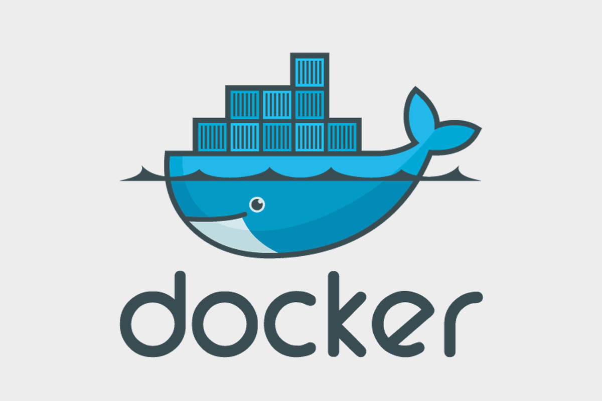
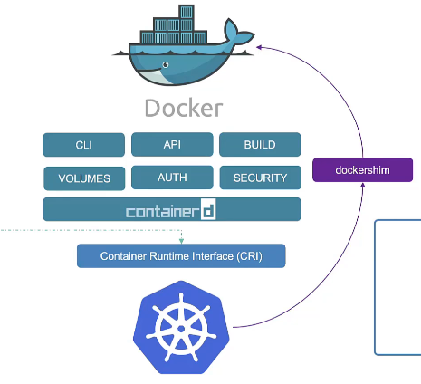

# 컨테이너 런타임 인터페이스 (CRI)

## CRI란?

CRI(Container Runtime Interface)란, Kubelet이 코드를 변경하거나 재컴파일할 필요 없이, CRI 표준을 따르는 `containerd`, `CRI-O` 같은 다양한 컨테이너 런타임을 플러그인처럼 교체할 수 있도록 만든 gRPC 기반의 표준 통신 규약(API)다.

## 배경: Docker의 시대와 CRI의 등장


초기 컨테이너 시대에는 `rkt`와 같은 다른 기술도 있었지만, Docker가 사용자 친화적인 경험을 제공하며 컨테이너 작업을 매우 간편하게 만들어 시장을 지배했다.

이러한 이유로, 초기 쿠버네티스는 Docker에 직접적으로 의존하여 개발되었다. 이는 Kubelet 코드가 Docker의 API를 직접 호출하는 긴밀한 결합 구조를 의미했다. 하지만 이 구조는 다음과 같은 문제점을 낳았다.

1.  **확장성의 한계**: 쿠버네티스의 인기가 높아지면서 `rkt`와 같은 다른 컨테이너 런타임들도 쿠버네티스에서 지원되기를 원했지만, Docker에 종속된 구조 때문에 새로운 런타임을 통합하기 매우 어려웠다.
2.  **유지보수의 어려움**: Docker 내부 기능이 변경될 때마다 쿠버네티스 코드도 함께 수정해야 하는 등, 양쪽 프로젝트 모두에게 유지보수 부담이 가중되었다.

이러한 문제를 해결하고 특정 런타임에 대한 종속성에서 벗어나기 위해, 쿠버네티스는 **CRI(Container Runtime Interface)** 라는 표준을 도입했다.

## CRI와 표준화 (OCI)

CRI는 컨테이너 런타임이 **OCI(Open Container Initiative) 표준**을 준수하는 것을 전제로 한다. OCI는 다음 두 가지 명세로 구성된다.

  * **이미지 명세 (imagespec)**: 컨테이너 이미지를 어떻게 빌드해야 하는지에 대한 표준.
  * **런타임 명세 (runtimespec)**: 컨테이너 런타임을 어떻게 개발해야 하는지에 대한 표준.

이 표준 덕분에 OCI를 준수하는 모든 런타임은 CRI를 통해 쿠버네티스와 호환될 수 있는 길이 열렸다.

## Docker와 Dockershim의 분리

하지만 Docker는 CRI 표준이 생기기 이전에 개발되었기 때문에 CRI를 지원하도록 설계되지 않았다. 당시 Docker의 영향력은 막강했으므로 쿠버네티스는 Docker 지원을 포기할 수 없었고, 임시 해결책으로 `dockershim`을 도입했다.



`dockershim`은 Kubelet의 CRI 요청을 Docker API가 알아들을 수 있는 형태로 변환해주는 '번역기' 역할을 했다. 하지만 이 방식은 불필요한 복잡성을 더하고 유지보수 부담을 가중시키는 원인이 되었다.

결국 쿠버네티스는 **버전 1.24에서 `dockershim`을 완전히 제거**했고, 이로써 Docker Engine에 대한 직접 지원을 중단했다.

## Docker와 containerd: 변화의 핵심

"Docker 지원이 중단되었다"는 말이 Docker로 만든 이미지를 더 이상 못 쓴다는 의미는 아니다. 그 이유는 Docker의 아키텍처를 이해하면 명확해진다.

  * **Docker**: 단순한 런타임이 아닌, CLI, API, 이미지 빌드 도구, `runC`라는 런타임, 그리고 이들을 관리하는 데몬인 `containerd`를 포함하는 종합 툴킷이다.
  * **containerd**: 원래 Docker의 일부였지만, 현재는 CNCF의 졸업 프로젝트로 독립했다. **`containerd`는 CRI와 호환**되기 때문에 쿠버네티스와 직접 통신할 수 있다.

즉, 쿠버네티스는 Docker라는 '종합 툴킷' 전체와의 통신을 중단하고, 그 핵심 부품이자 CRI 호환 런타임인 **`containerd`와 직접 통신**하는 방식으로 변경된 것이다.

Docker로 빌드한 이미지는 OCI 이미지 명세를 따르므로, `containerd`를 포함한 모든 CRI 호환 런타임에서 완벽하게 동작한다.

## CRI 생태계의 현재 모습

CRI 표준이 정착되면서 컨테이너 런타임 생태계는 더욱 다양하고 전문화되었다. 이제 각 상황과 목적에 맞는 전문 도구들이 등장했고, 개발자와 운영자는 필요에 따라 적절한 도구를 선택할 수 있게 되었다.

과거 Docker 하나로 모든 것을 해결하던 시대에서, 이제는 **역할별로 특화된 도구들이 CRI를 통해 협력**하는 구조로 발전한 것이다.

## 실제 사용 도구들

### crictl
- **용도**: CRI 호환 런타임을 직접 제어하는 CLI 도구
- **특징**: 쿠버네티스 없이도 컨테이너 런타임 디버깅/관리 가능
- **사용자**: 주로 클러스터 관리자가 문제 해결 시 사용
- **지원 런타임**: containerd, CRI-O 등 모든 CRI 호환 런타임

### nerdctl  
- **용도**: containerd를 위한 Docker 호환 CLI
- **특징**: Docker 명령어와 거의 동일한 사용법 제공
- **사용자**: 개발자가 로컬에서 containerd 테스트할 때 유용
- **장점**: Docker에서 containerd로 마이그레이션 시 학습 비용 최소화

### ctr
- **용도**: containerd의 네이티브 CLI 도구
- **특징**: crictl보다 더 로우레벨 제어 가능
- **사용자**: containerd 개발자나 고급 디버깅이 필요한 관리자
- **CKA**: containerd 관련 문제 해결 시 자주 사용됨

### runc
- **용도**: 실제 컨테이너 실행을 담당하는 OCI 런타임
- **특징**: containerd, CRI-O 등이 내부적으로 사용하는 최하위 런타임
- **사용자**: 직접 사용보다는 아키텍처 이해를 위해 알아야 함
- **중요성**: 모든 컨테이너 런타임의 기반이 되는 핵심 구성요소

### 각 도구의 관계도
```
개발/운영 단계별 도구 사용:

로컬 개발:
Docker CLI → Docker Engine
nerdctl → containerd

클러스터 디버깅:
crictl → CRI 런타임 (containerd, CRI-O 등)
ctr → containerd (고급 디버깅)

최하위 런타임:
runc ← containerd, CRI-O 등이 내부적으로 사용

프로덕션 운영:
kubectl → 쿠버네티스 API → CRI 런타임 → runc
```

이처럼 CRI 표준 덕분에 각 도구가 명확한 역할 분담을 하면서도 서로 호환되는 생태계가 구축되었다.

## 요약

  * **초기**: 쿠버네티스는 **Docker Engine**에 직접 의존했다.
  * **과도기**: 다양한 런타임을 지원하기 위해 **CRI**가 도입되었고, Docker와의 호환성을 위해 **`dockershim`**이 사용되었다.
  * **현재**: **`dockershim`이 제거**되면서 쿠버네티스는 **`containerd`**와 같은 CRI 호환 런타임과 직접 통신한다. Docker로 만든 이미지는 OCI 표준 덕분에 여전히 문제없이 사용할 수 있다.
