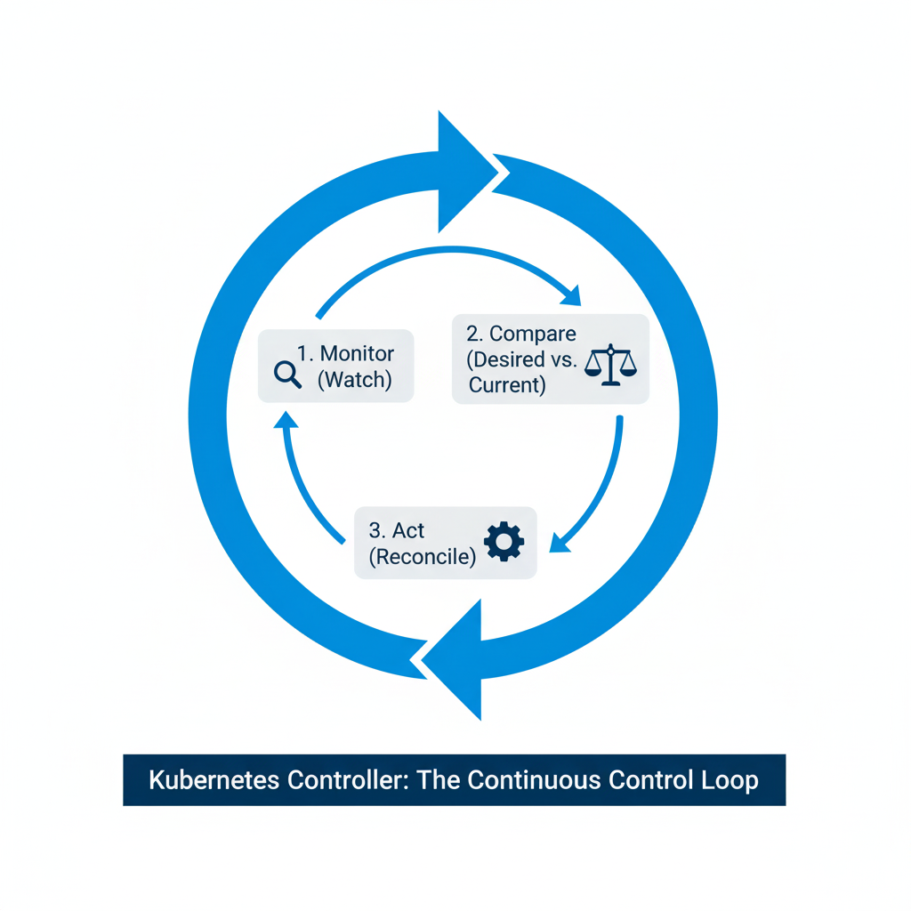

# Kube Controller Manager

## 쿠버네티스의 자동화된 운영팀, Kube-controller-manager

`kube-controller-manager`는 쿠버네티스 컨트롤 플레인에서 **다양한 컨트롤러들을 실행하고 관리하는 핵심 컴포넌트**다. `apiserver`가 클러스터의 모든 요청을 받는 관문이라면, `controller-manager`는 클러스터의 상태가 항상 올바르게 유지되도록 **끊임없이 감시하고 조치하는 자동화된 두뇌** 역할을 한다.

-----

## 컨트롤러(Controller)란 무엇인가?

컨트롤러를 이해하기 위해 회사의 여러 부서를 상상해 보자. 인사팀은 항상 직원 수를 모니터링하다가 퇴사자가 생기면 새로운 직원을 채용한다. 시설팀은 회사 건물의 온도를 감시하다가 너무 더워지면 에어컨을 켠다.

쿠버네티스의 컨트롤러도 이와 같다. 각 컨트롤러는 특정 분야를 책임지는 독립적인 프로세스로, 다음 두 가지 일을 끊임없이 반복한다.


1.  **감시 (Watch)**: `apiserver`를 통해 클러스터의 현재 상태(Current State)를 지속적으로 지켜본다.
2.  **조치 (Reconcile)**: 사용자가 정의한 원하는 상태(Desired State)와 현재 상태가 다를 경우, 이를 일치시키기 위한 작업을 수행한다.

이처럼 컨트롤러는 쿠버네티스에 내장된 대부분의 "지능적인" 자동화 기능의 실체다.

-----

## 주요 컨트롤러 종류와 역할 예시

`kube-controller-manager`라는 단일 프로세스 안에는 수많은 컨트롤러들이 패키지처럼 묶여서 실행된다. 대표적인 예는 다음과 같다.

### 노드 컨트롤러 (Node Controller)

  - **역할**: 클러스터 내의 모든 노드들의 상태를 감시하고 관리한다.
  - **동작 방식**:
    1.  **5초마다** 각 노드의 상태(heartbeat)를 확인한다.
    2.  만약 특정 노드로부터 **40초** 동안 응답이 없으면, 해당 노드를 **`Unreachable`(접근 불가)** 상태로 변경한다.
    3.  그 후 **5분**의 유예 시간을 준다.
    4.  5분 후에도 노드가 복구되지 않으면, 해당 노드에 할당되어 있던 파드(Pod)들을 다른 건강한 노드로 옮겨 다시 실행시킨다.

### 복제 컨트롤러 (Replication Controller / ReplicaSet Controller)

  - **역할**: 레플리카셋(ReplicaSet)의 상태를 감시하며, 항상 원하는 수의 파드가 실행되도록 보장한다.
  - **동작 방식**: 사용자가 "nginx 파드는 항상 3개가 떠 있어야 해"라고 정의하면, 이 컨트롤러는 현재 실행 중인 nginx 파드 수를 계속 확인한다. 만약 파드 하나가 죽어서 2개가 되면, 즉시 새로운 파드 하나를 생성하여 개수를 3개로 맞춘다.

이 외에도 **Deployment, Service, Namespace, PersistentVolume** 등 우리가 사용하는 거의 모든 쿠버네티스 객체들은 각각을 담당하는 컨트롤러를 통해 자동화된 로직이 구현된다.

-----

## 설정 및 확인 방법

`controller-manager`도 `apiserver`와 마찬가지로 설정을 확인하고 수정할 수 있다.

### 설정 파일 위치

  - **kubeadm 환경 (대부분의 경우)**: 스태틱 파드로 실행되며, 설정 파일은 **`/etc/kubernetes/manifests/kube-controller-manager.yaml`** 이다. 이 파일을 수정하면 자동으로 재시작된다.
  - **수동 설치 환경**: `systemd` 서비스로 실행되며, 관련 서비스 파일을 수정해야 한다.

### 실행 상태 확인

마스터 노드에서 아래 명령어를 실행하면 현재 적용된 모든 옵션을 직접 볼 수 있다.

```bash
ps aux | grep kube-controller-manager
```

### 주요 설정 플래그

  - **`--controllers`**: 실행할 컨트롤러를 직접 지정할 수 있다. 기본적으로는 모두 활성화되지만, 특정 컨트롤러만 선택적으로 켜거나 끌 때 사용한다. (예: `--controllers=namespace,serviceaccount`) 만약 특정 기능이 동작하지 않는다면 이 설정을 확인해 볼 수 있다.
  - **노드 컨트롤러 관련 플래그**: 위에서 설명한 노드 컨트롤러의 동작 시간은 모두 플래그로 조정 가능하다.
      - `--node-monitor-period`: 노드 상태 확인 주기 (기본값: 5초)
      - `--node-monitor-grace-period`: 노드 `Unreachable`判定까지의 유예 시간 (기본값: 40초)
      - `--pod-eviction-timeout`: 노드 장애 시 파드를 추방(evict)하기까지 기다리는 시간 (기본값: 5분)