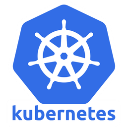
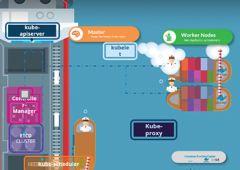

# 쿠버네티스 (Kubernetes | K8s) 기본개념

## Kubernetes 란? 
---

컨테이너로 구성된 웹 어플리케이션이 있다고 하자. 일반적인 개인 / 팀 프로젝트 수준에서는 컨테이너가 많아봐야 채 10개가 넘어가지 않을 것이다. 

하지만 마이크로 서비스 아키텍쳐를 채택하거나, 서비스의 부하 분산을 위해서 수평확장 시키는 등의 작업으로 관리해야 할 컨테이너가 100~200정도의 수준이 된다면? 

새로운 배포 버전을 올리거나, 특정 컨테이너가 죽어서 다시 올려야 하는 경우 관리에 들어가는 노력은 그만큼 증가할 것이다.

그러한 불편을 해소하는 다양한 기능을 가진 강력한 `오케스트레이션` 도구다.

이는 로드밸런싱, 스토리지 오케스트레이션, 롤아웃/롤백, bin packing 자동화, 자동복구, 배치실행 등등등.. 많은 기능을 제공하며 이를 차근히 알아가보자.

## 클러스터 아키텍처
---

### 클러스터란?

컨테이너화 된 어플리케이션을 실행하고 관리하는 `노드`가 있는데, 이 노드들의 집합을 말하며, 모든 클러스터는 최소 한 개의 워커 노드를 가져야 한다. 

**컨테이너선 비유로 이해하기:**

쿠버네티스의 목적은 애플리케이션을 **자동화**된 방식으로 컨테이너로 호스팅하여 여러 인스턴스를 쉽게 배포하고, 어플리케이션 내 여러 서비스 간에 통신을 원활하게 하는 것. 이를 위해 여러 구성요소가 함께 작동하는데, 이에는 크게 두가지가있다.
마스터노드 (통제선), 워커 노드 (화물선)

- **마스터 노드**: 제어선의 선장실과 같다.  
  쿠버네티스 클러스터 관리, 여러 노드에 대한 정보 저장, 컨테이너 배치 계획, 노드 및 컨테이너 모니터링 등의 작업을 담당한다. 이러한 작업은 `control plane` 구성요소로부터 수행된다.
  - **etcd**: 선장실의 항해 일지. 클러스터 정보를 key-value값으로 저장하는 DB.
  - **kube-scheduler**: 화물 배치(크레인) 담당자. 컨테이너의 리소스 요구 사항, 워커 노드의 용량, taint, tolleration, node affinity 규칙과 같은 정책 & 제약조건을 고려하여 컨테이너를 배치할 적절한 노드를 식별한다.
  - **kube-controller-manager**: 선단 관리자. 각 배들이 계획대로 운항하는지 감시하고 문제 발생 시 조치를 취한다.
    - 노드 컨트롤러는 노드를 관리하고, 새로운 노드를 등록, 사용할 수 없거나 파괴된 노드를 처리한다
    - 복제 컨트롤러는 복제 그룹에서 원하는 수의 컨테이너가 실행되도록 보장한다.
  - **kube-apiserver**: 선장실의 통신 장비. 모든 클러스터 작업을 조율하기 위해 다음과 같은 k8s API를 제공한다.
    - 클러스터 관리 작업을 수행하는 외부 사용자
    - 클러스터 상태를 모니터링하고 필요한 변경을 수행하는 다양한 컨트롤러
    - 서버와 통신하는 워커 노드
  - **container runtime engine**: DNS 서비스와 네트워킹 솔루션 마찬가지로 모두 컨테이너로 배포될 수 있기 때문에 제어 구성 요소가 컨테이너로 호스팅되는 경우, 마스터 노드를 포함한 모든 노드에 컨테이너를 실행할 수 있는 소프트웨어가 필요하다. 옵션에는 `Docker`, `ContainerD`, `Rocket` 등의 주요 옵션이 있다.

- **워커 노드**: 소형 컨테이너선들로, 실제로 컨테이너(애플리케이션)를 싣고 운반하는 역할을 한다. 선장실의 지시를 받아 컨테이너를 적재하고 목적지까지 안전하게 운송한다.
  - **kubelet**: 각 워커선의 선장. 마스터 노드의 지시를 받아 자신의 배에서 컨테이너를 관리한다. kube API 서버의 명령을 수신하고 필요에 따라 컨테이너를 배포하거나 제거한다. kube API 서버는 kubelet에서 주기적으로 상태 보고서를 가져와 노드 및 컨테이너를 모니터링한다.
  - **kube-proxy**: 항구의 교통 관제사. 서비스간 통신을 가능하게 한다. 즉 워커 노드 간 통신을 각 워커 노드에서 실행되는 kube 프록시 서비스를 통해 활성화된다.

- **Pod**: 컨테이너를 담는 가장 작은 화물 단위. 하나 이상의 컨테이너가 함께 묶여서 같은 목적지로 배송된다.
- **Service**: 항구의 안내소. 외부에서 특정 화물(Pod)을 찾을 때 정확한 위치를 알려주는 역할을 한다.

## 요약

- k8s 아키텍처(클러스터)는 제어선과 화물선에 비유할 수 있는 마스터 노드와 한개 이상의 워커 노드로 구성된다
- 마스터 노드는 etcd, 스케쥴러, 컨트롤러, kube API 서버와 같은 구성 요소를 사용하여 클러스터를 관리한다
- 워커 노드는 kubelet이 관리하는 컨테이너를 실행하고, kube proxy를 통해 컨테이너 간 통신을 활성화한다
- 컨테이너를 실행하려면 모든 노드에 Docker나 ContainerD와 같은 컨테이너 런타임 엔진이 필요하다