# 쿠버네티스 (Kubernetes | K8s) 시작하기
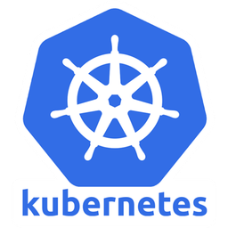
## Kubernetes 란? 
---

컨테이너로 구성된 웹 어플리케이션이 있다고하자. 일반적인 개인 / 팀 프로젝트 수준에서는 컨테이너가 많아봐야 채 10개가 넘어가지 않을 것이다. 

하지만 마이크로 서비스 아키텍쳐를 채택하거나, 서비스의 부하 분산을 위해서 수평확장 시키는 등의 작업으로 관리해야 할 컨테이너가 100~200정도의 수준이 된다면? 

새로운 배포 버전을 올리거나, 특정 컨테이너가 죽어서 다시 올려야 하는 경우 관리에 들어가는 노력은 그만큼 증가 할 것이다.

그러한 불편을 해소하는 다양한 기능을 가진 강력한 `오케스트레이션` 도구다.

이는 로드밸런싱, 스토리지 오케스트레이션, 롤아웃/롤백, bin packing 자동화, 자동복구, 배치실행 등등등.. 많은 기능을 제공하며 이를 차근히 알아가보자.

## 들어가기에 앞서

가용한 자원이 두 개 있기 때문에 이를 활용하여 윈도우 데스크탑에 linux 가상머신으로 클러스터를 구성하고, 맥에서는 클러스터를 원격 제어해보자

### 최종목표
- 서버 (Windows 데스크톱): `VirtualBox` 가상머신 2대(마스터1, 워커1)로 쿠버네티스 클러스터를 구축하고, 외부 접속을 허용할 준비를 한다.

- 클라이언트 (M1 맥북 에어): 외부 인터넷을 통해 데스크톱의 클러스터에 안전하게 접속하여 `kubectl` 명령어로 원격 제어한다.

|구분|상세내용|
|-|-|
|데스크탑|Ryzen 7 7800, RTX 4080S, RAM 32G|
|맥북|M1 AIR, 16G RAM|

### 클러스터란?
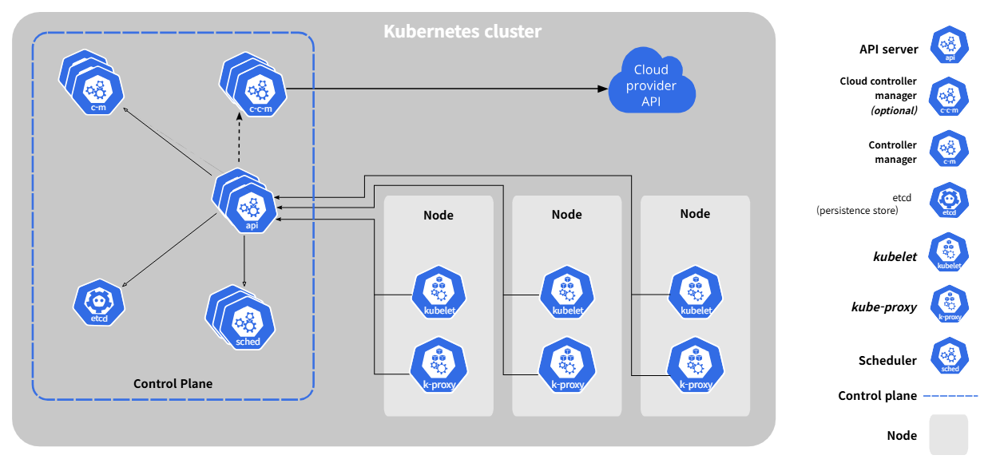

컨테이너화 된 어플리케이션을 실행하고 관리하는 `노드`가 있는데, 이 노드들의 집합을 말하며, 모든 클러스터는 최소 한 개의 워커 노드를 가져야 한다. 

**컨테이너선 비유로 이해하기:**
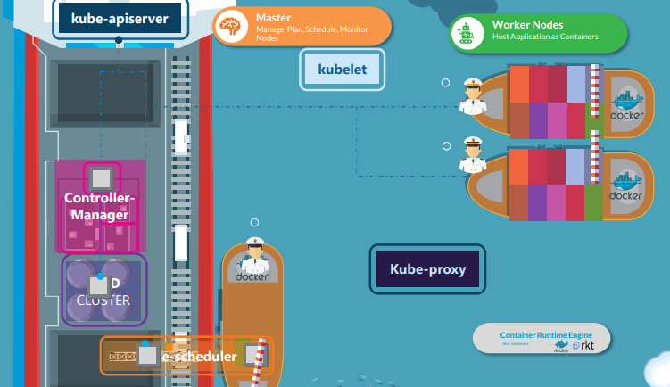  
*출처: Certified Kubernetes Administrator (CKA) with Practice Tests
(Mumshad Mannambeth), udemy*  
- **마스터 노드**: 대형 컨테이너선의 선장실과 같다. 전체 항해 계획을 세우고, 어떤 컨테이너를 어느 배에 실을지 결정하며, 모든 배들의 상태를 모니터링한다.
  - **kube-apiserver**: 선장실의 통신 장비. 모든 명령과 정보가 이곳을 통해 전달된다.
  - **etcd**: 선장실의 항해 일지. 모든 중요한 정보와 상태를 기록하고 보관한다.
  - **kube-scheduler**: 화물 배치 담당자. 어떤 컨테이너를 어느 워커선에 실을지 최적의 배치를 결정한다.
  - **kube-controller-manager**: 선단 관리자. 각 배들이 계획대로 운항하는지 감시하고 문제 발생 시 조치를 취한다.

- **워커 노드**: 소형 컨테이너선들로, 실제로 컨테이너(애플리케이션)를 싣고 운반하는 역할을 한다. 선장실의 지시를 받아 컨테이너를 적재하고 목적지까지 안전하게 운송한다.
  - **kubelet**: 각 워커선의 선장. 마스터 노드의 지시를 받아 자신의 배에서 컨테이너를 관리한다.
  - **kube-proxy**: 항구의 교통 관제사. 네트워크 트래픽을 적절한 컨테이너로 안내한다.
  - **Container Runtime**: 실제 크레인과 같은 장비. 컨테이너를 배에 싣고 내리는 실질적인 작업을 담당한다.

- **Pod**: 컨테이너를 담는 가장 작은 화물 단위. 하나 이상의 컨테이너가 함께 묶여서 같은 목적지로 배송된다.
- **Service**: 항구의 안내소. 외부에서 특정 화물(Pod)을 찾을 때 정확한 위치를 알려주는 역할을 한다. 

## VM 설정하기

K8s는 Linux 기반에서 동작하기 때문에, 클러스터를 구성할 데스크탑의 WIN 11은 적합하지 않다.  
그래서 사용자는 다양한 가상화 도구 중 하나를 선정하여 환경을 구성해야 한다.

### 이미 WSL있는데 Ubuntu 에다가 하면 안되나?
단 하나의 환경으로는 여러 노드로 구성된 클러스터를 만드는 것이 까다롭기 때문에, `Hyper-V`, `VirtualBox`, `VMware Player` 와 같은 가상화 도구를 사용하는 것이 이후 확장성에 용이하다.

### VirtualBox 설치
Hyper-V는 Win Pro 옵션이므로, Home 버전 사용자이기 때문에 VirtualBox를 사용할 예정이다.

다만 성능을 고려했을 때 VirtualBox는 OS에 종속되어 제약사항이 많으므로,(Hyper-V는 Level1, VirtualBox는 Level2 Hypervisor다) 이후 버전업을 고려중이다.

먼저 [공식 홈페이지](https://www.virtualbox.org/wiki/Downloads)에서 설치파일을 다운받자.
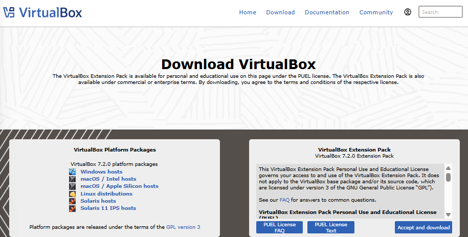

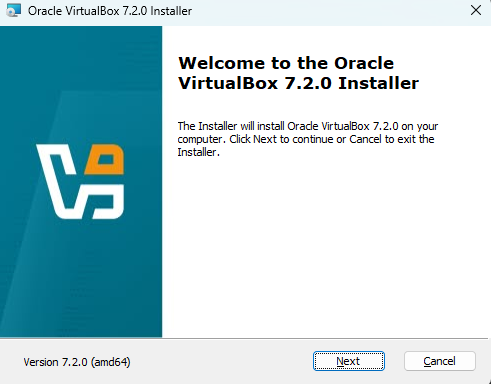
* 주의사항: VirtualBox 설치 중 인터넷 접속환경이 해제되므로, 온라인 작업물이 있다면 정리한 후에 시작해야 한다.

### Ubuntu Server 이미지 파일 다운
VM에 올려줄 Ubuntu Server 최신버전의 .iso 파일을 [공식 홈페이지](https://ubuntu.com/download/server)에서 다운로드한다.
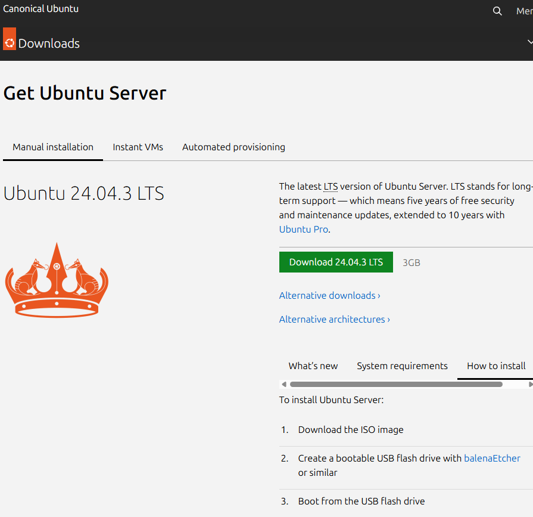

### VM 생성 및 설정 (마스터 노드)
마스터노드의 VM을 생성해보자.

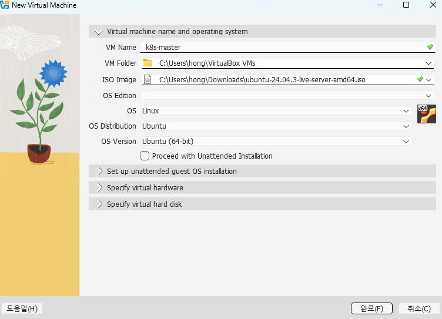
*여기서 **Ubuntu 수동 설치를 위해 Proceed with Unattended Installation**을 체크 해제해 준다.*

이 방법은 설치 중 SSH install을 위해 하는 방법인데, 체크해제하지 않을 경우에는 Ubuntu가 자동 설치 / 실행되고. 그 이후에 
```bash
sudo apt update
sudo apt install openssh-server
```
명령어들을 통해서 직접 설치해주면 된다.

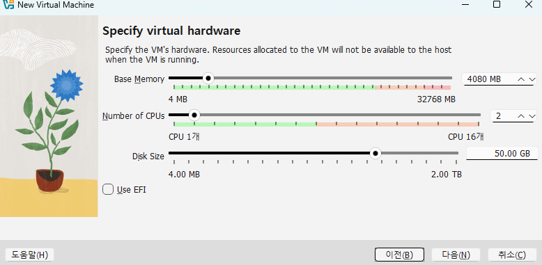
`새로 만들기`를 눌러 이름 및 운영체제, 하드웨어, 가상하드디스크를 설정하고 완료하자.

#### 여기서 잠깐! 스펙 선정 배경
CPU 2코어, 메모리 4GB, 용량 50GB에 대해서 설명하자면.

워커 노드는 우리가 배포할 애플리케이션(POD)가 실제로 실행되는 공간이라고 생각하면 된다. 

CPU가 단일코어와 2개 이상의 코어일 경우를 비교하면
- **1코어**: 운영체제와 K8s의 기본 프로세스가 CPU를 대부분 점유해서 제대로 동작하지 않을 가능성이 높음.
- **2코어 이상**:  
  1개 코어: 운영체제(Ubuntu)와 K8s의 에이전트(Kublet, kube-proxy, containerd 등)이 노드를 관리하기 위해 사용  
  나머지 코어: 배포한 애플리케이션(Nginx, DB, 직접 만든 프로그램 등)이 사용

메모리의 경우도 비슷하다. 약 1~2GB는 운영체제와 K8s가 점유해야 하고, 나머지 공간에서 POD들이 동작해야 하기 때문에 적절한 학습 환경을 위해서 최소한을 잡아놓은 값이다. 

용량은 사실 줄여도 무방

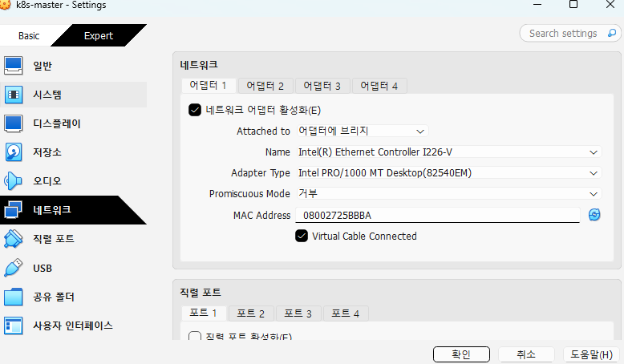
다시 콘솔로 돌아와서, 상단의 `설정` 버튼을 눌러 네트워크에서 어댑터 1탭에서의 다음에 연결됨을 `어댑터에 브리지` 로 변경하고, `실제 사용하는 랜카드` 를 선택하자.


시작을 눌러 VM을 켜주게 되면 아래와 같은 메뉴화면을 보게 된다.

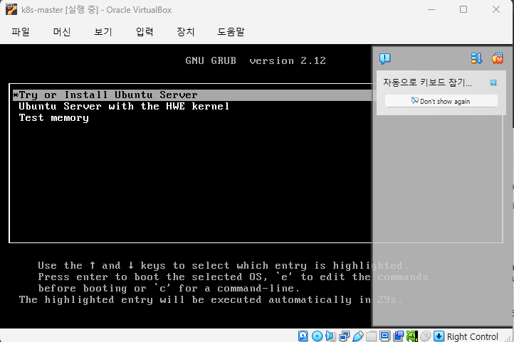

이후 언어, 네트워크, 프록시, mirror, 저장장치 설정 등 계속 창이 뜨는데,
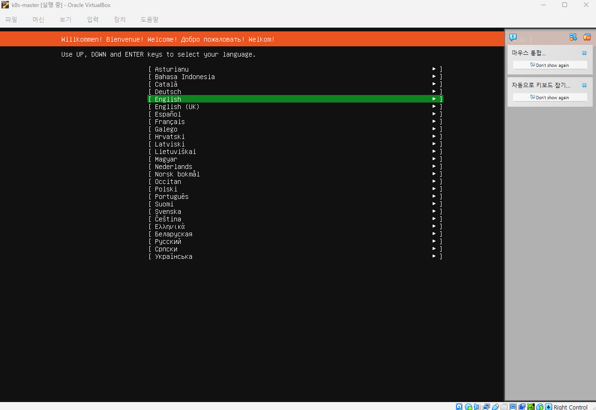
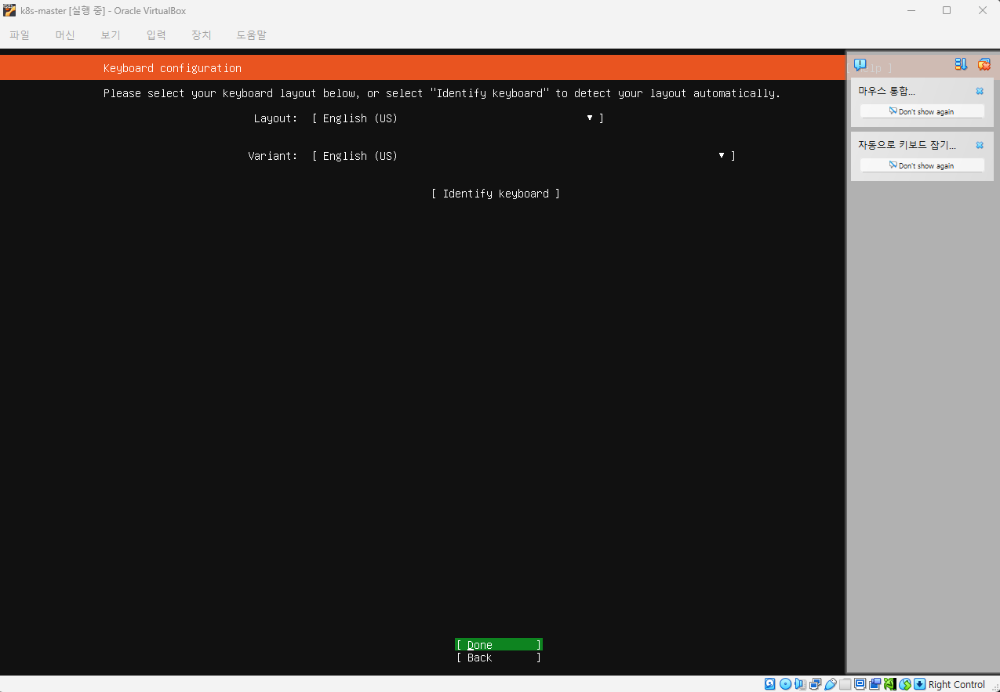
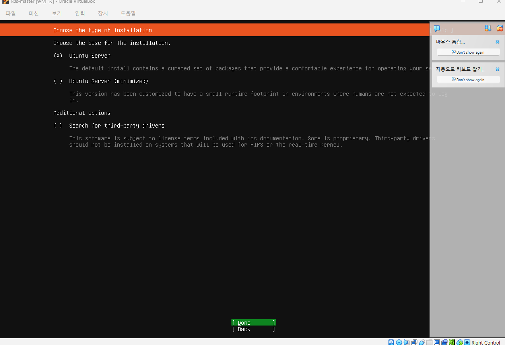
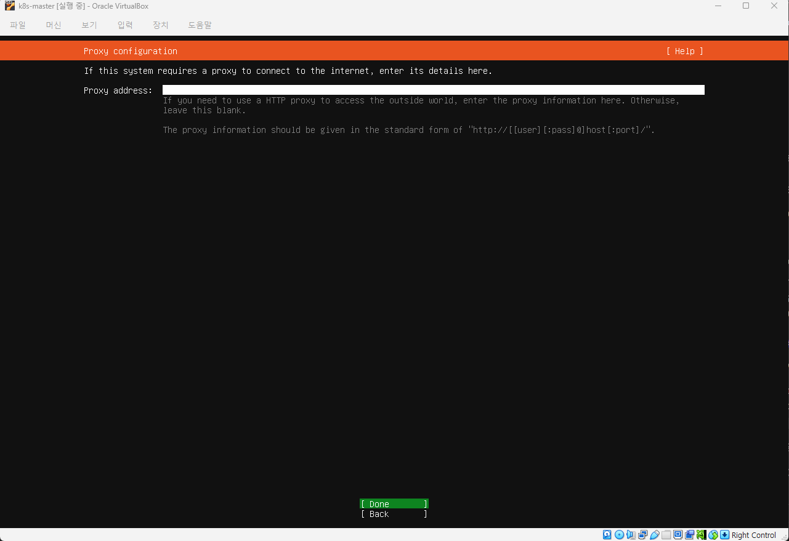

`Done`를 엔터해 사용자 설정창이 뜰 때까지 넘기자.

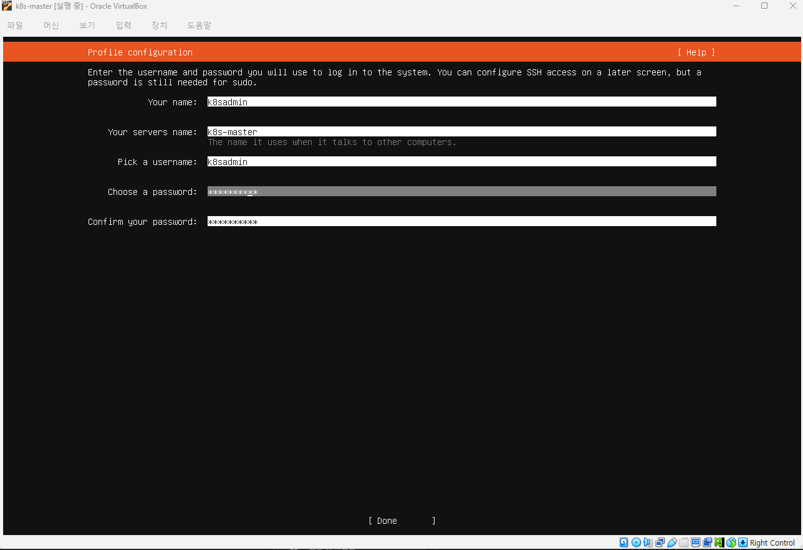
이곳에서 사용자 이름, 서버이름, 계정ID / PW를 설정하자.

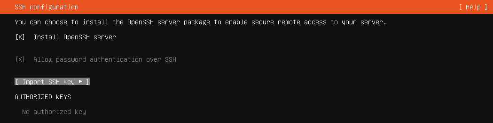

`Install OpenSSH server` 를 꼭 체크해서 설치하자.

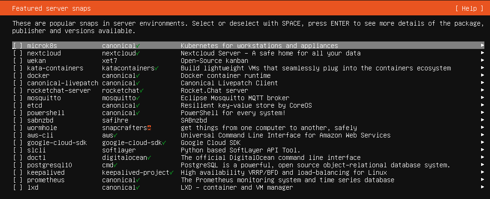

추천 서버 프로그램 선택창인데, 편의성 위주의 제품들이 올라와 있다. 다만 여기서 docker나, microk8s를 미리 설치하게 되면 이후 containerd나 kubeadm을 사용할 때 충돌이 있거나 동작방식에 있어 차이가 있기 때문에 혼란이 생길 수 있다.

Done을 눌러 넘어가면, Ubuntu를 설치하기 시작한다. 상단문구가 Installation Complete로 변경되고 하단에 Reboot Now 선택지가 생기면 바로 재부팅하자.

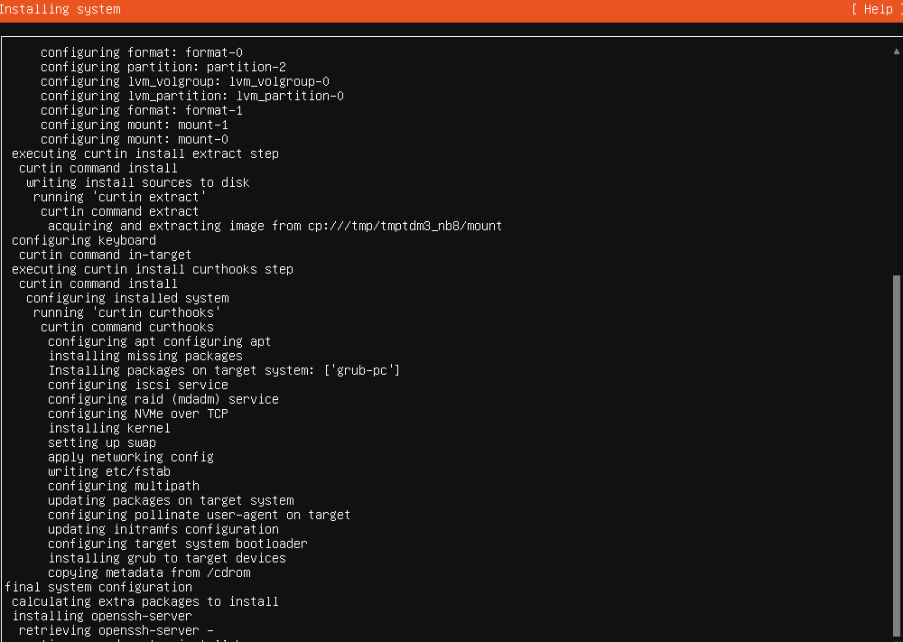

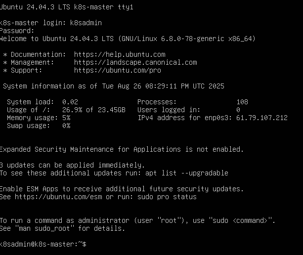

마스터노드의 준비가 완료되었다.
똑같은 방법으로 워커노드도 만들어보자.

### 간편하게 복제하기 (워커 노드)
위 방법으로 워커 노드를 만들어도 되지만, 기존 마스터노드를 복제 > 사용자명 변경만 하는 방식으로 단순하게 처리 가능하다.

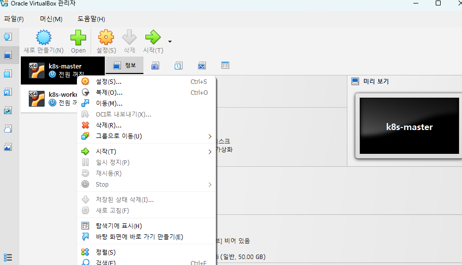
마스터노드를 먼저 종료한 후, 우클릭 -> 복제를 누르자.

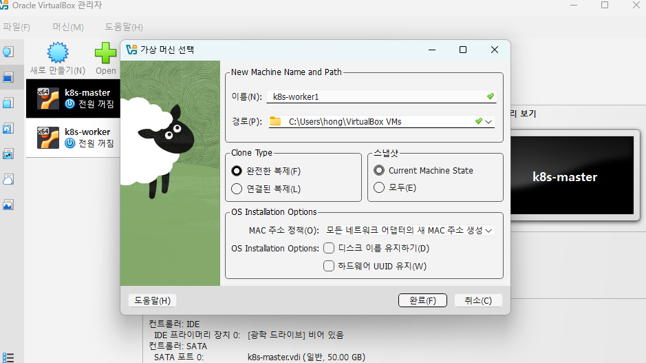
이름을 변경하고, 네트워크 정책을 **모든 네트워크 어댑터의 새 MAC 주소 생성**으로 바꾸고 `완료` 를 누르면 새로운 워커노드가 복제된다.

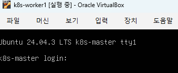
복제한 worker를 실행하면, `k8s-master`이름이 그대로 복제되어 ubuntu 로그인창을 띄운다. 일단 로그인하자.

```bash
sudo hostnamectl set-hostname k8s-worker1
```
명령어를 실행하고 재부팅(`reboot` 입력)하면 컴퓨터 이름을 바꿀 수 있다.

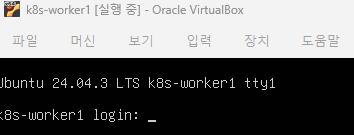

자 이제 2대의 VM을 생성함으로써, 최소한의 클러스터링을 위한 인프라가 갖춰진 상태다.

### 고정 IP주소 할당
이제 모든 VM에 각기 다른 고유 IP를 할당하여 각 노드가 서로 통신을 하고, 외부에서 사용자가 접속하기 위한 사전 작업을 해야 한다.

#### VM에 고정 
> 선택사항: VM에서 `ip a` 명령어로 IP를 확인하고 윈도우에서 SSH로 연결하면 복사 / 붙여넣기 등의 편의성을 가진 채 작업할 수 있다.  
> 
> SSH 연결은 터미널에서 `유저이름(ex. k8sadmin)@ip주소` 로 연결할 수 있다.


```bash
sudo nano /etc/netplan/00-installer-config.yaml
```
각 노드 내부에서 `netplan` 설정 파일을 열고, yaml 파일을 생성하자.

```yaml
network: # 네트워크 설정 정의 선언
  ethernets: # 이더넷 장치 설정 선언, 만일 WiFi일 경우 wifis: 가 된다
    enp0s3: # 랜카드 이름. 컴퓨터마다 다르며, VirtualBox는 enp0s3을 사용
      dhcp4: no # DHCP는 공유기에서 IP를 자동으로 받아오는 기능. 
                # 이를 no 로 하면서 자동할당은 거부하고 수동으로 지정하는 것을 선언
      addresses: [192.168.0.20/24] # 마스터는 .20 워커는 .21
      routes: # 라우팅 규직 선언
        - to: default
          via: 192.168.0.1 # 모든 트래픽은 이 
      nameservers:
        addresses: [8.8.8.8, 1.1.1.1]
```

#### `network:`

  * 이 파일이 네트워크 설정을 정의한다는 것을 선언하는, 가장 최상위의 시작점

#### `ethernets:`

  * 이 서버에 연결된 **'유선 랜카드(이더넷 장치)'** 들에 대한 설정을 시작하겠다는 의미. 만약 Wi-Fi 설정을 한다면 `wifis:` 라는 항목이 대신 들어간다.

#### `enp0s3:`

  * `ethernets` 아래에 들여쓰기 되어 있으니, 이것이 바로 랜카드의 이름(인터페이스 명).
  * 이 이름은 컴퓨터마다 조금씩 다를 수 있다. VirtualBox 환경에서는 보통 `enp0s3` 라는 이름을 사용한다. '첫 번째 이더넷 포트' 정도로 이해하면 된다.

#### `dhcp4: no`

  * 이것이 **고정 IP 설정의 핵심**
  * **DHCP**는 공유기로부터 IP 주소를 자동으로 받아오는 기능이다.
  * `dhcp4: yes` 라면 "IP 주소를 자동으로 받아오겠다"는 의미. (기본값)
  * `dhcp4: no` 라고 설정함으로써, "이제부터 자동 할당은 거부하고, 내가 직접 수동으로 IP 주소를 지정하겠다"라고 선언하는 것.

#### `addresses: [192.168.0.20/24]`

  * `dhcp4: no` 라고 선언했으니, 어떤 주소를 쓸지 직접 알려줘야 함
  * `addresses:` 는 이 랜카드에 할당할 **고정 IP 주소**를 지정하는 항목
  * `192.168.0.20` 이 바로 우리가 이 서버(`k8s-master`)에게 부여하는 새로운 집 주소다.
  * `/24` 는 '서브넷 마스크(Subnet Mask)'를 표현하는 방식

#### `routes:`

  * '라우트(Route)'는 **'경로'** 즉, 이 서버가 인터넷 세상으로 나가는 \*\*'길'\*\*을 알려주는 설정입니다.
  * `- to: default`: `default`는 '그 외 모든 곳'을 의미합니다. 즉, 목적지가 어디든 상관없이 모든 인터넷 트래픽에 대한 규칙을 정하겠다는 뜻입니다.
  * `via: 192.168.0.1`: "모든 인터넷 트래픽은 `192.168.0.1` 이라는 문을 **'거쳐서(via)'** 나가라"는 의미입니다. `192.168.0.1`은 보통 우리 집 **공유기(게이트웨이)** 의 주소입니다. 즉, 공유기를 통해 인터넷에 접속하라고 알려주는 것입니다.

#### `nameservers:`

  * 우리는 보통 `google.com` 처럼 주소를 입력하지, `172.217.25.238` 같은 IP 주소를 외워서 쓰지 않습니다.
  * **네임서버(Nameserver)** 는 `google.com` 같은 도메인 주소를 실제 IP 주소로 번역해주는 '인터넷 전화번호부' 역할을 합니다.
  * `addresses: [8.8.8.8, 1.1.1.1]`: "만약 모르는 주소가 있으면, `8.8.8.8`(구글 DNS)이나 `1.1.1.1`(클라우드플레어 DNS)에게 물어봐라" 라고 DNS 서버의 주소를 직접 지정해주는 것입니다.

#### `version: 2`

  * `netplan` 설정 파일의 버전을 명시하는 부분이다. 그냥 항상 `2`라고 생각하면 된다.

## 참고자료

[K8s 공식문서: 쿠버네티스 컴포넌트](https://kubernetes.io/ko/docs/concepts/overview/components/)